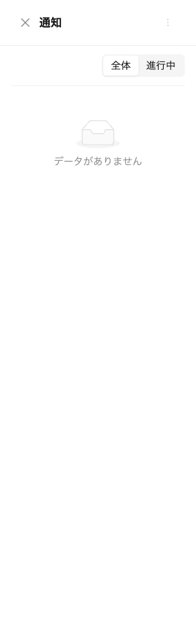
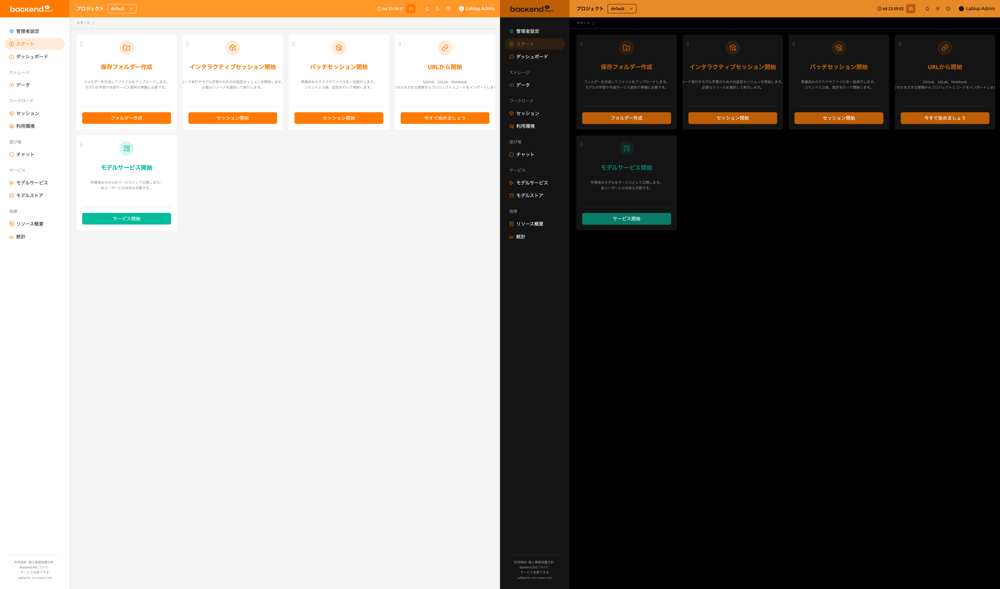
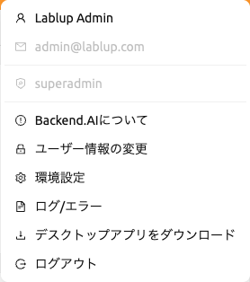
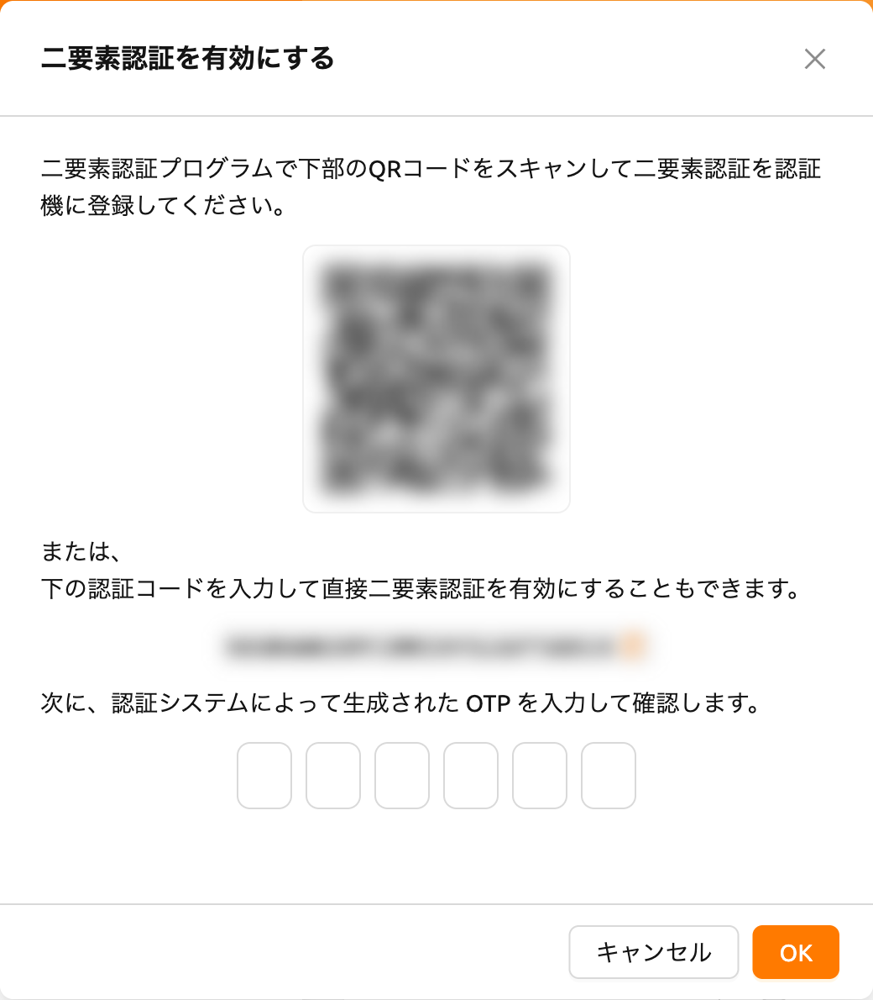
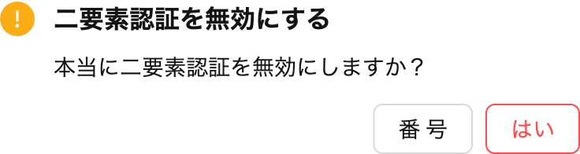

# トップバー機能

トップバーには、WebUIの使用をサポートするさまざまな機能が含まれています。

## プロジェクトセレクター

トップバーのプロジェクトセレクターを使用して、プロジェクトを切り替えることができます。各プロジェクトには異なるリソースポリシーが設定されている場合があるため、プロジェクトを切り替えると利用可能なリソースポリシーも変更される場合があります。

## ログインセッションタイマー

ログインセッション管理が有効な場合、トップバーに自動ログアウトまでの残り時間と延長ボタンが表示されます。タイマーは`HH:mm:ss`形式で表示され、24時間以上の場合は日数も併せて表示されます。

タイマーの横にある延長ボタン（リピートアイコン）をクリックすると、セッションの有効期限がリセットされ、ログインセッションが延長されます。

:::note
ログインセッションタイマーは、サーバーがログインセッション延長をサポートし、システム設定で有効化されている場合のみ表示されます。
:::

## 通知

ベル型のボタンは、イベント通知ボタンです。WebUIの操作中に記録する必要があるイベントがここに表示されます。コンピュートセッションの作成など、バックグラウンドタスクが実行されている場合、ここでジョブを確認できます。
ショートカットキー(`]`)を押して通知エリアを開閉できます。

## テーマモード

ヘッダーの右側にあるダークモードボタンを使って、WebUIのテーマモードを変更できます。

## ヘルプ

疑問符ボタンをクリックすると、本ガイドドキュメントのウェブ版にアクセスできます。現在表示しているページに応じて、適切なドキュメントに自動的に移動します。

## レスポンシブレイアウト

画面幅が狭い場合、トップバーは使いやすさを向上させるためにレイアウトを調整します。画面幅が狭くなると、サイドバートグルの代わりにメニューアイコンボタンがトップバーに表示されます。ユーザーの表示名が非表示になり、ユーザーメニューにはアバターアイコンのみが表示される場合があります。非常に小さい画面では、プロジェクトのラベルテキストも非表示になります。

## ユーザーメニュー

トップバーの右側にあるユーザーアイコンをクリックすると、ユーザーメニューが表示されます。

ドロップダウンの上部には、以下のユーザー情報が表示されます。これらの項目はクリックできない参考情報です。

- **フルネーム**: 現在のユーザーのフルネーム。
- **メール**: 現在のユーザーのメールアドレス。
- **ロール**: 現在のユーザーのロール（例: ユーザー、ドメイン管理者、スーパー管理者）。

ユーザー情報の下には、以下のアクション項目があります。

- `Backend.AIについて`: Backend.AI WebUIのバージョン、ライセンスの種類などの情報を表示します。
- `ユーザー情報の変更`: 現在ログインしているユーザーの情報を確認・更新します。
- `環境設定`: ユーザー設定ページへ移動します。
- `ログ/エラー`: ユーザー設定ページのログタブに移動します。クライアント側に記録されたログとエラーの履歴を確認できます。
- `デスクトップアプリをダウンロード`: 使用プラットフォーム向けのスタンドアロンWebUIアプリをダウンロードします。このオプションは管理者が有効にした場合のみ表示されます。
- `ログアウト`: WebUIからログアウトします。

### ユーザー情報の変更

`ユーザー情報の変更`をクリックすると、ユーザー情報の変更ダイアログが表示されます。

各項目には以下の意味があります。希望する値を入力し、更新ボタンをクリックして
ユーザー情報を更新します。

- **フルネーム**: ユーザーの名前（最大64文字）。
- **元のパスワード**: 現在のパスワードです。このフィールドはBackend.AI 26.4.0 より前の
  バージョンのサーバーに接続している場合にのみ表示され、そのようなサーバーで新しい
  パスワードを設定する際に入力が必要です。
- **新しいパスワード**: 新しいパスワード（英字、数字、記号をそれぞれ1つ以上含む
  8文字以上）。目のアイコンをクリックすると入力内容を確認できます。
- **新しいパスワードを再入力）**: 確認のため、新しいパスワードを再度入力します。
- **許可されたクライアントIP**: 特定のIPアドレスまたはCIDR範囲でログインアクセスを
  制限します。1つ以上のIPアドレスまたはCIDR表記（例：`10.20.30.40`、
  `10.20.30.0/24`）を入力できます。フィールドの下には、現在のクライアントIP
  アドレスがコピーボタンとともに表示されます。設定されたリストに現在のIPが
  含まれていない場合、警告が表示されます。
- **二要素認証の使用**: 二要素認証（2FA）を有効または無効にします。有効にすると、
  ログイン時にOTPコードの入力が必要になります。

:::note
**許可されたクライアントIP**フィールドは、Backend.AI 26.4.0 以降で利用できます。
:::

:::note
プラグインの設定によっては、`二要素認証の使用`項目が表示されない場合があります。
その場合は、システム管理者に連絡してください。
:::

### 2FA設定

`2FA Enabled`スイッチを有効にすると、次のダイアログが表示されます。

使用している2FAアプリケーションを起動し、QRコードをスキャンするか、手動で検証コードを入力します。2FA対応のアプリケーションには、Google Authenticator、2STP、1Password、Bitwardenなどがあります。

2FAアプリケーションに追加された項目から6桁のコードを上記のダイアログに入力します。`確認`ボタンを押すと、2FAが有効になります。

後でログインする際に、メールアドレスとパスワードを入力すると、OTPコードを求める追加フィールドが表示されます。

ログインするには、2FAアプリケーションを開き、ワンタイムパスワードフィールドに6桁のコードを入力する必要があります。

2FAを無効にするには、`2FA Enabled`スイッチをオフにし、表示されるダイアログで確認ボタンをクリックします。
