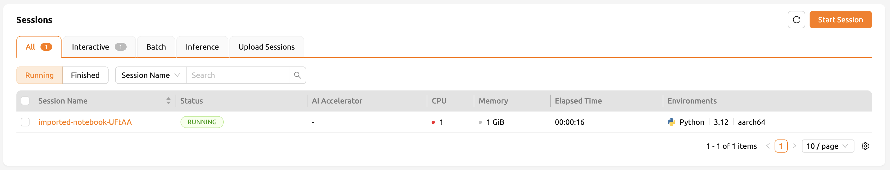
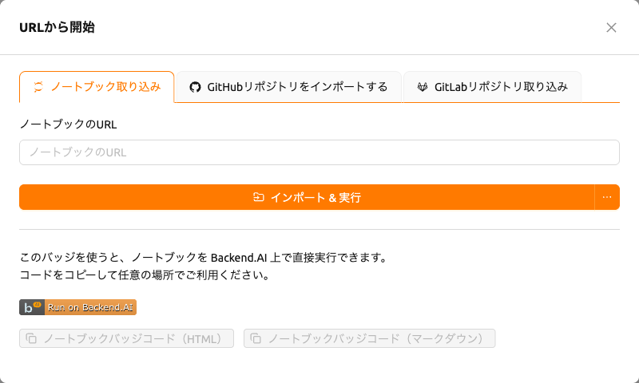
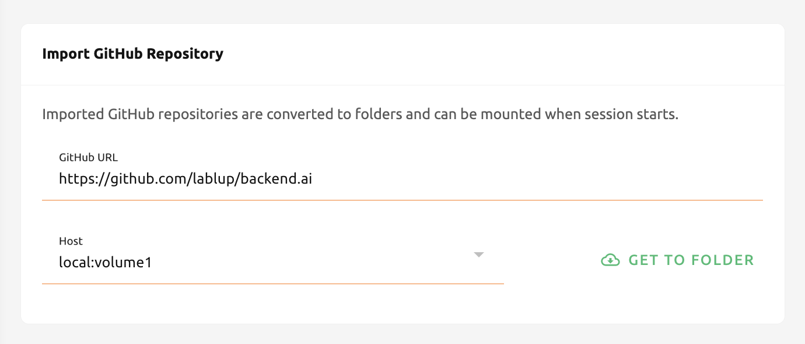

# ノートブックとウェブベースのGitリポジトリをインポートして実行

「インポート & 実行」ページでは、Jupyterノートブックファイルをその場で実行したり、GitHubやGitLabなどのウェブベースのGitリポジトリをインポートしたりできます。ローカルストレージで直接作成したり、ダウンロードして再アップロードしたりする必要はありません。有効なURLを入力し、各機能に対応するパネルの右側にあるボタンをクリックするだけです。

## Jupyterノートブックをインポートして実行する

Jupyterノートブックファイルをインポートして実行するには、ノートブックファイルの有効なURLが必要です。GitHub上のJupyterノートブックを実行したい場合は、入力フィールドに該当ファイルのURLをコピー＆ペーストし、`インポート & 実行` ボタンをクリックします。

:::note
ローカルアドレスのJupyterノートブックファイルをインポート＆実行しようとする場合、それは無効と見なされます。localhostで始まらないURLを入力してください。
:::

ボタンをクリックするとダイアログが表示されます。このダイアログは、セッションページや要約ページでセッションを開始するときと同じセッションランチャーです。ノートブックのインポートと新しいセッションの開始の違いは、ノートブックのインポート時にはURL内のJupyterノートブックが自動的にインポートされる点です。その他は同じです。必要に応じて環境とリソースの割り当てを設定してから、`開始` ボタンをクリックします。

:::note
`開始` ボタンをクリックする前にポップアップブロッカーを解除しておくと、実行中のノートブックウィンドウをすぐに確認できます。また、セッションを実行するのに十分なリソースがない場合、インポートされたJupyterノートブックは実行されません。
:::

セッションページでインポート操作が正常に完了したことを確認できます。

## 実行可能なJupyterノートブックボタンの生成

Jupyter notebook URLに対するHTMLまたはMarkdownボタンを生成することもできます。有効なJupyter notebook URLを入力し、`作成する` ボタンをクリックします。ノートブックでセッションを生成するリンクを含むコードブロックが表示されます。このバッジコードをGitHubリポジトリや、HTMLまたはMarkdownをサポートする場所に挿入して使用できます。

:::note
ボタンをクリックする前にアカウントにログインしている必要があります。そうでない場合は、まずログインしてください。
:::

## GitHubリポジトリのインポート

GitHubリポジトリのインポートは、Jupyterノートブックのインポート & 実行と似ています。GitHubリポジトリのURLを入力し、`フォルダに移動` ボタンをクリックするだけです。複数のストレージホストにアクセスできる場合は、リストから1つを選択できます。

:::note
セッションを開始するのに十分なリソースがない場合やフォルダ数が上限に達している場合、リポジトリのインポートは失敗します。リポジトリをインポートする前に、リソース統計パネルとデータ & ストレージページを確認してください。
:::

リポジトリがその名前のストレージフォルダとして正常にインポートされたことを確認できます。

## GitLabリポジトリのインポート

22.03 バージョンから、Backend.AIはGitLabからのインポートをサポートします。[GitHubリポジトリのインポート](#importing-github-repositories) とほぼ同じですが、インポートするブランチ名を明示的に設定する必要があります。

:::note
同じ名前のストレージフォルダがすでに存在する場合、システムはインポートしたリポジトリのフォルダ名に `_`（アンダースコア）と数字を追加します。
:::
