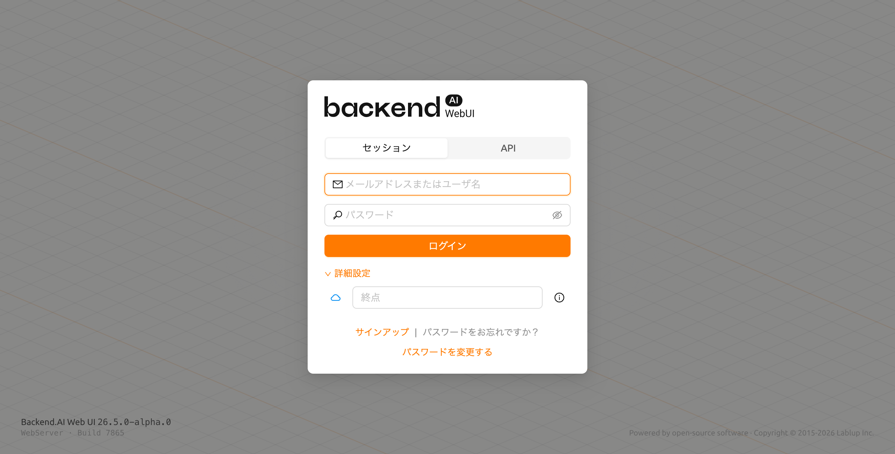
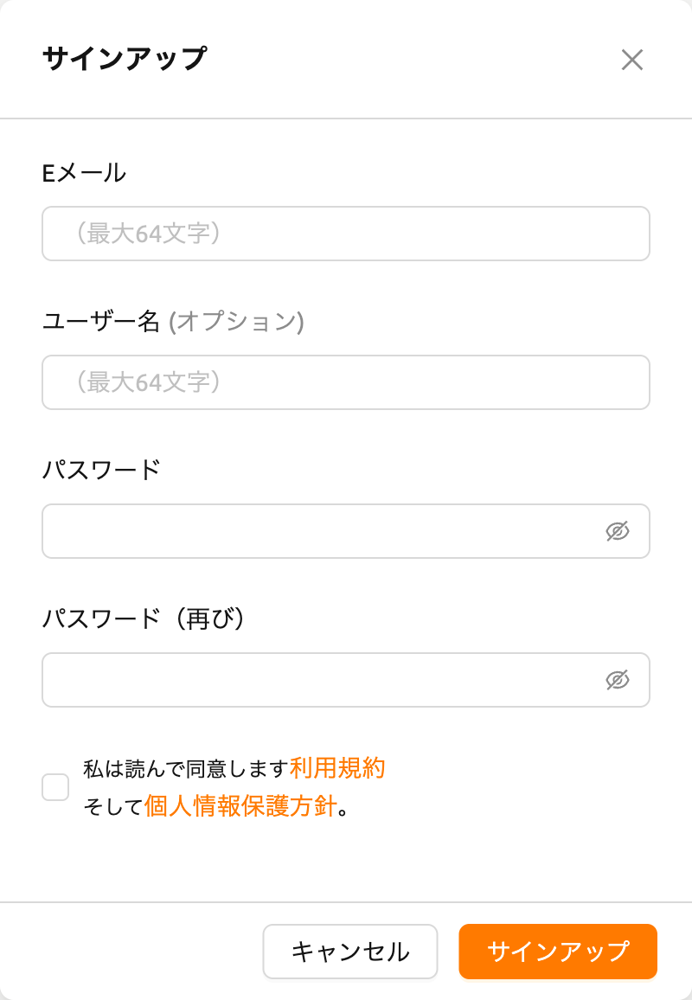
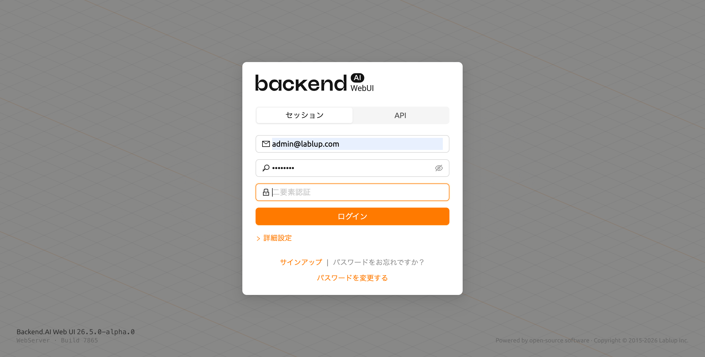
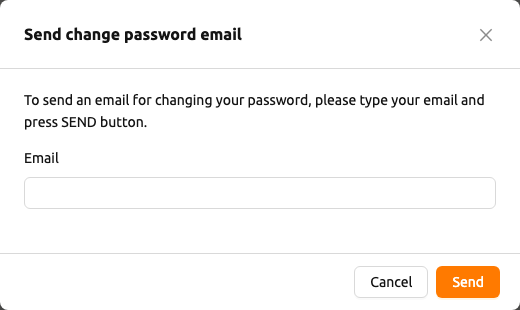
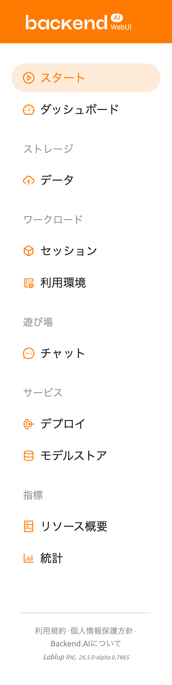

# サインアップとログイン

## サインアップ

WebUIを起動すると、ログインダイアログが表示されます。まだサインアップしていない場合は、ダイアログの下部にある`サインアップ`リンクをクリックしてください。

必要な情報を入力し、利用規約/プライバシーポリシーを読み同意した上で、SIGNUPボタンをクリックしてください。システム設定によっては、サインアップに招待トークンを入力する必要がある場合があります。メールアドレスが本人のものであることを確認するための確認メールが送信されることがあります。確認メールが送信された場合は、メールを読んでリンクをクリックし、検証を通過してからアカウントでログインする必要があります。

:::note
サーバーの構成およびプラグインの設定によっては、匿名ユーザーによるサインアップが許可されていない場合があります。その場合は、システムの管理者に連絡してください。
:::

:::note
悪意のあるユーザーがパスワードを推測するのを防ぐために、パスワードは8文字以上で、少なくとも1つのアルファベット、数字、特殊文字を含む必要があります。
:::

## ログイン

メールアドレス（またはユーザー名）とパスワードを入力し、**Login**ボタンをクリックします。

### 接続モード

管理者が有効にしている場合、ログインダイアログの上部に**セッション**モードと**API**モードを選択できるモードセレクターが表示されます。

- **セッション**: 標準的なログインモードです。メールアドレス/ユーザー名とパスワードを入力して認証します。ほとんどのユーザーにとってデフォルトのモードです。
- **API**: APIキーペアを使用してログインします。メールアドレスとパスワードの代わりに**API Key**と**Secret Key**を入力します。プログラムからのアクセスに便利です。

### APIエンドポイント

**詳細設定**リンクをクリックすると、エンドポイント設定セクションが展開されます。APIエンドポイントフィールドに、リクエストをManagerに中継するBackend.AI WebserverのURLを入力します。

:::note
Webサーバーのインストールおよびセットアップ環境によっては、エンドポイントが固定されており、設定ができない場合があります。
:::

:::note
Backend.AIは、ユーザーのパスワードを一方向ハッシュを通じて安全に保持します。BSDのデフォルトパスワードハッシュであるBCryptが使用されるため、サーバーの管理者でもユーザーのパスワードを知ることはできません。
:::

### SSOログイン (SAML / OpenID)

管理者がSSO（シングルサインオン）を設定している場合、標準の**Login**ボタンの下に追加のログインボタンが表示されることがあります。

- **SAMLログイン**: 組織のSAML IDプロバイダーを使用して認証します。
- **[Realm名]ログイン**: OpenID Connectプロバイダーを使用して認証します。ボタンのラベルには管理者が設定したrealm名が表示されます。

該当するSSOボタンをクリックすると、組織のIDプロバイダーにリダイレクトされ、認証が行われます。

:::note
SSOログインオプションは、システム管理者が有効にした場合のみ表示されます。
:::

### OTPログイン (二要素認証)

アカウントで二要素認証(2FA)が有効になっている場合、メールアドレスとパスワードを入力した後にOTP（ワンタイムパスワード）フィールドが追加で表示されます。

認証アプリケーション（Google Authenticator、1Password、Bitwardenなど）を開き、OTPフィールドに6桁のコードを入力するとログインが完了します。

### 初回ログイン時のTOTP設定

管理者が二要素認証を必須に設定しており、まだTOTPを設定していない場合、初回ログイン成功後に自動的に設定ダイアログが表示されます。認証アプリケーションでQRコードをスキャンするか、提供されたキーを手動で入力し、6桁の認証コードを入力すると設定が完了します。

TOTP設定後は、毎回のログイン時にOTPコードの入力が必要になります。

:::note
アカウント設定での2FAの有効化・無効化の詳細については、トップバー機能の[2FA設定](#2fa-setup)セクションを参照してください。
:::

ログイン後、スタートページで現在のリソース使用状況などの情報を確認できます。

右上のユーザーアイコンをクリックすると、ユーザーメニューが表示されます。**ログアウト**メニューを選択するとログアウトできます。

## パスワードを忘れた場合

パスワードを忘れた場合、ログインパネルの**パスワードをお忘れですか？**テキストの横にある**パスワードを変更する**リンクをクリックします。メールアドレスを入力するダイアログが表示され、パスワード変更リンクが記載されたメールを受け取ることができます。メールの指示に従ってパスワードをリセットしてください。

:::note
サーバーの設定によっては、パスワード変更機能が利用できない場合があります。その場合は、管理者に連絡してください。
:::

:::warning
ログイン失敗が10回以上連続して発生した場合、セキュリティ上の理由からエンドポイントへのアクセスが20分間一時的に制限されます。20分後もアクセス制限が続く場合は、システム管理者に連絡してください。
:::

## サイドバーメニュー

サイドバーの右側にあるボタンを使って、サイドバーのサイズを変更できます。ボタンをクリックすると、サイドバーの幅が大幅に縮小され、コンテンツをより広く表示できます。もう一度クリックすると、サイドバーは元の幅に戻ります。
ショートカットキー ( `[` ) を使用して、サイドバーの狭い幅と元の幅を切り替えることもできます。

