<a id="model-serving"></a>

# モデルサービング

## モデルサービス


:::note
この機能はエンタープライズ版でのみサポートされています。
:::

Backend.AIは、モデル学習フェーズにおける開発環境の構築とリソース管理を支援するだけでなく、
バージョン23.09以降、モデルサービス機能もサポートしています。この機能により、
エンドユーザー（AIベースのモバイルアプリやウェブサービスバックエンドなど）は、
完成したモデルを推論サービスとしてデプロイしたい場合に、推論APIコールを実行できます。

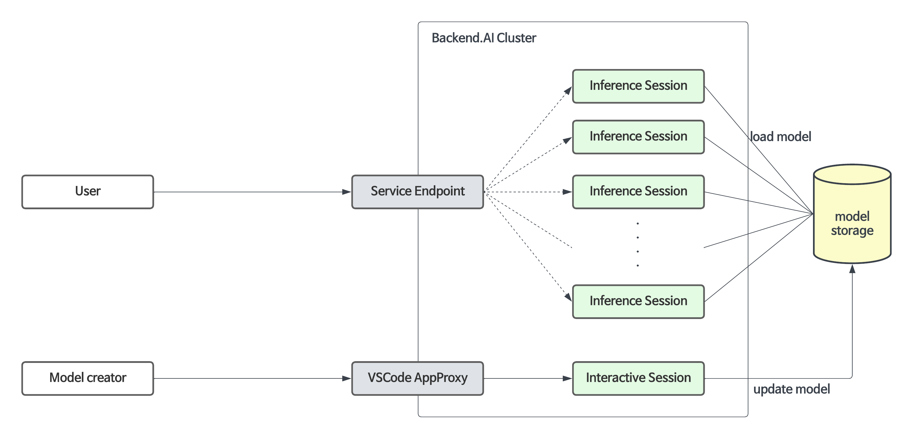

モデルサービスは、既存のトレーニングコンピュートセッションの機能を拡張し、自動メンテナンス、スケーリング、および本番サービスのための永続的なポートとエンドポイントアドレスのマッピングを可能にします。開発者または管理者は、モデルサービスに必要なスケーリングパラメータを指定するだけでよく、コンピュートセッションを手動で作成または削除する必要はありません。

## バージョン23.03以前でのモデルサービスの設定と制限事項

モデルサービング専用機能はバージョン23.09から正式にサポートされていますが、
以前のバージョンでもモデルサービスを使用することは可能です。

例えば、バージョン23.03では、学習用のコンピュートセッションを次のように
変更することで、モデルサービスを設定できます：

1. モデルサービング用にセッション内で実行中のサーバーポートをマッピングするため、
   セッション作成時に事前開放ポートを追加します。
   （事前開放ポートの使用方法については、[事前開放ポートの設定](#set-preopen-ports)を参照してください。）

2. 事前開放ポートにマッピングされたサービスをパブリックアクセス可能にするため、
   「アプリを公開」にチェックを入れます。
   （「アプリを公開」の詳細については、[アプリを公開](#open-app-to-public)を参照してください。）

ただし、バージョン23.03には以下のような制限があります：

-  セッションは、アイドルタイムアウトやシステムエラーなどの外部要因で終了した場合、自動的に復旧しません。
-  セッションが再起動されるたびにアプリのポートが変更されます。
-  セッションが繰り返し再起動されると、アイドルポートが枯渇する可能性があります。

バージョン23.09の公式モデルサービス機能により、これらの制限が解決されました。
そのため、バージョン23.09以降では、可能な限りモデルサービングメニューを通じて
モデルサービスを作成・管理することを推奨します。事前開放ポートの使用は、
開発およびテスト目的でのみ推奨されます。

## モデルサービスの使用手順ガイド

モデルサービスを使用するには、以下の手順に従う必要があります：

1. モデル定義ファイルを作成します。
2. サービス定義ファイルを作成します。
3. 定義ファイルをモデルタイプフォルダーにアップロードします。
4. モデルサービスを作成/検証します。
5. （モデルサービスが公開されていない場合）トークンを取得します。
6. （エンドユーザー向け）モデルサービスに対応するエンドポイントにアクセスして、サービスを確認します。
7. （必要に応じて）モデルサービスを変更します。
8. （必要に応じて）モデルサービスを終了します。

<a id="model-definition-guide"></a>

#### モデル定義ファイルの作成

:::note
24.03以降、モデル定義ファイル名を設定できます。モデル定義ファイルパスで
他の入力フィールドを入力しない場合、システムは`model-definition.yml`または
`model-definition.yaml`と見なします。
:::

モデル定義ファイルには、推論セッションを自動的に開始、初期化、およびスケーリングするためにBackend.AIシステムで必要な構成情報が含まれています。これは推論サービスエンジンを含むコンテナイメージとは独立して、モデルタイプフォルダーに保存されます。これにより、特定の要件に基づいて異なるモデルをエンジンが提供できるようになり、モデルが変更されるたびに新しいコンテナイメージを構築してデプロイする必要がなくなります。ネットワークストレージからモデル定義とモデルデータをロードすることで、自動スケーリング中にデプロイメントプロセスを簡素化し、最適化できます。

モデル定義ファイルは次の形式に従います：

```yaml
models:
  - name: "simple-http-server"
    model_path: "/models"
    service:
      start_command:
        - python
        - -m
        - http.server
        - --directory
        - /home/work
        - "8000"
      port: 8000
      health_check:
        path: /
        interval: 10.0
        max_retries: 10
        max_wait_time: 15.0
        expected_status_code: 200
        initial_delay: 60.0
```

**モデル定義ファイルのキーと値の説明**

:::note
「(Required)」表示のないフィールドはオプションです。
:::

- `name` (Required): Defines the name of the model.
- `model_path` (Required): Addresses the path of where model is defined.
- `service`: Item for organizing information about the files to be served
  (includes command scripts and code).

   - `pre_start_actions`: `start_command`の前に実行されるアクションです。これらのアクションは、
     設定ファイルの作成、ディレクトリのセットアップ、初期化スクリプトの実行などによって環境を準備します。
     アクションは定義された順序で順次実行されます。

      - `action`: 実行するアクションのタイプ。利用可能なアクションタイプとそのパラメータについては
        [事前開始アクション](#prestart-actions)を参照してください。
      - `args`: アクション固有のパラメータ。各アクションタイプには異なる必須引数があります。

   - `start_command` (Required): Specify the command to be executed in model serving.
     Can be a string or a list of strings.
   - `port` (Required): Container port for the model service (e.g., `8000`, `8080`).
   - `health_check`: Configuration for periodic health monitoring of the model service.
     When configured, the system automatically checks if the service is responding correctly
     and removes unhealthy instances from traffic routing.

      - `path` (Required): HTTP endpoint path for health check requests (e.g., `/health`, `/v1/health`).
      - `interval` (default: `10.0`): Time in seconds between consecutive health checks.
      - `max_retries` (default: `10`): Number of consecutive failures allowed before marking
        the service as `UNHEALTHY`. The service continues receiving traffic until this threshold is exceeded.
      - `max_wait_time` (default: `15.0`): Timeout in seconds for each health check HTTP request.
        If no response is received within this time, the check is considered failed.
      - `expected_status_code` (default: `200`): HTTP status code that indicates a healthy response.
        Common values: `200` (OK), `204` (No Content).
      - `initial_delay` (default: `60.0`): Time in seconds to wait after container creation
        before starting health checks. This allows time for model loading, GPU initialization,
        and service warmup. Set higher values for large models (e.g., `300.0` for 70B+ LLMs).


**Understanding Health Check Behavior**

The health check system monitors individual model service containers and automatically
manages traffic routing based on their health status.

```
Container Created
│
▼
┌─────────────────────────────────┐
│  Wait for initial_delay (60s)   │  ← Model loading, GPU init, warmup
│  Status: DEGRADED               │
│  No health checks during this   │
└─────────────────────────────────┘
│
▼
Start Health Check Cycle
│
▼
┌─────────────────────────────────┐
│  Every interval (10s):          │
│  HTTP GET → path ("/health")    │
└─────────────────────────────────┘
│
▼
Wait up to max_wait_time (15s)
│
┌──────────┴──────────┐
▼                     ▼
Response              Timeout/Error
│                     │
▼                     │
Status ==             │
expected?             │
│                     │
┌──┴──┐               │
▼     ▼               │
Y     N               │
│     │               │
│     └───────┬───────┘
│             ▼
│        Consecutive
│        failures +1
│             │
▼             ▼
HEALTHY       Failures > max_retries?
(reset                │
failures)       ┌─────┴─────┐
                ▼           ▼
               Yes          No
                │           │
                ▼           ▼
            UNHEALTHY    Keep current
            (removed     status
            from traffic
            internally)
```

:::note
The internal health status (used for traffic routing) may not be immediately
synchronized with the status displayed in the user interface.
:::

**Time to UNHEALTHY**:

- Initial startup: `initial_delay + interval × (max_retries + 1)`

  Example with defaults: 60 + 10 × 11 = **170 seconds** (about 3 minutes)

- During operation (after healthy): `interval × (max_retries + 1)`

  Example with defaults: 10 × 11 = **110 seconds** (about 2 minutes)


<a id="prestart-actions"></a>

**Backend.AIモデルサービングでサポートされているサービスアクションの説明**


- `write_file`: 指定されたファイル名でファイルを作成し、内容を追加するアクションです。
  デフォルトのアクセス権限は `644` です。

   - `arg/filename`: ファイル名を指定
   - `body`: ファイルに追加する内容を指定
   - `mode`: ファイルのアクセス権限を指定
   - `append`: ファイルへの内容の上書きまたは追加を `True` または `False` で設定

- `write_tempfile`: 一時ファイル名（`.py`）でファイルを作成し、内容を追加するアクションです。
  モードの値が指定されていない場合、デフォルトのアクセス権限は `644` です。

   - `body`: ファイルに追加する内容を指定
   - `mode`: ファイルのアクセス権限を指定

- `run_command`: コマンドを実行した結果が、エラーも含めて以下の形式で返されます
  （`out`: コマンド実行の出力、`err`: コマンド実行中にエラーが発生した場合のエラーメッセージ）

   - `args/command`: 実行するコマンドを配列として指定（例：`python3 -m http.server 8080` コマンドは ["python3", "-m", "http.server", "8080"] になります）

- `mkdir`: 入力パスによってディレクトリを作成するアクションです

   - `args/path`: ディレクトリを作成するパスを指定

- `log`: 入力メッセージによってログを出力するアクションです

   - `args/message`: ログに表示するメッセージを指定
   - `debug`: デバッグモードの場合は `True`、それ以外は `False` に設定

#### モデル定義ファイルをモデルタイプフォルダーにアップロード

モデル定義ファイル（`model-definition.yml`）をモデルタイプフォルダーにアップロードするには、
バーチャルフォルダーを作成する必要があります。バーチャルフォルダーを作成する際は、
デフォルトの `general` タイプではなく `model` タイプを選択してください。
フォルダーの作成方法については、データページの[ストレージフォルダーの作成](#create-storage-folder)セクションを参照してください。

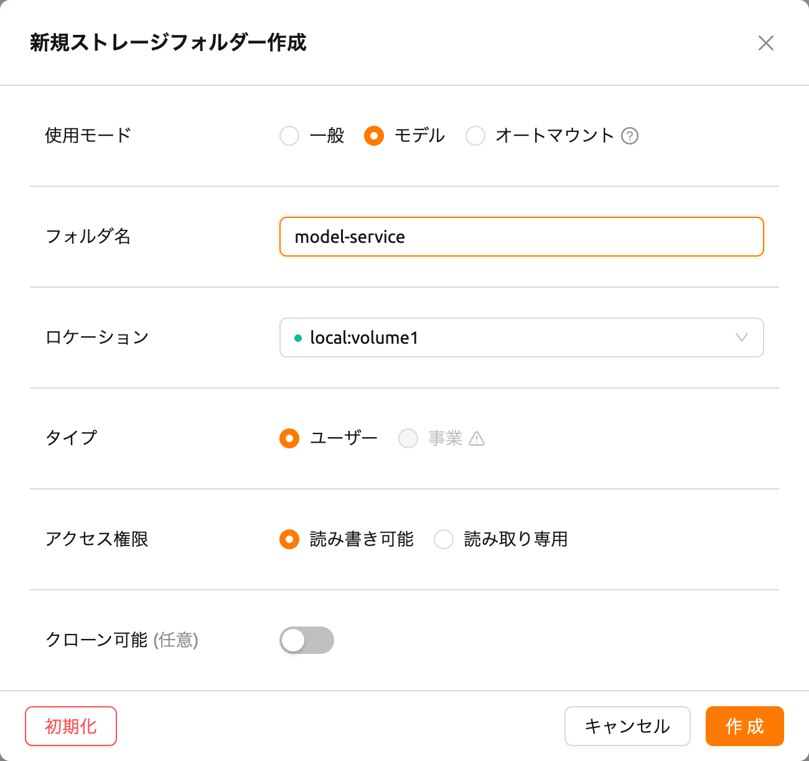

フォルダーを作成した後、データページの「MODELS」タブを選択し、
最近作成したモデルタイプフォルダーアイコンをクリックしてフォルダーエクスプローラーを開き、
モデル定義ファイルをアップロードします。
フォルダーエクスプローラーの使用方法については、[フォルダーの探索](#explore-folder)セクションを参照してください。

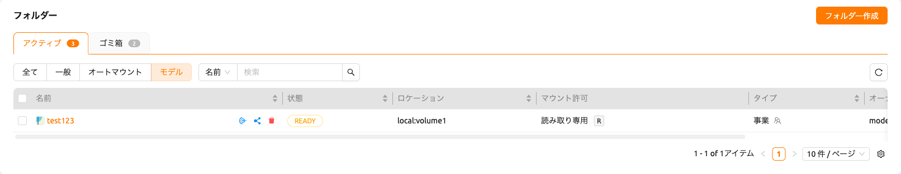

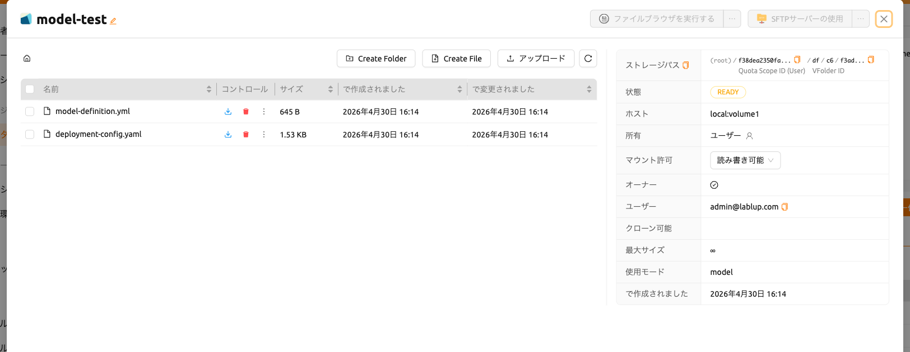

<a id="service-definition-file"></a>

#### サービス定義ファイルの作成

サービス定義ファイル（`service-definition.toml`）を使用すると、管理者はモデルサービスに必要なリソース、環境、およびランタイム設定を事前に構成できます。このファイルがモデルフォルダーに存在する場合、システムはサービスを作成する際にこれらの設定をデフォルト値として使用します。

`model-definition.yaml` と `service-definition.toml` の両方がモデルフォルダーに存在する必要があり、
これによりモデルストアページで「このモデルを実行」ボタンが有効になります。これら2つのファイルは
連携して動作します：モデル定義はモデルと推論サーバーの構成を指定し、サービス定義はランタイム環境、
リソース割り当て、および環境変数を指定します。

サービス定義ファイルは、ランタイムバリアントごとにセクションを整理したTOML形式に従います。各セクションはサービスの特定の側面を構成します：

```toml
[vllm.environment]
image        = "example.com/model-server:latest"
architecture = "x86_64"

[vllm.resource_slots]
cpu = 1
mem = "8gb"
"cuda.shares" = "0.5"

[vllm.environ]
MODEL_NAME = "example-model-name"
```


**サービス定義ファイルのキーと値の説明**

- `[{runtime}.environment]`: モデルサービスのコンテナイメージとアーキテクチャを指定します。

   - `image` (必須): 推論サービスに使用するコンテナイメージのフルパス（例：`example.com/model-server:latest`）。
   - `architecture` (必須): コンテナイメージのCPUアーキテクチャ（例：`x86_64`、`aarch64`）。

- `[{runtime}.resource_slots]`: モデルサービスに割り当てるコンピュートリソースを定義します。

   - `cpu`: 割り当てるCPUコアの数（例：`1`、`2`、`4`）。
   - `mem`: 割り当てるメモリ量。単位接尾辞をサポート（例：`"8gb"`、`"16gb"`）。
   - `"cuda.shares"`: 割り当てる分割GPU（fGPU）シェア（例：`"0.5"`、`"1.0"`）。キーにドットが含まれるため、この値は引用符で囲まれています。

- `[{runtime}.environ]`: 推論サービスコンテナに渡される環境変数を設定します。

   - ランタイムに必要な環境変数を定義できます。例えば、`MODEL_NAME` はどのモデルをロードするかを指定するために一般的に使用されます。


:::note
各セクションヘッダーの `{runtime}` プレフィックスは、ランタイムバリアント名
（例：`vllm`、`nim`、`custom`）に対応します。システムは、サービスを作成する際に
選択されたランタイムバリアントとこのプレフィックスを照合します。
:::

:::note
「このモデルを実行」ボタンを使用してモデルストアからサービスを作成すると、
`service-definition.toml` の設定が自動的に適用されます。後でリソース割り当てを
調整する必要がある場合は、モデルサービングページを通じてサービスを変更できます。
:::

#### モデルサービスの作成/検証

モデル定義ファイルがモデルタイプのバーチャルフォルダーにアップロードされたら、
モデルサービスを作成する準備が整います。

モデルサービングページで「サービス開始」ボタンをクリックします。これにより、
サービスを作成するために必要な設定を入力するページが表示されます。

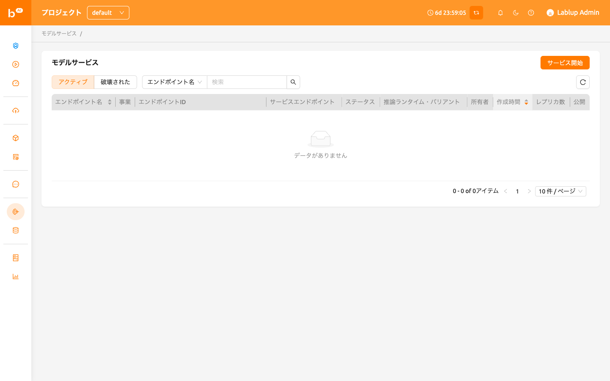

まず、サービス名を入力します。各項目の詳細については、以下を参照してください：

-  公開設定: このオプションを使用すると、サービスがホストされるサーバー上で
   モデルサービスに個別のトークンなしでアクセスできるようになります。
   デフォルトでは無効になっています。
-  マウントするモデルストレージ: これはマウントするモデルフォルダーで、
   ディレクトリ内にモデル定義ファイルが含まれています。
-  推論ランタイムバリアント: モデルのタイプを4つのカテゴリに分類します：`vLLM`、`NVIDIA NIM`、`Predefined Image Command`、`Custom`。


例えば、モデルサービスのランタイムバリアントとして `vLLM` または `NVIDIA NIM` または `Predefined Image Command` を選択した場合、
マウントするモデルフォルダーに `model-definition` ファイルを設定する必要はありません。代わりに、追加の環境変数を設定する必要がある場合があります。
詳細については、
[Model Variant: Easily Serving Various Model Services](https://www.backend.ai/blog/2024-07-10-various-ways-of-model-serving)を参照してください。

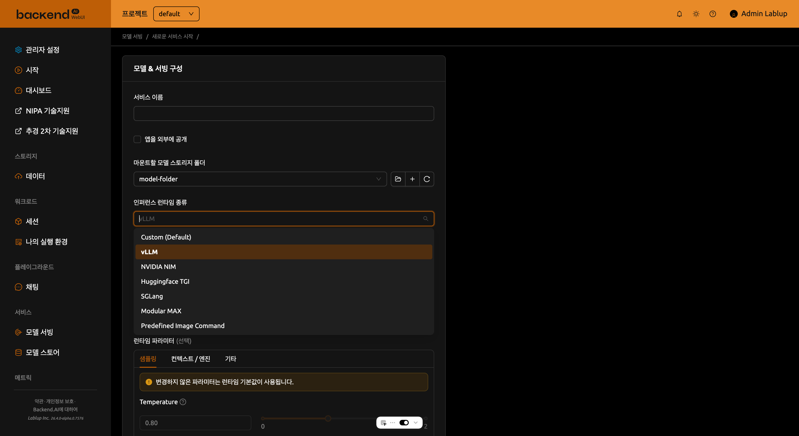

-  モデルフォルダーのモデル宛先: このオプションにより、サービスを表すルーティングに
   対応するセッションへのモデルストレージパスのエイリアスパスを設定できます。
   デフォルト値は `/models` です。
-  モデル定義ファイルパス: モデルストレージパスにアップロードしたモデル定義ファイルを
   設定することもできます。デフォルト値は `model-definition.yaml` です。
-  追加マウント: セッションと同様に、サービスも追加マウントを提供します。
   追加のモデルフォルダーではなく、一般/データ使用モードのフォルダーのみをマウントできることに
   注意してください。

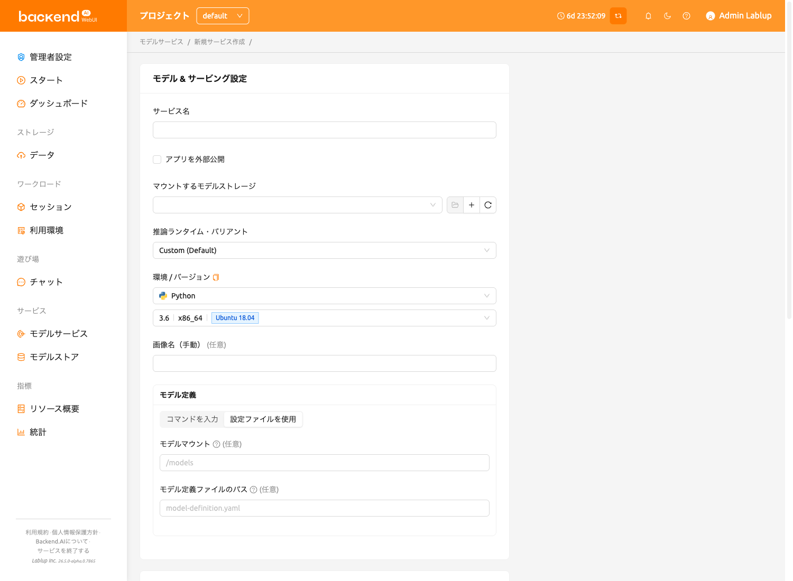

次に、レプリカ数を設定し、環境とリソースグループを選択します。リソースグループは、
モデルサービスに割り当てることができるリソースのコレクションです。

-  レプリカ数: この設定は、現在のサービスに対して維持するルーティングセッションの数を
   決定するための基礎となります。この設定の値を変更すると、マネージャーは既存のレプリカ
   セッションの数を参照して、新しいレプリカセッションを作成したり、実行中のセッションを
   終了したりできます。
-  環境 / バージョン: モデルサービスの専用サーバーの実行環境を設定できます。
   現在、サービスに複数のルーティングがある場合でも、単一の環境でのみ実行されます。
   （複数の実行環境のサポートは将来のアップデートで追加される予定です）

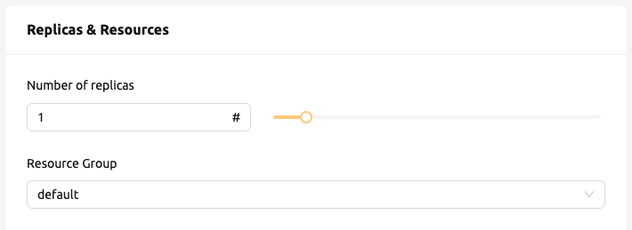

-  リソースプリセット: モデルサービスから割り当てるリソースの量を選択できます。
   リソースには、CPU、RAM、およびGPUとして知られるAIアクセラレーターが含まれます。

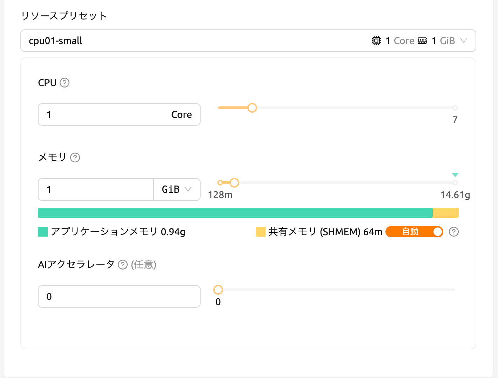

-  シングルノード: セッションを実行する際、管理ノードとワーカーノードが
   単一の物理ノードまたは仮想マシンに配置されます。
-  マルチノード: セッションを実行する際、1つの管理ノードと1つ以上のワーカー
   ノードが複数の物理ノードまたは仮想マシンに分割されます。
-  変数: このセクションでは、モデルサービスを開始する際に環境変数を設定できます。
   ランタイムバリアントを使用してモデルサービスを作成しようとする場合に便利です。
   一部のランタイムバリアントは、実行前に特定の環境変数の設定が必要です。

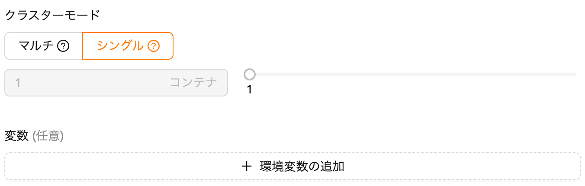

モデルサービスを作成する前に、Backend.AIは実行が可能かどうか（実行中のエラーの有無）を
チェックする検証機能をサポートしています。
サービスランチャーの左下にある「検証」ボタンをクリックすると、
検証イベントをリスニングするための新しいポップアップが表示されます。ポップアップモーダルでは、
コンテナログを通じてステータスを確認できます。結果が `Finished` に設定されると、
検証チェックは完了です。


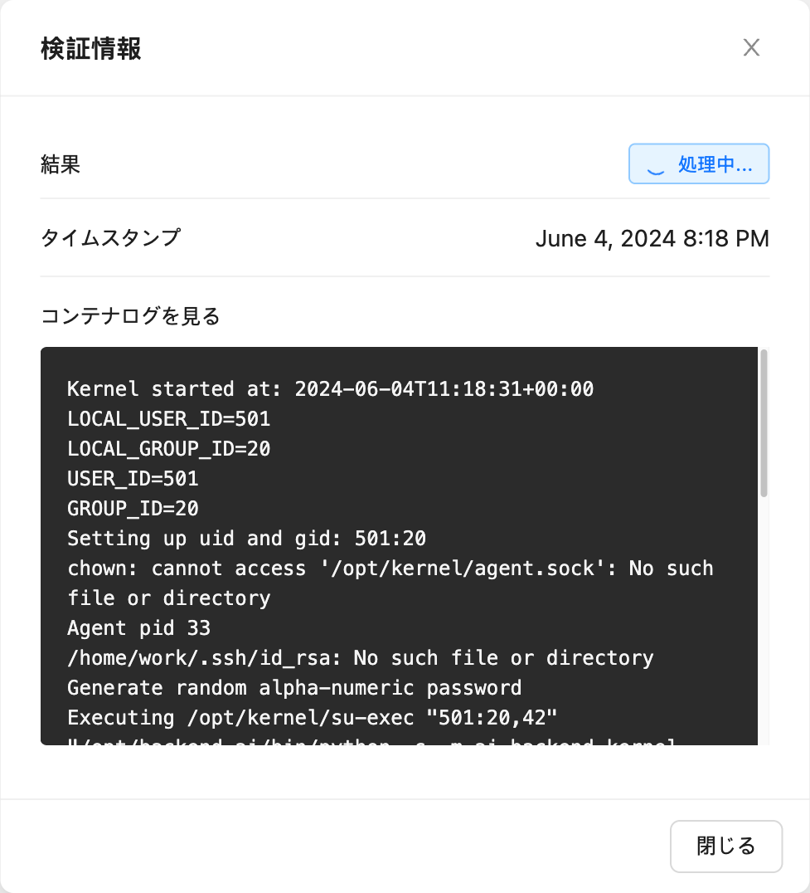


:::note
結果が `Finished` であっても、実行が正常に完了したことを保証するものではありません。
代わりに、コンテナログを確認してください。
:::


**モデルサービス作成の失敗への対処**

モデルサービスのステータスが `UNHEALTHY` のままの場合、
モデルサービスが正しく実行できないことを示しています。

作成失敗の一般的な理由とその解決策は次のとおりです：

-  モデルサービス作成時のルーティングに対して割り当てられたリソースが不十分

   -  解決策: 問題のあるサービスを終了し、以前の設定よりも十分なリソースを
      割り当てて再作成してください。

-  モデル定義ファイル（`model-definition.yml`）の形式が正しくない

   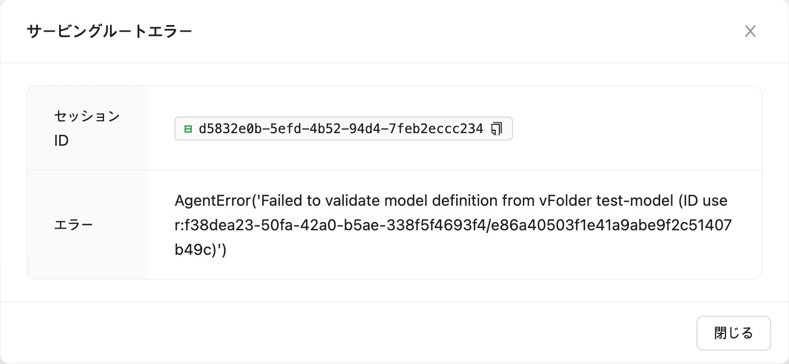

   -  解決策: [モデル定義ファイルの形式](#model-definition-guide)を確認し、
      キー値ペアが正しくない場合は、それらを修正して保存された場所のファイルを上書きしてください。
      その後、「エラーをクリアして再試行」ボタンをクリックして、ルート情報テーブルに
      スタックされたすべてのエラーを削除し、モデルサービスのルーティングが正しく設定されていることを確認してください。

   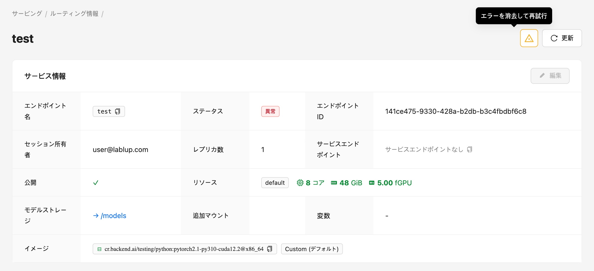


#### 自動スケーリングルール
モデルサービスの自動スケーリングルールを設定できます。
定義されたルールに基づいて、使用率が低い時はリソースを節約するためにレプリカ数が自動的に減少し、
使用率が高い時はリクエストの遅延や失敗を防ぐために増加します。

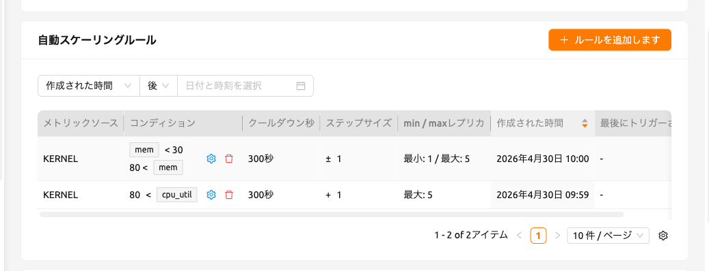

新しいルールを追加するには、「ルールを追加」ボタンをクリックします。ボタンをクリックすると、
ルールを追加できるモーダルが表示されます。モーダル内の各フィールドについて以下に説明します：

- タイプ: ルールを定義します。ルールの範囲に基づいて「スケールアウト」または「スケールイン」を選択します。

- メトリックソース: 推論フレームワークまたはカーネル。

   - 推論フレームワーク: すべてのレプリカから取得された平均値。両方のAppProxyが推論メトリックをレポートする場合のみサポートされます。
   - カーネル: エンドポイントをバッキングするすべてのカーネルから取得された平均値。

- 条件: 自動スケーリングルールが適用される条件を設定します。

   - メトリック名: 比較されるメトリックの名前。ランタイム環境でサポートされている任意のメトリックを自由に入力できます。
   - 比較演算子: ライブメトリックをしきい値と比較する方法。

      - LESS_THAN: 現在のメトリック値が定義されたしきい値を下回ったときにルールがトリガーされます
      - LESS_THAN_OR_EQUAL: 現在のメトリック値が定義されたしきい値以下になったときにルールがトリガーされます
      - GREATER_THAN: 現在のメトリック値が定義されたしきい値を上回ったときにルールがトリガーされます
      - GREATER_THAN_OR_EQUAL: 現在のメトリック値が定義されたしきい値以上になったときにルールがトリガーされます

   - しきい値: スケーリング条件が満たされるかどうかを判断するための参照値。

- ステップサイズ: ルールがトリガーされたときに変更されるレプリカ数のステップサイズ。
  正の値と負の値の両方で表すことができます。
  負の値として定義されると、ルールはレプリカ数を減少させます。

- 最大/最小レプリカ: エンドポイントのレプリカ数の最大値/最小値を設定します。
  潜在的なレプリカ数がこの値を超える/下回る場合、ルールはトリガーされません。

- クールダウン秒数: ルールが最初にトリガーされた直後に、ルールの再適用をスキップする秒単位の期間。


<a id="generating-tokens"></a>

#### Generating Tokens

Once the model service is successfully executed, the status will be set
to `HEALTHY`. In this case, you can click on the corresponding endpoint
name in the Model Service tab to view detailed information about the
model service. From there, you can check the service endpoint in the
routing information of the model service. If the 'Open to Public' option
is enabled when the service is created, the endpoint will be publicly
accessible without any separate token, and end users can access it.
However, if it is disabled, you can issue a token as described below to
verify that the service is running properly.


Click the 'Generate Token' button located to the right of the generated
token list in the routing information. In the modal that appears for
token creation, enter the expiration date.


The issued token will be added to the list of generated tokens. Click the 'copy' button in the token
item to copy the token, and add it as the value of the following key.

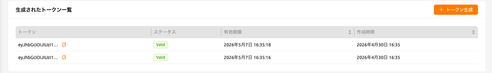

| Key           | Value            |
|---------------|------------------|
| Content-Type  | application/json |
| Authorization | BackendAI        |

#### Accessing the Model Service Endpoint for End Users

To complete the model serving, you need to share information with the
actual end users so that they can access the server where the model
service is running. If the Open to Public option is enabled when the
service is created, you can share the service endpoint value from the
routing information page. If the service was created with the option
disabled, you can share the service endpoint value along with the token
previously generated.

Here's the simple command using `curl` command whether to check sending any requests
to model serving endpoint working properly or not.


```bash
$ export API_TOKEN="<token>"
$ curl -H "Content-Type: application/json" -X GET \
  -H "Authorization: BackendAI $API_TOKEN" \
  <model-service-endpoint>
```


:::warning
By default, end users must be on a network that can access the
endpoint. If the service was created in a closed network, only end
users who have access within that closed network can access the
service.
:::

#### Using the Large Language Model

If you've created a Large Language Model (LLM) service, you can test the LLM in real-time.
Simply click the 'LLM Chat Test' button located in the Service Endpoint column.


Then, You will be redirected to the Chat page, where the model you created is automatically selected.
Using the chat interface provided on the Chat page, you can test the LLM model.
For more information about the chat feature, please refer to the [Chat page](#chat-page)

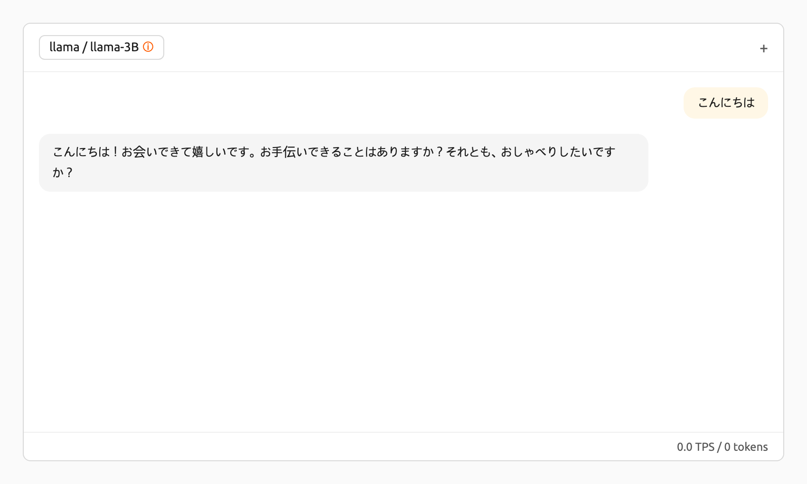

If you encounter issues connecting to the API, the Chat page will display options that allow you to manually configure the model settings.
To use the model, you will need the following information:

- baseURL (optional): Base URL of the server where the model is located.
  Make sure to include the version information.
  For instance, when utilizing the OpenAI API, you should enter https://api.openai.com/v1.
- Token (optional): An authentication key to access the model service. Tokens can be
  generated from various services, not just Backend.AI. The format and generation process
  may vary depending on the service. Always refer to the specific service's guide for details.
  For instance, when using the service generated by Backend.AI, please refer to the
  [Generating Tokens](#generating-tokens) section for instructions on how to generate tokens.

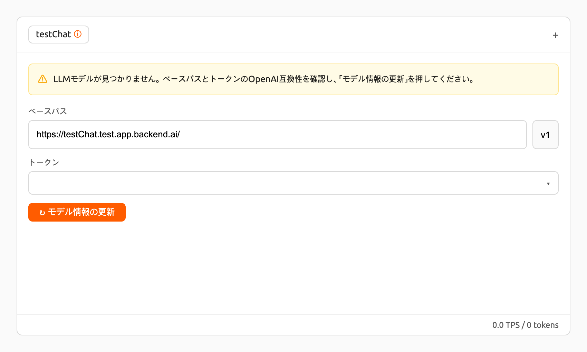

#### Modifying Model Service

Click on the wrench icon in the Control tab to modify a model service you want to update.
The format is identical to the model service start modal, with
previously entered fields already filled in. You can optionally modify only the
fields you wish to change. After modifying the fields, click the 'confirm' button.
The changes will be adjusted accordingly.

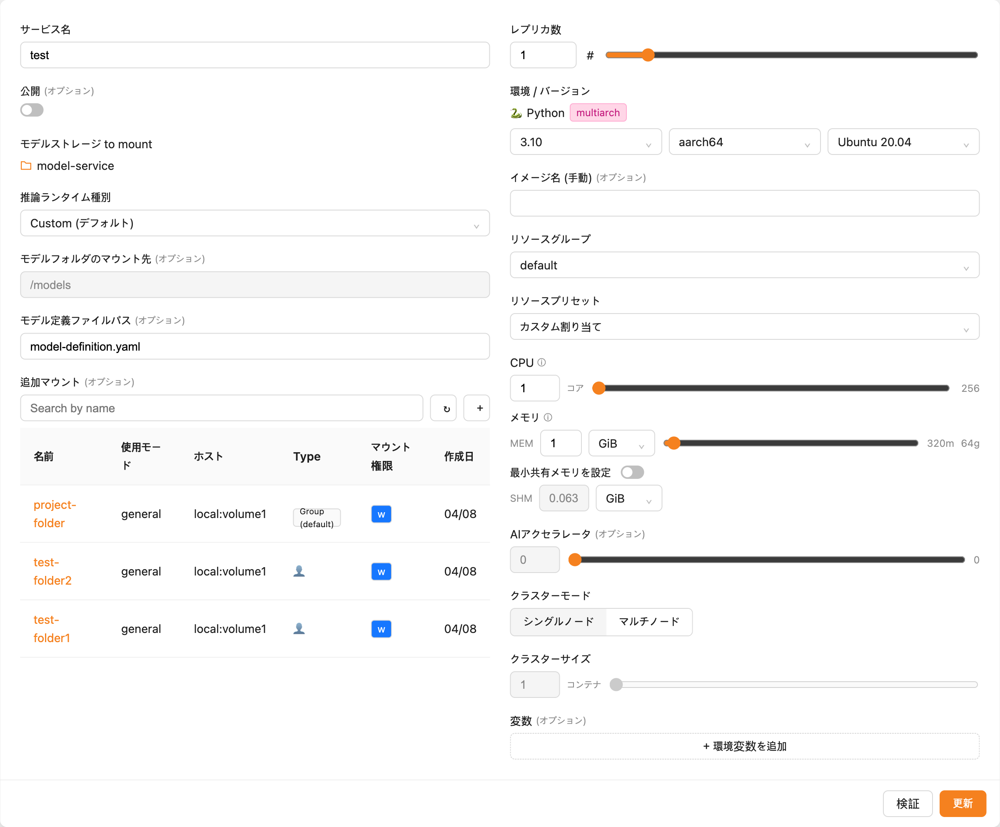

#### Terminating Model Service

The model service periodically runs a scheduler to adjust the routing
count to match the desired session count. However, this puts a burden on
the Backend.AI scheduler. Therefore, it is recommended to terminate the
model service if it is no longer needed. To terminate the model service,
click on the 'trash' button in the Control column. A modal will appear asking
for confirmation to terminate the model service. Clicking `Delete`
will terminate the model service. The terminated model service will be
removed from the list of model services.

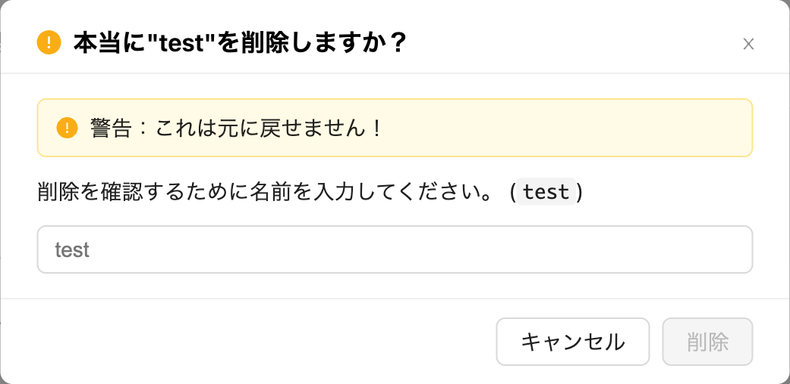