<a id="model-serving"></a>

# モデルサービング

## モデルサービス


:::note
この機能はエンタープライズ版でのみサポートされています。
:::

Backend.AIは、モデル学習フェーズにおける開発環境の構築とリソース管理を支援するだけでなく、
バージョン23.09以降、モデルサービス機能もサポートしています。この機能により、
エンドユーザー（AIベースのモバイルアプリやウェブサービスバックエンドなど）は、
完成したモデルを推論サービスとしてデプロイしたい場合に、推論APIコールを実行できます。

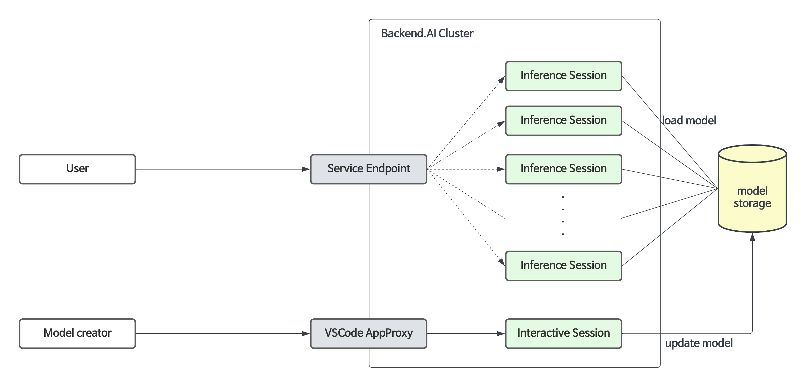

モデルサービスは、既存のトレーニングコンピュートセッションの機能を拡張し、自動メンテナンス、スケーリング、および本番サービスのための永続的なポートとエンドポイントアドレスのマッピングを可能にします。開発者または管理者は、モデルサービスに必要なスケーリングパラメータを指定するだけでよく、コンピュートセッションを手動で作成または削除する必要はありません。

<details>
<summary>バージョン23.03以前でのモデルサービス</summary>

モデルサービング専用機能はバージョン23.09から正式にサポートされていますが、
以前のバージョンでもモデルサービスを使用することは可能です。

例えば、バージョン23.03では、学習用のコンピュートセッションを次のように
変更することで、モデルサービスを設定できます：

1. モデルサービング用にセッション内で実行中のサーバーポートをマッピングするため、
   セッション作成時に事前開放ポートを追加します。
   （事前開放ポートの使用方法については、[事前開放ポートの設定](#set-preopen-ports)を参照してください。）

2. 事前開放ポートにマッピングされたサービスをパブリックアクセス可能にするため、
   「アプリを公開」にチェックを入れます。
   （「アプリを公開」の詳細については、[アプリを公開](#open-app-to-public)を参照してください。）

ただし、バージョン23.03には以下のような制限があります：

-  セッションは、アイドルタイムアウトやシステムエラーなどの外部要因で終了した場合、自動的に復旧しません。
-  セッションが再起動されるたびにアプリのポートが変更されます。
-  セッションが繰り返し再起動されると、アイドルポートが枯渇する可能性があります。

バージョン23.09の公式モデルサービス機能により、これらの制限が解決されました。
そのため、バージョン23.09以降では、可能な限りモデルサービングメニューを通じて
モデルサービスを作成・管理することを推奨します。事前開放ポートの使用は、
開発およびテスト目的でのみ推奨されます。

</details>

## モデルサービスの使用手順ガイド

モデルサービスを使用するには、以下の手順に従う必要があります：

1. モデル定義ファイルを作成します。
2. サービス定義ファイルを作成します。
3. 定義ファイルをモデルタイプフォルダーにアップロードします。
4. サービスランチャーを使用してモデルサービスを作成/検証します。
5. （モデルサービスが公開されていない場合）トークンを取得します。
6. （エンドユーザー向け）モデルサービスに対応するエンドポイントにアクセスして、サービスを確認します。
7. （必要に応じて）モデルサービスを変更します。
8. （必要に応じて）モデルサービスを終了します。

:::tip
代替ワークフローとして、[モデルストア](#model-store)で事前構成されたモデルを閲覧し、
`Run this model`ボタン（バージョン 26.4.0 以降では `Deploy` に名称変更）を使用して
ワンクリックでデプロイすることもできます。
:::

<a id="model-definition-guide"></a>

### モデル定義ファイルの作成

:::note
24.03以降、モデル定義ファイル名を設定できます。モデル定義ファイルパスで
他の入力フィールドを入力しない場合、システムは`model-definition.yml`または
`model-definition.yaml`と見なします。
:::

モデル定義ファイルには、推論セッションを自動的に開始、初期化、およびスケーリングするためにBackend.AIシステムで必要な構成情報が含まれています。これは推論サービスエンジンを含むコンテナイメージとは独立して、モデルタイプフォルダーに保存されます。これにより、特定の要件に基づいて異なるモデルをエンジンが提供できるようになり、モデルが変更されるたびに新しいコンテナイメージを構築してデプロイする必要がなくなります。ネットワークストレージからモデル定義とモデルデータをロードすることで、自動スケーリング中にデプロイメントプロセスを簡素化し、最適化できます。

モデル定義ファイルは次の形式に従います：

```yaml
models:
  - name: "simple-http-server"
    model_path: "/models"
    service:
      start_command:
        - python
        - -m
        - http.server
        - --directory
        - /home/work
        - "8000"
      port: 8000
      health_check:
        path: /
        interval: 10.0
        max_retries: 10
        max_wait_time: 15.0
        expected_status_code: 200
        initial_delay: 60.0
```

**モデル定義ファイルのキーと値の説明**

:::note
「(必須)」表示のないフィールドはオプションです。
:::

- `name` (必須): モデルの名前を定義します。
- `model_path` (必須): モデルが定義されているパスを指定します。
- `service`: サービスされるファイルに関する情報を整理する項目です
  （コマンドスクリプトおよびコードを含む）。

   - `pre_start_actions`: `start_command`の前に実行されるアクションです。これらのアクションは、
     設定ファイルの作成、ディレクトリのセットアップ、初期化スクリプトの実行などによって環境を準備します。
     アクションは定義された順序で順次実行されます。

      - `action`: 実行するアクションのタイプ。利用可能なアクションタイプとそのパラメータについては
        [事前開始アクション](#prestart-actions)を参照してください。
      - `args`: アクション固有のパラメータ。各アクションタイプには異なる必須引数があります。

   - `start_command` (必須): モデルサービングで実行されるコマンドを指定します。
     文字列または文字列のリストで指定できます。
   - `port` (必須): モデルサービス用のコンテナポートです（例：`8000`、`8080`）。
   - `health_check`: モデルサービスの定期的なヘルスモニタリングの設定です。
     設定すると、システムはサービスが正しく応答しているか自動的に確認し、
     異常なインスタンスをトラフィックルーティングから除外します。

      - `path` (必須): ヘルスチェックリクエスト用のHTTPエンドポイントパスです（例：`/health`、`/v1/health`）。
      - `interval` (デフォルト: `10.0`): 連続するヘルスチェック間の秒数です。
      - `max_retries` (デフォルト: `10`): サービスを`UNHEALTHY`としてマークする前に
        許容される連続失敗回数です。このしきい値を超えるまでサービスはトラフィックを受け続けます。
      - `max_wait_time` (デフォルト: `15.0`): 各ヘルスチェックHTTPリクエストのタイムアウト秒数です。
        この時間内に応答がない場合、チェックは失敗とみなされます。
      - `expected_status_code` (デフォルト: `200`): 正常な応答を示すHTTPステータスコードです。
        一般的な値：`200`（OK）、`204`（No Content）。
      - `initial_delay` (デフォルト: `60.0`): コンテナ作成後にヘルスチェックを開始するまでの
        待機時間（秒）です。モデルのロード、GPUの初期化、サービスのウォームアップに時間を確保します。
        大規模モデルの場合はより高い値を設定してください（例：70B+のLLMの場合`300.0`）。


**ヘルスチェック動作の理解**

ヘルスチェックシステムは、個々のモデルサービスコンテナを監視し、ヘルスステータスに基づいてトラフィックルーティングを自動的に管理します。

```
Container Created
│
▼
┌─────────────────────────────────┐
│  Wait for initial_delay (60s)   │  ← Model loading, GPU init, warmup
│  Status: DEGRADED               │
│  No health checks during this   │
└─────────────────────────────────┘
│
▼
Start Health Check Cycle
│
▼
┌─────────────────────────────────┐
│  Every interval (10s):          │
│  HTTP GET → path ("/health")    │
└─────────────────────────────────┘
│
▼
Wait up to max_wait_time (15s)
│
┌──────────┴──────────┐
▼                     ▼
Response              Timeout/Error
│                     │
▼                     │
Status ==             │
expected?             │
│                     │
┌──┴──┐               │
▼     ▼               │
Y     N               │
│     │               │
│     └───────┬───────┘
│             ▼
│        Consecutive
│        failures +1
│             │
▼             ▼
HEALTHY       Failures > max_retries?
(reset                │
failures)       ┌─────┴─────┐
                ▼           ▼
               Yes          No
                │           │
                ▼           ▼
            UNHEALTHY    Keep current
            (removed     status
            from traffic
            internally)
```

:::note
内部ヘルスステータス（トラフィックルーティングに使用）は、ユーザーインターフェースに
表示されるステータスと即座に同期されない場合があります。
:::

**UNHEALTHYまでの時間**:

- 初期起動時: `initial_delay + interval × (max_retries + 1)`

  デフォルト値の例: 60 + 10 × 11 = **170秒**（約3分）

- 運用中（正常状態後）: `interval × (max_retries + 1)`

  デフォルト値の例: 10 × 11 = **110秒**（約2分）


<a id="prestart-actions"></a>

**Backend.AIモデルサービングでサポートされているサービスアクションの説明**


- `write_file`: 指定されたファイル名でファイルを作成し、内容を追加するアクションです。
  デフォルトのアクセス権限は `644` です。

   - `arg/filename`: ファイル名を指定
   - `body`: ファイルに追加する内容を指定
   - `mode`: ファイルのアクセス権限を指定
   - `append`: ファイルへの内容の上書きまたは追加を `True` または `False` で設定

- `write_tempfile`: 一時ファイル名（`.py`）でファイルを作成し、内容を追加するアクションです。
  モードの値が指定されていない場合、デフォルトのアクセス権限は `644` です。

   - `body`: ファイルに追加する内容を指定
   - `mode`: ファイルのアクセス権限を指定

- `run_command`: コマンドを実行した結果が、エラーも含めて以下の形式で返されます
  （`out`: コマンド実行の出力、`err`: コマンド実行中にエラーが発生した場合のエラーメッセージ）

   - `args/command`: 実行するコマンドを配列として指定（例：`python3 -m http.server 8080` コマンドは ["python3", "-m", "http.server", "8080"] になります）

- `mkdir`: 入力パスによってディレクトリを作成するアクションです

   - `args/path`: ディレクトリを作成するパスを指定

- `log`: 入力メッセージによってログを出力するアクションです

   - `args/message`: ログに表示するメッセージを指定
   - `debug`: デバッグモードの場合は `True`、それ以外は `False` に設定

### モデル定義ファイルをモデルタイプフォルダーにアップロード

モデル定義ファイル（`model-definition.yml`）をモデルタイプフォルダーにアップロードするには、
バーチャルフォルダーを作成する必要があります。バーチャルフォルダーを作成する際は、
デフォルトの `general` タイプではなく `model` タイプを選択してください。
フォルダーの作成方法については、データページの[ストレージフォルダーの作成](#create-storage-folder)セクションを参照してください。

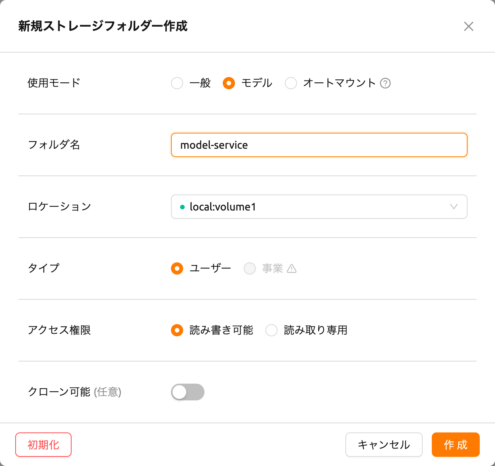

フォルダーを作成した後、データページの「MODELS」タブを選択し、
最近作成したモデルタイプフォルダーアイコンをクリックしてフォルダーエクスプローラーを開き、
モデル定義ファイルをアップロードします。
フォルダーエクスプローラーの使用方法については、[フォルダーの探索](#explore-folder)セクションを参照してください。

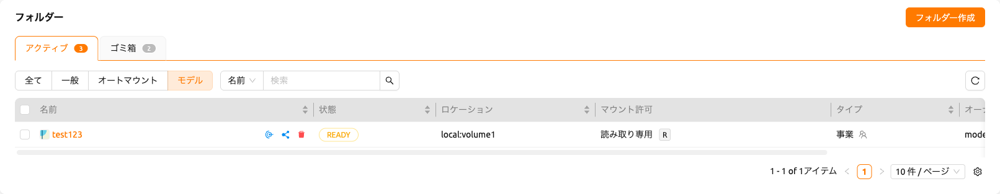

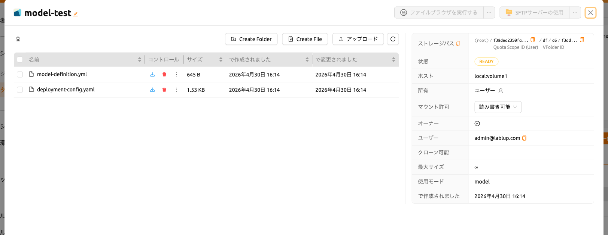

<a id="service-definition-file"></a>

### サービス定義ファイルの作成

サービス定義ファイル（`service-definition.toml`）を使用すると、管理者はモデルサービスに必要なリソース、環境、およびランタイム設定を事前に構成できます。このファイルがモデルフォルダーに存在する場合、システムはサービスを作成する際にこれらの設定をデフォルト値として使用します。

`model-definition.yaml` と `service-definition.toml` の両方がモデルフォルダーに存在する必要があり、
これによりモデルストアページで`Run this model`ボタン（バージョン 26.4.0 以降では `Deploy`）が
有効になります。これら2つのファイルは連携して動作します：モデル定義はモデルと推論サーバーの
構成を指定し、サービス定義はランタイム環境、リソース割り当て、および環境変数を指定します。

サービス定義ファイルは、ランタイムバリアントごとにセクションを整理したTOML形式に従います。各セクションはサービスの特定の側面を構成します：

```toml
[vllm.environment]
image        = "example.com/model-server:latest"
architecture = "x86_64"

[vllm.resource_slots]
cpu = 1
mem = "8gb"
"cuda.shares" = "0.5"

[vllm.environ]
MODEL_NAME = "example-model-name"
```


**サービス定義ファイルのキーと値の説明**

- `[{runtime}.environment]`: モデルサービスのコンテナイメージとアーキテクチャを指定します。

   - `image` (必須): 推論サービスに使用するコンテナイメージのフルパス（例：`example.com/model-server:latest`）。
   - `architecture` (必須): コンテナイメージのCPUアーキテクチャ（例：`x86_64`、`aarch64`）。

- `[{runtime}.resource_slots]`: モデルサービスに割り当てるコンピュートリソースを定義します。

   - `cpu`: 割り当てるCPUコアの数（例：`1`、`2`、`4`）。
   - `mem`: 割り当てるメモリ量。単位接尾辞をサポート（例：`"8gb"`、`"16gb"`）。
   - `"cuda.shares"`: 割り当てる分割GPU（fGPU）シェア（例：`"0.5"`、`"1.0"`）。キーにドットが含まれるため、この値は引用符で囲まれています。

- `[{runtime}.environ]`: 推論サービスコンテナに渡される環境変数を設定します。

   - ランタイムに必要な環境変数を定義できます。例えば、`MODEL_NAME` はどのモデルをロードするかを指定するために一般的に使用されます。


:::note
各セクションヘッダーの `{runtime}` プレフィックスは、ランタイムバリアント名
（例：`vllm`、`nim`、`custom`）に対応します。システムは、サービスを作成する際に
選択されたランタイムバリアントとこのプレフィックスを照合します。
:::

:::note
`Run this model`ボタン（バージョン 26.4.0 以降では `Deploy`）を使用してモデルストアから
サービスを作成すると、`service-definition.toml` の設定が自動的に適用されます。後で
リソース割り当てを調整する必要がある場合は、モデルサービングページを通じてサービスを変更できます。
:::

## サービングページの概要

サービングページには、現在のプロジェクト内のすべてのモデルサービスエンドポイントの一覧が表示されます。サイドバーメニューの**モデルサービス**をクリックしてアクセスできます。

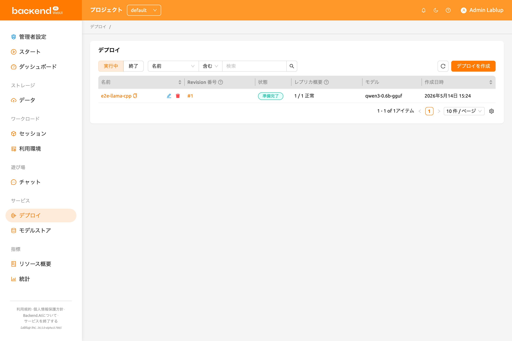

ページ上部で、ライフサイクルステージ別にエンドポイントをフィルタリングできます：

- **Active**: 現在実行中または作成中のエンドポイントを表示します。これがデフォルトビューです。
- **Destroyed**: 終了したエンドポイントを表示します。

また、プロパティフィルターバーを使用して、**エンドポイント名**、**サービスエンドポイントURL**、または**オーナー**（管理者およびスーパー管理者に提供）でエンドポイントを検索できます。

`Start Service`ボタンをクリックしてサービスランチャーを開き、新しいモデルサービスを作成します。

## モデルサービスの作成

### サービスランチャー

サービングページで`Start Service`ボタンをクリックしてサービスランチャーを開きます。

#### サービス名と基本設定

まず、サービス名を入力します。以下のフィールドが利用可能です：

- **Open To Public**: 別途トークンなしでモデルサービスにアクセスできるようにします。デフォルトでは無効です。
- **モデルストレージ**: モデル定義ファイルを含むマウントするモデルストレージフォルダーです。
- **推論ランタイム・バリアント**: モデルサービスのランタイムバリアントを選択します。利用可能なバリアントはバックエンドから動的にロードされ、インストールに応じて`vLLM`、`SGLang`、`NVIDIA NIM`、`Modular MAX`、`Custom`などが含まれます。


`vLLM`、`SGLang`、`NVIDIA NIM`、`Modular MAX`などのランタイムバリアントを選択すると、モデルフォルダーに`model-definition`ファイルを設定する必要はありません。選択されたバリアントに基づいて、システムがモデル構成を自動的に処理します。

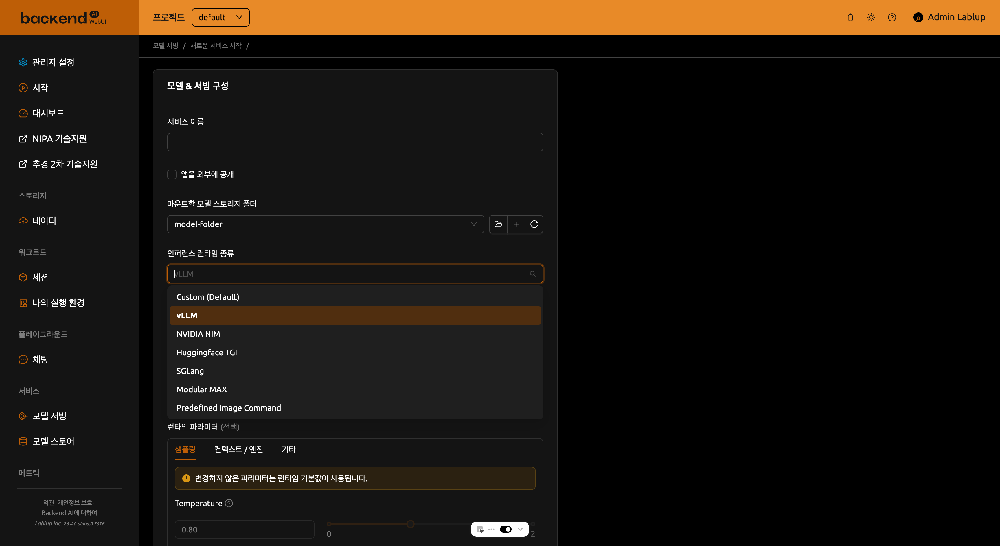

#### モデル定義モード（Customランタイム専用）

`Custom`ランタイムバリアントを選択すると、モデルサービスを定義する2つのモードから選択できます：

##### コマンド入力モード

`コマンドを入力`を選択して、CLIコマンドを直接貼り付けることができます。例えば：

```shell
vllm serve /models/my-model --tp 2
```

システムが自動的にコマンドを解析し、以下のフィールドを入力します：

- **Port**: コマンドから自動検出されます（デフォルト`8000`）。
- **ヘルスチェック URL**: コマンドから自動検出されます（デフォルト`/health`）。
- **モデルマウントパス**: コマンドから自動検出されます。


以下も設定できます：

- **初期遅延**: サービス起動後、最初のヘルスチェックを行うまで待機する秒数です。
- **最大再試行回数**: サービスが失敗と判断されるまでのヘルスチェックの最大試行回数です。

:::tip
コマンドがマルチGPU使用を示唆している場合（例：`--tp 2`）、正しい数のGPU
リソースを割り当てるのに役立つGPUヒントが表示されます。
:::

##### 設定ファイル使用モード

`設定ファイルを使用`を選択して、従来の`model-definition.yaml`アプローチを使用します。このモードでは以下を設定できます：

- **モデルフォルダーのマウント先**: セッションでモデルストレージがマウントされるパスです。デフォルト値は`/models`です。
- **モデル定義ファイルパス**: アップロードしたモデル定義ファイルのパスです。デフォルト値は`model-definition.yaml`です。
- **追加マウント**: 追加のストレージフォルダーをマウントできます。追加のモデルフォルダーではなく、一般/データ使用モードのフォルダーのみをマウントできることに注意してください。

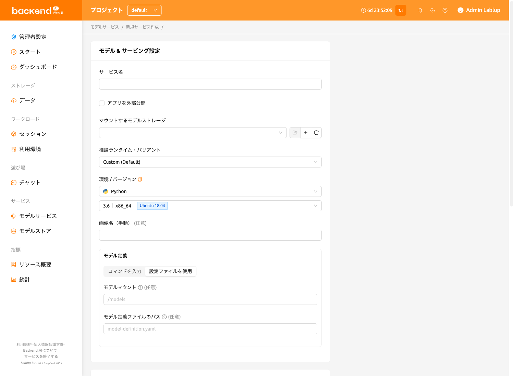

#### ランタイムパラメータ（vLLM / SGLang）

`vLLM`または`SGLang`ランタイムバリアントを選択すると、**ランタイムパラメータ**セクションが表示されます。このセクションでは、設定ファイルを手動で編集することなく、モデルサービングの動作を微調整できます。


パラメータはカテゴリ別に整理されています：

**サンプリングパラメータ：**

- **Temperature**: テキスト生成のランダム性を制御します。値が高いほど多様な出力が得られます。
- **Top P**: Nucleusサンプリングのしきい値です。
- **Top K**: 考慮する最高確率トークンの数を制限します。
- **Min P**: トークン選択の最小確率しきい値です。
- **Frequency Penalty**: 生成されたテキスト中のトークンの頻度に基づいてペナルティを与えます。
- **Presence Penalty**: すでに出現したトークンにペナルティを与えます。
- **Repetition Penalty**: 繰り返しトークンにペナルティを与えます。1.0以上の値は繰り返しを抑制します。
- **Seed**: 再現可能な生成のためのランダムシードです。

**コンテキスト / Engineパラメータ：**

- **コンテキスト長**: モデルが処理できる最大コンテキスト長です。
- **データ型**: モデルの重みと計算のデータ型です。
- **KV Cacheデータ型**: キーバリューキャッシュのデータ型です。
- **GPUメモリ使用率**: モデルに使用するGPUメモリの割合です。
- **リモートコードを信頼**: モデルリポジトリからのカスタムモデルコードの実行を許可します。
- **Eagerモードを強制**（vLLM専用）: デバッグのためにCUDA graph最適化を無効にします。
- **CUDA Graphを無効にする**（SGLang専用）: CUDAグラフキャプチャを無効にします。
- **メモリ割合（静的）**（SGLang専用）: モデルの静的メモリ割合です。
- **最大モデル長**: モデルが処理できる最大コンテキスト長（トークン数）です。

**追加引数**: 上記のコントロールでは対応していない追加のCLI引数用のテキストフィールドです。

:::note
変更されていないパラメータはランタイムのデフォルト値を使用します。
:::

#### 環境とリソース

レプリカ数を設定し、環境とリソースグループを選択します。

- **レプリカ数**: サービスに対して維持するルーティングセッションの数を決定します。この値を変更すると、マネージャーはレプリカセッションを作成または終了します。
- **環境 / バージョン**: モデルサービスの実行環境を設定します。vLLMなどのランタイムバリアントを選択すると、環境イメージが自動的にフィルタリングされ、関連するイメージが表示されます。


- **リソースプリセット**: 割り当てるリソースの量を選択します。リソースにはCPU、RAM、GPUが含まれます。

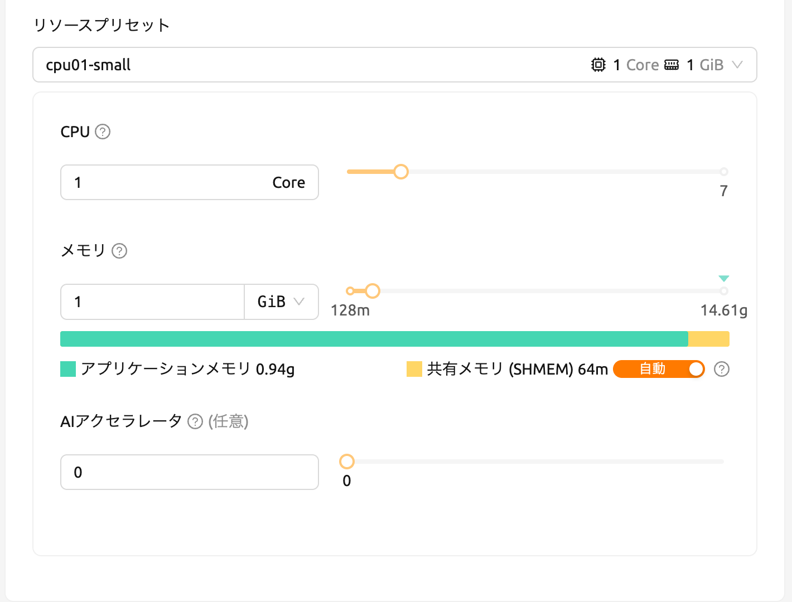

#### クラスターモードと環境変数

- **シングルノード**: セッションを実行する際、管理ノードとワーカーノードが単一の物理ノードまたは仮想マシンに配置されます。
- **マルチノード**: 1つの管理ノードと1つ以上のワーカーノードが複数の物理ノードまたは仮想マシンに分割されます。
- **変数**: モデルサービスを開始する際に環境変数を設定できます。ランタイムバリアントを使用してモデルサービスを作成する場合に便利です。

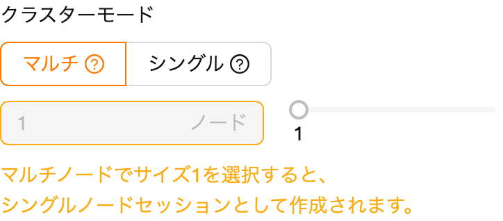

#### サービスの検証

モデルサービスを作成する前に、Backend.AIは実行が可能かどうかをチェックする検証機能をサポートしています。
サービスランチャーの左下にある`Validate`ボタンをクリックすると、
検証イベントをリスニングするための新しいポップアップが表示されます。ポップアップモーダルでは、
コンテナログを通じてステータスを確認できます。結果が`Finished`に設定されると、
検証チェックは完了です。

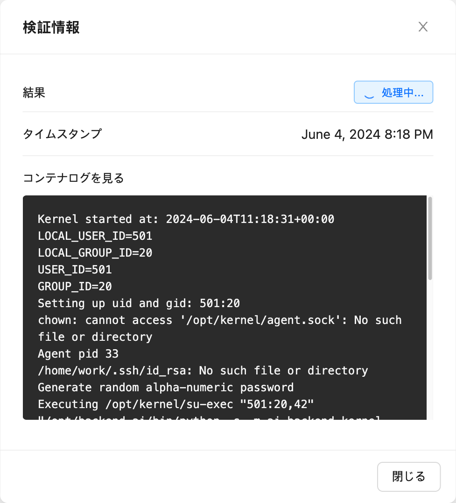

:::note
結果が `Finished` であっても、実行が正常に完了したことを保証するものではありません。
代わりに、コンテナログを確認してください。
:::

### モデルサービス作成の失敗への対処

モデルサービスのステータスが `UNHEALTHY` のままの場合、
モデルサービスが正しく実行できないことを示しています。

作成失敗の一般的な理由とその解決策は次のとおりです：

-  モデルサービス作成時のルーティングに対して割り当てられたリソースが不十分

   -  解決策: 問題のあるサービスを終了し、以前の設定よりも十分なリソースを
      割り当てて再作成してください。

-  モデル定義ファイル（`model-definition.yml`）の形式が正しくない

   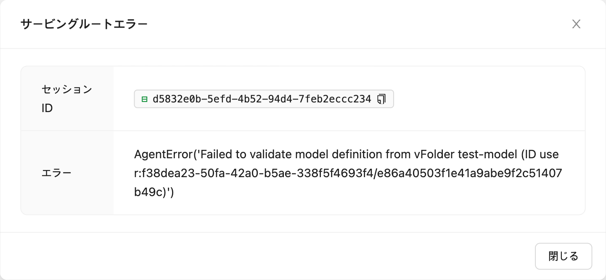

   -  解決策: [モデル定義ファイルの形式](#model-definition-guide)を確認し、
      キー値ペアが正しくない場合は、それらを修正して保存された場所のファイルを上書きしてください。
      その後、`Clear error and retry`ボタンをクリックして、ルート情報テーブルに
      スタックされたすべてのエラーを削除し、モデルサービスのルーティングが正しく設定されていることを確認してください。

   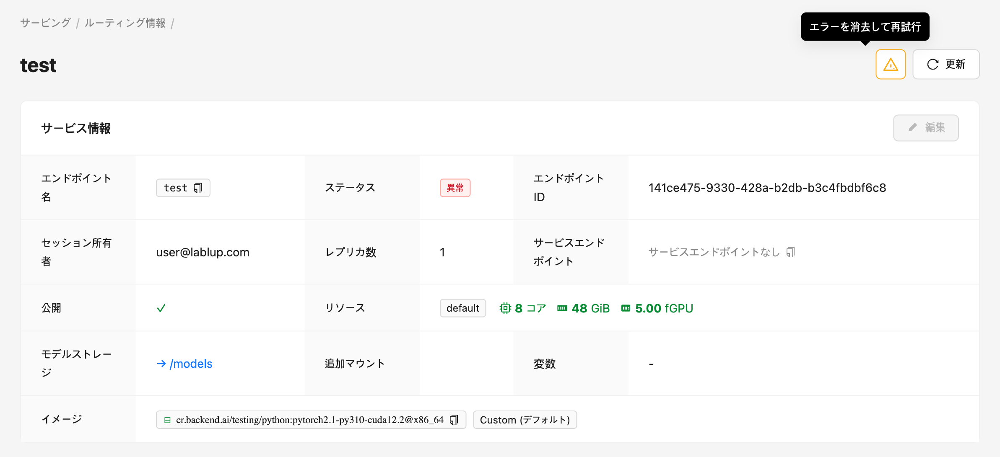

## エンドポイント詳細ページ

サービング一覧でエンドポイント名をクリックすると、モデルサービスの詳細情報を表示できます。

### サービス情報

サービス情報カードには以下の詳細が表示されます：

- **エンドポイント名**と**ステータス**
- **エンドポイントID**と**セッションオーナー**
- **レプリカ数**
- **サービスエンドポイント**: モデルサービスにアクセスするためのURLです。LLMサービスの場合、`LLM Chat Test`ボタンが利用可能です。
- **Open To Public**: サービスが公開アクセス可能かどうかです。
- **リソース**: リソースグループおよび割り当てられたCPU/メモリ/GPUです。
- **モデルストレージ**: マウントされたモデルストレージフォルダーとマウント先です。
- **追加マウント**: マウントされた追加のストレージフォルダーです。
- **環境変数**: コードブロックとして表示されます。
- **イメージ**: サービスに使用されるコンテナイメージです。

サービス情報カードの`Edit`ボタンをクリックすると、更新ランチャーに移動してサービス設定を変更できます。

:::warning
エンドポイントが現在選択されているプロジェクトとは異なるプロジェクトに属している場合、
プロジェクト不一致の警告が表示されます。エンドポイントを管理するには、正しいプロジェクトに切り替えてください。
:::

### 自動スケーリングルール

モデルサービスの自動スケーリングルールを設定できます。
定義されたルールに基づいて、使用率が低い時はリソースを節約するためにレプリカ数が自動的に減少し、
使用率が高い時はリクエストの遅延や失敗を防ぐために増加します。

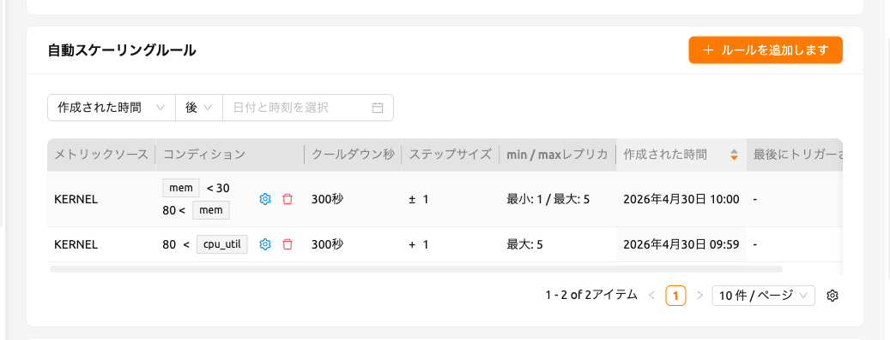

新しいルールを追加するには、`Add Rules`ボタンをクリックします。ボタンをクリックすると、
ルールを追加できるモーダルが表示されます。モーダル内の各フィールドについて以下に説明します：

- **Type**: ルールを定義します。ルールの範囲に基づいて`Scale Out`または`Scale In`を選択します。

- **Metric Source**: 推論フレームワークまたはカーネルです。

   - Inference Framework: すべてのレプリカから取得された平均値です。AppProxyが推論メトリックをレポートする場合のみサポートされます。
   - Kernel: エンドポイントをバッキングするすべてのカーネルから取得された平均値です。

- **Condition**: 自動スケーリングルールが適用される条件を設定します。

   - **Metric Name**: 比較されるメトリックの名前です。ランタイム環境でサポートされている任意のメトリックを自由に入力できます。
   - **Comparator**: ライブメトリックをしきい値と比較する方法です。

      - LESS_THAN: 現在のメトリック値が定義されたしきい値を下回ったときにルールがトリガーされます
      - LESS_THAN_OR_EQUAL: 現在のメトリック値が定義されたしきい値以下になったときにルールがトリガーされます
      - GREATER_THAN: 現在のメトリック値が定義されたしきい値を上回ったときにルールがトリガーされます
      - GREATER_THAN_OR_EQUAL: 現在のメトリック値が定義されたしきい値以上になったときにルールがトリガーされます

   - **Threshold**: スケーリング条件が満たされるかどうかを判断するための参照値です。

- **Step Size**: ルールがトリガーされたときに変更されるレプリカ数のステップサイズです。
  正の値と負の値の両方で表すことができます。
  負の値として定義されると、ルールはレプリカ数を減少させます。

- **Max/Min Replicas**: エンドポイントのレプリカ数の最大値/最小値を設定します。
  潜在的なレプリカ数がこの値を超える/下回る場合、ルールはトリガーされません。

- **CoolDown Seconds**: ルールが最初にトリガーされた直後に、ルールの再適用をスキップする秒単位の期間です。


:::note
Backend.AI バージョン **26.4.0** 以降、自動スケーリングルールは Prometheus プリセット
サポートと新しいコンディションモデルで再設計されました。それより古いバージョンを使用
している場合は、上記の説明がそのまま適用されます。それ以外の場合は、以下の
[自動スケーリングルール（バージョン 26.4.0 以降）](#auto-scaling-rules-version-26-4-0-and-later)
を参照してください。
:::

<a id="auto-scaling-rules-version-26-4-0-and-later"></a>

#### 自動スケーリングルール（バージョン 26.4.0 以降）

Backend.AI バージョン 26.4.0 以降では、Prometheus メトリックソース、セグメント化されたコンディションコントロール、およびより豊富なルール一覧を備えた自動スケーリングルールが再設計されました。

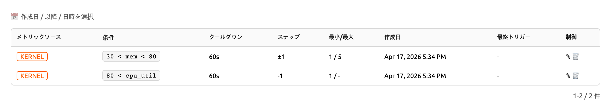

ルール一覧には以下が含まれます：

- **作成された時間**（Created At）および**最後にトリガーされました**（Last Triggered）の日時範囲でルールをフィルタリングできるプロパティフィルターバー。
- サーバーサイドのページネーション。
- 以下の列：**メトリックソース**（Metric Source）、**コンディション**（Condition）、**時間ウィンドウ**（Time Window）、**ステップサイズ**（Step Size）、**min / max レプリカ**（Min / Max Replicas）、**作成された時間**（Created At）、**最後にトリガーされました**（Last Triggered）。**ステップサイズ**列は、設定されたしきい値から導出される方向に基づいて `+`、`−`、`±` を自動的に表示するため、`Scale Out` または `Scale In` を明示的に選択する必要はなくなりました。
- 各行のコンディションサマリーの横に表示される行ごとの編集および削除アイコン。

`Add Rules`ボタンをクリックすると、**自動スケーリングルールを追加します**エディターが開きます。既存のルールを変更するには、その行の編集アイコンをクリックします。ルールの値が事前に入力された状態で**自動スケーリングルールを編集します**エディターが開きます。エディターには次のフィールドが順番に含まれます：

- **メトリックソース**（Metric Source）: `Kernel`、`Inference Framework`、`Prometheus` のいずれかを選択します。
- **メトリック名**（Metric Name）: `Kernel` および `Inference Framework` の場合、メトリック名を入力します。`Kernel` では、`cpu_util`、`mem`、`net_rx`、`net_tx` などの一般的なメトリックがオートコンプリートの候補として提案され、カスタム名を自由に入力することもできます。
- **メトリック名（Prometheusプリセット）**（Metric Name (Prometheus Preset)）: **メトリックソース**が `Prometheus` の場合のみ表示されます。ドロップダウンからプリセットを選択すると、プリセットのメトリック名、クエリテンプレート、および（定義されている場合）**時間ウィンドウ**が自動的に入力されます。セレクタの下にある**現在の値**（Current value）プレビューは、プリセットが返す最新の値を更新ボタンとともに表示します。複数のシリーズが返される場合、プレビューにはシリーズの件数と最新の値が表示されます。利用可能なデータがない場合は、**データがありません**（No data available）と表示されます。
- **コンディション**（Condition）: 2 つのモードを持つセグメント化されたコントロールです：

   - **シングル**（Single）: `Metric <op> Threshold` の単一比較を定義します。ここで `<op>` は `>` または `<` です。
   - **範囲**（Range）: `Min Threshold < Metric < Max Threshold` の範囲を定義します。両方のしきい値が必須で、最小値は最大値より小さくなければなりません。

- **ステップサイズ**（Step Size）: スケーリングイベントごとに追加または削除するレプリカ数を指定する正の整数です。方向（追加または削除）は構成されたしきい値から自動的に導出されるため、大きさのみを指定します。
- **時間ウィンドウ**（Time Window）: メトリックが集約されてスケーリング評価に使用される時間（秒単位）です。これは以前の `CoolDown Seconds` フィールドを置き換えるもので、意味が異なります。
- **最小レプリカ**（Min Replicas）および**マックスレプリカ**（Max Replicas）: 自動スケーリングがレプリカ数に対して強制する下限と上限です。自動スケーリングは、レプリカ数を**最小レプリカ**より下げたり、**マックスレプリカ**より上げたりすることはありません。

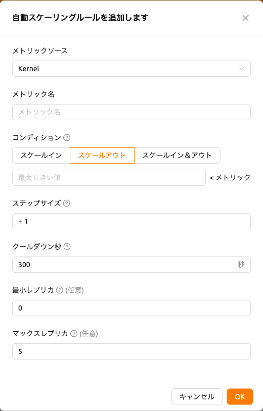

**メトリックソース**が `Prometheus` に設定されている場合、エディターにはプリセットセレクタとライブの**現在の値**プレビューが表示されます。

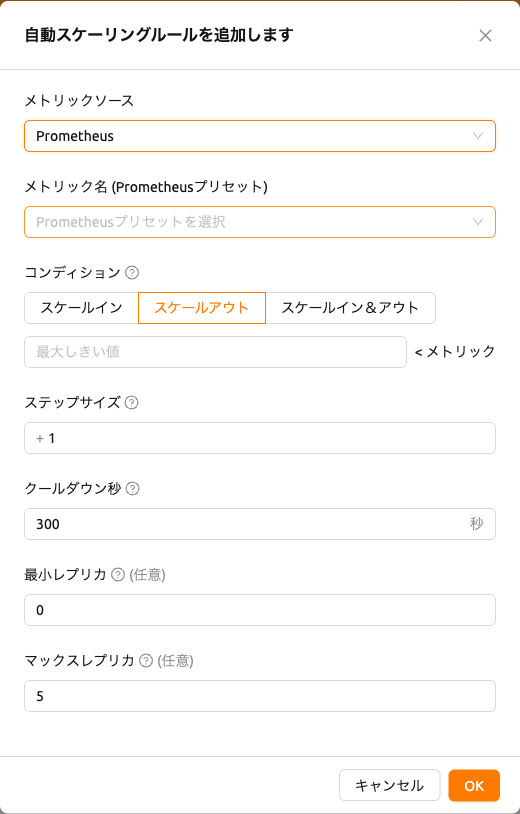

<a id="generating-tokens"></a>

### トークンの生成

モデルサービスが正常に実行されると、ステータスが
`HEALTHY`に設定されます。サービング一覧で対応するエンドポイント名をクリックして、
詳細情報を表示できます。ルーティング情報でサービスエンドポイントを確認できます。
サービス作成時に**Open To Public**オプションが
有効になっている場合、エンドポイントは別途トークンなしで
公開アクセス可能です。
ただし、無効になっている場合は、以下に説明するようにトークンを発行して、
サービスが正しく実行されていることを確認できます。


生成されたトークン一覧の右側にある`Generate Token`ボタンを
クリックします。表示されるモーダルで有効期限を入力します。


発行されたトークンは生成されたトークン一覧に追加されます。各トークンには**ステータス**（有効または期限切れ）、**有効期限**、**作成日**が表示されます。トークン
項目の`copy`ボタンをクリックしてトークンをコピーし、以下のキーの値として追加します。

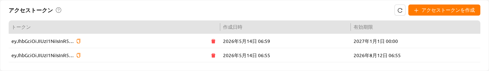

| Key           | Value            |
|---------------|------------------|
| Content-Type  | application/json |
| Authorization | BackendAI        |

### ルート情報

ルート情報カードは、モデルサービスのルーティングステータスを表示します。以下の基準でルートをフィルタリングできます：

- **Running / Finished**: アクティブなルートノードと完了したルートノードを切り替えます。
- **プロパティフィルター**: ヘルスステータスおよびトラフィックステータスでフィルタリングします。

`Sync Routes`ボタンをクリックして、ルート情報をバックエンドと同期します。

ルートノードをクリックするとセッション詳細ドロワーが開き、個別のセッション詳細を表示できます。

### サービスの変更

エンドポイント詳細ページの`Edit`ボタンをクリックして、モデルサービスを変更します。以前に入力したフィールドが入力された状態でサービスランチャーが開きます。変更したいフィールドのみを選択的に変更できます。フィールドを変更した後、`Confirm`をクリックして変更を適用します。

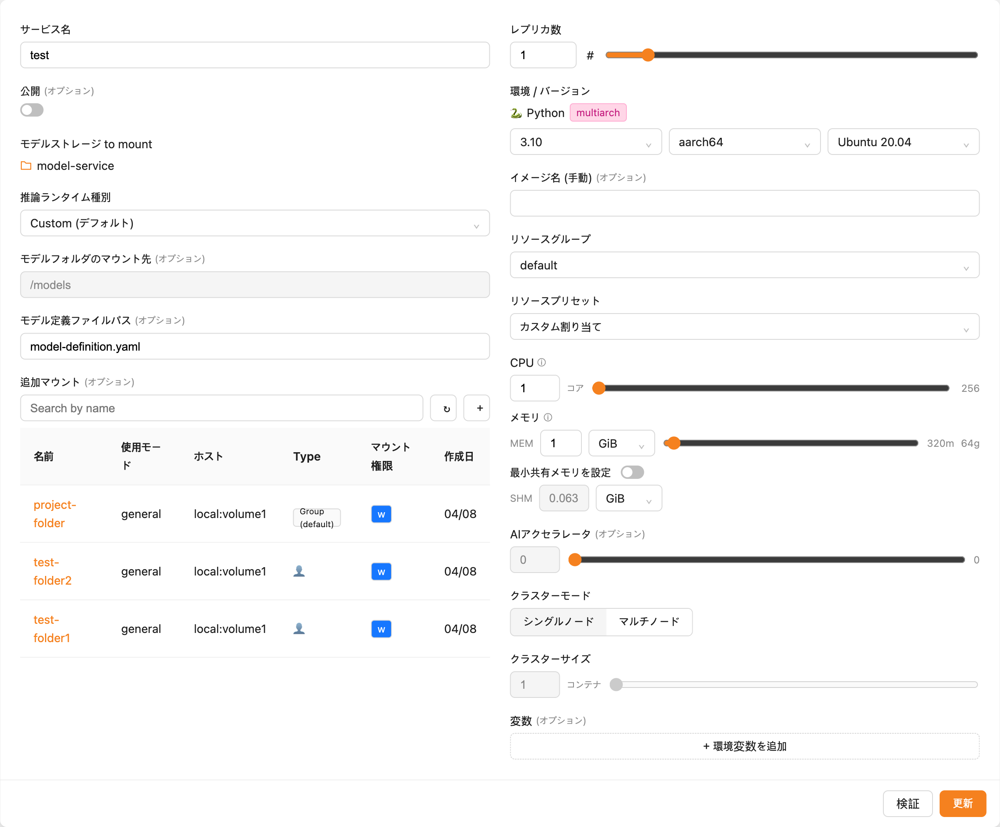

### サービスの終了

モデルサービスは、目的のセッション数に合わせてルーティング数を調整するために、定期的にスケジューラーを実行します。ただし、これはBackend.AIスケジューラーに負担をかけます。そのため、不要になったモデルサービスは終了することを推奨します。モデルサービスを終了するには、Controls列の`Delete`ボタンをクリックします。モデルサービスを終了するかどうかの確認モーダルが表示されます。`Delete`をクリックするとモデルサービスが終了します。終了したモデルサービスは**Destroyed**フィルタービューに表示されます。

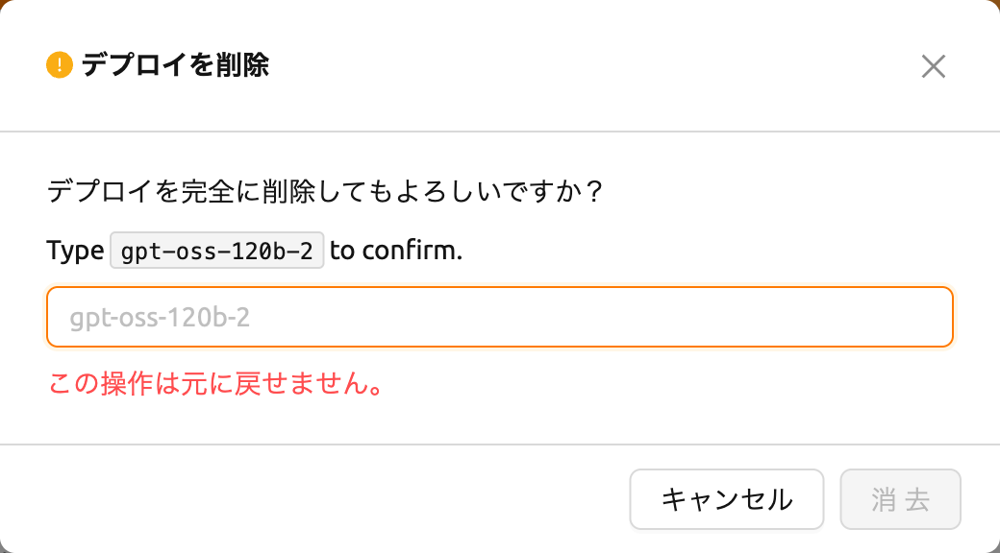

## サービスエンドポイントへのアクセス

### APIリクエストの送信

モデルサービングを完了するには、実際のエンドユーザーと情報を共有して、モデルサービスが実行されているサーバーにアクセスできるようにする必要があります。サービス作成時に**Open To Public**オプションが有効になっている場合、エンドポイント詳細ページからサービスエンドポイントの値を共有できます。オプションが無効の状態でサービスが作成された場合は、以前に生成したトークンとともにサービスエンドポイントの値を共有できます。

以下は、モデルサービングエンドポイントへのリクエスト送信が正しく機能しているかどうかを確認する`curl`コマンドの簡単な例です：

```bash
$ export API_TOKEN="<token>"
$ curl -H "Content-Type: application/json" -X GET \
  -H "Authorization: BackendAI $API_TOKEN" \
  <model-service-endpoint>
```

:::warning
デフォルトでは、エンドユーザーはエンドポイントにアクセスできるネットワーク上にいる必要があります。
サービスがクローズドネットワークで作成された場合、そのクローズドネットワーク内にアクセスできる
エンドユーザーのみがサービスにアクセスできます。
:::

### LLMチャットテスト

大規模言語モデル（LLM）サービスを作成した場合、リアルタイムでLLMをテストできます。
エンドポイント詳細ページのサービスエンドポイントセクションにある`LLM Chat Test`ボタンをクリックします。

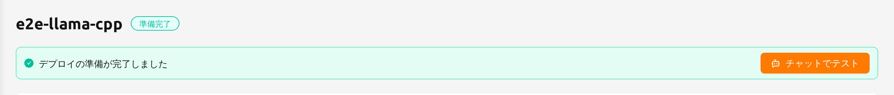

作成したモデルが自動的に選択されたChatページにリダイレクトされます。
Chatページで提供されるチャットインターフェースを使用して、LLMモデルをテストできます。
チャット機能の詳細については、[Chatページ](#chat-page)を参照してください。

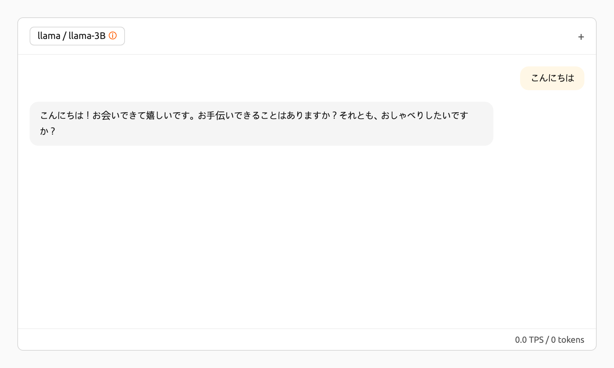

API接続に問題が発生した場合、Chatページにモデル設定を手動で構成できるオプションが表示されます。
モデルを使用するには、以下の情報が必要です：

- **baseURL**（オプション）: モデルが配置されているサーバーのベースURLです。
  バージョン情報を含めてください。
  例えば、OpenAI APIを使用する場合は、https://api.openai.com/v1 を入力してください。
- **Token**（オプション）: モデルサービスにアクセスするための認証キーです。トークンは
  Backend.AIだけでなく、さまざまなサービスから生成できます。形式と生成プロセスは
  サービスによって異なる場合があります。詳細については、常に特定のサービスのガイドを参照してください。
  例えば、Backend.AIで生成されたサービスを使用する場合は、
  トークンの生成方法については[トークンの生成](#generating-tokens)セクションを参照してください。

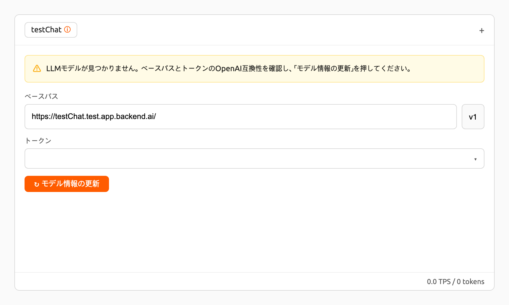

<a id="model-store"></a>

## Model Store

モデルストアは、事前構成されたモデルを閲覧、検索、デプロイできるカードベースのギャラリーを提供します。サイドバーメニューからモデルストアにアクセスできます。


### モデルの閲覧と検索

ページ上部の検索バーを使用して、名前、説明、タスク、カテゴリ、またはラベルでモデルを検索できます。また、フィルタードロップダウンを使用して結果を絞り込むことができます：

- **Category**: モデルカテゴリでフィルタリングします（例：LLM）。
- **Task**: タスクタイプでフィルタリングします（例：text-generation）。
- **Label**: モデルラベルでフィルタリングします。

### モデルカードの詳細

モデルカードをクリックすると、モーダルで詳細を表示できます。モデルカードモーダルには以下が表示されます：

- **Title**、**Author**、**Version**
- **Description**と**README**
- **Task**、**Category**、**Architecture**
- **Framework**と**Labels**
- **License**
- モデルの実行に必要な**最小リソース**
- モデルストレージフォルダーへのリンク

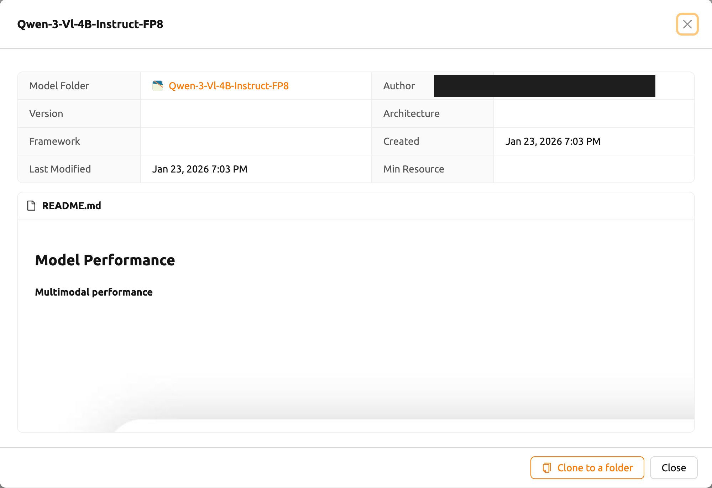

### モデルのクローン

モデルカードの`Clone to a folder`ボタンをクリックして、モデルフォルダーを自分のストレージにクローンします。コピー先のフォルダー名を指定できる確認ダイアログが表示されます。


### モデルストアからモデルを実行

モデルカードの`Run this model`ボタンをクリックして、モデルをサービスとしてデプロイします。これには、モデルフォルダーに`model-definition.yaml`と`service-definition.toml`の両方が存在する必要があります。

- サービス定義に1つのランタイムバリアントのみが構成されている場合、事前構成された設定でサービスが自動的に起動します。
- 複数のランタイムバリアントが利用可能な場合、1つを選択するためにサービスランチャーページにリダイレクトされます。

:::note
モデルストアからサービスを作成すると、`service-definition.toml`の設定が
自動的に適用されます。後でサービングページを通じてサービスを変更できます。
:::

:::note
Backend.AI バージョン **26.4.0** 以降、モデルストアは再設計されました。それより古い
バージョンを使用している場合は、上記の説明がそのまま適用されます。それ以外の場合は、
以下の[モデルストア（バージョン 26.4.0 以降）](#model-store-version-26-4-0-and-later)
を参照してください。
:::

<a id="model-store-version-26-4-0-and-later"></a>

### モデルストア（バージョン 26.4.0 以降）

Backend.AI バージョン 26.4.0 以降では、簡素化された閲覧エクスペリエンス、カード詳細ドロワー、および従来の閲覧/詳細/実行ワークフローを置き換える合理化されたデプロイフローを備えたモデルストアに再設計されました。

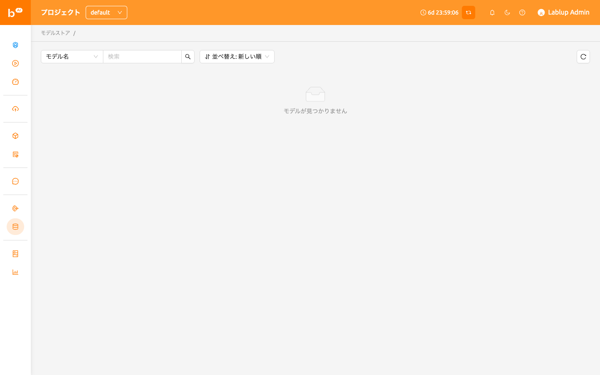

ページ上部には検索と並べ替えのレイアウトが使用されています：

- **モデルの検索**（Search Models）: **名前でフィルタリングする**（Filter By Name）プロパティフィルターを使用して、モデルカードを名前で検索します。
- **並べ替え**（Sort）: 結果の並び順を選択します。使用可能なオプションは、`名前 (A→Z)`、`名前 (Z→A)`、`古い順`、`新しい順` です。
- **更新**: 更新ボタンをクリックしてカード一覧を再読み込みします。

各カードには、モデルブランドのアイコン、タイトル（タイトルが設定されていない場合は名前）、タスクタグ、相対作成時刻、およびアイコン付きの著者が表示されます。現在のプロジェクトに**互換性のあるプリセットがない**カードは不透明度 50 % で表示されます。そのようなカードを開いて詳細を表示することは可能ですが、**Deploy** ボタンは無効化され、ドロワーに *No compatible presets available. This model cannot be deployed.* というエラーアラートが表示されます。

サーバーで `MODEL_STORE` プロジェクトが設定されていない場合、ページには管理者に問い合わせるようにとの案内とともに *モデルストアプロジェクトが見つかりません* というメッセージが表示されます。フィルターに一致するモデルカードがない場合は *モデルが見つかりません* と表示されます。

一覧はページ下部でページネーションされます。ページサイズは `10`、`20`、`50` 件の中から変更できます。

カードをクリックすると、ページの右側にモデルカードのドロワーが開きます。ドロワーの上部にはモデルのタイトルと説明が表示され、次にタスク、カテゴリ、ラベル、ライセンスのタグが続き、その後に次の項目を含む詳細一覧が表示されます：

- **著者**（Author）
- **アーキテクチャ**（Architecture）
- **フレームワーク**（Framework）（各フレームワークはアイコン付きで表示）
- **バージョン**（Version）
- **作成した**（Created）および**最終更新日**（Last Modified）のタイムスタンプ
- **モデルフォルダ**（Model Folder）: モデルストレージフォルダのフォルダエクスプローラを開くクリック可能なリンク
- **最小リソース**（Min Resource）: 最小リソース要件（CPU、メモリ、GPU）

モデルカードに README が含まれている場合は、ドロワーの下部に `README.md` カードとしてレンダリングされます。

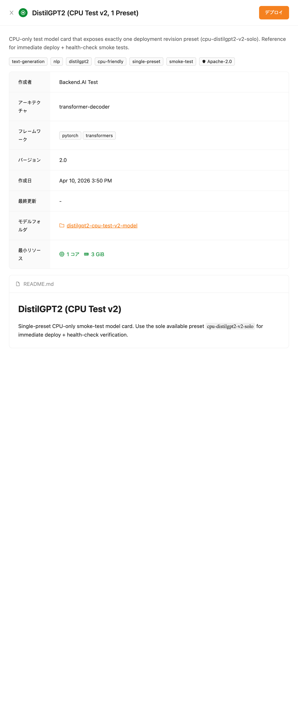

バージョン 26.4.0 以降でモデルフォルダをクローンするには、[データ](../vfolder/vfolder.md) ページを直接使用してください。モデルストアドロワーには専用のクローンボタンは提供されなくなりました。

ドロワーヘッダーの **Deploy** ボタンをクリックすると、モデルがサービスとしてデプロイされます。デプロイフローは次の 2 通りのいずれかで動作します：

- **自動デプロイ**: モデルに使用可能なプリセットがちょうど 1 つあり、現在のプロジェクトにアクセス可能なリソースグループがちょうど 1 つある場合、モーダルを表示せずにデプロイが静かに作成されます。エンドポイントがクエリ可能になった後、そのエンドポイント詳細ページに遷移します。
- **モデルのデプロイモーダル**（Deploy Model）: それ以外の場合、**Deploy Model** モーダルが次の必須フィールドとともに開きます：

   - **プリセット**（Preset）: 使用可能なリソースプリセットのグループ化されたドロップダウンです。プリセットが複数のランタイムバリアントにまたがる場合、オプションはランタイムバリアント名ごとにグループ化されます。それ以外の場合は、フラットなリストとして表示されます。
   - **リソースグループ**（Resource Group）: サービスが実行されるリソースグループです。

   モーダルの **Deploy** ボタンをクリックしてデプロイを開始します。モデルがデプロイされたことを確認する成功トーストが表示され、エンドポイント詳細ページに遷移します。

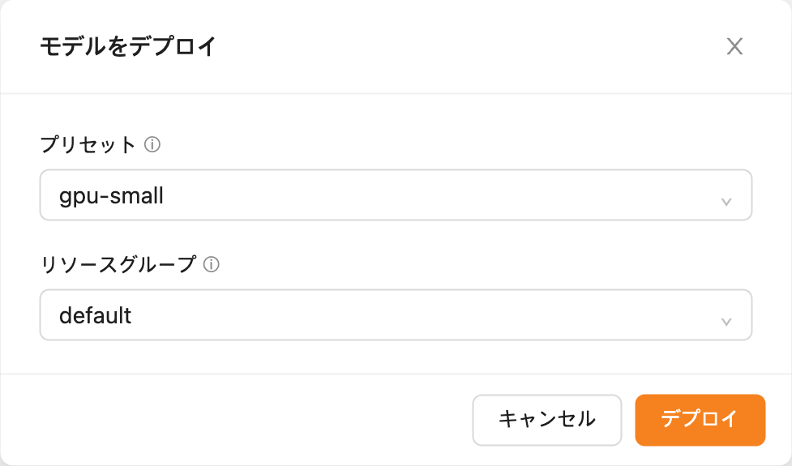

:::note
選択したモデルに現在のプロジェクトと互換性のあるプリセットがない場合、ドロワーの
**Deploy** ボタンは無効化され、互換性のあるプリセットが利用可能になるまでデプロイは
ブロックされます。
:::

## 管理者機能

### 管理者サービングページ

管理者およびスーパー管理者は、すべてのプロジェクトのエンドポイントを表示できる管理者サービングページにアクセスできます。このページには、標準のエンドポイント一覧列に加えて**プロジェクト**列が表示され、管理者がすべてのプロジェクトのサービスを管理できます。

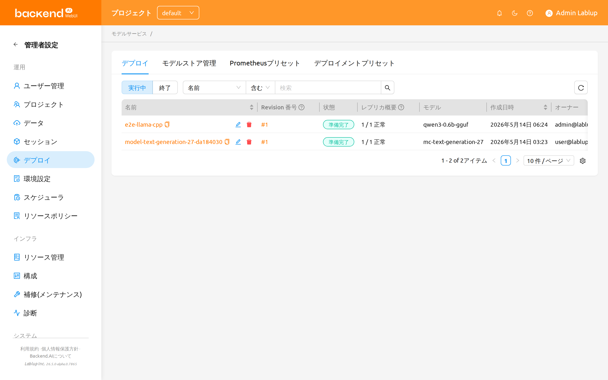

管理者サービングページには2つのタブがあります：

- **Serving**: すべてのプロジェクトのエンドポイント一覧を表示し、ユーザー向けサービングページと同じライフサイクルおよびプロパティフィルターを提供します。
- **Model Store Management**: スーパー管理者のみ利用可能です。以下のセクションを参照してください。

### 管理者モデルストア管理

スーパー管理者は、管理者サービングページの**Model Store Management**タブを通じてモデルカードを管理できます。このタブは、以下の列を持つすべてのモデルカードのテーブルビューを提供します：**Name**、**Title**、**Task**、**Category**、**Labels**、**Created At**、**Controls**。


#### モデルカードの作成

`Create Model Card`ボタンをクリックして作成モーダルを開きます。以下のフィールドを入力します：

- **Name**（必須）: モデルカードの一意の識別子です。
- **Title**: 人間が読みやすい表示名です。
- **Description**: モデルの詳細な説明です。
- **Author**: モデルの作成者または組織です。
- **Model Version**: モデルのバージョンです。
- **Task**: 推論タスクタイプです（例：text-generation）。
- **Category**: モデルカテゴリです（例：LLM）。
- **Framework**: 使用されるMLフレームワークです（例：PyTorch、TensorFlow）。
- **Label**: 分類およびフィルタリング用のタグです。
- **License**: モデルが配布されるライセンスです。
- **Architecture**: モデルアーキテクチャです（例：Transformer）。
- **README**: モデルのマークダウンREADMEです。
- **Domain**: モデルカードを関連付けるドメインです。
- **Project ID**（必須）: モデルカードを所有するプロジェクトです。
- **VFolder**（必須）: モデルファイルを含むストレージフォルダーです。
- **Access Level**: `Internal`（ドメイン内で表示）または`Public`（すべてのユーザーに表示）に設定します。

#### モデルカードの編集

**Controls**列の編集アイコンをクリックして、既存のモデルカードを変更します。以前に入力したフィールドが入力された状態で編集モーダルが開きます。

#### モデルカードの削除

**Controls**列の削除アイコンをクリックして個別のモデルカードを削除するか、複数のモデルカードを選択して`Delete Selected`をクリックして一括削除を実行できます。

#### プロジェクトモデルカードのスキャン

`Scan Project Model Cards`ボタンをクリックして、プロジェクトのモデルフォルダーを自動的にスキャンし、有効なモデル定義を含むフォルダーのモデルカードを作成します。スキャン結果には、作成および更新されたモデルカードの数が表示されます。


:::note
Backend.AI バージョン **26.4.0** 以降、管理者モデルストア管理タブは再設計されました。
それより古いバージョンを使用している場合は、上記の説明がそのまま適用されます。
それ以外の場合は、以下の
[管理者モデルストア管理（バージョン 26.4.0 以降）](#admin-model-store-management-version-26-4-0-and-later)
を参照してください。
:::

<a id="admin-model-store-management-version-26-4-0-and-later"></a>

#### 管理者モデルストア管理（バージョン 26.4.0 以降）

Backend.AI バージョン 26.4.0 以降では、**Model Store Management** タブに再設計されたモデルカード一覧が表示されます。

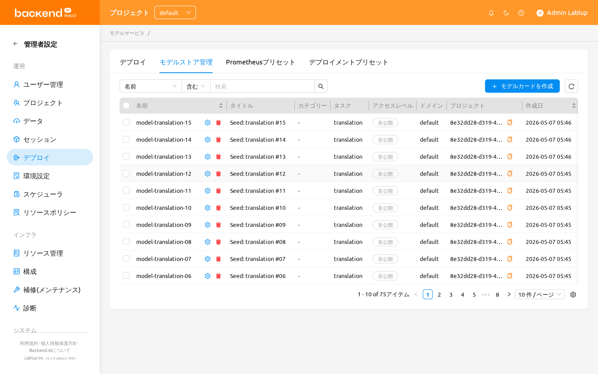

一覧には次の列が表示されます：

- **名前**（Name）: モデルカードの一意の識別子です。
- **タイトル**（Title）: 人間が読みやすい表示名です。
- **カテゴリー**（Category）: モデルカテゴリです（例：LLM）。
- **タスク**（Task）: 推論タスクタイプです（例：text-generation）。
- **アクセスレベル**（Access Level）: モデルカードが公開アクセス可能な場合は緑色の `Public` タグが、それ以外の場合はデフォルトの `Private` タグが表示されます。
- **ドメイン**（Domain）: モデルカードを所有するドメインです。
- **プロジェクト**（Project）: モデルカードを所有するプロジェクトです。
- **作成された時間**（Created At）: モデルカードが作成された時間です。

上部のプロパティフィルターバーを使用して、**名前**で一覧をフィルタリングできます。各行の**名前**セルには、編集および削除のアクションアイコンが直接表示されます。

複数のモデルカードを一度に削除するには、チェックボックスで削除する行を選択し、選択件数の横にある赤色のゴミ箱ボタンをクリックします。カードが削除される前に確認ダイアログが表示されます。

:::note
個別モデルカードの作成、編集、削除ダイアログは以前のバージョンと同じです。
[モデルカードの作成](#creating-a-model-card)、
[モデルカードの編集](#editing-a-model-card)、
[モデルカードの削除](#deleting-model-cards) を参照してください。
:::

:::note
**Scan Project Model Cards** ボタンは Backend.AI バージョン 26.4.0 以降では利用できません。
:::
