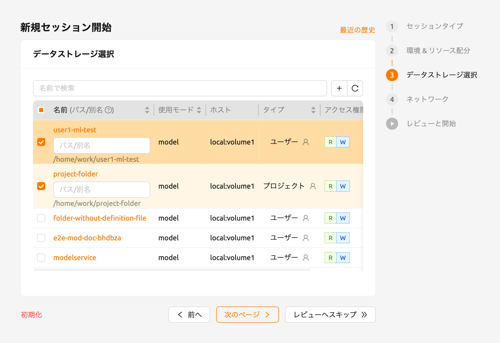
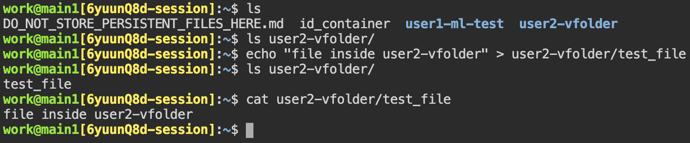
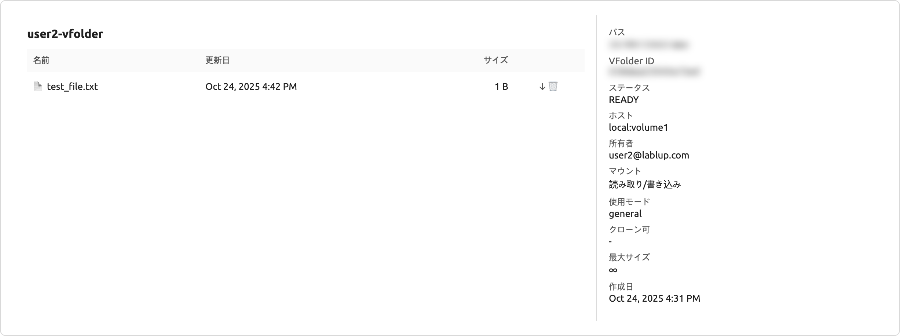

# コンピュートセッションへのフォルダのマウント

Backend.AI provides a function to mount storage folders when creating a compute session.
When new compute session is started, ユーザー will have access to the`/home/work/` directory.
Normal directories and files created under `/home/work/` will disappear when the compute session is terminated.
This is because compute sessions are dynamically created and deleted based on the container.
To preserve data inside a container regardless of the container's lifecycle, a separate host folder must be mounted in the container, and then files must be created within the mounted folder.

Go to 'セッション' page and click the 'Start' button.
After filling out the 'Session Type', 'Environments & Resource allocation' steps,
navigate to the 'データとストレージ' step to see a list of folders that ユーザーs can mount.
From this list, choose the folders to mount and add them, or select multiple folders to mount more.
The documentation will explain how to mount two folders, `user1-ml-test` and `user2-vfolder`,
and then create a session.

   By looking at the data and folder information within that project, ユーザーs can see information such as usage mode,
   the storage host the folder belongs to, permissions, and more.
   Note that the 'データとストレージ' step only outputs data folders that are mountable by the current ユーザー.
   For example, folders that belong to other projects cannot be viewed.

   Clicking a 'folder name' in the 'データとストレージ' step will open the folder explorer for that folder.
   From this, ユーザーs can view the folders that have been created, create new folders, and upload files.
   For more detailed instructions related to folders, please refer [Explore Folder<explore_folder>](#Explore Folder<explore_folder>) section.

   Alternatively, a new virtual folder can be created by clicking the '+' button.
   For further information on how to create a new folder in session launcher page,
   please refer [Create storage folder<create_storage_folder>](#Create storage folder<create_storage_folder>) section.

In the created session, click the created session name to open detail information drawer. Then,
click the 'Execute Terminal App' icon button (upper right corner, second from the right) to open terminal app.
Or you can also open terminal app from the notification.
`ls` command will mount ``user1-ml-test` folder and `user2-vfolder` under the `user1-ml-test`
and `user2-vfolder` folders are mounted under the home directory.

   The selected folder will be mounted with its name under `/home/work/` inside the compute session, by its default.
   For example, if folder's name is `test`, it is mounted on `/home/work/test`.
   To customize the mount path, write an absolute path in the 'Path and Alias' input fields.
   Writing `/workspace` in the input field of the `test` folder will mount to `/workspace` inside the session.
   Writing a relative path will mount the folder under `/home/work/` with the path.

Backend.AIは、計算セッションが削除される際にフォルダー内のファイルを保持するオプションを提供します。以下の例は、何が起こっているかを示しています。

Under the `user2-vfolder`, create a `test_file`.
Fill the contents with \"file inside ユーザー2-vfolder\".

Running `ls` command against `user2-vfolder`, ユーザーs can confirm the file was created successfully.
Please note the contents of the file can be chekced with `cat` command.

Now delete the compute session and go to the Storage page.
Locate the `user2-vfolder folder`, open a file explorer and check that the `test_file` exists.
Click the 'download' button in 'Actions' tab to download the file to the local machine and open it
to confirm that the contents are \"file inside ユーザー2-vfolder\".

コンピュートセッションを作成するときにマウントされたフォルダでファイル管理を行うと、ユーザーがコンピュートセッションを終了した後でもデータが保持されることがあります。

## 自動マウントフォルダを使用して計算セッション環境を構成する

If a new program or library is required that is not pre-installed in a compute session, a Storage folder attribute and [automount-folder<automount-folder>](#automount-folder<automount-folder>),
which is independent of the compute session lifecycle, can be used to install the package.
Configure a consistent environment regardless of the type of compute session.

### pipでPythonパッケージをインストールする

Creating a folder named `.local` allows a ユーザー to install Python ユーザー packages in same folder.
`pip` by default installs the packages in the `.local` folder under the ユーザー's home folder
(Please note that automount folder is mounted under ユーザー's home folder).
So, to keep a Python package called `tqdm` installed at all times, regardless of the computing environment,
a command like the following could be issued from the terminal:

``shell
pip install tqdm
``
After that, when a new compute session is created, the `.local__PROTECTED_29__tqdm__PROTECTED_30__tqdm__PROTECTED_31__PYTHONPATH__PROTECTED_32__.bashrc__PROTECTED_33__pip__PROTECTED_34__PYTHONPATH__PROTECTED_35____PROTECTED_36__apt__PROTECTED_37__yum__PROTECTED_38__root__PROTECTED_39__sudo__PROTECTED_40__root__PROTECTED_41__sudo__PROTECTED_42__.linuxbrew__PROTECTED_43__.linuxbrew__PROTECTED_44__/home/linuxbrew/.linuxbrew__PROTECTED_45____PROTECTED_46____PROTECTED_47____PROTECTED_48____PROTECTED_49__brew__PROTECTED_50__/home/linuxbrew/.linuxbrew__PROTECTED_51__.linuxbrew` folder exists.
So, if an automount folder named ''.linuxbrew'' is created, the Homebrew packages previously installed can be used again, even if the compute session is deleted and a new compute session is created.