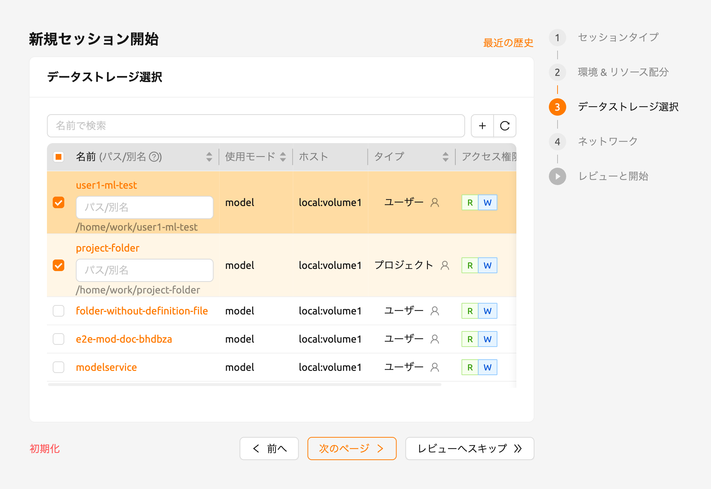
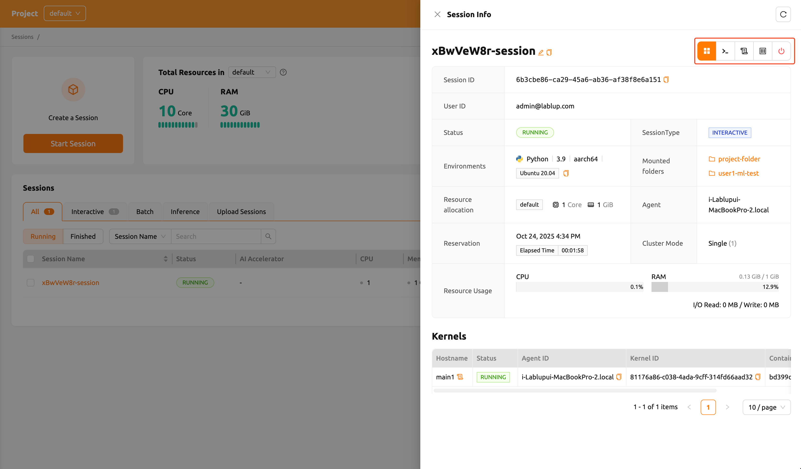
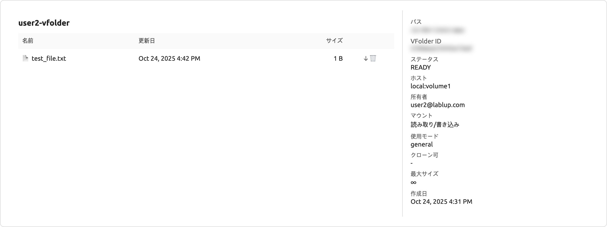

# コンピュートセッションへのフォルダのマウント

<a id="session-mounts"></a>

Backend.AIは、コンピュートセッション作成時にストレージフォルダをマウントする機能を提供しています。新しいコンピュートセッションが開始されると、ユーザーは `/home/work/` ディレクトリにアクセスできます。
`/home/work/` 配下に作成された通常のディレクトリやファイルは、コンピュートセッションが終了すると消失します。
これは、コンピュートセッションがコンテナをベースに動的に作成・削除されるためです。
コンテナのライフサイクルに関係なくコンテナ内のデータを保持するには、別のホストフォルダをコンテナにマウントし、マウントされたフォルダ内にファイルを作成する必要があります。

「セッション」ページに移動し、「開始」ボタンをクリックします。
「セッションタイプ」、「環境とリソース割り当て」のステップを入力した後、
「データとストレージ」ステップに進むと、ユーザーがマウントできるフォルダの一覧が表示されます。
この一覧から、マウントするフォルダを選択して追加したり、複数のフォルダを選択してまとめてマウントしたりすることができます。
このドキュメントでは、`user1-ml-test` と `user2-vfolder` の2つのフォルダをマウントしてセッションを作成する方法を説明します。




:::note
プロジェクト内のデータおよびフォルダ情報を確認することで、ユーザーは使用モード、フォルダが属するストレージホスト、権限などの情報を確認できます。
「データとストレージ」ステップでは、現在のユーザーがマウント可能なデータフォルダのみが表示される点に注意してください。例えば、他のプロジェクトに属するフォルダは表示されません。
:::

:::note
「データとストレージ」ステップで「フォルダ名」をクリックすると、そのフォルダのフォルダエクスプローラーが開きます。
ここから、ユーザーは作成済みのフォルダを表示したり、新しいフォルダを作成したり、ファイルをアップロードしたりできます。
フォルダに関するより詳細な操作については、[フォルダを探索](#explore-folder)セクションを参照してください。
:::

:::note
また、「+」ボタンをクリックして新しいバーチャルフォルダを作成することもできます。
セッションランチャーページで新しいフォルダを作成する方法の詳細については、[ストレージフォルダを作成](#create-storage-folder)セクションを参照してください。
:::

作成されたセッションで、セッション名をクリックして詳細情報ドロワーを開きます。そして、「ターミナルアプリを実行」アイコンボタン（右上の右から2番目）をクリックしてターミナルアプリを開きます。または通知からターミナルアプリを開くこともできます。
`ls` コマンドを実行すると、`user1-ml-test` フォルダと `user2-vfolder` フォルダがホームディレクトリ配下にマウントされていることを確認できます。





:::note
選択したフォルダは、デフォルトでコンピュートセッション内の `/home/work/` 配下にフォルダ名でマウントされます。
例えば、フォルダ名が `test` の場合、`/home/work/test` にマウントされます。
マウントパスをカスタマイズするには、「Path and Alias」入力フィールドに絶対パスを記入します。
`test` フォルダの入力フィールドに `/workspace` と記入すると、セッション内の `/workspace` にマウントされます。
相対パスを記入した場合は、そのパスを付けて `/home/work/` 配下にフォルダがマウントされます。
:::

Backend.AIは、計算セッションが削除される際にフォルダー内のファイルを保持するオプションを提供します。以下の例は、何が起こっているかを示しています。

`user2-vfolder` の配下に `test_file` を作成します。
ファイルの内容は \"file inside user2-vfolder\" とします。


`user2-vfolder` に対して `ls` コマンドを実行すると、ファイルが正常に作成されたことを確認できます。
ファイルの内容は `cat` コマンドで確認できます。

次に、コンピュートセッションを削除してストレージページに移動します。
`user2-vfolder` フォルダを見つけ、ファイルエクスプローラーを開いて `test_file` が存在することを確認します。
「アクション」タブの「ダウンロード」ボタンをクリックしてファイルをローカルマシンにダウンロードし、ファイルを開いて内容が \"file inside user2-vfolder\" であることを確認します。



コンピュートセッションを作成するときにマウントされたフォルダでファイル管理を行うと、ユーザーがコンピュートセッションを終了した後でもデータが保持されることがあります。


<a id="using-automount-folder"></a>

## 自動マウントフォルダを使用して計算セッション環境を構成する

コンピュートセッションにプリインストールされていない新しいプログラムやライブラリが必要な場合、ストレージフォルダの属性とコンピュートセッションのライフサイクルから独立した[自動マウントフォルダ](#automount-folder)を利用して、パッケージをインストールできます。
これにより、コンピュートセッションの種類に関係なく一貫した環境を構成できます。


<a id="using-pip-with-automountfolder"></a>

### pipでPythonパッケージをインストールする

`.local` という名前のフォルダを作成すると、ユーザーは同じフォルダにPythonユーザーパッケージをインストールできます。
`pip` はデフォルトでユーザーのホームフォルダ配下の `.local` フォルダにパッケージをインストールします
（自動マウントフォルダはユーザーのホームフォルダ配下にマウントされることに注意してください）。
したがって、コンピューティング環境に関係なく `tqdm` という Python パッケージを常にインストール済みの状態に保つには、ターミナルから以下のようなコマンドを実行します。

```shell
pip install tqdm
```

その後、新しいコンピュートセッションを作成すると、`tqdm` パッケージがインストールされた `.local` フォルダが自動的にマウントされるため、ユーザーは `tqdm` パッケージを再インストールすることなく利用できます。

:::note
複数のPythonバージョン、または異なるPythonバージョンを使用するセッションを利用する場合、パッケージに互換性の問題が発生する可能性があります。
これは、`.bashrc` を通じて `PYTHONPATH` 環境変数を分岐させることで回避できます。
これは、ユーザーの `pip` パッケージが `PYTHONPATH` で指定されたパスにインストールされるためです。
:::


<a id="using-linuxbrew-with-automountfolder"></a>

### Homebrewでパッケージをインストールする

Ubuntuの `apt` やCentOSの `yum` のようなパッケージマネージャーは通常 `root` 権限を必要とします。
セキュリティ上の理由から、Backend.AIのコンピュートセッションではデフォルトで `sudo` と `root` のアクセスがブロックされているため（設定によっては許可される場合もあります）、`sudo` を必要としない [Homebrew on Linux](https://docs.brew.sh/Homebrew-on-Linux) の使用を推奨します。

Homebrewは以下のように設定できます。

- データとストレージページで `.linuxbrew` フォルダを作成します。
- コンピュートセッションを作成します（`.linuxbrew` フォルダは `/home/linuxbrew/.linuxbrew` に自動的にマウントされます）。
- まだインストールされていない場合は、コンピュートセッション内でHomebrewをインストールします。

   ```shell
   $ /bin/bash -c "$(curl -fsSL https://raw.githubusercontent.com/Homebrew/install/HEAD/install.sh)"
   ```
- Homebrewパッケージは以下のようにインストールできます。

   ```shell
   $ brew install hello
   $ hello
   Hello, world!
   ```
`brew` は `/home/linuxbrew/.linuxbrew` 配下にパッケージをインストールします。このディレクトリは `.linuxbrew` フォルダが存在する場合に自動的にマウントされます。
したがって、`.linuxbrew` という名前の自動マウントフォルダを作成しておけば、コンピュートセッションを削除して新しいコンピュートセッションを作成しても、以前にインストールしたHomebrewパッケージを再利用できます。