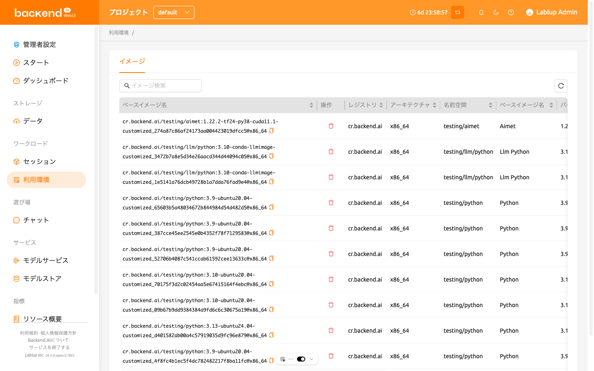
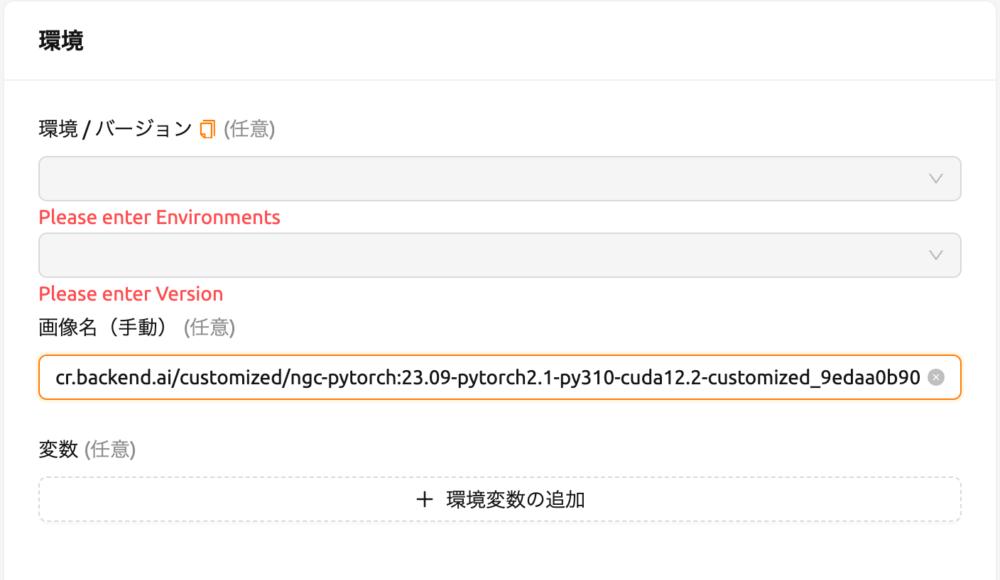
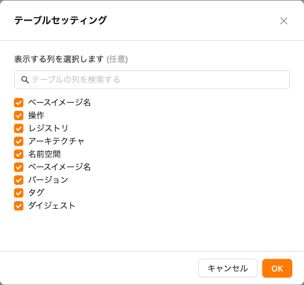

# マイ環境

24.03から、ユーザー向けの新しい「マイ環境」ページが導入されました。
このページでは、ユーザーの
[セッションコミット](#save-session-commit)によって作成されたイメージの一覧などを確認できます。

マイ環境ページのImagesタブでは、ユーザーはコンピュートセッションの作成に使用されるカスタマイズされたイメージを管理できます。このタブには、計算セッションからイメージに変換されたイメージのメタデータ情報が表示されます。ユーザーは、各イメージのレジストリ、アーキテクチャ、ネームスペース、言語、バージョン、ベース、制約、ダイジェスト、その他の情報を確認できます。

イメージを削除するには、コントロール列の赤いゴミ箱ボタンをクリックします。削除後は、そのイメージを使用して新しいセッションを作成することはできません。

イメージ名をコピーして、手動イメージでセッションを作成することもできます。Full Image Path列のイメージ名の横にあるコピーアイコンをクリックすると、クリップボードにコピーされます。その後、セッションページに移動してセッションを作成します。コピーしたイメージ名を手動イメージの入力欄に貼り付けます。

特定の列を非表示にしたり表示したりしたい場合は、テーブルの右下にある歯車アイコンをクリックしてください。すると、以下のダイアログが表示され、表示したい列を選択することができます。

