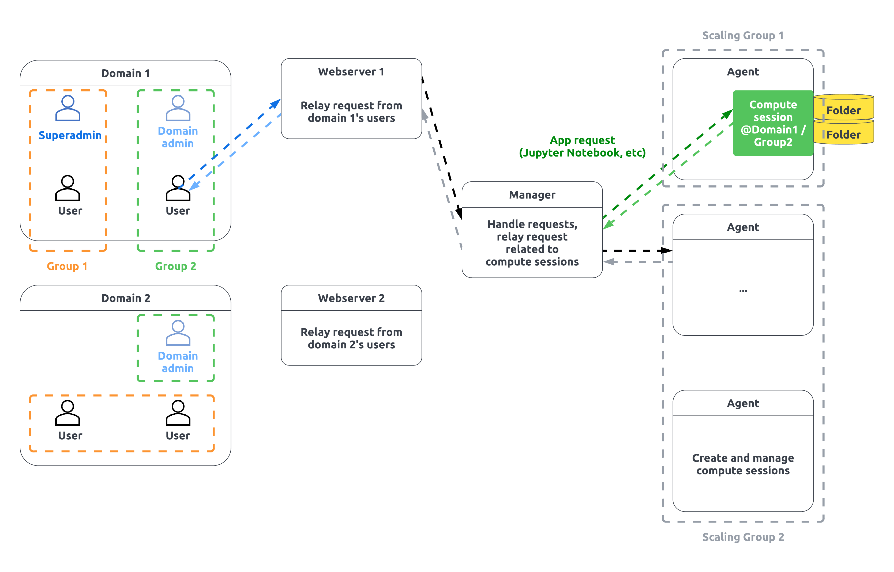

# 概要

Backend.AIは、オープンソースのクラウドリソース管理プラットフォームであり、クラウドやオンプレミス環境で仮想化されたコンピュートリソースクラスターを簡単に利用できるようにします。Backend.AIのコンテナベースのGPU仮想化技術は、1つの物理GPUを柔軟に分割し、複数のユーザーが同時に使用できるようにすることで、GPUの効率的な利用をサポートします。

Backend.AIは、研究者、管理者、DevOpsを含む多様なユーザーをサポートするために、機械学習および高性能コンピューティングクラスターのためのさまざまなパフォーマンス駆動の最適化と、管理および研究機能を提供します。Enterprise Editionでは、マルチドメイン管理のサポート、スーパ管理者専用のコントロールパネル、GPU仮想化プラグインが追加されます。

GUIクライアントパッケージは、Backend.AIサーバーがサポートする機能を簡単に利用するために提供されています。Backend.AI Web-UIは、ウェブサービスまたはスタンドアローンアプリの形をしたGUIクライアントです。計算リソースを利用し、その環境を管理するために、Backend.AIサーバーにアクセスする便利なグラフィカルインターフェースを提供します。Backend.AIはあらかじめ作成されたイメージを提供し、別々のプログラムをインストールすることなく、即座にコンピュートセッションを作成できます。ほとんどのタスクはマウスクリックと簡単な入力で行うことができ、より直感的な使用を実現します。

## キーコンセプト

- ユーザー: ユーザーはBackend.AIに接続して作業を行う人物です。ユーザーは権限に応じて、通常のユーザー、ドメイン管理者、およびスーパー管理者に分かれます。通常のユーザーはコンピューティングセッションに関連するタスクのみを実行できますが、ドメイン管理者はドメイン内でタスクを実行する権限があります。スーパー管理者はシステム全体にわたってほぼすべてのタスクを実行します。ユーザーは1つのドメインに所属し、ドメイン内の複数のプロジェクトに所属することができます。
- 計算セッション、コンテナ: あなたのコードが実行される、隔離された仮想環境です。これは、完全なユーザー権限を持つ実際のLinuxサーバーのように見え、たとえあなたのセッションと同じサーバー上で実行されていても、他のユーザーのセッションを見ることはできません。Backend.AIはこの仮想環境をコンテナと呼ばれる技術を通じて実装しています。あなたが作成できる計算セッションは、所属するドメインおよびプロジェクト内に限られます。
- ドメイン: これはBackend.AIがサポートする権限とリソース管理の最上位レイヤーです。企業や組織において、ドメインを系列会社として見なし、各ドメイン（または系列会社）ごとに権限とリソースポリシーを設定することができます。ユーザーは一つのドメインにのみ所属するべきであり、自分のドメイン内でのみセッションを作成したり、他の作業を行ったりすることができます。ドメインには1人以上のドメイン管理者が存在し、ドメイン内でポリシーを設定したり、セッションを管理したりすることができます。たとえば、ドメインで利用可能なリソースの総量を設定した場合、ドメイン内のユーザーによって作成されるすべてのコンテナのリソースは設定された量を超えることはできません。
- プロジェクト: ドメインに属する階層構造。一つのドメインには複数のプロジェクトが存在できます。プロジェクトを作業単位として考えることができます。ユーザーは一つのドメイン内で複数のプロジェクトに同時に所属することができます。コンピュートセッションは一つのプロジェクトに属し、ユーザーは自分の所属するプロジェクト内でのみセッションを作成できます。ドメイン管理者はドメイン内のプロジェクトに対してポリシーを設定したり、セッションを管理したりすることができます。例えば、プロジェクト内で利用可能なリソースの総量を設定した場合、プロジェクト内のユーザーによって作成されたすべてのコンテナのリソースは、設定された量を超えることはできません。
- イメージ: 各コンテナには、言語専用のランタイムとさまざまな計算フレームワークが事前にインストールされています。それらのスナップショットが実行される前の状態をイメージと呼びます。クラスタ管理者が提供するイメージを実行するか、自分が使用したいソフトウェアを搭載したイメージを作成して、管理者に登録を依頼することができます。
- バーチャルフォルダ（vfolder）：コンテナがどのノードで実行されているかに関わらず、常にアクセス可能でコンテナ内にマウント可能な「クラウド」フォルダ（ユーザごとに個別）。自分のバーチャルフォルダを作成した後、自分のプログラムコードやデータなどを事前にアップロードし、計算セッションを実行する際にフォルダをマウントして、あたかもローカルディスクであるかのように読み書きすることができます。
- アプリケーションサービス、サービスポート: コンピュートセッション内で実行されているさまざまなユーザーアプリケーション（例: DIGITS、Jupyter Notebook、シェルターミナル、TensorBoardなど）にアクセスする機能です。コンテナのアドレスやポート番号を直接知る必要はなく、提供されたCLIクライアントまたはGUI Web-UIを使用して、セッションの目的のデーモンに直接アクセスできます。
- Web-UI: Webまたはスタンドアロンアプリとして提供されるGUIクライアントです。Backend.AIサーバーのアドレスを指定し、ユーザーアカウント情報を入力してログインすることでサービスを利用できます。
- ローカル wsproxy: Web-UI アプリに組み込まれたプロキシサーバー。ローカル wsproxy は、サーバーと Web-UI アプリ間の一般的な HTTP リクエストを WebSocket に変換し、メッセージを送信します。Web-UI アプリが wsproxy への接続を失うか、wsproxy サーバーが停止すると、Jupyter Notebook やターミナルなどのサービスにアクセスすることはできません。
- Web wsproxy: Web上で提供されるWeb-UIの場合、ブラウザの特性上、組み込みサーバーを使用することはできません。この場合、wsproxyサーバーを別のWebサーバーとして設定し、Web-UIアプリがWeb wsproxyを参照できるようにすることで、Jupyter NotebookやターミナルなどのサービスをWeb環境で使用できます。

## Backend.AI 機能の詳細

**アクセラレータサポート**

| カテゴリー | 最小要件 | 専用機能 |
| --- | --- | --- |
| AMD | MI250X 以降 |  |
| Furiosa | Warboy / RNGD |  |
| Graphcore | IPU |  |
| Groq | Groqcard |  |
| HyperAccel |  |  |
| Intel | Gaudi 2 および 3 | メモリ使用量に基づく自動アイドルリソース回収 |
| NVIDIAサポート | CUDA compute capability 7.5 以降 | (エンタープライズ) コンテナ向けフラクショナルGPU (fGPU) 仮想化と共有 |
|  | - モデル推論: NVIDIA Hopper 以降 (対象量子化に依存) |  |
|  | - モデル学習: NVIDIA Ampere 以降 | コンテナレベルのマルチGPU |
|  |  | 複数のCUDAライブラリバージョンサポート |
|  |  | GPUDirectストレージサポート |
|  |  | NGC (NVIDIA GPU Cloud) イメージ統合 |
|  |  | GPU-GPUネットワーク自動構成 |
| Rebellions | ATOM / ATOM+ |  |
| SambaNova | SN30/40L |  |
| Sapeon | X220 / X330 |  |
| Tenstorrent | Wormhole |  |

**その他の機能**

| カテゴリー | 機能 |
| --- | --- |
| スケーリング | ベアメタル / VM のオンプレミスインストール |
|  | ハイブリッドクラウド（オンプレミス + クラウド） |
|  | ポリクラウド（マルチクラウドフェデレーション） |
| スケジューリング | GUI管理を用いた統合スケジューリングとモニタリング |
|  | ユーザーごとのリソースポリシー |
|  | キーペアごとのリソースポリシー |
|  | プロジェクトごとのリソースポリシー |
|  | 利用可能スロットベースのスケジューリング |
|  | (エンタープライズ) 利用率に基づくリソース管理 |
| クラスターパーティショニング | H/W仕様と使用状況によるリソースグループ |
|  | (エンタープライズ) リソースグループへのユーザーアクセス制御 |
|  | (エンタープライズ) リソースグループへのプロジェクトアクセス制御 |
| セキュリティ | ハイパーバイザー/コンテナによるサンドボックス化 |
|  | 各ユーザーのアクセスログ |
|  | セッション（コンテナ）ごとのログ |
| UI / UX | GUIウェブインターフェース |
|  | (エンタープライズ) 管理者GUIウェブインターフェース |
|  | (エンタープライズ) MLOpsパイプラインWebインターフェース |
| データ管理 | EFS、NFS、SMBおよび分散ファイルシステム（CephFS、GlusterFS、HDFSなど） |
|  | (エンタープライズ) ストレージソリューションの統合: CephFS、Dell PowerScale、IBM SpectrumScale、NetApp、PureStorage、WEKA |
|  | ユーザー/プロジェクトによるデータへの細かいアクセス制御 |
|  | ユーザー/プロジェクトごとのストレージクォータ管理* |
| 開発者サポート | ユニバーサルプログラミング言語（Python、C/C++など） |
|  | インタラクティブWebアプリ（Terminal、Jupyter、VSCode、MLFlow、Microsoft NNI、R Studioなど） |
|  | 多様なタイプのコンピュートセッション提供（インタラクティブ、バッチ、推論） |
| データサイエンティスト向け | 複数バージョンのライブラリを実行するユーザー（例: TensorFlow、PyTorch） |
|  | 複数バージョンのライブラリの同時使用者 |
|  | MLライブラリの定期的な更新 |
| カスタマーサポート（エンタープライズ） | オンサイトインストール（ベアメタル / VM） |
|  | 設定サポート（オンプレミス + クラウド） |
|  | 管理者 / ユーザートレーニング |
|  | 最新バージョンへの更新サポート |
|  | 優先開発とエスカレーション |
|  | カスタマイズされたコンテナイメージ / カーネルまたはカーネルリポジトリ |

\* ディレクトリクォータ管理をサポートするストレージでのみ利用可能

## ユーザーロールによるアクセス可能なメニュー

:::note
- `*` マークのあるページは管理メニューに含まれています。
- 管理者専用の機能は[管理メニュー](#admin-menus)セクションに記載されています。
:::

| ページ \\ ロール | ユーザー | 管理者 |
| --- | --- | --- |
| スタート | O | O |
| ダッシュボード | O | O |
| データ | O | O |
| セッション | O | O |
| モデルサービス | O | O |
| インポート＆実行 | O | O |
| マイ環境 | O | O |
| チャット | O | O |
| モデルストア | O | O |
| リソースサマリー | O | O |
| 統計 | O | O |
| ユーザー* | X | O |
| 環境* | X | O |
| スケジューラー* | X | O |
| リソースポリシー* | X | O |
| リソース* | X | O |
| 構成* | X | O |
| メンテナンス* | X | O |
| 情報* | X | O |