

# プロジェクト管理者機能

**プロジェクト管理者**は、特定のプロジェクトに対する管理権限を付与されたユーザーです。プロジェクト管理者は、システム全体のスーパー管理者権限を必要とせずに、自分が管理するプロジェクトに所属するユーザーを確認したり、コンピュートセッションやモデルデプロイメントを監視したり、ストレージフォルダを運用したりできます。

## プロジェクト管理者権限のあるプロジェクトの識別

ヘッダーのプロジェクトドロップダウンを開くと、プロジェクト管理者ロールを持つプロジェクトには名前の横に盾の形のバッジが表示されます。バッジにカーソルを合わせると **プロジェクト管理者** ツールチップが表示され、このプロジェクトを選択すると以下で説明するプロジェクト管理者向けサイドバー項目が表示されることが確認できます。

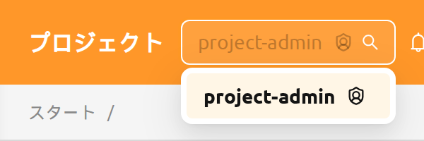

ヘッダーのプロジェクトセレクターで別のプロジェクトに切り替えると、ユーザーのロールが再評価されます。同じユーザーが同一のログインセッション内で、あるプロジェクトではプロジェクト管理者として、別のプロジェクトでは一般ユーザーとして振る舞うことがあります。プロジェクト管理者ロールの付与と取り消しの方法については、RBAC管理章の[プロジェクト管理者権限の付与](#grant-project-admin)セクションを参照してください。

## プロジェクト管理者用サイドバー

プロジェクト管理者ロールを持つプロジェクトを選択すると、サイドバーの **運用** セクションに、そのプロジェクトを管理するための4つの項目が表示されます:

- **ユーザー** — 現在のプロジェクトのメンバー
- **データ** — 現在のプロジェクトが所有するストレージフォルダ
- **セッション** — 現在のプロジェクトのユーザーが所有するコンピュートセッション
- **デプロイメント** — 現在のプロジェクトが所有するモデルデプロイメント

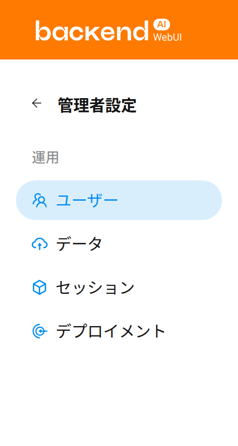

プロジェクト管理者ページでは、上部のプロジェクトセレクターで選択したプロジェクト配下の項目のみが表示されます。この内容はページ上部のバナーで確認できます。

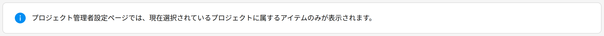

## ユーザー

**ユーザー** ページには、現在選択されているプロジェクトに所属するすべてのユーザーが表示されます。このページを使用して、プロジェクトのメンバーを一目で確認できます。例えば、プロジェクトのリソースにアクセスできるユーザーを確認したり、非アクティブなアカウントを特定したりできます。

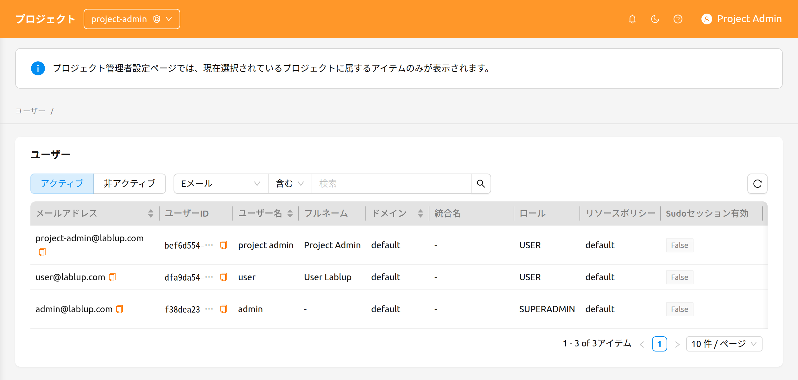

このページには以下のコントロールが用意されています:

- **アクティブ / 非アクティブ** セグメントコントロール: アクティブユーザーと非アクティブユーザーを切り替えます。デフォルトではアクティブが選択されています。
- **プロパティフィルター**: E-Mail、ID、ユーザー名、ロール、作成日時で一覧をフィルタリングします。

プロジェクト管理者にとって、ユーザーページは**読み取り専用**です。このページにはユーザーの作成、編集、無効化のアクションはなく、これらの操作はスーパー管理者のみが、[管理者機能](#admin-menus)章で説明されているシステム全体のユーザーページから実行できます。

## データ

**データ** ページには、現在選択されているプロジェクトが所有するストレージフォルダ（vfolder）が表示されます。このページから、プロジェクト共有フォルダの作成、誤って削除されたフォルダの復元、保持の必要がなくなったフォルダの完全削除を行えます。

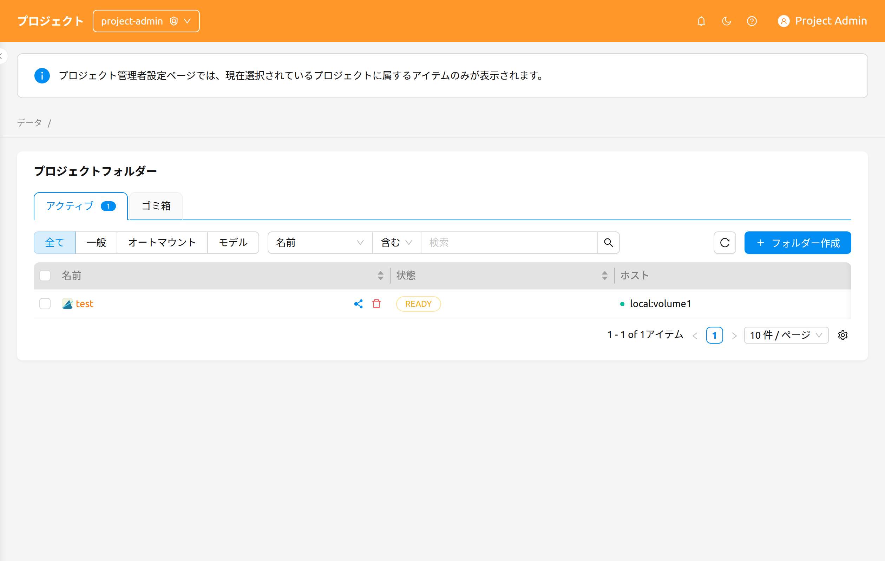

このページには以下のコントロールが用意されています:

- **アクティブ / ゴミ箱** タブ: 現在アクティブなフォルダとソフト削除されたフォルダを切り替えます。各タブには、含まれるフォルダ数を示す件数バッジが表示されます。
- **モードフィルター**: フォルダの使用モードでフィルタリングします — **全て**、**一般**、**パイプラインフォルダ**、**オートマウント**、**モデル**。

   **パイプラインフォルダ** と **モデル** のオプションは、デプロイメントで対応する機能が有効になっている場合にのみ表示されます — **パイプラインフォルダ** には FastTrack パイプラインエンドポイント、**モデル** にはモデルフォルダが有効になっている必要があります。

- **プロパティフィルター**: 標準のストレージフォルダプロパティフィルターを使用して一覧を絞り込みます。

### フォルダの作成

このページから新しいフォルダを作成するには:

1. ページ右上の **フォルダー作成** ボタンをクリックします。
2. 作成モーダルでフォルダ情報を入力します。
3. **OK** をクリックしてフォルダを作成します。

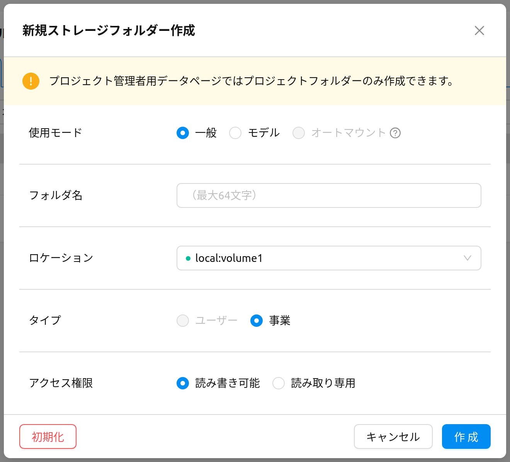

:::info
プロジェクト管理者用データページからは、**プロジェクト所有**フォルダのみ作成できます。作成モーダルには、これを明示する次のメッセージが表示されます:

> プロジェクト管理者用データページではプロジェクトフォルダーのみ作成できます。
:::

フォルダの使用モード、権限、クォータの詳細については、[ストレージフォルダ](#vfolders)章を参照してください。

### フォルダの復元または完全削除

**ゴミ箱** タブに切り替えると、ソフト削除されたフォルダを確認できます。行のチェックボックスで1つ以上のフォルダを選択し、選択件数の横に表示されるヘッダーのアクションボタンを使用します:

- **復元**: 選択したフォルダをアクティブタブに戻します。
- **完全削除**: 選択したフォルダを完全に削除します。この操作は取り消せず、確認のためにフォルダ名を入力する必要があります。

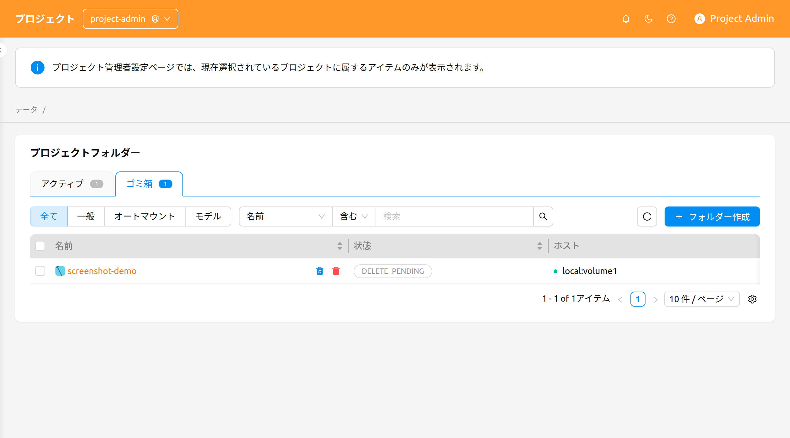

:::danger
ストレージフォルダを完全削除すると、すべてのコンテンツが削除され、取り消すことはできません。確認モーダルでは、削除ボタンが有効になる前にフォルダ名を正確に入力する必要があります。
:::

## セッション

**セッション** ページには、現在選択されているプロジェクトのユーザーが所有するコンピュートセッションが表示されます。このページから、アクティブなワークロードの監視、長時間実行されているセッションの特定、不要になったセッションの終了を行えます。

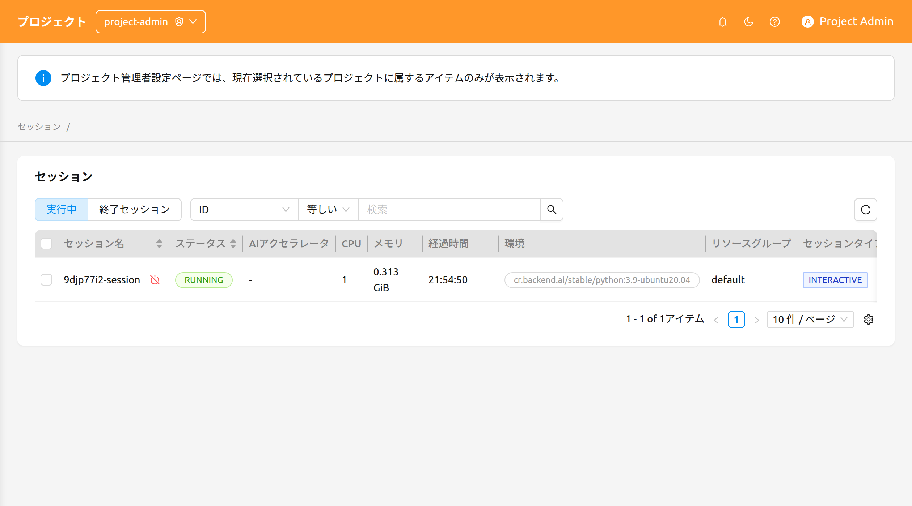

このページには以下のコントロールが用意されています:

- **実行中 / 終了済み** セグメントコントロール: 現在実行中のセッションとすでに終了したセッションを切り替えます。
- **プロパティフィルターと並べ替え**: ID、セッション名、所有者UUIDで一覧をフィルタリングできます。並べ替え可能な列ヘッダーをクリックするとテーブルを並べ替えられます。

### セッションの終了

1つ以上のセッションを終了するには:

1. 最も左側の列のチェックボックスを使用して、終了するセッションを選択します。単一のセッションを終了する場合は、セッション名の横にある **終了する** ボタンを利用できます。
2. テーブルヘッダーの電源オフアイコンをクリックして確認モーダルを開きます。
3. モーダルに表示された対象セッションのリストを確認します。
4. 必要に応じて **強制終了** チェックボックスを選択すると、現在のステータスに関係なくセッションを終了またはキャンセルできます。このオプションを有効にすると警告が表示され、確認ボタンのラベルが **終了する** から **強制終了** に変わります。
5. 確認ボタンをクリックしてセッションを終了します。

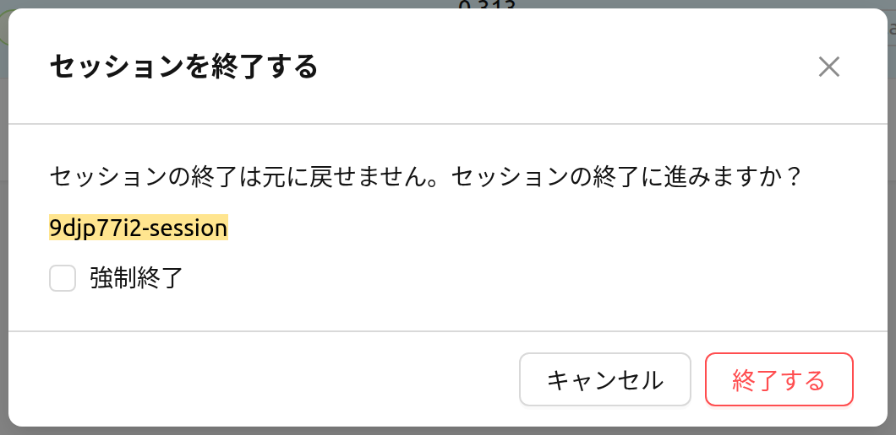

:::warning
**強制終了** は、セッションがハングして状態が不当に長時間変化しない場合にのみ使用してください。強制終了はエージェント上の実際のコンテナを削除しないため、その後に手動でのクリーンアップが必要になる場合があります。
:::

:::note
プロジェクト管理者用のセッションページでは、現時点ではセッション名をクリックしてもセッションの詳細パネルは開きません。コンピュートセッションと詳細表示についての背景情報は、[セッションページ](#session-page)章を参照してください。
:::

## デプロイメント

**デプロイメント** ページには、現在選択されているプロジェクトが所有するモデルデプロイメントが表示されます。このページから、推論エンドポイントの管理、デプロイメント設定の編集、使用しなくなったデプロイメントの削除を行えます。

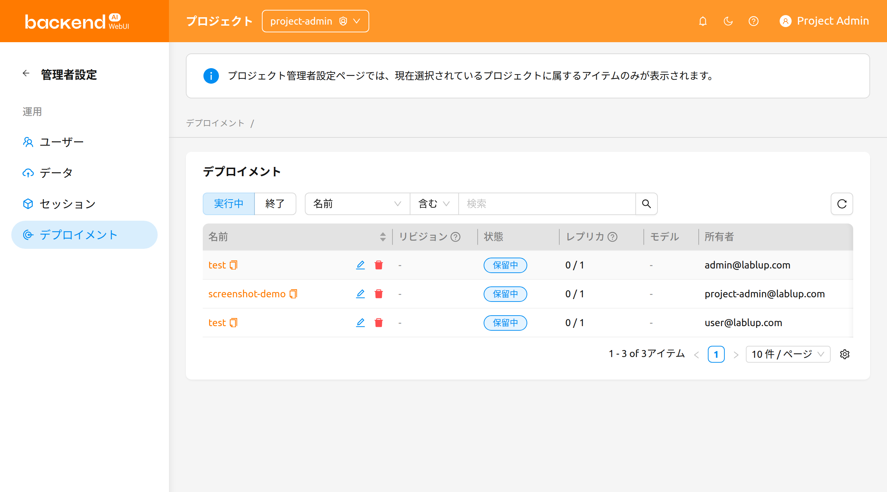

このページには以下のコントロールが用意されています:

- **実行中 / 終了済み** セグメントコントロール: 現在実行中のデプロイメントと終了したデプロイメントを切り替えます。
- **プロパティフィルター**: 名前、タグ、エンドポイントURL、公開設定で一覧をフィルタリングします。

テーブルにはデプロイメントの名前、リビジョン、ステータス、レプリカ、モデル、作成日時、所有者の各列に加え、必要に応じてドメイン、プロジェクト、リソースグループも表示されます。

**リビジョン** 列には、デプロイメントの現在のリビジョンがクリック可能な `#N` リンクとして表示されます。これをクリックすると、現在のリビジョンの詳細を表示するパネルが開きます。

### デプロイメントの操作

各デプロイメントの行では、以下のアクションが利用できます:

- **デプロイメント名**をクリックすると、プロジェクト管理者スコープ内のデプロイメント詳細ページに移動します。
- **リビジョン番号**（`#N`）をクリックすると、現在のリビジョンの詳細パネルが開きます。
- **鉛筆アイコン**をクリックすると、設定モーダルでデプロイメントの構成を編集できます。
- **ゴミ箱アイコン**をクリックすると、デプロイメントを削除できます。削除を実行するには、確認モーダルでデプロイメント名を入力する必要があります。

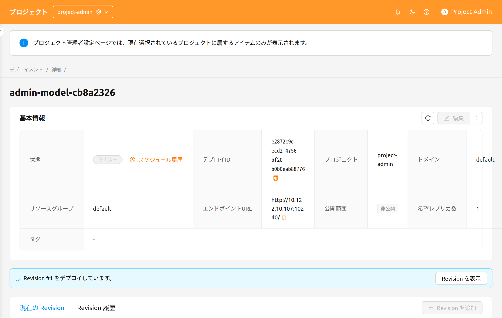

デプロイメントのリビジョン、レプリカ、トラフィックルーティングの詳細については、[デプロイ](#model-serving)章を参照してください。
