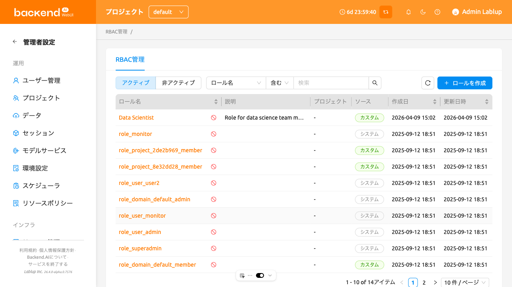
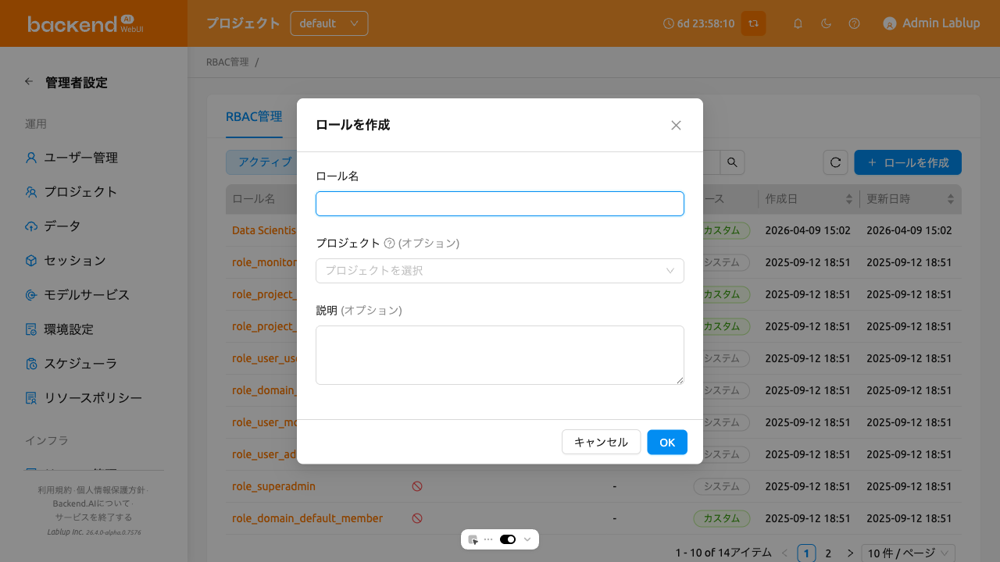
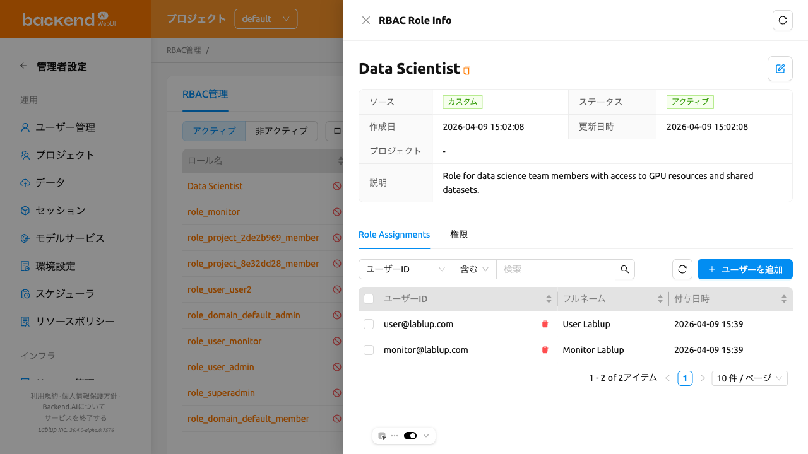
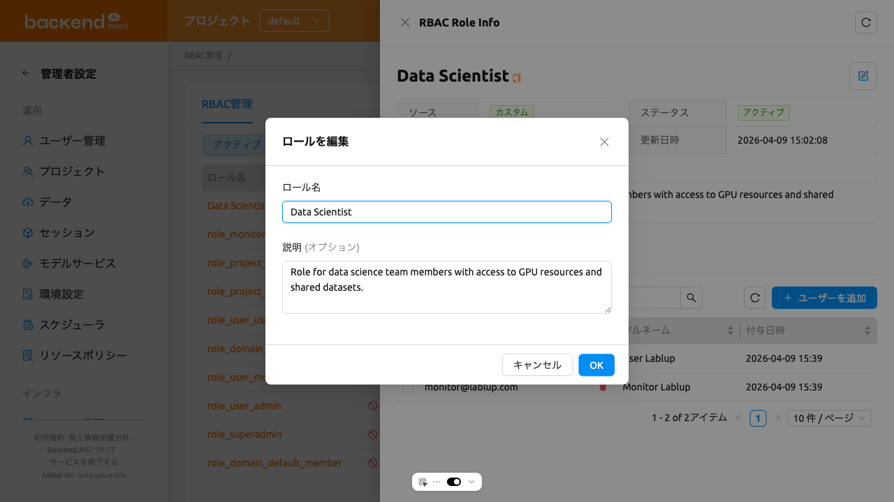
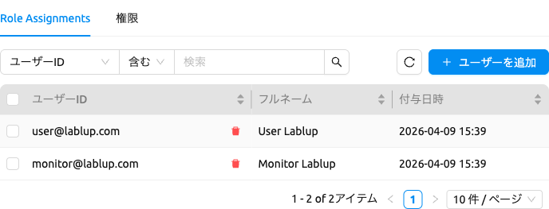
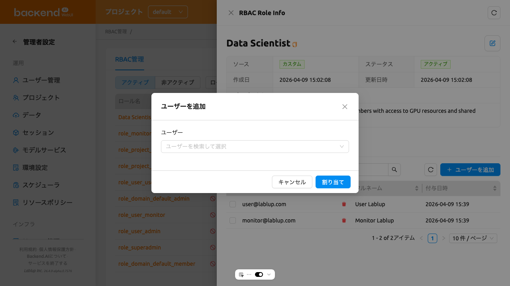
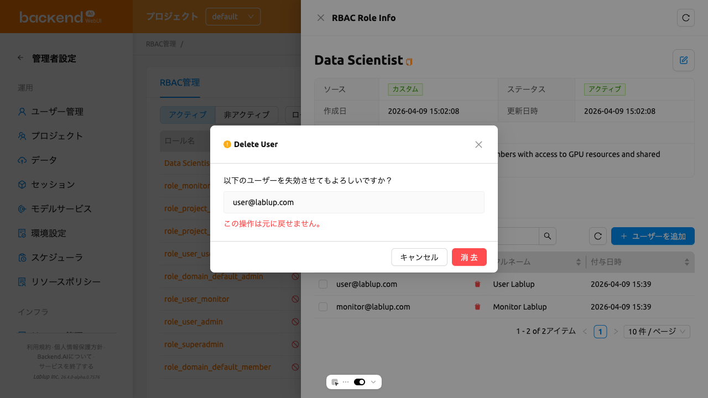
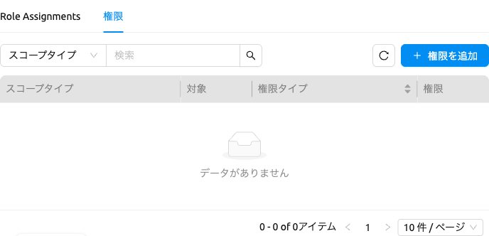
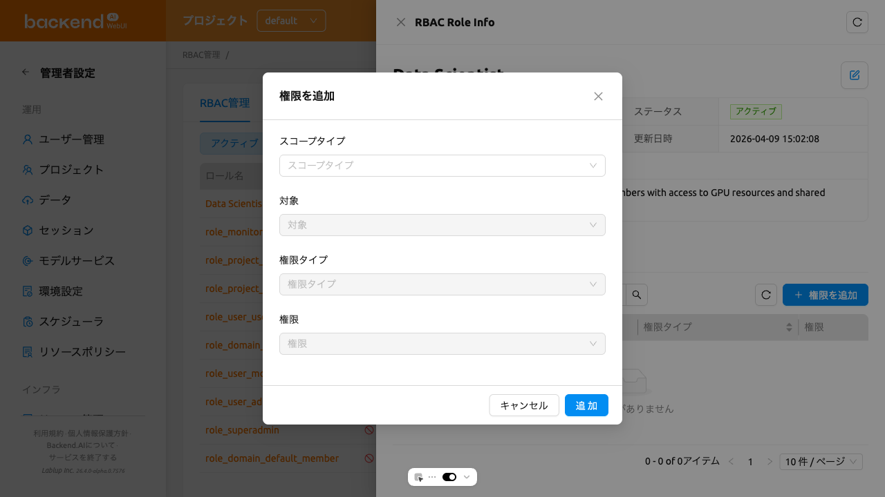

# RBAC管理

RBAC（ロールベースアクセス制御）管理では、スーパー管理者がきめ細かい権限を持つロールを定義し、ユーザーに割り当てることができます。RBACを使用すると、Backend.AIシステム全体で特定のユーザーがさまざまなリソースに対して実行できる操作を制御できます。

:::note
RBAC管理はスーパー管理者のみが利用でき、Backend.AI Managerバージョン25.4.0以降が必要です。
:::

RBAC管理ページにアクセスするには、サイドバーメニューの**管理者設定**セクションで**RBAC管理**をクリックします。

## ロール一覧

ロール一覧ページでは、すべてのロールがテーブル形式で表示されます。ページ上部のコントロールを使用して、ロールのフィルタリング、検索、ソートができます。

- **ステータスフィルター**: **アクティブ**と**非アクティブ**のロールを切り替えるセグメントコントロールです。デフォルトではアクティブが選択されています。
- **名前検索**: 名前でロールを検索したり、ソース（システムまたはカスタム）でフィルタリングできるプロパティフィルターです。
- **ロールを作成**: 新しいカスタムロールを作成するボタンです。

テーブルには以下の列が表示されます:

- **ロール名**: ロールの名前です。名前をクリックするとロール詳細パネルが開きます。
- **説明**: ロールの目的に関する簡単な説明です。
- **プロジェクト**: ロールに関連付けられたプロジェクトスコープです（ある場合）。
- **ソース**: ロールが**システム**（事前定義）か**カスタム**（ユーザー作成）かを示します。
- **作成日時**: ロールが作成された日時です。
- **更新日時**: ロールが最後に変更された日時です。

**ロール名**、**作成日時**、**更新日時**の列ヘッダーをクリックしてテーブルをソートできます。

### システムロールとカスタムロール

ロールは2つのソースタイプに分類されます:

- **システム**: 自動生成されるロールです。名前や説明は編集できませんが、ユーザーの割り当てと権限を管理できます。
- **カスタム**: スーパー管理者が作成したロールです。名前、説明、割り当て、権限など、すべての項目を編集できます。

## ロールの作成

新しいカスタムロールを作成するには:

1. ロール一覧ページの右上にある**ロールを作成**ボタンをクリックします
2. 作成モーダルで以下のフィールドを入力します:
   - **ロール名**（必須）: 一意のロール名を入力します
   - **説明**（任意）: ロールの目的に関する説明を入力します
   - **プロジェクト**（任意）: ロールの権限が適用されるプロジェクトを選択します。特定のプロジェクトに権限の範囲を指定する場合にのみ必要です。
3. **OK**をクリックしてロールを作成します

:::info
将来のバージョンでは、ロール作成モーダルからプロジェクトセレクターが削除される予定です。プロジェクトスコープの権限は、ロール作成時にプロジェクトを選択しなくても、権限設定から直接構成できるようになります。
:::

## ロール詳細の表示

ロールの詳細情報を表示するには、テーブルでロール名をクリックします。ページの右側に詳細パネルが開きます。

パネルのヘッダーにはロール名が表示され、カスタムロールの場合は**編集**ボタンが提供されます。詳細セクションには以下のメタデータが表示されます:

- **ソース**: システムまたはカスタム
- **ステータス**: アクティブまたは非アクティブ
- **作成日時**: 作成タイムスタンプ
- **更新日時**: 最終変更タイムスタンプ
- **プロジェクト**: 関連付けられたプロジェクト（ある場合）
- **説明**: ロールの説明

メタデータの下には**Role Assignments**と**権限**の2つのタブがあります。

### ロールの編集

カスタムロールの名前や説明を編集するには:

1. テーブルでロール名をクリックして詳細パネルを開きます
2. パネルヘッダーの**編集**ボタン（鉛筆アイコン）をクリックします
3. 編集モーダルで**ロール名**や**説明**を変更します
4. **OK**をクリックして変更を保存します

:::note
編集ボタンはカスタムロールでのみ利用可能です。システムロールの名前や説明は変更できません。
:::

### ロールのステータス管理

ロール一覧から管理できる2つのステータスがあります:

- **アクティブ**: ロールが現在有効です。アクティブなロールを**非アクティブ化**して一時的に停止できます。
- **非アクティブ**: ロールが停止中です。非アクティブなロールを**アクティブ化**して復元するか、**完全に削除**して永久に削除できます。

**アクティブ**なロールを表示しているとき、ロール名にマウスを置くと**非アクティブ化**アクションが表示されます。**非アクティブ**なロールを表示しているとき、ロール名にマウスを置くと**アクティブ化**と**ロールを完全に削除**アクションが表示されます。

:::danger
ロールの完全削除は元に戻せません。ロールとすべての関連データが永久に削除されます。完全削除する前に、ロールのすべてのユーザー割り当てと権限を先に削除する必要があります。
:::

## ユーザー割り当ての管理

ロール詳細パネルの**Role Assignments**タブでは、ロールに割り当てられているユーザーを確認できます。

### ロールにユーザーを追加

1. ロール詳細パネルを開き、**Role Assignments**タブを選択します
2. **ユーザーを追加**ボタンをクリックします
3. モーダルでメールアドレスまたは名前でユーザーを検索します
4. チェックボックスを使用して1人以上のユーザーを選択します
5. **割り当て**をクリックして選択したユーザーをロールに割り当てます

### ロールからユーザーを削除

1. **Role Assignments**タブで、削除するユーザーの横にある**ユーザーを削除**ボタンをクリックします
2. 確認ダイアログで削除を確認します

## 権限の管理

ロール詳細パネルの**権限**タブでは、ロールに設定されたきめ細かい権限を確認できます。

### 権限について

各権限は4つの構成要素で構成されています:

- **スコープタイプ**: 権限が対象とするリソースの種類（例: ドメイン、プロジェクト、ユーザー、フォルダ、リソースグループ、セッション、モデルサービス、コンテナレジストリ、ストレージホスト、キーペア）
- **対象**: スコープタイプ内の特定のエンティティ（例: 特定のドメイン名、特定のプロジェクト）
- **権限タイプ**: 権限が制御するリソースのカテゴリで、選択したスコープタイプに基づいてフィルタリングされます
- **権限**: リソースに対して許可される操作です。選択した権限タイプに応じて、有効な操作のみが表示されます。操作は2つのカテゴリに分類されます:
   * **直接実行**: 作成、読み取り、更新、削除、完全削除
   * **他ユーザーへ委任**: 全権限委任、読み取り権限委任、更新権限委任、削除権限委任、完全削除権限委任

### 権限設定の例

以下は、4つの構成要素がどのように連携するかを理解するための一般的な権限設定例です:

| シナリオ | スコープタイプ | 対象 | 権限タイプ | 権限 |
|---------|-------------|------|---------|------|
| 特定プロジェクトでストレージフォルダの作成を許可 | プロジェクト | my-project | VFolder | 作成 |
| ドメイン内のすべてのセッションの表示を許可 | ドメイン | default | Session | 読み取り |
| モデルサービングエンドポイントの管理を許可 | ドメイン | default | Endpoint | 作成、読み取り、更新 |
| コンテナイメージの削除を許可 | ドメイン | default | Image | 削除 |

### 権限の追加

1. ロール詳細パネルを開き、**権限**タブを選択します
2. **権限を追加**ボタンをクリックします
3. モーダルで以下のフィールドを入力します:
   - **スコープタイプ**: リソースの種類を選択します（例: ドメイン、プロジェクト、ユーザー、フォルダ、リソースグループ）
   - **対象**: 特定のエンティティを選択または検索します。入力方法は選択したスコープタイプに応じて動的に変更されます:
      * ドメイン: アクティブなドメインのリストから選択
      * プロジェクト: プロジェクトを選択（ドメインフィルタリング可能）
      * ユーザー: メールアドレスまたは名前でユーザーを検索
      * リソースグループ: 利用可能なリソースグループから選択
      * その他のタイプ: 該当するエンティティリストから選択
   - **権限タイプ**: エンティティタイプを選択します。選択したスコープタイプに有効なタイプのみ表示されます
   - **権限**: 操作を選択します（例: 作成、読み取り、更新、削除、完全削除、または委任操作）
4. **OK**をクリックして権限を作成します

### 権限の削除

1. **権限**タブで、削除する権限の横にある**権限を削除**ボタンをクリックします
2. 確認ダイアログで削除を確認します
