

# RBAC管理

RBAC（ロールベースアクセス制御）管理では、スーパー管理者がきめ細かい権限を持つロールを定義し、ユーザーに割り当てることができます。RBACを使用すると、Backend.AIシステム全体で特定のユーザーがさまざまなリソースに対して実行できる操作を制御できます。

RBAC管理ページにアクセスするには、サイドバーメニューの**管理者設定**セクションで**RBAC管理**をクリックします。

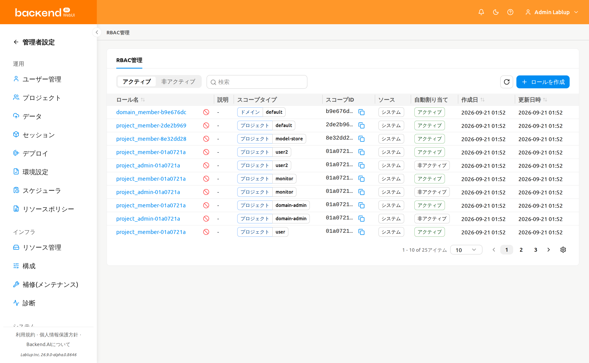

## ロール一覧

ロール一覧ページでは、すべてのロールがテーブル形式で表示されます。ページ上部のコントロールを使用して、ロールのフィルタリング、検索、ソートができます。

- **ステータスフィルター**: **アクティブ**と**非アクティブ**のロールを切り替えるセグメントコントロールです。デフォルトではアクティブが選択されています。
- **プロパティフィルター**: 一覧を絞り込むプロパティフィルターです。フィルター入力は選択したプロパティに合わせて切り替わります。以下のプロパティを使用できます:
   * **名前**: ロール名で検索する自由入力テキストです。
   * **ソース**: 利用可能な値（**システム** / **カスタム**）を自由入力のテキストボックスではなく選択式の入力として表示します。
   * **割り当てられたユーザー**: ユーザーピッカーで、選択したユーザーに割り当てられたロールのみを表示するように一覧を絞り込みます。生成された条件タグにはユーザーのメールアドレスが表示されます。
   * **スコープタイプ**: RBACのスコープタイプ（例: ドメイン、プロジェクト、ユーザー）を一覧表示する選択式の入力です。
   * **スコープID**: 生のスコープUUIDで検索する自由入力テキストです。
- **ロールを作成**: 新しいカスタムロールを作成するボタンです。

テーブルには以下の列が表示されます:

- **ロール名**: ロールの名前です。名前をクリックするとロール詳細パネルが開きます。
- **説明**: ロールの目的に関する簡単な説明です。
- **スコープタイプ**: ロールに最初に割り当てられたスコープのタイプです。ロールに複数のスコープが割り当てられている場合は `+N` 表示が一緒に表示されます。
- **スコープID**: ロールに最初に割り当てられたスコープの生IDです。複数のスコープが割り当てられている場合は `+N` 表示が一緒に表示されます。
- **ソース**: ロールが**システム**（事前定義）か**カスタム**（ユーザー作成）かを示します。
- **自動割り当て**: ロールが登録されているスコープにユーザーが追加された際に、そのロールが自動的に割り当てられるかどうかを示します。自動割り当てが有効な場合は**アクティブ**、無効な場合は**非アクティブ**と表示されます。
- **作成日時**: ロールが作成された日時です。
- **更新日時**: ロールが最後に変更された日時です。

### システムロールとカスタムロール

ロールは2つのソースタイプに分類されます:

- **システム**: 自動生成されるロールです。名前や説明は編集できませんが、ユーザーの割り当てと権限を管理できます。
- **カスタム**: スーパー管理者が作成したロールです。名前、説明、割り当て、スコープ、権限など、すべての項目を編集できます。

## ロールの作成

ロールを作成する際には、まず**スコープ**を事前に定義する必要があります。スコープはロールを特定のリソースエンティティ（ドメイン、プロジェクト、ユーザーなど）にバインドし、後で追加するすべての権限がここで定義したスコープ内でのみ動作するように制限します。

新しいカスタムロールを作成するには:

1. ロール一覧ページの右上にある**ロールを作成**ボタンをクリックします
2. 作成モーダルで以下のフィールドを入力します:
   - **ロール名**（必須）: 一意のロール名を入力します
   - **説明**（任意）: ロールの目的に関する説明を入力します
   - **自動割り当て**（任意）: 有効にすると、ロールが登録されているスコープにユーザーが追加された際に、そのロールが自動的に付与されます。デフォルトは無効です。
   - **スコープタイプ / 対象**（必須、1つ以上）: 各スコープ行で**スコープタイプ**を選択し、そのスコープタイプ内の特定の**対象**を選択します。**追加**ボタンでスコープ行を追加したり、削除アイコンで行を削除できます。少なくとも1つのスコープを追加する必要があります。
3. **OK**をクリックしてロールを作成します

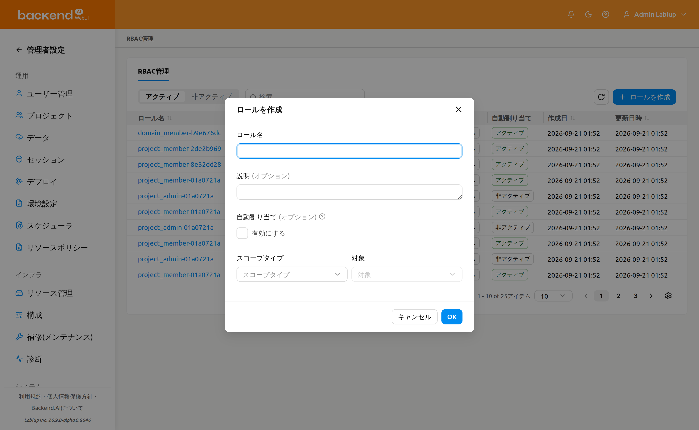

:::info
ロール作成時に設定する**スコープタイプ**と**対象**は、それ自体で権限を付与するものではありません。代わりに、後でこのロールに[権限](#manage-permissions)を追加する際に選択できる**スコープタイプ / 対象**の候補をあらかじめ定義します。つまり、ロール作成の段階では、このロールの権限が取り得るスコープタイプと対象の範囲をあらかじめ限定するものであり、各権限はここで定義したスコープタイプと対象の範囲内でのみ設定できます。
:::

:::warning
スコープはロール作成時に定義され、作成後はロール詳細パネルから編集できません。ロールを作成する前にスコープを慎重に計画してください。
:::

## ロール詳細の表示

ロールの詳細情報を表示するには、テーブルでロール名をクリックします。ページの右側に詳細パネルが開きます。

パネルのヘッダーにはロール名が表示され、カスタムロールの場合は**編集**ボタンが提供されます。詳細セクションには以下のメタデータが表示されます:

- **ソース**: システムまたはカスタム
- **ステータス**: アクティブまたは非アクティブ
- **自動割り当て**: 自動割り当てがアクティブか非アクティブかを示します。アクティブの場合、登録されているスコープのいずれかに追加されたユーザーに対して、ロールが自動的に付与されます。
- **作成日時**: 作成タイムスタンプ
- **更新日時**: 最終変更タイムスタンプ
- **説明**: ロールの説明

メタデータの下には**権限**と**ロール割り当て**の2つのタブがあります。デフォルトでは**権限**タブが選択されています。

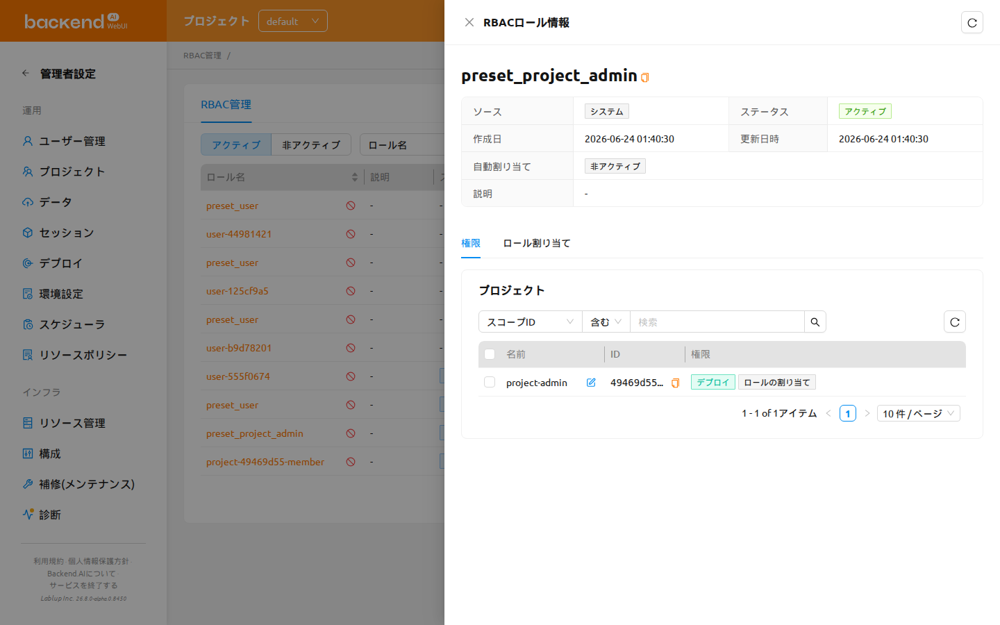

### ロールの編集

カスタムロールの名前、説明、または自動割り当て設定を編集するには:

1. テーブルでロール名をクリックして詳細パネルを開きます
2. パネルヘッダーの**編集**ボタン（鉛筆アイコン）をクリックします
3. 編集モーダルで以下のフィールドを変更します:
   - **ロール名**: ロールの名前
   - **説明**: ロールの目的に関する説明
   - **自動割り当て**: 有効にすると、ロールが登録されているスコープにユーザーが追加された際に、そのロールが自動的に付与されます。
4. **OK**をクリックして変更を保存します

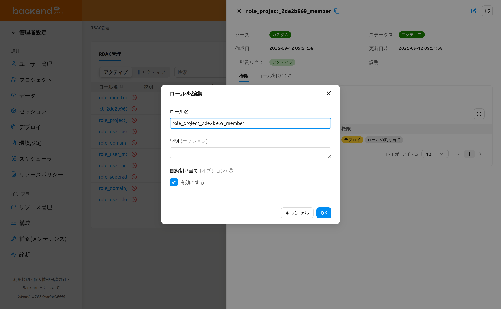

:::note
編集ボタンはカスタムロールでのみ利用可能です。システムロールの名前や説明は変更できません。また、どちらの場合もロール作成後にスコープを変更することはできません。
:::

## 権限の管理

ロール詳細パネルの**権限**タブは、ロールのスコープときめ細かい権限を統合した詳細ビューです。ロールが使用する**スコープタイプごとに1枚のカード**をレンダリングし、各カードはそのスコープタイプのスコープと、それらに付与された権限を併せて表示します。

:::info
ロールが参照できるスコープはロール作成時に定義され、その後は**読み取り専用**です。ロール詳細パネルから変更することはできません。権限タブでは、スコープは各スコープタイプカード内の行として表示されます。ロールのスコープを変更するには、目的のスコープを持つ新しいロールを作成する必要があります。
:::

### スコープタイプカード

権限タブには、ロールが使用するスコープタイプ（例: ドメイン、プロジェクト、ユーザー）ごとに1枚のカードが表示されます。ロールが使用しないスコープタイプは非表示になり、カードのタイトルはローカライズされたスコープタイプ名です。各カードには以下が含まれます:

- **スコープIDフィルター**: 生のスコープUUIDでカードの行を絞り込むプロパティフィルターです。解決済みのスコープ名での検索はできません。
- **更新**ボタン: カードの行を再読み込みし、権限タグを再計算します。
- **スコープテーブル**: このタイプに属するロールのスコープを以下の列とともに一覧表示します:
   * **名前**: 解決済みのスコープ名（例: ドメイン、プロジェクト、ユーザーの表示名）で、そのスコープの権限編集モーダルを開くインラインの**編集**アクションが併せて表示されます。
   * **ID**: スコープUUIDです。
   * **権限**: 権限タイプごとに1つのタグが付与状態に応じて色分けされて表示されます（下記参照）。スコープタイプに設定可能なエンティティがない場合、この列は`-`と表示されます。
- **ページネーション**: スコープが多い場合にカードのスコープをページで表示します。

ロールにスコープがまったくない場合、タブにはカードの代わりに**このロールにはスコープが設定されていません**というメッセージが表示されます。

### 付与状態タグ

**権限**列では、各権限タイプのタグは、そのスコープに対してそのタイプの操作がどれだけ付与されているかに応じて色分けされます:

- **すべて許可**（緑）: その権限タイプのすべての操作が付与されています。
- **一部許可**（黄）: 一部の操作のみが付与され、すべてではありません。
- **許可されていません**（色なし）: どの操作も付与されていません。

タグにカーソルを合わせると、状態ラベルが表示されます。

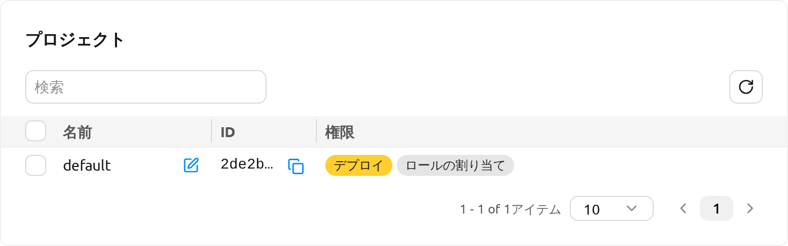

### 権限について

各権限は4つの構成要素で構成されています:

- **スコープタイプ**: 権限が適用される有効範囲（例: ドメイン、プロジェクト、ユーザー）
- **対象**: 有効範囲内の特定のエンティティ（例: 特定のドメイン名、特定のプロジェクト）
- **権限タイプ**: 権限の有効範囲内で操作が実行される対象です。
- **権限**: 権限タイプに対して許可される操作です。選択した権限タイプに応じて、有効な操作のみが表示されます。操作は2つのカテゴリに分類されます:
   * **直接実行**: 作成、読み取り、更新、削除、完全削除
   * **他ユーザーへ委任**: 全権限委任、読み取り権限委任、更新権限委任、削除権限委任、完全削除権限委任

:::info
各権限の**スコープタイプ / 対象**の組み合わせは、ロールのスコープエントリから継承されます。ロール作成時に定義されたスコープに対してのみ権限を付与できます。ロールの適用範囲を広げるには、追加のスコープを持つ新しいロールを作成する必要があります。
:::

### 権限設定の例

以下は、4つの構成要素がどのように連携するかを理解するための一般的な権限設定例です。**スコープタイプ / 対象**列は、権限が再利用するロールレベルのスコープを示しています。

| シナリオ | スコープタイプ / 対象 | 権限タイプ | 権限 |
|---------|---------------------|---------|------|
| 特定プロジェクトでストレージフォルダの作成を許可 | プロジェクト / my-project | フォルダ | 作成 |
| 特定のドメイン内のすべてのセッションの表示を許可 | ドメイン / default | セッション | 読み取り |
| 特定のドメイン内のモデルサービスの管理を許可 | ドメイン / default | モデルサービス | 作成、読み取り、更新 |
| 特定のドメイン内のコンテナイメージの削除を許可 | ドメイン / default | イメージ | 削除 |

### スコープの権限を編集（単一スコープ）

権限は、各行が権限タイプ、各セルが操作のチェックボックスであるグリッドベースのモーダルを通じて、スコープごとに編集します。

1. **権限**タブでスコープタイプカードを開き、変更したいスコープ行の**編集**アクションをクリックします。
2. **{スコープタイプ}権限を編集**モーダルが開き、スコープ名がサブタイトルとして表示されます。以下のグリッドが表示されます:
   - 行はスコープタイプに有効な**権限タイプ**です。
   - 列は**直接実行**（作成、読み取り、更新、削除、完全削除）と**他ユーザーへ委任**（すべて、読み取り、更新、削除、完全削除）のグループに分かれています。
   - 権限マトリックスがサポートしていないセルは`-`と表示され、**この権限は割り当てできません。**というツールチップが表示されます。
3. 各チェックボックスは、スコープに現在付与されている操作に合わせて**あらかじめチェック**されています。セルをチェック／チェック解除して許可内容を変更します。
4. **保存**をクリックします。変更はスコープの現在の付与状態と照合され、新しくチェックしたセルは付与され、解除したセルは削除されます。

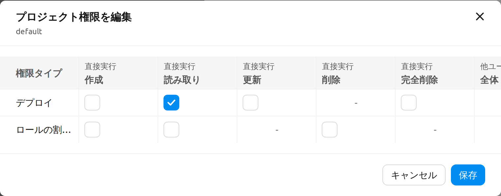

:::note
権限の編集は**元に戻せる**操作です。いつでもモーダルを再度開いてグリッドを変更できるため、保存には名前を入力して確認する代わりに通常の**保存**ボタンを使用します。
:::

### 複数スコープの権限を編集（一括）

同じタイプの複数のスコープに、同じ権限変更を一度に適用できます。

1. スコープタイプカードで、行のチェックボックスを使用して**2つ以上**のスコープを選択します。選択件数ラベルが表示されたら、その横の鉛筆（**権限を編集**）コントロールを使用して一括モーダルを開きます。
2. **{スコープタイプ}権限を一括編集**モーダルが開きます。すべてのセルは**現状のまま**の状態で始まります。触れなかったセルは選択した各スコープの既存の値を保持し、編集モードに切り替えたセルのみが選択した**すべての**スコープに適用されます。
3. セルをクリックして編集モードに切り替えます（チェックされた状態で始まります）。チェック／チェック解除して、選択したすべてのスコープに適用する値を設定します。
4. **保存**をクリックして、選択したすべてのスコープに変更を適用します。

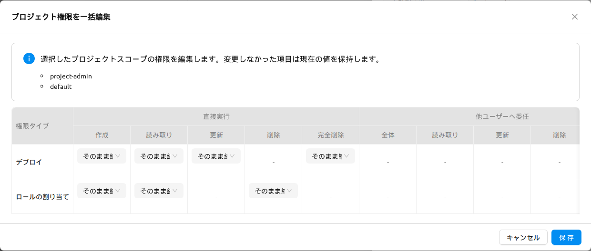

### 変更なしと部分的な失敗の動作

権限の変更を保存すると:

- 変更がない場合、モーダルはリクエストを送信せずに閉じ、**変更はありません。**というメッセージが表示されます。
- 成功すると、**権限を保存しました。**というメッセージが表示され、カードのタグが再計算されます。
- **部分的な失敗**の場合、モーダルは開いたままになり、失敗したセルにフラグが付きます。一括エラーモーダルには、失敗した各リクエスト（対象スコープ、権限、エラーメッセージ）と成功・失敗の件数が一覧表示されます。グリッドを調整して再度保存すると、失敗したセルのみを再試行できます。

<!--  -->
<!-- TODO: Capture the bulk-error modal shown after a partial-failure permission save -->

## ユーザー割り当ての管理

ロール詳細パネルの**ロール割り当て**タブでは、ロールに割り当てられているユーザーを確認できます。

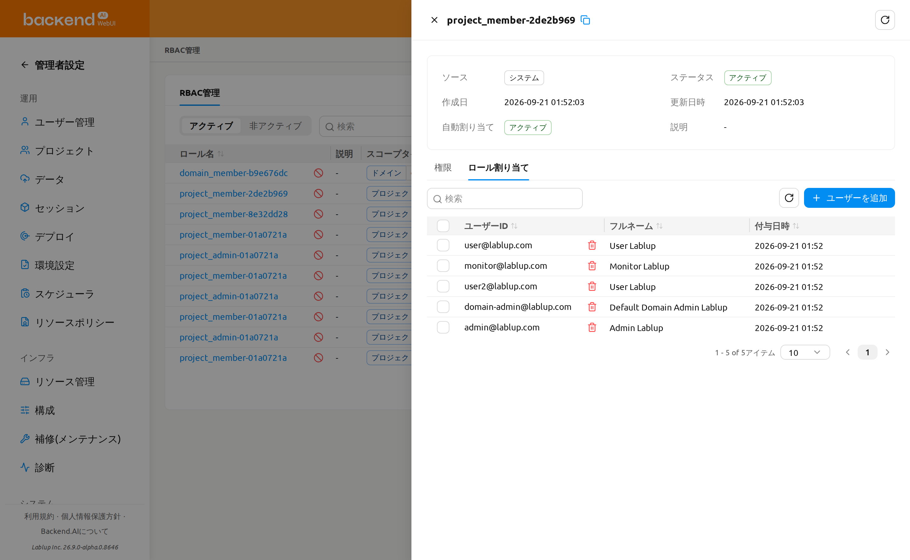

### ロールにユーザーを追加

1. ロール詳細パネルを開き、**ロール割り当て**タブを選択します
2. **ユーザーを追加**ボタンをクリックします
3. モーダルでメールアドレスまたは名前でユーザーを検索します
4. チェックボックスを使用して1人以上のユーザーを選択します
5. **割り当て**をクリックして選択したユーザーをロールに割り当てます

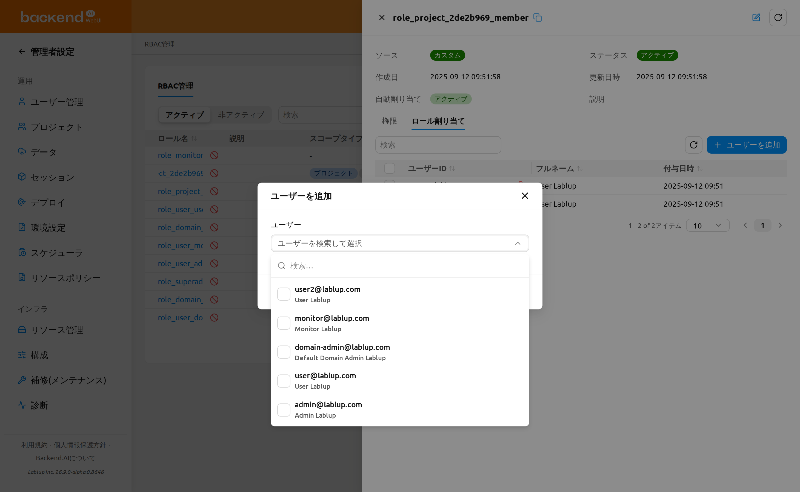

ユーザーの追加は一括操作です。一度に複数のユーザーを選択して、まとめて割り当てることができます。一部の割り当てが失敗した場合、モーダルは開いたままになり、一括エラーモーダルに失敗した各ユーザーとエラーメッセージ、成功・失敗の件数が一覧表示されます。正常に割り当てられたユーザーは選択から解除されるため、失敗したユーザーのみが選択された状態で残り、**追加**を再度クリックしてそれらだけを再試行できます。

<!--  -->
<!-- TODO: Capture the Add User modal with the bulk-error modal listing failed assignments -->

### システムロールと割り当ての制限

システムが生成したプロジェクト管理者ロール（**ソース**が**システム**の`project-<project_id>-admin`ロール）は、ロール割り当てタブからユーザーを直接割り当てたり外したりすることはできません。このタブには**システムによって自動的に作成されたロールには、ユーザーを直接割り当てたり外したりすることはできません。**という警告アラートが表示され、割り当てテーブルは読み取り専用になります（**ユーザーを追加**と解除のコントロールは非表示になります）。

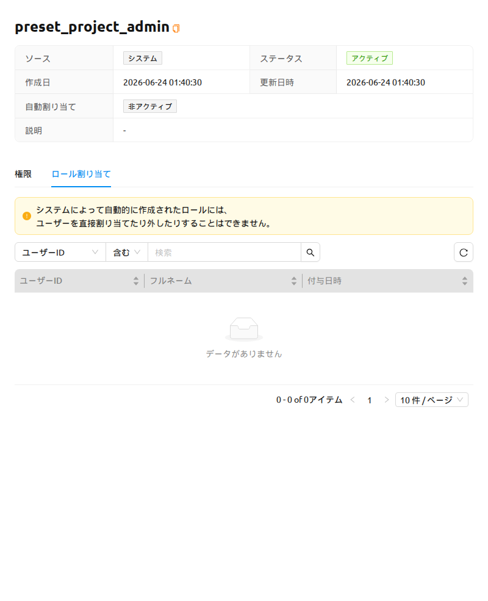

プロジェクトを管理するユーザーを指定するには、代わりにプロジェクトページの**プロジェクト管理者を設定**を使用してください。プロジェクト管理者機能の章の[プロジェクト管理者を設定](#set-project-admin)、および下記の[プロジェクト管理者権限の付与](#grant-project-admin)を参照してください。

### ロールからユーザーを解除

1人のユーザーを解除することも、複数のユーザーを一度に解除することもできます。

1人のユーザーを解除するには:

1. **ロール割り当て**タブで、ユーザー行にマウスを合わせ、ユーザーの横にある解除（ゴミ箱）アイコンをクリックします。
2. **ロールからユーザーを外す**確認モーダルが開きます。一覧に表示されたユーザーを確認し、**ロールからユーザーを外す**をクリックして確定するか、**キャンセル**で閉じます。

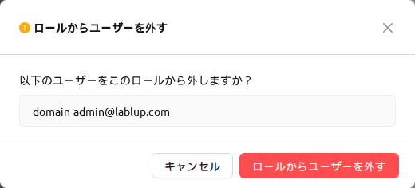

複数のユーザーを一度に解除するには:

1. **ロール割り当て**タブで、チェックボックスを使用して解除するユーザーを選択します。解除コントロールの横に、選択された行数を示す選択件数ラベルが表示されます。そのラベルの選択解除コントロールを使用して、すべての行の選択を解除できます。
2. 1つ以上の行が選択されると表示される一括**ロールからユーザーを外す**ボタン（ゴミ箱アイコン）をクリックします。
3. **ロールからユーザーを外す**確認モーダルで、一覧に表示されたユーザーを確認し、**ロールからユーザーを外す**をクリックして確定するか、**キャンセル**で閉じます。

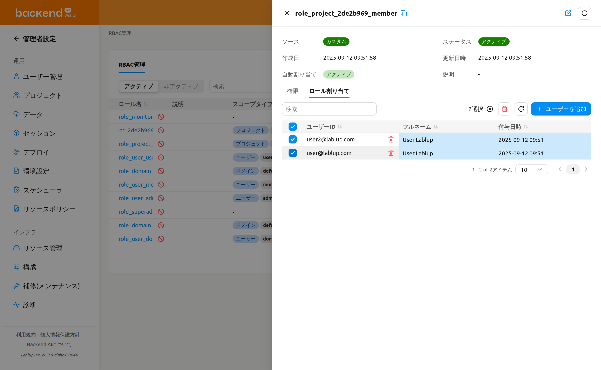

ユーザーを解除すると、そのユーザーのこのロールへの割り当てだけが取り除かれ、ロール自体や他の割り当ては保持されます。

:::note
ロール割り当ての解除は、**ロール割り当て**タブからユーザーを再度追加することで元に戻せます。
:::

## プロジェクト管理者権限の付与

プロジェクトを作成すると、`project-<project_id>-admin`という専用のロールも併せて作成されます。ここで`<project_id>`は対象プロジェクトのUUIDです。このロールに割り当てられたユーザーは、該当プロジェクトに対する[プロジェクト管理者](#project-admin-features)権限を得ます。これにより、システム全体のスーパー管理者権限を持たなくても、そのプロジェクトのユーザー、セッション、デプロイ、ストレージフォルダを管理できるようになります。

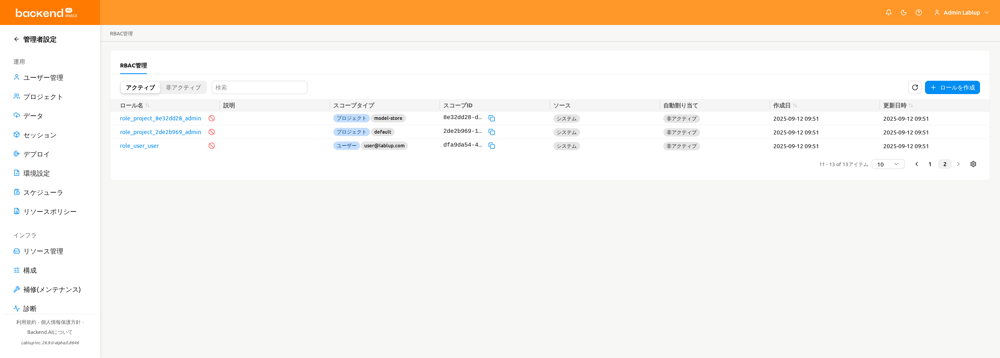

プロジェクト管理者権限は、プロジェクト管理者機能の章の[プロジェクト管理者を設定](#set-project-admin)で説明する**プロジェクト**管理者ページの**プロジェクト管理者を設定**ワンクリックフローを通じて付与・取り消しします。`project-<project_id>-admin`ロールはシステムロールであるため、ここのロール割り当てタブは**読み取り専用**であり、確認用に提供されます。ロールを開いて、現在プロジェクト管理者権限を持つユーザーを確認できます。**プロジェクト管理者を設定**モーダルは、RBACショートカットを通じてこのロールの詳細パネルにもリンクします。

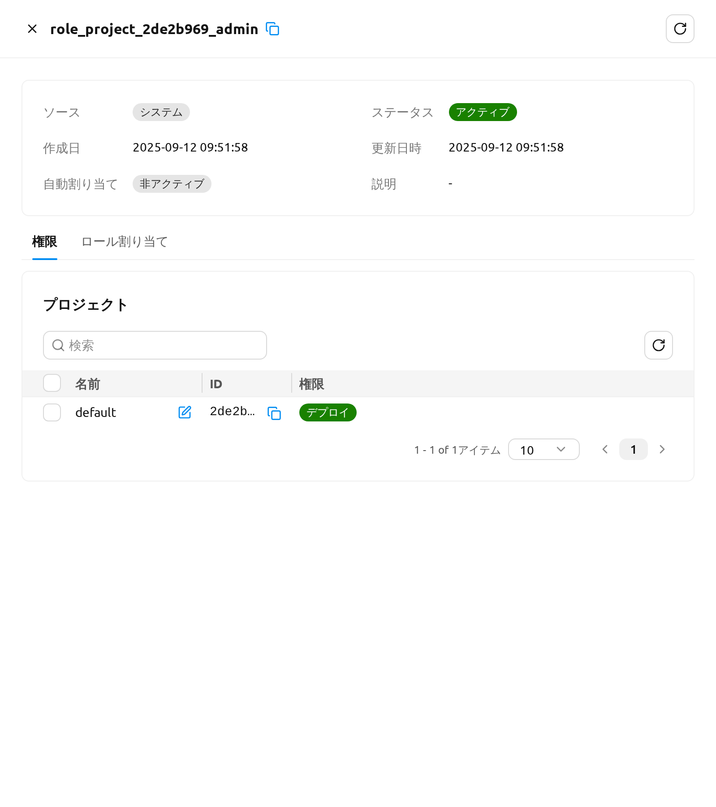

権限が付与されると、ユーザーには即座にプロジェクト管理者権限が適用されます。次にヘッダーのプロジェクトドロップダウンを開くと、対応するプロジェクトの横にプロジェクト管理者バッジが表示され、[プロジェクト管理者機能](#project-admin-features)章で説明されているプロジェクト管理者専用のサイドバー項目も表示されます。
