

# RBAC管理

RBAC（ロールベースアクセス制御）管理では、スーパー管理者がきめ細かい権限を持つロールを定義し、ユーザーに割り当てることができます。RBACを使用すると、Backend.AIシステム全体で特定のユーザーがさまざまなリソースに対して実行できる操作を制御できます。

RBAC管理ページにアクセスするには、サイドバーメニューの**管理者設定**セクションで**RBAC管理**をクリックします。

このページには**ロール**と**プリセット**の2つのタブがあります。

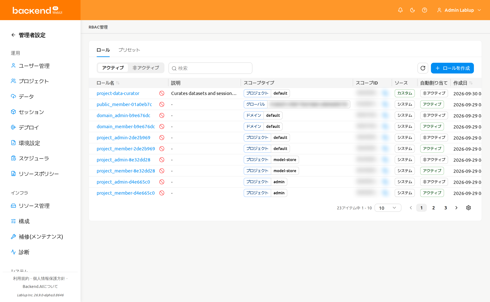

## ロール一覧

ロール一覧ページでは、すべてのロールがテーブル形式で表示されます。ページ上部のコントロールを使用して、ロールのフィルタリング、検索、ソートができます。

- **ステータスフィルター**: **アクティブ**と**非アクティブ**のロールを切り替えるセグメントコントロールです。デフォルトではアクティブが選択されています。
- **プロパティフィルター**: 一覧を絞り込むプロパティフィルターです。フィルター入力は選択したプロパティに合わせて切り替わります。以下のプロパティを使用できます:
   * **名前**: ロール名で検索する自由入力テキストです。
   * **ソース**: 利用可能な値（**システム** / **カスタム**）を自由入力のテキストボックスではなく選択式の入力として表示します。
   * **割り当てられたユーザー**: ユーザーピッカーで、選択したユーザーに割り当てられたロールのみを表示するように一覧を絞り込みます。生成された条件タグにはユーザーのメールアドレスが表示されます。
   * **スコープタイプ**: RBACのスコープタイプ（例: ドメイン、プロジェクト、ユーザー）を一覧表示する選択式の入力です。
   * **スコープID**: 正確なスコープUUIDで一覧を絞り込みます。
- **ロールを作成**: 新しいカスタムロールを作成するボタンです。

テーブルには以下の列が表示されます:

- **ロール名**: ロールの名前です。名前をクリックするとロール詳細パネルが開きます。
- **説明**: ロールの目的に関する簡単な説明です。
- **スコープタイプ**: ロールに設定されたスコープのタイプで、スコープ名と併せて表示されます。
- **スコープID**: ロールに設定されたスコープの生IDです。
- **ソース**: ロールが**システム**（事前定義）か**カスタム**（ユーザー作成）かを示します。
- **自動割り当て**: ロールが登録されているスコープにユーザーが追加された際に、そのロールが自動的に割り当てられるかどうかを示します。自動割り当てが有効な場合は**アクティブ**、無効な場合は**非アクティブ**と表示されます。
- **作成日時**: ロールが作成された日時です。
- **更新日時**: ロールが最後に変更された日時です。

### システムロールとカスタムロール

ロールは2つのソースタイプに分類されます:

- **システム**: 自動生成されるロールです。名前、説明、権限は編集できませんが、ユーザーの割り当ては管理できます。
- **カスタム**: スーパー管理者が作成したロールです。名前、説明、ユーザーの割り当て、権限をすべて編集できます。

## ロールの作成

ロールを作成する際には、まず**スコープ**を事前に定義する必要があります。スコープはロールを特定のリソースエンティティ（ドメイン、プロジェクト、ユーザーなど）にバインドし、後で追加するすべての権限がここで定義したスコープ内でのみ動作するように制限します。1つのロールに設定できるスコープは1つだけです。

新しいカスタムロールを作成するには:

1. ロール一覧ページの右上にある**ロールを作成**ボタンをクリックします
2. 作成モーダルで以下のフィールドを入力します:
   - **ロール名**（必須）: 一意のロール名を入力します
   - **説明**（任意）: ロールの目的に関する説明を入力します
   - **自動割り当て**（任意）: 有効にすると、ロールが登録されているスコープにユーザーが追加された際に、そのロールが自動的に付与されます。デフォルトは無効です。
   - **スコープタイプ**（必須）: ロールを適用するスコープタイプを選択します（例: ドメイン、プロジェクト、ユーザー）
   - **対象**（必須）: そのスコープタイプ内の特定の対象を選択します。ロールには1つのスコープだけが設定されます。
3. **OK**をクリックしてロールを作成します

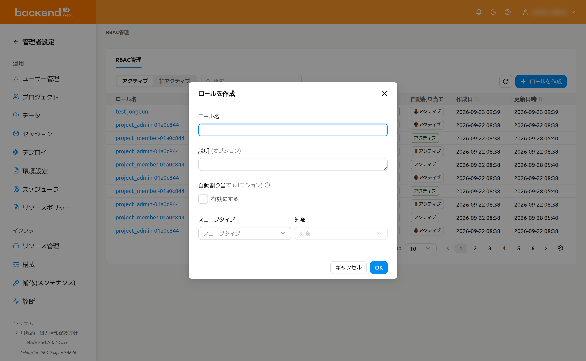

:::info
ロール作成時に設定する**スコープタイプ**と**対象**は、それ自体で権限を付与するものではありません。代わりに、後でこのロールに[権限](#manage-permissions)を追加する際に使用できる**スコープタイプ / 対象**をあらかじめ定義します。つまり、ロール作成の段階では、このロールの権限が取り得るスコープタイプと対象をあらかじめ限定するものであり、各権限はここで定義したスコープタイプと対象の範囲内でのみ設定できます。
:::

:::warning
スコープはロール作成時に定義され、作成後はロール詳細パネルから編集できません。ロールを作成する前にスコープを慎重に計画してください。
:::

## ロール詳細の表示

ロールの詳細情報を表示するには、テーブルでロール名をクリックします。ページの右側に詳細パネルが開きます。

パネルのヘッダーにはロール名が表示され、カスタムロールの場合は**編集**ボタンが提供されます。詳細セクションには以下のメタデータが表示されます:

- **ソース**: システムまたはカスタム
- **ステータス**: アクティブまたは非アクティブ
- **スコープタイプ / 対象**: ロールが属するスコープです。ロールは必ず1つのスコープに属します。
- **自動割り当て**: 自動割り当てがアクティブか非アクティブかを示します。アクティブの場合、登録されているスコープのいずれかに追加されたユーザーに対して、ロールが自動的に付与されます。
- **作成日時**: 作成タイムスタンプ
- **更新日時**: 最終変更タイムスタンプ

メタデータの下には**権限**と**ロール割り当て**の2つのタブがあります。デフォルトでは**権限**タブが選択されています。

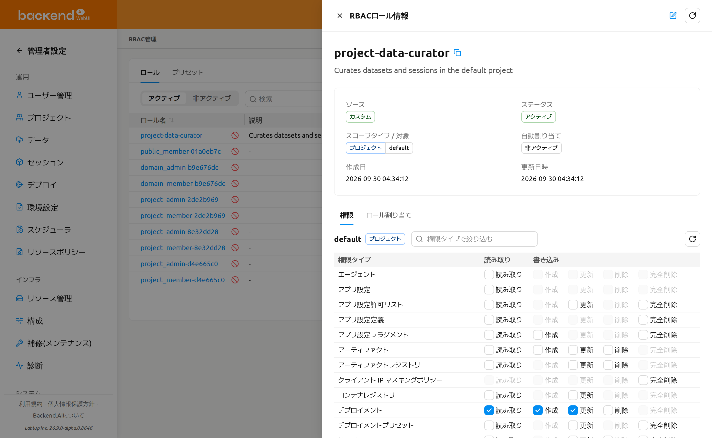

### ロールの編集

カスタムロールの名前、説明、または自動割り当て設定を編集するには:

1. テーブルでロール名をクリックして詳細パネルを開きます
2. パネルヘッダーの**編集**ボタン（鉛筆アイコン）をクリックします
3. 編集モーダルで以下のフィールドを変更します:
   - **ロール名**: ロールの名前
   - **説明**: ロールの目的に関する説明
   - **自動割り当て**: 有効にすると、ロールが登録されているスコープにユーザーが追加された際に、そのロールが自動的に付与されます。
4. **OK**をクリックして変更を保存します

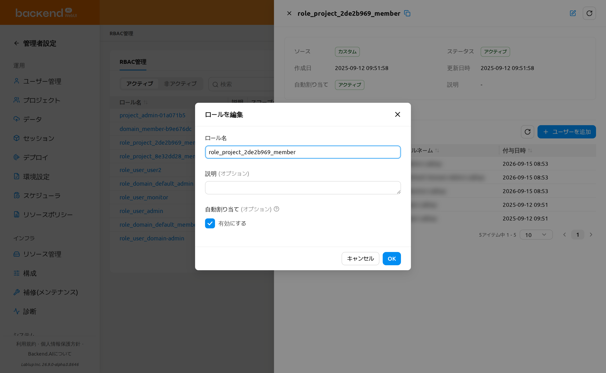

:::note
編集ボタンはカスタムロールでのみ利用可能です。システムロールの名前や説明は変更できません。また、どちらの場合もロール作成後にスコープを変更することはできません。
:::

## 権限の管理

ロール詳細パネルの**権限**タブには、ロールのスコープで使用できる権限タイプが1行ずつ表示されます。各行のチェックボックスは**読み取り**と**書き込み**にグループ化されており、**書き込み**には作成、更新、削除、完全削除が含まれます。

ロールの権限を変更するには、チェックボックスをオンまたはオフにして**保存**をクリックします。

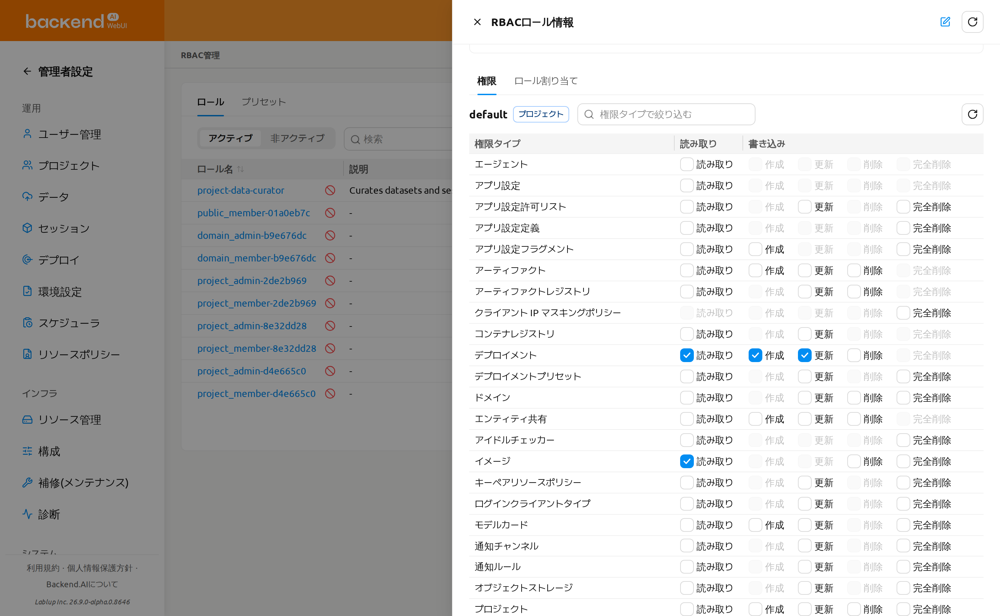

システムロールの権限はこのタブでは読み取り専用です。システムロールの権限はロールの作成元である[ロールプリセット](#role-presets)に従います。**プリセットを確認**をクリックするとプリセットを開けます。

:::info
各権限の**スコープタイプ / 対象**の組み合わせは、ロールのスコープから継承されます。ロール作成時に定義されたスコープに対してのみ権限を付与できます。ロールの適用範囲を広げるには、必要なスコープを持つ新しいロールをもう1つ作成する必要があります。
:::

### 権限設定の例

以下は一般的な権限設定の例です。**スコープタイプ / 対象**列は、権限が再利用するロールレベルのスコープを示しています。

| シナリオ | スコープタイプ / 対象 | 権限タイプ | 権限 |
|---------|---------------------|---------|------|
| 特定プロジェクトでストレージフォルダの作成を許可 | プロジェクト / my-project | フォルダ | 作成 |
| 特定のドメイン内のすべてのセッションの表示を許可 | ドメイン / default | セッション | 読み取り |
| 特定のドメイン内のデプロイメントの管理を許可 | ドメイン / default | デプロイメント | 作成、読み取り、更新 |
| 特定のドメイン内のコンテナイメージの削除を許可 | ドメイン / default | イメージ | 削除 |

## ロールプリセット

**プリセット**タブには、システムロールの作成元となるロールプリセットが一覧表示されます。

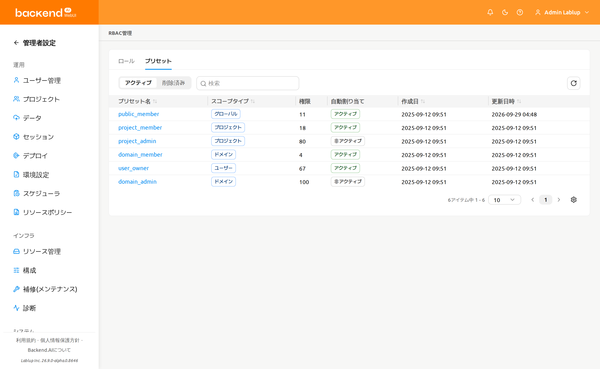

プリセットの権限を編集するには、プリセット名をクリックして詳細パネルを開き、**読み取り** / **書き込み**グリッドのチェックボックスをオンまたはオフにして**保存**をクリックします。

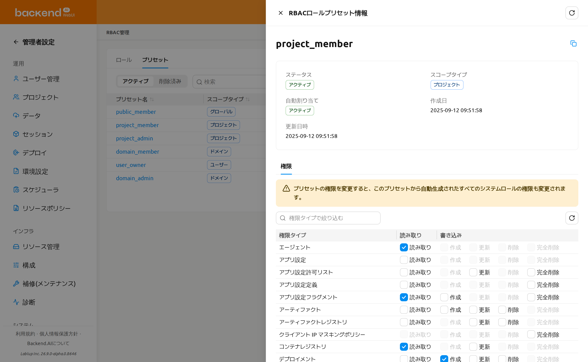

:::warning
プリセットの権限を変更すると、このプリセットから自動生成されたすべてのシステムロールの権限も変更されます。
:::

## ユーザー割り当ての管理

ロール詳細パネルの**ロール割り当て**タブでは、ロールに割り当てられているユーザーを確認できます。

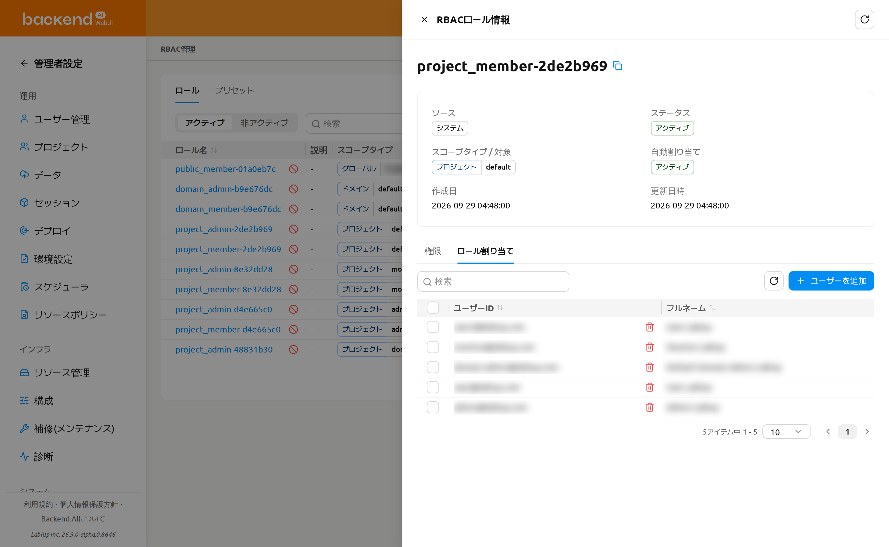

### ロールにユーザーを追加

1. ロール詳細パネルを開き、**ロール割り当て**タブを選択します
2. **ユーザーを追加**ボタンをクリックします
3. モーダルでメールアドレスまたは名前でユーザーを検索します
4. チェックボックスを使用して1人以上のユーザーを選択します
5. **割り当て**をクリックして選択したユーザーをロールに割り当てます

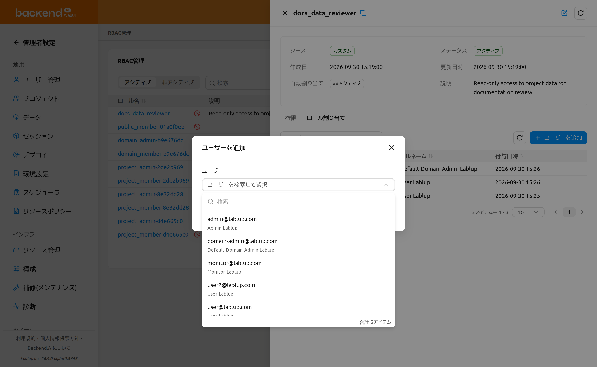

ユーザーの追加は一括操作です。一度に複数のユーザーを選択して、まとめて割り当てることができます。一部の割り当てが失敗した場合、モーダルは開いたままになり、一括エラーモーダルに失敗した各ユーザーとエラーメッセージ、成功・失敗の件数が一覧表示されます。正常に割り当てられたユーザーは選択から解除されるため、失敗したユーザーのみが選択された状態で残り、**追加**を再度クリックしてそれらだけを再試行できます。

<!--  -->
<!-- TODO: Capture the Add User modal with the bulk-error modal listing failed assignments -->

### システムロールと割り当ての制限

システムが生成したプロジェクト管理者ロール（**ソース**が**システム**のロール）は、ロール割り当てタブからユーザーを直接割り当てたり外したりすることはできません。このタブには**システムによって自動的に作成されたロールには、ユーザーを直接割り当てたり外したりすることはできません。**という警告アラートが表示され、割り当てテーブルは読み取り専用になります（**ユーザーを追加**と解除のコントロールは非表示になります）。

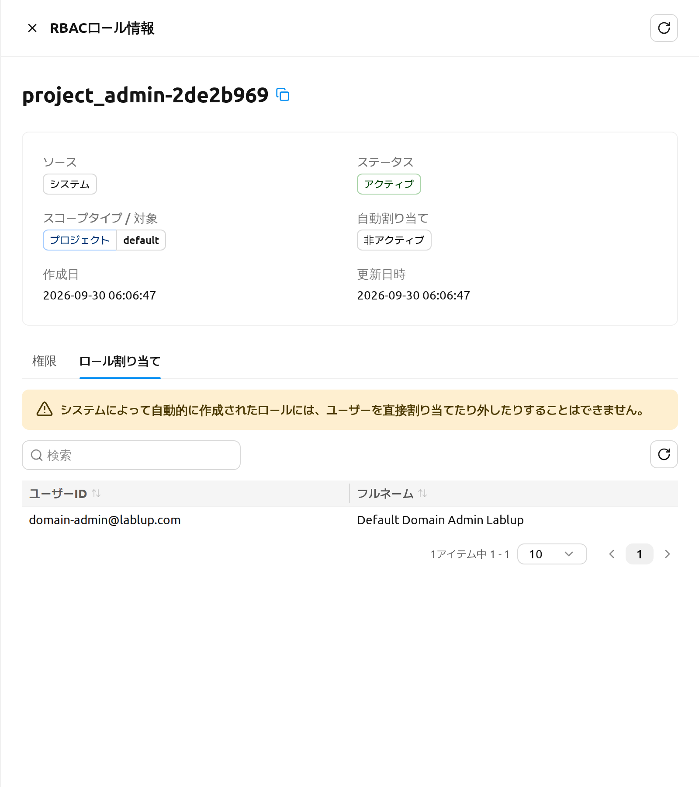

プロジェクトを管理するユーザーを指定するには、代わりにプロジェクトページの**プロジェクト管理者を設定**を使用してください。プロジェクト管理者機能の章の[プロジェクト管理者を設定](#set-project-admin)、および下記の[プロジェクト管理者権限の付与](#grant-project-admin)を参照してください。

### ロールからユーザーを解除

1人のユーザーを解除することも、複数のユーザーを一度に解除することもできます。

1人のユーザーを解除するには:

1. **ロール割り当て**タブで、ユーザー行にマウスを合わせ、ユーザーの横にある解除（ゴミ箱）アイコンをクリックします。
2. **ロールからユーザーを外す**確認モーダルが開きます。一覧に表示されたユーザーを確認し、**ロールからユーザーを外す**をクリックして確定するか、**キャンセル**で閉じます。

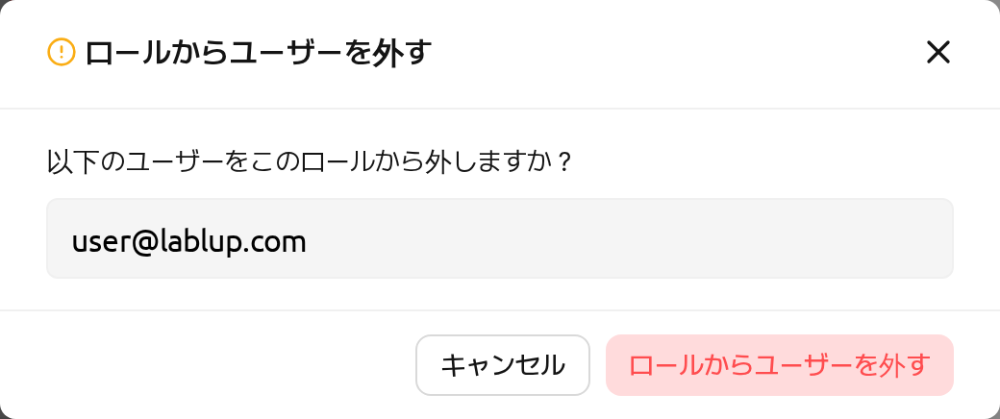

複数のユーザーを一度に解除するには:

1. **ロール割り当て**タブで、チェックボックスを使用して解除するユーザーを選択します。解除コントロールの横に、選択された行数を示す選択件数ラベルが表示されます。そのラベルの選択解除コントロールを使用して、すべての行の選択を解除できます。
2. 1つ以上の行が選択されると表示される一括**ロールからユーザーを外す**ボタン（ゴミ箱アイコン）をクリックします。
3. **ロールからユーザーを外す**確認モーダルで、一覧に表示されたユーザーを確認し、**ロールからユーザーを外す**をクリックして確定するか、**キャンセル**で閉じます。

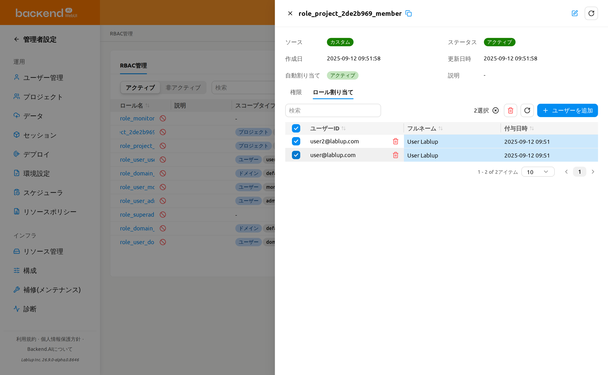

ユーザーを解除すると、そのユーザーのこのロールへの割り当てだけが取り除かれ、ロール自体や他の割り当ては保持されます。

:::note
ロール割り当ての解除は、**ロール割り当て**タブからユーザーを再度追加することで元に戻せます。
:::

## プロジェクト管理者権限の付与

プロジェクトを作成すると、そのプロジェクト専用のプロジェクト管理者ロールも併せて作成されます。このロールに割り当てられたユーザーは、該当プロジェクトに対する[プロジェクト管理者](#project-admin-features)権限を得ます。これにより、システム全体のスーパー管理者権限を持たなくても、そのプロジェクトのユーザー、セッション、デプロイ、ストレージフォルダを管理できるようになります。

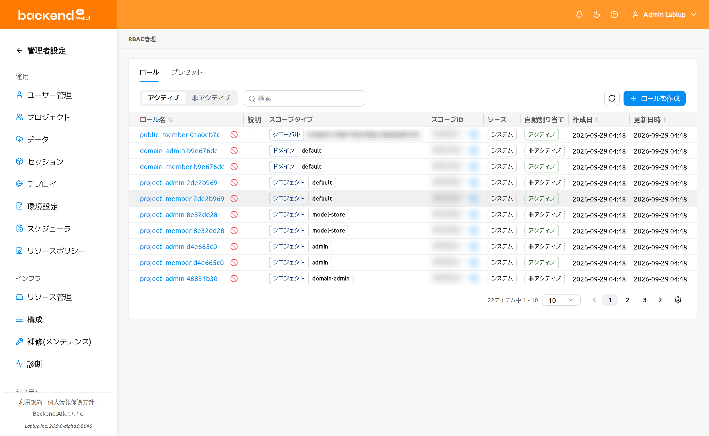

プロジェクト管理者権限は、プロジェクト管理者機能の章の[プロジェクト管理者を設定](#set-project-admin)で説明する**プロジェクト**管理者ページの**プロジェクト管理者を設定**ワンクリックフローを通じて付与・取り消しします。プロジェクト管理者ロールはシステムロールであるため、ここのロール割り当てタブは**読み取り専用**であり、確認用に提供されます。ロールを開いて、現在プロジェクト管理者権限を持つユーザーを確認できます。**プロジェクト管理者を設定**モーダルは、RBACショートカットを通じてこのロールの詳細パネルにもリンクします。

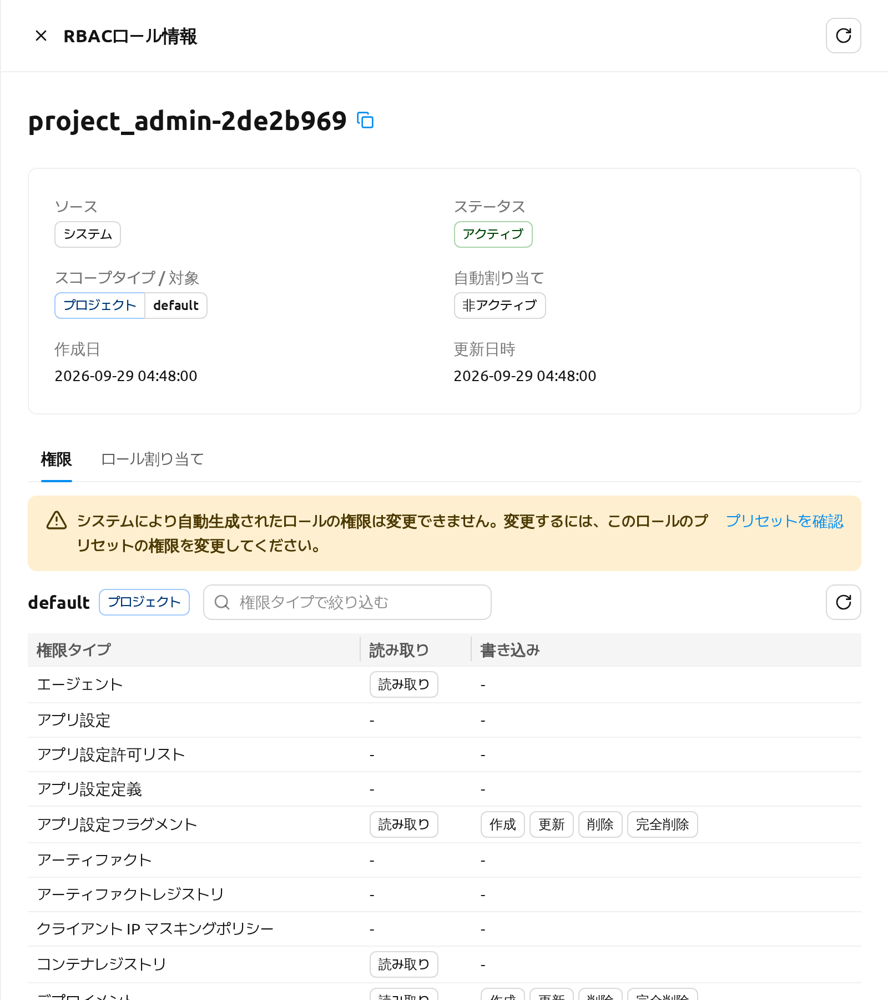

権限が付与されると、ユーザーには即座にプロジェクト管理者権限が適用されます。次にヘッダーのプロジェクトドロップダウンを開くと、対応するプロジェクトの横にプロジェクト管理者バッジが表示され、[プロジェクト管理者機能](#project-admin-features)章で説明されているプロジェクト管理者専用のサイドバー項目も表示されます。
