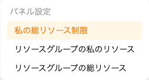
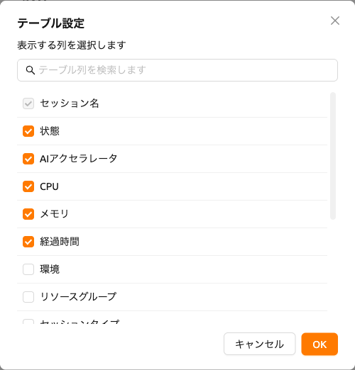

# セッションページ

Backend.AIにおける`セッション`は、ユーザーが割り当てられたリソースを使用してコードを実行したり、モデルをトレーニングしたり、データ分析を行ったりできる、隔離されたコンピュート環境を意味します。
各セッションは、ランタイムイメージ、リソースサイズ、環境設定など、ユーザーが定義した構成に基づいて作成されます。
セッションが開始されると、インタラクティブアプリケーション、ターミナル、ログにアクセスでき、ワークロードを効率的に管理・監視できます。

## リソースサマリーパネル

「セッション」ページの上部には、CPU、RAM、AIアクセラレータなど、利用可能なコンピューティングリソースを表示するパネルがあります。
必要な情報に応じて、「My Total Resources Limit」、「My Resources in Resource Group」、「Total Resources in Resource Group」など、さまざまなパネルビューを選択できます。表示するパネルを変更するには、「設定」ボタンを使用してください。

リソースパネルとその指標に関する詳細については、[ダッシュボード](#dashboard)ページを参照してください。

## セッション一覧

「セッション」セクションには、すべてのアクティブおよび完了したコンピュートセッションの一覧が表示されます。
`全体`、`インタラクティブ`、`バッチ`、`INFERENCE`、または`アップロードセッション`のタイプ別にセッションをフィルタリングでき、
`実行中`タブと`終了セッション`タブを切り替えてセッションを管理できます。

デフォルトでは、セッション名、ステータス、割り当てられたリソース（AIアクセラレータ、CPU、メモリ）、経過時間を確認できます。スーパー管理者の場合は、エージェントおよびオーナーのメールアドレスも表示されます。
テーブル右下の「設定」ボタンをクリックすると、追加のカラムを表示したり、特定のカラムを非表示にしたりして、ビューをカスタマイズできます。

:::tip
Backend.AI Manager v26.2.0以降では、セッション詳細パネルから各セッションの詳細なスケジューリング履歴を確認できます。これにより、スケジューリングの決定、遅延、失敗の原因を把握できます。詳細については、[セッションスケジューリング履歴](#session-scheduling-history)を参照してください。
:::

:::note
セッションランチャーの**ローンチ**ボタンは、既定で 1 つのセッションを作成します。
同一の設定で複数のセッションを一度に起動するには、**ローンチ**ボタンの隣にある
その他(`...`)アイコンをクリックしてドロップダウンメニューを開き、**複数セッションを起動**
を選択します。詳細は[確認と起動](#confirm-and-launch)セクションを参照してください。
:::
