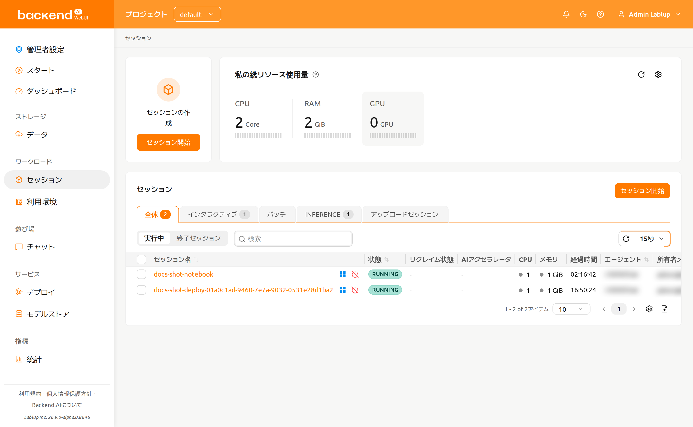
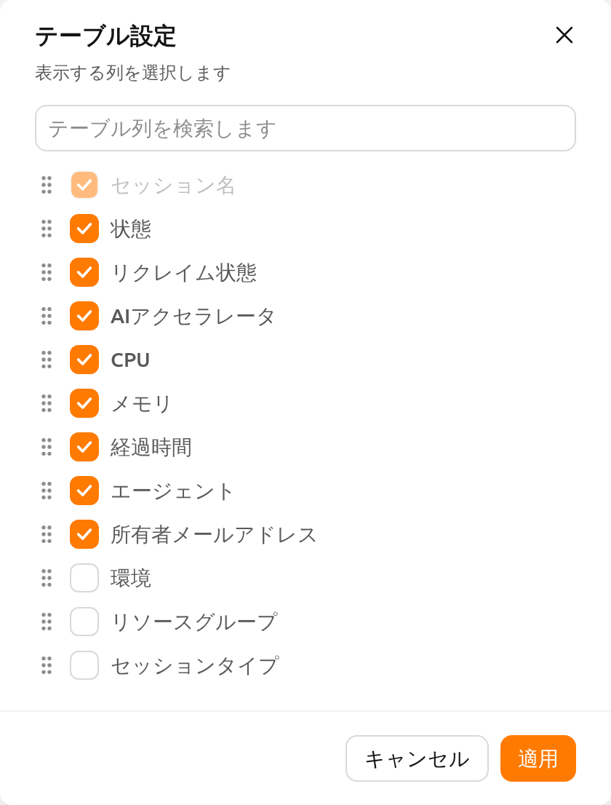
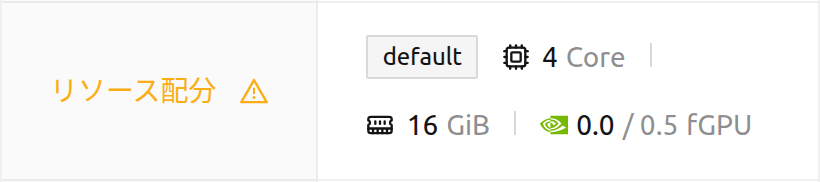

# セッションページ

Backend.AIにおける`セッション`は、ユーザーが割り当てられたリソースを使用してコードを実行したり、モデルをトレーニングしたり、データ分析を行ったりできる、隔離されたコンピュート環境を意味します。
各セッションは、ランタイムイメージ、リソースサイズ、環境設定など、ユーザーが定義した構成に基づいて作成されます。
セッションが開始されると、インタラクティブアプリケーション、ターミナル、ログにアクセスでき、ワークロードを効率的に管理・監視できます。

## リソースサマリーパネル

「セッション」ページの上部には、CPU、RAM、AIアクセラレータなどのコンピューティングリソースを表示するパネルがあります。
必要な情報に応じて、**私の総リソース使用量**、**リソースグループの私のリソース**、**リソースグループの総リソース**など、さまざまなパネルビューを選択できます。表示するパネルを変更するには、パネルヘッダーの設定（歯車）アイコンをクリックし、**パネル設定**からビューを選択してください。

**私の総リソース使用量**パネルには、すべてのプロジェクトで現在使用しているリソースが表示されます。
各リソースに適用される制限を確認するには、数値の下のステータスバーにマウスを合わせてください。複数の制限（ドメイン、プロジェクト、キーペアなど）が適用されている場合は、最も厳しい制限が適用されます。

リソースパネルとその指標に関する詳細については、[ダッシュボード](#dashboard)ページを参照してください。

## セッション一覧

個人の「セッション」ページには、自分自身のアクティブおよび完了したコンピュートセッションのみが表示されます。
`全体`、`インタラクティブ`、`バッチ`、`INFERENCE`、または`アップロードセッション`のタイプ別にセッションをフィルタリングでき、
`実行中`タブと`終了セッション`タブを切り替えてセッションを管理できます。

:::note
個人の「セッション」ページは現在作業中のプロジェクトのスコープで動作し、アドレスは
`/project/<プロジェクト名>/session` の形式になります。このページは、ロールに関わらず常に自分自身のセッションのみを表示します。
プロジェクト内のすべてのユーザーのセッションを表示・管理するには、サイドバーの**管理者設定**にある
**セッション**ページを使用してください。
:::

デフォルトでは、セッション名、ステータス、割り当てられたリソース（AIアクセラレータ、CPU、メモリ）、経過時間を確認できます。
テーブル右下の「設定」ボタンをクリックすると、追加のカラムを表示したり、特定のカラムを非表示にしたりして、ビューをカスタマイズできます。
また、カラム設定ダイアログ内でカラムをドラッグして、テーブルに表示される順序を変更することもできます。

:::tip
セッション詳細パネルから各セッションの詳細なスケジューリング履歴を確認できます。これにより、スケジューリングの決定、遅延、失敗の原因を把握できます。詳細については、[セッションスケジューリング履歴](#session-scheduling-history)を参照してください。
:::

:::note
セッションランチャーの**ローンチ**ボタンは、既定で 1 つのセッションを作成します。
同一の設定で複数のセッションを一度に起動するには、**ローンチ**ボタンの隣にある
その他(`...`)アイコンをクリックしてドロップダウンメニューを開き、**複数セッションを起動**
を選択します。詳細は[確認と起動](#confirm-and-launch)セクションを参照してください。
:::

:::note
セッション一覧ツールバーのダウンロードボタンを使用して、セッション一覧をCSVファイルとしてエクスポートできます。
個人の「セッション」ページからのCSVエクスポートには、自分自身のセッションのみが含まれます。
:::

## 割り当てリソースと要求リソース

セッション名をクリックすると、セッション詳細パネルが開きます。パネルの**リソース配分**の項目には、要求したリソースではなく、
セッションが実際に確保しているリソースが表示されるため、セッションがどのリソースで実行されているかを確認できます。

- 割り当て量と要求量が一致する場合、各リソースは1つの値で表示されます。
- 両者が異なる場合は、割り当て量の後ろに要求量が淡い色で表示され、単位は1つにまとめられます（例: `1 / 2 Core`）。数値にマウスを合わせると、**割り当て / 要求**のツールチップが表示されます。
- 要求より少なく割り当てられたリソースがある場合、**リソース配分**のラベルの横に警告アイコンが表示されます。アイコンにマウスを合わせると、*要求よりも少ないリソースが割り当てられました。* というメッセージが表示されます。
- まだリソースが割り当てられていない状態（例: `PENDING`）では、要求したリソースがそのまま表示され、比較値は表示されません。

この差は、要求量をそのまま割り当てられない場合、たとえばフラクショナルGPU（fGPU）の要求量が割り当て可能な最小単位に切り捨てられる場合に発生します。セッションは実際に割り当てられた量で実行されます。

パネルのその他の項目については、[セッション詳細パネル](#session-detail-panel)を参照してください。
