# Compute セッション

The most visited pages in the Backend.AI WebUI would be the 'セッション' and 'Data' pages.
This document will cover how to query and create container-based compute sessions and utilize various web applications on the 'セッション' page.

## Start a new session

After logging in with a ユーザー account, click 'セッション' on the left sidebar.
'セッション' page lets you start new sessions or use and manage existing running sessions.

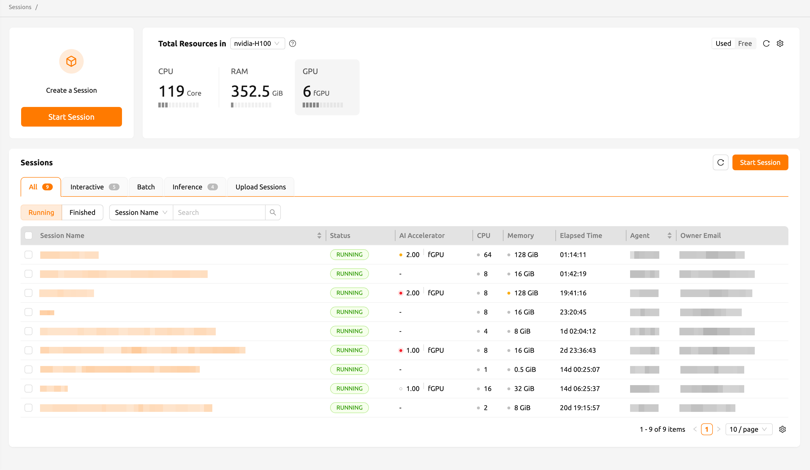

Click the 'START' button to start a new compute session.

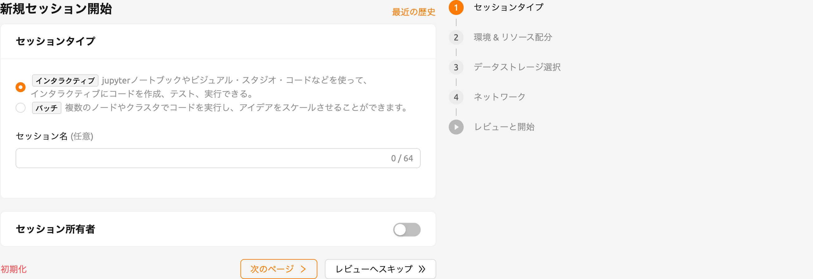

### Session Type

In the first page, ユーザーs can select the type of session, 'interactive' or 'batch'.
If needed, setting the name of the session (optional) is also available.

- Session type: Determines the type of the session. There are two different types of session, \"インタラクティブ\" and \"バッチ\".
  The following are the primary distinctions between the two types:

  - インタラクティブ compute session

    - This is the type which has been supported from the initial version of the Backend.AI.
    - The compute session is used in a way that the ユーザー interacts with after
      creating a session without specifying a pre-defined execution script or
      command.
    - The session is not terminated automatically unless ユーザー explicitly destroys
      the session or session garbage collectors are set by the 管理者.

  - バッチ compute session

    - This type of session is supported via GUI from Backend.AI 22.03 (CLI has
      supported the batch-type session before the 22.03).
    - Pre-define the script that will be executed when a compute session is
      ready.
    - This session will execute the script as soon as the compute session is ready, and then
      automatically terminates the session as soon as the execution finishes.
      It will utilize the server farm's resources efficiently and flexibly if a ユーザー can write the execution script in advance or is
      building a pipeline of workloads.
    - Users can set the start time of a batch-type compute session.
      However, keep in mind that this feature does not guarantee that the session will start at the registered time.
      It may still stay at 'PENDING' due to the lack of resources, etc. Rather, it guarantees that
      the session WILL NOT run until the start time.
    - Users can also set the 'Timeout Duration' of a batch-type compute session.
      When ユーザーs set the timeout duration, The session will automatically terminate if the specified time is exceeded.

    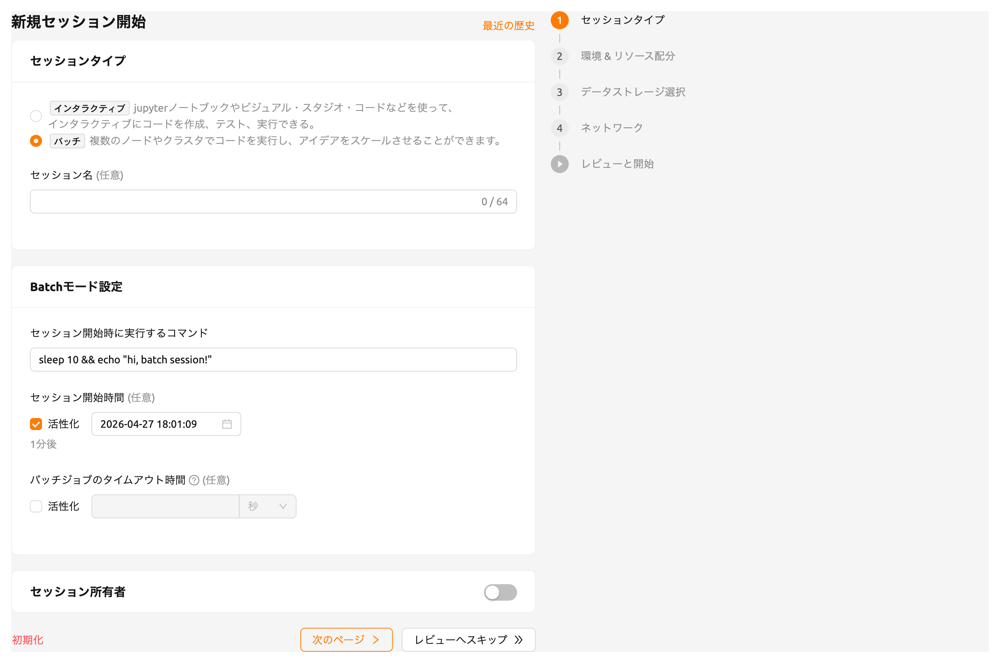

- Session name: Users can specify the name of the compute session to be
  created. If set, this name appears in Session Info, so it is
  distinguishable among multiple compute sessions. If not specified, random
  word will be assigned automatically. Session names only accept alphanumeric
  characters between 4 and 64 without spaces.

If ユーザーs create a session with the `super admin` or `admin` account,
they can additionally assign a session owner. If you enable the toggle,
a ユーザー email field will appear.

   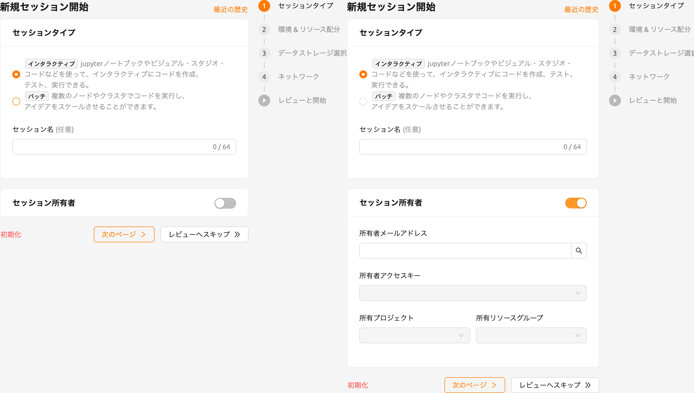

Enter the email of the ユーザー you want to assign the session to,
click the 'search' button, and the ユーザー's access key will be automatically registered.
You can also select a project and resource group.

   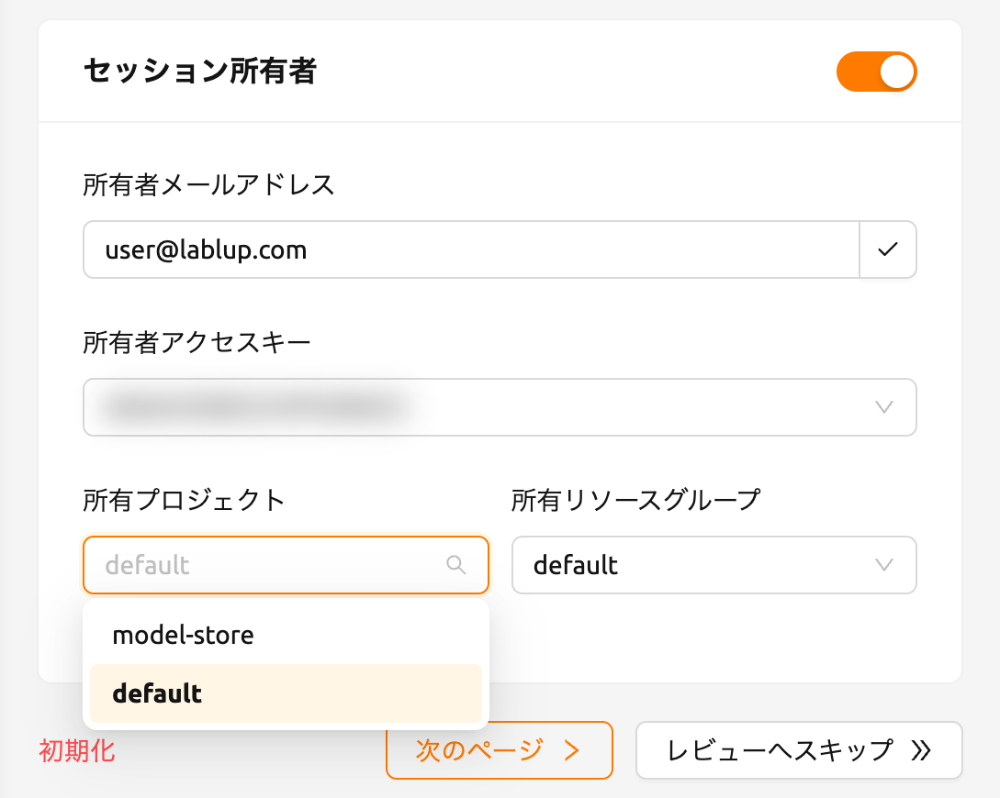

### Environments & Resource allocation

Click the 'Next' button below, or the 'Environments & Resource allocation' menu on the right
to proceed to the next page. If you want to create a session without any further
settings, press the 'Skip to review' button. In this case, settings on the
other pages will all use the default values.

  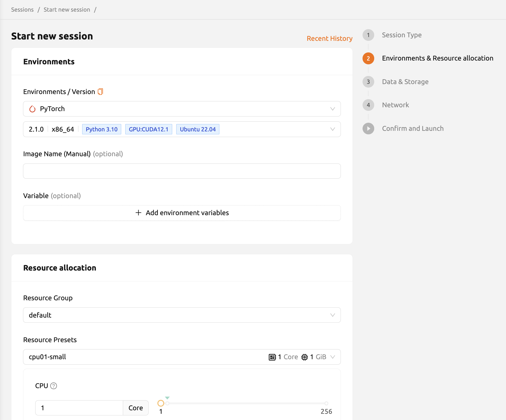

### Environments

For detailed explanations of each item that can be set on the second page, please
refer to the following:

- Environments: Users can select the base environment for compute sessions such as
  TensorFlow, PyTorch, C++, etc. The compute session will automatically included into the base environment library.
  If ユーザーs choose another environment, the corresponding packages will be installed by default.
- Version: Users can specify the version of the environment.
  There are multiple versions in a single environment. For example, TensorFlow has multiple versions such as 1.15, 2.3, etc.,
- Image Name: Users can specify the name of the image to be used for the
  compute session. This configuration may not be available depending on the environment settings.
- Set Environment Variable: To give more convenient workspace for ユーザーs, Backend.AI supports environment variable setting
  in session launching. In this feature, ユーザーs can add any envs such as `PATH` by filling out
  variable name and value in environment configuration dialog.

  

### Resource allocation

- Resource Group: Specifies the resource group in which to create a compute
  session. A resource group is a unit that groups host servers that each ユーザー
  can access. Usually, servers in a resource group would have the same type of
  GPU resources. Administrators can classify servers by any criteria, group them
  into one or more resource groups, configure which resource groups a ユーザー
  can use. Users can launch a compute session only on servers in resource groups
  allowed by the 管理者istrator. If multiple resource groups are allowed, ユーザーs could select any group they want.
  However, it cannot be changed when system only allows single-setting.
- Resource Presets: These templates have pre-defined resource sets, such as
  CPU, memory, and GPU, to be allocated to a compute session. Administrators can
  define frequently used resource settings in advance. By adjusting the numerical
  input or sliding the slider, ユーザーs can allocate the desired amount of resources.

  

  The meaning of each item is as follows.
  Clicking the 'Help (?)' button will also give more information.

  * CPU: The CPU performs basic arithmetic, logic, controlling, and input/output
    (I/O) operations specified by the instructions. In general, more CPUs are beneficial for high-performance computing workloads.
    But, to reflect the advantage of more CPUs, program code must be written to adapt multiple CPUs.
  * Memory: Computer memory is a temporary storage area. It holds the data and
    instructions that the Central Processing Unit (CPU) needs. When using a GPU in
    a machine learning workload, at least twice the memory of the
    GPU to memory need to be allocated. Otherwise, GPU's idle time will increase, resulting
    penalty in a performance.
  * Shared Memory: The amount of shared memory in GB to allocate for the compute
    session. Shared memory will use some part of the memory set in RAM. Therefore,
    it cannot be greater than the amount specified in RAM.
  * AI Accelerator: AI accelerators (GPUs or NPUs) are well-suited for the
    matrix/vector computations involved in machine learning. AI accelerators speed
    up training / inference algorithms by orders of magnitude, reducing running
    times from weeks to days.
  * セッション: Session is a unit of computational environment that is created
    according to a specified environment and resources. If this value is set to a
    value greater than 1, multiple sessions corresponding to the resource set above
    are created. If there are not enough resources available, requests to create
    sessions that cannot be created are put on the waiting queue.

  

  * Select Agent: Select the agent to be assigned. By default, the agent is automatically selected
    by the scheduler. The agent selector displays the actual amount of available resources for each agent.
    Currently, this feature is only supported in single-node, single-container environments.
  * Cluster mode: Cluster mode allows ユーザーs to create
    multiple compute sessions at once. For more information, refer to the
    [Overview of Backend.AI cluster compute session<backendai-cluster-compute-session>](#Overview of Backend.AI cluster compute session<backendai-cluster-compute-session>).

  .. note::
     The Agent Select feature may not be available depending on the server environment.

- High-Performance Computing Optimizations: Backend.AI provides configuring values
  related to HPC Optimizations.

  Backend.AI provides configuration UI for internal control variable in `nthreads-var`.
  Backend.AI sets this value equal to the number of session's CPU cores by default,
  which has the effect of accelerating typical high-performance computing workloads.
  Nevertheless, for some multi-thread workloads, multiple processes using OpenMP are used at same time,
  resulting in an abnormally large number of threads and significant performance degradation.
  To resolve this issue, setting the number of threads to 1 or 2 would work.

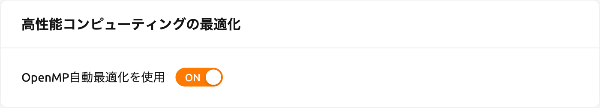

### データとストレージ

Click the 'Next' button below, or the 'データとストレージ' menu on the right to proceed to the next page.

When a compute session is destroyed, data deletion is set to default.
However, data stored in the mounted folders will survive.
Data in those folders can also be reused by mounting it when creating another compute session.
For further information on how to mount a folder and run a compute session, refer to
[Mounting Folders to a Compute Session<session-mounts>](#Mounting Folders to a Compute Session<session-mounts>).

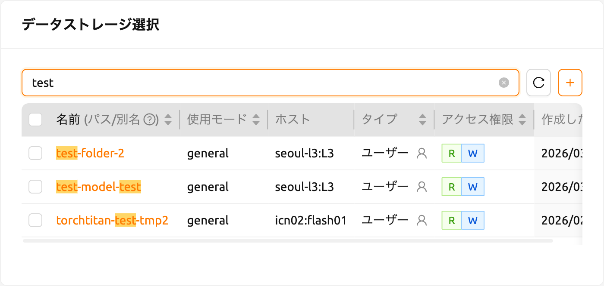

ユーザーs can specify the data folders to mount in the compute session.
Folder explorer can be used by clicking folder name. For further information,
please refer [Explore Folder<explore_folder>](#Explore Folder<explore_folder>) section.

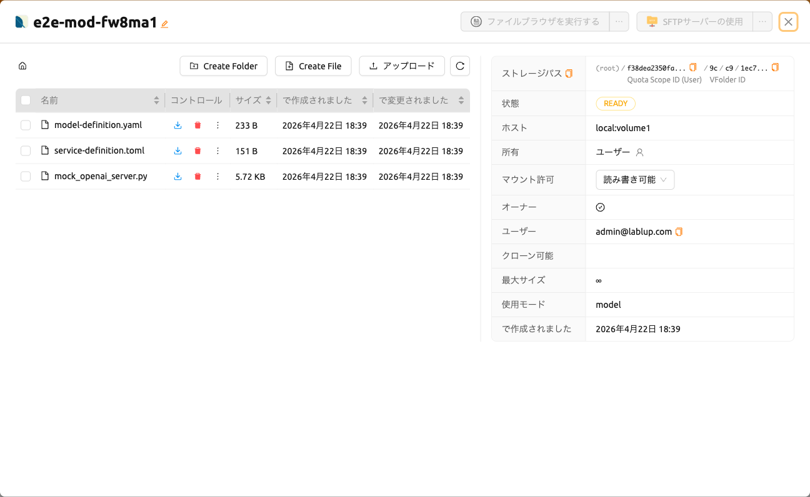

New folder can be created by clicking the '+' button next to the search box.
When new folder is created, it will automatically be selected as the folder to mount.
For further information, please refer [Create Storage Folder<create_storage_folder>](#Create Storage Folder<create_storage_folder>) section.

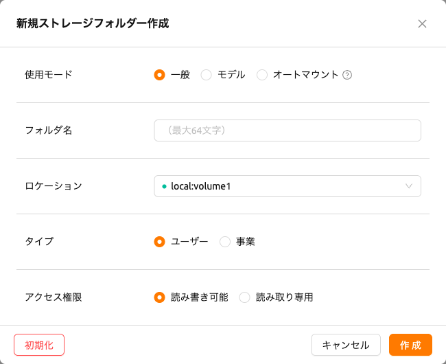

### Network

Click the 'Next' button below, or the 'Network' menu on the right to proceed to the next page.
On this page, Network configuration can be done such as Preopen Ports.

- Set Preopen Ports: Provides an interface for ユーザーs to set preopen ports in a
  compute session. Refer to the [How to add preopen ports before session creation
  <set_preopen_ports>](#How to add preopen ports before session creation
  <set_preopen_ports>) for further information.

### Confirm and Launch

If you are done with the network setting, click the 'Next' button below, or
'Confirm and Launch' button on the right to proceed to the last page.

On the last page, ユーザーs could view information of session(s) to create,
such as environment itself, allocated resources, mount information,
environment variables set on the previous pages, preopen ports, etc.,
Review the settings, ユーザーs could launch the session by clicking 'Launch' button.
Click the 'Edit' button located at the top right of each card to redirect to relevant page.

If there is an issue with the settings, an error message will be displayed as follows.
Users can edit their settings when this happens.

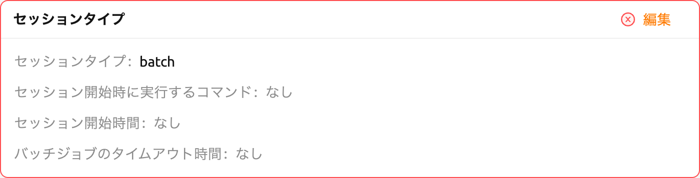

When you click the 'Launch' button, a warning dialog appears stating that there are no mounted folders.
If folder mounting is not required, you can ignore the warning and click the 'Start' button in the dialog to proceed.

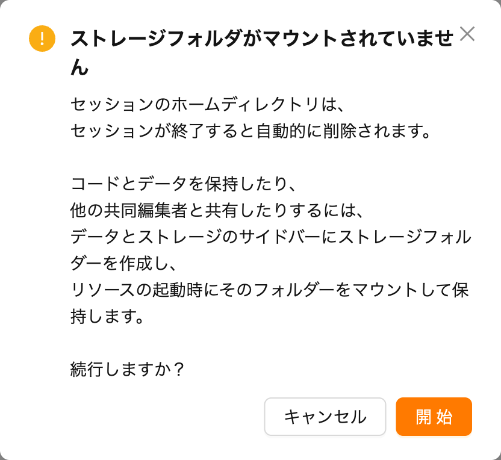

When a new compute session is added in the **Running** tab, a notification appears at the bottom-right corner of the screen.
The bottom-left area of the notification displays the session status, while the bottom-right area includes buttons for opening the app dialog,
launching the terminal, viewing container logs, and terminating the session.
You can also view this session creation notification by clicking **Notifications** in the header.

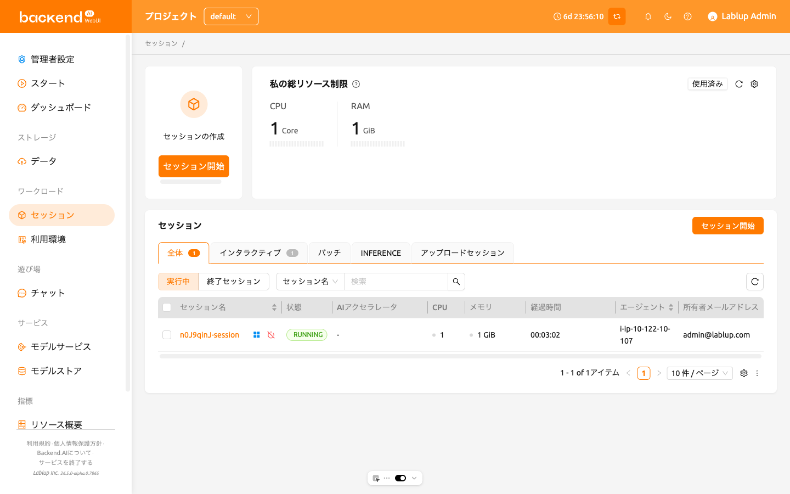

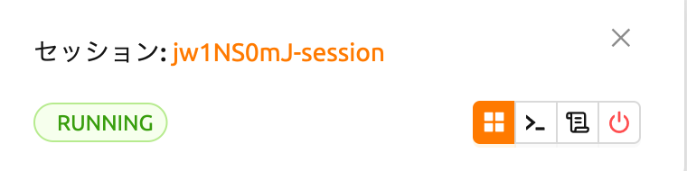

By clicking the app dialog button on the far left, you can view the available app services.

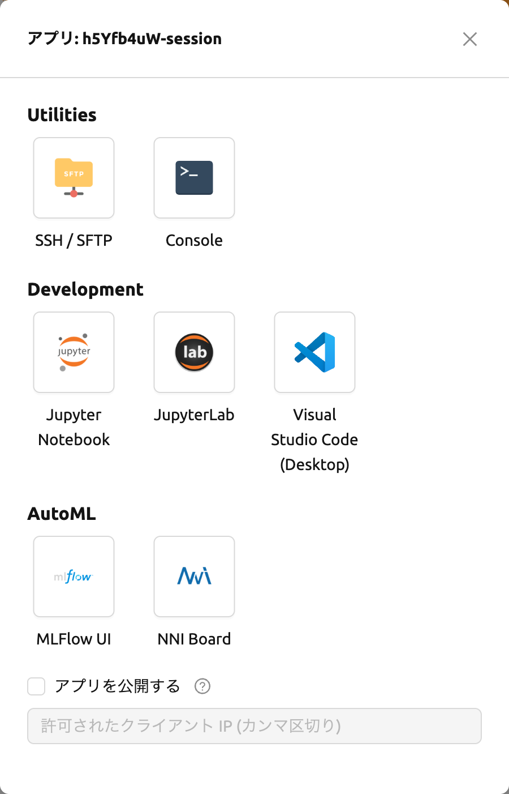

### Recent History

'Session Launcher' page provides a set of options for creating sessions. As of 24.09,
`Recent History` feature has been added to remember information about previously created sessions.

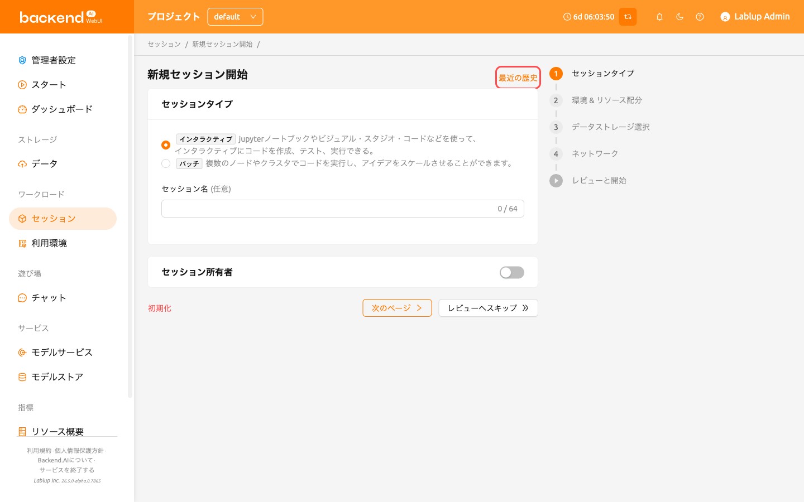

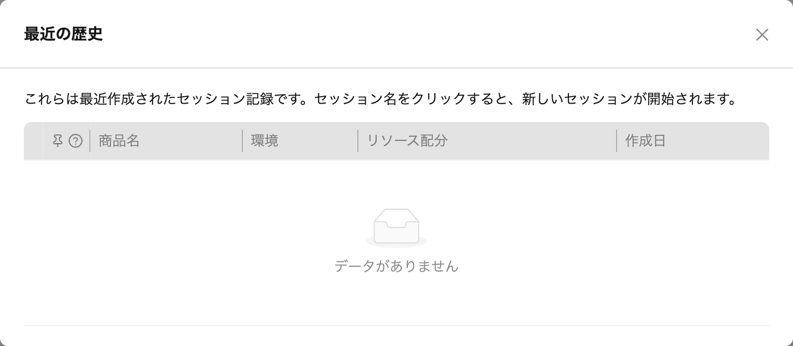

The `Recent History` modal stores information about the five most recently created sessions.
Clicking a session name takes you to the 'Confirm and Launch' page, which is the final step of session creation.
Each item can be renamed or pinned for easier access.

   Super管理者s can query all compute session information currently running (or
   terminated) in the cluster, and ユーザーs can only view the sessions they have
   created.

   Compute session list may not be displayed normally due to intermittent
   network connection problems, and etc. This can be solved by refreshing the
   browser.

## Session Detail Panel

For detailed information on the session, click the session name in the session list.
The session details panel shows the information of the session, such as the
session ID, ユーザー ID, status, type, environments, mount information, resource allocation, reserved time,
elapsed time, agent, cluster mode, resource usage including network I/O, and kernel information.

Click the 'Log' button next to the 'Hostname' in 'Kernels' to view the logs of that kernel directly.

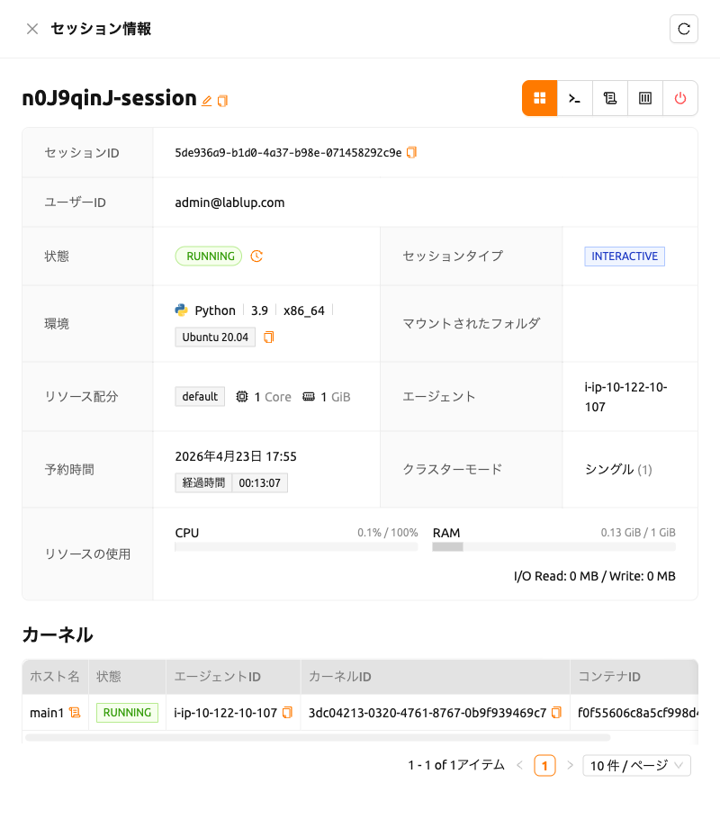

Backend.AI provides additional information for sessions in `PENDING`, `TERMINATED`, or `CANCELLED` states.
Click the 'Info' button to check the details when available.

## Use Jupyter Notebook

Let’s look at how to use and manage an already running compute session.
Click the first icon in the upper-right corner of the session detail panel to open the app launcher, which shows
the app services available for that session.

   There are two check options under the app icons. Opening the app with each item checked
   applies the following features, respectively:

   * Open app to public: Open the app to the public. Basically, web services
     such as Terminal and Jupyter Notebook services are not accessible by
     other ユーザーs, even if the ユーザー knows the service URL, since they are
     considered unauthenticated. However, checking this option makes it possible
     for anyone who knows the service URL (and port number) to access and use it. Of
     course, the ユーザー must have a network path to access the service.
   * Try preferred port: Without this option checked, a port number for the web service is randomly
     assigned from the port pool prepared in advance by Backend.AI.
     If you check this item and enter a specific port number, the entered
     port number will be tried first. However, there is no guarantee that the desired
     port will always be assigned because the port may not exist at all in the port
     pool or another service may already be using the port. In this case, the
     port number is randomly assigned.

   Depending on the system configuration, these options may not be shown.

Let's click on Jupyter Notebook.

Pop up windows will show that Jupyter Notebook is running. This
notebook was created inside a running compute session and can be used easily
with the click of a button. Also, there is no need for a separate package installation process because the language environment and
library provided by the computation session can be used as it is. For detailed
instructions on how to use Jupyter Notebook, please refer to the official Jupyter Notebook
documentation.

`id_container file` in the notebook's file explorer, contains a private
SSH key. If necessary, ユーザーs can download it and use it for SSH / SFTP access to
the container.

Click the 'NEW' button at the top right and select the Notebook for Backend.AI,
then the ipynb window appears where ユーザーs can enter their own code.

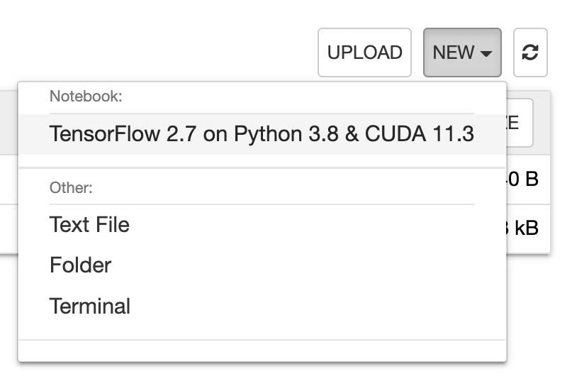

In this window, ユーザーs can enter and execute any code that they want by using the
environment that session provides. The code is executed on one of the
Backend.AI nodes where the compute session is actually created and there is no
need to configure a separate environment on the local machine.

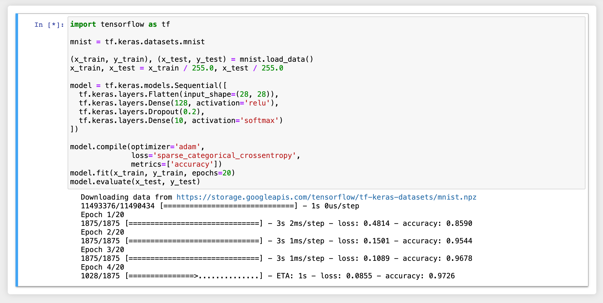

When window is closed, `Untitled.ipynb` file can be founded in the notebook file explorer.
Note that the files created here are deleted when session is terminated. The way to preserve those files even
after the session is terminated is described in the データとストレージ フォルダー section.

## Use web terminal

This section will explain how to use the web terminal. Click the
terminal icon(second button) to use the container's ttyd app. A terminal will appear in a new window
and ユーザーs can run shell commands to access the computational session as shown in the following figure.
If familiar with the commands, ユーザーs can easily run various Linux commands. `Untitled.ipynb` file
can be found in Jupyter Notebook, which is listed with the `ls` command. This shows that both apps
are running in the same container environment.

Files created here can also be immediately seen in the Jupyter Notebook as well. Conversely, changes made to files in Jupyter
Notebook can also be checked right from the terminal. This is because they are using the same files in the same compute session.

In addition to this, ユーザーs can use web-based services such as TensorBoard, Jupyter
Lab, etc., depending on the type of environments provided by the compute session.

## Query compute session log

Users can view the log of the compute session by clicking the last icon in the
Control panel of the running compute session.

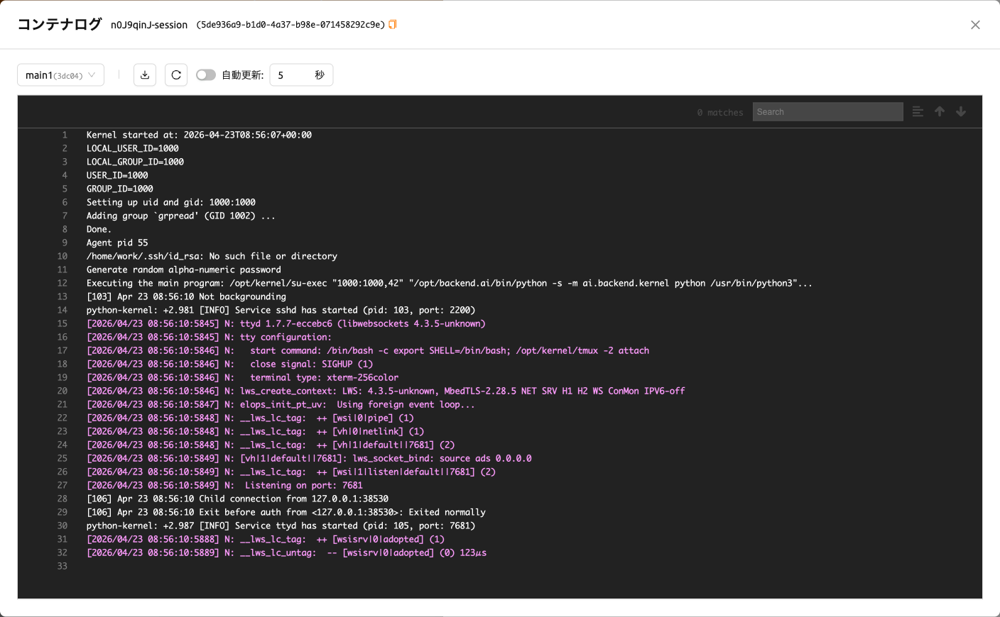

## Rename running session

Name of the active session can be changed. Click the 'Edit' button in the session detail
panel to change the session name.
New session name should also follow the [the authoring rule<session-naming-rule>](#the authoring rule<session-naming-rule>).

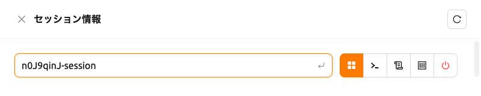

## Delete a compute session

To terminate a specific session, simply click on the red power button and click
'Terminate' button in the dialog. Since the data in the folder inside the compute
session is deleted as soon as the compute session ends, it is recommended to
move the data to the mounted folder or upload it to the mounted folder from the
beginning.

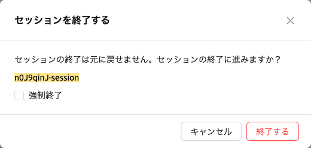

## Idleness checks

Backend.AI supports three types of inactivity (idleness) criteria for automatic garbage
collection of compute sessions: Max Session Lifetime, Network Idle Timeout, and Utilization
Checker.

The criteria for session termination can be found in the 'Idle Checks' section of the session detail panel.

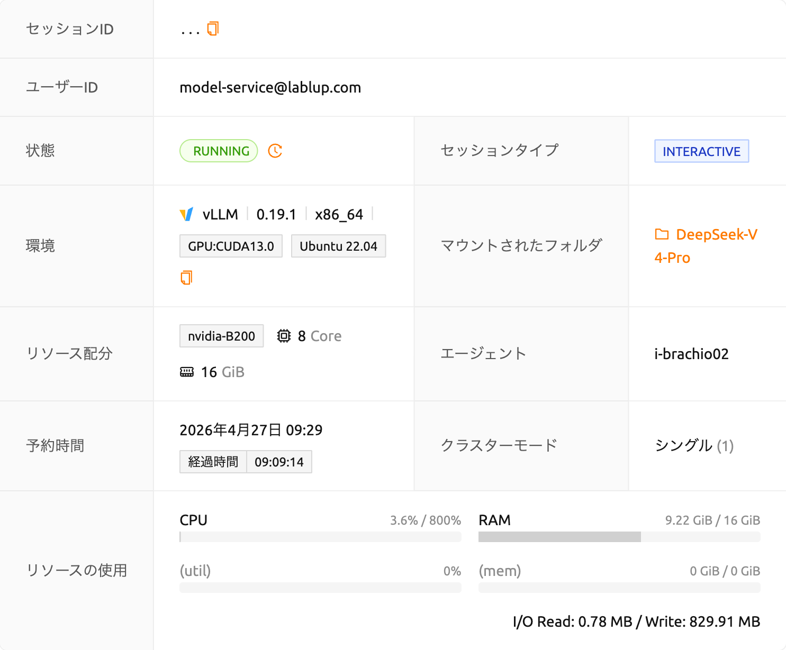

The meaning of idle checkers are as follows, and more detailed explanations can be
found by clicking the information (i) button in the idle checks section.

- Max Session Lifetime: Force-terminate sessions after this time from creation.
  This measure prevents sessions from running indefinitely.
- Network Idle Timeout: Force-terminate sessions that do not exchange data with the ユーザー (browser
  or web app) after this time. Traffic between the ユーザー and the compute session continuously occurs
  when the ユーザー interacts with an app, like terminal or Jupyter, by keyboard input, Jupyter cell
  creation, etc. Jupyter cell creation, etc. If there is no interaction for a certain period, the
  condition of garbage collection will be met. Even if there is a process executing a job in the
  compute session, it is subject to termination if there is no ユーザー interaction.
- Utilization Checker: Resources allocated to a compute session are reclaimed
  based on the utilization of those resources. The decision to delete is based on
  the following two factors:

  - Grace Period: The time during which the utilization idle checker is
    inactive. Even with low usage, the compute session won't be terminated during
    this period. However, once the grace period is over, if the average
    utilization remain below the threshold during the set idle timeout period,
    the system can terminate the session at any time. The grace period is
    merely a guaranteed duration during which termination does not occur. This
    measure is primarily for efficient management of low-usage GPU resources.
  - Utilization Threshold: If the resource utilization of a compute session does
    not exceed the set threshold for a certain duration (idle timeout), that
    session will be automatically terminated. For example, if the accelerator
    utilization threshold is set to 1%, and a compute session shows a
    utilization of less than 1% over the idle timeout, it becomes a target for
    termination. Resources with empty values are excluded from the garbage
    collection criteria.

   .. note::
      After the grace period, sessions can be terminated anytime if utilization
      remains low. Briefly using the resources does not extend the grace period.
      Only the average utilization over the last idle timeout is considered.

Hovering the mouse over the Utilization Checker will display a tooltip with the
utilization and threshold values. The text color changes to yellow and then red
as the current utilization approaches the threshold (indicating low resource
utilization).

   Depending on the environment settings, idle checkers and resource types of
   utilization checker's tooltip may be different.

## How to add environment variable before creating a session

To give more convenient workspace for ユーザーs, Backend.AI supports environment variable setting
in session launching. In this feature, ユーザーs can add any envs such as `PATH` by filling out
variable name and value in environment configuration dialog.

To add environment variable, simply click '+ Add environment variables' button of the Variable.
Also, you can remove the variable by clicking '-' button of the row that you want to get rid of.

You can write down variable name and value in the same line of the input fields.

## How to add preopen ports before creating a session

Backend.AI supports preopen ports setting at container startup. When using this feature, there is no need to build
separate images when you want to expose the serving port.

To add preopen ports, simply enter multiple values separated by either a comma (,) or a space.

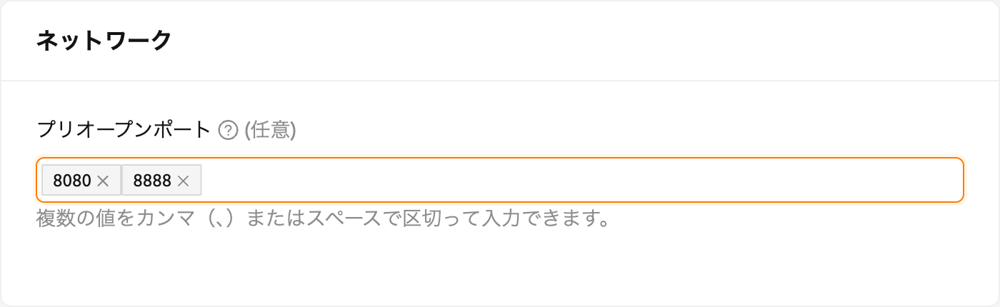

In the forth page of session creation page, ユーザーs can add, update and delete written preopen ports. To see more detail
information, please click 'Help (?)'' button.

Users can put port numbers in between 1024 ~ 65535, to the input fields. Then, press 'Enter'. Users can specify multiple ports, separated by commas (,).
Users can check the configured preopen ports in the session app launcher.

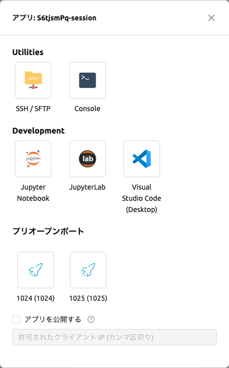

   The preopen ports are **the internal ports within the container**. Therefore, unlike other apps, when ユーザーs click the
   preopen ports in the session app launcher, a blank page will appear. Please bind a server to the respective port
   before use.

## Save session commit

Backend.AI supports \"Convert Session to Image\" feature from 24.03. Committing a `RUNNING` session will save the
current state of the session as a new image. Click the 'Commit' button (the fourth icon) in the session detail panel
to open a dialog displaying the session information. After entering the session name, ユーザーs can convert the session to
a new image. The session name must be 4 to 32 characters long and can only contain alphanumeric letters, hyphens (`-`),
or underscores (`_`).

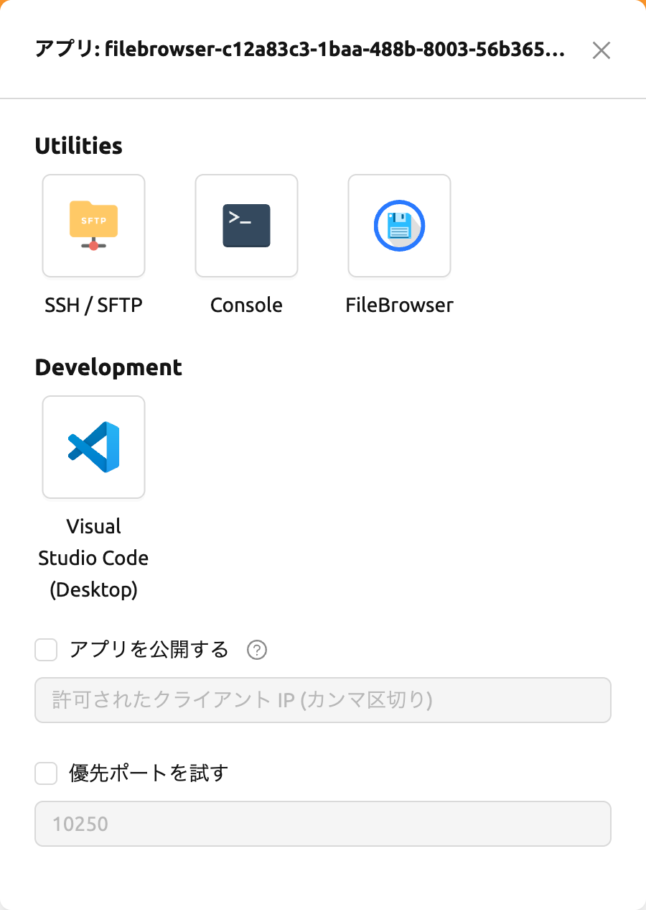

After filling out session name in the input field, click the 'PUSH SESSION TO CUSTOMIZED IMAGE' button.
The customized image created in this way can be used in future session creations. However, directories
mounted to the container for image commits are considered external resources and are not included in
the final image. Remember that `/home/work` is a mount folder (scratch directory), so it is not included.

   Currently, Backend.AI supports "Convert Session to Image" only when the session is in `INTERACTIVE` mode.
   To prevent unexpected error, ユーザーs may not be able to terminate the session during committing process.
   To stop the ongoing process, check the session, and force-terminate it.

   The number of times to "Convert Session to Image" may be limited by the ユーザー resource policy. In this case,
   [remove the existing customized image<delete-customized-image>](#remove the existing customized image<delete-customized-image>) and try again. If this does not resolves
   the problem, please contact the 管理者istrator.

## Utilizing converted images of ongoing sessions

Converting an ongoing session into an image allows ユーザーs to select this image from the environments in the session launcher
when creating a new session. This image is not exposed to other ユーザーs and is useful for continuing to use the current session
state as is. The converted image is tagged with `Customized<session name>`.

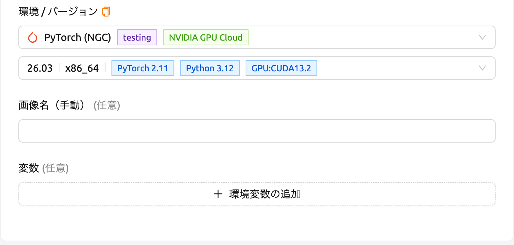

To manually enter the environment name for future session creation, please click the copy icon.

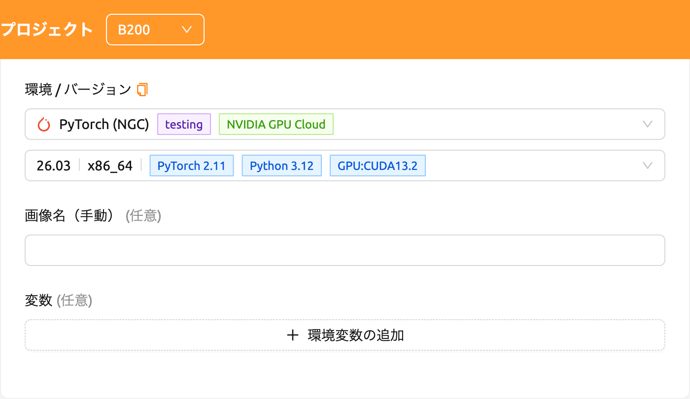

## Advanced web terminal usage

The web-based terminal internally embeds a utility called
[tmux](https://github.com/tmux/tmux/wiki). tmux is a terminal multiplexer that
supports to open multiple shell windows within a single shell, so as to allow
multiple programs to run in foreground simultaneously. If ユーザーs want to take
advantage of more powerful tmux features, they can refer to the official tmux
documentation and other usage examples on the Internet.

Here we are introducing some simple but useful features.

### Copy terminal contents

tmux offers a number of useful features, but it's a bit confusing for first-time
ユーザーs. In particular, tmux has its own clipboard buffer, so when copying the
contents of the terminal, ユーザーs can suffer from the fact that it can be pasted
only within tmux by default. Furthermore, it is difficult to expose ユーザー
system's clipboard to tmux inside web browser, so the terminal
contents cannot be copied and pasted to other programs of ユーザー's computer. The
so-called `Ctrl-C` / `Ctrl-V` is not working with tmux.

If copy and paste of terminal contents is needed to system's clipboard,
ユーザーs can temporarily turn off tmux's mouse support. First, press `Ctrl-B` key
to enter tmux control mode. Then type `:set -g mouse off` and press `Enter`
(note to type the first colon as well). Users can check what they are
typing in the status bar at the bottom of the screen. Then drag the desired text
from the terminal with the mouse and press the `Ctrl-C` or `Cmd-C` (in マック)
to copy them to the clipboard of the ユーザー's computer.

With mouse support turned off, scrolling through the mouse wheel is not supprted, to see
the contents of the previous page from the terminal. In this case, ユーザーs can turn
on mouse support. Press `Ctrl-B`, and this time, type `:set -g mouse
on`. Now scrolling through mouse wheelis available to see the contents of the previous page.

If you remember `:set -g mouse off` or `:set -g mouse on` after `Ctrl-B`,
you can use the web terminal more conveniently.

   `Ctrl-B` is tmux's default control mode key. If ユーザーs set another control key
   by modifying `.tmux.conf` in ユーザー home directory, they should press the set
   key combination instead of `Ctrl-B`.

   In the ウィンドウズ environment, refer to the following shortcuts.

   * Copy: Hold down `Shift`, right-click and drag
   * Paste: Press `Ctrl-Shift-V`

### Check the terminal history using keyboard

There is also a way to copy the terminal contents and check the previous
contents of the terminal simultaneously. It is to check the previous contents
using the keyboard. Again, click `Ctrl-B` first, and then press the `Page
Up` and/or `Page Down` keys. To exit search mode, just press the `q`
key. With this method, ユーザーs can check the contents of the terminal history even
when the mouse support is turned off.

### Spawn multiple shells

The main advantage of tmux is to launch and use multiple shells in one
terminal window. Pressing `Ctrl-B` key and `c`. will show the new shell environment.
Previous window is not visible at this point, but is not terminated.
Press `Ctrl-B` and `w`. List of shells currently open on tmux is shown.
Shell starting with `0:` is the initial shell environment, and the shell
starting with `1:` is the one just created. Users can move between shells
using the up/down keys. Place the cursor on the shell `0:` and press the Enter
key to select it.

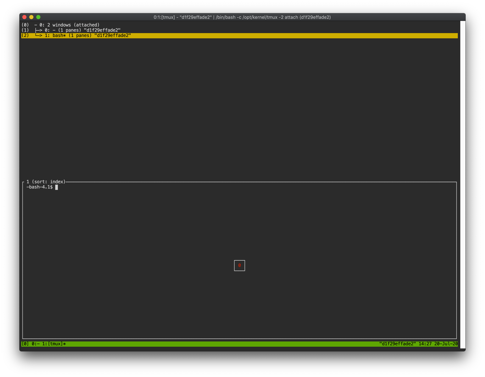

In this way, ユーザーs can use multiple shell environments within a web terminal. To exit or terminate the
current shell, just enter `exit` command or press `Ctrl-B x` key and then
type `y`.

In summary:

- `Ctrl-B c`: create a new tmux shell
- `Ctrl-B w`: query current tmux shells and move around among them
- `exit` or `Ctrl-B x`: terminate the current shell

Combining the above commands allows ユーザーs to perform various tasks simultaneously
on multiple shells.