# コンピュートセッション

Backend.AI WebUIで最もよく利用されるページは、「セッション」ページと「データ」ページです。
本ドキュメントでは、「セッション」ページでコンテナベースのコンピュートセッションを照会・作成し、各種Webアプリケーションを活用する方法について説明します。

## 新しいセッションを開始する

ユーザーアカウントでログインした後、左側のサイドバーで「セッション」をクリックします。
「セッション」ページでは、新しいセッションを開始したり、既に実行中のセッションを使用・管理することができます。

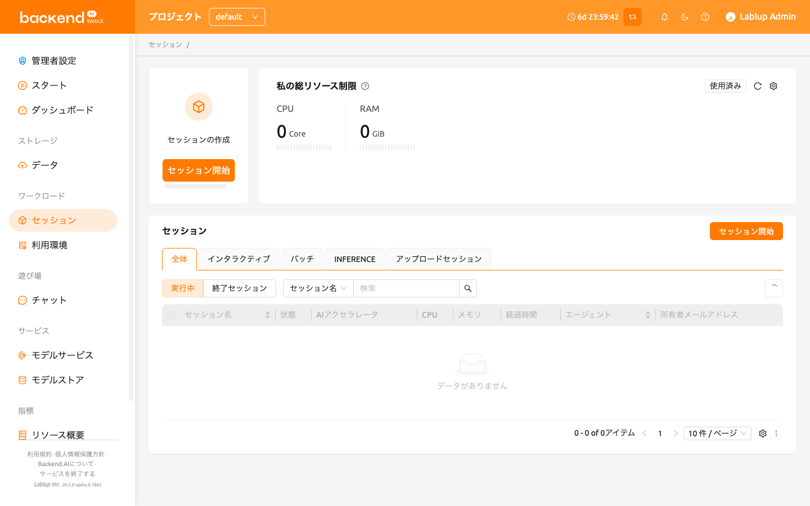

新しいコンピュートセッションを開始するには、「スタート」ボタンをクリックします。

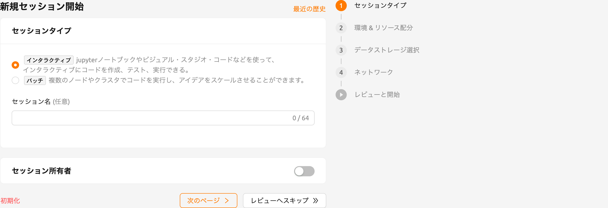

### セッションタイプ

最初のページでは、ユーザーはセッションのタイプ（「interactive」または「batch」）を選択できます。
必要に応じて、セッション名の設定（任意）も可能です。

- セッションタイプ: セッションの形態を決定します。セッションには「インタラクティブ」と「バッチ」の2種類があります。
  両者の主な違いは次のとおりです。

  - インタラクティブコンピュートセッション

    - Backend.AIの初期バージョンから提供されている形態です。
    - 事前に定義された実行スクリプトやコマンドを指定せずにセッションを作成し、
      セッション作成後にユーザーが対話的に操作する方法で使用します。
    - ユーザーが明示的にセッションを削除するか、管理者によってセッションのガベージコレクターが設定されない限り、
      セッションは自動的に終了されません。

  - バッチコンピュートセッション

    - この形態のセッションは、Backend.AI 22.03からGUIで提供されています
      （CLIでは22.03以前からバッチタイプのセッションをサポートしていました）。
    - コンピュートセッションが準備できたときに実行されるスクリプトを事前に定義します。
    - このセッションは、コンピュートセッションが準備でき次第スクリプトを実行し、
      実行が終了するとすぐにセッションを自動的に終了します。
      ユーザーが実行スクリプトを事前に記述できる場合や、ワークロードのパイプラインを
      構築している場合、サーバーファームのリソースを効率的かつ柔軟に活用できます。
    - バッチタイプのコンピュートセッションでは、開始時刻を設定できます。
      ただし、この機能は登録された時刻にセッションが必ず開始されることを保証するものではない点にご注意ください。
      リソース不足などの理由により、`PENDING`状態のままとなることもあります。
      むしろ、開始時刻までセッションが実行されないことを保証する機能です。
    - バッチタイプのコンピュートセッションでは、「タイムアウト時間」も設定できます。
      タイムアウト時間を設定すると、指定した時間を超過した場合にセッションが自動的に終了します。

    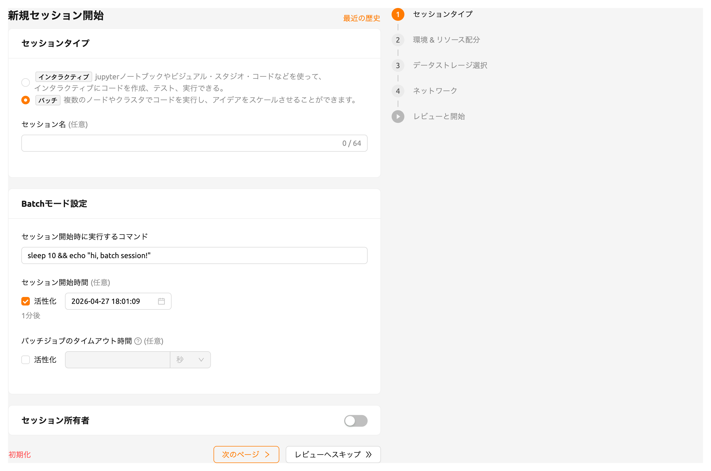

- セッション名: 作成するコンピュートセッションの名前を指定できます。
  設定すると、この名前がセッション情報に表示されるため、複数のコンピュートセッションを
  区別しやすくなります。指定しない場合は、ランダムな単語が自動的に割り当てられます。
  セッション名には4～64文字の英数字のみを使用でき、スペースは使用できません。

`スーパー管理者`または`管理者`アカウントでセッションを作成する場合は、
セッション所有者を追加で指定できます。トグルを有効にすると、
ユーザーメールアドレスフィールドが表示されます。

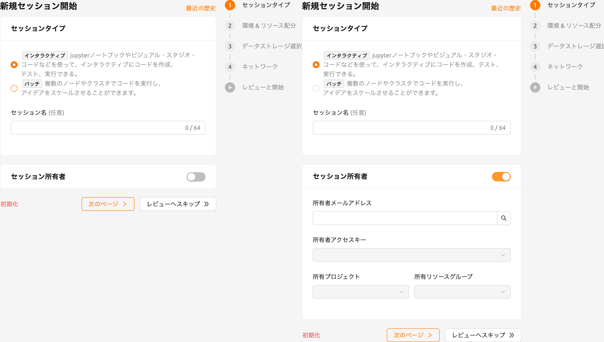

セッションを割り当てたいユーザーのメールアドレスを入力し、
「検索」ボタンをクリックすると、そのユーザーのアクセスキーが自動的に登録されます。
プロジェクトやリソースグループも選択できます。

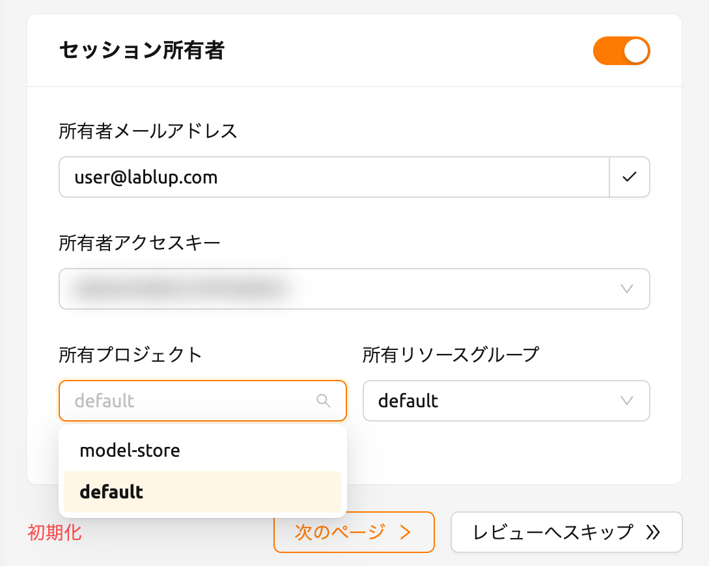

### 実行環境とリソース割り当て

次のページに進むには、下部の「次のページ」ボタンをクリックするか、右側の「実行環境とリソース割り当て」メニューをクリックします。
追加設定なしでセッションを作成したい場合は、「レビューへスキップ」ボタンを押してください。
この場合、他のページの設定はすべて既定値が使用されます。

  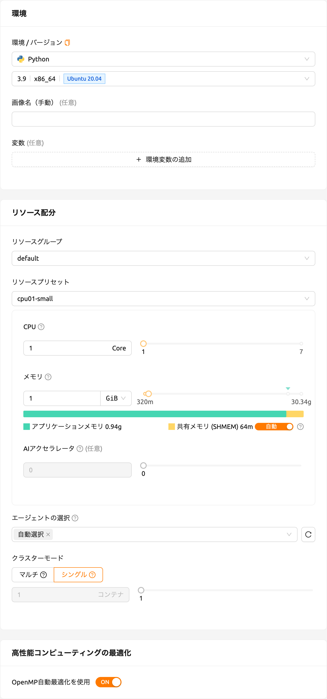

### 実行環境

2番目のページで設定できる各項目の詳細な説明については、以下を参照してください。

- 実行環境: TensorFlow、PyTorch、C++などのコンピュートセッションの基本環境を選択できます。
  コンピュートセッションは、基本環境ライブラリに自動的に組み込まれます。
  別の環境を選択すると、対応するパッケージが既定でインストールされます。
- バージョン: 実行環境のバージョンを指定できます。
  1つの実行環境には複数のバージョンがあります。たとえば、TensorFlowには1.15や2.3などの複数のバージョンがあります。
- イメージ名: コンピュートセッションで使用するイメージの名前を指定できます。
  この設定は、環境設定によっては利用できない場合があります。
- 環境変数を設定する: より便利な作業環境をユーザーに提供するために、Backend.AIはセッション起動時の環境変数設定をサポートしています。
  この機能では、環境変数設定ダイアログに変数名と値を入力することで、
  `PATH`などの任意の環境変数を追加できます。

  

### リソース割り当て

- リソースグループ: コンピュートセッションを作成するリソースグループを指定します。
  リソースグループは、各ユーザーがアクセスできるホストサーバーをグループ化する単位です。
  通常、リソースグループ内のサーバーは同じ種類のGPUリソースを備えています。
  管理者は、任意の基準でサーバーを分類し、1つ以上のリソースグループにまとめて、
  ユーザーが使用できるリソースグループを設定できます。ユーザーは、管理者が許可した
  リソースグループのサーバーでのみコンピュートセッションを起動できます。
  複数のリソースグループが許可されている場合、ユーザーは任意のグループを選択できますが、
  システムが単一設定のみ許可している場合は変更できません。
- リソースプリセット: このテンプレートには、コンピュートセッションに割り当てるCPU、メモリ、GPUなどの
  リソースセットが事前に定義されています。管理者は、よく使われるリソース設定を事前に定義できます。
  数値入力を調整するか、スライダーを動かすことで、ユーザーは希望する量のリソースを割り当てることができます。

  

  各項目の意味は次のとおりです。
  「案内(ヘルプ)」ボタン（?）をクリックすると、詳細な情報を確認できます。

  * CPU: CPUは、命令によって指定された基本的な算術、論理、制御、入出力（I/O）操作を実行します。
    一般に、高性能コンピューティングワークロードではCPUが多いほど有利です。
    ただし、複数のCPUの利点を活かすには、複数のCPUに対応するようにプログラムコードを記述する必要があります。
  * メモリ: コンピューターメモリは一時的な記憶領域で、
    中央処理装置（CPU）が必要とするデータと命令を保持します。
    機械学習ワークロードでGPUを使用する場合、
    GPUメモリの少なくとも2倍のメモリを割り当てる必要があります。
    そうしないと、GPUのアイドル時間が増加し、パフォーマンスが低下します。
  * 共有メモリ: コンピュートセッションに割り当てる共有メモリの容量（GB）です。
    共有メモリはRAMに設定されたメモリの一部を使用するため、RAMで指定した量を超えることはできません。
  * AIアクセラレータ: AIアクセラレータ（GPUまたはNPU）は、機械学習に関わる行列/ベクトル演算に適しています。
    AIアクセラレータは、トレーニング/推論アルゴリズムを桁違いに高速化し、
    実行時間を数週間から数日に短縮します。
  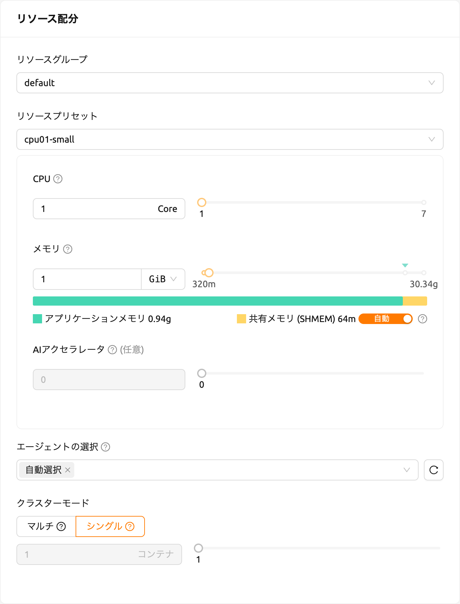

  :::note
  **セッション数**オプションはこのフォームでは設定しなくなりました。同一の設定で
  複数のセッションを一度に起動するには、**確認と起動**ステップにあるスタート
  ボタンのドロップダウンメニューを使用します。詳細は[確認と起動](#confirm-and-launch)
  セクションを参照してください。
  :::

  * エージェントの選択: 割り当てるエージェントを選択します。既定では、エージェントはスケジューラーによって自動的に選択されます。
    エージェントセレクターには、各エージェントで実際に利用可能なリソース量が表示されます。
    現在、この機能はシングルノード、シングルコンテナ環境でのみサポートされています。
  * クラスターモード: クラスターモードでは、ユーザーは複数のコンピュートセッションを一度に作成できます。
    詳細については、[Backend.AIクラスターコンピュートセッションの概要](#backendai-cluster-compute-session)を参照してください。

:::note
エージェント選択機能は、サーバー環境によっては利用できない場合があります。
:::

- 高性能コンピューティング最適化: Backend.AIはHPC最適化に関連する値の設定を提供します。

  Backend.AIは、`nthreads-var`内部制御変数の設定UIを提供します。
  Backend.AIは既定で、この値をセッションのCPUコア数と同じに設定します。
  これは、一般的な高性能コンピューティングワークロードを高速化する効果があります。
  ただし、一部のマルチスレッドワークロードでは、OpenMPを使用する複数のプロセスが同時に動作し、
  異常に多くのスレッドが生成されて、パフォーマンスが大幅に低下する場合があります。
  この問題を解決するには、スレッド数を1または2に設定するとよいでしょう。

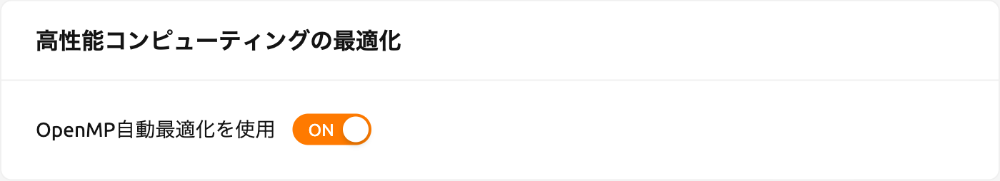

### データとストレージ

次のページに進むには、下部の「次のページ」ボタンをクリックするか、右側の「データとストレージ」メニューをクリックします。

コンピュートセッションが削除されると、既定でデータも削除されます。
ただし、マウントされたフォルダに保存されたデータは保持されます。
これらのフォルダのデータは、別のコンピュートセッションを作成する際にマウントして再利用することもできます。
フォルダをマウントしてコンピュートセッションを実行する方法の詳細については、
[コンピュートセッションへのフォルダのマウント](#session-mounts)を参照してください。

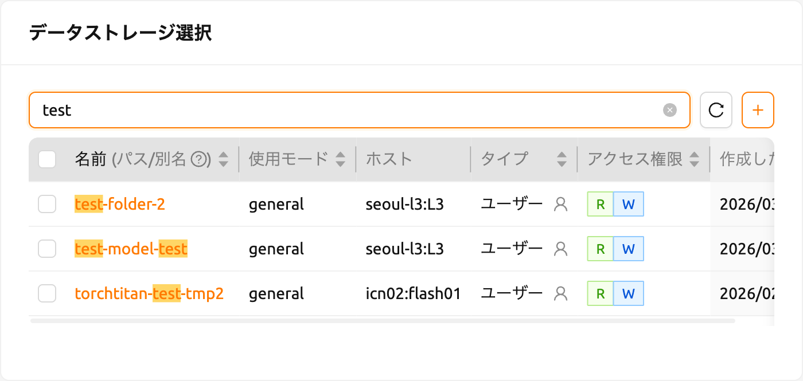

ユーザーは、コンピュートセッションにマウントするデータフォルダを指定できます。
フォルダ名をクリックすると、フォルダエクスプローラーを使用できます。詳細については、
[フォルダの探索](#explore-folder)セクションを参照してください。

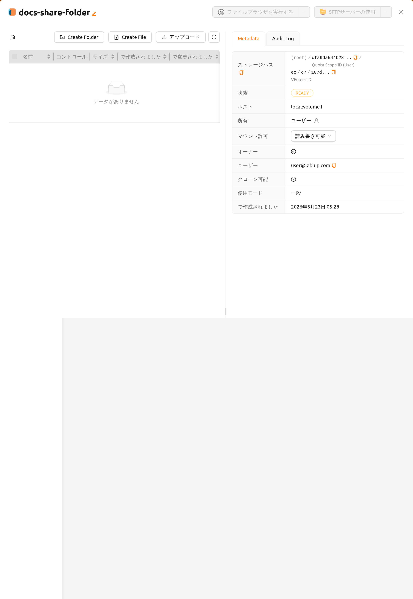

検索ボックス横の「+」ボタンをクリックすると、新しいフォルダを作成できます。
新しいフォルダを作成すると、マウントするフォルダとして自動的に選択されます。
詳細については、[ストレージフォルダの作成](#create-storage-folder)セクションを参照してください。

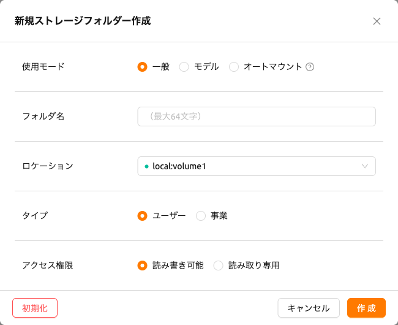

### ネットワーク

次のページに進むには、下部の「次のページ」ボタンをクリックするか、右側の「ネットワーク」メニューをクリックします。
このページでは、事前開放ポートなどのネットワーク設定を行うことができます。

- 事前開放ポート設定: コンピュートセッションで事前開放ポートを設定するためのインターフェイスを提供します。
  詳細については、[セッション作成前に事前開放ポートを追加する方法](#set-preopen-ports)を参照してください。

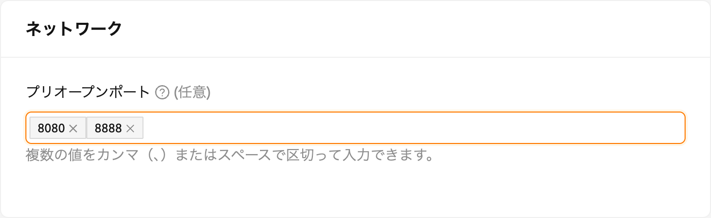

### 確認と起動

ネットワーク設定が完了したら、下部の「次のページ」ボタンをクリックするか、
右側の「レビューと開始」ボタンをクリックして、最後のページに進みます。

最後のページでは、ユーザーは作成するセッションの情報（実行環境、割り当てられたリソース、
マウント情報、前のページで設定した環境変数、事前開放ポートなど）を確認できます。
設定を確認したら、ユーザーは「ローンチ」ボタンをクリックしてセッションを起動できます。
各カード右上の「編集」ボタンをクリックすると、関連ページに移動します。

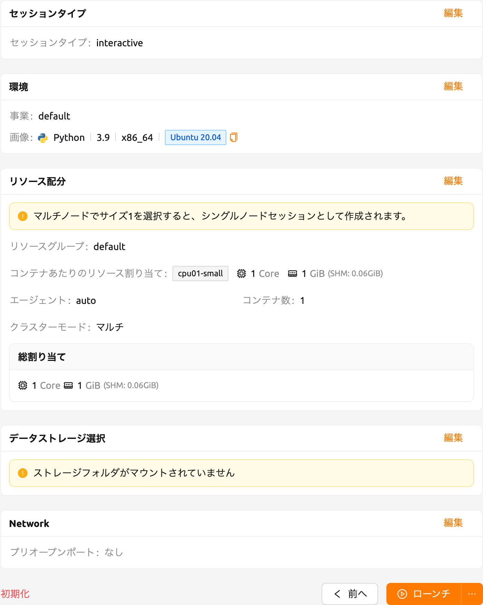

同一の設定で複数のセッションを一度に起動するには、「ローンチ」ボタンの隣にある
その他(`...`)アイコンをクリックしてドロップダウンメニューを開き、
**複数セッションを起動**を選択します。ダイアログが表示され、作成する**セッション数**を
設定できます。各セッションはフォームに表示されたリソースで独立して作成されます。
「ローンチ」ボタンを単にクリックした場合は、既定で 1 つのセッションのみが起動します。

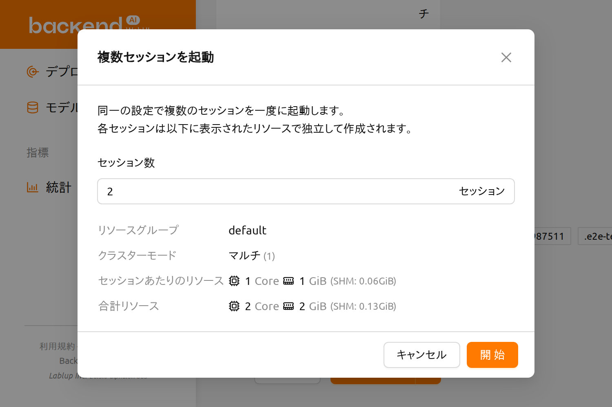
<!-- TODO: Capture screenshot of the start button dropdown showing "複数セッションを起動" -->

:::note
同時セッション起動はシステムによって制限されます。要求された合計が残りのセッション
クォータを超えると警告が表示され、一部のセッションはリソースが確保されるまで
キューに入る可能性があります。
:::

設定に問題がある場合は、次のようにエラーメッセージが表示されます。
この場合、ユーザーは設定を編集できます。

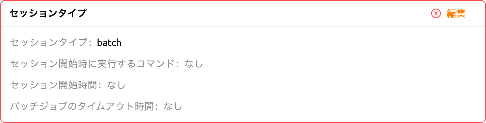

「ローンチ」ボタンをクリックすると、マウントされたフォルダがないことを示す警告ダイアログが表示されます。
フォルダのマウントが不要な場合は、警告を無視してダイアログの「スタート」ボタンをクリックして進むことができます。

新しいコンピュートセッションが**実行中**タブに追加されると、画面右下に通知が表示されます。
通知の左下にはセッションのステータスが表示され、右下にはアプリダイアログを開くボタン、
ターミナルの起動、コンテナログの表示、セッション終了のボタンが含まれています。
ヘッダーの**通知**をクリックすると、このセッション作成通知を再度表示することもできます。

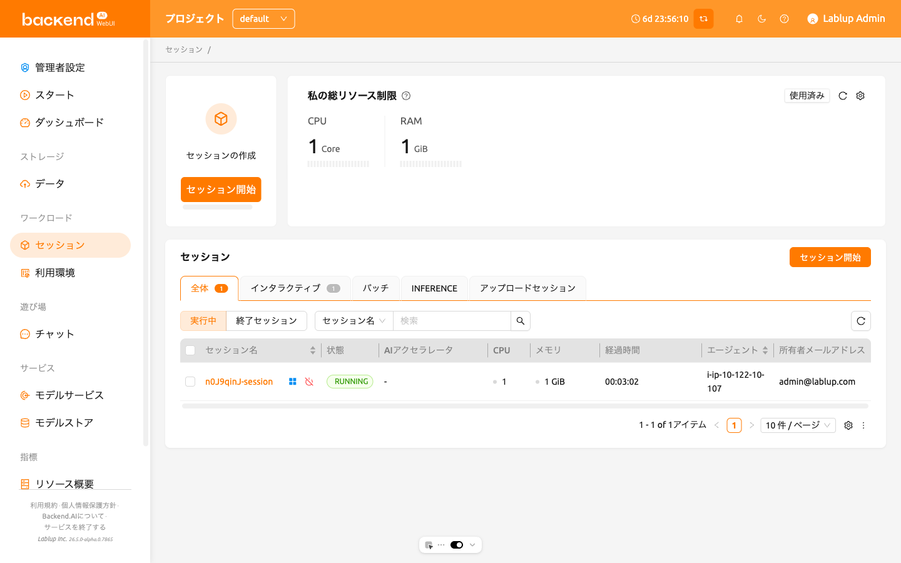

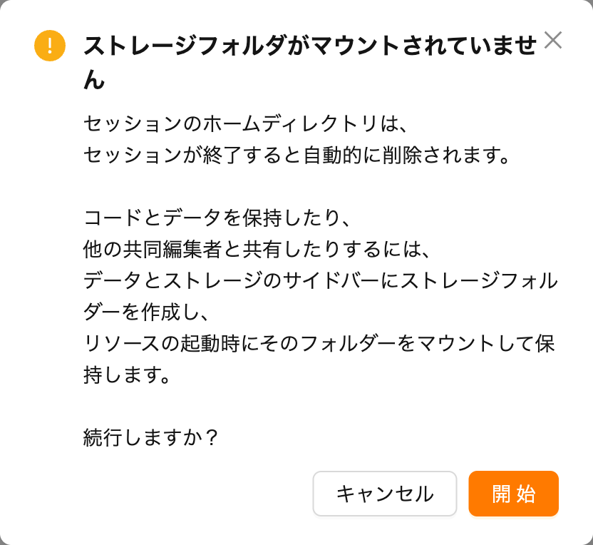

一番左のアプリダイアログボタンをクリックすると、利用可能なアプリサービスを確認できます。

### 最近の履歴

「セッションランチャー」ページは、セッションを作成するためのさまざまなオプションを提供します。
24.09より、以前に作成したセッションの情報を記憶する`最近の履歴`機能が追加されました。

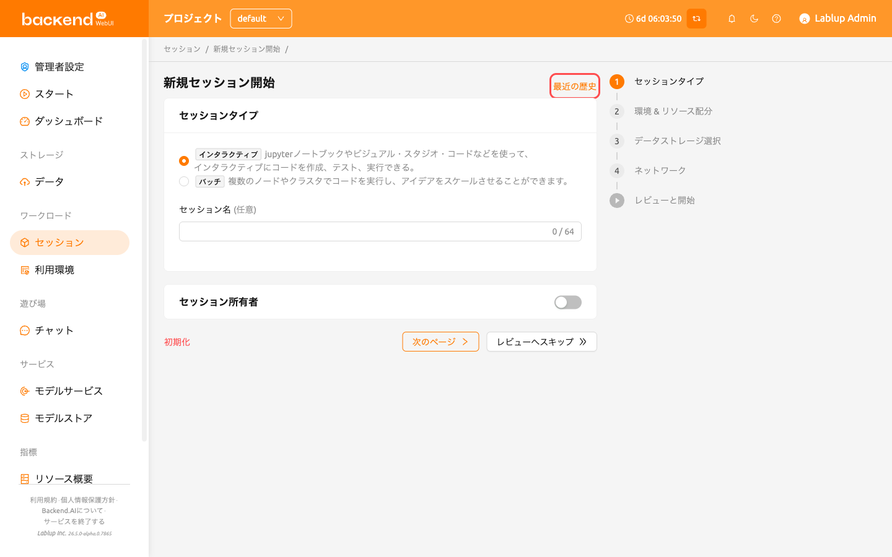

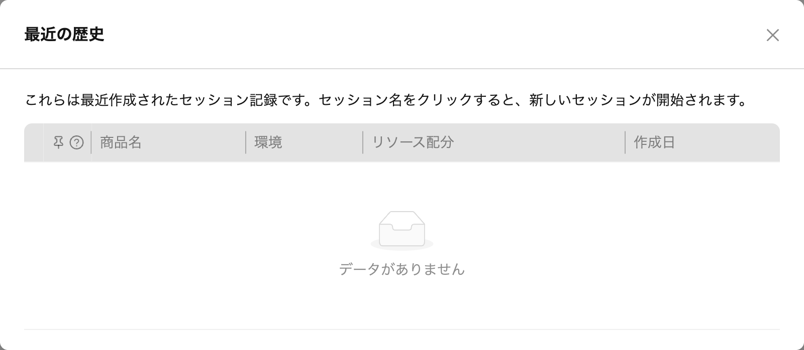

`最近の履歴`モーダルには、最新の5つのセッションの情報が保存されます。
セッション名をクリックすると、セッション作成の最終ステップである「レビューと開始」ページに移動します。
各項目の名前を変更したり、ピン留めしてアクセスしやすくすることもできます。

:::note
スーパー管理者は、クラスター内で現在実行中（または終了済み）のすべてのコンピュートセッション情報を照会できますが、
一般ユーザーは自分が作成したセッションのみを表示できます。
:::

:::note
断続的なネットワーク接続の問題などにより、コンピュートセッションリストが正常に表示されない場合があります。
この場合は、ブラウザを更新することで解決できます。
:::

## セッション詳細パネル

セッションの詳細情報を確認するには、セッションリストでセッション名をクリックします。
セッション詳細パネルには、セッションID、ユーザーID、ステータス、タイプ、実行環境、マウント情報、
リソース割り当て、予約時間、経過時間、エージェント、クラスターモード、ネットワークI/Oを含む
リソース使用量、カーネル情報などのセッション情報が表示されます。

「カーネル」の「ホスト名」の横にある「ログ」ボタンをクリックすると、そのカーネルのログを直接確認できます。

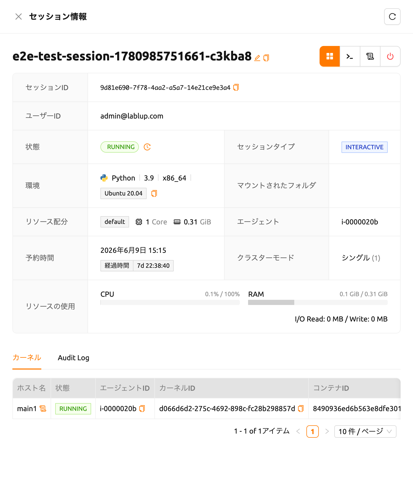

Backend.AIは、`PENDING`、`TERMINATED`、または`CANCELLED`状態のセッションに対して追加情報を提供します。
利用可能な場合は、「情報」ボタンをクリックして詳細を確認できます。

Backend.AI Manager v26.2.0以降をご使用の場合、セッション詳細パネルのセッションステータスタグの横に時計アイコンボタンが表示されます。このアイコンをクリックすると、セッションのスケジュール履歴モーダルが開き、そのセッションに対してシステムが行ったすべてのスケジューリング決定の詳細ログを確認できます。詳細については、[セッションのスケジュール履歴](#session-scheduling-history)セクションを参照してください。

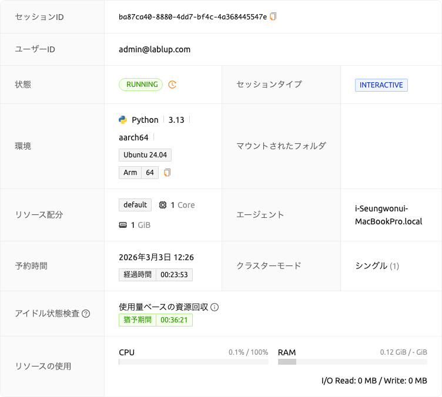

### セッションのスケジュール履歴

セッションのスケジュール履歴モーダルは、コンピュートセッションの内部スケジューリングライフサイクルを透明に表示します。セッションが経たすべてのスケジューリングフェーズの詳細な記録を表示し、ステータス遷移、結果、リトライ回数、発生したエラーなどの情報を含みます。この機能は、セッションが遅延している理由、`PENDING`状態に留まっている理由、または開始に失敗した理由を理解するのに特に役立ちます。

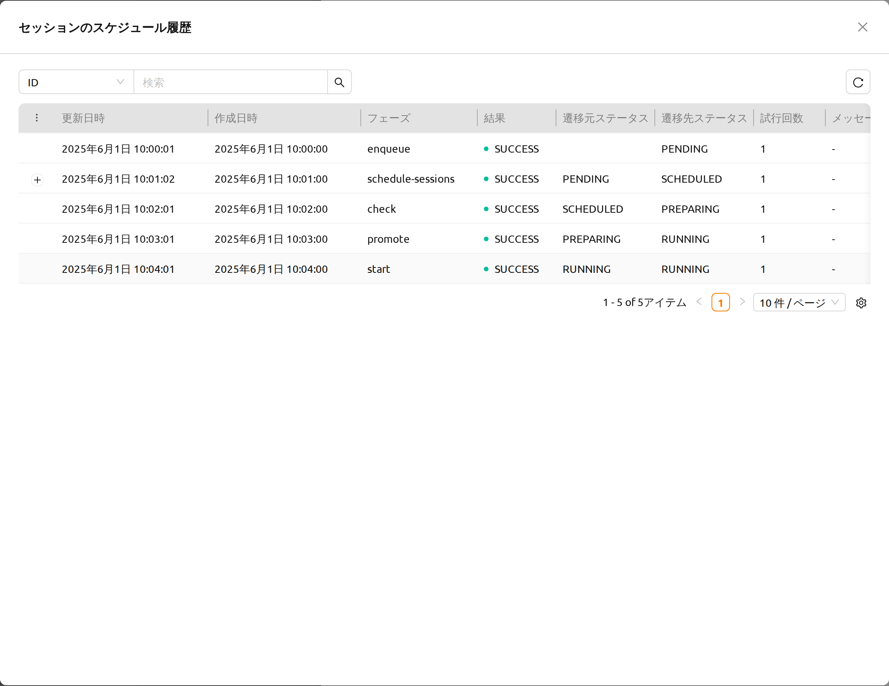

:::note
この機能はBackend.AI Manager v26.2.0以降で利用可能です。セッションステータスの横に履歴アイコンが表示されない場合、ご使用のBackend.AI Managerがこの機能にまだ対応していない可能性があります。
:::

#### フィルターバー

モーダル上部のフィルターバーを使用して、スケジュール履歴レコードを絞り込むことができます。以下のプロパティでフィルタリングできます：

- **ID**: 履歴レコードID（UUID、完全一致）でフィルタリング
- **フェーズ**: スケジューリングフェーズ名でフィルタリング
- **結果**: 結果タイプ（SUCCESS、FAILURE、STALE、NEED_RETRY、EXPIRED、GIVE_UP、SKIPPED）でフィルタリング
- **元のステータス**: スケジューリングステップ前のセッションステータスでフィルタリング
- **ステータスへ**: スケジューリングステップ後のセッションステータスでフィルタリング
- **エラーコード**: エラーコードでフィルタリング
- **メッセージ**: メッセージ内容でフィルタリング

フィルターバーの横にあるリフレッシュボタンを使用して、スケジュール履歴データを再読み込みできます。

#### 履歴テーブル

スケジュール履歴テーブルには、以下のカラムが表示されます：

- **フェーズ**: スケジューリングフェーズの名前
- **結果**: このスケジューリングステップの結果で、色分けされたバッジで表示されます
- **ステータス遷移（送信元 / 宛先）**: このスケジューリングステップの前後のセッションステータス
- **試行回数**: このスケジューリングステップが試行された回数
- **更新日時**: このレコードが最後に更新された日時
- **作成日時**: このレコードが作成された日時

**作成日時**または**更新日時**カラムでテーブルをソートして、お好みの順序でレコードを表示できます。

#### 展開可能なサブステップ

一部の履歴レコードには詳細なサブステップが含まれています。サブステップがある場合、行の左側に展開矢印が表示されます。クリックすると、そのスケジューリングフェーズの個別のサブステップを表示するネストされたテーブルが表示されます。

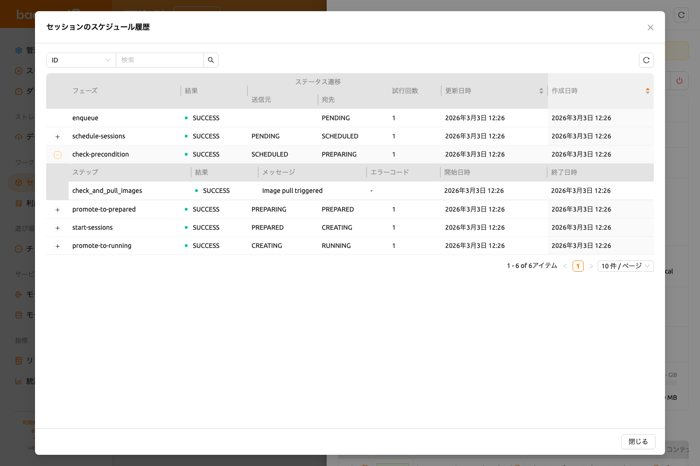

サブステップテーブルには、以下のカラムが含まれます：

- **ステップ**: サブステップの名前
- **結果**: サブステップの結果で、色分けされたバッジで表示されます
- **メッセージ**: 詳細情報またはエラーの説明
- **エラーコード**: ステップが失敗した場合の特定のエラーコード
- **開始日時**: サブステップが開始された日時
- **終了日時**: サブステップが完了した日時

#### 結果バッジの色

各スケジューリングステップとサブステップには、結果を示す色分けされたバッジが表示されます：

| 結果 | 色 | 意味 |
|--------|-------|---------|
| SUCCESS | 緑 | ステップが正常に完了しました |
| FAILURE | 赤 | ステップが失敗しました |
| STALE | グレー | レコードが古くなっているか最新ではありません |
| NEED_RETRY | 黄 | ステップの再試行が必要です |
| EXPIRED | 赤 | スケジューリングの試行が期限切れになりました |
| GIVE_UP | 赤 | システムがスケジューリングを断念しました |
| SKIPPED | グレー | ステップがスキップされました |

## Jupyter Notebookを使う

既に実行中のコンピュートセッションを使用および管理する方法を見てみましょう。
セッション詳細パネル右上の最初のアイコンをクリックすると、アプリランチャーが開き、
そのセッションで利用可能なアプリサービスが表示されます。

:::note
アプリアイコンの下には2つのチェックオプションがあります。それぞれを選択した状態でアプリを開くと、
次の機能が適用されます。

* アプリを外部に公開: アプリを外部に公開します。基本的に、ターミナルやJupyter Notebookサービスなどの
  Webサービスは未認証と見なされるため、サービスURLを知っていても他のユーザーはアクセスできません。
  ただし、このオプションをチェックすると、サービスURL（およびポート番号）を知っている人なら
  誰でもアクセスして使用できるようになります。
  もちろん、ユーザーはサービスにアクセスするためのネットワーク経路を持っている必要があります。
* 優先ポートを試す: このオプションをチェックしない場合、WebサービスのポートはBackend.AIが事前に準備した
  ポートプールからランダムに割り当てられます。
  このオプションをチェックして特定のポート番号を入力すると、入力したポート番号が最初に試行されます。
  ただし、ポートがポートプールにまったく存在しない、または他のサービスが既にそのポートを使用している
  可能性があるため、常に希望のポートが割り当てられる保証はありません。
  この場合、ポート番号はランダムに割り当てられます。

システム構成によっては、これらのオプションが表示されない場合があります。
:::

Jupyter Notebookをクリックしてみましょう。

新しいウィンドウが開き、Jupyter Notebookが実行されていることが確認できます。
このNotebookは実行中のコンピュートセッション内で作成されており、ボタンをクリックするだけで簡単に使用できます。
また、コンピュートセッションが提供する言語環境とライブラリをそのまま使用できるため、
別途パッケージをインストールする必要はありません。
Jupyter Notebookの詳しい使い方については、Jupyter Notebookの公式ドキュメントを参照してください。

Notebookのファイルエクスプローラーにある`id_container`ファイルには、SSHの秘密鍵が含まれています。
必要に応じて、ユーザーはこれをダウンロードし、コンテナへのSSH/SFTP接続に使用できます。

右上の「NEW」ボタンをクリックして「Notebook for Backend.AI」を選択すると、
ユーザーがコードを入力できるipynbウィンドウが表示されます。

このウィンドウでは、ユーザーはセッションが提供する環境を使用して、任意のコードを入力して実行できます。
コードは、コンピュートセッションが実際に作成されているBackend.AIのノードで実行され、
ローカルマシン上に別途環境を構成する必要はありません。

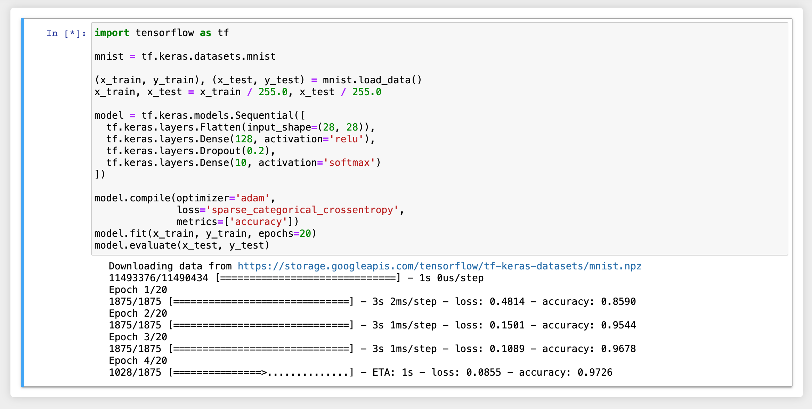

ウィンドウを閉じると、Notebookファイルエクスプローラーで`Untitled.ipynb`ファイルを確認できます。
ここで作成されたファイルは、セッションが終了すると削除される点に注意してください。
セッションが終了した後もファイルを保存する方法については、データとストレージフォルダセクションで説明しています。

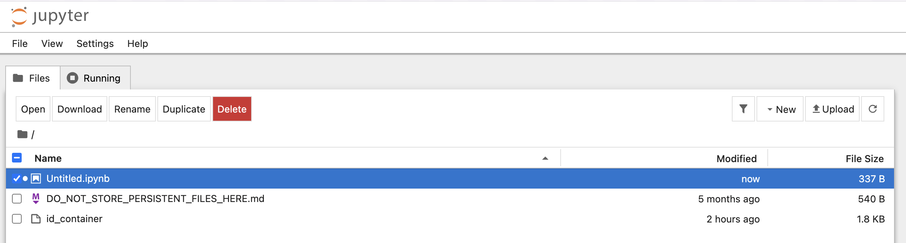

## ウェブターミナルを使う

このセクションでは、ウェブターミナルの使用方法について説明します。
ターミナルアイコン（2番目のボタン）をクリックすると、コンテナのttydアプリを使用できます。
新しいウィンドウにターミナルが表示され、次の図のようにシェルコマンドを実行してコンピュートセッションにアクセスできます。
コマンドに慣れている場合は、さまざまなLinuxコマンドを簡単に実行できます。
Jupyter Notebookで作成した`Untitled.ipynb`ファイルが、`ls`コマンドでも一覧に表示されていることが確認できます。
これは、両方のアプリが同じコンテナ環境で実行されていることを示しています。

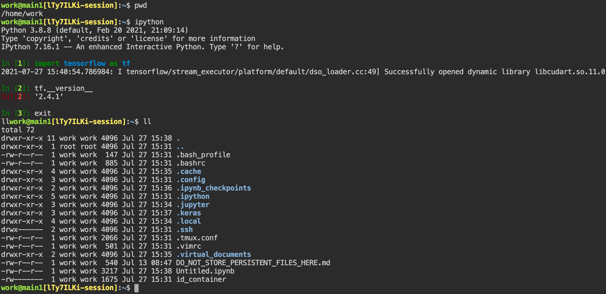

ここで作成したファイルは、Jupyter Notebookでもすぐに確認できます。逆に、Jupyter Notebookで
ファイルに加えた変更も、ターミナルからすぐに確認できます。これは、同じコンピュートセッション内で
同じファイルを使用しているためです。

このほかにも、コンピュートセッションが提供する実行環境の種類に応じて、
TensorBoardやJupyter LabなどのWebベースのサービスを利用できます。

## コンピュートセッションのログを照会する

実行中のコンピュートセッションのコントロールパネルにある最後のアイコンをクリックすると、
コンピュートセッションのログを確認できます。

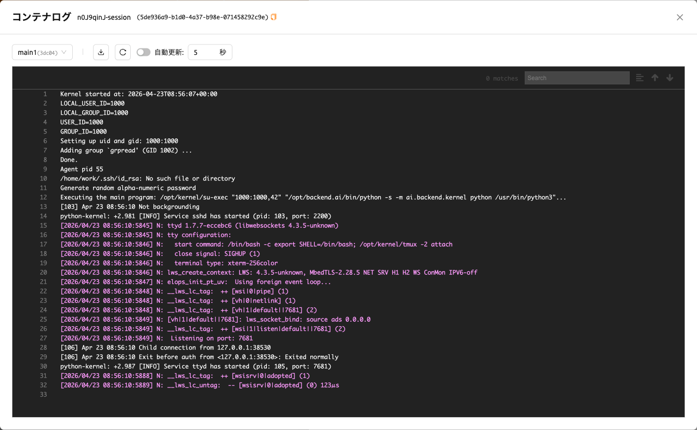

## 実行中のセッションの名前を変更する

実行中のセッションの名前を変更できます。セッション詳細パネルで「編集」ボタンをクリックして、
セッション名を変更します。
新しいセッション名も[セッション名の命名規則](#session-naming-rule)に従う必要があります。

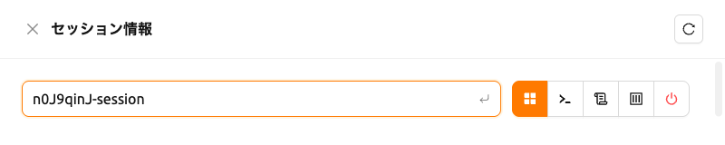

## コンピュートセッションを削除する

特定のセッションを終了するには、赤い電源ボタンをクリックし、ダイアログで「終了する」ボタンをクリックします。
コンピュートセッションが終了すると同時にセッション内のフォルダのデータは削除されるため、
データはマウントされたフォルダに移動するか、最初からマウントされたフォルダにアップロードすることをお勧めします。

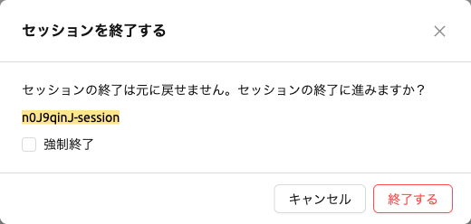

## アイドル状態チェック

Backend.AIは、コンピュートセッションの自動ガベージコレクションのために、
3種類の非アクティブ（アイドル）基準をサポートしています。
最大セッション寿命、ネットワークアイドルタイムアウト、利用率チェッカーです。

セッション終了の基準は、セッション詳細パネルの「アイドル状態検査」セクションで確認できます。

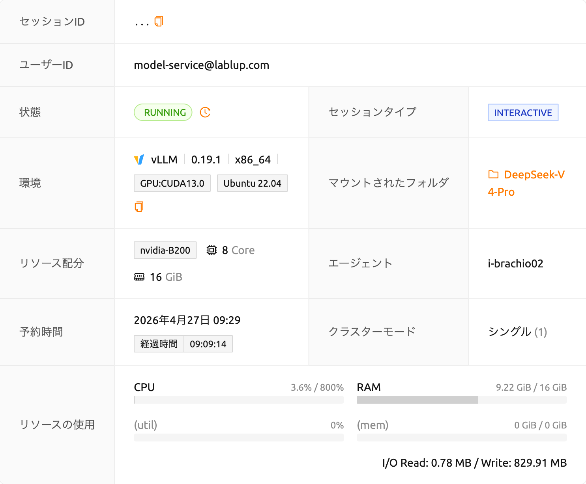

各アイドルチェッカーの意味は次のとおりで、アイドル状態検査セクションの情報（i）ボタンをクリックすると、
より詳細な説明を確認できます。

- 最大セッション寿命: 作成からこの時間が経過したセッションを強制終了します。
  これにより、セッションが無限に実行されることを防ぎます。
- ネットワークアイドルタイムアウト: この時間の間、ユーザー（ブラウザまたはWebアプリ）と
  データのやり取りがないセッションを強制終了します。
  ユーザーとコンピュートセッション間のトラフィックは、ユーザーがターミナルやJupyterなどのアプリと
  キーボード入力やJupyterセル作成などで対話する際に継続的に発生します。
  一定期間対話がない場合、ガベージコレクションの条件が満たされます。
  コンピュートセッション内でジョブを実行しているプロセスがあっても、
  ユーザーの対話がなければ終了の対象となります。
- 利用率チェッカー: コンピュートセッションに割り当てられたリソースは、
  そのリソースの使用状況に基づいて回収されます。
  削除の判断は、次の2つの要素に基づいて行われます。

  - 猶予期間: 利用率アイドルチェッカーが非アクティブな期間です。
    使用率が低くても、この期間中はコンピュートセッションは終了されません。
    ただし、猶予期間が終了すると、設定されたアイドルタイムアウト期間中の平均利用率が
    しきい値を下回った場合、システムはいつでもセッションを終了できます。
    猶予期間は、単に終了が発生しないことが保証される期間に過ぎません。
    これは主に、使用率の低いGPUリソースを効率的に管理するための措置です。
  - 利用率しきい値: コンピュートセッションのリソース利用率が一定期間（アイドルタイムアウト）内に
    設定されたしきい値を超えない場合、そのセッションは自動的に終了されます。
    たとえば、アクセラレータ利用率のしきい値が1%に設定されていて、アイドルタイムアウト期間中の
    コンピュートセッションの利用率が1%未満であれば、終了の対象となります。
    値が空のリソースは、ガベージコレクションの基準から除外されます。

:::note
猶予期間が経過した後は、利用率が低い状態が続く場合、いつでもセッションが終了される可能性があります。
リソースを短時間使用しても、猶予期間は延長されません。
直近のアイドルタイムアウト期間における平均利用率のみが考慮されます。
:::

利用率チェッカーにマウスを合わせると、利用率としきい値を示すツールチップが表示されます。
現在の利用率がしきい値に近づくにつれて（リソース利用率が低いことを示します）、
テキストの色が黄色、赤の順に変化します。

:::note
環境設定によっては、利用率チェッカーのツールチップに表示されるアイドルチェッカーと
リソース種別が異なる場合があります。
:::

## セッション作成前に環境変数を追加する方法

より便利な作業環境をユーザーに提供するために、Backend.AIはセッション起動時の環境変数設定をサポートしています。
この機能では、環境変数設定ダイアログに変数名と値を入力することで、
ユーザーは`PATH`などの任意の環境変数を追加できます。

環境変数を追加するには、「＋ 環境変数を追加」ボタンをクリックするだけです。
また、削除したい行の「-」ボタンをクリックすることで、環境変数を削除できます。

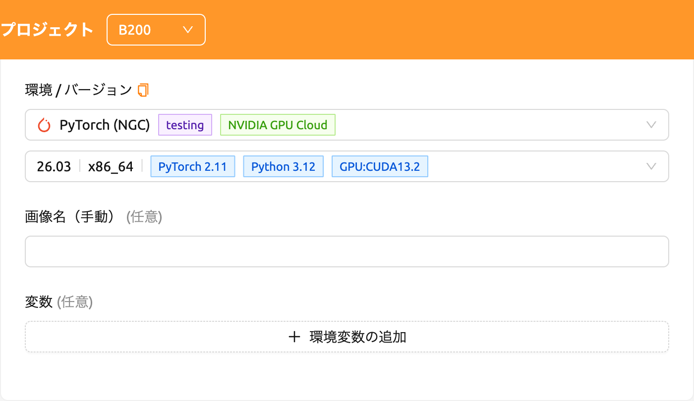

入力フィールドの同じ行に変数名と値を記述できます。

## セッション作成前に事前オープンポートを追加する方法

Backend.AIは、コンテナ起動時の事前開放ポート設定をサポートしています。
この機能を使用すると、サービングポートを公開したい場合に別途イメージをビルドする必要はありません。

事前開放ポートを追加するには、カンマ（,）またはスペースで区切って複数の値を入力するだけです。

セッション作成ページの4ページ目では、ユーザーは記述した事前開放ポートを追加、更新、削除できます。
詳細については、「案内(ヘルプ)」ボタン（?）をクリックしてください。

入力フィールドに1024～65535のポート番号を入力し、「Enter」を押します。
ユーザーは複数のポートをカンマ（,）で区切って指定できます。
設定した事前開放ポートは、セッションのアプリランチャーで確認できます。

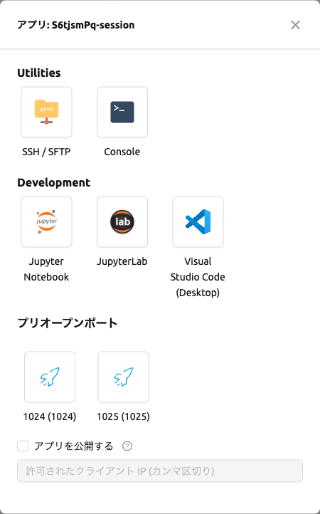

:::note
事前開放ポートは**コンテナ内部のポート**です。したがって、他のアプリとは異なり、
ユーザーがセッションのアプリランチャーで事前開放ポートをクリックすると、空白のページが表示されます。
使用する前に、各ポートにサーバーをバインドしてください。
:::

## セッションコミットを保存する

Backend.AIは24.03から「セッションをイメージに変換」機能をサポートしています。
`RUNNING`状態のセッションをコミットすると、セッションの現在の状態が新しいイメージとして保存されます。
セッション詳細パネルで「コミットする」ボタン（4番目のアイコン）をクリックすると、
セッション情報が表示されたダイアログが開きます。
セッション名を入力すると、ユーザーはセッションを新しいイメージに変換できます。
セッション名は4～32文字で、英数字、ハイフン（`-`）、アンダースコア（`_`）のみ使用できます。

入力フィールドにセッション名を入力した後、「PUSH SESSION TO CUSTOMIZED IMAGE」ボタンをクリックします。
この方法で作成したカスタマイズイメージは、今後のセッション作成時に使用できます。
ただし、イメージコミットのためにコンテナにマウントされたディレクトリは外部リソースと見なされ、
最終イメージには含まれません。`/home/work`はマウントフォルダ（スクラッチディレクトリ）であるため、
含まれない点に注意してください。

:::note
現在、Backend.AIはセッションが`INTERACTIVE`モードの場合にのみ「セッションをイメージに変換」機能をサポートしています。
予期しないエラーを防ぐため、コミット処理中はセッションを終了できない場合があります。
進行中の処理を停止するには、該当セッションを確認して強制終了してください。
:::

:::note
「セッションをイメージに変換」の回数は、ユーザーリソースポリシーによって制限される場合があります。
この場合、[既存のカスタマイズイメージを削除](#delete-customized-image)してから再度お試しください。
それでも問題が解決しない場合は、管理者にお問い合わせください。
:::

## 進行中のセッションの変換済みイメージを活用する

進行中のセッションをイメージに変換すると、新しいセッションを作成する際に、
セッションランチャーの実行環境からこのイメージを選択できます。
このイメージは他のユーザーには公開されず、現在のセッションの状態をそのまま引き続き使用したい場合に便利です。
変換されたイメージには`Customized<セッション名>`というタグが付けられます。

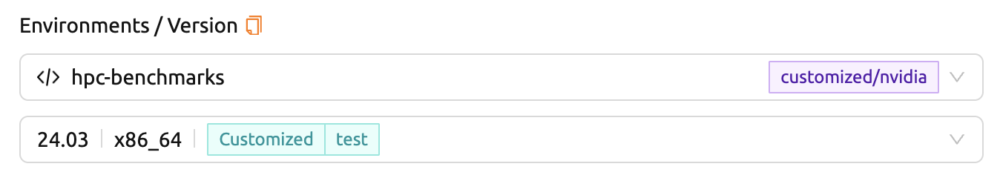

今後のセッション作成のために実行環境名を手動で入力するには、コピーアイコンをクリックしてください。

## ウェブターミナルの高度な使い方

ウェブベースのターミナルには、内部的に[tmux](https://github.com/tmux/tmux/wiki)というユーティリティが組み込まれています。
tmuxは、1つのシェル内で複数のシェルウィンドウを開くことをサポートするターミナルマルチプレクサーで、
複数のプログラムをフォアグラウンドで同時に実行できるようにします。
tmuxのより強力な機能を活用したい場合は、tmuxの公式ドキュメントや、インターネット上のさまざまな使用例を参照してください。

ここでは、いくつかのシンプルで便利な機能を紹介します。

### ターミナルの内容をコピーする

tmuxには多くの便利な機能がありますが、初めて使用するユーザーにとっては少し戸惑うかもしれません。
特に、tmuxは独自のクリップボードバッファを持っているため、ターミナルの内容をコピーする際、
既定ではtmux内でしか貼り付けできないという問題が発生する場合があります。
さらに、Webブラウザ内のtmuxにユーザーのシステムクリップボードを公開するのは難しく、
ターミナルの内容をユーザーのコンピュータ上の他のプログラムにコピー＆ペーストすることはできません。
いわゆる`Ctrl-C` / `Ctrl-V`はtmuxでは動作しません。

ターミナルの内容をシステムのクリップボードにコピー＆ペーストする必要がある場合、
ユーザーは一時的にtmuxのマウスサポートをオフにすることができます。
まず、`Ctrl-B`キーを押してtmux制御モードに入ります。次に、`:set -g mouse off`と入力して
`Enter`キーを押します（先頭のコロンも入力することに注意してください）。
画面下部のステータスバーで、入力内容を確認できます。
その後、ターミナルから必要なテキストをマウスでドラッグし、`Ctrl-C`または`Cmd-C`（マックの場合）を押して、
ユーザーのコンピュータのクリップボードにコピーします。

マウスサポートをオフにすると、マウスホイールでターミナルの前のページの内容をスクロールできません。
この場合、ユーザーはマウスサポートを再度オンにすることができます。
`Ctrl-B`を押し、今度は`:set -g mouse on`と入力します。これで、マウスホイールでスクロールして
前のページの内容を確認できるようになります。

`Ctrl-B`の後に`:set -g mouse off`または`:set -g mouse on`を覚えておくと、
ウェブターミナルをより便利に使用できます。

:::note
`Ctrl-B`はtmuxの既定の制御モードキーです。ユーザーのホームディレクトリにある`.tmux.conf`を修正して
別の制御キーを設定している場合は、`Ctrl-B`の代わりに設定したキーの組み合わせを押してください。
:::

:::note
ウィンドウズ環境では、次のショートカットを参照してください。

* コピー: `Shift`を押しながら、マウスの右ボタンをクリックしてドラッグします。
* ペースト: `Ctrl-Shift-V`を押します。
:::

### キーボードを使ってターミナルの履歴を確認する

ターミナルの内容をコピーしながら、同時にターミナルの以前の内容を確認する方法もあります。
キーボードを使って以前の内容を確認する方法です。
まず`Ctrl-B`をクリックし、次に`Page Up`および/または`Page Down`キーを押します。
検索モードを終了するには、`q`キーを押すだけです。
この方法を使うと、マウスサポートがオフになっている場合でも、ターミナルの履歴内容を確認できます。

### 複数のシェルを起動する

tmuxの主な利点は、1つのターミナルウィンドウで複数のシェルを起動して使用できることです。
`Ctrl-B`キーを押してから`c`を押すと、新しいシェル環境が表示されます。
この時点で前のウィンドウは表示されなくなりますが、終了したわけではありません。
`Ctrl-B`を押してから`w`を押します。現在tmuxで開いているシェルのリストが表示されます。
`0:`で始まるシェルが最初のシェル環境で、`1:`で始まるシェルは今作成したシェルです。
ユーザーは上下キーでシェル間を移動できます。カーソルを`0:`のシェルに置き、
Enterキーを押して選択します。

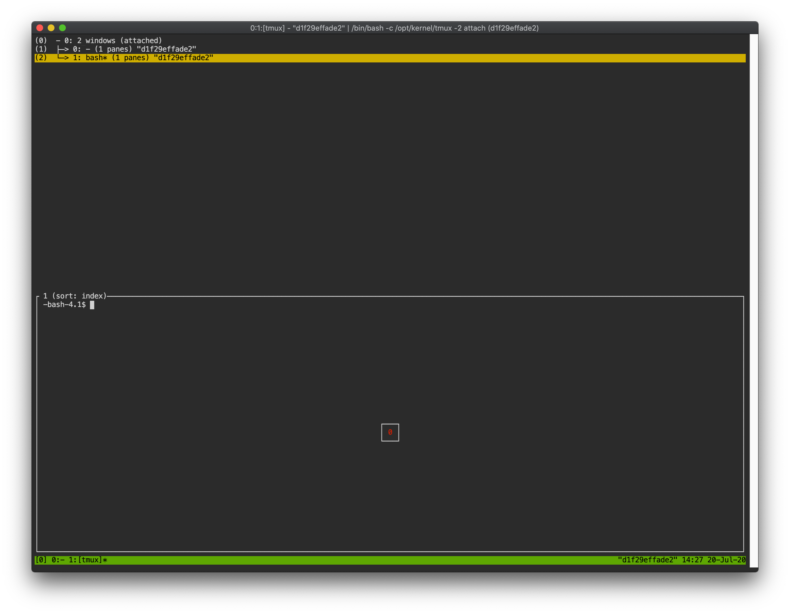

このように、ユーザーはウェブターミナル内で複数のシェル環境を使用できます。
現在のシェルを終了するには、`exit`コマンドを入力するか、
`Ctrl-B x`キーを押してから`y`と入力します。

まとめると次のとおりです。

- `Ctrl-B c`: 新しいtmuxシェルを作成する
- `Ctrl-B w`: 現在のtmuxシェルを照会して移動する
- `exit`または`Ctrl-B x`: 現在のシェルを終了する

上記のコマンドを組み合わせることで、ユーザーは複数のシェル上でさまざまなタスクを同時に実行できます。