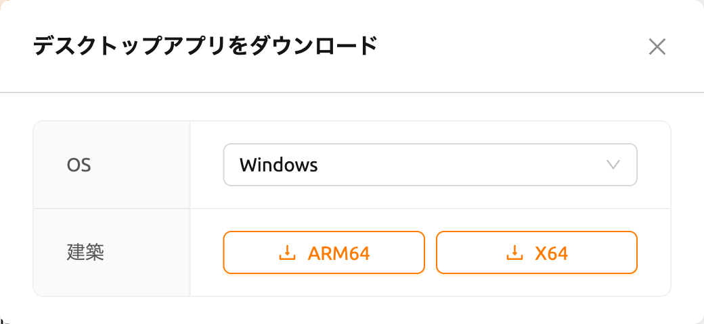
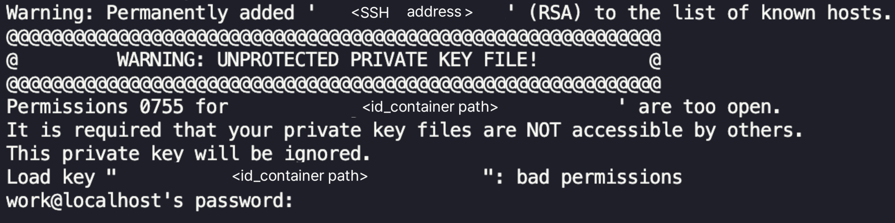
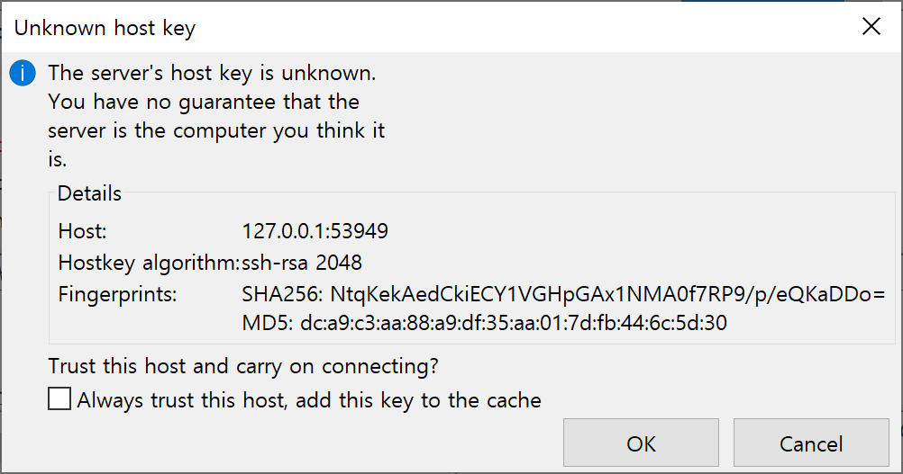
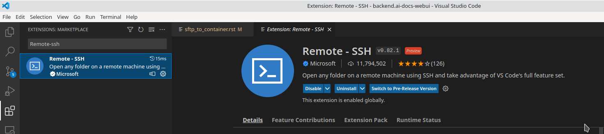
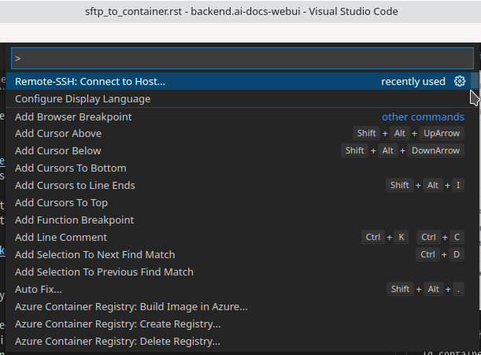
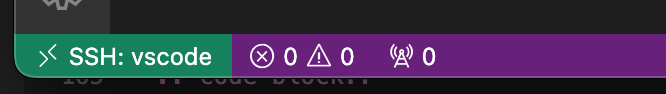
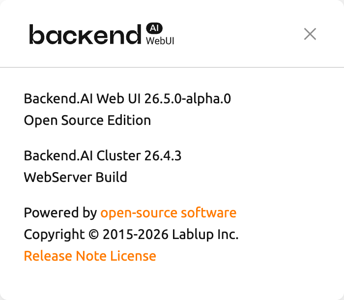

<a id="ssh-sftp-container"></a>

# SSH/SFTP によるコンピュートセッションへの接続

Backend.AIは、作成したコンピュートセッション（コンテナ）へのSSH/SFTP接続をサポートしています。このセクションでは、その方法を学びます。

:::note
24.03バージョンから、SSH/SFTP接続機能はWebブラウザとWebUIデスクトップアプリケーションの両方で利用できます。
23.09以下のバージョンでは、WebUIデスクトップアプリを使用する必要があります。
デスクトップアプリは、サマリーページのパネルからダウンロードできます。このパネルを使用すると、
互換性のあるバージョンが自動的にダウンロードされます。



https://github.com/lablup/backend.ai-webui/releases からもアプリをダウンロードできます。
この場合は、互換性のあるバージョンのWeb-UIをダウンロードするようにしてください。
Web-UIのバージョンは、GUI右上の環境設定メニューにある「About Backend.AI」サブメニューを
クリックすることで確認できます。
:::


<a id="for-linux-mac"></a>

## Linux / マック 用

まず、計算セッションを作成し、コントロール内のアプリアイコン（最初のボタン）をクリックし、その後にSSH/SFTPアイコンをクリックします。すると、コンテナ内部からのSSH/SFTPアクセスを許可するデーモンが起動し、Web-UIアプリはローカルプロキシサービスを通じてデーモンと対話します。


:::note
SSH/SFTP接続は、SSH/SFTPアイコンをクリックするまで、セッションに対して確立できません。Web-UIアプリを閉じて再度起動すると、ローカルプロキシとWeb-UIアプリ間の接続が初期化されるため、再度SSH/SFTPアイコンをクリックする必要があります。
:::

次に、SSH/SFTP接続情報が記載されたダイアログが表示されます。
SFTP URLに記載されたアドレス（特に割り当てられたポート番号）を覚えておき、
ダウンロードリンクをクリックして、ローカルマシンに`id_container`ファイルを保存します。
このファイルは、自動生成されたSSH秘密鍵です。
リンクを使用する代わりに、ウェブターミナルやJupyter Notebookを使用して、
`/home/work/`配下にある`id_container`ファイルをダウンロードすることもできます。
自動生成されたSSH鍵は、新しいセッションが作成されたときに変更される可能性があります。
その場合は、再度ダウンロードする必要があります。


ダウンロードしたSSH秘密鍵でコンピュートセッションにSSH接続するには、
シェル環境で次のコマンドを実行します。
`-i`オプションの後にダウンロードした`id_container`ファイルのパスを、
`-p`オプションの後に割り当てられたポート番号を記述する必要があります。
コンピュートセッション内のユーザーは通常`work`に設定されていますが、
セッションで他のアカウントを使用している場合は、`work@127.0.0.1`の`work`の部分を
実際のセッションアカウントに変更する必要があります。
コマンドを正しく実行すると、コンピュートセッションへのSSH接続が確立され、
コンテナのシェル環境が表示されます。

```shellsession
$ ssh \
    -i ~/.ssh/id_container -p 30722 \
    -o StrictHostKeyChecking=no \
    -o UserKnownHostsFile=/dev/null \
    work@127.0.0.1
Warning: Permanently added '[127.0.0.1]:30722' (RSA) to the list of known hosts.
f310e8dbce83:~$
```

SFTPで接続する方法もほぼ同じです。SFTPクライアントを実行し、公開鍵ベースの接続方法を設定した後、
SSH秘密鍵として`id_container`を指定するだけです。
各FTPクライアントによって設定方法が異なる場合があるため、詳細は各FTPクライアントのマニュアルを参照してください。


:::note
SSH/SFTP接続ポート番号は、セッションが作成されるたびにランダムに割り当てられます。
特定のSSH/SFTPポート番号を使用したい場合は、ユーザー設定メニューの「Preferred SSH Port」フィールドに
ポート番号を入力できます。
コンピュートセッション内の他のサービスとの衝突を避けるため、10000～65000のポート番号を指定することをお勧めします。
ただし、2つ以上のコンピュートセッションから同時にSSH/SFTP接続が行われた場合、
2番目のSSH/SFTP接続では指定されたポートを使用できないため（最初のSSH/SFTP接続が既に使用しているため）、
ランダムなポート番号が割り当てられます。
:::

:::note
`id_container`の代わりに独自のSSH鍵ペアを使用したい場合は、`.ssh`という名前のユーザータイプのフォルダを作成します。
そのフォルダに`authorized_keys`ファイルを作成し、SSH公開鍵の内容を追記すると、
コンピュートセッション作成後に`id_container`をダウンロードすることなく、
独自のSSH秘密鍵でSSH/SFTP接続が可能になります。
:::

:::note
次のような警告メッセージが表示された場合は、`id_container`のパーミッションを600に変更してから再度お試しください。
（`chmod 600 <id_containerのパス>`）


:::


<a id="for-windows-filezilla"></a>

## Windows / FileZilla 用

Backend.AI Web-UIアプリは、OpenSSHベースの公開鍵接続（RSA2048）をサポートしています。
Windows上でPuTTYなどのクライアントを使用してアクセスするには、
PuTTYgenなどのプログラムを使用して秘密鍵を`ppk`ファイルに変換する必要があります。
変換方法については、次のリンクを参照してください:
https://wiki.filezilla-project.org/Howto 。
本セクションでは、わかりやすく説明するために、WindowsでFileZillaクライアントを使用して
SFTPに接続する方法を紹介します。

Linux/Macでの接続方法を参考に、コンピュートセッションを作成し、接続ポートを確認して、
`id_container`をダウンロードします。`id_container`はOpenSSHベースの鍵のため、
Windows専用またはppk形式の鍵のみをサポートするクライアントを使用する場合は、変換が必要です。
ここでは、PuTTYと共にインストールされるPuTTYgenプログラムを使用して変換します。
PuTTYgenを実行した後、Conversionsメニューの「import key」をクリックします。
ファイルオープンダイアログで、ダウンロードした`id_container`ファイルを選択します。
PuTTYgenの「Save private key」ボタンをクリックし、`id_container.ppk`という名前でファイルを保存します。


FileZillaクライアントを起動した後、「Settings-Connection-SFTP」に移動し、
鍵ファイル`id_container.ppk`（OpenSSHをサポートするクライアントの場合は`id_container`）を登録します。


サイトマネージャーを開き、新しいサイトを作成し、次のように接続情報を入力します。


コンテナに初めて接続する際、次のような確認ポップアップが表示される場合があります。
「OK」ボタンをクリックしてホスト鍵を保存します。



しばらくすると、次のように接続が確立されたことが確認できます。
このSFTP接続を使用して、`/home/work/`やその他のマウントされたストレージフォルダに
大容量のファイルを転送できるようになります。


<a id="for-visual-studio-code"></a>

## Visual Studio Code 用

Backend.AIは、コンピュートセッションへのSSH/SFTP接続を通じて、
ローカルのVisual Studio Codeで開発することをサポートしています。
接続が完了すると、コンピュートセッション上の任意の場所にあるファイルやフォルダを操作できます。
このセクションでは、その方法について学びます。

まず、Visual Studio CodeとRemote Development拡張機能パックをインストールする必要があります。

リンク: https://aka.ms/vscode-remote/download/extension



拡張機能をインストールした後、コンピュートセッションのSSH接続を設定します。
VSCode Remote Connectionダイアログで、コピーアイコンボタンをクリックして
Visual Studio Codeのリモート用SSHパスワードをコピーします。また、ポート番号も覚えておきます。


次に、SSH configファイルを設定します。`~/.ssh/config`ファイル（Linux/Macの場合）または
`C:\Users\[ユーザー名]\.ssh\config`（Windowsの場合）を編集し、次のブロックを追加します。
便宜上、ホスト名を`bai-vscode`に設定します。任意のエイリアスに変更可能です。

```
Host bai-vscode
User work
Hostname 127.0.0.1
# 前に控えておいたポート番号を入力する
Port 49335
StrictHostKeyChecking no
UserKnownHostsFile /dev/null
```

次に、Visual Studio Codeで`View`メニューから`Command Palette...`を選択します。


Visual Studio Codeは、接続先のホストのタイプを自動的に検出します。
`Remote-SSH: Connect to Host...`を選択しましょう。



`.ssh/config`内のホストのリストが表示されます。接続するホストを選択してください。
ここでは`vscode`を選択します。


ホスト名を選択すると、リモートのコンピュートセッションにアクセスします。
接続が完了すると、空のウィンドウが表示されます。ステータスバーで、
どのホストに接続しているかをいつでも確認できます。



その後は、いつものように`File > Open...`または`File > Open Workspace...`メニューから、
リモートホスト上の任意のフォルダやワークスペースを開くことができます。


<a id="establish-ssh-connection-with-backendai-client-package"></a>

## Backend.AI クライアントパッケージでSSH接続を設定する

本セクションでは、グラフィカルユーザーインターフェイス（GUI）が使用できない環境で
コンピュートセッションへSSH接続を確立する方法について説明します。

通常、コンピュートセッション（コンテナ）を実行するGPUノードには、外部から直接アクセスできません。
したがって、コンピュートセッションへSSHまたはSFTP接続を確立するには、ユーザーとセッション間の接続を
中継するトンネルを作成するローカルプロキシを起動する必要があります。
Backend.AIクライアントパッケージを使用すると、このプロセスを比較的簡単に設定できます。

<a id="prepare-backendai-client-package"></a>

### Backend.AI クライアントパッケージの準備

<a id="prepare-with-docker-image"></a>

#### Dockerイメージで準備する

Backend.AIクライアントパッケージは、Dockerイメージとして提供されています。
次のコマンドでDocker Hubからイメージを取得できます。

```bash
docker pull lablup/backend.ai-client

# 特定のバージョンを使用したい場合は、次のコマンドでイメージを取得できます:
docker pull lablup/backend.ai-client:${VERSION}
```

Backend.AIサーバーのバージョンは、Web UI右上の人物アイコンをクリックすると表示される
「About Backend.AI」メニューで確認できます。



次のコマンドでDockerイメージを実行します。

```bash
docker run --rm -it lablup/backend.ai-client bash
```

コンテナ内で`backend.ai`コマンドが利用可能かどうかを確認します。利用可能な場合は、
ヘルプメッセージが表示されます。

```bash
backend.ai
```

<a id="prepare-directly-from-host-with-a-python-virtual-environment"></a>

#### Python仮想環境でホストから直接準備する

Dockerが使用できない、または使用したくない場合は、ホストマシンに直接Backend.AIクライアント
パッケージをインストールできます。前提条件は次のとおりです。

- 必要なPythonのバージョンは、Backend.AIクライアントのバージョンによって異なる場合があります。
  互換性マトリクスは https://github.com/lablup/backend.ai#python-version-compatibility で確認できます。
- `clang`コンパイラが必要になる場合があります。
- `indygreg`のPythonバイナリを使用する場合は、`zstd`パッケージが必要になる場合があります。

パッケージのインストールには、Python仮想環境を使用することをお勧めします。
一つの方法として、`indygreg`リポジトリの静的ビルドされたPythonバイナリを使用する方法があります。
次のページからローカルマシンのアーキテクチャに合ったバイナリをダウンロードして解凍します。

- https://github.com/indygreg/python-build-standalone/releases
- 一般的なx86ベースのUbuntu環境を使用している場合、次のようにダウンロードして展開できます。

  ```bash
  $ wget https://github.com/indygreg/python-build-standalone/releases/download/20240224/cpython-3.11.8+20240224-x86_64-unknown-linux-gnu-pgo-full.tar.zst
  $ tar -I unzstd -xvf *.tar.zst
  ```

バイナリを解凍すると、現在のディレクトリの下に`python`ディレクトリが作成されます。
次のコマンドを実行することで、ダウンロードしたPythonのバージョンを確認できます。

```shellsession
$ ./python/install/bin/python3 -V
Python 3.11.8
```

システム上の他のPython環境に影響を与えないよう、別のPython仮想環境を作成することをお勧めします。
次のコマンドを実行すると、`.venv`ディレクトリの下にPython仮想環境が作成されます。

```bash
./python/install/bin/python3 -m venv .venv
```

仮想環境をアクティブにします。新しい仮想環境がアクティブになっているため、
`pip list`コマンドを実行すると`pip`と`setuptools`パッケージのみがインストールされていることが確認できます。

```shellsession
$ source .venv/bin/activate
(.venv) $ pip list
Package    Version
---------- -------
pip        24.0
setuptools 65.5.0
```

次に、Backend.AIクライアントパッケージをインストールします。サーバーのバージョンに合わせて
クライアントパッケージをインストールします。ここでは、バージョンが23.09であると仮定します。
`netifaces`パッケージでインストール関連のエラーが発生する場合は、`pip`と`setuptools`のバージョンを
下げる必要があるかもしれません。`backend.ai`コマンドが利用可能かどうかを確認します。

```bash
(.venv) $ pip install -U pip==24.0 && pip install -U setuptools==65.5.0
(.venv) $ pip install -U backend.ai-client~=23.09
(.venv) $ backend.ai
```

<a id="setting-up-server-connection-for-cli"></a>

### CLIのサーバー接続設定

`.env`ファイルを作成し、次の内容を追加します。`webserver-url`には、ブラウザからWeb UIサービスに
接続するときに使用するアドレスと同じものを使用します。

```bash
BACKEND_ENDPOINT_TYPE=session
BACKEND_ENDPOINT=<webserver-url>
```

次のCLIコマンドを実行してサーバーに接続します。ブラウザからログインする際に使用する
メールアドレスとパスワードを入力します。問題がなければ、`Login succeeded`というメッセージが表示されます。

```shellsession
$ backend.ai login
User ID: myuser@test.com
Password:
✓ Login succeeded.
```

<a id="sshscp-connection-to-computation-session"></a>

### コンピュートセッションへのSSH/SCP接続

ブラウザから、データをコピーしたいフォルダをマウントしてコンピュートセッションを作成します。
CLIを使用してセッションを作成することも可能ですが、便宜上、ブラウザから作成したと仮定します。
作成したコンピュートセッションの名前を覚えておきます。ここでは`ibnFmWim-session`と仮定します。

単純にSSH接続したい場合は、次のコマンドを実行します。

```shellsession
$ backend.ai ssh ibnFmWim-session
∙ running a temporary sshd proxy at localhost:9922 ...
work@main1[ibnFmWim-session]:~$
```

SSH鍵ファイルをダウンロードして、明示的にsshコマンドを実行したい場合は、
まず次のコマンドを実行して、ローカルマシンからコンピュートセッションへの接続を中継する
ローカルプロキシサービスを起動する必要があります。`-b`オプションを使用することで、
ローカルマシンで使用するポート（9922）を指定できます。

```shellsession
$ backend.ai app ibnFmWim-session sshd -b 9922
∙ A local proxy to the application "sshd" provided by the session "ibnFmWim-session" is available at:
tcp://127.0.0.1:9922
```

ローカルマシンで別のターミナルウィンドウを開きます。`.env`ファイルがある作業ディレクトリに移動し、
コンピュートセッションで自動生成されたSSH鍵をダウンロードします。

```shellsession
$ source .venv/bin/activate  # 別のターミナルのため、Python仮想環境を再度アクティブにします
$ backend.ai session download ibnFmWim-session id_container
Downloading files: 3.58kbytes [00:00, 352kbytes/s]
✓ Downloaded to /*/client.
```

ダウンロードした鍵を使用して、次のようにSSH接続できます。ローカルプロキシをポート9922で起動したため、
接続先アドレスは127.0.0.1、ポートは9922にする必要があります。接続には、ユーザーアカウント`work`を使用します。

```shellsession
$ ssh \
-o StrictHostKeyChecking=no \
-o UserKnownHostsFile=/dev/null \
-i ./id_container \
-p 9922 \
work@127.0.0.1
Warning: Permanently added '[127.0.0.1]:9922' (RSA) to the list of known hosts.
work@
```

同様に、`scp`コマンドを使用してファイルをコピーすることもできます。
この場合は、セッションが終了した後もファイルを保持するために、コンピュートセッション内の
マウントされたフォルダにファイルをコピーする必要があります。

```shellsession
$ scp \
-o StrictHostKeyChecking=no \
-o UserKnownHostsFile=/dev/null \
-i ./id_container \
-P 9922 \
test_file.xlsx work@127.0.0.1:/home/work/myfolder/
Warning: Permanently added '[127.0.0.1]:9922' (RSA) to the list of known hosts.
test_file.xlsx
```

すべての作業が完了したら、最初のターミナルで`Ctrl-C`を押してローカルプロキシサービスをキャンセルします。