# ストレージフォルダの共有とアクセス制御

ストレージフォルダの内容を他のユーザーやプロジェクトメンバーと共有して共同作業を行う必要があるかもしれません。この目的のために、Backend.AIは柔軟なフォルダ共有機能を提供します。

## 他のユーザーとストレージフォルダを共有する

個人のストレージフォルダを他のユーザーと共有する方法を学びましょう。まず、ユーザーAのアカウントにログインし、データページに移動します。いくつかのフォルダがあり、`tests`というフォルダをユーザーBに共有したいとします。

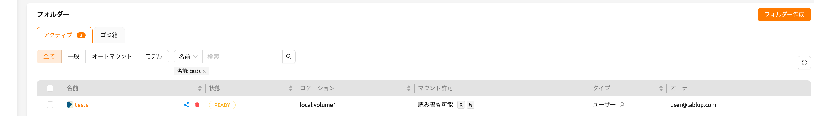

`tests`フォルダ内には`hello.txt`や`myfolder`などのファイルやディレクトリがあります。

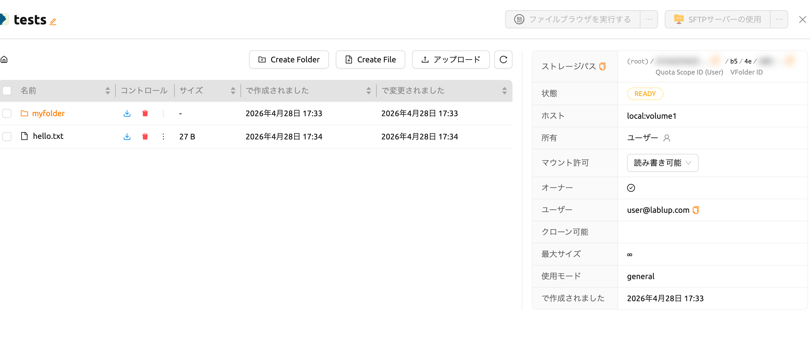

ユーザーBのアカウントにログインした際、`tests`フォルダがリストに表示されないことを確認します。

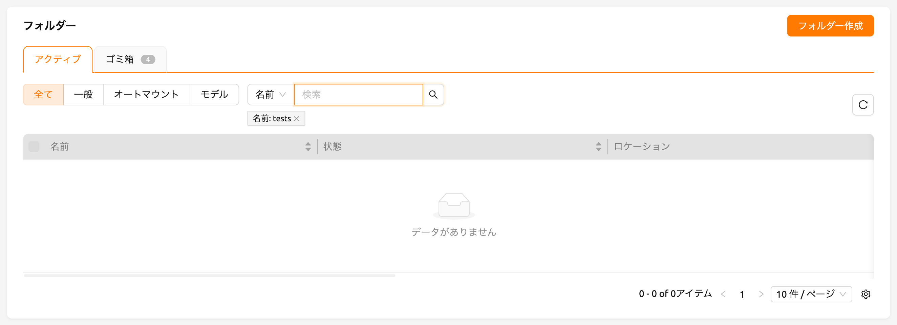

:::note
ユーザーBのアカウントに`tests`という名前のフォルダが既に存在する場合、ユーザーAの`tests`フォルダをユーザーBと共有することはできません。
:::

ユーザーAのアカウントに戻り、リストの`tests`フォルダの制御列にある「共有」ボタンをクリックします。

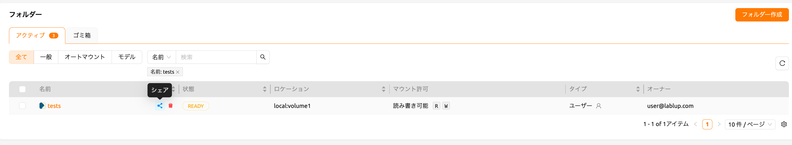

モーダルの「ユーザーを招待」セクションでユーザーBのメールアドレスを入力し、希望する権限レベルを選択します。「読み取り専用」を選択すると、ユーザーBはフォルダを閲覧できますが変更はできません。「読み書き可能」を選択すると、ユーザーBはフォルダの閲覧と変更の両方が可能になります。

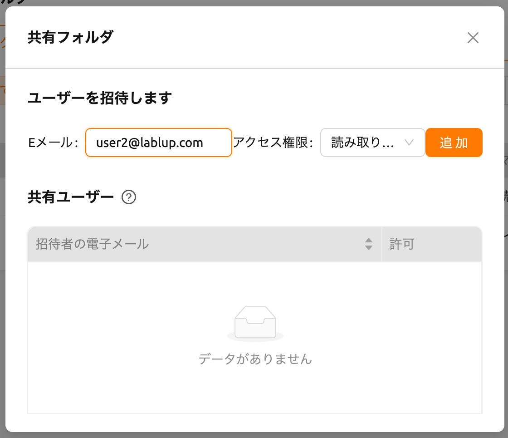

ユーザーBのアカウントに切り替え、データページに移動します。ストレージステータスパネルで招待されたフォルダの数を確認できます。

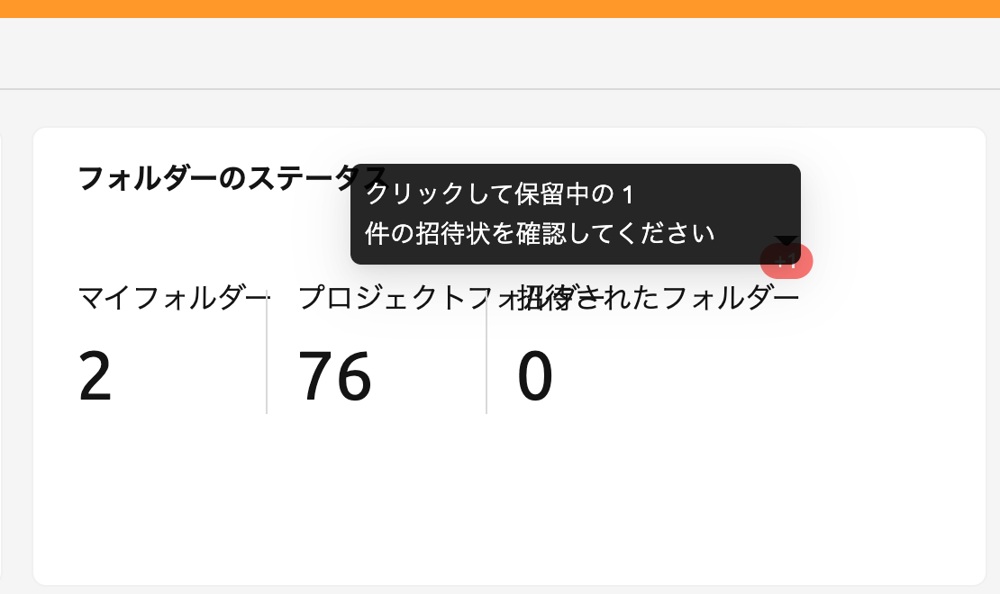

バッジをクリックすると招待リストのモーダルが開き、保留中のフォルダ招待を承諾または辞退できます。

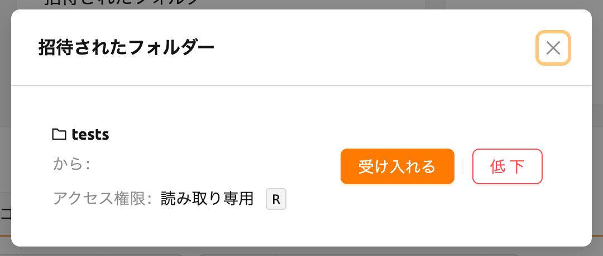

データページに移動し、`tests`フォルダがリストに表示されていることを確認します。リストに表示されない場合は、ブラウザページを更新してみてください。招待を承諾したので、ユーザーBのアカウントでユーザーAの`tests`フォルダの内容を確認できるようになりました。ユーザーBが作成したフォルダとは異なり、共有フォルダにはオーナー列にチェックアイコンが表示されません。また、マウント権限列に「読み取り専用」の表示が確認できます。

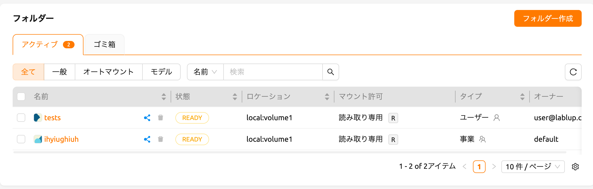

`tests`フォルダの制御パネルにあるフォルダアイコンをクリックして、フォルダ内に移動しましょう。ユーザーAのアカウントで確認した`hello.txt`と`myfolder`を再び確認できます。

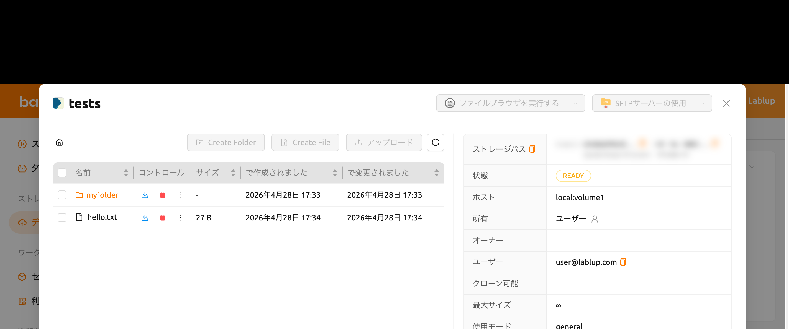

ユーザーBのアカウントでこのストレージフォルダをマウントしてコンピュートセッションを作成してみましょう。

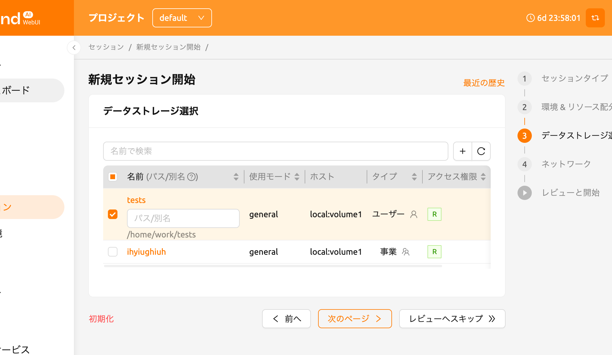

:::note
バージョン24.09以降、Backend.AIはセッションランチャーの改良版（NEO）をデフォルトとして提供しています。以前のセッションランチャーを使用する場合は、[ユーザー設定](#general-tab)セクションを参照してください。使用方法については、次の[リンク](https://webui.docs.backend.ai/en/23.09_a/sessions_all/sessions_all.html)を参照してください。NEOセッションランチャーの詳細については、[セッション作成](#start-a-new-session)を参照してください。
:::

セッションを作成した後、ウェブターミナルを開き、`tests`フォルダがホームフォルダにマウントされていることを確認します。`tests`フォルダの内容は表示されますが、ファイルの作成や削除は許可されません。これは、ユーザーAが読み取り専用で共有したためです。書き込みアクセスを含む形で共有されている場合、ユーザーBは`tests`フォルダ内にファイルを作成できます。

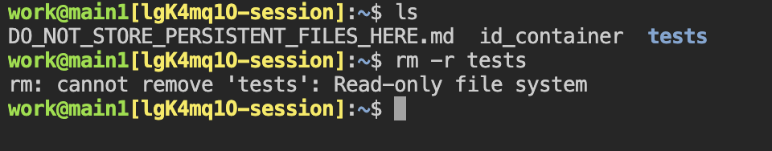

この方法で、Backend.AIのメールアカウントに基づいて他のユーザーと個人のストレージフォルダを共有することができます。

:::note
Backend.AIはプロジェクトメンバーへのプロジェクトフォルダの共有機能も提供しています。
詳細については、[プロジェクトメンバーとプロジェクトストレージフォルダを共有する](#share-project-storage-folders-with-project-members)を参照してください。
:::

## 共有フォルダの権限を調整する

フォルダ共有モーダルから共有ユーザーの権限を変更できます。権限選択をクリックして共有権限を設定します。

- 読み取り専用: 招待されたユーザーはフォルダへの読み取り専用アクセス権を持っています。
- 読み書き可能: 招待されたユーザーはフォルダへの読み書き権限を持っています。ユーザーはフォルダやファイルを削除することはできません。

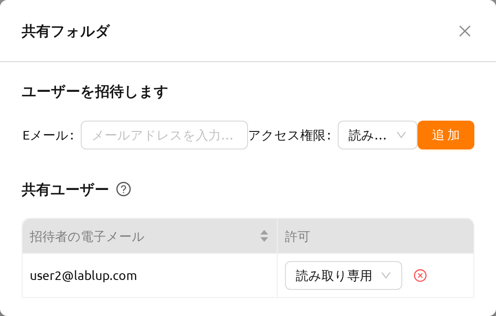

:::note
読み書き可能権限が付与されている場合でも、フォルダ自体の名前変更は所有者のみが行えます。読み書き可能権限にはフォルダの名前変更機能は含まれません。
:::

## フォルダの共有を停止する

招待者としてフォルダの共有を停止するには、ファイルリストを開き、該当フォルダの制御列にある「共有」ボタンをクリックします。権限設定モーダルで、権限セレクターの横にある「共有を停止」ボタンをクリックします。

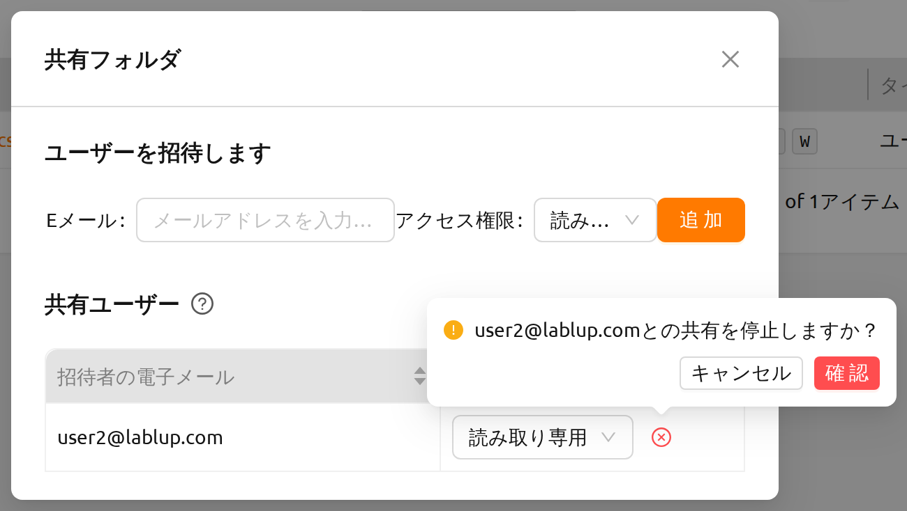

招待されたユーザーとして共有フォルダへのアクセスが不要になった場合は、フォルダリストのフォルダの横にある「共有」ボタンを選択し、「共有フォルダを退出」をクリックしてアクセスを解除します。

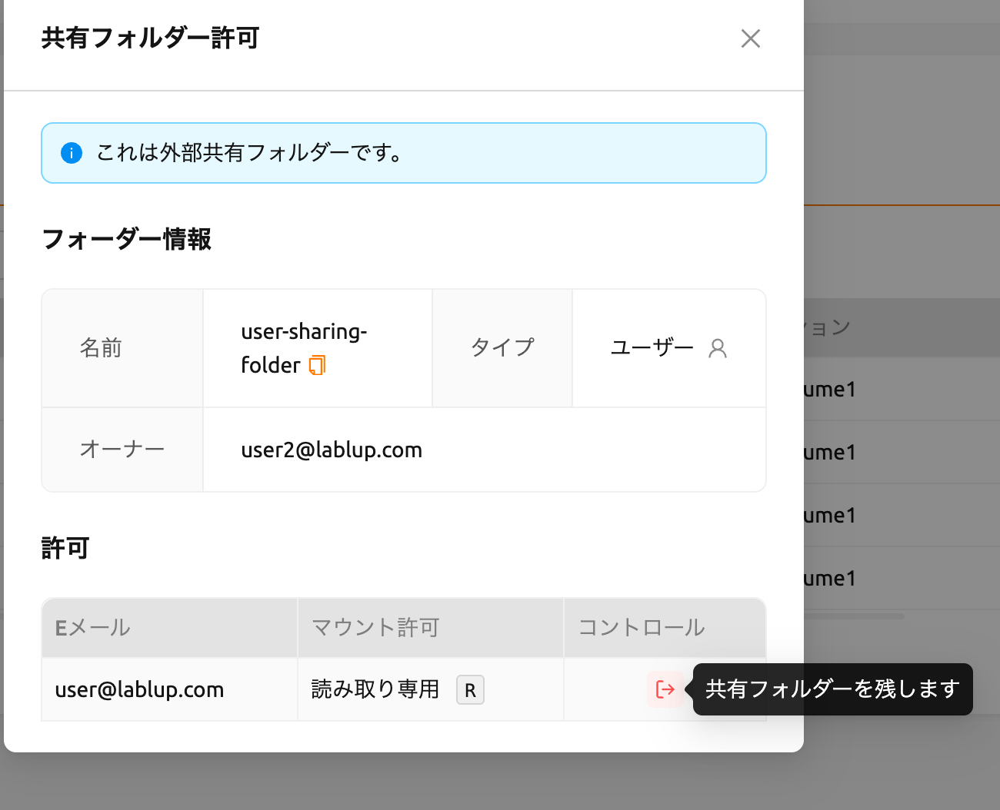
