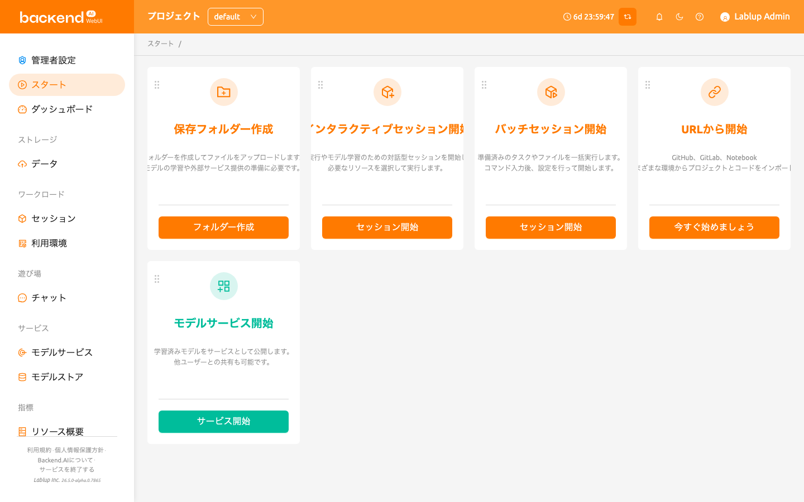
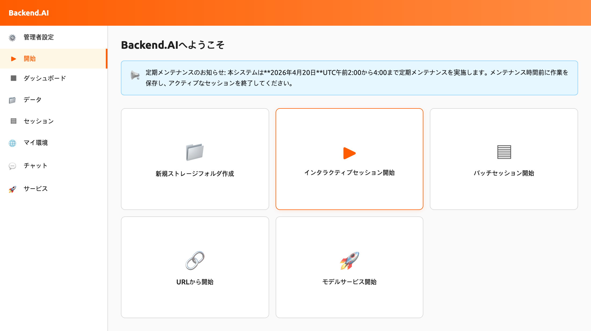
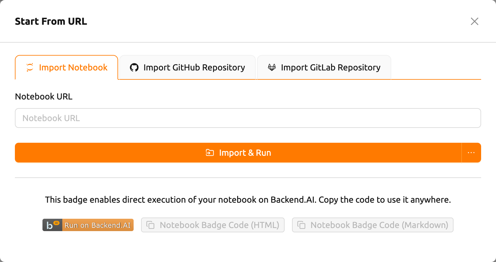
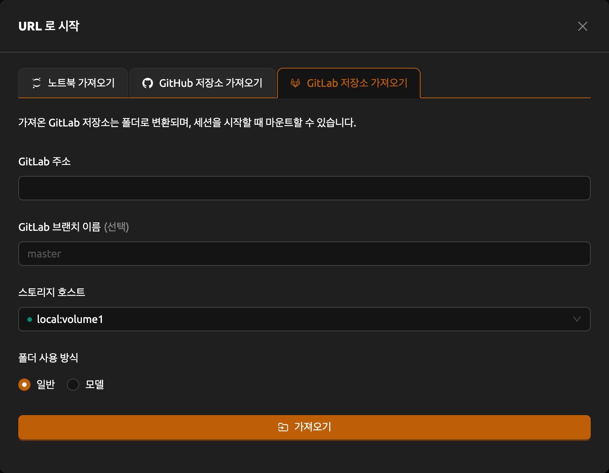

# スタートページ

スタートページでは、よく使うWebUIの機能にアクションカードを通じてすばやく
アクセスできます。各カードは、ストレージフォルダの作成、セッションの起動、
モデルサービスの開始、外部URLからのプロジェクトインポートなど、主要なワークフロー
を表しています。

## お知らせバナー

システム管理者がお知らせを公開している場合、スタートページの上部にバナーが
表示されます。お知らせはMarkdown形式をサポートしており、システムメンテナンス、
アップデート、利用ガイドラインなどの重要な通知が含まれる場合があります。
閉じるアイコンをクリックしてバナーを閉じることができます。

## アクションカード

スタートページにはデフォルトで以下のアクションカードが表示されます：

- **保存フォルダー作成**: ストレージフォルダを作成してファイルをアップロード
  します。モデルの学習や外部サービス提供の準備に必要な最初のステップです。
  ボタンをクリックするとフォルダ作成ダイアログが開きます。
- **インタラクティブセッション開始**: モデル学習のためのセッションを作成します。
  必要な環境とリソースを選択してコードを実行できます。
- **バッチセッション開始**: 準備済みのファイルやスケジュールされたタスクのための
  バッチセッションを作成します。コマンドを入力し、日時を設定して実行します。
- **モデルサービス開始**: 学習済みモデルを他のユーザーと共有するためのモデル
  サービスエンドポイントを作成します。
- **URLから開始**: GitHub、GitLab、Jupyter NotebookなどのさまざまなURL環境から
  プロジェクトとコードをインポートします。

:::note
サーバーの設定状況によって、モデルサービスカードなど一部のカードが利用できない
場合があります。これらの機能をご利用になりたい場合は、システム管理者にお問い
合わせください。
:::

## URLから開始

**URLから開始**カードを使用すると、外部ソースからプロジェクトをインポートして
直接実行できます。カードをクリックすると、3つのタブを持つダイアログが開きます。

### ノートブック取り込み

1. **ノートブックのURL**フィールドにJupyter Notebook URL（`.ipynb`で終わる）を
   入力します
2. **インポート & 実行**をクリックすると、自動的にセッションが作成され、Jupyterで
   ノートブックが開きます

   ボタンの横にあるドロップダウン矢印をクリックして**オプション付きで開始**を
   選択すると、起動前にセッション環境をカスタマイズできます。

:::note
ノートブックはコンピュートセッション内部でダウンロードされる（ブートストラップ
スクリプトが`curl -O <url>`を実行する）ため、入力するURLはセッションから到達可能で
ある必要があります。`localhost`や`127.0.0.1`などのローカルアドレスは、お使いのマシン
ではなくセッションコンテナ自体を指すため利用できません。コンピュートセッションから
到達可能なURLを入力してください。
:::

:::note
ブラウザのポップアップブロッカーをオフにすると、実行中のノートブックウィンドウが
自動的に開きます。セッションを開始するためのリソースが不足している場合、インポート
されたノートブックは実行されません。
:::

タブの下部では、「Run on Backend.AI」バッジコードを生成できます。HTMLまたは
Markdownのバッジコードをコピーして、プロジェクトのドキュメントに直接実行リンクを
埋め込むことができます。

:::note
バッジコードを生成する前にログインしている必要があります。ログインしていない場合
は、まずログインしてから再度お試しください。
:::

### GitHubリポジトリをインポートする

1. **GitHubのURL**フィールドに有効なGitHubリポジトリURLを入力します
2. リポジトリを保存する**ストレージホスト**を選択します
3. 必要に応じて**フォルダ利用モード**（一般またはモデル）を設定します
4. **フォルダに移動**をクリックしてリポジトリを新しいストレージフォルダにクローン
   します

インポートされたリポジトリはストレージフォルダに変換され、セッション開始時に
マウントできます。

### GitLabリポジトリ取り込み

1. **GitLabアドレス**フィールドに有効なGitLabリポジトリURLを入力します
2. 必要に応じて**GitLab ブランチ名**を指定します（デフォルト: `master`）
3. リポジトリを保存する**ストレージホスト**を選択します
4. 必要に応じて**フォルダ利用モード**（一般またはモデル）を設定します
5. **フォルダに移動**をクリックしてリポジトリを新しいストレージフォルダにクローン
   します

## カードレイアウトのカスタマイズ

スタートページのアクションカードはドラッグ＆ドロップで並べ替えることができます。
各カードの左上にあるドラッグハンドルを掴んで、希望の位置に移動できます。

カスタマイズされたカード配置は自動的に保存され、ブラウザセッション間で保持
されます。レイアウトはユーザーごとに保存されるため、各ユーザーが独自の配置を
設定できます。
