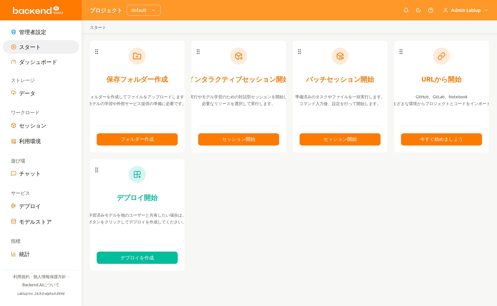
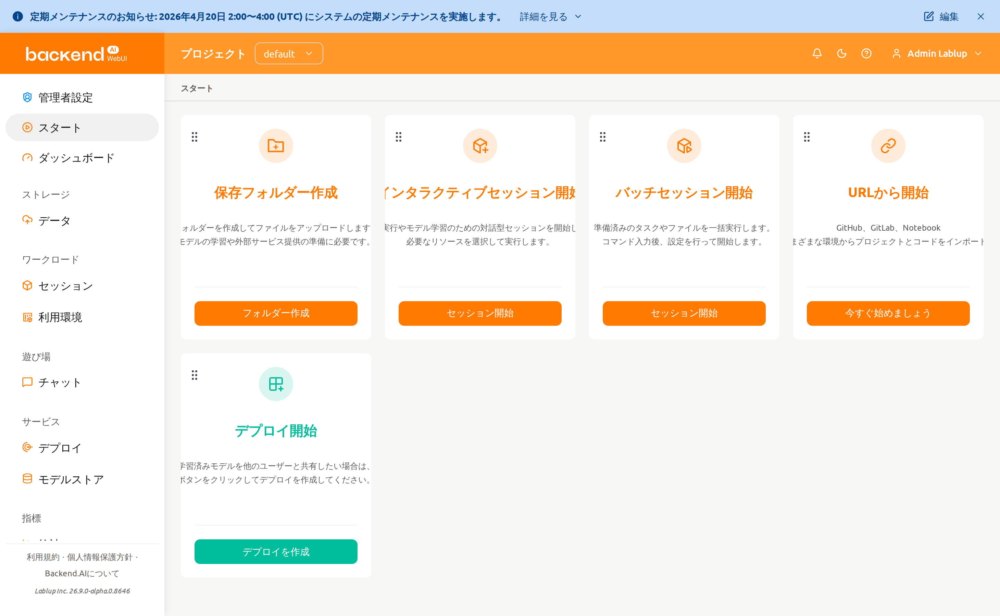
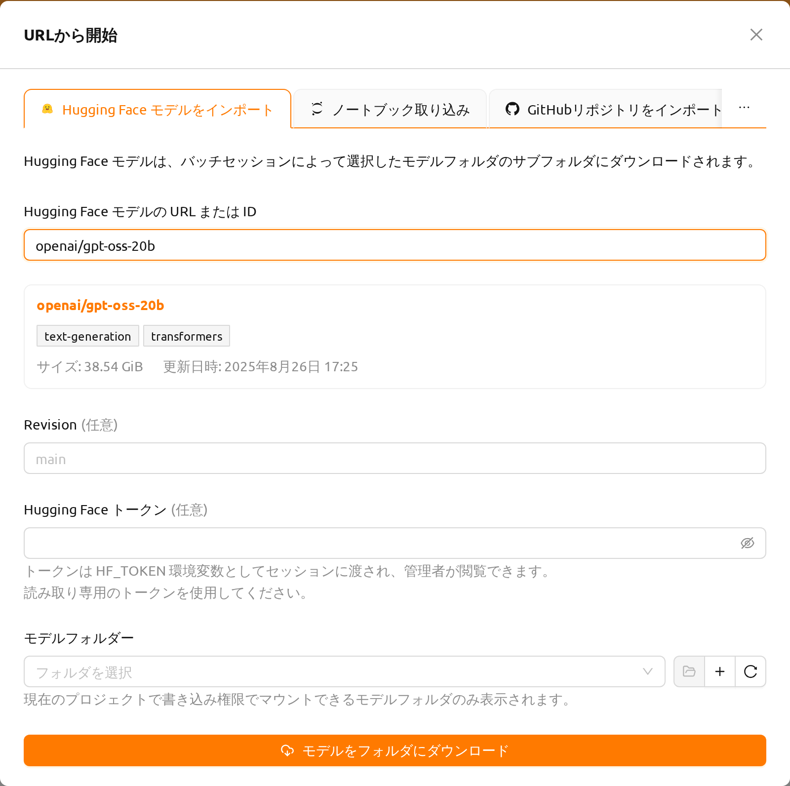

# スタートページ

スタートページでは、よく使うWebUIの機能にアクションカードを通じてすばやく
アクセスできます。各カードは、ストレージフォルダの作成、セッションの起動、
モデルのデプロイ、外部URLからのプロジェクトインポートなど、主要なワークフロー
を表しています。

## お知らせバナー

システム管理者がお知らせを公開している場合、スタートページの上部にバナーが
表示されます。お知らせはMarkdown形式をサポートしており、システムメンテナンス、
アップデート、利用ガイドラインなどの重要な通知が含まれる場合があります。
閉じるアイコンをクリックしてバナーを閉じることができます。

## アクションカード

スタートページにはデフォルトで以下のアクションカードが表示されます：

- **保存フォルダー作成**: ストレージフォルダを作成してファイルをアップロード
  します。モデルの学習や外部サービス提供の準備に必要な最初のステップです。
  ボタンをクリックするとフォルダ作成ダイアログが開きます。
- **インタラクティブセッション開始**: モデル学習のためのセッションを作成します。
  必要な環境とリソースを選択してコードを実行できます。
- **バッチセッション開始**: 準備済みのファイルやスケジュールされたタスクのための
  バッチセッションを作成します。コマンドを入力し、日時を設定して実行します。
- **デプロイ開始**: 学習済みモデルを他のユーザーと共有するためのデプロイを
  作成します。
- **URLから開始**: GitHub、GitLab、Jupyter NotebookなどのさまざまなURL環境から
  プロジェクトとコードをインポートします。

:::note
サーバーの設定状況によって、デプロイカードなど一部のカードが利用できない
場合があります。これらの機能をご利用になりたい場合は、システム管理者にお問い
合わせください。
:::

## URLから開始

**URLから開始**カードを使用すると、外部ソースからプロジェクトをインポートして
直接実行できます。カードをクリックすると、インポート元ごとに
**ノートブック取り込み**、**GitHubリポジトリをインポートする**、
**GitLabリポジトリ取り込み**のタブを持つダイアログが開きます。実験的機能である
Hugging Faceインポートを有効にすると、**Hugging Face モデルをインポート**タブが
追加で表示されます。

### ノートブック取り込み

1. **ノートブックのURL**フィールドにJupyter Notebook URL（`.ipynb`で終わる）を
   入力します
2. **インポート & 実行**をクリックすると、自動的にセッションが作成され、Jupyterで
   ノートブックが開きます

   ボタンの横にあるドロップダウン矢印をクリックして**オプション付きで開始**を
   選択すると、起動前にセッション環境をカスタマイズできます。

:::note
ノートブックはコンピュートセッション内部でダウンロードされる（ブートストラップ
スクリプトが`curl -O <url>`を実行する）ため、入力するURLはセッションから到達可能で
ある必要があります。`localhost`や`127.0.0.1`などのローカルアドレスは、お使いのマシン
ではなくセッションコンテナ自体を指すため利用できません。コンピュートセッションから
到達可能なURLを入力してください。
:::

:::note
ブラウザのポップアップブロッカーをオフにすると、実行中のノートブックウィンドウが
自動的に開きます。セッションを開始するためのリソースが不足している場合、インポート
されたノートブックは実行されません。
:::

タブの下部では、「Run on Backend.AI」バッジコードを生成できます。HTMLまたは
Markdownのバッジコードをコピーして、プロジェクトのドキュメントに直接実行リンクを
埋め込むことができます。

:::note
バッジコードを生成する前にログインしている必要があります。ログインしていない場合
は、まずログインしてから再度お試しください。
:::

### GitHubリポジトリをインポートする

1. **GitHubのURL**フィールドに有効なGitHubリポジトリURLを入力します
2. リポジトリを保存する**ストレージホスト**を選択します
3. 必要に応じて**フォルダ利用モード**（一般またはモデル）を設定します
4. **フォルダに移動**をクリックしてリポジトリを新しいストレージフォルダにクローン
   します

インポートされたリポジトリはストレージフォルダに変換され、セッション開始時に
マウントできます。

### GitLabリポジトリ取り込み

1. **GitLabアドレス**フィールドに有効なGitLabリポジトリURLを入力します
2. 必要に応じて**GitLab ブランチ名**を指定します（デフォルト: `master`）
3. リポジトリを保存する**ストレージホスト**を選択します
4. 必要に応じて**フォルダ利用モード**（一般またはモデル）を設定します
5. **フォルダに移動**をクリックしてリポジトリを新しいストレージフォルダにクローン
   します

### Hugging Face モデルをインポート

**Hugging Face モデルをインポート**タブでは、Hugging Faceのモデルをモデル
フォルダーにダウンロードできます。ダウンロードしたモデルは、あとでコンピュート
セッションにマウントしたり、デプロイとして公開したりできます。

:::warning[実験的機能]
このタブは、[ユーザー設定](#user-settings)ページの**実験的特徴**セクションで
**Hugging Face からインポート**を有効にするまで表示されません。実験的機能は
将来のアップデートで変更または削除される可能性があります。
:::

1. **Hugging Face モデルの URL または ID**フィールドにモデルを入力します。
   `https://huggingface.co/openai/gpt-oss-20b`のようなモデルページのURLと、
   `openai/gpt-oss-20b`のようなモデルIDのどちらも使用できます。データセットや
   スペースなど、モデル以外のページのアドレスは受け付けられません

   フィールドに有効なモデルを入力すると、しばらくしてダイアログが Hugging Face
   でモデルを照会し（確認中はローディング表示が出ます）、インポートを開始する
   前にフィールドの下にプレビューカードを表示します。カードには、Hugging Face
   のモデルページへのリンクになったモデルID、モデルのタスクおよびライブラリの
   タグ、サイズ、更新日時が表示されます

2. 必要に応じて**Revision**にダウンロードするモデルリポジトリのブランチ、タグ、
   またはコミットを入力します。空欄のままにするとデフォルトのリビジョンが
   ダウンロードされます。入力したアドレスにリビジョンが含まれている場合は、その
   リビジョンが使用されます
3. 必要に応じて**Hugging Face トークン**を入力します。アクセスが制限された
   モデルや非公開モデルにはトークンが必要です
4. ダウンロード先の**モデルフォルダー**を選択します。フィールドの下の説明の
   とおり、現在のプロジェクトで書き込み権限でマウントできるモデルフォルダーのみ
   表示されます。ダウンロードセッションがフォルダーに書き込むため、読み取り専用
   でしかマウントできないフォルダーは除外されます。セレクターの横のボタンで、
   選択したフォルダーを開く、新しいモデルフォルダーを作成する、一覧を更新する
   操作ができます。新しいフォルダーを作成するときは、マウント権限を読み取り・
   書き込みに設定してください。読み取り専用のマウント権限で作成したフォルダーは
   ダウンロード先に使用できず、読み取り・書き込み権限でフォルダーを作成するよう
   警告が表示されます
5. **モデルをフォルダにダウンロード**をクリックします

ダイアログが閉じ、ダウンロードを実行するバッチセッションが開始されます。
ダウンロードはそのセッション内部で実行されるため、進行状況はセッションページで
確認できます。セッションが正常に終了するとモデルを利用できます。セッションが
失敗した場合、ダウンロードは完了しておらずモデルは利用できません。

モデルは、選択したフォルダー内にモデル名で作成されたサブフォルダーに保存
されます。たとえば`openai/gpt-oss-20b`は`gpt-oss-20b/`にダウンロードされます。
そのため、1つのモデルフォルダーに複数のモデルを保管できます。

:::warning
トークンはダウンロードセッションに`HF_TOKEN`環境変数として渡され、管理者が閲覧
できます。読み取り専用のトークンを使用してください。
:::

:::note
このタブはモデルフォルダーにダウンロードするため、デプロイ機能が有効な
アカウントでのみ利用できます。サイズの大きいモデルはダウンロードに時間がかかり、
対象フォルダーのストレージ容量を消費します。
:::

## カードレイアウトのカスタマイズ

スタートページのアクションカードはドラッグ＆ドロップで並べ替えることができます。
各カードの左上にあるドラッグハンドルを掴んで、希望の位置に移動できます。

カスタマイズされたカード配置は自動的に保存され、ブラウザセッション間で保持
されます。レイアウトはユーザーごとに保存されるため、各ユーザーが独自の配置を
設定できます。
