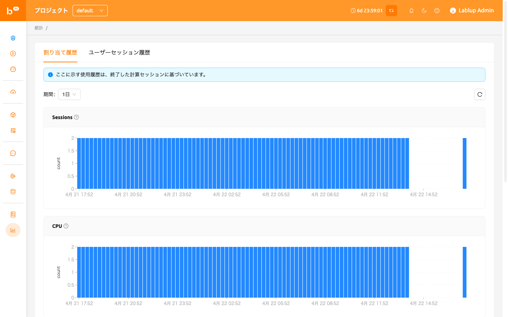
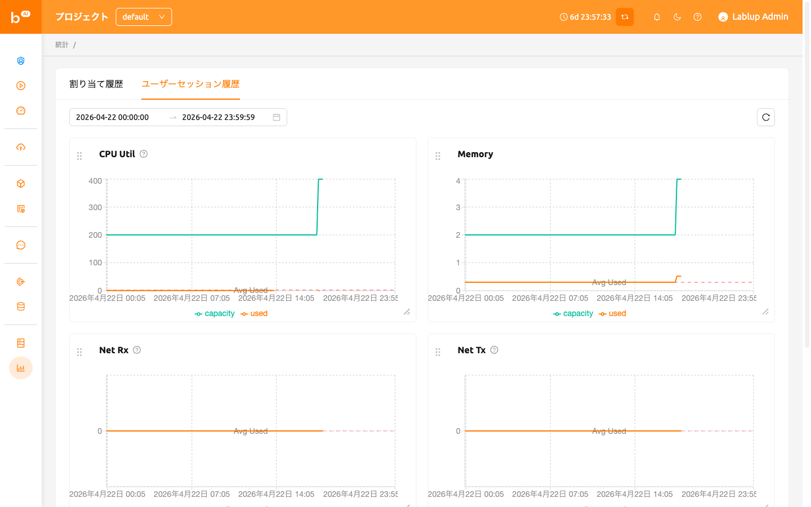

# 統計ページ

## Allocation history

On the 統計 page, under the Allocation History tab, you can check simple statistics related to the use of
compute sessions via a graph. You can check the statistics for a day or a week by selecting the usage period
from the select period menu on the upper left. Displayed items are as follows.

- セッション: 作成されたコンピュートセッションの数。
- CPU: コンピュートセッションに割り当てられたCPUコアの数。
- メモリ: コンピュートセッションに割り当てられたメモリの量。
- GPU: コンピュートセッションに割り当てられたGPUユニットの数。Fractional GPU機能が有効になっている場合、物理的なGPUと一致しないことがあります。
- IO-Read: ストレージから読み取られたデータの量。
- IO-Write: ストレージに書き込まれたデータの量。

ここに表示されている統計は、終了したコンピュートセッションに基づいていることに注意してください。また、アカウントが作成されてから1週間以内のユーザーについては、1週間の統計が表示されない場合があります。

## User session history

In the User Session History tab of the 統計 page, ユーザーs can view statistics on various resources used by sessions through graphs.
Users can check the statistics for a selected period using the Select Period menu at the upper left. The displayed items are as follows.

- CPU Util: The amount of CPU time used by the sessions.
- Memory: The amount of memory used by the sessions.
- Net Rx: The rate at which the container is receiving network data.
- Net Tx: The rate at which the container is sending network data.
- IO Read: The amount of data read from the storage by the sessions.
- IO Write: The amount of data written to the storage by the sessions.

In addition, depending on the available resources, additional items such as CUDA-capable GPU Util and CUDA-capable GPU Mem may be displayed.

より詳細な統計情報は、管理者専用のコントロールパネルに表示されます。

