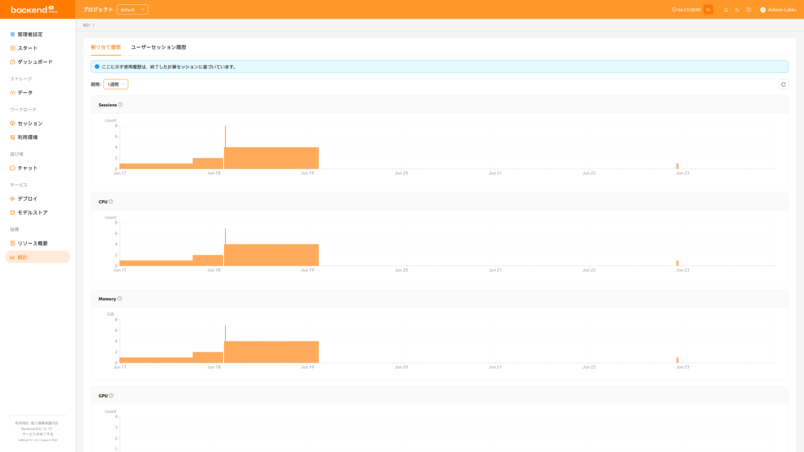
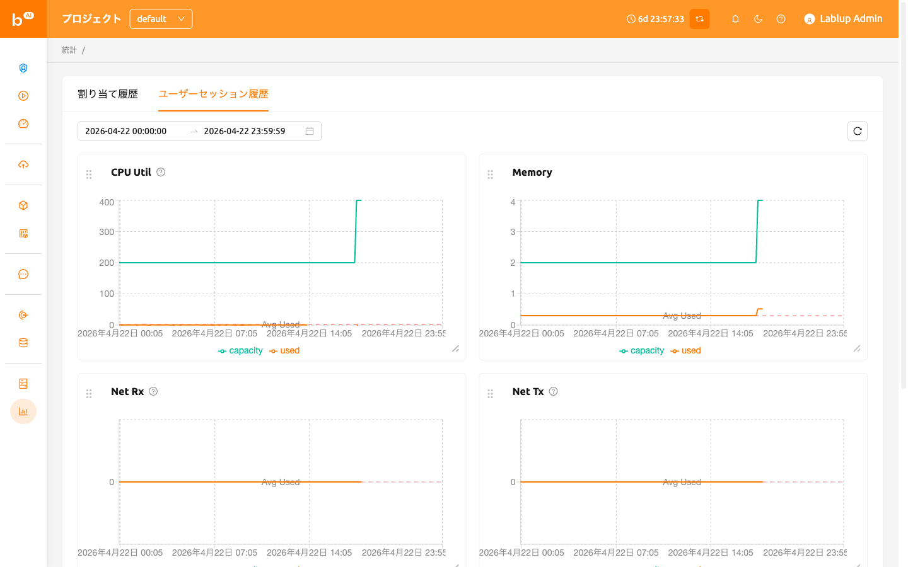

# 統計ページ

## 割り当て履歴

統計ページの割り当て履歴タブでは、コンピュートセッションの使用に関する簡単な統計をグラフで確認できます。左上の期間選択メニューから利用期間を選択して、1日または1週間の統計を確認できます。表示される項目は以下のとおりです。

- セッション: 作成されたコンピュートセッションの数。
- CPU: コンピュートセッションに割り当てられたCPUコアの数。
- メモリ: コンピュートセッションに割り当てられたメモリの量。
- GPU: コンピュートセッションに割り当てられたGPUユニットの数。フラクショナルGPU機能が有効になっている場合、物理的なGPUと一致しないことがあります。
- IO-Read: ストレージから読み取られたデータの量。
- IO-Write: ストレージに書き込まれたデータの量。

ここに表示されている統計は、終了したコンピュートセッションに基づいていることに注意してください。また、アカウントが作成されてから1週間以内のユーザーについては、1週間の統計が表示されない場合があります。

## ユーザーセッション履歴

統計ページのユーザーセッション履歴タブでは、セッションが使用したさまざまなリソースに関する統計をグラフで確認できます。左上の日付範囲ピッカーを使用して、選択した期間の統計を確認できます。表示される項目は以下のとおりです。

- CPU Util: セッションが使用したCPU時間の量。
- Memory: セッションが使用したメモリの量。
- Net Rx: コンテナがネットワークデータを受信している速度。
- Net Tx: コンテナがネットワークデータを送信している速度。
- IO Read: セッションによってストレージから読み取られたデータの量。
- IO Write: セッションによってストレージに書き込まれたデータの量。

さらに、利用可能なリソースに応じて、CUDA-capable GPU UtilやCUDA-capable GPU Memなどの追加項目が表示される場合があります。

より詳細な統計情報は、管理者専用のコントロールパネルに表示されます。

