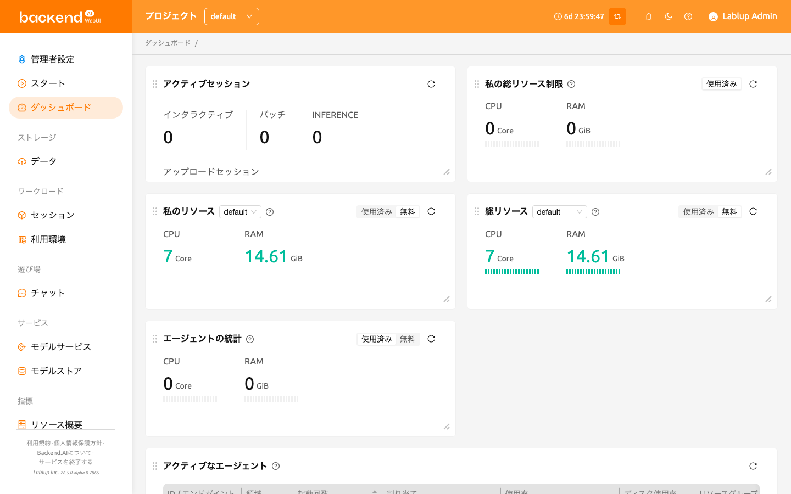

:::warning
この機能は非推奨となっているため、今後は[ダッシュボード](../dashboard/dashboard.md)ページをご利用ください。また、この機能に対する技術サポートおよびバグ修正は提供されません。問題が対応されない可能性があることをご了承ください。
:::

# サマリーページ

サマリーページでは、ユーザーはリソースの状態とセッションの使用状況を確認できます。

### リソース統計情報

ユーザーが割り当てることができるリソースの総量と、現在割り当てられているリソースの量を表示します。ユーザーのCPU、メモリ、およびGPUリソースの占有率とクォータをそれぞれ確認できます。また、セッションスライダーでは、同時に作成できるコンピュートセッションの最大数と、現在実行中のコンピュートセッションの数を確認できます。

リソースグループは、上部のリソースグループフィールドをクリックすることで変更できます。リソースグループは、複数のエージェントノードを単一のリソース単位としてグループ化するための概念です。多数のエージェントノードがある場合、それらを特定のプロジェクトに割り当てるなど、各リソースグループに対して設定を構成できます。エージェントノードが1つしかない場合、1つのリソースグループしか表示されないのが通常です。リソースグループを変更すると、そのリソースグループが保有するリソース（エージェントが属する）によって、リソースの量が変わる場合があります。

### システムリソース

それは、Backend.AI システムに接続されているエージェントワーカーノードの数と、現在作成されている計算セッションの総数を表示します。エージェントノードの CPU、メモリ、GPU の利用率も確認できます。通常のユーザーとしてログインしている場合は、作成した計算セッションの数のみが表示されます。

### 招待

他のユーザーがストレージフォルダを共有した場合、ここに表示されます。共有リクエストを承認すると、データ & ストレージフォルダ内で共有フォルダを閲覧およびアクセスできます。アクセス権は、共有リクエストを送信したユーザーによって決まります。もちろん、共有リクエストを拒否することもできます。

### Backend.AI Web UI アプリのダウンロード

Backend.AI WebUIはデスクトップアプリケーションをサポートしています。
デスクトップアプリを使用すると、[コンピュートセッションへのSSH/SFTP接続](../sftp_to_container/sftp_to_container.md#ssh-sftp-container)などのデスクトップアプリ専用機能を利用できます。
現在、Backend.AI WebUIは以下のOSでデスクトップアプリケーションを提供しています：

- Windows
- Linux
- Mac

:::note
お使いのローカル環境（例：OS、アーキテクチャ）に合ったボタンをクリックすると、現在のWebUIバージョンと同じバージョンのデスクトップアプリが自動的にダウンロードされます。
以前のバージョンまたは以降のバージョンのWebUIをデスクトップアプリとしてダウンロードしたい場合は、[こちら](https://github.com/lablup/backend.ai-webui/releases?page=1)にアクセスして、希望するバージョンをダウンロードしてください。
:::