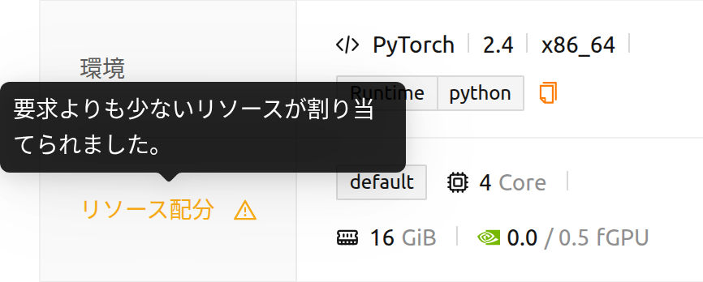

# FAQとトラブルシューティング

## ユーザートラブルシューティングガイド

### セッションリストが正しく表示されない

断続的なネットワークの問題やその他の様々な理由により、セッションリストが正しく表示されない場合があります。ほとんどの場合、この問題はブラウザをリフレッシュするだけで解消されます。

- WebベースのWebUI: ブラウザのページをリフレッシュします (Ctrl-Rなど、ブラウザで提供されるショートカットを使用します)。ブラウザのキャッシュが問題を引き起こすことがあるため、キャッシュをバイパスしてページをリフレッシュすることをお勧めします (Shift-Ctrl-Rなど、ただしキーは各ブラウザによって異なる可能性があります)。
- WebUIアプリ: アプリを更新するにはCtrl-Rショートカットを押してください。

### 突然、自分のアカウントでログインできなくなりました

認証クッキーの認識に問題がある場合、ユーザーは一時的にログインできないことがあります。プライベートブラウザウィンドウを使用してログインしてみてください。もし成功した場合は、ブラウザのキャッシュおよび/またはアプリケーションデータをクリアしてください。

<a id="offline-banner"></a>

### オフラインであるというバナーが表示されます

ページ上部に赤い**オフライン：どのネットワークにも接続されていない。**バナーが表示された場合は、Backend.AIサーバーに到達できなかったことを意味します。WebUIはブラウザ自身のネットワーク判定だけに頼りません。ブラウザが接続なしと報告した場合、WebUIはまずサーバーが応答するかどうかを確認し、その確認も失敗した場合にのみバナーを表示します。そのため、VPN、キャプティブポータル、仮想ネットワークアダプタを使用している環境で発生していた誤ったオフライン表示はもう起こりません。

ネットワーク接続を確認し、Backend.AIサーバーが稼働しているかどうかを管理者に確認してください。バナーが表示されている間もWebUIは確認を繰り返すため、サーバーに再び到達できるようになると数秒以内にバナーは自動的に消えます。

黄色い**サーバーの応答に時間がかかっています。しばらくお待ちください。**バナーはこれとは別の意味です。サーバーには到達できるものの応答が遅い状態であり、バナーを閉じて作業を続けられます。

<a id="route-error-pages"></a>

### リンクを開くと目的のページではなくエラーページが表示されます

アドレスを開けない場合でも、WebUIは空白のページを残さずアプリケーション内でその理由を説明します。エラーページには開こうとしたアドレスと、利用可能な最初のページへ移動するボタン（**...ページに戻る**）が表示されます。メッセージから次のどの状況かを判断できます。

- **おっと！ページが見つかりません...** — アドレスがWebUIのどのページとも一致しない場合です。アドレスの入力ミス、古いリンク、ページ名が変更される前に保存したブックマークであることがほとんどです。
- **プロジェクト '...' が見つからないか、アクセス権がありません。** — アドレスで指定されたプロジェクトが存在しないか、ユーザーがそのプロジェクトのメンバーでない場合です。アドレスのうちプロジェクトにあたる部分が示されるため、どの名前が誤っているかをすぐに確認できます。ページ上部のプロジェクトセレクターから利用可能なプロジェクトを選択すると、同じ機能がそのプロジェクトで開きます。
- **アクセス可能なプロジェクトがありません。** — アカウントがまだどのプロジェクトにも所属していない場合です。メッセージの案内どおり、管理者にプロジェクトへのアクセス権を依頼してください。
- **不正アクセス** — アドレス自体は有効ですが、ユーザーのロールでは開けない場合です。ログイン章の[開けないページ](#pages-you-cannot-open)を参照してください。


<a id="installing_apt_pkg"></a>

### aptパッケージのインストール方法?

コンピュートセッション内では、セキュリティ上の理由からユーザーは`root`アカウントにアクセスしたり、
`sudo`権限が必要な操作を実行したりすることはできません。そのため、`sudo`権限が
必要な`apt`や`yum`を利用したパッケージのインストールは許可されていません。
どうしても必要な場合は、管理者に`sudo`権限の付与をリクエストすることができます。

また、Homebrewを使用してOSパッケージをインストールすることもできます。詳細については、
[自動マウントフォルダでHomebrewを使用するガイド](#using-linuxbrew-with-automountfolder)を参照してください。


<a id="install_pip_pkg"></a>

### pipでパッケージをインストールする方法

pipパッケージをインストールすると、デフォルトで`~/.local`配下にインストールされます。
そのため、`.local`という名前の自動マウントストレージフォルダを作成すれば、
コンピュートセッションが削除された後もインストールしたパッケージを保持し、
次のコンピュートセッションで再利用できます。次のようにpipでパッケージをインストールしてください：

```bash
pip install aiohttp
```
詳細については、[自動マウントフォルダでPythonパッケージをインストールするガイド](#using-pip-with-automountfolder)を参照してください。

### コンピュートセッションを作成しましたが、Jupyter Notebookを起動できません

pipを使用してJupyterパッケージを手動でインストールした場合、コンピュートセッションが
デフォルトで提供するJupyterパッケージと競合する可能性があります。特に、
`~/.local`ディレクトリを作成している場合、手動でインストールしたJupyterパッケージが
すべてのコンピュートセッションで保持されます。この場合は、`.local`自動マウント
フォルダを削除してから、再度Jupyter Notebookの起動を試みてください。

### ページのレイアウトが崩れている

Backend.AI WebUIは、最新のモダンJavaScriptおよび/またはブラウザ機能を利用しています。最新のモダンブラウザ（Chromeなど）を使用してください。

<a id="sftp-disconnection"></a>

### SFTP 切断

この項目は、接続が確立された後に転送が中断される場合を扱います。接続ダイアログがまったく開かず、代わりにエラー通知が表示される場合は、接続情報を解決できなかったということなので、SFTP接続章の[接続エラー](#connection-errors)を参照してください。

WebUIアプリがSFTP接続を起動するとき、それはアプリに埋め込まれたローカルプロキシサーバーを使用します。SFTPプロトコルによるファイル転送中にWebUIアプリを終了すると、ローカルプロキシサーバーを介して確立された接続が切断されるため、転送は即座に失敗します。このため、コンピュートセッションを使用していない場合でも、SFTPを使用している間はWebUIアプリを終了しないでください。ページをリフレッシュする必要がある場合は、Ctrl-Rショートカットを使用することをお勧めします。

WebUIアプリが閉じられ再起動されても、既存のコンピュートセッションに対してSFTPサービスは自動的に開始されません。希望するコンテナでSSH/SFTPサービスを明示的に開始して、SFTP接続を確立する必要があります。


## 管理者向けトラブルシューティングガイド

### ユーザーは Jupyter Notebook のようなアプリを起動できません。

App Proxyサービスの接続に問題がある可能性があります。
App Proxyサービスの開始・停止・再起動ガイドを参照して、サービスを停止してから再起動してみてください。

Webベースのアプリではなく SSH/SFTP を開けないという報告を受けた場合は、通知に表示されたメッセージをそのまま確認してください。メッセージごとに App Proxy 経路の異なる段階を示しており、詳細は[接続エラー](#connection-errors)にまとめられています。

### 指定されたリソースが実際の割り当てと一致しません。

セッション詳細ページがこの状況を自ら知らせるため、他の対処を行う前にまず確認してください。このページには、セッションが**実際に確保している**リソースが表示されます。割り当てが要求と異なる場合、各リソースは同じ項目の中に*割り当て / 要求*の形式（例: `0.0 / 0.5 fGPU`）で両方の値が表示され、**リソース配分**というラベルに警告アイコンが付きます。アイコンのツールチップには*要求よりも少ないリソースが割り当てられました。*と表示されます。



そこに表示される差は表示上の誤りではなく、実際の割り当て結果です。多くの場合、セッションが割り当てられる際に要求が調整されたことを意味します。たとえば、小数単位のGPU要求量がリソースグループの割り当て単位に合わせて切り捨てられた場合などです。まだ割り当てられていないセッションでは、要求量のみが表示され比較値は表示されません。

そのページに表示された値までもがコンテナの実際の使用量と一致しない場合にのみ（ネットワーク接続が不安定だった場合や、Dockerデーモンのコンテナ管理に問題があった場合に起こり得ます）、占有量を再計算してください。

1. 管理者アカウントとしてログインします。
2. **補修(メンテナンス)**ページを開きます。
3. **使用量を再計算する**ボタンをクリックします。

### Dockerレジストリにプッシュされた後、イメージが表示されません


:::note
この機能はスーパ管理者にのみ利用可能です。
:::

新しいイメージがBackend.AIのdockerレジストリの1つにプッシュされた場合、そのイメージのメタデータを更新してコンピュートセッションの作成に使用できるようにする必要があります。メタデータの更新は、**補修(メンテナンス)**ページで**画像を再スキャンする**ボタンをクリックすることで実行できます。複数のレジストリがある場合、それに属するすべてのdockerレジストリのメタデータが更新されます。

特定のDockerレジストリのメタデータを更新したい場合は、**環境設定**ページの**Registries**タブを開きます。各レジストリは行（row）として表示され、アクションメニューが付いています。目的のレジストリの行にある**画像を再スキャンする**アクションをクリックすると、そのレジストリのイメージメタデータのみを更新できます。

:::warning
同じ行には**削除**アクション（ゴミ箱アイコン）もあります。レジストリを削除するとBackend.AIから完全に削除されるため、**画像を再スキャンする**アクションと混同しないように注意してください。
:::
