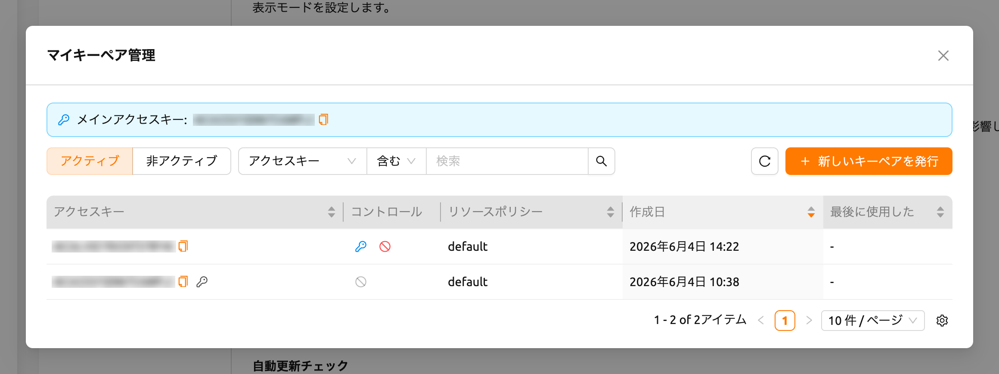
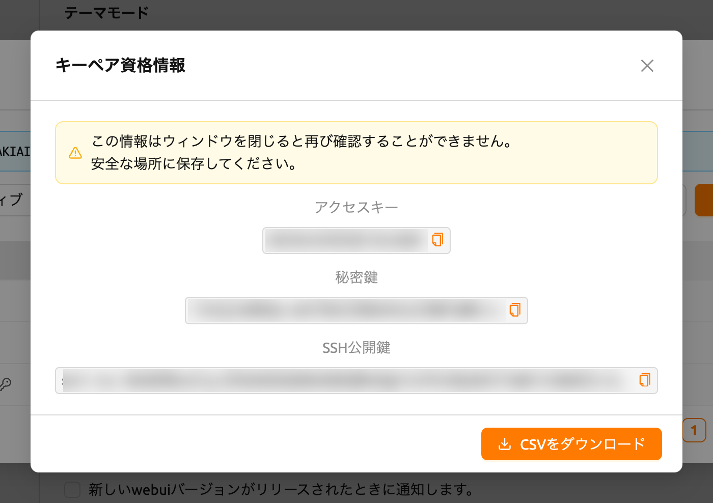

# ユーザー設定

ユーザー設定ページでは、Backend.AI WebUIの環境をカスタマイズできます。
右上の人アイコンをクリックし、環境設定メニューを選択してアクセスできます。
ここでは、テーマモード、言語、デスクトップ通知、SSHキーペア管理、シェル
スクリプト、実験的機能などの設定を行うことができます。

## 一般タブ

一般タブには、**環境設定**、**シェル環境**、**実験的特徴**のグループに整理された
すべての設定項目が含まれています。

### 設定の検索とフィルタリング

設定エリアの上部にある**検索バー**を使用して、設定名ですばやく検索できます。
キーワードを入力すると、一致する設定のみが表示されます。

**表示のみの変更**チェックボックスをオンにすると、デフォルト値から変更された
設定のみをフィルタリングして表示できます。これにより、カスタマイズした
すべての項目を一目で確認できます。

### 設定のリセット

すべての設定をデフォルト値に戻すには、設定エリアの上部にある**Reset to Default**
ボタンをクリックします。リセットが適用される前に確認ダイアログが表示されます。

各設定にも個別のリセットボタンがあり（値がデフォルトと異なる場合に表示）、
他の設定に影響を与えずに個別の設定をリセットできます。

### テーマモード

WebUIの表示モードを設定します。以下から選択できます:

- **システム設定に従う**: オペレーティングシステムのライト/ダークモード設定に
  自動的に従います。
- **ライトモード**: 常にライトテーマを使用します。
- **ダークモード**: 常にダークテーマを使用します。

### デスクトップ通知を有効にする

デスクトップ通知機能を有効または無効にします。有効にすると、Backend.AIは
アプリ内通知に加えてオペレーティングシステムの通知システムも使用します。
この機能を無効にしても、WebUI内の通知には影響しません。オペレーティングシステム
によっては、システム設定で通知の許可を有効にする必要がある場合があります。

### コンパクトサイドバーをデフォルトに設定

このオプションがオンの場合、左のサイドバーはコンパクトな形式（幅が狭く）で
表示されます。オプションの変更は、ブラウザを更新すると適用されます。ページを
更新せずにサイドバーのタイプを直ちに変更したい場合は、ヘッダー上部の最も左の
アイコンをクリックしてください。

### 言語

UIに表示される言語を設定します。言語セレクタは検索可能なドロップダウンで、
English、한국어、brasileiro、简体中文、繁體中文、Français、Suomalainen、Deutsch、
Ελληνική、Bahasa Indonesia、Italiano、日本語、Монгол、Polski、Português、
русский、Español、ภาษาไทย、Türkçe、Tiếng Việtの20言語がリストされています。
ドロップダウンに入力して、言語をすばやくフィルタリングして見つけることが
できます。

ブラウザのデフォルト言語と一致する項目には、名前の横に「(Default)」ラベルが
表示されます。英語と韓国語以外の言語は機械翻訳で提供されます。ページを更新する
まで言語が更新されないUIアイテムがある場合があります。

:::note
一部の翻訳項目は`__NOT_TRANSLATED__`と表示される場合があります。これは、
その言語への翻訳がまだ完了していないことを示しています。Backend.AI WebUIは
オープンソースですので、翻訳の改善に貢献したい方はどなたでも参加できます:
https://github.com/lablup/backend.ai-webui.
:::

### ログアウト中はログインセッション情報を保持する

:::note
この設定はElectron（デスクトップ）アプリでのみ利用可能です。
:::

有効にすると、WebUIアプリは次回のアプリ起動時まで現在のログインセッション情報を
保持します。オプションがオフの場合、ログイン情報はログアウトごとにクリア
されます。

### 自動更新チェック

新しいWebUIバージョンが検出されると、通知ウィンドウがポップアップします。
これは、インターネット接続が利用可能な環境でのみ動作します。機能が自動的に
無効化された場合、トグルを再度クリックすると更新チェックが再開されます。

### 自動ログアウト

セッション内でアプリを実行するために作成されたページ（例：Jupyterノートブック、
ウェブターミナルなど）を除き、すべてのBackend.AI WebUIページが閉じられると、
自動的にログアウトされます。

### 私のキーペア情報

すべてのユーザーは少なくとも1つ以上のキーペアを持っています。Configボタンを
クリックすると、アクセスキーとシークレットキーを確認できます。メインの
アクセスキーペアは1つだけです。

開くダイアログはサーバーバージョンによって異なります。古いサーバーでは、
**私のキーペア情報** ダイアログにアクセスキーとシークレットキーが表示される
読み取り専用のテーブルと **閉じる** ボタンが表示されます。メインアクセスキーには
**メインアクセスキー** タグが付きます。

キーペア管理に対応したサーバーでは、Configボタンをクリックすると、代わりに以下で
説明する完全な **マイキーペア管理** ダイアログが開きます。

### マイキーペア管理

キーペア管理に対応したサーバーでは、Configボタンをクリックすると **マイキーペア
管理** ダイアログが開きます。ここでは、複数のキーペアを同時に保持し、新しい
キーペアを発行し、どのキーペアをメインアクセスキーにするかを選択し、キーペアの
無効化、復元、完全削除を行うことができます。

<!-- TODO: Capture screenshot of my_keypair_management.png — the My Keypair Management modal table -->

ダイアログ上部の **メインアクセスキー** バナーには、現在のメインアクセスキーが
表示されます。横のコピーアイコンをクリックすると、キーをクリップボードにコピー
できます。

#### キーペアの閲覧

ダイアログにはキーペアがテーブル形式で一覧表示されます。テーブル上部のコント
ロールを使用して、表示する項目を絞り込むことができます:

- **アクティブ** / **非アクティブ** トグル: アクティブなキーペアの表示と無効化
  されたキーペアの表示を切り替えます。
- **フィルター**: **アクセスキー** または **リソースポリシー** で一覧を
  フィルタリングします。
- **列の並べ替え**: 列ヘッダーをクリックして、**アクセスキー**、**リソース
  ポリシー**、**作成日**、または **最後に使用した** でテーブルを並べ替えます。
- **ページネーション**: 1ページに収まらないほどキーペアが多い場合に、ページ間を
  移動します。

テーブルには次の列が含まれます:

- **アクセスキー**: キーペアのアクセスキーです。メインアクセスキーにはキー
  アイコンが付きます。コピーアイコンをクリックすると、アクセスキーをコピー
  できます。
- **コントロール**: 各キーペアで使用できる操作です（以下を参照）。
- **リソースポリシー**: キーペアに適用されているリソースポリシーです。
- **作成日**: キーペアが作成された日時です。
- **最後に使用した**: キーペアが最後に使用された日時です。
- **変更日時**: キーペアが最後に変更された日時です。この列はデフォルトで
  非表示になっており、テーブルの列設定から表示できます。

#### 新しいキーペアの発行

**新しいキーペアを発行** ボタンをクリックすると、新しいキーペアを作成できます。
キーペアが発行されると、**キーペア資格情報** ダイアログが表示され、新しい資格
情報が一度だけ表示されます。

<!-- TODO: Capture screenshot of keypair_credential_info.png — the Keypair Credential Information one-time reveal modal -->

ダイアログには次の値が、それぞれコピーボタンとともに表示されます:

- **アクセスキー**
- **秘密鍵**
- **SSH公開鍵**

**CSVをダウンロード** をクリックすると、資格情報をファイルに保存できます。

:::warning
*「この情報はウィンドウを閉じると再び確認することができません。安全な場所に
保存してください。」* 秘密鍵は一度だけ表示されます。ダイアログを閉じる前に
コピーするか、CSVをダウンロードしてください。閉じた後は秘密鍵を再取得する方法は
ありません。
:::

#### アクティブなキーペアの管理

各アクティブなキーペアの **コントロール** 列では、次の操作を使用できます:

- **メインに設定**: このキーペアをメインアクセスキーに指定します。変更が反映
  される前に確認プロンプトが表示されます。現在使用中のメインアクセスキーには
  この操作は表示されません。
- **非アクティブ化**: キーペアを無効化して使用できないようにします。キーペアが
  無効化される前に確認プロンプトが表示されます。メインアクセスキーは無効化
  できないため、先に別のキーに切り替えてください（*「メインアクセスキーは
  非アクティブ化できません。別のキーに切り替えてから行ってください。」*）。

:::note[再ログインが必要です]
メインアクセスキーが変更されると（たとえば、新しいキーペアを発行してそれを
メインに設定した場合など）、WebUIに **再ログインが必要です** という通知と共に
*「メインアクセスキーが変更されました。変更を反映するには、再度ログインして
ください。」* というメッセージが表示されます。変更されたメインアクセスキーを
セッションに反映するには、ログアウトして再度ログインしてください。
:::

#### 非アクティブなキーペアの管理

**非アクティブ** 表示に切り替えると、無効化されたキーペアを管理できます。各
非アクティブなキーペアでは、次の操作を使用できます:

- **復元する**: キーペアを再びアクティブ化して使用できるようにします。キーペアが
  復元される前に確認プロンプトが表示されます。
- **キーペアの削除**: キーペアを完全に削除します。

:::danger
キーペアの削除は **元に戻せません**。一度削除したキーペアは復元できません。
誤った削除を防ぐため、削除が許可される前に確認フィールドに **完全に削除** と
入力する必要があります。
:::

### SSHキーペア管理

WebUIアプリを使用する際、コンピュートセッションに直接SSH/SFTP接続を作成でき
ます。Backend.AIにサインアップすると、公開キーペアが提供されます。SSHキーペア
管理セクションの右側にあるボタンをクリックすると、次のダイアログが表示されます。
右側のコピーボタンをクリックして、既存のSSH公開鍵をコピーできます。ダイアログ
の下部にある`GENERATE`ボタンをクリックすると、SSHキーペアを更新できます。SSH
公開/秘密鍵はランダムに生成され、ユーザー情報として保存されます。秘密鍵は作成
後すぐに手動で保存しない限り、再確認できないことに注意してください。

:::note
Backend.AIはOpenSSHに基づいたSSHキーペアを使用します。Windowsでは、これを
PPKキーに変換する必要がある場合があります。
:::

バージョン22.09以降、Backend.AI WebUIはプライベートリポジトリへのアクセスなどの
柔軟性を提供するために、独自のSSHキーペアの追加をサポートしています。独自の
SSHキーペアを追加するには、`ENTER MANUALLY`ボタンをクリックしてください。
「public」キーと「private」キーに対応する2つのテキストエリアが表示されます。

キーを入力して`SAVE`ボタンをクリックしてください。これで、独自のキーを使用して
Backend.AIセッションにアクセスできます。

### 最大同時ファイルアップロード制限

ファイルエクスプローラーを通じて同時にアップロードできるファイルの数を制限
します。2から5の値を選択できます。デフォルト値は2です。

### ブートストラップスクリプトの編集

コンピュートセッションが開始された直後に一度だけスクリプトを実行したい場合は、
ここに内容を記述してください。

:::note
ブートストラップスクリプトの実行が完了するまで、コンピュートセッションは
`PREPARING`ステータスのままです。セッションが`RUNNING`になるまで使用できない
ため、スクリプトに時間のかかるタスクが含まれている場合は、ブートストラップ
スクリプトから削除してターミナルアプリで実行することをお勧めします。
:::

### ユーザー構成スクリプトの編集

コンピュートセッションのデフォルトの設定スクリプトを置き換える設定スクリプトを
記述できます。`.bashrc`、`.tmux.conf.local`、`.vimrc`などのファイルを
カスタマイズできます。スクリプトはユーザーごとに保存され、特定の自動化タスクが
必要な場合に使用できます。たとえば、`.bashrc`スクリプトを変更して、コマンド
エイリアスを登録したり、特定のファイルが常に特定の場所にダウンロードされるように
指定したりできます。

上部のドロップダウンメニューを使用して作成したいスクリプトのタイプを選択し、
内容を記述します。SAVEまたはSAVE AND CLOSEボタンをクリックしてスクリプトを
保存できます。DELETEボタンをクリックするとスクリプトを削除できます。

### 実験的特徴

新しい実験的機能に早期アクセスできます。これらは将来のアップデートで変更または
削除される可能性があります。

- **AIエージェント**: AIエージェント機能を有効にします。この機能はWebUI内で
  エージェントベースのAI機能を提供します。有効にすると、セッションでAI
  エージェント機能を利用できるようになります。

## ログタブ

クライアント側で記録されたさまざまなログの詳細情報を表示します。このページを
訪れることで、発生したエラーについて詳しく知ることができます。エラーログの
検索、フィルタリング、ログの更新、右上の「Clear Logs」ボタンをクリックしての
ログクリアが可能です。

:::note
1つのページにしかログインしていない場合、REFRESHボタンをクリックしても正しく
機能していないように見えるかもしれません。ログページはサーバーへのリクエストと
サーバーからのレスポンスの集まりです。現在のページがログページである場合、
ページを明示的にリフレッシュする以外にサーバーへのリクエストは送信されません。
ログが正しく積み重ねられているか確認するには、別のページを開いてREFRESHボタンを
クリックしてください。
:::

特定の列を非表示にしたり表示したりしたい場合は、テーブルの右下にある歯車
アイコンをクリックしてください。表示したい列を選択するダイアログが表示
されます。

