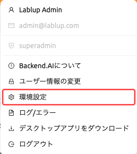
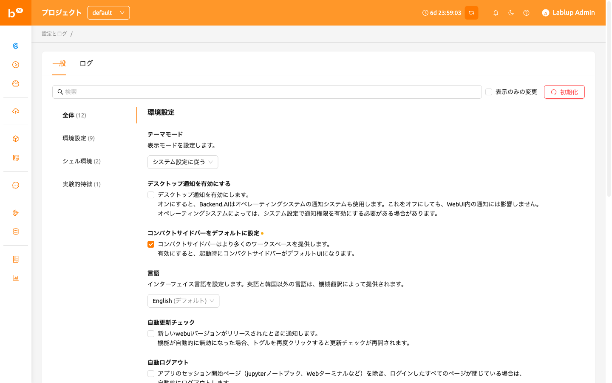
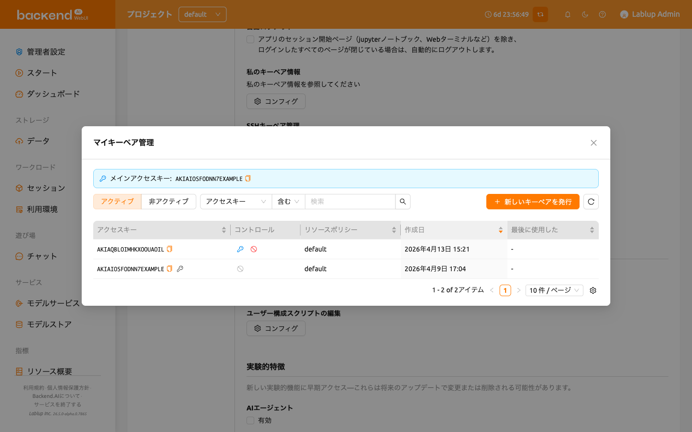
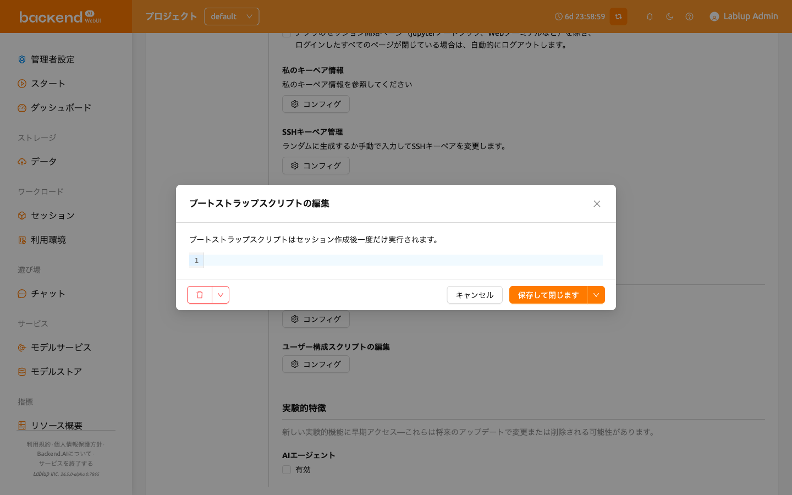
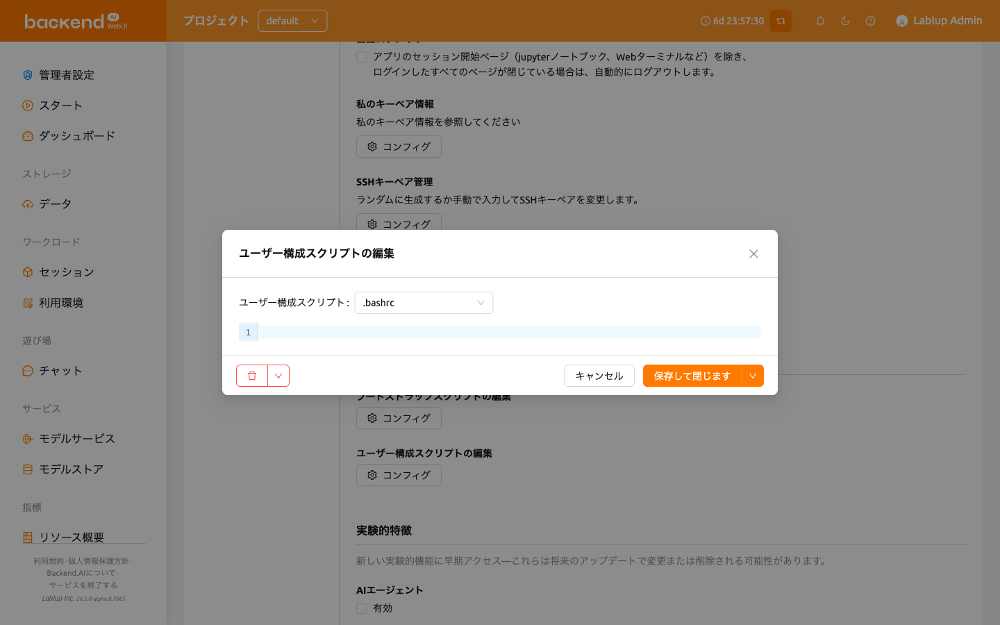
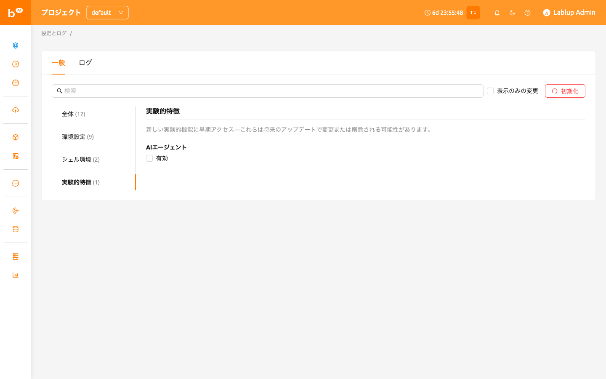
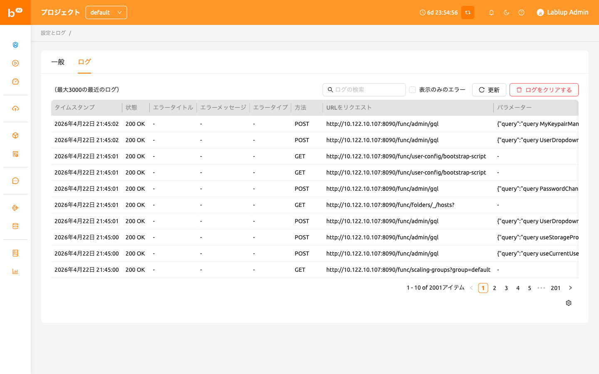
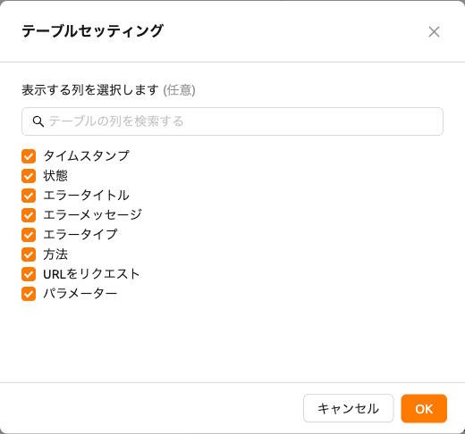

# ユーザー設定

ユーザー設定ページでは、Backend.AI WebUIの環境をカスタマイズできます。
右上の人アイコンをクリックし、環境設定メニューを選択してアクセスできます。
ここでは、テーマモード、言語、デスクトップ通知、SSHキーペア管理、シェル
スクリプト、実験的機能などの設定を行うことができます。

## 一般タブ

一般タブには、**環境設定**、**シェル環境**、**実験的特徴**のグループに整理された
すべての設定項目が含まれています。

### 設定の検索とフィルタリング

設定エリアの上部にある**検索バー**を使用して、設定名ですばやく検索できます。
キーワードを入力すると、一致する設定のみが表示されます。

**変更のみ表示**チェックボックスをオンにすると、デフォルト値から変更された
設定のみをフィルタリングして表示できます。これにより、カスタマイズした
すべての項目を一目で確認できます。

### 設定のリセット

すべての設定をデフォルト値に戻すには、設定エリアの上部にある**Reset to Default**
ボタンをクリックします。リセットが適用される前に確認ダイアログが表示されます。

各設定にも個別のリセットボタンがあり（値がデフォルトと異なる場合に表示）、
他の設定に影響を与えずに個別の設定をリセットできます。

### テーマモード

WebUIの表示モードを設定します。以下から選択できます:

- **システム設定に従う**: オペレーティングシステムのライト/ダークモード設定に
  自動的に従います。
- **ライトモード**: 常にライトテーマを使用します。
- **ダークモード**: 常にダークテーマを使用します。

### デスクトップ通知を有効にする

デスクトップ通知機能を有効または無効にします。有効にすると、Backend.AIは
アプリ内通知に加えてオペレーティングシステムの通知システムも使用します。
この機能を無効にしても、WebUI内の通知には影響しません。オペレーティングシステム
によっては、システム設定で通知の許可を有効にする必要がある場合があります。

### コンパクトサイドバーをデフォルトに設定

このオプションがオンの場合、左のサイドバーはコンパクトな形式（幅が狭く）で
表示されます。オプションの変更は、ブラウザを更新すると適用されます。ページを
更新せずにサイドバーのタイプを直ちに変更したい場合は、ヘッダー上部の最も左の
アイコンをクリックしてください。

### 言語

UIに表示される言語を設定します。現在、Backend.AIは英語と韓国語を含む20以上の
言語をサポートしています。英語と韓国語以外の言語は機械翻訳で提供されます。
ページを更新するまで言語が更新されないUIアイテムがある場合があります。

:::note
一部の翻訳項目は`__NOT_TRANSLATED__`と表示される場合があります。これは、
その言語への翻訳がまだ完了していないことを示しています。Backend.AI WebUIは
オープンソースですので、翻訳の改善に貢献したい方はどなたでも参加できます:
https://github.com/lablup/backend.ai-webui.
:::

### ログアウト中はログインセッション情報を保持する

:::note
この設定はElectron（デスクトップ）アプリでのみ利用可能です。
:::

有効にすると、WebUIアプリは次回のアプリ起動時まで現在のログインセッション情報を
保持します。オプションがオフの場合、ログイン情報はログアウトごとにクリア
されます。

### 自動更新チェック

新しいWebUIバージョンが検出されると、通知ウィンドウがポップアップします。
これは、インターネット接続が利用可能な環境でのみ動作します。機能が自動的に
無効化された場合、トグルを再度クリックすると更新チェックが再開されます。

### 自動ログアウト

セッション内でアプリを実行するために作成されたページ（例：Jupyterノートブック、
ウェブターミナルなど）を除き、すべてのBackend.AI WebUIページが閉じられると、
自動的にログアウトされます。

### 私のキーペア情報

すべてのユーザーは少なくとも1つ以上のキーペアを持っています。Configボタンを
クリックすると、アクセスキーとシークレットキーを確認できます。メインの
アクセスキーペアは1つだけです。

### SSHキーペア管理

WebUIアプリを使用する際、コンピュートセッションに直接SSH/SFTP接続を作成でき
ます。Backend.AIにサインアップすると、公開鍵ペアが提供されます。SSHキーペア
管理セクションの右側にあるボタンをクリックすると、次のダイアログが表示されます。
右側のコピーボタンをクリックして、既存のSSH公開鍵をコピーできます。ダイアログ
の下部にあるGENERATEボタンをクリックすると、SSHキーペアを更新できます。SSH
公開/秘密鍵はランダムに生成され、ユーザー情報として保存されます。秘密鍵は作成
後すぐに手動で保存しない限り、再確認できないことに注意してください。

:::note
Backend.AIはOpenSSHに基づいたSSHキーペアを使用します。Windowsでは、これを
PPKキーに変換する必要がある場合があります。
:::

バージョン22.09以降、Backend.AI WebUIはプライベートリポジトリへのアクセスなどの
柔軟性を提供するために、独自のSSHキーペアの追加をサポートしています。独自の
SSHキーペアを追加するには、`ENTER MANUALLY`ボタンをクリックしてください。
「public」キーと「private」キーに対応する2つのテキストエリアが表示されます。

キーを入力して`SAVE`ボタンをクリックしてください。これで、独自のキーを使用して
Backend.AIセッションにアクセスできます。

### 最大同時ファイルアップロード制限

ファイルエクスプローラーを通じて同時にアップロードできるファイルの数を制限
します。2から5の値を選択できます。デフォルト値は2です。

### ブートストラップスクリプトの編集

コンピュートセッションが開始された直後に一度だけスクリプトを実行したい場合は、
ここに内容を記述してください。

:::note
ブートストラップスクリプトの実行が完了するまで、コンピュートセッションは
`PREPARING`ステータスのままです。セッションが`RUNNING`になるまで使用できない
ため、スクリプトに時間のかかるタスクが含まれている場合は、ブートストラップ
スクリプトから削除してターミナルアプリで実行することをお勧めします。
:::

### ユーザー構成スクリプトの編集

コンピュートセッションのデフォルトの設定スクリプトを置き換える設定スクリプトを
記述できます。`.bashrc`、`.tmux.conf.local`、`.vimrc`などのファイルを
カスタマイズできます。スクリプトはユーザーごとに保存され、特定の自動化タスクが
必要な場合に使用できます。たとえば、`.bashrc`スクリプトを変更して、コマンド
エイリアスを登録したり、特定のファイルが常に特定の場所にダウンロードされるように
指定したりできます。

上部のドロップダウンメニューを使用して作成したいスクリプトのタイプを選択し、
内容を記述します。SAVEまたはSAVE AND CLOSEボタンをクリックしてスクリプトを
保存できます。DELETEボタンをクリックするとスクリプトを削除できます。

### 実験的特徴

実験的機能を正式リリース前に有効または無効にできます。これらの機能は将来の
アップデートで変更または削除される可能性があります。

## ログタブ

クライアント側で記録されたさまざまなログの詳細情報を表示します。このページを
訪れることで、発生したエラーについて詳しく知ることができます。エラーログの
検索、フィルタリング、ログの更新、右上の「Clear Logs」ボタンをクリックしての
ログクリアが可能です。

:::note
1つのページにしかログインしていない場合、REFRESHボタンをクリックしても正しく
機能していないように見えるかもしれません。ログページはサーバーへのリクエストと
サーバーからのレスポンスの集まりです。現在のページがログページである場合、
ページを明示的にリフレッシュする以外にサーバーへのリクエストは送信されません。
ログが正しく積み重ねられているか確認するには、別のページを開いてREFRESHボタンを
クリックしてください。
:::

特定の列を非表示にしたり表示したりしたい場合は、テーブルの右下にある歯車
アイコンをクリックしてください。表示したい列を選択するダイアログが表示
されます。

