<a id="vfolders"></a>

# データとストレージフォルダの取り扱い


Backend.AIは、ユーザーのファイルを安全に保管するための専用ストレージを提供しています。コンピュートセッションのファイルやディレクトリはセッション終了時に削除されるため、ストレージフォルダに保存することを推奨します。ストレージフォルダの一覧は、サイドバーのデータページを選択すると確認できます。フォルダ名やID、フォルダが配置されているNFSホスト名（ロケーション）、フォルダのアクセス権限（許可）などの情報を確認できます。


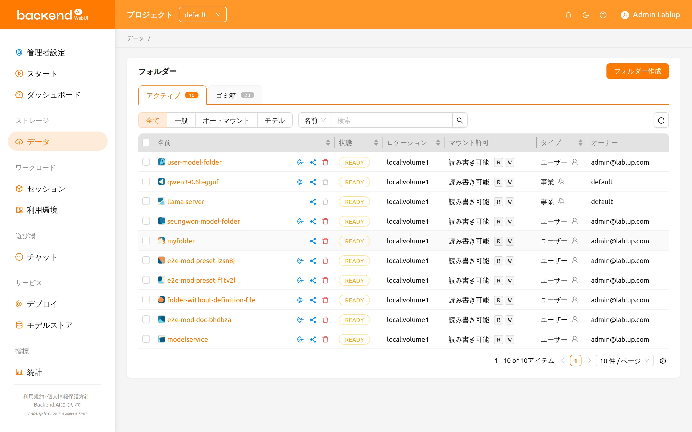

ストレージフォルダには、`ユーザー`と`プロジェクト`の2つのタイプがあります。「種類」列で区別できます。

## 招待バッジとエントリーポイント

他のユーザーが自分のストレージフォルダを共有するために招待を送ると、サイドバーのデータ
ページ項目とフォルダステータスの概要の横に小さな招待バッジが表示されます。バッジには、
まだ応答していない保留中の招待の件数が表示されます。


バッジをクリックすると招待リストが開き、保留中の各招待を受諾または辞退できます。
受諾したフォルダは即座にフォルダ一覧に `招待` タイプとして表示されます。`/data`
ページ自体も招待を確認するための有効なエントリーポイントです。データページを開けば、
フォルダステータスの概要から同じ招待リストにアクセスできます。


<a id="create-storage-folder"></a>
<a id="create_storage_folder"></a>

## ストレージフォルダを作成


新しいフォルダを作成するには、データページで「フォルダ作成」をクリックします。作成ダイアログのフィールドは以下のように入力します。

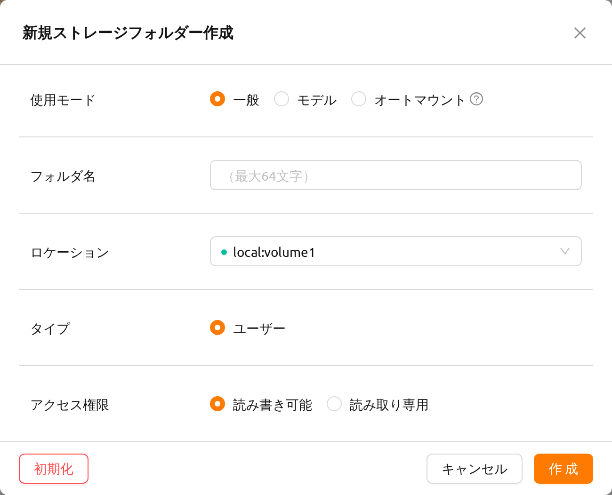

作成ダイアログの各フィールドの意味は以下のとおりです。

- **使用モード**: フォルダの用途を設定します。

   * 一般: 多目的にさまざまなデータを保存するためのフォルダを定義します。
   * モデル: モデルサービングおよび管理に特化したフォルダを定義します。このモードを選択すると、フォルダのコピー可否を切り替えることもできます。
   * オートマウント: セッション作成時に自動的にマウントされるフォルダです。選択した場合、フォルダ名はドット（'.'）で始まる必要があります。

- **フォルダ名**: フォルダの名前（最大64文字）。
- **ロケーション**: フォルダを作成するNFSホストを選択します。複数のホストがある場合は、いずれか1つを選択してください。利用可能な容量が十分かどうかをインジケータで確認できます。
- **種類**: 作成するフォルダーの種類を決定します。ユーザーまたはプロジェクトとして設定できます。ユーザーフォルダーは、ユーザーが自身で作成して使用できるフォルダーであり、プロジェクトフォルダーは管理者によって作成され、プロジェクト内のユーザーと共有されるフォルダーです。
- **プロジェクト**：プロジェクトタイプを選択したときにのみ表示されます。新しいプロジェクトフォルダを作成するときに、フォルダが属するプロジェクトを指定します。プロジェクトフォルダは、プロジェクトに属する必要があり、プロジェクトフォルダの場合、トップバーで現在選択されているプロジェクトが対象プロジェクトとして自動的に選択されます。ただし、ユーザーフォルダを作成する際には、役割を果たしません。
- **アクセス権限**: プロジェクトフォルダのプロジェクトメンバーに対するアクセス権限を設定します。「読み取り専用」に設定されている場合、プロジェクトメンバーはコンピュートセッション内でこのフォルダに書き込みを行うことができません。
- **コピー可能**: 使用モードで「モデル」を選択した場合のみ表示されます。作成するバーチャルフォルダ（vfolder）をコピー可能にするかどうかを選択します。

ここで作成したフォルダは、コンピュートセッション作成時に[マウント](../mount_vfolder/mount_vfolder.md#session-mounts)できます。フォルダはユーザーのデフォルト作業ディレクトリ `/home/work/` にマウントされ、マウントされたディレクトリに保存されたファイルはコンピュートセッションが終了しても削除されません。
（フォルダを削除した場合は、ファイルも削除されます。）

<a id="explore-folder"></a>

## フォルダーを探索


フォルダ名をクリックすると、ファイルエクスプローラーが開き、フォルダの内容を確認できます。


フォルダエクスプローラーは2パネルレイアウトを採用しています。

- **左パネル**: ストレージフォルダのディレクトリツリーとファイル一覧を表示するファイルブラウザ。
- **右パネル**: 2つのタブに整理された追加情報とログ。
  * **メタデータ**: フォルダの説明とプロパティ（以前はサイドパネルに表示されていました）。
  * **監査ログ**: このフォルダで実行された操作の時系列記録。

幅の広い（xl）画面では、2つのパネルの間にドラッグ可能な区切り線が表示され、ワークフローに合わせてサイズを調整できます。幅の狭い画面では、パネルが縦に積み重なって表示されます。


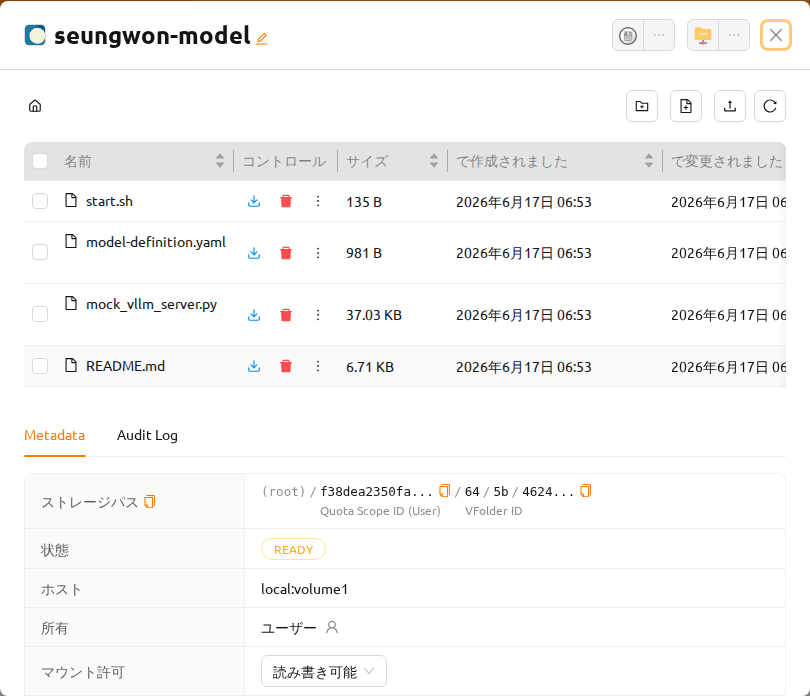

### ファイル操作

左パネル内ではフォルダ内のすべてのディレクトリとファイルを確認できます。Name列でディレクトリ名をクリックすると、そのディレクトリに移動します。Actions列のボタンを使用して、ファイルやディレクトリをダウンロードまたは削除できます。また、ファイルやディレクトリの名前を変更することも可能です。より詳細なファイル操作については、コンピュートセッションを作成する際にこのフォルダをマウントし、TerminalやJupyter Notebookなどのサービスを使用して行うことができます。

**フォルダ作成**ボタンで現在のパスに新しいフォルダを作成でき、**アップロード**ボタンでローカルファイルやフォルダーを現在のパスにアップロードすることもできます。これらのファイル操作は、上記のフォルダーをコンピュートセッションにマウントする方法を使用して実行することもできます。

:::warning
お使いのアカウントに、このフォルダがホストされているストレージホストに対する
`upload-file` 権限がない場合、「アップロード」ボタン（およびドラッグアンドドロップでの
アップロード）は **無効化** されます。ボタン自体は表示されますがグレーアウトされ、
ツールチップでアップロードが許可されていないことが案内されます。

`upload-file` はホストレベルの権限であり、ドメインレベルの権限、プロジェクトレベルの権限、
またはキーペアリソースポリシーの **いずれか一つ** が対象のストレージホストにこの権限を
付与していれば、アップロードが許可されます。ボタンが無効になっている場合は、管理者に
依頼して、該当ホストへの `upload-file` 権限を付与してもらってください。フォルダがどのホスト上に
あるかは、フォルダ一覧の **ロケーション** 列、またはフォルダ詳細ドロワーで確認できます。
:::

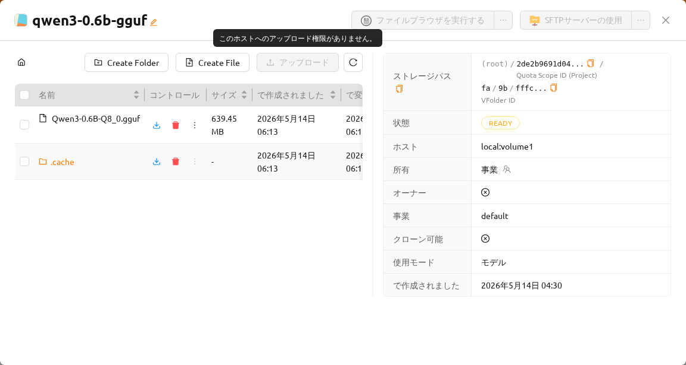

フォルダ内のファイルまたはディレクトリの最大長は、ホストファイルシステムに依存することがあります。しかし、通常は255文字を超えることはできません。


:::note
スムーズなパフォーマンスを確保するため、ディレクトリに非常に多くのファイルが含まれている場合、画面に表示できるファイルの最大数に制限があります。フォルダに多数のファイルがある場合、一部のファイルが画面に表示されないことがあります。その場合は、ターミナルや他のアプリケーションを使用してディレクトリ内のすべてのファイルを確認してください。
:::

### テキストファイルを編集

フォルダーエクスプローラーでテキストファイルを直接編集できます。フォルダー名をクリックしてファイルエクスプローラーを開き、テキストファイルのコントロール列にある「ファイルを編集」ボタンをクリックします。

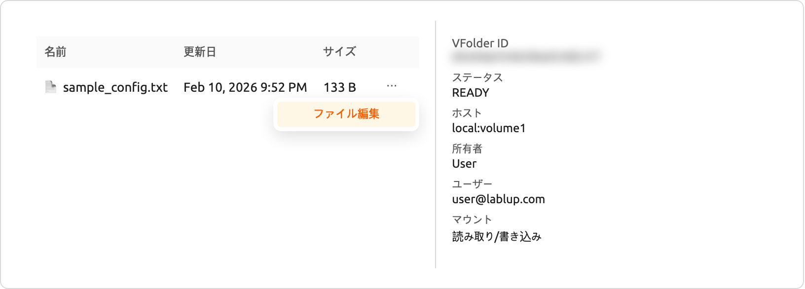

テキストファイルエディタがコードエディタインターフェースとともにモーダルで開きます。エディタはファイル拡張子に基づいてファイルタイプを自動検出し、適切な構文ハイライトを適用します(例: Python、JavaScript、Markdown)。モーダルのタイトルにはファイル名とサイズが表示されます。

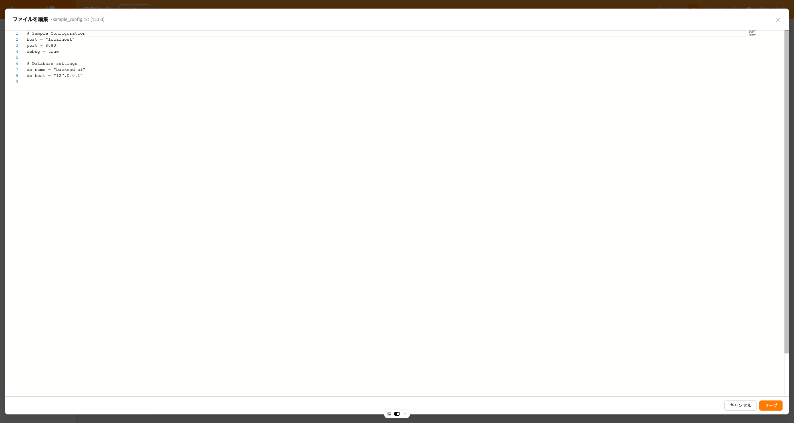

エディタはUIの設定に合わせてライトテーマとダークテーマの両方をサポートしています。ファイルの内容を編集した後、「保存」をクリックして変更されたファイルをアップロードするか、「キャンセル」をクリックして変更を破棄できます。

:::note
ファイルを編集ボタンは、対象のストレージフォルダに対するユーザーのアクセス権限に `write_content` 権限が含まれている場合にのみ使用できます（フォルダの共有権限、またはフォルダに付与されたロールを通じて付与されます）。コントロールパネルのストレージホストレベルの設定は、この動作には影響しません。ファイルの読み込みに失敗した場合、エラーメッセージが表示されます。
:::

### 監査ログタブ

右パネルの **監査ログ** タブには、このストレージフォルダで実行されたすべての操作（作成、更新、削除イベントなど）が時系列で一覧表示されます。

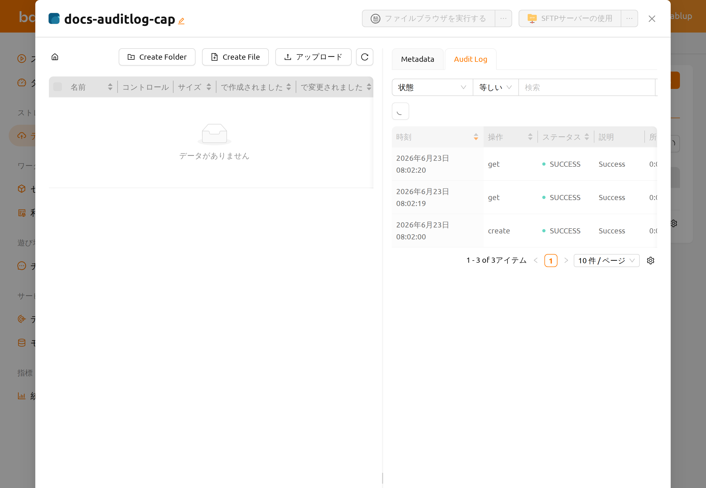

以下のコントロールを使用して監査ログをフィルタリングできます。

- **状態**: 操作結果でフィルタリングします（例：SUCCESS または ERROR）。
- **操作**: 操作タイプでフィルタリングします（例：create または delete）。
- **実行者**: アクターのユーザーIDで検索します。エントリは「メールアドレス (ID)」の形式で表示されます。
- **時間**: 特定の日時範囲に絞り込みます。

自動更新ボタンを使用すると、ページ全体をリロードせずにログを最新の状態に保つことができます。ログは遅延読み込み方式を採用しており、タブを初めて開いたときのみサーバーにクエリが送信されます。

:::note
監査ログタブはすべてのユーザーに表示されますが、バックエンドでアクセス制限が適用されています。監査ログデータを受け取ることができるのはスーパー管理者のみです。一般ユーザーには空のリストが表示されます。
:::

## フォルダー名を変更


ストレージフォルダの名前を変更する権限がある場合、フォルダの詳細ドロワーを開き、フォルダ名の横にある編集ボタンをクリックして名前を変更します。名前変更は詳細ドロワー内でのみ行います。

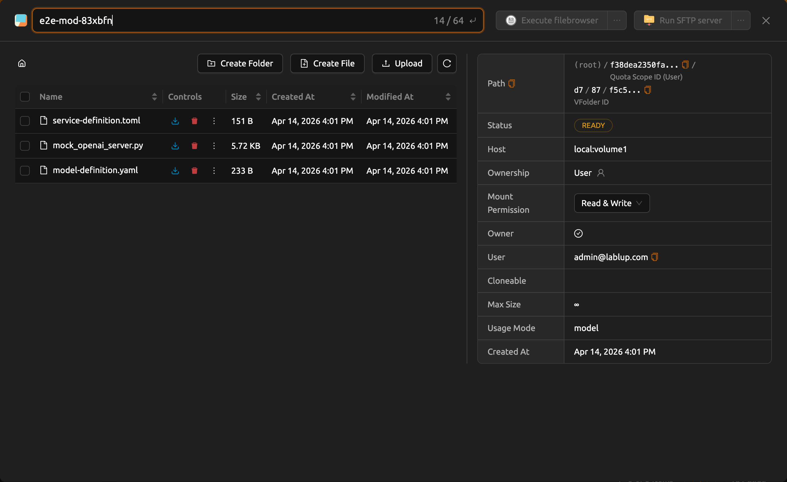


## フォルダーを削除


ストレージフォルダを削除する権限がある場合、「ゴミ箱」ボタンをクリックしてフォルダを「ゴミ箱」タブに移動できます。フォルダをゴミ箱タブに移動すると、削除保留状態としてマークされます。

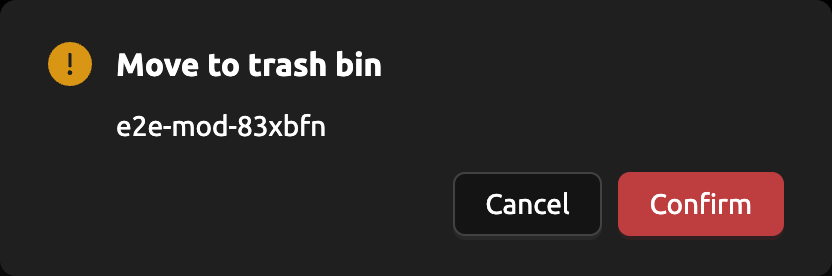

この状態では、コントロール列の復元ボタンをクリックしてフォルダを復元できます。フォルダを完全に削除する場合は、同じ列の「ゴミ箱」ボタンをクリックしてください。

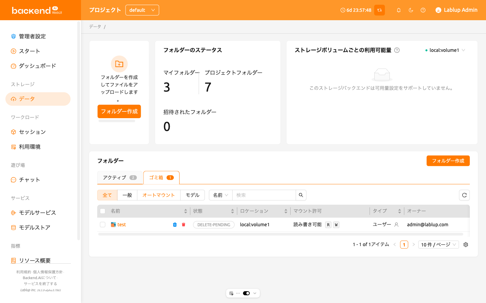

フォルダ名の入力を求める確認モーダルが表示されます。フォルダ名を正確に入力すると **完全に削除** ボタンが有効になり、クリックしてフォルダを完全に削除できます。

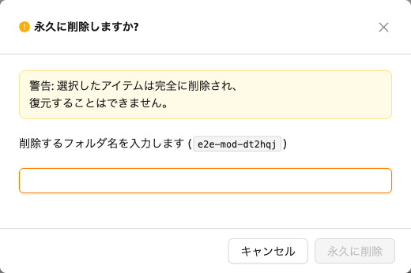

:::warning[モデルカードの連鎖削除]
削除対象のフォルダが **モデルカード** に関連付けられている場合、確認モーダルには
*「関連するモデルフォルダも削除する」* オプションと *「関連するモデルフォルダを削除すると、
そのフォルダを使用しているすべてのモデルカードも削除されます。」* という警告メッセージが
追加で表示されます。このまま削除を実行すると、このストレージフォルダを基盤とする
すべてのモデルカードが永久に削除されます。フォルダのファイルだけが削除されるわけでは
ありません。削除を確定する前に、一覧に表示されるモデルカードを必ず確認してください。
この操作は元に戻せません。
:::

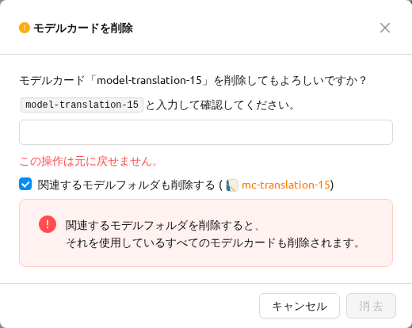

## ファイルブラウザの使用


Backend.AIはバージョン20.09から[FileBrowser](https://filebrowser.org)をサポートしています。FileBrowserは、Webブラウザを通じてリモートサーバー上のファイルを管理できるプログラムです。ユーザーのローカルマシンからディレクトリをアップロードする際に特に便利です。

現在、Backend.AIは計算セッションのアプリケーションとしてFileBrowserを提供しています。したがって、それを起動するためには以下の条件が必要です。

- ユーザーは、少なくとも1つのコンピュートセッションを作成できます。
- ユーザーは少なくとも1コアのCPUと512 MBのメモリを割り当てることができる。
- FileBrowser をサポートするイメージをインストールする必要があります。

ファイルブラウザには2つの方法でアクセスできます。

- ストレージフォルダのファイルエクスプローラダイアログからFileBrowserを実行します。
- セッションページのFileBrowserイメージから直接コンピュートセッションを起動します。


### フォルダエクスプローラダイアログからFileBrowserを実行する

データページに移動し、対象のストレージフォルダのファイルエクスプローラダイアログを開きます。フォルダ名をクリックしてファイルエクスプローラを開きます。


エクスプローラー右上の「ファイルブラウザーを実行」ボタンをクリックします。


FileBrowserが新しいウィンドウで開かれているのがわかります。また、エクスプローラーダイアログで開いたデータフォルダがルートディレクトリになっているのがわかります。FileBrowserウィンドウから、ディレクトリやファイルを自由にアップロード、変更、削除することができます。


ユーザーが 'EXECUTE FILEBROWSER' ボタンをクリックすると、Backend.AI はそのアプリ専用のコンピュートセッションを自動で作成します。したがって、セッションページで FileBrowser のコンピュートセッションが表示されるはずです。このコンピュートセッションを削除するかどうかはユーザーの責任です。

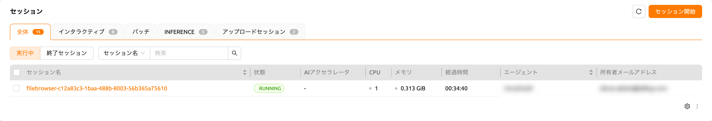


:::note
誤ってFileBrowserウィンドウを閉じてしまい、再度開きたい場合は、セッションページに移動してFileBrowserコンピュートセッションのFileBrowserアプリケーションボタンをクリックします。

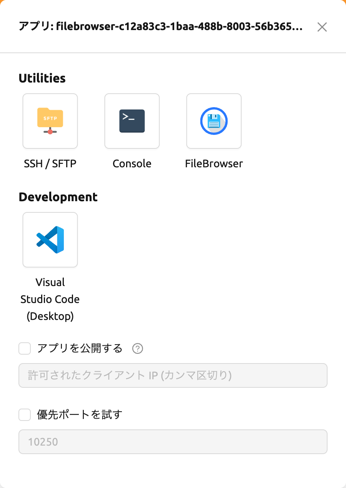

データフォルダーエクスプローラーで 'EXECUTE FILEBROWSER' ボタンを再度クリックすると、新しいコンピュートセッションが作成され、合計で2つのFileBrowserセッションが表示されます。
:::

### FileBrowserイメージでコンピュートセッションを作成する

FileBrowser対応のイメージを使用して直接コンピュートセッションを作成できます。アクセスするには、1つ以上のデータフォルダをマウントする必要があります。どのデータフォルダもマウントしなくても問題なくFileBrowserを使用できますが、セッション終了後にアップロード/更新されたファイルはすべて失われます。


:::note
FileBrowserのルートディレクトリは `/home/work` になります。したがって、コンピュートセッションにマウントされたあらゆるストレージフォルダにアクセスできます。
:::

### FileBrowserの基本的な使用例

ここでは、Backend.AIにおけるFileBrowserの基本的な使用例をいくつか紹介します。FileBrowserの操作のほとんどは直感的ですが、より詳細なガイドが必要な場合は、[FileBrowserのドキュメント](https://filebrowser.org)を参照してください。

**FileBrowserを使用してローカルディレクトリをアップロード**

FileBrowserは、ツリー構造を維持したまま、1つ以上のローカルディレクトリのアップロードをサポートしています。ウィンドウの右上隅にあるアップロードボタンをクリックし、フォルダボタンをクリックします。すると、ローカルファイルエクスプローラのダイアログが表示され、アップロードしたいディレクトリを選択できます。


:::note
読み取り専用フォルダーにファイルをアップロードしようとすると、FileBrowser がサーバーエラーを発生させます。
:::


次の構造を持つディレクトリをアップロードしましょう。

```shell
foo
+-- test
|   +-- test2.txt
+-- test.txt
```

`foo` ディレクトリを選択すると、ディレクトリが正常にアップロードされたことを確認できます。


ドラッグ＆ドロップでローカルファイルやディレクトリをアップロードすることもできます。

**ファイルやディレクトリを別のディレクトリに移動する**

FileBrowserからストレージフォルダ内のファイルやディレクトリを移動することもできます。以下の手順でファイルやディレクトリを移動できます。

1. FileBrowserからディレクトリまたはファイルを選択します。


2. FileBrowser右上の「矢印」ボタンをクリックします。


3. 移動先を選択します。


4. 「MOVE」ボタンをクリックします。

移動操作が正常に完了したことを確認できます。


:::note
現在、FileBrowserはコンピュートセッション内のアプリケーションとして提供されています。セッションを作成せずに独立して実行できるように、FileBrowserを更新する予定です。
:::

## SFTPサーバーの使用


バージョン22.09から、Backend.AIはデスクトップアプリとWebベースのWebUIの両方からSSH / SFTPファイルアップロードをサポートしています。SFTPサーバーを使用すると、信頼性の高いデータストリームを通じてファイルをすばやくアップロードできます。


:::note
システム設定によっては、ファイルダイアログからSFTPサーバーを実行できない場合があります。
:::

### データページのフォルダエクスプローラダイアログからSFTPサーバーを実行する

データページに移動し、対象のストレージフォルダのファイルエクスプローラーダイアログを開きます。フォルダボタンまたはフォルダ名をクリックしてファイルエクスプローラーを開きます。

エクスプローラー右上の「SFTPサーバーを実行」ボタンをクリックします。


SSH / SFTP接続ダイアログが表示されます。新しいSFTPセッションが自動的に作成されます。（このセッションはリソース占有には影響しません。）


接続のために、「SSHキーをダウンロード」ボタンをクリックしてSSH秘密鍵（`id_container`）をダウンロードします。また、ホスト名とポート番号を控えておいてください。その後、ダイアログに記載された接続例のコードを使用して、または以下のガイドを参照してファイルをセッションにコピーできます: [SFTP接続ガイド](../sftp_to_container/sftp_to_container.md#ssh-sftp-container)。ファイルを保持するには、ストレージフォルダにファイルを転送する必要があります。また、一定時間転送がない場合、セッションは終了します。


:::note
SSHキーペアをアップロードすると、`id_container` はユーザー自身のSSH秘密鍵に設定されます。そのため、SSHでコンテナに接続するたびにダウンロードする必要はありません。詳細は[ユーザーのSSHキーペア管理](#user-ssh-keypair-management)を参照してください。
:::

## パイプラインフォルダ

このタブには、FastTrackでパイプラインを実行する際に自動的に作成されるフォルダの一覧が表示されます。パイプラインが作成されると、作業の各インスタンス（コンピュートセッション）ごとに新しいフォルダが作成され、`/pipeline` 配下にマウントされます。

<a id="automount-folder"></a>

## 自動マウントフォルダ


データページには自動マウントフォルダタブがあります。このタブをクリックすると、名前がドット（`.`）で始まるフォルダの一覧が表示されます。フォルダを作成する際にドット（`.`）で始まる名前を指定すると、フォルダタブではなく自動マウントフォルダタブに追加されます。自動マウントフォルダは、コンピュートセッション作成時に手動でマウントしなくても、自動的にホームディレクトリにマウントされる特別なフォルダです。この機能を利用して、`.local`、`.linuxbrew`、`.pyenv` などのストレージフォルダを作成・使用することで、異なる種類のコンピュートセッションでも変わらないユーザーパッケージや環境を構成できます。

自動マウントフォルダの使用方法の詳細については、[自動マウントフォルダの使用例](#using-automount-folder)を参照してください。

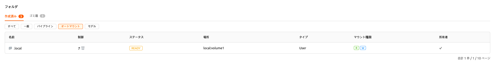

<a id="models"></a>

## モデル


モデルタブは、シンプルなモデルサービングを実現します。[モデルサービング](#model-serving)用の入力データやトレーニングデータなど、必要なデータをモデルフォルダに保存できます。

