# 관리자 기능

관리자 계정으로 로그인 하면 왼쪽 사이드바 하단에 Administration 메뉴가 추가로 보입니다. Backend.AI 에 등록된 사용자 정보는 Users 탭에서 볼 수 있습니다. 슈퍼관리자 권한의 사용자는 모든 사용자의 정보를 확인하거나, 생성 및 삭제할 수 있습니다.

사용자 ID(이메일), 이름(사용자 이름), 역할, 소개는 컬럼 헤더의 검색창에 텍스트를 입력하여 조회 결과를 필터링할 수도 있습니다.

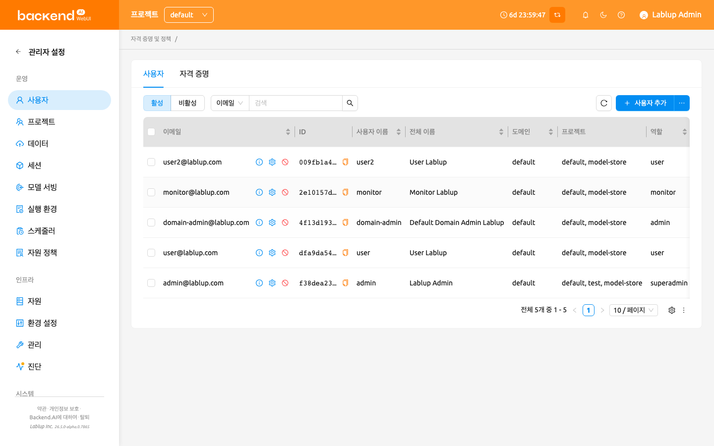

<a id="create-and-update-users"></a>

## 새로운 사용자 생성 및 정보 갱신

사용자는 '+ 사용자 추가' 버튼을 클릭하여 생성할 수 있습니다. 이 때 비밀번호는 8 자 이상, 알파벳/특수문자/숫자를 1 개 이상 포함해야 합니다. 사용자 ID와 이름 필드에는 최대 64 자까지 입력할 수 있습니다.

이미 같은 이메일이나 사용자 이름이 있는 사용자가 존재한다면 사용자를 생성할 수 없습니다. 다른 이메일과 사용자 이름을 사용해 보십시오.

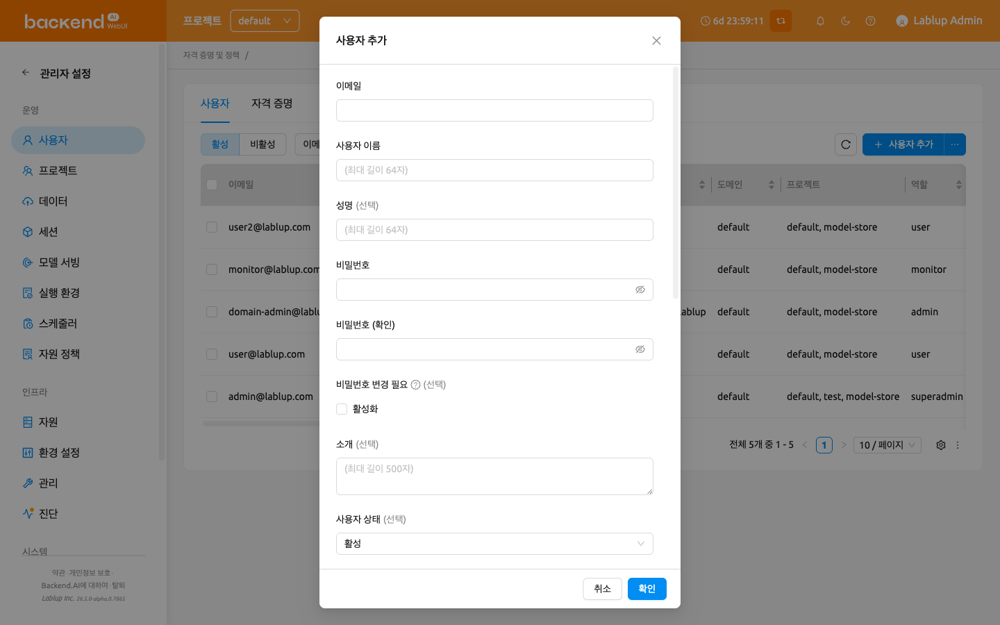

사용자가 생성되었는지 확인합니다.

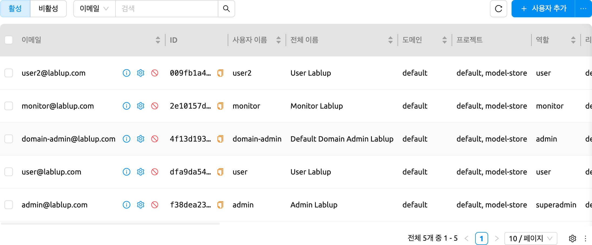

Controls 패널의 초록색 버튼을 클릭하면 더 자세한 사용자 정보를 확인할 수 있습니다. 사용자가 속한 도메인과 프로젝트 정보도 확인할 수 있습니다.

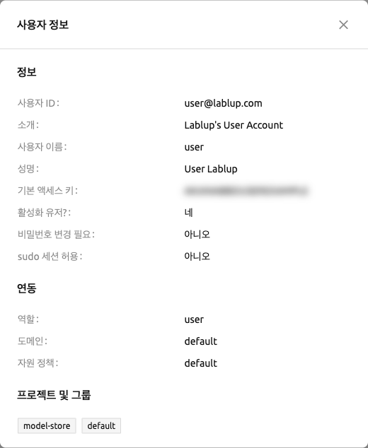

Controls 패널의 '설정 (톱니바퀴)' 버튼을 클릭하면 이미 존재하는 사용자의 정보를 수정할 수 있습니다. 사용자의 이름, 비밀번호, 활성화 상태 등을 변경할 수 있습니다. 사용자 ID는 변경할 수 없습니다.

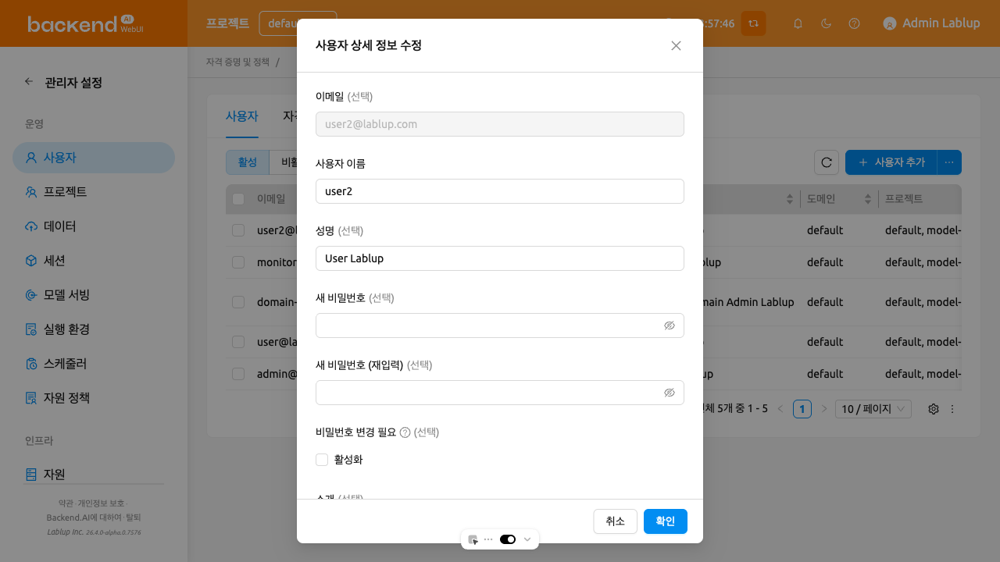

대화 상자 하단의 다섯 가지 항목은 다음과 같은 기능을 가지고 있습니다.

- User Status: 사용자의 상태를 나타냅니다. Inactive 사용자는 로그인할 수 없습니다. Before Verification은 이메일 인증이나 관리자의 승인과 같은 추가 단계를 거쳐야 계정을 활성화할 수 있는 상태를 나타냅니다. Inactive 사용자는 Inactive 탭에 별도로 표시됩니다.

  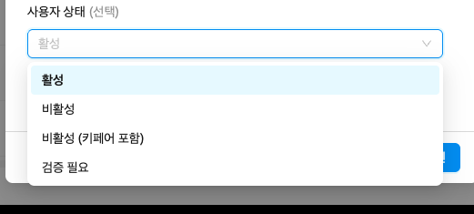

- Require password change?: 관리자가 사용자를 일괄 생성할 때 무작위 비밀번호를 선택한 경우, 이 필드를 ON으로 설정하여 비밀번호 변경이 필요함을 나타낼 수 있습니다. 사용자에게 비밀번호를 업데이트하라고 알리는 상단 바가 표시되지만, 이는 일종의 설명용 플래그로 실제 사용에는 영향을 미치지 않습니다.
- Enable sudo session: 사용자가 연산 세션에서 sudo를 사용할 수 있도록 허용합니다. 이는 사용자가 root 권한이 필요한 패키지를 설치하거나 명령을 실행해야 할 때 유용합니다. 그러나 보안 문제를 일으킬 수 있으므로 모든 사용자에게 이 옵션을 활성화하는 것은 권장되지 않습니다.
- 2FA Enabled: 사용자가 2단계 인증을 사용하는지 여부를 나타내는 플래그입니다. 2단계 인증을 사용하는 경우, 사용자는 로그인 시 추가로 OTP 코드를 입력해야 합니다. 관리자는 다른 사용자의 2단계 인증만 비활성화할 수 있습니다.
- Resource Policy: Backend.AI 버전 24.09부터, 사용자가 속한 사용자 자원 정책을 선택할 수 있습니다. 사용자 자원 정책에 대한 자세한 내용은 [사용자 자원 정책](#user-resource-policy) 섹션을 참고하세요.

<a id="inactivate-user-account"></a>

## 사용자 계정 비활성화

슈퍼관리자라도 사용자 계정을 삭제하는 것은 허용되지 않습니다. 이는 사용자별 사용 통계 추적, 메트릭 보존, 실수로 인한 계정 손실을 방지하기 위함입니다. 대신 관리자는 사용자 계정을 비활성화하여 사용자가 로그인하지 못하도록 할 수 있습니다. Controls 패널의 삭제 아이콘을 클릭합니다. 확인을 요청하는 팝오버가 나타나며, Deactivate 버튼을 클릭하여 사용자를 비활성화할 수 있습니다.

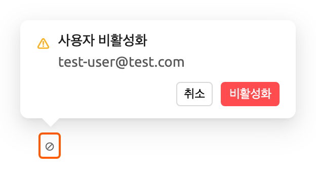

사용자를 다시 활성화하려면 Users - Inactive 탭으로 이동하여 대상 사용자의 상태를 `Active`로 선택합니다.

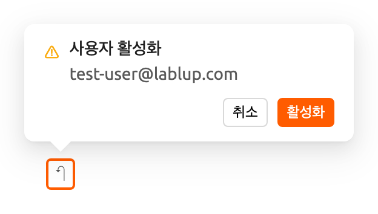

:::note
사용자를 비활성화하거나 다시 활성화해도 사용자의 자격 증명은 변경되지 않습니다. 사용자 계정에는 여러 keypair가 있을 수 있으므로 어떤 자격 증명을 다시 활성화해야 할지 결정하기 어렵기 때문입니다.
:::

<a id="manage-users-keypairs"></a>

## 사용자의 Keypair 관리

각 사용자 계정은 일반적으로 하나 이상의 keypair를 가지고 있습니다. Keypair는 사용자가 로그인한 후 Backend.AI 서버에 대한 API 인증에 사용됩니다. 로그인은 사용자 이메일과 비밀번호를 통한 인증이 필요하지만, 사용자가 서버에 보내는 모든 요청은 keypair를 기반으로 인증됩니다.

사용자는 여러 개의 keypair를 가질 수 있지만, keypair 관리에 대한 사용자의 부담을 줄이기 위해 현재는 사용자의 keypair 중 하나만 사용하여 요청을 보냅니다. 또한 새 사용자를 생성하면 keypair가 자동으로 생성되므로 대부분의 경우 수동으로 keypair를 생성하고 할당할 필요가 없습니다.

Keypair는 Users 페이지의 Credentials 탭에서 확인할 수 있습니다. 활성 keypair는 즉시 표시되며, 비활성 keypair를 보려면 하단의 Inactive 패널을 클릭합니다.


Users 탭과 마찬가지로 Controls 패널의 버튼을 사용하여 keypair 세부 정보를 보거나 업데이트할 수 있습니다. 초록색 정보 아이콘 버튼을 클릭하면 keypair의 구체적인 세부 정보를 확인할 수 있습니다. 필요한 경우 복사 버튼을 클릭하여 secret key를 복사할 수 있습니다.

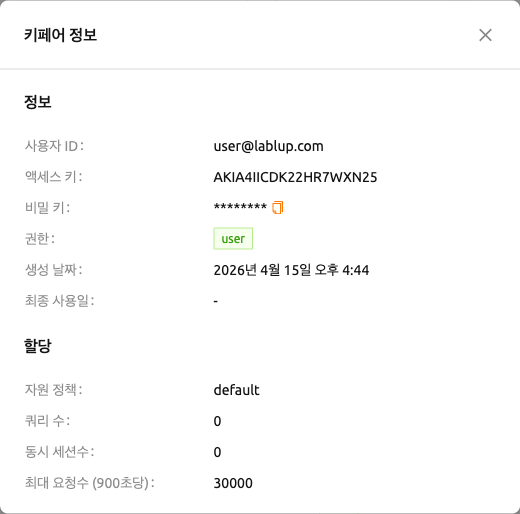

파란색 '설정 (톱니바퀴)' 버튼을 클릭하여 keypair의 자원 정책과 rate limit을 수정할 수 있습니다. 'Rate Limit' 값이 작으면 로그인과 같은 API 작업이 차단될 수 있으므로 주의하시기 바랍니다.

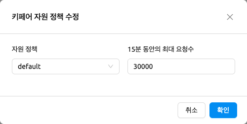

control 열의 빨간색 'Deactivate' 버튼이나 검은색 'Activate' 버튼을 클릭하여 keypair를 비활성화하거나 다시 활성화할 수도 있습니다. User 탭과 달리 Inactive 탭에서는 keypair를 영구적으로 삭제할 수 있습니다. 그러나 현재 사용자의 주요 액세스 키로 사용 중인 keypair는 영구적으로 삭제할 수 없습니다.

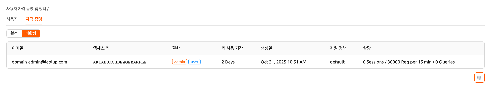

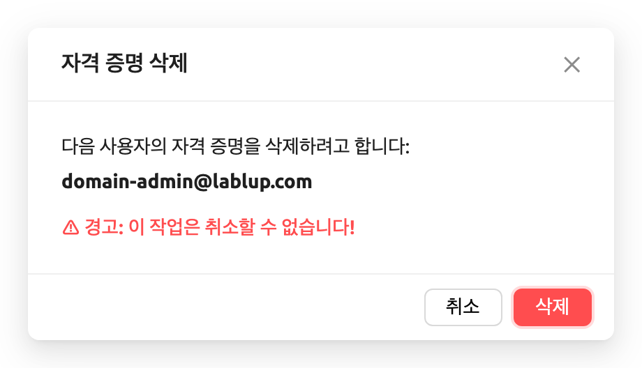

실수로 keypair를 삭제한 경우, 오른쪽 상단의 '+ ADD CREDENTIAL' 버튼을 클릭하여 사용자를 위한 keypair를 다시 생성할 수 있습니다.

Rate Limit 필드는 15분 동안 Backend.AI 서버에 보낼 수 있는 최대 요청 수를 지정하는 곳입니다. 예를 들어 1000으로 설정하면 keypair가 15분 동안 1000개가 넘는 API 요청을 보낼 경우 서버에서 오류를 발생시키고 요청을 수락하지 않습니다. 기본값을 사용하고 사용자의 패턴에 따라 API 요청 빈도가 높아지면 값을 증가시키는 것이 좋습니다.

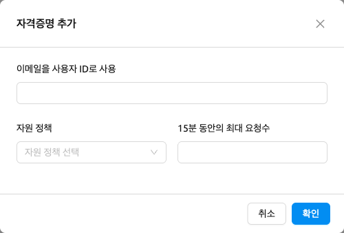

<a id="share-project-storage-folders-with-project-members"></a>

## 프로젝트 구성원과 프로젝트 스토리지 폴더 공유

Backend.AI는 사용자 자신의 스토리지 폴더 외에도 프로젝트를 위한 스토리지 폴더를 제공합니다. 프로젝트 스토리지 폴더는 특정 사용자가 아닌 특정 프로젝트에 속하는 폴더로, 해당 프로젝트의 모든 사용자가 액세스할 수 있습니다.

:::note
프로젝트 폴더는 관리자만 생성할 수 있습니다. 일반 사용자는 관리자가 생성한 프로젝트 폴더의 내용에만 액세스할 수 있습니다. 시스템 설정에 따라 프로젝트 폴더가 허용되지 않을 수 있습니다.
:::

먼저 관리자 계정으로 로그인하여 프로젝트 폴더를 생성합니다. Data 페이지로 이동한 후 'Create Folder'를 클릭하여 폴더 생성 대화 상자를 엽니다. 폴더 이름을 입력하고 Type을 Project로 설정합니다. Type을 Project로 설정하면 헤더의 프로젝트 선택기에서 선택한 프로젝트에 자동으로 할당됩니다. Permission은 Read-Only로 설정합니다.

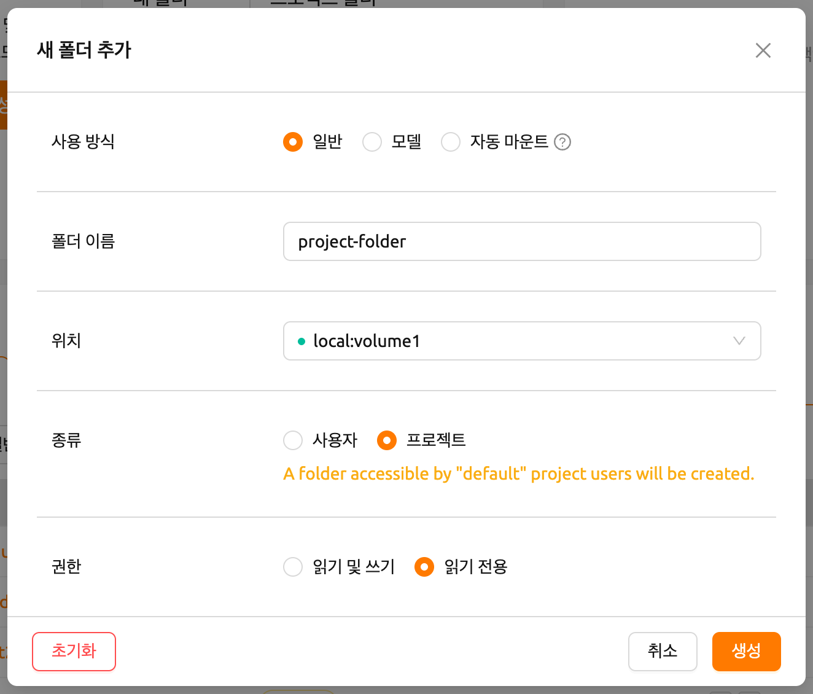

폴더가 생성되었는지 확인한 후 User B의 계정으로 로그인하여 Data & Storage 페이지에 방금 생성한 프로젝트 폴더가 별도의 초대 절차 없이 표시되는지 확인합니다. Permission 패널에도 R (Read Only)이 표시되는 것을 확인할 수 있습니다.

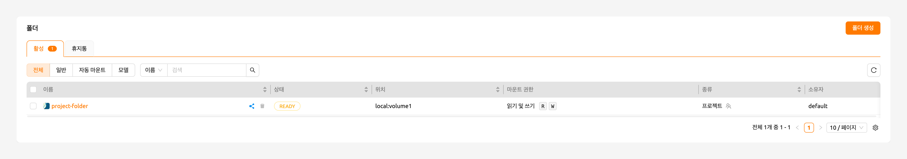

<a id="manage-models-cards"></a>

## 모델 카드 관리

모델 스토어의 모든 모델 카드는 프로젝트 관리자가 관리합니다.
model-definition 파일과 함께 모델 스토어를 업로드하면, 프로젝트의 모든 사용자가
모델 카드에 접근하고 필요 시 복제할 수 있습니다.

다음은 Hugging Face에서 모델 카드를 추가하는 방법입니다.

:::note
모델 카드를 생성하기 전에 Hugging Face의 특정 모델에 대한 접근 권한이 필요합니다.
자세한 내용은 [Gated models](https://huggingface.co/docs/hub/models-gated) 를 참고하세요.
:::

먼저, 프로젝트를 'model-store'로 설정합니다.


데이터 페이지로 이동하여 오른쪽의 '폴더 생성' 버튼을 클릭합니다. 폴더 이름을 입력하고
나머지 폴더 설정을 다음과 같이 구성합니다:

- 사용 방식: Model
- 유형: project
- 권한: Read-Write
- 복제 가능: True

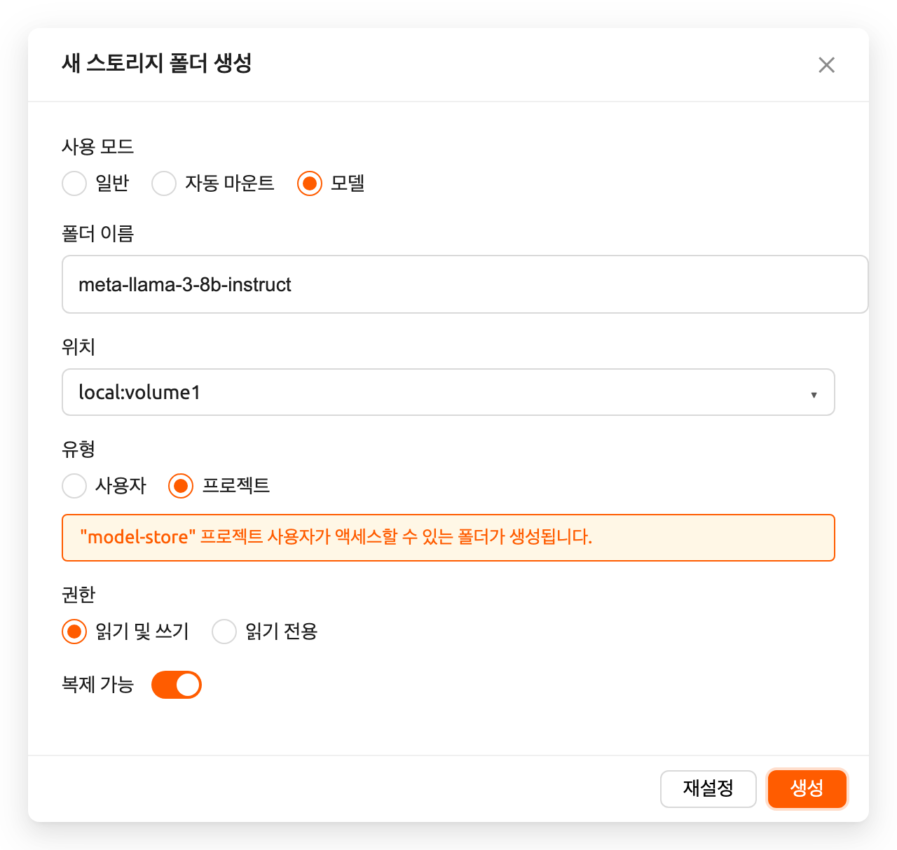

폴더를 생성한 후, 방금 생성한 폴더에 model-definition.yaml 파일을 설정하고 업로드해야 합니다.
다음은 model-definition 파일의 예시입니다.
model-definition 파일 작성 방법에 대한 자세한 내용은
[모델 정의 가이드](#model-definition-guide) 섹션을 참고하세요.

```yaml
models:
  - name: "Llama-3.1-8B-Instruct"
    model_path: "/models/Llama-3.1-8B-Instruct"
    service:
      pre_start_actions:
        - action: run_command
          args:
            command:
              - huggingface-cli
              - download
              - --local-dir
              - /models/Llama-3.1-8B-Instruct
              - --token
              - hf_****
              - meta-llama/Llama-3.1-8B-Instruct
      start_command:
        - /usr/bin/python
        - -m
        - vllm.entrypoints.openai.api_server
        - --model
        - /models/Llama-3.1-8B-Instruct
        - --served-model-name
        - Llama-3.1-8B-Instruct
        - --tensor-parallel-size
        - "1"
        - --host
        - "0.0.0.0"
        - --port
        - "8000"
        - --max-model-len
        - "4096"
      port: 8000
      health_check:
        path: /v1/models
        max_retries: 500
```

model-definition 파일이 업로드되면 모델 스토어 페이지에 모델 카드가 나타납니다.


:::note
model-definition 파일을 설정한 후 모델을 수동으로 다운로드해야 합니다. 폴더에 모델 파일을 다운로드하려면
세션 생성 시 모델 폴더를 마운트하고 [Downloading models](https://huggingface.co/docs/hub/models-downloading) 를 참고하여
해당 위치에 파일을 다운로드할 수 있습니다.
:::

방금 생성한 모델 카드를 클릭하면 업로드한 model-definition 파일의 상세 정보가 표시됩니다.
이제 프로젝트의 모든 구성원이 모델 카드에 접근하고 복제할 수 있습니다.

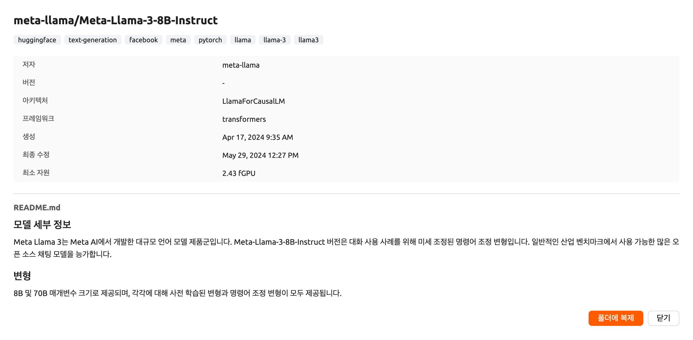

모델 카드에서 "이 모델로 서비스 만들기" 버튼을 활성화하려면, 폴더에
`model-definition.yaml`과 `service-definition.toml` 파일이 모두 존재해야
합니다. 두 파일 중 하나라도 없으면 버튼이 비활성화됩니다. 서비스 정의 파일을
생성하는 방법에 대한 자세한 내용은 모델 서빙 문서의
[서비스 정의 파일](#service-definition-file)
섹션을 참고하세요.

<a id="model-store-page"></a>

## 모델 스토어 페이지

모델 스토어 페이지는 관리자가 사전 구성한 모델을 사용자가 탐색하고 활용할 수 있는 페이지입니다. 사이드바에서 모델 스토어 페이지로 이동하면, 모델 스토어 프로젝트에서 등록된 모든 모델 카드를 확인할 수 있습니다.

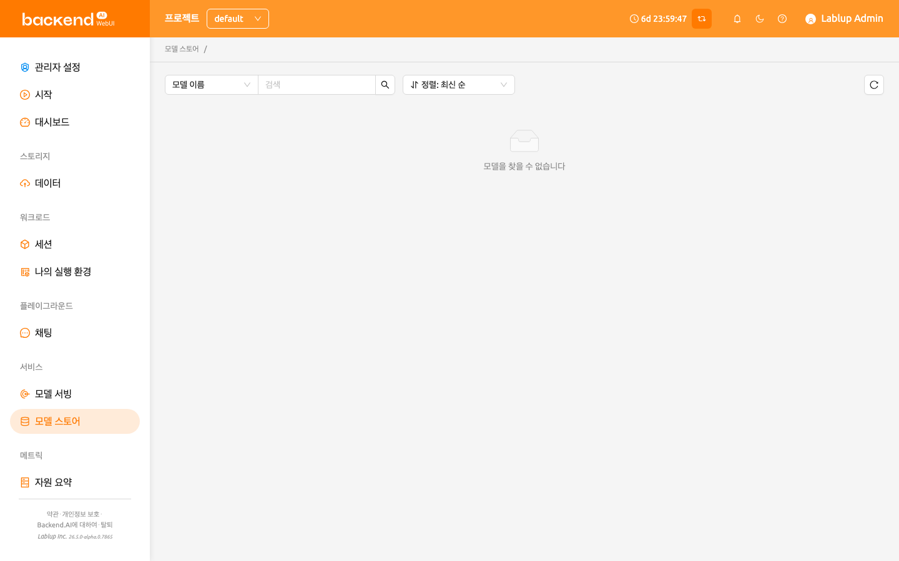

각 모델 카드는 다음과 같은 주요 정보를 표시합니다:

- 모델 이름 (폴더 이름)
- README 내용 (폴더에 README 파일이 있는 경우)
- model-definition.yaml 파일의 메타데이터
- 모델과 상호작용하기 위한 액션 버튼

모델 카드를 클릭하면 전체 README 내용과 사용 가능한 액션이 포함된 상세 보기가 열립니다.

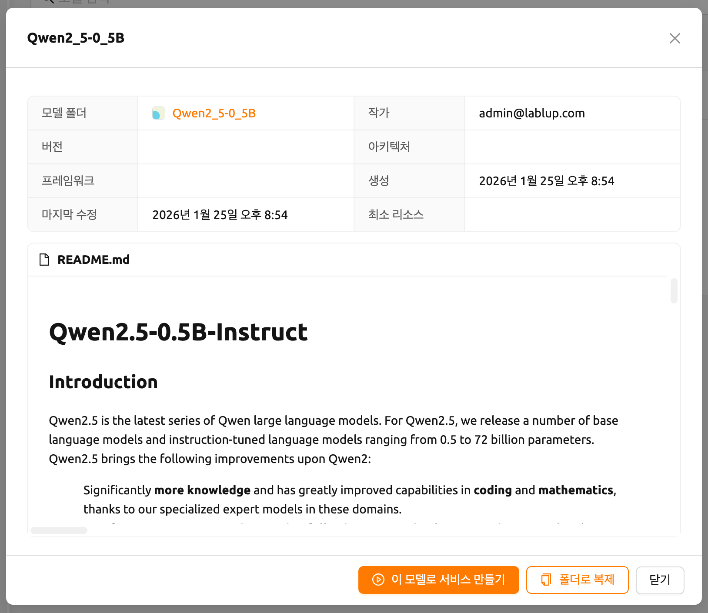

<a id="clone-to-folder"></a>

### 폴더로 복제

"폴더로 복제" 버튼을 사용하면 모델 스토어 폴더의 개인 사본을 생성할 수 있습니다. 모델 스토어 폴더는 읽기 전용이며 프로젝트 전체에서 공유되므로, 파일을 수정하거나 맞춤 워크플로에서 사용하려면 자신의 스토리지로 복제해야 합니다.

모델 폴더를 복제하려면:

1. 모델 카드에서 "폴더로 복제" 버튼을 클릭합니다.
2. 복제 대화 상자에서 다음 설정을 구성합니다:
   - **폴더 이름**: 복제할 폴더의 이름입니다. (기본값은 원래 이름에 임의 접미사가 추가됩니다)
   - **권한**: 복제된 폴더의 접근 권한을 설정합니다. (읽기 전용 또는 읽기-쓰기)
   - **사용 방식**: 폴더 유형을 선택합니다. (일반, 모델 또는 자동 마운트)
3. "복제" 버튼을 클릭하여 복제 프로세스를 시작합니다.


:::note
현재 폴더 복제는 동일한 스토리지 호스트 내에서만 지원됩니다.
:::

복제가 완료되면, 새 폴더가 선택한 사용 방식에 따라 데이터 페이지의 해당 탭에 표시됩니다.

<a id="create-service-from-this-model"></a>

### 이 모델로 서비스 만들기

"이 모델로 서비스 만들기" 버튼을 사용하면 모델 카드에서 한 번의 클릭으로 모델 서비스를 바로 생성할 수 있습니다. 이 기능은 모델 폴더 복제와 모델 서비스 엔드포인트 생성 과정을 자동화합니다.

:::note
이 버튼을 활성화하려면 다음 조건이 충족되어야 합니다:
- 모델 폴더에 `model-definition.yaml`과 `service-definition.toml` 파일이 모두 존재해야 합니다. 하나라도 없으면 버튼이 비활성화되며, 어떤 파일이 필요한지 안내하는 툴팁이 표시됩니다.
- 모델 서비스를 생성할 수 있는 충분한 자원 쿼터가 있어야 합니다.
- 자원 그룹이 추론 세션 유형을 허용해야 합니다.
:::

<a id="service-creation-workflow"></a>

#### 서비스 생성 워크플로

"이 모델로 서비스 만들기" 버튼을 클릭하면, Backend.AI는 다음 워크플로를 따릅니다:

1. **필수 파일 확인**: 시스템이 폴더에 model-definition.yaml과 service-definition.toml이 모두 존재하는지 확인합니다.

2. **폴더 복제 (필요한 경우)**: 모델 폴더의 복제본이 없는 경우:
   - 폴더를 복제할 것인지 묻는 확인 대화 상자가 나타납니다.
   - 폴더가 `{원래 이름}-{임의 4자리}` 형식의 이름으로 복제됩니다.
   - 알림으로 복제 진행 상황이 표시됩니다.


3. **서비스 생성**: 폴더가 준비되면 (이전에 복제했거나 방금 복제한 경우):
   - service-definition.toml의 설정을 사용하여 서비스가 자동으로 생성됩니다.
   - 알림으로 서비스 생성 진행 상황이 표시됩니다.
   - 알림을 클릭하면 모델 서빙 페이지로 이동할 수 있습니다.

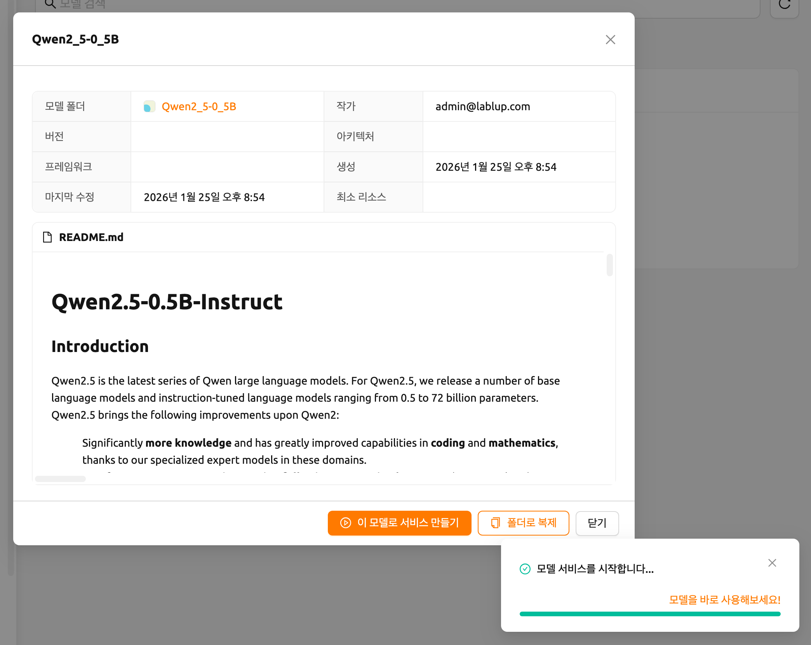

4. **서비스 상세 정보 확인**: 생성이 완료되면, 모델 서빙 페이지로 이동하여 엔드포인트 상세 정보를 확인하고, 서비스 상태를 모니터링하며, 서비스를 관리할 수 있습니다.

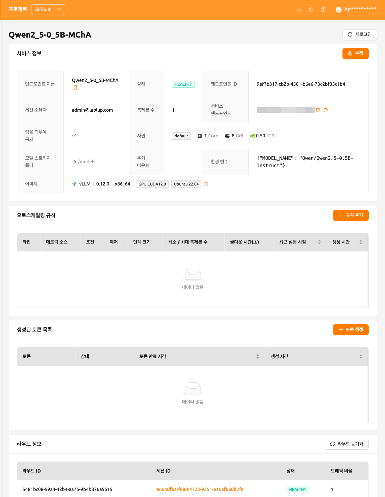

:::note
이전 작업에서 복제한 폴더가 이미 존재하는 경우, 시스템이 자동으로 해당 폴더를
사용하여 서비스를 생성합니다. 향후 릴리스에서는 복제본이 여러 개 있을 경우
어떤 폴더를 사용할지 선택할 수 있는 기능이 추가될 예정입니다.
:::

<a id="troubleshooting"></a>

#### 문제 해결

서비스 생성에 실패한 경우:

- model-definition.yaml과 service-definition.toml의 형식이 올바른지 확인하세요.
- 자원 쿼터가 새 모델 서비스 생성을 허용하는지 확인하세요.
- 모델 서빙 페이지에서 서비스 상태의 오류 메시지를 확인하세요.
- 자세한 문제 해결 단계는 [모델 서빙](#model-serving) 문서를 참고하세요.

모델 서비스, 서비스 구성 및 엔드포인트 관리에 대한 자세한 내용은 [모델 서빙](#model-serving) 문서를 참고하세요.

<a id="manage-resource-policy"></a>

## 자원 정책 관리

<a id="keypair-resource-policy"></a>

#### Keypair 자원 정책

Backend.AI에서 관리자는 각 keypair, 사용자, 프로젝트에 사용 가능한 총 자원에 대한 제한을 설정할 수 있습니다. 자원 정책을 통해 허용되는 최대 자원과 기타 연산 세션 관련 설정을 정의할 수 있습니다. 또한 사용자 또는 연구 요구 사항과 같은 다양한 필요에 맞는 여러 자원 정책을 생성하고 개별적으로 적용할 수 있습니다.

Resource Policy 페이지에서 관리자는 등록된 모든 자원 정책의 목록을 볼 수 있습니다. 관리자는 이 페이지에서 keypair, 사용자, 프로젝트에 대해 설정된 자원 정책을 직접 검토할 수 있습니다. keypair에 대한 자원 정책을 먼저 살펴보겠습니다. 아래 그림에는 총 세 가지 정책(gardener, student, default)이 있습니다. 무한대 기호(∞)는 해당 자원에 자원 제한이 적용되지 않았음을 나타냅니다.

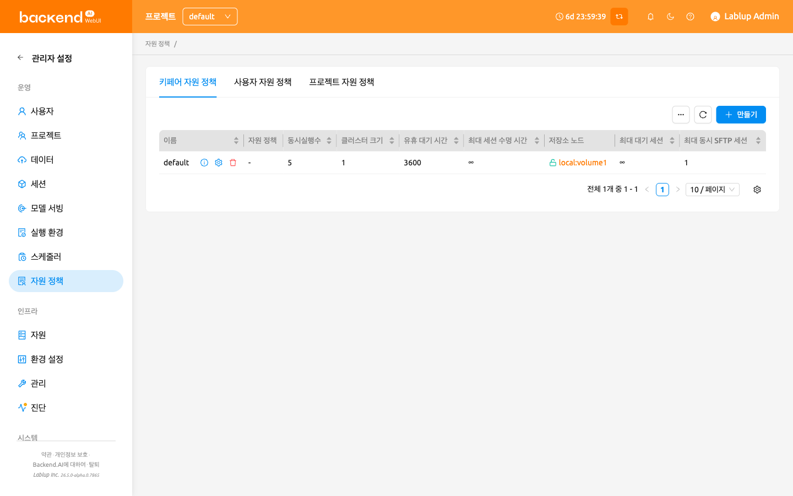

이 가이드에서 사용되는 사용자 계정은 현재 default 자원 정책에 할당되어 있습니다. 이는 Users 페이지의 Credentials 탭에서 확인할 수 있습니다. Resource Policy 패널에서 모든 자원 정책이 default로 설정되어 있음을 확인할 수도 있습니다.


자원 정책을 수정하려면 default 정책 그룹의 Control 열에서 '설정 (톱니바퀴)'를 클릭합니다. Update Resource Policy 대화 상자에서 목록의 자원 정책을 구분하는 기본 키 역할을 하는 Policy Name을 제외한 모든 옵션을 편집할 수 있습니다. CPU, RAM, fGPU 하단의 Unlimited 체크박스를 해제하고 자원 제한을 원하는 값으로 설정합니다. 할당된 자원이 전체 하드웨어 용량보다 적은지 확인하세요. 이 경우 CPU, RAM, fGPU를 각각 2, 4, 1로 설정합니다. OK 버튼을 클릭하여 업데이트된 자원 정책을 적용합니다.

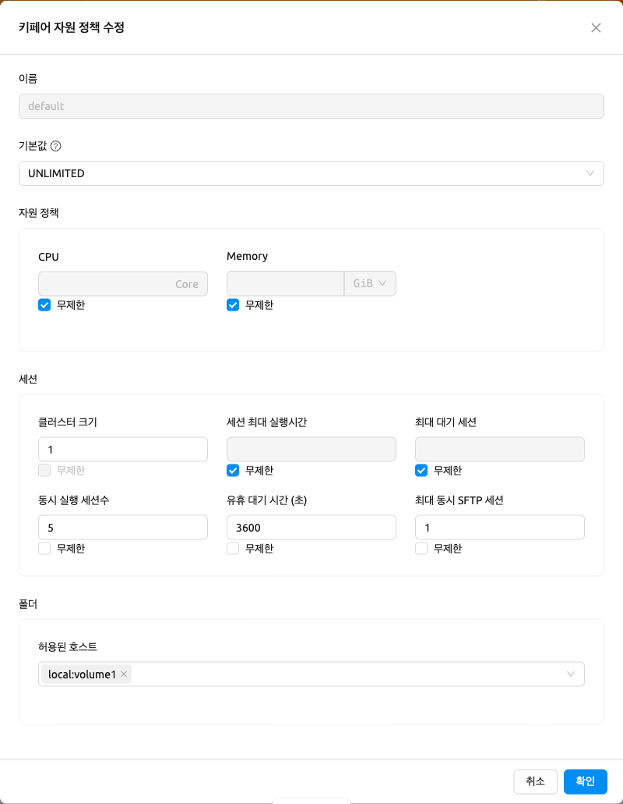

자원 정책 대화 상자의 각 옵션에 대한 세부 정보는 아래 설명을 참조하세요.

- Resource Policy
  - CPU: 최대 CPU 코어 수를 지정합니다. (최대값: 512)
  - Memory: 최대 메모리 양을 GB 단위로 지정합니다. 메모리를 GPU 메모리의 최대값보다 두 배 크게 설정하는 것이 좋습니다. (최대값: 1024)
  - CUDA-capable GPU: 최대 물리적 GPU 수를 지정합니다. 서버에서 fractional GPU가 활성화된 경우 이 설정은 효과가 없습니다. (최대값: 64)
  - CUDA-capable GPU (fractional): Fractional GPU (fGPU)는 GPU를 효율적으로 사용하기 위해 단일 GPU를 여러 파티션으로 분할하는 기능입니다. 필요한 최소 fGPU 양은 각 이미지에 따라 다릅니다. 서버에서 fractional GPU가 활성화되지 않은 경우 이 설정은 효과가 없습니다. (최대값: 256)

- Sessions
  - Cluster Size: 세션을 생성할 때 구성할 수 있는 멀티 컨테이너 또는 멀티 노드 수의 최대 제한을 설정합니다.
  - Session Lifetime (sec.): `PENDING` 및 `RUNNING` 상태를 포함하여 활성 상태에서 예약된 연산 세션의 최대 수명을 제한합니다. 이 시간이 지나면 세션이 완전히 활용되고 있더라도 강제 종료됩니다. 이는 세션이 무기한으로 실행되는 것을 방지하는 데 유용합니다.
  - Max Pending Session Count: 동시에 `PENDING` 상태에 있을 수 있는 최대 연산 세션 수입니다.
  - Concurrent Jobs: keypair당 최대 동시 연산 세션 수입니다. 예를 들어 이 값이 3으로 설정된 경우, 이 자원 정책에 바인딩된 사용자는 동시에 3개 이상의 연산 세션을 생성할 수 없습니다. (최대값: 100)
  - Idle timeout (sec.): 사용자가 세션을 그대로 둘 수 있는 구성 가능한 기간입니다. idle timeout 동안 연산 세션에 아무런 활동이 없으면 세션이 자동으로 가비지 수집되고 삭제됩니다. "유휴"의 기준은 다양할 수 있으며 관리자가 설정합니다. (최대값: 15552000 (약 180일))
  - Max Concurrent SFTP Sessions: 최대 동시 SFTP 세션 수입니다.

- Folders
  - Allowed hosts: Backend.AI는 많은 NFS 마운트 포인트를 지원합니다. 이 필드는 이들에 대한 접근성을 제한합니다. "data-1"이라는 NFS가 Backend.AI에 마운트되어 있더라도 자원 정책에서 허용하지 않으면 사용자가 액세스할 수 없습니다.
  - (23.09.4 이후 더 이상 사용되지 않음) Max. #: 생성/초대할 수 있는 스토리지 폴더의 최대 수입니다. (최대값: 100).

keypair 자원 정책 목록에서 default 정책의 Resources 값이 업데이트되었는지 확인합니다.

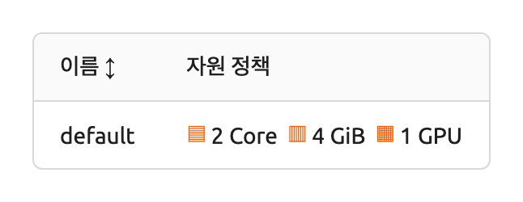

'+ Create' 버튼을 클릭하여 새 자원 정책을 생성할 수 있습니다. 각 설정 값은 위에서 설명한 것과 동일합니다.

자원 정책을 생성하고 keypair와 연결하려면 Users 페이지의 Credentials 탭으로 이동하여 원하는 keypair의 Controls 열에 있는 톱니바퀴 버튼을 클릭하고 Select Policy 필드를 클릭하여 선택합니다.

Control 열의 휴지통 아이콘을 클릭하여 각 자원 keypair를 삭제할 수도 있습니다. 아이콘을 클릭하면 확인 팝업이 나타납니다. 'Delete' 버튼을 클릭하여 삭제합니다.

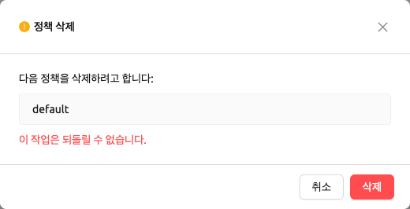

:::note
삭제할 자원 정책을 따르는 사용자(비활성 사용자 포함)가 있으면 삭제할 수 없습니다. 자원 정책을 삭제하기 전에 해당 자원 정책 아래에 남아있는 사용자가 없는지 확인하십시오.
:::

특정 열을 숨기거나 표시하려면 테이블 오른쪽 하단의 '설정 (톱니바퀴)'를 클릭합니다. 표시하려는 열을 선택할 수 있는 대화 상자가 나타납니다.

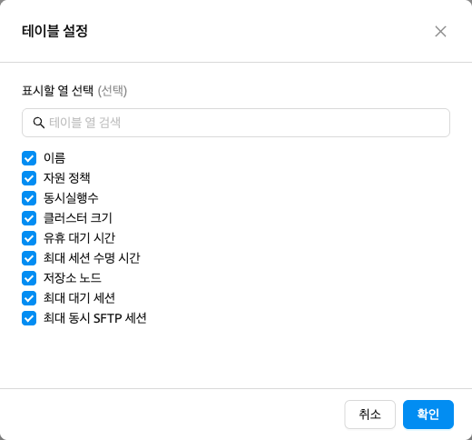

<a id="user-resource-policy"></a>

#### 사용자 자원 정책

버전 24.03부터 Backend.AI는 사용자 자원 정책 관리를 지원합니다. 각 사용자는 여러 keypair를 가질 수 있지만, 사용자는 하나의 사용자 자원 정책만 가질 수 있습니다. 사용자 자원 정책 페이지에서는 Max Folder Count 및 Max Folder Size와 같은 폴더 관련 다양한 설정에 대한 제한뿐만 아니라 Max Session Count Per Model Session 및 Max Customized Image Count와 같은 개별 자원 제한도 설정할 수 있습니다.

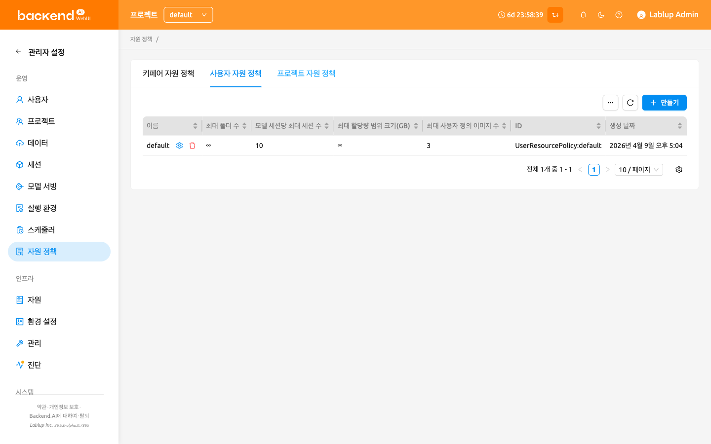

새 사용자 자원 정책을 생성하려면 Create 버튼을 클릭합니다.

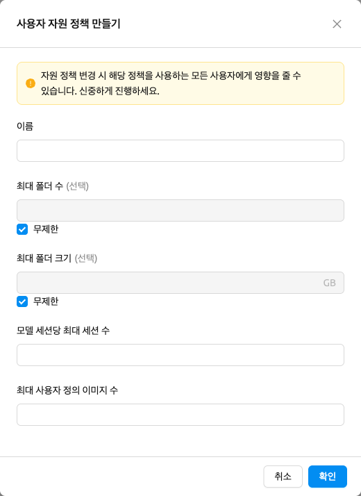

- Name: 사용자 자원 정책의 이름입니다.
- Max Folder Count: 사용자가 생성할 수 있는 최대 폴더 수입니다. 사용자의 폴더 수가 이 값을 초과하면 새 폴더를 생성할 수 없습니다. Unlimited로 설정하면 "∞"로 표시됩니다.
- Max Folder Size: 사용자의 스토리지 공간의 최대 크기입니다. 사용자의 스토리지 공간이 이 값을 초과하면 새 데이터 폴더를 생성할 수 없습니다. Unlimited로 설정하면 "∞"로 표시됩니다.
- Max Session Count Per Model Session: 사용자가 생성한 모델 서비스당 사용 가능한 최대 세션 수입니다. 이 값을 증가시키면 세션 스케줄러에 과부하가 걸리고 잠재적으로 시스템 다운타임으로 이어질 수 있으므로 이 설정을 조정할 때 주의하시기 바랍니다.
- Max Customized Image Count: 사용자가 생성할 수 있는 최대 커스터마이징된 이미지 수입니다. 사용자의 커스터마이징된 이미지 수가 이 값을 초과하면 새 커스터마이징된 이미지를 생성할 수 없습니다. 커스터마이징된 이미지에 대해 자세히 알아보려면 [My Environments](#my-environments) 섹션을 참고하세요.

업데이트하려면 control 열의 '설정 (톱니바퀴)' 버튼을 클릭합니다. 삭제하려면 휴지통 버튼을 클릭합니다.

:::note
자원 정책을 변경하면 해당 정책을 사용하는 모든 사용자에게 영향을 미칠 수 있으므로 주의하여 사용하십시오.
:::

keypair 자원 정책과 마찬가지로 테이블 오른쪽 하단의 '설정 (톱니바퀴)' 버튼을 클릭하여 원하는 열만 선택하고 표시할 수 있습니다.

<a id="project-resource-policy"></a>

#### 프로젝트 자원 정책

버전 24.03부터 Backend.AI는 프로젝트 자원 정책 관리를 지원합니다. 프로젝트 자원 정책은 프로젝트의 스토리지 공간(쿼터) 및 폴더 관련 제한을 관리합니다.

Resource Policy 페이지의 Project 탭을 클릭하면 프로젝트 자원 정책 목록을 볼 수 있습니다.

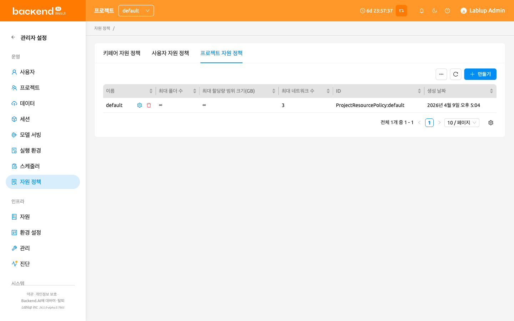

새 프로젝트 자원 정책을 생성하려면 테이블 오른쪽 상단의 '+ Create' 버튼을 클릭합니다.

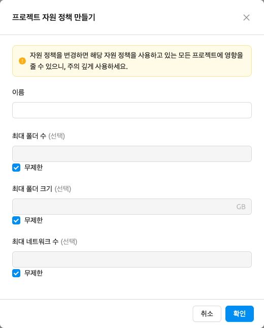

- Name: 프로젝트 자원 정책의 이름입니다.
- Max Folder Count: 관리자가 생성할 수 있는 최대 프로젝트 폴더 수입니다. 프로젝트 폴더 수가 이 값을 초과하면 관리자는 새 프로젝트 폴더를 생성할 수 없습니다. Unlimited로 설정하면 "∞"로 표시됩니다.
- Max Folder Size: 프로젝트의 스토리지 공간의 최대 크기입니다. 프로젝트의 스토리지 공간이 이 값을 초과하면 관리자는 새 프로젝트 폴더를 생성할 수 없습니다. Unlimited로 설정하면 "∞"로 표시됩니다.
- Max Network Count: Backend.AI 버전 24.12부터 프로젝트에 생성할 수 있는 최대 네트워크 수입니다. Unlimited로 설정하면 "∞"로 표시됩니다.

각 필드의 의미는 사용자 자원 정책과 유사합니다. 차이점은 프로젝트 자원 정책은 프로젝트 폴더에 적용되고 사용자 자원 정책은 사용자 폴더에 적용된다는 점입니다.

변경하려면 control 열의 '설정 (톱니바퀴)' 버튼을 클릭합니다. 자원 정책 이름은 편집할 수 없습니다. 삭제는 휴지통 아이콘 버튼을 클릭하여 수행할 수 있습니다.

:::note
자원 정책을 변경하면 해당 정책을 사용하는 모든 사용자에게 영향을 미칠 수 있으므로 주의하여 사용하십시오.
:::

테이블 오른쪽 하단의 '설정 (톱니바퀴)' 버튼을 클릭하여 원하는 열만 선택하고 표시할 수 있습니다.

현재 자원 정책을 파일로 저장하려면 각 탭의 왼쪽 상단에 있는 'Tools' 메뉴를 클릭합니다. 메뉴를 클릭하면 다운로드 대화 상자가 나타납니다.

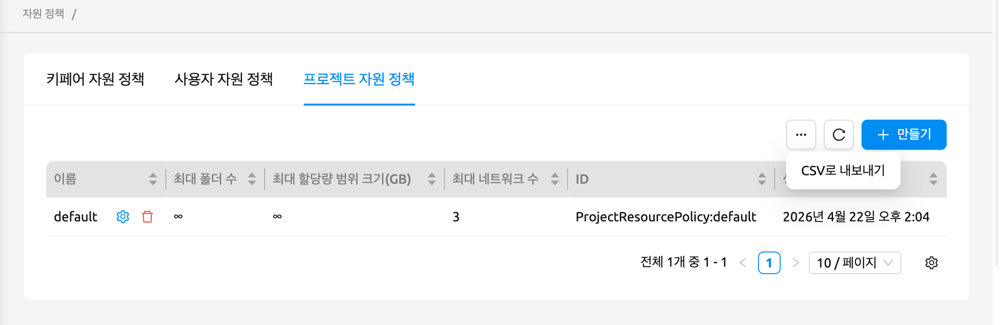

<a id="unified-view-for-pending-sessions"></a>

## 대기 중인 세션에 대한 통합 보기

Backend.AI 버전 25.13.0부터 관리자 메뉴에서 대기 중인 세션에 대한 통합 보기를 사용할 수 있습니다. Session 페이지와 달리 Scheduler 페이지는 선택한 자원 그룹 내의 모든 대기 중인 세션에 대한 통합 보기를 제공합니다. 상태 옆에 표시되는 인덱스 번호는 충분한 자원이 사용 가능해지면 세션이 생성될 대기열 위치를 나타냅니다.

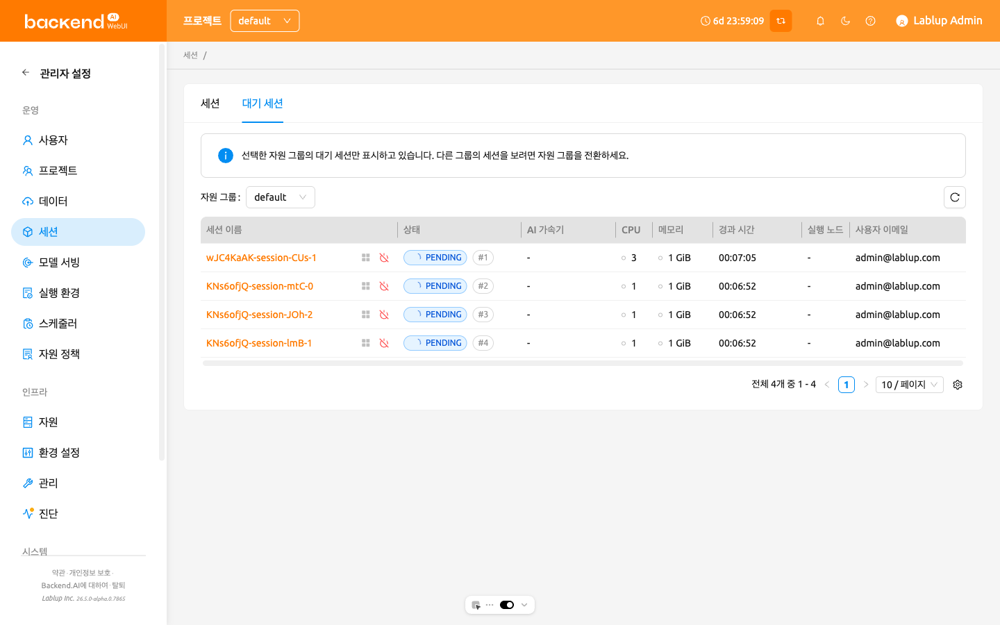

Session 페이지와 마찬가지로 세션 이름을 클릭하면 세션에 대한 자세한 정보를 표시하는 drawer가 열립니다.

<a id="manage-images"></a>

## 이미지 관리

관리자는 Environments 페이지의 Images 탭에서 연산 세션을 생성하는 데 사용되는 이미지를 관리할 수 있습니다. 이 탭에는 현재 Backend.AI 서버에 있는 모든 이미지의 메타 정보가 표시됩니다. 각 이미지에 대한 registry, namespace, 이미지 이름, 이미지 기반 OS, digest, 필요한 최소 자원과 같은 정보를 확인할 수 있습니다. 하나 이상의 에이전트 노드에 다운로드된 이미지의 경우 각 Status 열에 `installed` 태그가 표시됩니다.

:::note
특정 에이전트를 선택하여 이미지를 설치하는 기능은 현재 개발 중입니다.
:::

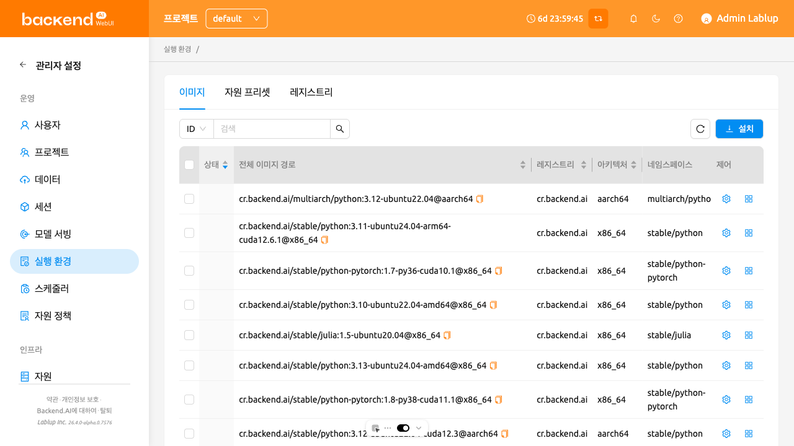

Controls 패널의 '설정 (톱니바퀴)'를 클릭하여 각 이미지의 최소 자원 요구 사항을 변경할 수 있습니다. 각 이미지에는 최소 작동을 위한 하드웨어 및 자원 요구 사항이 있습니다. (예를 들어 GPU 전용 이미지의 경우 최소 할당 GPU가 있어야 합니다.) 최소 자원 양의 기본값은 이미지의 메타데이터에 포함되어 제공됩니다. 각 이미지에 지정된 자원 양보다 적은 자원으로 연산 세션을 생성하려고 하면 요청이 취소되지 않고 이미지의 최소 자원 요구 사항으로 자동 조정된 후 생성됩니다.

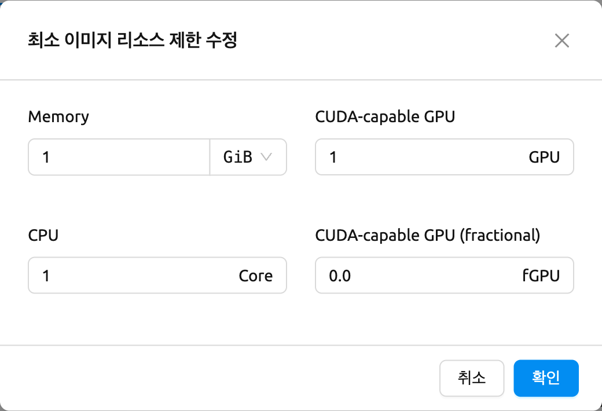

:::note
최소 자원 요구 사항을 사전 정의된 값보다 작은 양으로 변경하지 마십시오! 이미지 메타데이터에 포함된 최소 자원 요구 사항은 테스트를 거쳐 결정된 값입니다. 변경하려는 최소 자원 양에 대해 확실하지 않다면 기본값으로 유지하십시오.
:::

또한 Controls 열의 'Apps' 아이콘을 클릭하여 각 이미지에 지원되는 앱을 추가하거나 수정할 수 있습니다. 아이콘을 클릭하면 앱 이름과 해당 포트 번호가 표시됩니다.

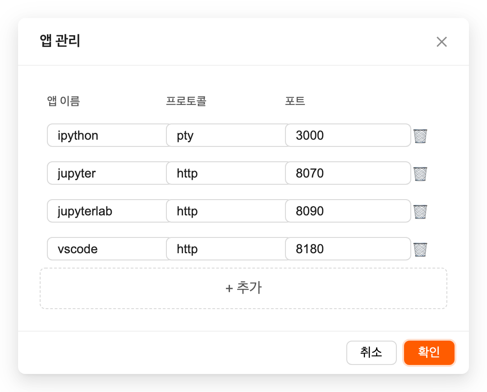

이 인터페이스에서 아래의 '+ Add' 버튼을 클릭하여 지원되는 커스텀 애플리케이션을 추가할 수 있습니다. 애플리케이션을 삭제하려면 각 행의 오른쪽에 있는 '빨간색 휴지통' 버튼을 클릭하기만 하면 됩니다.

:::note
관리되는 앱을 변경한 후에는 이미지를 다시 설치해야 합니다.

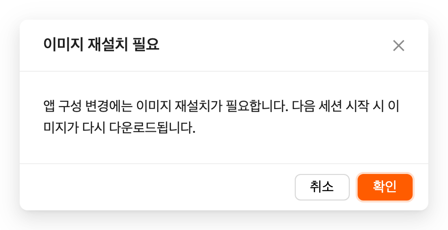
:::

<a id="manage-docker-registry"></a>

## Docker 레지스트리 관리

Environments 페이지의 Registries 탭을 클릭하면 현재 연결된 Docker 레지스트리의 정보를 확인할 수 있습니다. `cr.backend.ai`가 기본으로 등록되어 있으며, Harbor에서 제공하는 레지스트리입니다.

:::note
오프라인 환경에서는 기본 레지스트리에 접근할 수 없으므로 오른쪽의 휴지통 아이콘을 클릭하여 삭제합니다.
:::

Controls의 새로고침 아이콘을 클릭하면 연결된 레지스트리에서 Backend.AI용 이미지 메타데이터를 업데이트합니다. 레지스트리에 저장된 이미지 중 Backend.AI용 레이블이 없는 이미지 정보는 업데이트되지 않습니다.

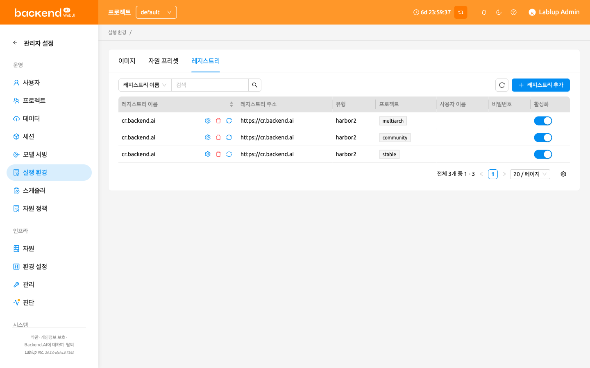

'+ Add Registry' 버튼을 클릭하여 자신만의 프라이빗 Docker 레지스트리를 추가할 수 있습니다. Registry Name과 Registry URL 주소는 동일하게 설정해야 하며, Registry URL의 경우 `http://` 또는 `https://`와 같은 스킴을 명시적으로 붙여야 합니다. 또한 레지스트리에 저장된 이미지는 Registry Name을 접두사로 하는 이름이어야 합니다. Username과 Password는 선택 사항이며, 레지스트리에 별도의 인증 설정을 한 경우 입력할 수 있습니다. Extra Information에서는 각 레지스트리 유형에 필요한 추가 정보를 JSON 문자열로 전달할 수 있습니다.

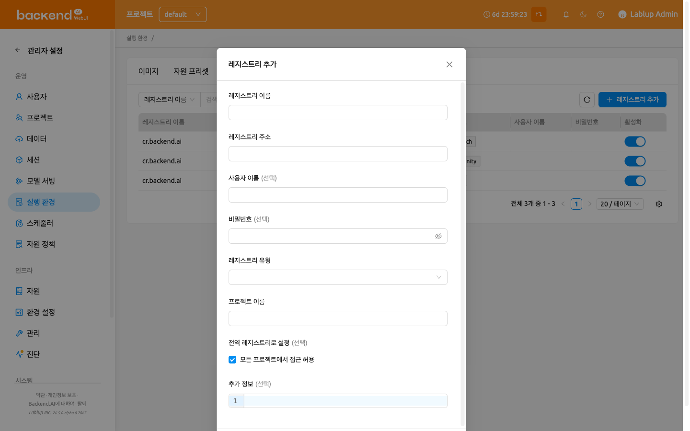

#### GitLab Container Registry 구성

GitLab 컨테이너 레지스트리를 추가할 때는 Extra Information 필드에 `api_endpoint`를 지정해야 합니다. 이는 GitLab이 컨테이너 레지스트리와 GitLab API에 별도의 엔드포인트를 사용하기 때문입니다.

**GitLab.com (공개 인스턴스)**의 경우:

- Registry URL: `https://registry.gitlab.com`
- Extra Information: `{"api_endpoint": "https://gitlab.com"}`

**자체 호스팅 (온프레미스) GitLab**의 경우:

- Registry URL: GitLab 레지스트리 URL (예: `https://registry.example.com`)
- Extra Information: `{"api_endpoint": "https://gitlab.example.com"}`

:::note
`api_endpoint`는 레지스트리 URL이 아닌 GitLab 인스턴스 URL을 가리켜야 합니다.
:::

추가 구성 참고 사항:

- **프로젝트 경로 형식**: 프로젝트를 지정할 때 네임스페이스와 프로젝트 이름을 포함한 전체 경로를 사용합니다 (예: `namespace/project-name`). 레지스트리가 올바르게 작동하려면 두 구성 요소가 모두 필요합니다.

- **액세스 토큰 권한**: 레지스트리에 사용되는 액세스 토큰에는 `read_registry`와 `read_api` 스코프가 모두 있어야 합니다. `read_api` 스코프는 Backend.AI가 재스캔 작업 시 이미지 메타데이터를 위해 GitLab API를 쿼리하는 데 필요합니다.

기존 레지스트리의 정보를 업데이트할 수도 있습니다. 단, Registry Name은 변경할 수 없습니다.

레지스트리를 생성하고 이미지 메타데이터를 업데이트한 후에도 사용자가 이미지를 바로 사용할 수 있는 것은 아닙니다. 레지스트리 목록에서 Enabled 스위치를 토글하여 레지스트리를 활성화해야 사용자가 해당 레지스트리의 이미지에 접근할 수 있습니다.

<a id="manage-resource-preset"></a>

## 자원 프리셋 관리

다음에 나열된 사전 정의된 자원 프리셋은 연산 세션을 생성할 때 Resource allocation 패널에 표시됩니다. 슈퍼관리자는 이러한 자원 프리셋을 관리할 수 있습니다.

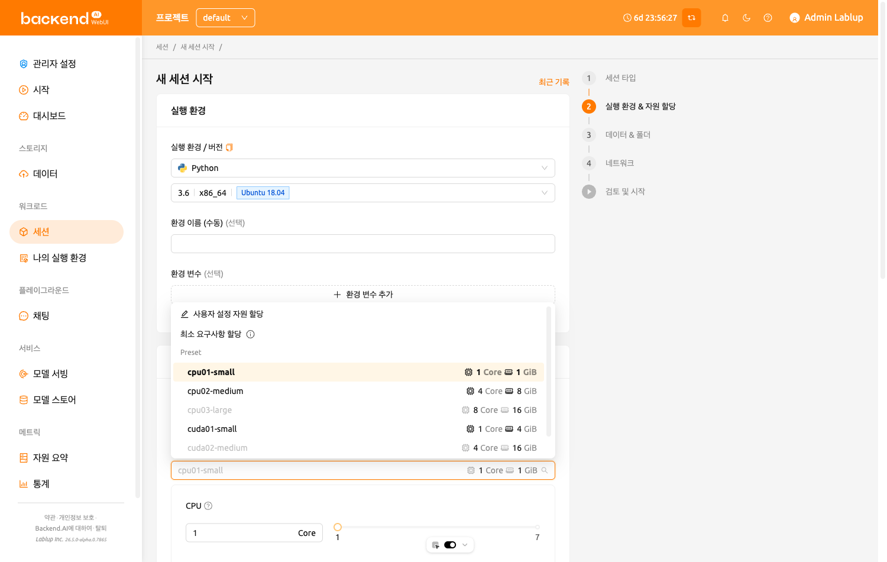

Environment 페이지의 Resource Presets 탭으로 이동합니다. 현재 정의된 자원 프리셋의 목록을 확인할 수 있습니다.

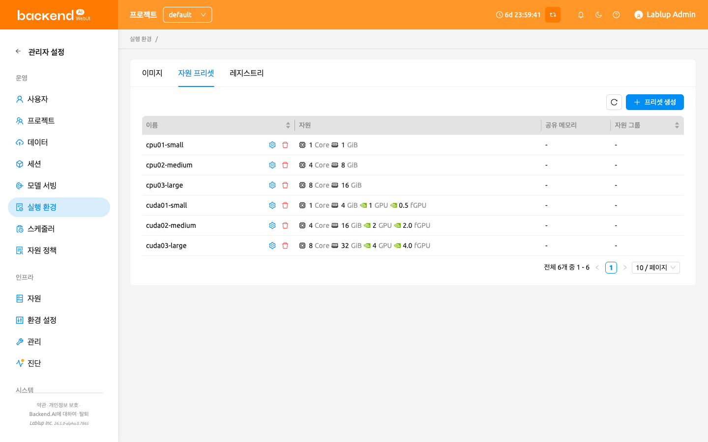

Controls 패널의 '설정 (톱니바퀴)'를 클릭하여 자원 프리셋에서 제공하는 CPU, RAM, fGPU 등의 자원을 설정할 수 있습니다. Create or Modify Resource Preset 모달에는 현재 사용 가능한 자원의 필드가 표시됩니다. 서버 설정에 따라 특정 자원이 표시되지 않을 수 있습니다. 원하는 값으로 자원을 설정한 후 저장하고, 연산 세션을 생성할 때 해당 프리셋이 표시되는지 확인합니다. 사용 가능한 자원이 프리셋에 정의된 자원 양보다 적으면 해당 프리셋이 표시되지 않습니다.

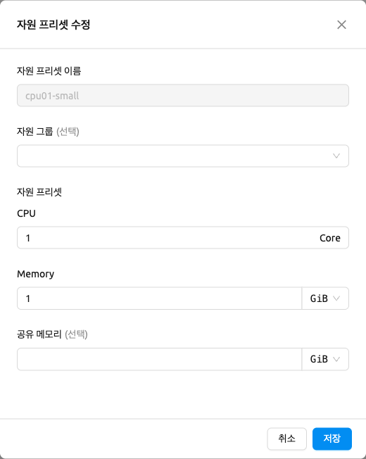

또한 Resource Presets 탭 오른쪽 상단의 '+ Create Presets' 버튼을 클릭하여 자원 프리셋을 생성할 수 있습니다. 이미 존재하는 것과 동일한 자원 프리셋 이름으로는 생성할 수 없습니다. 이름은 각 자원 프리셋을 구분하는 키 값이기 때문입니다.

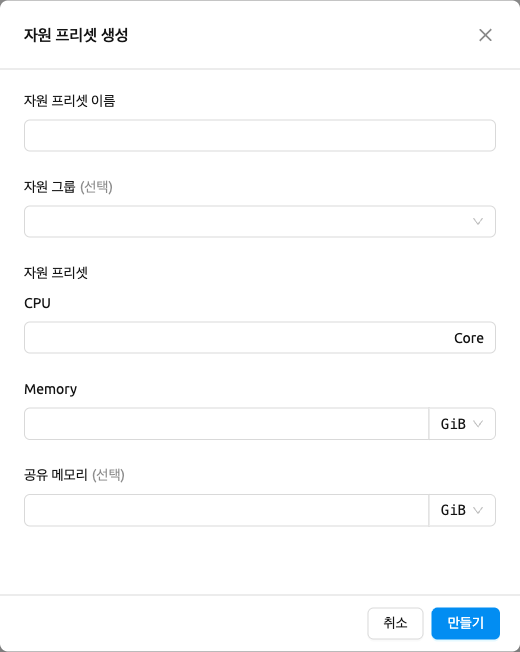

<a id="manage-agent-nodes"></a>

## 에이전트 노드 관리

슈퍼관리자는 Resources 페이지를 방문하여 현재 Backend.AI에 연결된 에이전트 워커 노드의 목록을 볼 수 있습니다. 에이전트 노드의 IP, 연결 시간, 현재 실제 사용 중인 자원 등을 확인할 수 있습니다. WebUI에서는 에이전트 노드를 직접 조작하는 기능을 제공하지 않습니다.

<a id="query-agent-nodes"></a>

#### 에이전트 노드 조회

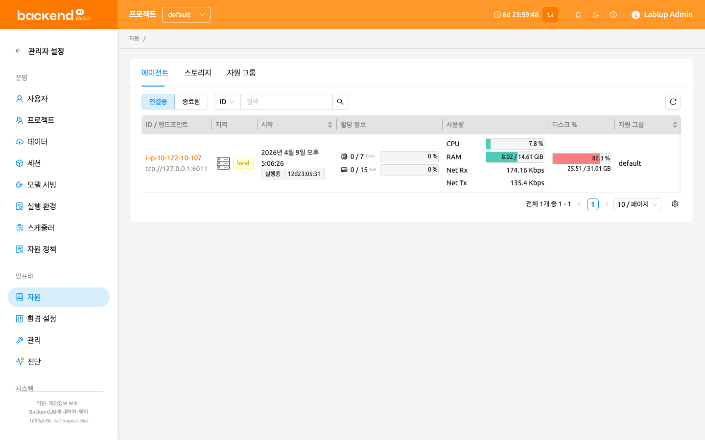

또한 Control 패널의 노트 아이콘을 클릭하여 에이전트 워커 노드의 자원에 대한 정확한 사용량을 확인할 수 있습니다.

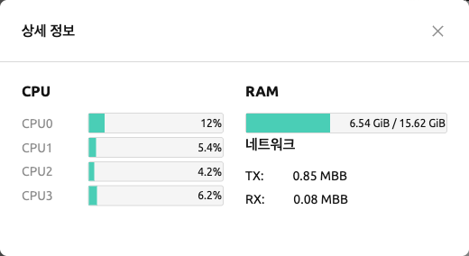

Terminated 탭에서는 한번 연결되었다가 종료되거나 연결이 끊긴 에이전트의 정보를 확인할 수 있습니다. 이는 노드 관리를 위한 참고 자료로 사용할 수 있습니다. 목록이 비어 있다면 연결 끊김이나 종료가 발생하지 않았음을 의미합니다.

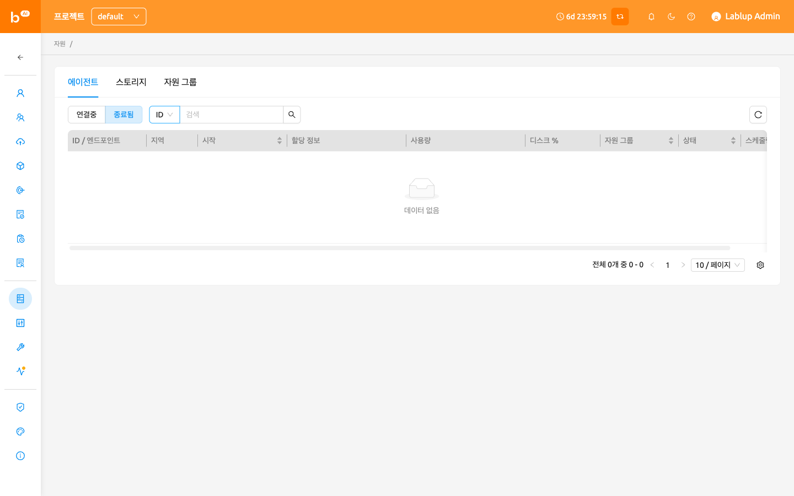

<a id="set-schedulable-status-of-agent-nodes"></a>

#### 에이전트 노드의 스케줄 가능 상태 설정

에이전트 서비스를 중지하지 않고 새로운 연산 세션이 해당 에이전트에 스케줄되는 것을 방지하고 싶을 수 있습니다. 이 경우 에이전트의 Schedulable 상태를 비활성화할 수 있습니다. 그러면 에이전트에 기존 세션을 보존하면서 새 세션의 생성을 차단할 수 있습니다.

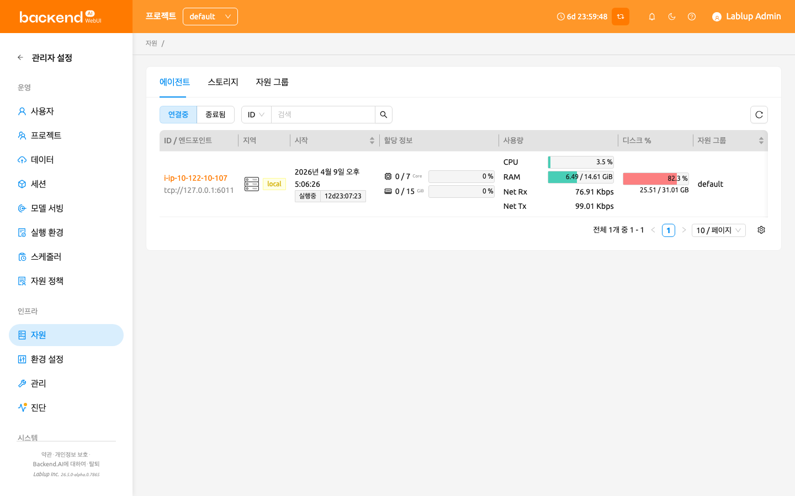

<a id="manage-resource-group"></a>

## 자원 그룹 관리

에이전트는 자원 그룹(scaling group)이라는 단위로 그룹화할 수 있습니다. 예를 들어 V100 GPU가 장착된 에이전트 3대와 P100 GPU가 장착된 에이전트 2대가 있다고 가정합니다. 두 종류의 GPU를 사용자에게 별도로 노출하려면 V100 에이전트 3대를 하나의 자원 그룹으로, 나머지 P100 에이전트 2대를 다른 자원 그룹으로 그룹화할 수 있습니다.

특정 에이전트를 특정 자원 그룹에 추가하는 것은 현재 WebUI에서 처리되지 않으며, 설치 위치에서 에이전트 config 파일을 편집하고 에이전트 데몬을 재시작하여 수행할 수 있습니다. 자원 그룹의 관리는 Resource 페이지의 Resource Group 탭에서 가능합니다.

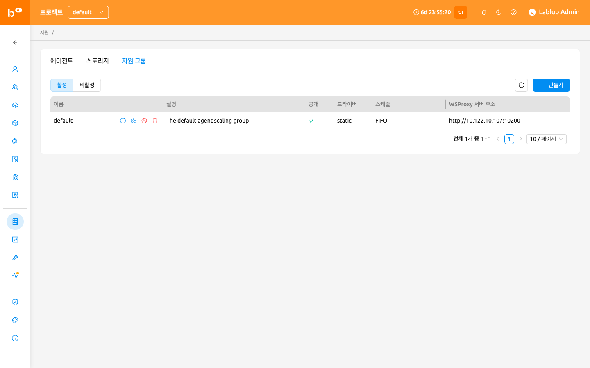

<a id="scheduling-methods"></a>

Control 패널의 '설정 (톱니바퀴)'를 클릭하여 자원 그룹을 편집할 수 있습니다. Select scheduler 필드에서 연산 세션을 생성하기 위한 스케줄링 방법을 선택할 수 있습니다. 현재 `FIFO`, `LIFO`, `DRF` 세 가지 유형이 있습니다. `FIFO`와 `LIFO`는 작업 대기열에서 먼저 또는 마지막으로 대기열에 등록된 연산 세션을 생성하는 스케줄링 방법입니다. `DRF`는 Dominant Resource Fairness의 약자로, 각 사용자에게 가능한 한 공정하게 자원을 제공하는 것을 목표로 합니다. Active Status를 끄면 자원 정책을 비활성화할 수 있습니다.

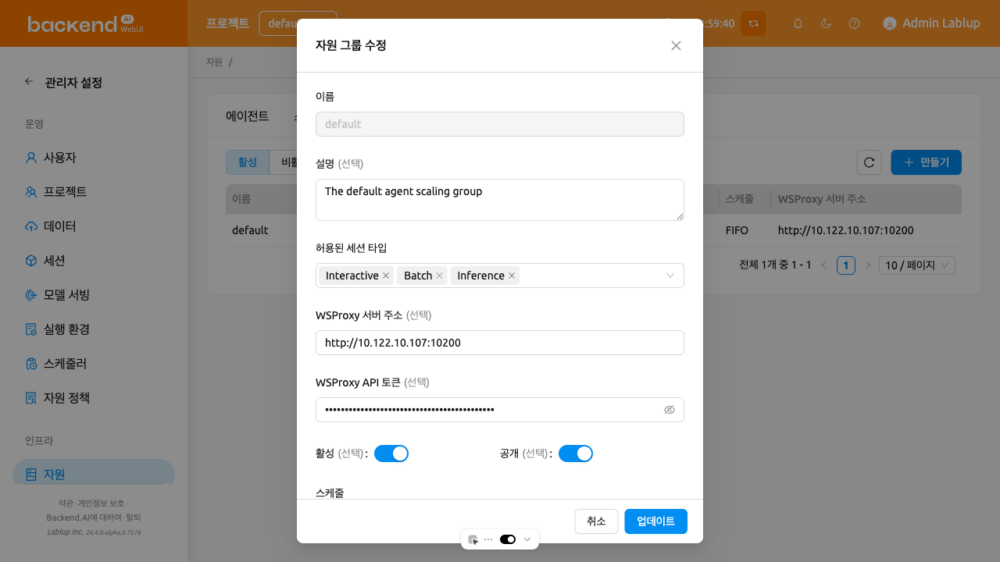

WSProxy Server Address는 자원 그룹의 에이전트가 사용할 WSProxy 주소를 설정합니다. 이 필드에 URL을 설정하면 WSProxy가 Jupyter와 같은 앱의 트래픽을 Manager를 우회하여 에이전트를 통해 연산 세션으로 직접 중계합니다 (v2 API). v2 API를 활성화하면 앱 서비스를 사용할 때 Manager의 부담을 줄일 수 있습니다. 이는 또한 서비스 배포에서 더 나은 효율성과 확장성을 달성합니다. 그러나 WSProxy에서 에이전트 노드로의 직접 연결이 가능하지 않은 경우 이 필드를 비워 두어 기존 방식으로 Manager를 통해 트래픽을 중계하는 v1 API로 폴백하세요.

자원 그룹에는 추가적인 Scheduler Options가 있습니다. 세부 사항은 아래에 설명되어 있습니다.

- Allowed session types:
  사용자가 세션 유형을 선택할 수 있으므로, 자원 그룹에서 특정 유형의 세션을 허용할 수 있습니다. 최소 하나의 세션 유형은 허용해야 합니다. 허용되는 세션 유형은 Interactive, Batch, Inference입니다.
- Pending timeout:
  연산 세션이 Pending timeout보다 오래 `PENDING` 상태를 유지하면 취소됩니다. 세션이 무기한 PENDING 상태로 남는 것을 방지하려면 이 시간을 설정합니다. pending timeout 기능을 적용하지 않으려면 이 값을 0으로 설정합니다.
- Retries to skip pending session:
  스케줄러가 PENDING 세션을 건너뛰기 전에 시도하는 재시도 횟수입니다. 하나의 PENDING 세션이 후속 세션의 스케줄링을 무기한으로 차단하는 상황(Head-of-line blocking, HOL)을 방지하기 위해 구성할 수 있습니다. 값이 지정되지 않으면 Etcd의 전역 값이 사용됩니다 (`num retries to skip`, 기본값 3회).

'+ Create' 버튼을 클릭하여 새 자원 그룹을 생성할 수 있습니다. 다른 생성 옵션과 마찬가지로 이미 존재하는 이름으로는 자원 그룹을 생성할 수 없습니다. 이름은 키 값이기 때문입니다.

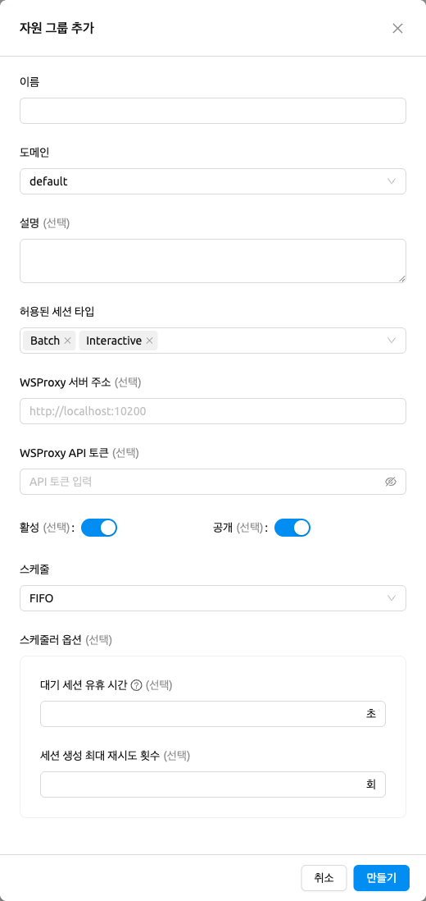

<a id="storages"></a>

## 스토리지

STORAGES 탭에서는 어떤 종류의 마운트 볼륨(일반적으로 NFS)이 존재하는지 확인할 수 있습니다. 23.03 버전부터 쿼터 관리를 지원하는 스토리지에서 사용자별/프로젝트별 쿼터 설정을 제공합니다. 이 기능을 사용하면 관리자가 사용자 및 프로젝트 기반 폴더별 정확한 스토리지 사용량을 쉽게 관리하고 모니터링할 수 있습니다.

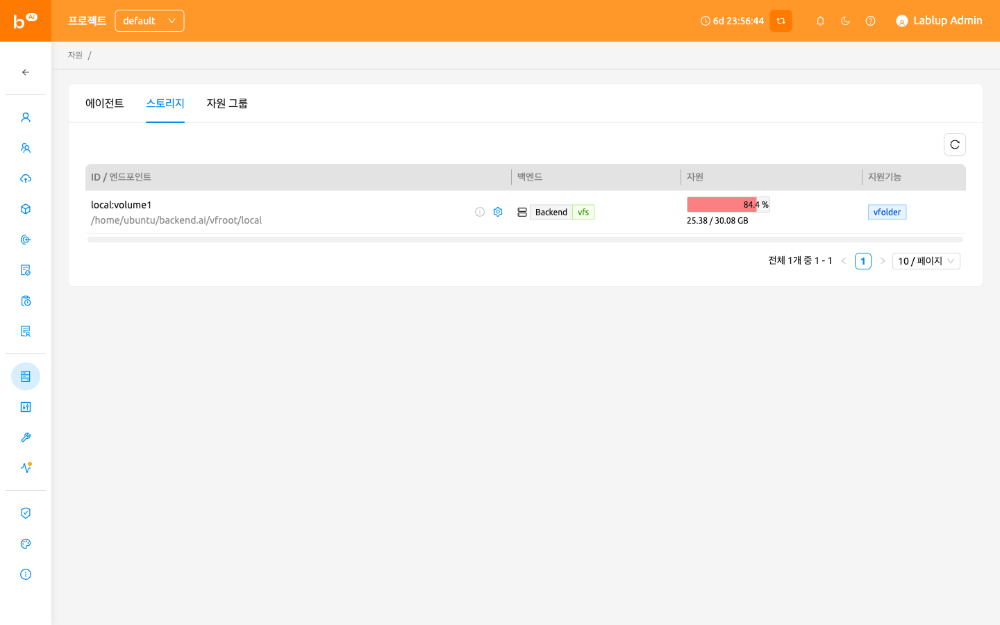

쿼터를 설정하려면 먼저 resource 페이지의 storages 탭에 액세스해야 합니다. 그런 다음 control 열의 '설정 (톱니바퀴)'를 클릭합니다.

:::note
쿼터 설정은 쿼터 설정을 제공하는 스토리지(예: XFS, CephFS, NetApp, Purestorage 등)에서만 사용할 수 있습니다. 쿼터 설정 페이지에서 스토리지와 관계없이 스토리지 사용량을 볼 수 있지만, 내부적으로 쿼터 구성을 지원하지 않는 쿼터는 구성할 수 없습니다.

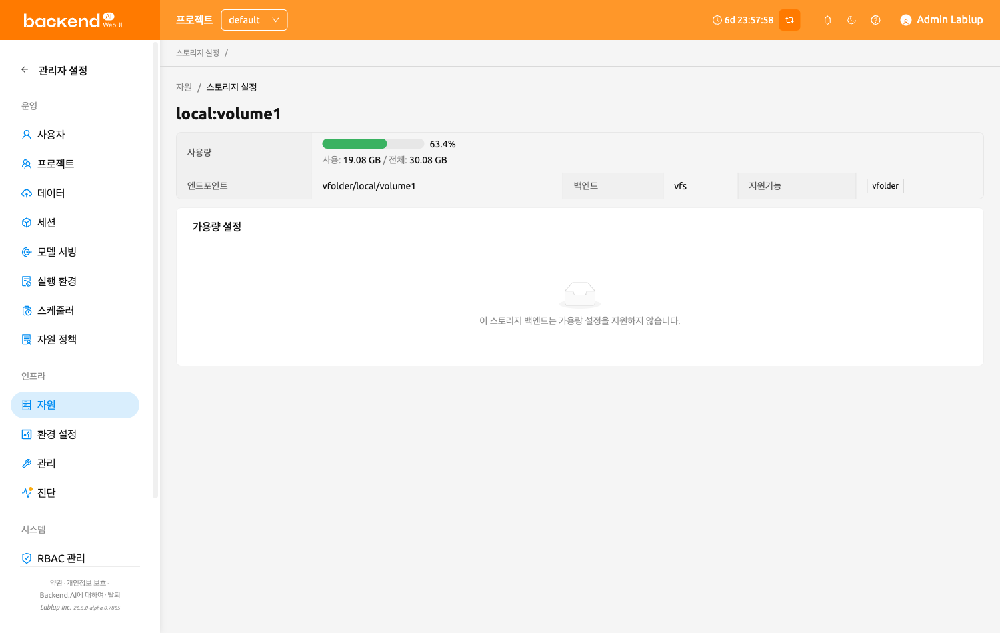
:::

<a id="quota-setting-panel"></a>

#### 쿼터 설정 패널

Quota setting 페이지에는 두 개의 패널이 있습니다.

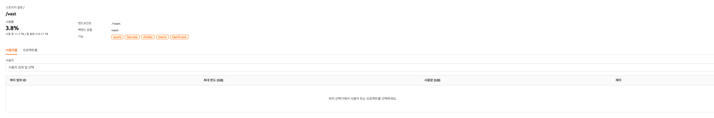

- Overview panel
  - Usage: 선택한 스토리지의 실제 사용량을 표시합니다.
  - Endpoint: 선택한 스토리지의 마운트 포인트를 나타냅니다.
  - Backend Type: 스토리지의 유형입니다.
  - Capabilities: 선택한 스토리지의 지원되는 기능입니다.

- Quota Settings
  - For User: 사용자별 쿼터 설정을 여기서 구성합니다.
  - For Project: 프로젝트별 쿼터(프로젝트 폴더) 설정을 여기서 구성합니다.
  - ID: 사용자 또는 프로젝트 ID에 해당합니다.
  - Hard Limit (GB): 선택한 쿼터에 대해 현재 설정된 hard limit 쿼터입니다.
  - Control: hard limit을 편집하거나 쿼터 설정을 삭제하는 기능을 제공합니다.

<a id="set-user-quota"></a>

#### 사용자 쿼터 설정

Backend.AI에는 사용자와 관리자(프로젝트)가 생성한 두 가지 유형의 vfolder가 있습니다. 이 섹션에서는 사용자별 현재 쿼터 설정을 확인하고 구성하는 방법을 보여드리고자 합니다. 먼저 quota settings 패널의 활성 탭이 `For User`인지 확인합니다. 그런 다음 쿼터를 확인하고 편집하려는 사용자를 선택합니다. 이미 쿼터를 설정한 경우 사용자 ID에 해당하는 쿼터 ID와 이미 설정된 구성을 테이블에서 볼 수 있습니다.

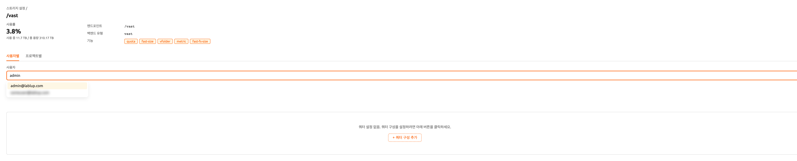

물론 쿼터를 편집하려면 control 열의 Edit 버튼을 클릭하기만 하면 됩니다. `Edit` 버튼을 클릭하면 쿼터 설정을 구성할 수 있는 작은 모달이 표시될 수 있습니다. 정확한 양을 입력한 후 변경 사항이 적용되도록 `OK` 버튼을 클릭하는 것을 잊지 마십시오.

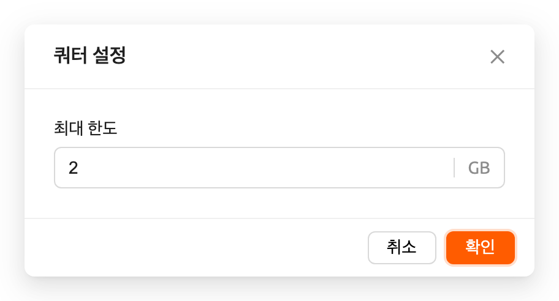

<a id="set-project-quota"></a>

#### 프로젝트 쿼터 설정

프로젝트 폴더에 쿼터를 설정하는 것은 사용자 쿼터를 설정하는 것과 유사합니다. 프로젝트 쿼터 설정과 사용자 쿼터 설정의 차이점은 프로젝트 쿼터 설정을 확인하려면 프로젝트가 속한 도메인을 선택하는 한 가지 절차가 더 필요하다는 것입니다. 나머지는 동일합니다. 아래 그림과 같이 먼저 도메인을 선택한 다음 프로젝트를 선택해야 합니다.

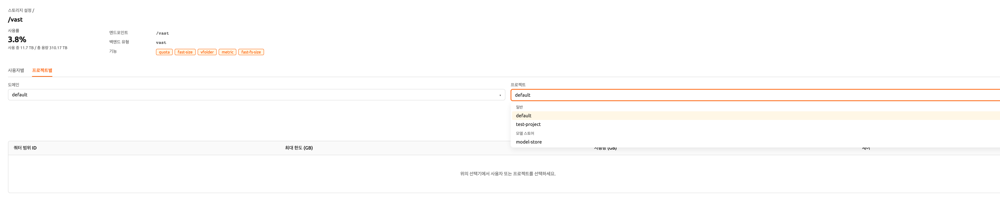

<a id="unset-quota"></a>

#### 쿼터 해제

쿼터를 해제하는 기능도 제공합니다. 쿼터 설정을 제거한 후에는 쿼터가 자동으로 사용자 또는 프로젝트 기본 쿼터를 따르게 되며, 이는 WebUI에서 설정할 수 없습니다. 기본 쿼터 설정을 변경하려면 관리자 전용 페이지에 액세스해야 할 수 있습니다. control 열의 `Unset` 버튼을 클릭하면 작은 snackbar 메시지가 표시되어 현재 쿼터 설정을 정말로 삭제할 것인지 확인합니다. snackbar 메시지의 `OK` 버튼을 클릭하면 쿼터 설정이 삭제되고 쿼터 유형(사용자/프로젝트)에 따라 해당 쿼터에 맞게 자동으로 재설정됩니다.

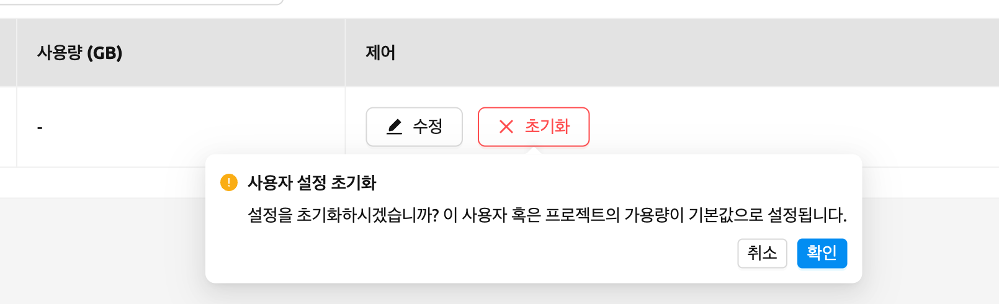

:::note
사용자/프로젝트별 구성이 없는 경우 사용자/프로젝트 자원 정책의 해당 값이 기본값으로 설정됩니다. 예를 들어 쿼터에 대한 hard limit 값이 설정되지 않은 경우 자원 정책의 `max_vfolder_size` 값이 기본값으로 사용됩니다.
:::

<a id="download-session-lists"></a>

## 세션 목록 다운로드

:::note
이 기능은 현재 기본 Session 페이지에서 사용할 수 없습니다. 이 기능을 사용하려면 User Setting 페이지의 'Switch back to the Classic UI' 섹션에서 'Classic Session list page' 옵션을 활성화하십시오. 자세한 내용은 [Backend.AI 사용자 설정](#user-settings) 섹션을 참고하세요.
:::

관리자용 Session 페이지에는 추가 기능이 있습니다. FINISHED 탭의 오른쪽에 `...`로 표시된 메뉴가 있습니다. 이 메뉴를 클릭하면 export CSV 하위 메뉴가 나타납니다.


이 메뉴를 클릭하면 지금까지 생성된 연산 세션의 정보를 CSV 형식으로 다운로드할 수 있습니다. 다음 대화 상자가 열리면 적절한 파일 이름을 입력하고(필요한 경우) EXPORT 버튼을 클릭하면 CSV 파일을 받을 수 있습니다. 파일 이름은 최대 255자까지 입력할 수 있습니다.


<a id="system-settings"></a>

## 시스템 설정

Configuration 페이지에서 Backend.AI 서버의 주요 설정을 볼 수 있습니다. 현재 설정을 변경하고 나열할 수 있는 여러 컨트롤을 제공합니다.

`Digest`, `Tag`, `None` 중 하나의 옵션을 선택하여 이미지 자동 설치 및 업데이트 규칙을 변경할 수 있습니다. `Digest`는 이미지의 무결성을 확인하고 중복된 레이어를 재사용하여 이미지 다운로드 효율성을 향상시키는 일종의 체크섬입니다. `Tag`는 이미지의 무결성을 보장하지 않기 때문에 개발 옵션 전용입니다.

:::note
각 규칙의 의미를 완전히 이해하지 않는 한 규칙 선택을 변경하지 마십시오.
:::

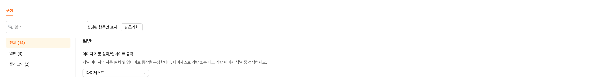

scaling, 플러그인 및 엔터프라이즈 기능에 대한 설정도 변경할 수 있습니다.

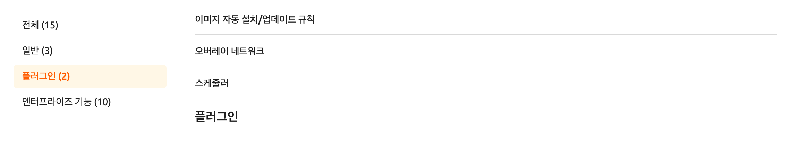

버전 20.09에 도입된 멀티 노드 클러스터 세션을 사용자가 시작하면 Backend.AI는 private 노드 간 통신을 지원하기 위해 오버레이 네트워크를 동적으로 생성합니다. 관리자는 해당 값이 네트워크 속도를 향상시킬 것이 확실한 경우 오버레이 네트워크의 Maximum Transmission Unit (MTU) 값을 설정할 수 있습니다.

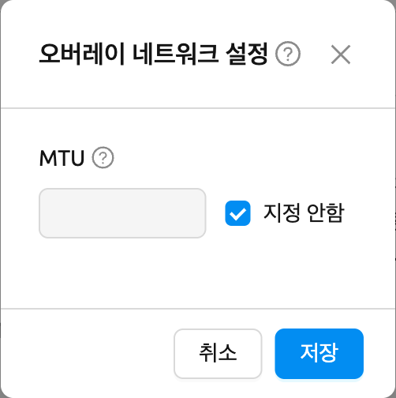

:::note
Backend.AI Cluster 세션에 대한 자세한 내용은 [Backend.AI 클러스터 연산 세션](#backendai-cluster-compute-session) 섹션을 참고하세요.
:::

Scheduler의 config 버튼을 클릭하여 작업 스케줄러별 구성을 편집할 수 있습니다. 스케줄러 설정의 값은 각 [자원 그룹](#scheduling-methods)에 스케줄러 설정이 없을 때 사용할 기본값입니다. 자원 그룹별 설정이 있는 경우 이 값은 무시됩니다.

현재 지원되는 스케줄링 방법에는 `FIFO`, `LIFO`, `DRF`가 있습니다. 각 스케줄링 방법은 위의 [스케줄링 방법](#scheduling-methods)과 정확히 동일합니다. 스케줄러 옵션에는 세션 생성 재시도가 포함됩니다. 세션 생성 재시도는 실패한 경우 세션을 생성하기 위한 재시도 횟수를 나타냅니다. 시도 횟수 내에 세션을 생성할 수 없으면 요청이 무시되고 Backend.AI가 다음 요청을 처리합니다. 현재 스케줄러가 `FIFO`인 경우에만 변경이 가능합니다.

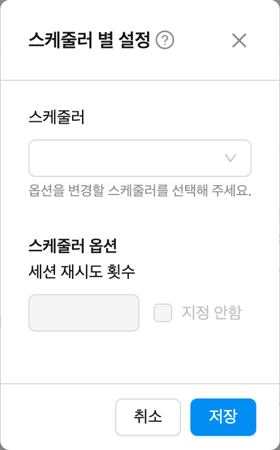

:::note
더 광범위한 설정 컨트롤을 계속 추가할 예정입니다.
:::

:::note
시스템 설정은 기본 설정입니다. 자원 그룹에 특정 값이 있으면 시스템 설정에서 구성된 값이 재정의됩니다.
:::

<a id="server-management"></a>

## 서버 관리

Maintenance 페이지로 이동하면 서버를 관리하는 몇 가지 버튼이 표시됩니다.

- RECALCULATE USAGE: 때때로 불안정한 네트워크 연결이나 Docker daemon의 컨테이너 관리 문제로 인해 Backend.AI가 점유한 자원이 컨테이너가 실제로 사용하는 자원과 일치하지 않는 경우가 있을 수 있습니다. 이 경우 RECALCULATE USAGE 버튼을 클릭하여 자원 점유율을 수동으로 수정합니다.
- RESCAN IMAGES: 등록된 모든 Docker registry에서 이미지 메타 정보를 업데이트합니다. Backend.AI에 연결된 docker registry에 새 이미지가 푸시될 때 사용할 수 있습니다.

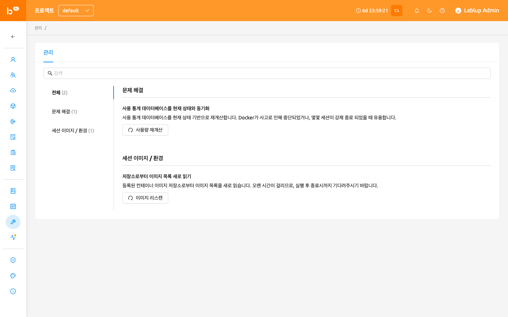

:::note
사용하지 않는 이미지 제거 또는 정기 유지 관리 일정 등록과 같이 관리에 필요한 기타 설정을 계속 추가할 예정입니다.
:::

<a id="detailed-information"></a>

## 상세 정보

Information 페이지에서 각 기능의 여러 상세 정보와 상태를 볼 수 있습니다. Manager 버전과 API 버전을 보려면 Core 패널을 확인하십시오. Backend.AI의 각 구성 요소가 호환되는지 여부를 확인하려면 Component 패널을 확인하십시오.

:::note
이 페이지는 현재 정보를 표시하기 위한 것입니다.
:::


