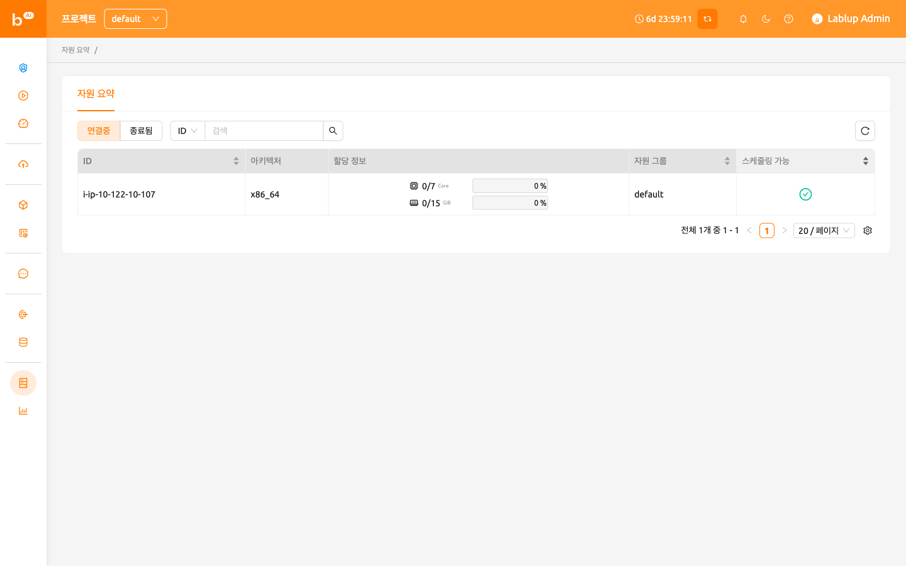

# 자원 요약

현재 에이전트 정보는 관리자 권한을 가진 사용자만 관리 메뉴를 통해 확인할 수 있습니다.
22.09 버전부터 Backend.AI WebUI는 설정에 따라 에이전트 노드의 일부 정보를 일반 사용자에게도 표시할 수 있도록 지원합니다.
자원 요약 메뉴에서는 엔드포인트 주소, CPU 아키텍처, 자원 할당량,
스케줄 가능 여부 등 에이전트 정보 목록을 확인할 수 있습니다. 이 메뉴는 연산 세션 생성 시 자원 할당 상태를 확인하는 데 유용합니다.

:::info
서버 설치 및 설정 환경에 따라 자원 요약 기능이 비활성화되어 있을 수 있습니다. 자원 요약 기능 사용을 원하시는 경우, 시스템 관리자에게 문의하십시오.
:::