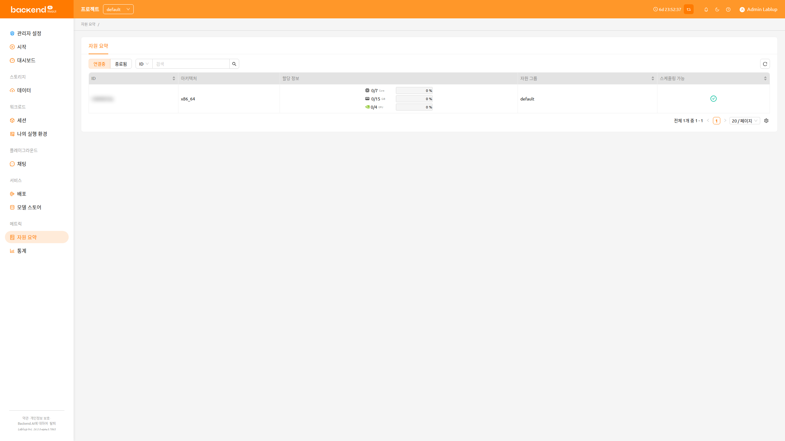

# 에이전트 요약

에이전트 요약 페이지에서는 프로젝트에서 사용할 수 있는 연산 **에이전트**(에이전트 노드)와 각 에이전트의 자원 할당 현황을 읽기 전용으로 확인할 수 있습니다. 연산 세션을 생성하기 전에 CPU, 메모리, 가속기 용량이 얼마나 남아 있는지 확인하는 데 사용합니다.

:::note
서버 설치 및 설정 환경에 따라 에이전트 요약 기능이 비활성화되어 있을 수 있습니다. 에이전트 요약 기능 사용을 원하시는 경우, 시스템 관리자에게 문의하십시오.
:::

## 컬럼

에이전트 목록에는 다음 컬럼이 표시됩니다.

- **ID**: 에이전트의 고유 식별자입니다.
- **아키텍처**: 에이전트의 CPU 아키텍처입니다(예: `x86_64`).
- **할당 정보**: 에이전트의 각 자원 슬롯별 사용 중인 용량과 사용 가능한 용량을 사용률 진행 막대와 함께 표시합니다.
   * CPU는 코어 수, 메모리는 GiB 단위로 표시되며, 에이전트에 존재하는 가속기(GPU 또는 fGPU 등)는 추가 슬롯으로 표시됩니다.
   * 사용률이 80%를 초과하면 진행 막대가 빨간색으로 표시됩니다.
- **자원 그룹**: 에이전트가 속한 자원 그룹입니다.
- **스케줄링 가능**: 에이전트가 새 세션을 받을 수 있는지 여부입니다. 체크 아이콘은 스케줄링이 가능함을, 흐리게 표시된 마이너스 아이콘은 불가능함을 나타냅니다.

:::note
SFTP 전용 자원 그룹에 속한 에이전트는 이 목록에서 자동으로 제외되므로, 스토리지 전용 에이전트는 여기에 표시되지 않습니다.
:::
