# 부록

<a id="gpu-virtualization-and-fractional-gpu-allocation"></a>

## GPU 가상화 및 분할 GPU 할당

Backend.AI는 GPU 가상화 기술을 지원하여 하나의 물리 GPU를 여러 사용자가 동시에 나누어 사용할 수 있습니다. 따라서 GPU 연산이 많이 필요하지 않은 작업을 실행하려는 경우, GPU의 일부만 할당하여 연산 세션을 생성할 수 있습니다. 1 fGPU가 실제로 할당하는 GPU 자원의 양은 관리자 설정에 따라 시스템마다 다를 수 있습니다. 예를 들어, 관리자가 하나의 물리 GPU를 5개로 분할하도록 설정한 경우, 5 fGPU는 1개의 물리 GPU를 의미하며, 1 fGPU는 0.2개의 물리 GPU에 해당합니다. 연산 세션 생성 시 1 fGPU를 설정하면, 해당 세션은 0.2개의 물리 GPU에 해당하는 스트리밍 멀티프로세서(SM) 및 GPU 메모리를 활용할 수 있습니다.

이번에는 GPU를 일부만 할당하여 연산 세션을 생성한 후, 연산 컨테이너 내부에서 인식하는 GPU가 실제로 물리 GPU의 일부분인지 확인해 보겠습니다.

먼저, 호스트 노드에 설치된 물리 GPU의 종류와 메모리 용량을 확인합니다. 이 가이드에서 사용하는 GPU 노드는 아래 그림과 같이 8 GB 메모리를 탑재한 GPU를 장착하고 있습니다. 그리고 관리자 설정에 따라 1 fGPU는 0.5개의 물리 GPU에 해당하는 양으로 설정되어 있습니다 (즉, 1개의 물리 GPU가 2 fGPU입니다).


이제 세션 페이지로 이동하여 다음과 같이 0.5 fGPU를 할당하여 연산 세션을 생성합니다.

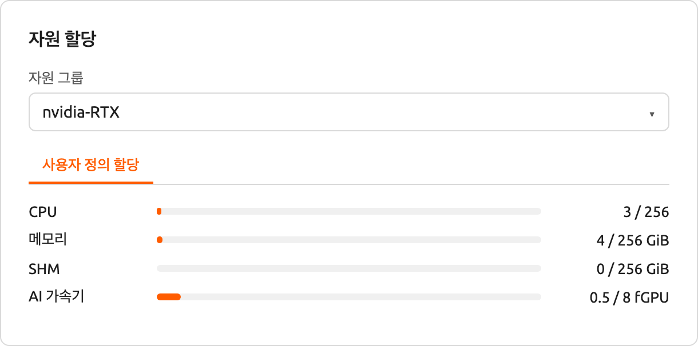

세션 목록의 AI 가속기 패널에서 0.5 fGPU가 할당된 것을 확인할 수 있습니다.

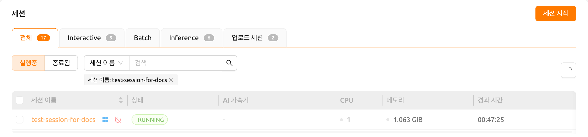

이제 컨테이너에 직접 접속하여 할당된 GPU 메모리가 실제로 0.5 단위(약 2 GB)에 해당하는지 확인합니다. 웹 터미널을 열고 `nvidia-smi` 명령을 실행합니다. 아래 그림에서 볼 수 있듯이, 약 2 GB의 GPU 메모리가 할당된 것을 확인할 수 있습니다. 이는 PCI 패스스루와 같은 방식으로는 불가능한, 물리 GPU를 실제로 분할하여 컨테이너 내부에 할당하는 것을 보여줍니다.

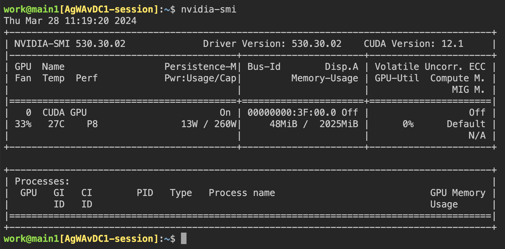

이번에는 Jupyter Notebook을 열어서 간단한 ML 학습 코드를 실행해 보겠습니다.


학습이 진행되는 동안, GPU 호스트 노드의 셸에 접속하여 `nvidia-smi` 명령을 실행합니다. 해당 프로세스에 하나의 GPU가 연결되어 있으며, 물리 GPU 자원의 약 25%를 점유하고 있는 것을 확인할 수 있습니다. (GPU 점유율은 학습 코드와 GPU 모델에 따라 크게 달라질 수 있습니다.)


또는, 웹 터미널에서 `nvidia-smi` 명령을 실행하여 컨테이너 내부의 GPU 사용 이력을 조회할 수도 있습니다.


<a id="automated-job-scheduling"></a>

## 자동 작업 스케줄링

Backend.AI 서버는 자체 개발한 작업 스케줄러를 내장하고 있습니다. 자동으로 모든 워커 노드의 가용 자원을 확인하여 사용자의 자원 요청에 맞는 워커로 연산 세션 생성 요청을 위임합니다. 또한, 자원이 부족한 경우에는 사용자의 연산 세션 생성 요청을 작업 큐에 PENDING 상태로 등록합니다. 이후 자원이 다시 가용 상태가 되면 대기 중인 요청을 재개하여 연산 세션을 생성합니다.

사용자 Web-UI에서 간단한 방법으로 작업 스케줄러의 동작을 확인할 수 있습니다. GPU 호스트가 최대 2 fGPU를 할당할 수 있는 경우, 각각 1 fGPU 할당을 요청하는 3개의 연산 세션을 동시에 생성해 보겠습니다. 세션 시작 다이얼로그의 사용자 지정 할당 섹션에는 GPU와 세션 슬라이더가 있습니다. 세션에서 1보다 큰 값을 지정하고 LAUNCH 버튼을 클릭하면 해당 수만큼의 세션이 동시에 요청됩니다. GPU와 세션을 각각 1과 3으로 설정하겠습니다. 이는 fGPU가 2 단위밖에 없는 상황에서 총 3 fGPU를 요청하는 3개의 세션을 생성하는 상황입니다.

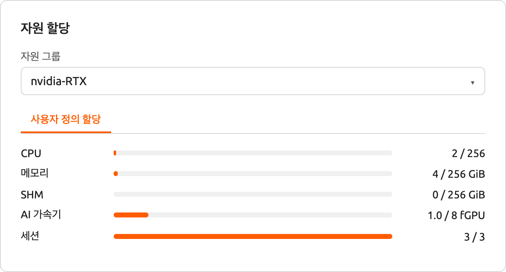

잠시 기다리면 세 개의 연산 세션이 목록에 나타납니다. 상태 패널을 자세히 살펴보면, 세 개의 연산 세션 중 두 개는 RUNNING 상태이지만 나머지 한 개는 PENDING 상태로 남아 있는 것을 확인할 수 있습니다. 이 PENDING 세션은 작업 큐에만 등록되어 있으며, GPU 자원 부족으로 인해 실제 컨테이너가 할당되지 않은 상태입니다.

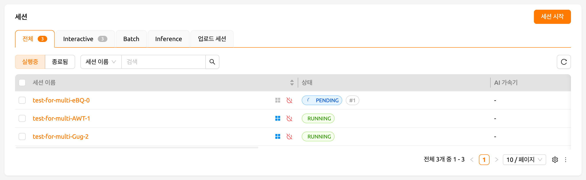

이제 RUNNING 상태의 두 세션 중 하나를 삭제해 보겠습니다. 그러면 PENDING 상태의 연산 세션이 작업 스케줄러에 의해 자원을 할당받고, 곧 RUNNING 상태로 전환되는 것을 확인할 수 있습니다. 이처럼, 작업 스케줄러는 작업 큐를 활용하여 사용자의 연산 세션 요청을 보관하고 있다가, 가용 자원이 확보되면 자동으로 요청을 처리합니다.

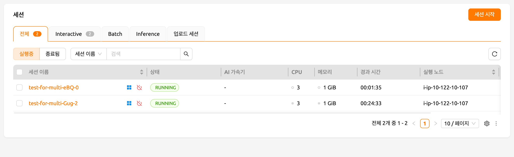


<a id="multi-version-machine-learning-container-support"></a>

## 다중 버전 머신러닝 컨테이너 지원

Backend.AI는 다양한 사전 빌드된 ML 및 HPC 커널 이미지를 제공합니다. 따라서 사용자는 패키지를 직접 설치하지 않아도 주요 라이브러리와 패키지를 즉시 활용할 수 있습니다. 여기서는 여러 ML 라이브러리의 다양한 버전을 즉시 활용하는 예제를 살펴보겠습니다.

세션 페이지로 이동하여 세션 시작 다이얼로그를 엽니다. 설치 환경에 따라 다양한 커널 이미지가 제공될 수 있습니다.

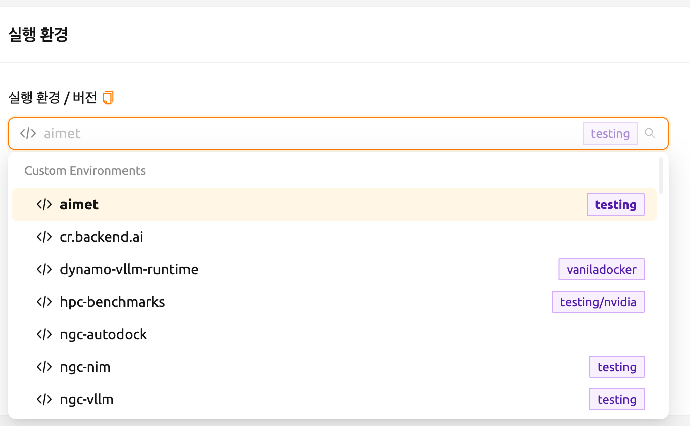

여기서 TensorFlow 2.3 환경을 선택하여 세션을 생성합니다.


생성된 세션의 웹 터미널을 열고 다음 Python 명령을 실행합니다. TensorFlow 2.3 버전이 설치되어 있는 것을 확인할 수 있습니다.

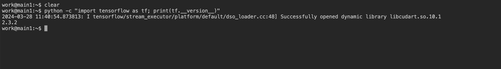

이번에는 TensorFlow 1.15 환경을 선택하여 연산 세션을 생성합니다. 자원이 부족한 경우 이전 세션을 삭제합니다.

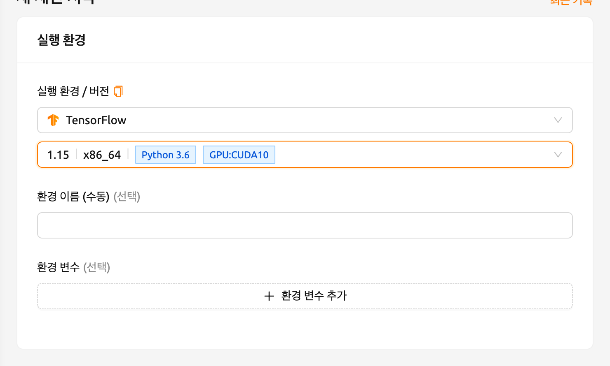

생성된 세션의 웹 터미널을 열고 이전과 동일한 Python 명령을 실행합니다. TensorFlow 1.15(.4) 버전이 설치되어 있는 것을 확인할 수 있습니다.


마지막으로, PyTorch 1.7 버전을 사용하여 연산 세션을 생성합니다.

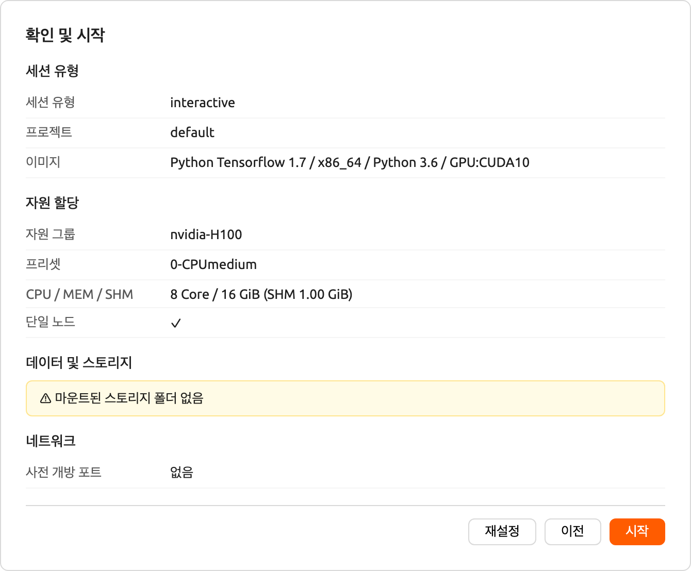

생성된 세션의 웹 터미널을 열고 다음 Python 명령을 실행합니다. PyTorch 1.8 버전이 설치되어 있는 것을 확인할 수 있습니다.

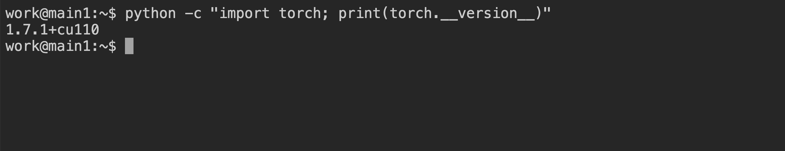

이처럼 Backend.AI를 통해 TensorFlow, PyTorch 등 주요 라이브러리의 다양한 버전을 별도의 설치 작업 없이 즉시 활용할 수 있습니다.


<a id="convert-a-compute-session-to-a-new-private-docker-image"></a>

## 실행 중인 연산 세션을 새로운 비공개 Docker 이미지로 변환

실행 중인 연산 세션(컨테이너)을 새로운 Docker 이미지로 변환하여 추후 연산 세션 생성 시 사용하려면, 연산 세션 환경을 준비한 후 관리자에게 변환을 요청해야 합니다.

- 먼저, 필요한 패키지를 설치하고 원하는 대로 설정을 조정하여 연산 세션을 준비합니다.

:::note
OS 패키지를 설치하려면(예: `apt` 명령을 통해) 일반적으로 `sudo` 권한이 필요합니다. 기관의 보안 정책에 따라 컨테이너 내에서 `sudo`를 사용할 수 없을 수도 있습니다.

Python 패키지를 설치할 때는 [자동 마운트 폴더](#using-automount-folder)를 사용하여 [pip를 통해 설치](#pip를-통한-파이썬-패키지-설치)하는 것을 권장합니다. 그러나 새로운 이미지에 Python 패키지를 포함시키려면, `sudo pip install <패키지명>` 명령을 사용하여 홈 디렉터리가 아닌 시스템 디렉터리에 설치해야 합니다. 홈 디렉터리(보통 `/home/work/`)의 내용은 연산 세션을 Docker 이미지로 변환할 때 저장되지 않습니다.
:::

- 연산 세션 준비가 완료되면, 관리자에게 해당 세션을 새로운 Docker 이미지로 변환해 달라고 요청합니다. 이때 세션 이름 또는 ID와 플랫폼에 등록된 이메일 주소를 알려주어야 합니다.
- 관리자가 연산 세션을 새로운 Docker 이미지로 변환하면, 전체 이미지 이름과 태그를 안내받게 됩니다.
- 세션 시작 다이얼로그에서 이미지 이름을 직접 입력할 수 있습니다. 해당 이미지는 비공개이며 다른 사용자에게는 표시되지 않습니다.

  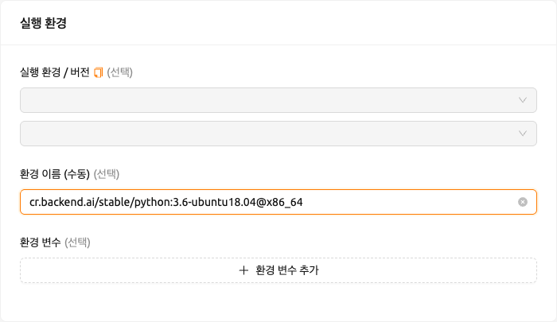

- 새로운 Docker 이미지를 사용하여 연산 세션이 생성됩니다.


<a id="backend-ai-server-installation-guide"></a>

## Backend.AI 서버 설치 가이드

Backend.AI 서버 데몬/서비스를 설치하려면 다음 하드웨어 사양을 충족해야 합니다. 최적의 성능을 위해서는 각 자원 수량을 두 배로 늘리는 것을 권장합니다.

- Manager: 2코어, 4 GiB 메모리
- Agent: 4코어, 32 GiB 메모리, NVIDIA GPU (GPU 워크로드용), > 512 GiB SSD
- Webserver: 2코어, 4 GiB 메모리
- WSProxy: 2코어, 4 GiB 메모리
- PostgreSQL DB: 2코어, 4 GiB 메모리
- Redis: 1코어, 2 GiB 메모리
- Etcd: 1코어, 2 GiB 메모리

각 서비스를 설치하기 전에 사전 설치해야 하는 필수 호스트 의존 패키지는 다음과 같습니다.

- Web-UI: 최신 브라우저를 실행할 수 있는 운영체제 (Windows, Mac OS, Ubuntu 등)
- Manager: Python (≥3.8), pyenv/pyenv-virtualenv (≥1.2)
- Agent: docker (≥19.03), CUDA/CUDA Toolkit (≥8, 11 권장), nvidia-docker v2, Python (≥3.8), pyenv/pyenv-virtualenv (≥1.2)
- Webserver: Python (≥3.8), pyenv/pyenv-virtualenv (≥1.2)
- WSProxy: docker (≥19.03), docker-compose (≥1.24)
- PostgreSQL DB: docker (≥19.03), docker-compose (≥1.24)
- Redis: docker (≥19.03), docker-compose (≥1.24)
- Etcd: docker (≥19.03), docker-compose (≥1.24)

Enterprise 버전의 경우, Backend.AI 서버 데몬은 Lablup 지원팀에 의해 설치되며, 초기 설치 후 다음 자료 및 서비스가 제공됩니다.

- DVD 1장 (Backend.AI 패키지 포함)
- 사용자 GUI 가이드 매뉴얼
- 관리자 GUI 가이드 매뉴얼
- 설치 보고서
- 초기 사용자/관리자 현장 튜토리얼 (3-5시간)

제품 유지보수 및 지원 정보: 상용 계약에는 기본적으로 Enterprise 버전의 월간/연간 구독료가 포함됩니다. 초기 설치 후 약 2주간 초기 사용자/관리자 교육(1-2회)과 유/무선 고객 지원 서비스가 제공되며, 3-6개월간 마이너 릴리스 업데이트 지원과 온라인 채널을 통한 고객 지원 서비스가 제공됩니다. 이후 제공되는 유지보수 및 지원 서비스는 계약 조건에 따라 세부 사항이 달라질 수 있습니다.


<a id="integration-examples"></a>

## 연동 예제

이 섹션에서는 Backend.AI 플랫폼에서 활용할 수 있는 애플리케이션, 툴킷, 머신러닝 도구의 대표적인 사용 예시를 소개합니다. 여기서는 각 도구의 기본적인 사용법과 Backend.AI 환경에서의 설정 방법을 간단한 예제와 함께 설명합니다. 이를 통해 프로젝트에 필요한 도구를 선택하고 활용하는 데 도움이 되기를 바랍니다.

이 가이드에서 다루는 내용은 특정 버전의 프로그램을 기준으로 작성되었으므로, 향후 업데이트에 따라 사용법이 달라질 수 있습니다. 따라서 이 문서를 참고용으로 사용하시고, 변경 사항은 최신 공식 문서도 함께 확인해 주세요. 이제 Backend.AI에서 활용할 수 있는 강력한 도구들을 하나씩 살펴보겠습니다. 이 섹션이 여러분의 연구 및 개발에 유용한 가이드가 되기를 바랍니다.

#### MLFlow 사용하기

Backend.AI에는 MLFlow와 MLFlow UI를 내장 앱으로 지원하는 다양한 실행 이미지가 있습니다. 다만, 실행을 위해 추가적인 절차가 필요할 수 있습니다. 아래 안내에 따라 진행하면, 로컬 환경에서 사용하는 것처럼 Backend.AI에서 파라미터와 결과를 추적할 수 있습니다.

:::note
이 섹션에서는 이미 세션을 생성하고 세션 내에서 앱을 실행하려는 상태를 전제로 합니다. 세션 생성 및 앱 실행 경험이 없는 경우, [새 세션 시작하기](#start-a-new-session) 섹션을 먼저 참고하세요.
:::

먼저, 터미널 앱 "console"을 실행하고 아래 명령을 실행합니다. 이 명령은 MLFlow 추적 UI 서버를 시작합니다.

```shell
$ mlflow ui --host 0.0.0.0
```

그런 다음, 앱 런처 다이얼로그에서 "MLFlow UI" 앱을 클릭합니다.

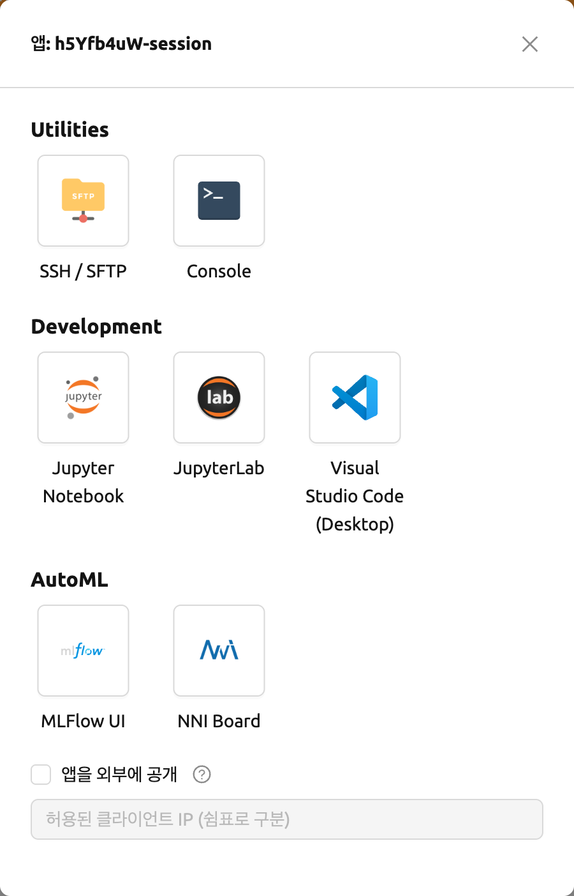

잠시 후, MLFlow UI의 새 페이지가 나타납니다.


MLFlow를 사용하면 실행할 때마다 메트릭, 파라미터 등의 실험을 추적할 수 있습니다. 간단한 예제부터 실험 추적을 시작해 보겠습니다.

```shell
$ wget https://raw.githubusercontent.com/mlflow/mlflow/master/examples/sklearn_elasticnet_diabetes/linux/train_diabetes.py
$ python train_diabetes.py
```

Python 코드를 실행한 후, MLFlow에서 실험 결과를 확인할 수 있습니다.


코드 실행 시 인자를 전달하여 하이퍼파라미터를 설정할 수도 있습니다.

```shell
$ python train_diabetes.py 0.2 0.05
```

몇 번의 학습이 끝나면, 학습된 모델들의 결과를 서로 비교해 볼 수 있습니다.


