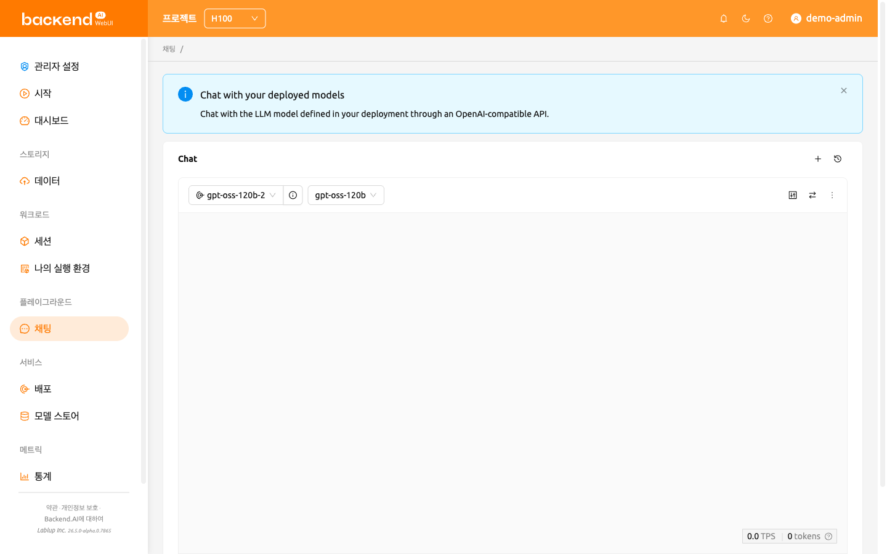
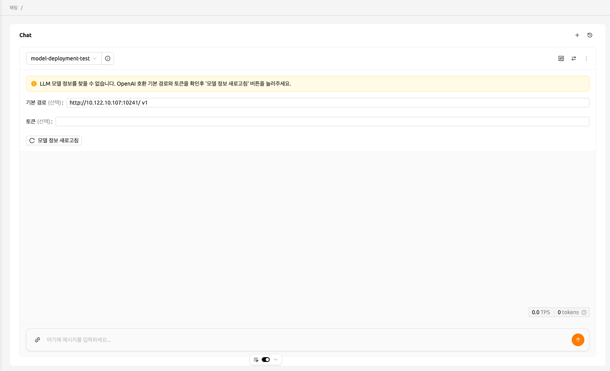
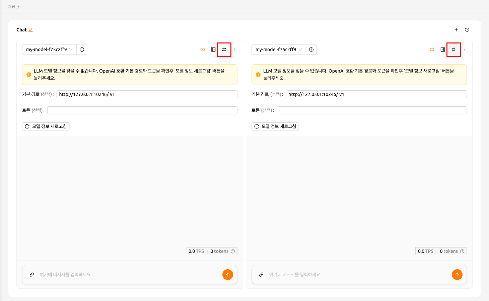
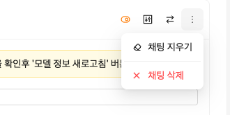
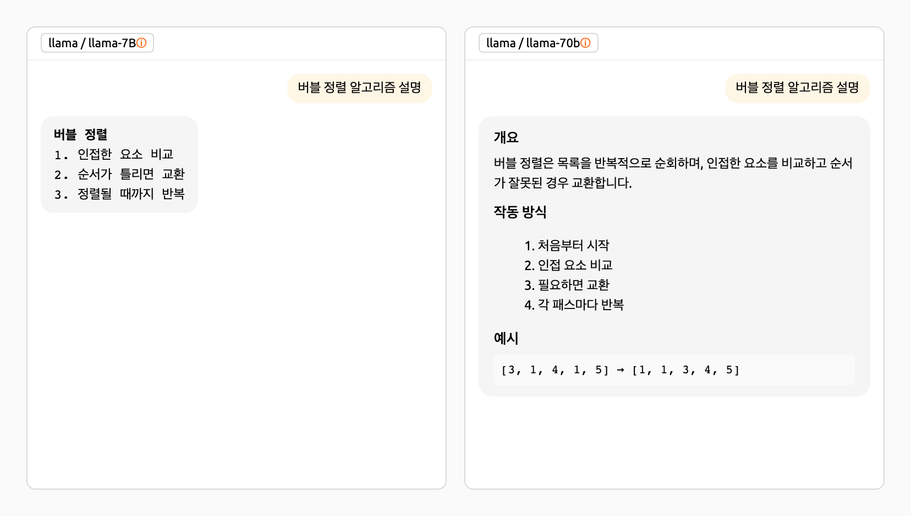
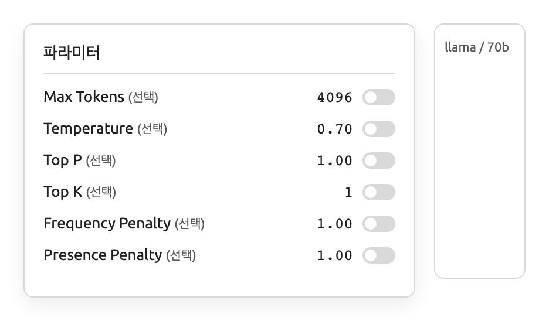
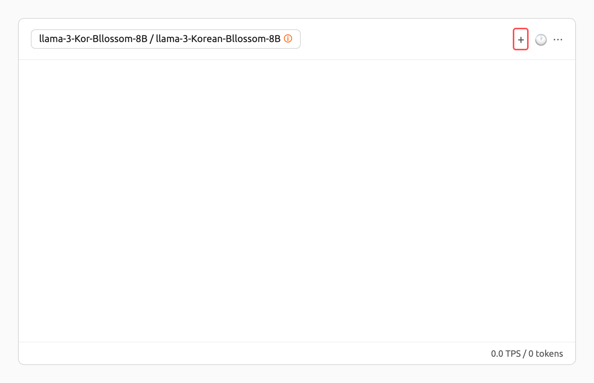
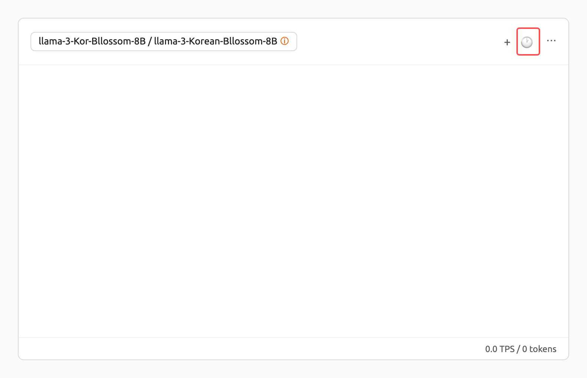
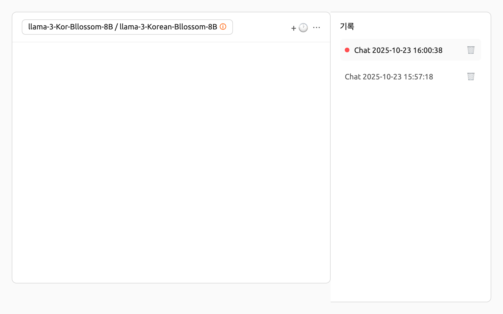

# 채팅 페이지

채팅 페이지에서는 다양한 LLM 모델을 한 곳에서 편리하게 비교하고 상호작용할 수 있습니다.
이를 통해 사용자는 Backend.AI가 제공하는 서비스와 다양한 대규모 언어 모델(LLM)을 경험할 수 있습니다.

:::note
채팅 페이지에 처음 방문하면 페이지 상단에 안내 배너가 표시됩니다:
"배포한 모델과 대화하기 — 배포에 정의된 LLM 모델과 OpenAI 호환 API로 대화할 수 있습니다."
닫기 버튼을 클릭하여 배너를 닫을 수 있으며, 한번 닫은 후에는 다시 표시되지 않습니다.
:::

## 모델 선택하기

채팅 페이지의 각 채팅 카드 왼쪽 상단에서 배포(Deployment)와 모델을 선택할 수 있습니다.
배포 아이콘이 앞에 표시된 **배포** 선택란을 클릭하면 "배포" 헤더 아래에 사용 가능한 배포 목록이 드롭다운으로 표시됩니다.
배포를 선택하면 모델 드롭다운 헤더가 "{배포 이름}의 모델"로 업데이트되어 해당 배포와 연결된 모델 목록이 표시됩니다.

선택한 배포에서 모델을 불러올 수 없는 경우, 다음 경고 알림과 함께 설정 패널이 표시됩니다.

- **LLM 모델을 찾을 수 없음** (경고): 배포의 엔드포인트에서 모델 목록을 가져오지 못했습니다. 기본 경로나 토큰을 확인한 후 **모델 정보 새로고침** 버튼을 클릭하여 다시 시도하세요.
- **복제본 수가 0** (경고): 선택한 배포의 복제본 수가 0으로 설정되어 있어 응답할 수 없습니다. 배포 설정에서 복제본 수를 1 이상으로 설정하세요.

다음 알림이 채팅 카드에 표시될 수도 있습니다.

- **엔드포인트 URL이 유효하지 않음** (오류): 선택한 배포의 엔드포인트 URL을 확인할 수 없습니다. 배포가 올바르게 구성되어 있는지 확인하세요.
- **스트리밍 오류** (오류): 모델과의 통신 중 오류가 발생했습니다. 메시지에서 원인을 확인하고, 알림을 닫은 후 다시 시도하세요.

사용자 정의 모델 설정에 필요한 입력 사항은 다음 설명을 참조하세요.

- **기본 경로** (선택 사항): 요청을 보낼 때 배포 엔드포인트 URL에 추가되는 경로입니다.
  버전 정보를 반드시 포함해야 합니다.
  예를 들어, OpenAI API를 사용하는 경우 `v1`을 입력합니다.
- **토큰** (선택 사항): 모델 서비스에 접근하기 위한 인증 키입니다. 토큰은
  Backend.AI뿐만 아니라 다양한 서비스에서 생성할 수 있습니다. 형식과 생성 과정은
  서비스에 따라 다를 수 있으므로, 해당 서비스의 가이드를 참조하세요.
  예를 들어, Backend.AI에서 생성된 서비스를 사용하는 경우, 토큰 생성 방법에 대한
  지침은 [토큰 생성](#generating-tokens) 섹션을 참조하세요.

## 비교 채팅 카드 추가 및 삭제

우측 상단의 '비교' 아이콘 버튼을 클릭하여 새로운 비교 채팅 카드를 추가할 수 있습니다.

각 채팅 세션을 삭제하려면 카드 우측 상단에 있는 '더보기' 버튼을 클릭하세요. 버튼을 클릭하면 드롭다운 메뉴가 표시되며, '채팅 삭제' 버튼을 통해 해당 채팅 세션을 삭제할 수 있습니다. 입력한 내용이 존재하는 경우에는 모두 삭제되므로 주의해 주세요.

## 채팅 기록 삭제

'더보기' 버튼을 클릭하면 '채팅 지우기' 옵션이 나타납니다. 이 옵션을 선택하면 카드에 있는 모든 채팅 기록이 삭제됩니다. 단, 카드의 세션은 종료되지 않습니다.

## 입력 연동

채팅 카드의 우측 상단에 있는 '동기화' 버튼을 사용하면 '동기화'가 활성화된 모든 채팅 카드의 입력을 동기화할 수 있습니다. '동기화'가 활성화된 상태에서 'Enter'를 누르거나 어떤 카드의 '전송' 버튼을 클릭하면 현재 입력 중인 카드의 입력이 일괄 적용됩니다. 이 기능은 하나의 입력값을 통해 다양한 모델의 응답 결과를 비교하고 싶을 때 유용하게 사용할 수 있습니다.

## 파라미터 조정

우측 상단의 파라미터 버튼을 클릭하여 각 모델에 대한 파라미터를 조정할 수 있습니다. 사용자는 최대 토큰, 온도, Top P, Top K와 같은 다양한 값을 설정할 수 있습니다. 동기화 기능을 사용하여 같은 모델에 대해 다른 파라미터를 적용한 후 결과를 비교할 수 있습니다.

## 채팅 기록

우측 상단의 '+' 버튼을 클릭하여 새로운 채팅을 시작할 수 있습니다.

모든 채팅 기록은 로컬 스토리지에 저장됩니다. 우측 상단의 '히스토리' 버튼을 클릭하여 이전 채팅 기록에 접근할 수 있습니다.

