

# 채팅 페이지

채팅 페이지에서는 다양한 LLM 모델을 한 곳에서 편리하게 비교하고 상호작용할 수 있습니다.
이를 통해 사용자는 Backend.AI가 제공하는 서비스와 다양한 대규모 언어 모델(LLM)을 경험할 수 있습니다.

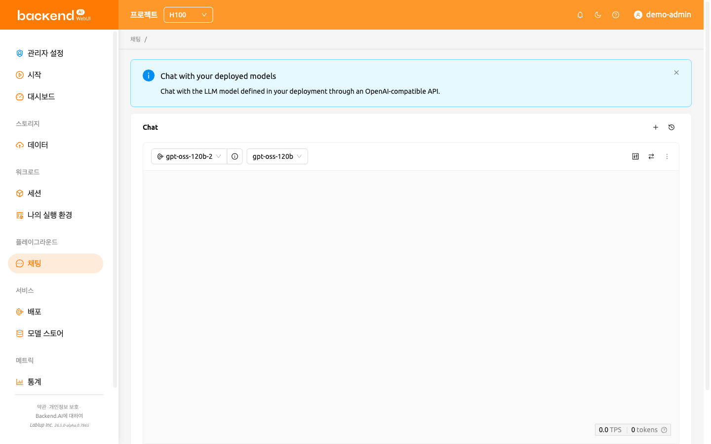

:::note
채팅 페이지에 처음 방문하면 페이지 상단에 안내 배너가 표시됩니다:
"배포한 모델과 대화하기 — 배포에 정의된 LLM 모델과 OpenAI 호환 API로 대화할 수 있습니다."
닫기 버튼을 클릭하여 배너를 닫을 수 있으며, 한번 닫은 후에는 다시 표시되지 않습니다.
:::

## 모델 선택하기

채팅 페이지의 각 채팅 카드 왼쪽 상단에서 배포(Deployment)와 모델을 선택할 수 있습니다.
배포 아이콘이 앞에 표시된 **배포** 선택란(비어 있을 때는 **엔드포인트 선택**으로 표시됩니다)을 클릭하면 "배포" 헤더 아래에 사용 가능한 배포 목록이 드롭다운으로 표시됩니다.
배포를 선택하면 모델 드롭다운 헤더가 "{배포 이름}의 모델"로 업데이트되어 해당 배포와 연결된 모델 목록이 표시됩니다.

<!-- 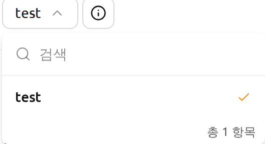 -->
<!-- TODO: Capture screenshot of chat_deployment_select.png — the Deployment dropdown on a chat card, open, with the "Deployment" header and several deployments listed -->

### 목록에 표시되는 배포

**배포** 드롭다운에는 프로젝트의 모든 배포가 표시되지 않고, 지금 바로 응답할 수 있는 배포만 표시됩니다. 배포는 복제본 중 하나 이상이 실제로 트래픽을 처리하고 있을 때, 즉 복제본의 **라이프사이클 상태**가 *실행 중*이고 **트래픽 상태**가 *활성*일 때 목록에 표시됩니다. 두 상태는 서로 독립적인 축이므로 두 조건이 모두 충족되어야 합니다. *실행 중*인 복제본이라도 트래픽 대상에서 제외되어 있을 수 있고, *활성*으로 표시된 복제본이라도 더 이상 실행 중이 아닐 수 있기 때문입니다. 복제본의 상태 축에 대한 자세한 내용은 [배포](#model-serving) 장을 참고하세요.

목록 여부를 배포 단위가 아니라 복제본 단위로 판단하기 때문에, 새 리비전이 적용되는 중에도 배포는 계속 선택할 수 있습니다. 새 리비전을 적용하면 해당 추론 세션이 자원을 기다리는 등의 이유로 한동안 대기 상태에 머무를 수 있지만, 그동안 이전 리비전의 복제본이 계속 트래픽을 처리합니다. 따라서 해당 배포는 드롭다운에 그대로 남아 있으며, 아직 살아 있는 복제본과 계속 대화할 수 있습니다.

아무것도 처리하지 않는 배포는 목록에 표시되지 않습니다. 예를 들어 중지된 배포나 목표 복제본 수가 0인 배포가 이에 해당합니다. 채팅 카드에 이미 선택되어 있는 배포는 목록에서 사라지더라도 선택된 상태와 이름이 그대로 유지되므로, 해당 카드가 어떤 배포를 가리키고 있는지 항상 확인할 수 있고 아래에 설명된 경고도 읽을 수 있습니다.

### 모델 연결 설정

채팅 카드에 모델 목록이 아직 없는 경우, 메시지 영역 위에 설정 패널이 표시됩니다. 이는 배포에서 모델 목록을 가져오는 중일 때와 가져오기에 실패한 후 모두 해당됩니다.

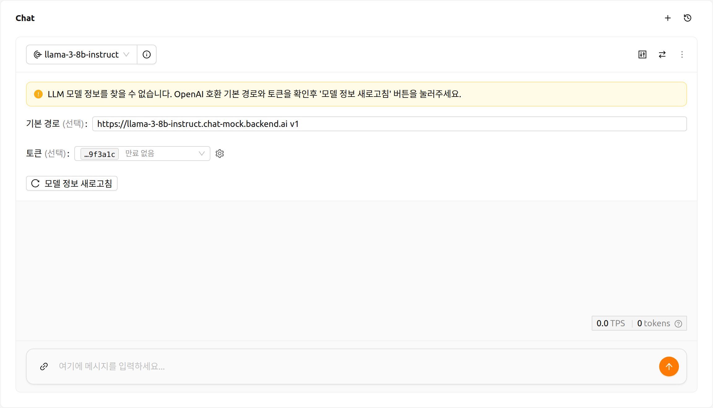
<!-- TODO: Re-capture custom_model.png — the Token field is now a dropdown of the deployment's access tokens with an Access Token Settings gear icon beside it, not a plain text input -->

배포, 모델, 동기화 컨트롤이 있는 채팅 카드 헤더는 모델 목록을 기다리지 않고 곧바로 표시되므로, 가져오기가 진행 중인 동안에도 이 패널을 사용할 수 있습니다. 가져오는 동안에는 **모델 정보 새로고침** 버튼에 로딩 표시가 나타나고, **기본 경로**와 **토큰** 입력란 및 카드 하단의 메시지 입력란이 비활성화됩니다. 가져오기가 끝나면 모두 다시 사용할 수 있습니다. 응답하지 않는 배포는 일정 시간이 지나면 시간 초과되어 가져오기 실패로 처리되므로, 무한정 기다리지 않고 설정을 수정한 뒤 다시 시도할 수 있습니다.

<!-- 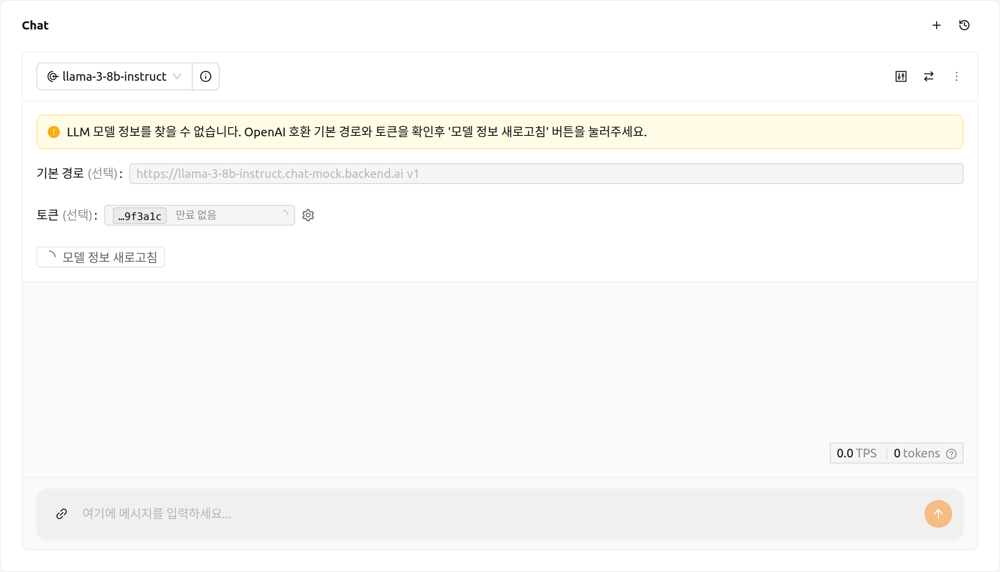 -->
<!-- TODO: Capture screenshot of chat_model_loading.png — the configuration panel while the model list is being fetched: Refresh Model Information showing its loading indicator and the Base Path / Token fields disabled -->

이 패널에는 다음 경고가 표시될 수 있습니다.

- **LLM 모델을 찾을 수 없음** (경고): 배포의 엔드포인트에서 모델 목록을 가져오지 못했습니다. 패널에서 기본 경로나 토큰을 확인한 후 **모델 정보 새로고침** 버튼을 클릭하여 다시 시도하세요. 이 경고는 패널의 일부이므로 최초 가져오기가 진행되는 동안에도 함께 표시됩니다. **모델 정보 새로고침** 버튼의 로딩이 끝난 뒤에 조치하세요.
- **목표 복제본 수가 0** (경고): 선택한 배포의 목표 복제본 수가 0으로 설정되어 있어 응답할 수 없습니다. 배포 설정에서 목표 복제본 수를 1 이상으로 설정하세요.

다음 알림이 채팅 카드에 표시될 수도 있습니다.

- **엔드포인트 URL이 유효하지 않음** (오류): 선택한 배포의 엔드포인트 URL을 확인할 수 없습니다. 배포가 올바르게 구성되어 있는지 확인하세요.
- **스트리밍 오류** (오류): 모델과의 통신 중 오류가 발생했습니다. 메시지에서 원인을 확인하고, 알림을 닫은 후 다시 시도하세요.

사용자 정의 모델 설정에 필요한 입력 사항은 다음 설명을 참조하세요.

- **기본 경로** (선택 사항): 요청을 보낼 때 배포 엔드포인트 URL에 추가되는 경로입니다.
  버전 정보를 반드시 포함해야 합니다.
  예를 들어, OpenAI API를 사용하는 경우 `v1`을 입력합니다.
- **토큰** (선택 사항): 모델 서비스에 접근하기 위한 인증 키입니다. 배포를 선택한 경우 이 항목은 해당 배포의 액세스 토큰 목록을 보여주는 **토큰 선택** 드롭다운이 됩니다. 배포를 선택하지 않은 경우에는 토큰을 직접 붙여 넣을 수 있는 입력란으로 표시됩니다. 토큰은 Backend.AI뿐만 아니라 다양한 서비스에서 생성할 수 있으며 형식과 생성 과정이 서비스에 따라 다르므로, 해당 서비스의 가이드를 참조하세요.
   * 각 항목에는 토큰의 마지막 여섯 글자와 만료 날짜가 함께 표시됩니다. 모든 토큰은 앞부분이 동일하고 입력란 너비에 맞춰 잘려 표시되기 때문에, 이 뒷부분이 서로 구분하기 어려운 항목들을 구별하는 기준이 됩니다. 만료되지 않는 토큰에는 날짜 대신 **만료 없음**이 표시됩니다.
   * 항목 위에 마우스를 올리면 전체 발급 시각과 만료 시각을 확인할 수 있습니다.
   * 이미 만료된 토큰은 목록에 표시되지 않습니다. 값이 비어 있는 경우 가장 최근에 생성된 유효한 토큰이 자동으로 선택됩니다.
   * 입력란 옆의 톱니바퀴 아이콘(**액세스 토큰 설정**)을 클릭하면 배포 상세 페이지의 액세스 토큰 섹션이 열리며, 여기에서 새 토큰을 발급할 수 있습니다. 돌아오면 목록을 다시 읽어오므로 방금 만든 토큰을 바로 선택할 수 있습니다. 자세한 방법은 [토큰 생성](#generating-tokens) 섹션을 참조하세요.

<!-- 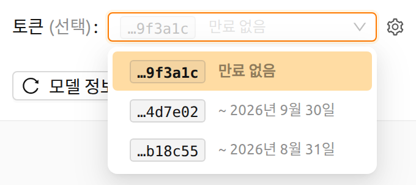 -->
<!-- TODO: Capture screenshot of chat_token_select.png — the Token dropdown open, showing options labeled with the token tail and expiry date, one "No Expiration" option, and the Access Token Settings gear icon beside the field -->

## 비교 채팅 카드 추가 및 삭제

우측 상단의 `비교` 아이콘 버튼을 클릭하여 새로운 비교 채팅 카드를 추가할 수 있습니다.

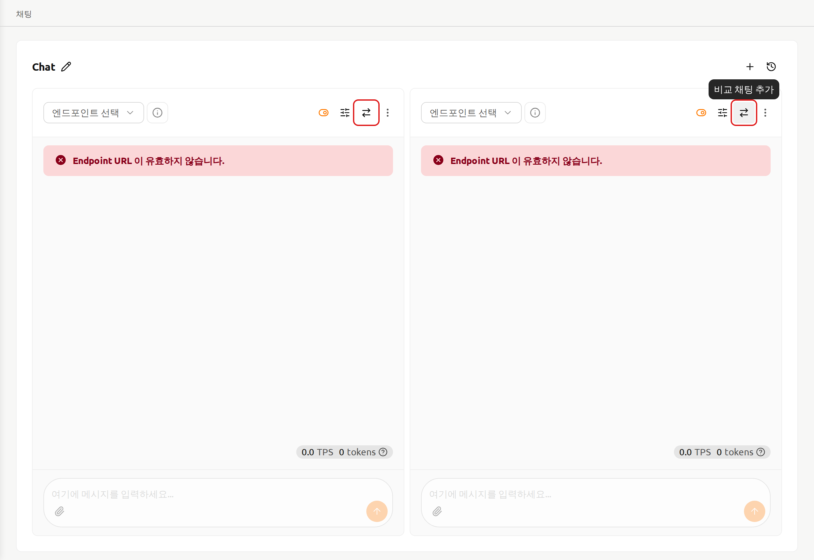

각 채팅 세션을 삭제하려면 카드 우측 상단에 있는 `더보기` 버튼을 클릭하세요. 버튼을 클릭하면 드롭다운 메뉴가 표시되며, `채팅 삭제` 버튼을 통해 해당 채팅 세션을 삭제할 수 있습니다. 입력한 내용이 존재하는 경우에는 모두 삭제되므로 주의해 주세요.

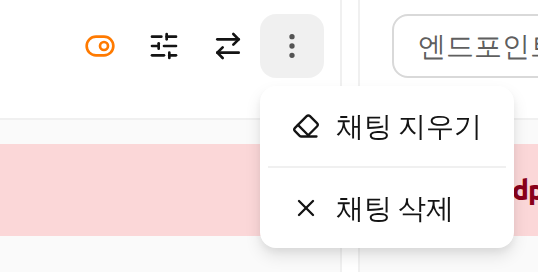

## 채팅 기록 삭제

`더보기` 버튼을 클릭하면 `채팅 지우기` 옵션이 나타납니다. 이 옵션을 선택하면 카드에 있는 모든 채팅 기록이 삭제됩니다. 단, 카드의 세션은 종료되지 않습니다.

## 입력 연동

채팅 카드의 우측 상단에 있는 `동기화` 버튼을 사용하면 '동기화'가 활성화된 모든 채팅 카드의 입력을 동기화할 수 있습니다. '동기화'가 활성화된 상태에서 `Enter`를 누르거나 어떤 카드의 `전송` 버튼을 클릭하면 현재 입력 중인 카드의 입력이 일괄 적용됩니다. 이 기능은 하나의 입력값을 통해 다양한 모델의 응답 결과를 비교하고 싶을 때 유용하게 사용할 수 있습니다.

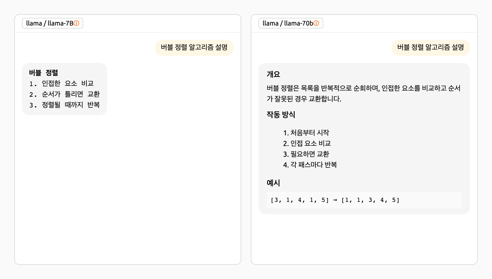

## 파라미터 조정

우측 상단의 파라미터 버튼을 클릭하여 각 모델에 대한 파라미터를 조정할 수 있습니다. 사용자는 최대 토큰, 온도, Top P, Top K와 같은 다양한 값을 설정할 수 있습니다. 동기화 기능을 사용하여 같은 모델에 대해 다른 파라미터를 적용한 후 결과를 비교할 수 있습니다.

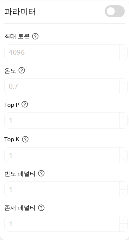

## 채팅 기록

우측 상단의 `+` 버튼을 클릭하여 새로운 채팅을 시작할 수 있습니다.

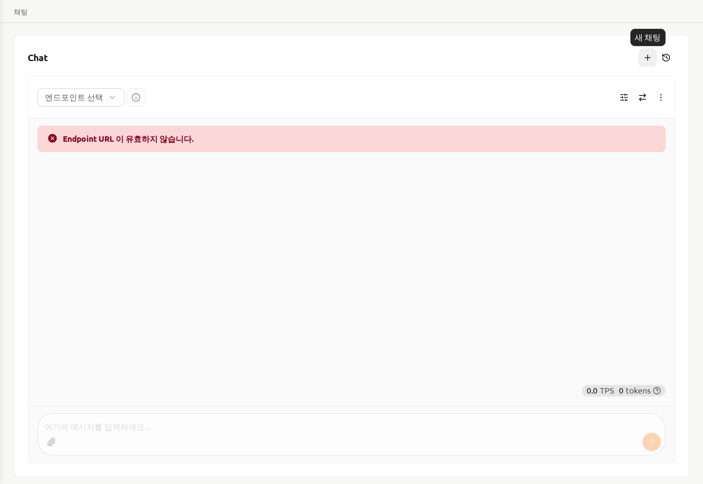

모든 채팅 기록은 로컬 스토리지에 저장됩니다. 우측 상단의 `히스토리` 버튼을 클릭하여 이전 채팅 기록에 접근할 수 있습니다.

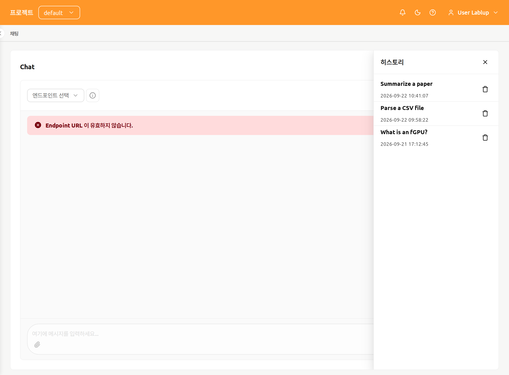
