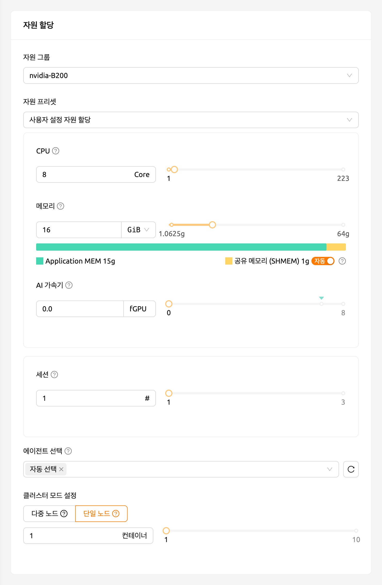
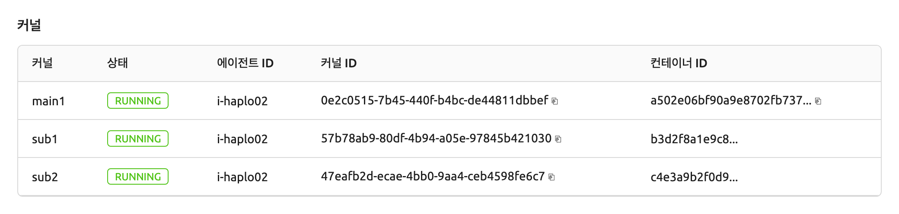
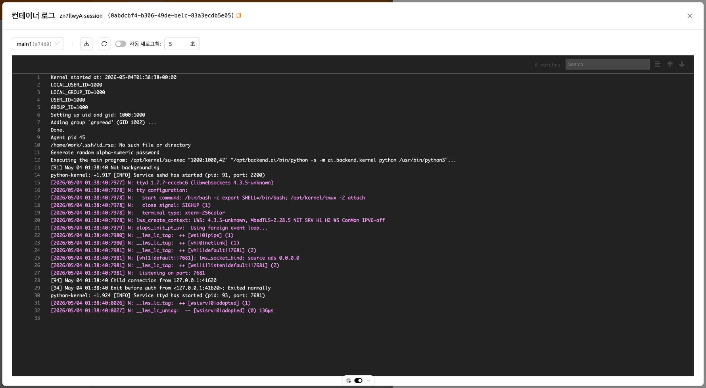

# Backend.AI 클러스터 연산 세션

   클러스터 연산 세션 기능은 Backend.AI 서버 20.09 이상에서 지원됩니다.

### Backend.AI 클러스터 연산 세션 개괄

Backend.AI는 분산 컴퓨팅 및 분산 학습 작업을 지원하기 위해 클러스터 연산 세션을 지원합니다. 클러스터 세션은 여러 개의 컨테이너로 구성되며, 각 컨테이너는 여러 에이전트 노드에 걸쳐 생성됩니다. 클러스터 세션에 속한 컨테이너들은 동적으로 생성된 사설 네트워크를 통해 자동으로 연결됩니다. 임시 도메인 이름(`main1`, `sub1`, `sub2` 등)이 자동으로 부여되어, SSH 접속과 같은 네트워크 작업을 간편하게 수행할 수 있습니다. 컨테이너 간 SSH 접속에 필요한 모든 비밀 키와 각종 설정은 자동으로 생성됩니다.

Backend.AI 클러스터 세션의 상세 특징은 다음을 참고하십시오.

- 클러스터 세션을 구성하는 컨테이너는 한 자원 그룹에 속한 하나 이상의 에이전트 노드에 걸쳐 생성됩니다.
- 클러스터 세션은 하나의 메인 컨테이너(`main1`)와 하나 이상의 서브 컨테이너(`subX`)로 구성됩니다.
- 모든 구성 컨테이너는 동일한 자원을 할당하여 생성됩니다. 위 그림에서 session X의 네 개 컨테이너는 모두 동일한 양의 자원으로 생성됩니다.
- 모든 구성 컨테이너는 연산 세션 생성 시 지정한 데이터 폴더를 동일하게 마운트합니다.
- 모든 구성 컨테이너는 사설 네트워크로 묶입니다.

   * 메인 컨테이너의 이름은 `main1`입니다.
   * 서브 컨테이너는 `sub1`, `sub2`, ... 순서로 이름이 부여됩니다.
   * 한 클러스터 세션을 구성하는 컨테이너 사이에는 별도의 방화벽이 없습니다.
   * 사용자는 메인 컨테이너에 직접 접속할 수 있으며, 서브 컨테이너는 메인 컨테이너에 먼저 접속한 후 메인 컨테이너 내에서 접속할 수 있습니다.

- 두 가지 모드/형태의 클러스터 세션이 있습니다.

   * 단일 노드 클러스터 세션: 하나의 에이전트 노드에서 두 개 이상의 컨테이너를 묶어 구성한 클러스터 세션입니다. 위 그림에서는 session Z가 이에 해당하며 로컬 브릿지 네트워크로 묶입니다.
   * 멀티 노드 클러스터 세션: 두 개 이상의 컨테이너를 서로 다른 에이전트 노드에 배치해서 구성한 클러스터 세션입니다. 위 그림에서는 session X가 이에 해당하며, 오버레이 네트워크로 묶입니다.
   * 하나의 컨테이너를 가지는 연산 세션은 클러스터 세션이 아닌 일반 연산 세션으로 분류합니다. 위 그림에서는 session Y가 이에 해당합니다.

- 다음과 같은 경우에는 단일 노드 클러스터 세션이 생성됩니다.

   * 연산 세션 생성 시 Cluster mode 필드에서 "Single Node"를 선택한 경우입니다. 모든 컨테이너를 동시에 생성할 수 있는 충분한 자원을 갖춘 단일 에이전트가 없으면, 세션은 대기(`PENDING`) 상태로 유지됩니다.
   * 연산 세션 생성 시 Cluster mode에 "Multi Node"를 선택했으나, 모든 컨테이너를 동시에 생성할 수 있는 자원을 가진 단일 에이전트가 있을 경우, 그 에이전트에 모든 컨테이너를 배치합니다. 이는 가능한 외부 네트워크를 배제하여 네트워크 지연 시간을 줄이기 위함입니다.

클러스터 세션의 각 컨테이너에는 다음과 같은 환경 변수가 지정됩니다. 클러스터 구성 및 현재 접속된 컨테이너 정보를 확인하기 위해 참고할 수 있습니다.

- `BACKENDAI_CLUSTER_HOST`: 현재 컨테이너의 이름 (예: `main1`)
- `BACKENDAI_CLUSTER_HOSTS`: 현재 클러스터 세션에 속한 모든 컨테이너의 이름
  (예: `main1,sub1,sub2`)
- `BACKENDAI_CLUSTER_IDX`: 현재 컨테이너의 숫자 인덱스 (예: `1`)
- `BACKENDAI_CLUSTER_MODE`: 클러스터 세션 모드/형태 (예: `single-node`)
- `BACKENDAI_CLUSTER_ROLE`: 현재 컨테이너의 유형 (예: `main`)
- `BACKENDAI_CLUSTER_SIZE`: 현재 클러스터 세션에 속한 전체 컨테이너 수
  (예: `4`)
- `BACKENDAI_KERNEL_ID`: 현재 컨테이너의 ID
  (예: `3614fdf3-0e04-...`)
- `BACKENDAI_SESSION_ID`: 현재 컨테이너가 속한 클러스터 세션의 ID
  (예: `3614fdf3-0e04-...`). 메인 컨테이너의 `BACKENDAI_KERNEL_ID`는
  `BACKENDAI_SESSION_ID`와 동일합니다.

### Backend.AI 클러스터 연산 세션의 사용

이번 절에서는 실제로 사용자 GUI를 통해 클러스터 연산 세션을 생성하고 사용하는 방법에 관해 알아보겠습니다.

세션 (Sessions) 페이지에서 연산 세션 생성 다이얼로그를 띄운 후 일반 연산 세션을 생성하는 것과 같은 방식으로 설정합니다. 이 때 설정한 자원의 양은 **하나의 컨테이너에** 할당되는 양입니다. 예를 들어, CPU를 4개로 설정한 경우 클러스터 세션을 구성하는 각 컨테이너에 4 코어 CPU가 할당됩니다. 클러스터 연산 세션 전체에 할당되는 자원 양이 아니라는 점에 유의하십시오. 클러스터 연산 세션을 생성하기 위해서는 여기서 설정한 자원 양의 N배에 해당하는 서버 자원이 필요합니다 (N은 클러스터 크기). 데이터 보존을 위해 데이터 폴더를 마운트하는 것도 잊지 마십시오.

아래쪽에 있는 "Cluster mode" 필드에서 원하는 클러스터 생성 형태를 결정할 수 있습니다.

- Single Node: 모든 구성 컨테이너는 하나의 에이전트 노드에 생성됩니다.
- Multi Node: 구성 컨테이너는 자원 그룹 내에 있는 여러 에이전트 노드에 걸쳐 생성됩니다. 다만, 모든 컨테이너가 하나의 에이전트 노드에 생성될 수 있는 경우에는, 하나의 에이전트 노드에 우선 생성합니다. 이는 컨테이너 간 통신 과정에서 네트워크 지연 시간을 최대한 줄이기 위함입니다.

그 아래에 있는 "Cluster size"를 설정합니다. 3으로 설정할 경우, 메인 컨테이너를 포함해서 총 세 개의 컨테이너가 생성됩니다. 이 세 개의 컨테이너는 사설 네트워크로 묶여 하나의 연산 세션을 구성합니다.

LAUNCH 버튼을 클릭하여 연산 세션 생성 요청을 보내고 잠시 기다리면 클러스터 세션이 생성됩니다. 세션 생성 이후에, 세션 상세 페이지에서 생성된 컨테이너를 확인할 수 있습니다.

방금 생성한 연산 세션에서 터미널 앱을 열어 보겠습니다. 환경 변수를 조회하면, 위 섹션에서 설명한 `BACKENDAI_CLUSTER_*` 변수들이 설정되어 있는 것을 확인할 수 있습니다. 각 환경 변수의 의미와 값을 위의 설명과 비교해 보십시오.

`sub1` 컨테이너로 SSH 접속을 할 수도 있습니다. 별도의 SSH 설정 없이, `ssh sub1` 명령어를 입력하기만 하면 됩니다. `work@` 뒤의 호스트 이름이 변경된 것을 확인할 수 있으며, 이는 서브 컨테이너의 셸이 표시되고 있음을 나타냅니다.

이런 방식으로 Backend.AI에서는 클러스터 연산 세션을 손쉽게 생성할 수 있습니다. 클러스터 연산 세션을 통해 분산 학습 및 연산을 실행하기 위해서는, TensorFlow/PyTorch 등 ML 라이브러리에서 제공하는 분산 학습용 모듈이나 Horovod, NNI, MLFlow 등과 같은 별도의 지원 소프트웨어가 필요하고, 해당 소프트웨어를 활용할 수 있는 방식으로 코드를 주의 깊게 작성해야 합니다. Backend.AI에서는 분산 학습에 필요한 소프트웨어를 포함하는 커널 이미지를 제공하고 있으므로, 해당 이미지를 사용하여 분산 학습 알고리즘을 구현해 볼 수 있습니다.

### 컨테이너 별 로그 확인하기

24.03 버전부터, 로그 모달에서 각 컨테이너의 로그를 확인할 수 있습니다. 이 기능을 통해 `main` 컨테이너뿐만 아니라 `sub` 컨테이너에서 어떤 일이 일어나고 있는지 파악하는 데 도움이 됩니다.

