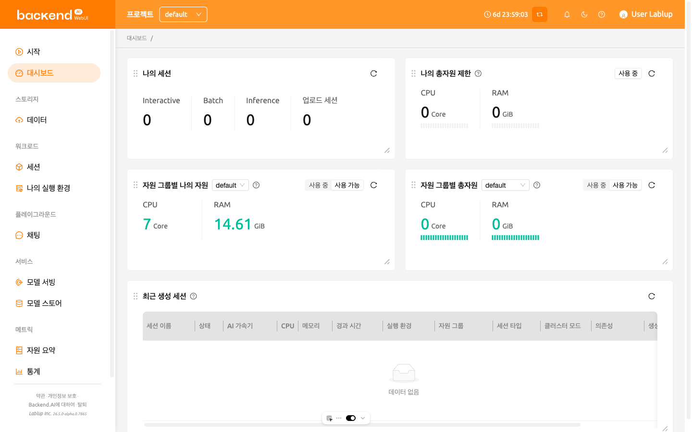
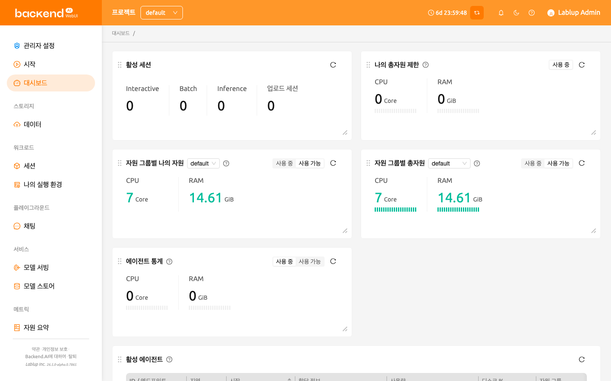

# 대시보드

**대시보드** 페이지는 모든 프로젝트와 자원 그룹의 자원 사용량, 한도, 그리고 실행 중인 세션 정보를 한눈에 확인할 수 있는 종합 현황 화면입니다. 사용 중인 자원의 분포를 직관적으로 파악하고, 시스템 활동 상태를 실시간으로 모니터링할 수 있습니다. 각 패널의 새로고침 아이콘을 클릭하면 최신 데이터로 갱신할 수 있습니다.

이 페이지는 다음과 같은 주요 패널로 구성되어 있습니다.

- 나의 세션:
    현재 계정에서 실행 중인 세션을 유형별로 보여 줍니다. *Interactive*, *Batch*, *Inference*, *Upload* 등 세션 종류별 실행 개수를 확인할 수 있습니다.

- 나의 총자원 제한:
    모든 프로젝트와 자원 그룹을 합산한 전체 자원 사용량과 남은 자원을 표시합니다. 도메인, 프로젝트, 키페어 등 여러 한도 제한이 동시에 적용될 경우, **가장 제한적인 한도**를 기준으로 계산됩니다.

- 자원 그룹별 나의 자원:
    현재 프로젝트의 선택된 자원 그룹에서 사용 중인 자원과 남은 자원을 표시합니다. 상단의 드롭다운 메뉴를 통해 자원 그룹을 변경할 수 있습니다.

- 자원 그룹별 총자원:
    선택된 자원 그룹 전체의 사용량과 가용량을 요약하여 표시합니다. 그룹 내 모든 에이전트의 데이터를 합산해 계산된 값입니다.

- 최근 생성 세션:
    현재 프로젝트에서 가장 최근에 생성된 실행 중인 세션 목록을 보여 줍니다. 세션 이름, 상태, CPU/메모리 사용량, 환경, 자원 그룹, 세션 유형, 생성 일시 등을 확인할 수 있습니다. 기본적으로 최근 5개의 실행 중인 세션이 표시됩니다.

슈퍼관리자에게는 추가 정보가 제공됩니다.

'활성 세션', '에이전트 통계', '활성 에이전트' 패널을 제외한 나머지 패널은 사용자 대시보드와 동일한 정보를 표시합니다.

- 활성 세션:
    현재 프로젝트에서 실행 중인 세션의 총 개수를 세션 유형별로 분류하여 표시합니다.

- 에이전트 통계:
    시스템 내 모든 에이전트의 사용 중인 자원 현황을 제공합니다. 표시된 값은 모든 활성 세션이 사용 중인 자원의 총합입니다.

- 활성 에이전트:
    시스템에서 현재 활성화된 모든 에이전트 목록을 표시합니다.