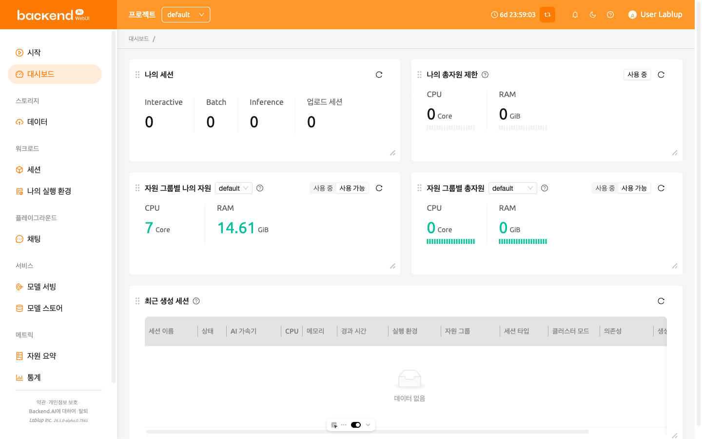

# 대시보드

**대시보드** 페이지는 모든 프로젝트와 자원 그룹의 자원 사용량, 한도, 그리고 실행 중인 세션 정보를 한눈에 확인할 수 있는 종합 현황 화면입니다. 사용 중인 자원의 분포를 직관적으로 파악하고, 시스템 활동 상태를 실시간으로 모니터링할 수 있습니다.

이 페이지는 다음과 같은 주요 패널로 구성되어 있습니다.

- **나의 세션:**
    현재 계정에서 실행 중인 세션을 유형별로 보여 줍니다. *Interactive*, *Batch*, *Inference*, *Upload* 등 세션 종류별 실행 개수를 확인할 수 있습니다.

- **나의 총자원 제한:**
    모든 프로젝트와 자원 그룹을 합산한 전체 자원 사용량과 남은 자원을 표시합니다. 도메인, 프로젝트, 키페어 등 여러 한도 제한이 동시에 적용될 경우, **가장 제한적인 한도**를 기준으로 계산됩니다.

- **자원 그룹 내 나의 자원:**
    현재 프로젝트의 선택된 자원 그룹에서 사용 중인 자원과 남은 자원을 표시합니다. 상단의 드롭다운 메뉴를 통해 자원 그룹을 변경할 수 있습니다.

- **자원 그룹 내 총자원:**
    선택된 자원 그룹 전체의 사용량과 가용량을 요약하여 표시합니다. 그룹 내 모든 에이전트의 데이터를 합산해 계산된 값입니다.

:::note
**자원 그룹 내 총자원** 패널은 시스템 구성에 따라 표시되지 않을 수 있습니다.
:::

- **최근 생성 세션:**
    현재 프로젝트에서 가장 최근에 생성된 실행 중인 세션 목록을 보여 줍니다. 세션 이름, 상태, CPU/메모리 사용량, 환경, 자원 그룹, 세션 유형, 생성 일시 등을 확인할 수 있습니다. 기본적으로 최근 5개의 실행 중인 세션이 표시됩니다.

슈퍼관리자로 로그인한 경우, 대시보드 페이지에 일반 사용자 패널과 함께
**에이전트 통계** 및 **활성 에이전트** 패널이 추가로 표시됩니다.
이 슈퍼관리자 전용 패널은 전체 클러스터의 상태와 가용 용량을 한눈에 보여 줍니다.

## 자동 새로고침

대시보드는 모든 패널 데이터를 **15초**마다 자동으로 새로고침합니다. 이를 통해 수동 조작 없이도 항상 최신 정보를 확인할 수 있습니다.

## 대시보드 레이아웃 커스터마이즈

패널을 재배치하거나 크기를 조정하여 대시보드 레이아웃을 원하는 대로 커스터마이즈할 수 있습니다.

- **패널 이동**: 패널의 헤더를 드래그하여 보드 내에서 위치를 변경할 수 있습니다.
- **패널 크기 조정**: 패널의 우측 하단 모서리를 드래그하여 크기를 조정할 수 있습니다. 각 패널은 콘텐츠의 가독성을 보장하기 위한 최소 크기가 설정되어 있습니다.

커스터마이즈된 레이아웃은 자동으로 저장되어 브라우저 세션 간에 유지됩니다. 레이아웃은 사용자별로 저장되므로, 각 사용자가 자신만의 배치를 설정할 수 있습니다.

:::tip
WebUI 업데이트로 새로운 대시보드 패널이 추가되면, 저장된 커스텀 레이아웃이 있더라도
새 패널이 대시보드에 자동으로 표시됩니다.
:::
