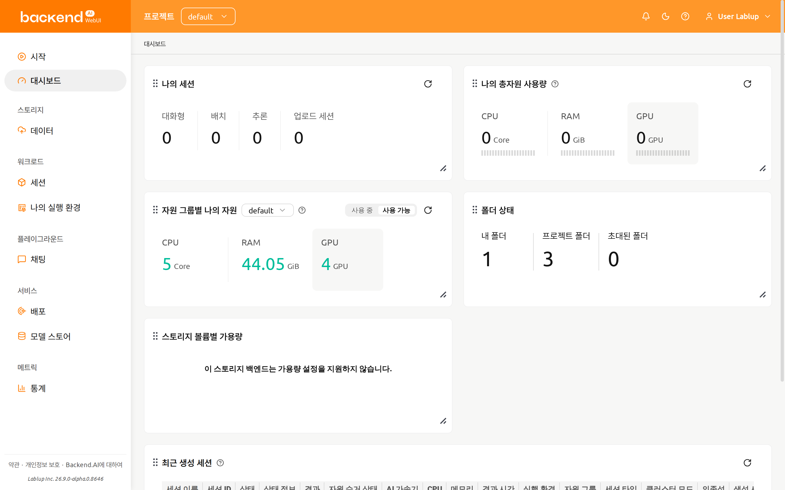
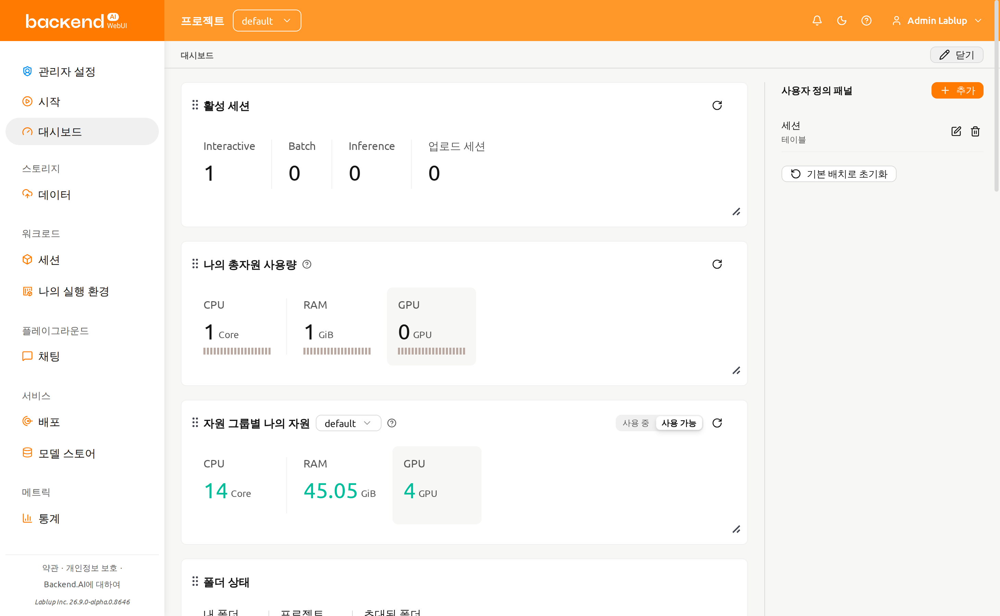
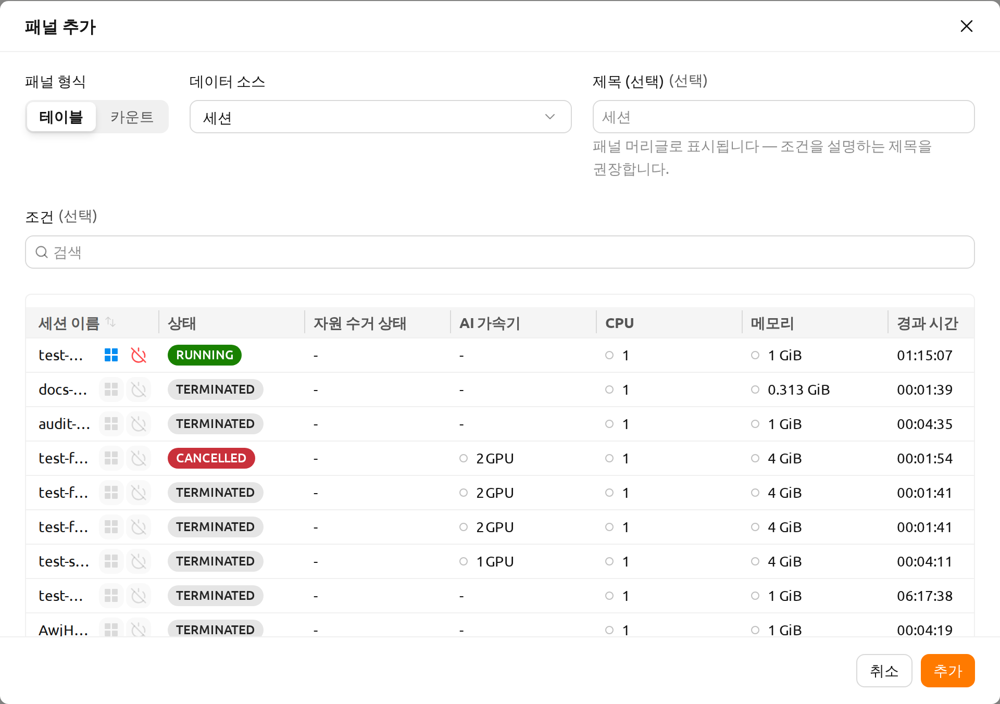

# 대시보드

**대시보드** 페이지는 모든 프로젝트와 자원 그룹의 자원 사용량, 한도, 실행 중인 세션 정보를 한눈에 확인할 수 있는 종합 현황 화면입니다. 사용 중인 자원의 분포를 직관적으로 파악하고, 시스템 활동 상태를 실시간으로 모니터링합니다.

이 페이지는 다음과 같은 주요 패널로 구성되어 있습니다.

- **나의 세션:**
    현재 계정에서 실행 중인 세션을 유형별로 보여 줍니다. *Interactive*, *Batch*, *Inference*, *Upload* 등 세션 종류별 실행 개수를 확인할 수 있습니다.

- **나의 총자원 사용량:**
    모든 프로젝트에서 현재 사용 중인 자원량을 표시합니다. 각 자원의 수치 아래에는 사용량 막대가 함께 표시되며, 막대에 마우스 커서를 올리면 총자원 제한 대비 사용량을 확인할 수 있습니다. 도메인, 프로젝트, 키페어 등 여러 제한이 동시에 적용될 경우 **가장 엄격한 제한**이 적용됩니다.

- **자원 그룹 내 나의 자원:**
    현재 프로젝트의 선택된 자원 그룹에서 사용 중인 자원과 남은 자원을 표시합니다. 상단의 드롭다운 메뉴를 통해 자원 그룹을 변경할 수 있습니다.

- **자원 그룹 내 총자원:**
    선택된 자원 그룹 전체의 사용량과 가용량을 요약하여 표시합니다. 그룹 내 모든 에이전트의 데이터를 합산해 계산된 값입니다.

:::note
**자원 그룹 내 총자원** 패널은 시스템 구성에 따라 표시되지 않을 수 있습니다.
:::

- **최근 생성 세션:**
    현재 프로젝트에서 가장 최근에 생성된 실행 중인 세션 목록을 보여 줍니다. 세션 이름, 상태, CPU/메모리 사용량, 환경, 자원 그룹, 세션 유형, 생성 일시 등을 확인할 수 있습니다. 기본적으로 최근 5개의 실행 중인 세션이 표시됩니다.

슈퍼 관리자로 로그인한 경우, 대시보드 페이지에 일반 사용자 패널과 함께
**에이전트 통계** 및 **활성 에이전트** 패널이 추가로 표시됩니다.
이 패널은 클러스터 전체의 에이전트 상태와 자원 사용 현황을 보여 줍니다.

## 대시보드 레이아웃 사용자화

보드는 별도의 모드로 전환하지 않아도 언제든지 재배치할 수 있습니다.

- **패널 이동**: 패널의 헤더를 드래그하여 보드 내에서 위치를 변경할 수 있습니다.
- **패널 크기 조정**: 패널의 우측 하단 모서리를 드래그하여 크기를 조정할 수 있습니다. 각 패널은 콘텐츠의 가독성을 보장하기 위한 최소 크기가 설정되어 있습니다.

<!-- TODO: Capture screenshot of the dashboard in edit mode (board + edit sidebar) -->

사용자화된 레이아웃은 자동으로 저장되어 브라우저 세션 간에 유지됩니다. 레이아웃은 사용자별로 저장되므로, 각 사용자가 자신만의 배치를 설정할 수 있습니다. 배치를 기본 상태로 되돌리려면 편집 사이드바 하단의 **기본 배치로 초기화** 버튼을 클릭한 뒤 확인합니다. 배치를 초기화해도 커스텀 패널은 삭제되지 않습니다.

:::tip
WebUI 업데이트로 새로운 대시보드 패널이 추가되면, 저장된 커스텀 레이아웃이 있더라도
새 패널이 대시보드에 자동으로 표시됩니다.
:::

### 커스텀 패널

:::note[실험적 기능]
**사용자 설정** 페이지의 [실험적 기능](#experimental-features) 섹션에서
**커스텀 대시보드 패널**을 활성화해야 커스텀 패널 기능 전체를 사용할 수
있습니다. 나중에 이 기능을 비활성화하면 기존 커스텀 패널이 삭제되지 않고
숨겨지며, 다시 활성화하면 저장된 보드 위치 그대로 다시 나타납니다.
:::

페이지 우측 상단의 **편집** 버튼을 클릭하면 보드 오른쪽에 커스텀 패널 사이드바가 열리고, **닫기**를 클릭하면 다시 숨겨집니다. 사이드바에는 커스텀 패널 목록이 표시됩니다. 커스텀 패널은 선택한 자원을 지정한 조건으로 좁혀 보여 주는 테이블입니다. 패널에는 제목과 테이블만 표시되므로, 조건을 설명하는 제목을 지정하는 것이 좋습니다.

패널을 추가하려면 사이드바의 **추가** 버튼을 클릭합니다. 패널 대화 상자는 다음 항목으로 구성됩니다.

- **리소스**: 패널에 표시할 자원입니다. **세션**, **사용자**, **데이터 & 폴더** 중에서 선택합니다.
- **제목**: 패널 제목(선택 사항)입니다. 입력하지 않으면 자원 이름이 사용됩니다.
- **조건**: 테이블에 표시할 행을 좁히는 속성 필터입니다.

입력 항목 아래의 실시간 미리 보기에는 현재 조건과 일치하는 행이 표시됩니다. 미리 보기에서 열을 정렬하면 해당 정렬 순서가 패널에 적용됩니다. **추가** 버튼을 클릭하면 패널이 보드에 추가됩니다.

<!-- TODO: Capture screenshot of the add-panel dialog with the live preview -->

패널의 자원, 조건, 제목을 나중에 변경하려면 사이드바에서 해당 패널 옆의 연필(**수정**) 아이콘 또는 보드에 표시된 패널 헤더의 아이콘을 클릭한 뒤 변경 내용을 저장합니다. 패널을 제거하려면 휴지통(**삭제**) 아이콘을 클릭하고 확인 팝업에서 승인합니다.

:::note
**세션** 패널은 현재 프로젝트의 세션을 보여 주며 모든 사용자가 사용할 수 있습니다. **사용자** 및 **데이터 & 폴더** 패널은 슈퍼 관리자만 사용할 수 있습니다. 현재 권한으로 조회할 수 없는 자원의 패널은 사이드바 목록에는 남아 있지만 보드에는 표시되지 않습니다.
:::

## 자동 새로고침

대시보드 데이터는 15초마다 자동으로 새로고침되므로, 페이지를 다시 로드하지 않아도 패널이 항상 최근 활동을 반영합니다. 커스텀 패널도 기본 패널과 동일한 주기로 새로고침됩니다.
