<a id="model-serving"></a>

# 배포

## 배포 개요

Backend.AI는 **배포(Deployments)** 기능을 통해 AI 모델을 추론 서비스로 배포할 수 있도록 지원합니다. 배포는 모델을 안정적인 엔드포인트 URL 뒤에 노출하여, 엔드 유저 애플리케이션(모바일 앱, 웹 서비스 백엔드, 사내 도구 등)이 해당 엔드포인트를 호출해 추론을 수행할 수 있도록 합니다.


배포는 일반 연산 세션을 확장하여 자동화된 유지·보수, 레플리카 스케일링, 그리고 레플리카가 변경되더라도 바뀌지 않는 영구적인 엔드포인트 주소를 제공합니다. 원하는 스케일링 파라미터만 지정하면 Backend.AI가 내부의 추론 세션을 자동으로 생성, 모니터링, 종료해 주므로 세션을 직접 관리할 필요가 없습니다.

## 배포 생성 및 사용 방법

26.4.0 버전부터는 별도의 설정 파일 없이도 배포를 간편하게 생성할 수 있습니다.

**빠른 배포 (권장)**: [모델 스토어](#model-store)에서 사전 구성된 모델을 탐색하고 `배포(Deploy)` 버튼을 클릭하면 바로 배포할 수 있습니다.

**직접 배포**: 배포 페이지에서 `배포 생성` 버튼을 클릭하여 **배포 생성** 모달을 엽니다. 배포가 생성된 후에는 배포 상세 페이지에서 `리비전 추가(Add Revision)`를 클릭하고, `vLLM`, `SGLang` 등의 런타임 변형을 선택하여 리비전을 추가합니다.

일반적인 워크플로우는 다음과 같습니다:

1. 배포를 생성합니다 (이름, 공개 여부, 자원 그룹 설정).
2. 리비전을 추가합니다 (런타임 변형, 이미지, 자원, 모델 스토리지 설정).
3. (배포가 공개되지 않은 경우) 토큰을 발급합니다.
4. (엔드 유저용) 서비스 엔드포인트에 접속하여 서비스를 확인합니다.
5. (필요한 경우) 새 리비전을 추가하거나 이전 리비전을 적용합니다.
6. (필요한 경우) 배포를 종료합니다.

<details>
<summary>고급: 모델 정의 파일 및 서비스 정의 파일 사용하기 (Custom 런타임)</summary>

`Custom` 런타임 변형을 사용하거나 더 세밀한 제어가 필요한 경우, 모델 정의 파일과 서비스 정의 파일을 직접 생성하여 사용할 수 있습니다:

1. 모델 정의 파일을 생성합니다.
2. 서비스 정의 파일을 생성합니다.
3. 정의 파일들을 모델 타입 폴더에 업로드합니다.
4. 리비전을 추가할 때 `Custom` 런타임 변형을 선택하고 **Config 파일 사용** 모드를 선택합니다.

자세한 내용은 [모델 정의 파일 생성하기](#model-definition-guide) 및 [서비스 정의 파일 생성](#service-definition-file) 섹션을 참조하세요.

</details>

<details>
<summary>참고: Custom 런타임 구성 파일 가이드</summary>

<a id="model-definition-guide"></a>

### 모델 정의 파일 생성하기

:::note
24.03 버전부터 모델 정의 파일 이름을 구성할 수 있습니다. 모델 정의 파일 경로에
다른 입력 필드를 입력하지 않으면 시스템은 `model-definition.yml` 또는
`model-definition.yaml`로 간주합니다.
:::

모델 정의 파일은 Backend.AI 시스템이 추론용 세션을 자동으로 시작, 초기화하고 필요에 따라 스케일링할 때 필요한 설정 정보를 담고 있는 파일입니다. 이 파일을 추론 서비스 엔진을 담고 있는 컨테이너 이미지와는 독립적으로 모델 타입 폴더에 저장합니다. 이를 통해 모델을 실행하는 엔진이 다양한 모델을 필요에 따라 바꿔가며 서비스할 수 있도록 하며, 모델이 변경될 때마다 컨테이너 이미지를 새로 빌드 및 배포하지 않아도 되도록 해줍니다. 네트워크 스토리지에서 직접 모델 정의와 모델 데이터를 불러오므로, 자동 스케일링 시 배포 과정을 더 단순화 및 효율화할 수 있습니다.

모델 정의 파일은 다음과 같은 형식을 따릅니다.

```yaml
models:
  - name: "simple-http-server"
    model_path: "/models"
    service:
      start_command:
        - python
        - -m
        - http.server
        - --directory
        - /home/work
        - "8000"
      port: 8000
      health_check:
        path: /
        interval: 10.0
        max_retries: 10
        max_wait_time: 15.0
        expected_status_code: 200
        initial_delay: 60.0
```

**모델 정의 파일에 대한 키-값 설명**

:::note
"(필수)" 표시가 없는 필드는 선택사항입니다.
:::

- `name` (필수): 모델의 이름을 정의합니다.
- `model_path` (필수): 모델이 정의된 경로를 지정합니다.
- `service`: 서비스될 파일들에 대한 정보를 구성하는 항목입니다
  (명령 스크립트 및 코드 포함).

   - `pre_start_actions`: `start_command` 이전에 실행되는 작업입니다. 이러한 작업들은
     구성 파일 생성, 디렉토리 설정, 초기화 스크립트 실행 등을 통해 환경을 준비합니다.
     작업은 정의된 순서대로 순차적으로 실행됩니다.

      - `action`: 수행할 작업 유형입니다. 사용 가능한 작업 유형과 해당 매개변수는
        [사전 시작 작업](#prestart-actions)을 참조하세요.
      - `args`: 작업별 매개변수입니다. 각 작업 유형마다 다른 필수 인수가 있습니다.

   - `start_command` (필수): 배포에서 실행될 명령을 지정합니다.
     문자열 또는 문자열 목록으로 지정할 수 있습니다.
   - `port` (필수): 모델 서비스를 위한 컨테이너 포트입니다 (예: `8000`, `8080`).
   - `health_check`: 모델 서비스의 주기적인 상태 모니터링을 위한 구성입니다.
     이 설정이 구성되면, 시스템은 자동으로 서비스가 올바르게 응답하는지 확인하고
     비정상 인스턴스를 트래픽 라우팅에서 제거합니다.

      - `path` (필수): 상태 확인 요청을 위한 HTTP 엔드포인트 경로입니다 (예: `/health`, `/v1/health`).
      - `interval` (기본값: `10.0`): 연속적인 상태 확인 간의 시간(초 단위)입니다.
      - `max_retries` (기본값: `10`): 서비스를 `UNHEALTHY`로 표시하기 전에
        허용되는 연속 실패 횟수입니다. 이 임계값을 초과하기 전까지 서비스는 계속 트래픽을 받습니다.
      - `max_wait_time` (기본값: `15.0`): 각 상태 확인 HTTP 요청의 타임아웃 시간(초 단위)입니다.
        이 시간 내에 응답이 없으면 확인은 실패로 간주됩니다.
      - `expected_status_code` (기본값: `200`): 정상 응답을 나타내는 HTTP 상태 코드입니다.
        일반적인 값: `200` (OK), `204` (No Content).
      - `initial_delay` (기본값: `60.0`): 컨테이너 생성 후 상태 확인을 시작하기 전에
        대기하는 시간(초 단위)입니다. 이는 모델 로딩, GPU 초기화 및 서비스 워밍업에 시간을 제공합니다.
        대형 모델의 경우 더 높은 값을 설정하세요 (예: 70B+ LLM의 경우 `300.0`).


**상태 확인 동작 이해하기**

상태 확인 시스템은 개별 모델 서비스 컨테이너를 모니터링하고, 상태에 따라 트래픽 라우팅을 자동으로 관리합니다.

**① AppProxy: 트래픽 라우팅 제어**

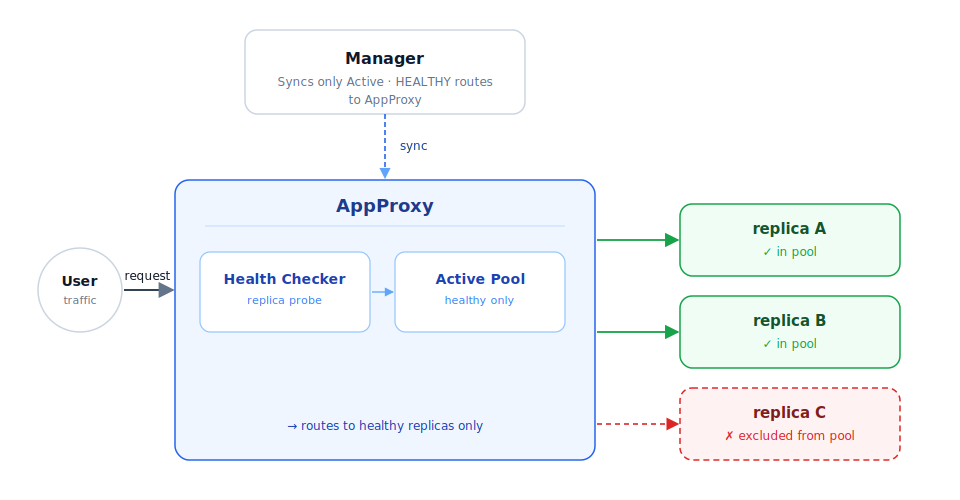

**② Manager: 상태 관리 및 eviction**

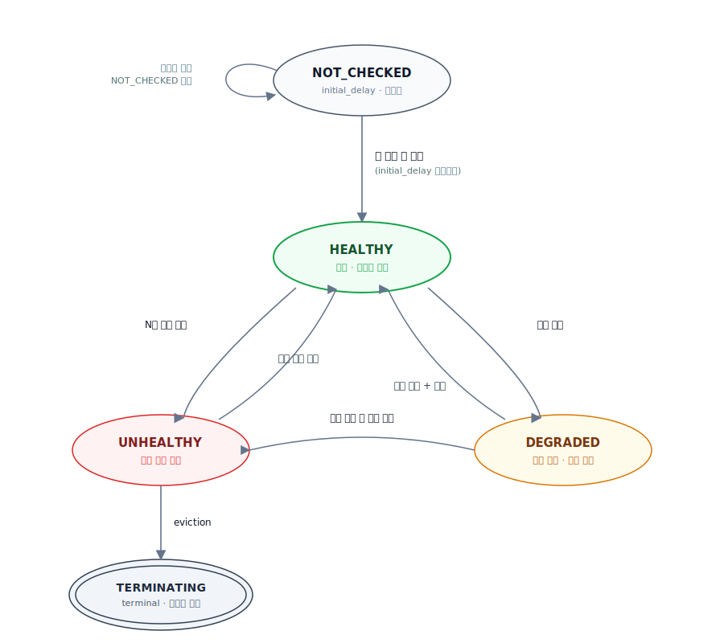

:::note
내부 상태 정보(트래픽 라우팅에 사용됨)는 사용자 인터페이스에 표시되는
상태와 즉시 동기화되지 않을 수 있습니다.
:::

**UNHEALTHY가 되기까지의 시간**:

- 초기 시작 시: `initial_delay + interval × (max_retries + 1)`

  기본값 예시: 60 + 10 × 11 = **170초** (약 3분)

- 운영 중(정상 상태 이후): `interval × (max_retries + 1)`

  기본값 예시: 10 × 11 = **110초** (약 2분)


<a id="prestart-actions"></a>

**Backend.AI 배포에서 지원되는 서비스 작업 설명**


- `write_file`: 지정된 파일 이름으로 파일을 생성하고 내용을 추가하는 작업입니다.
  기본 액세스 권한은 `644`입니다.

   - `arg/filename`: 파일 이름 지정
   - `body`: 파일에 추가할 내용 지정
   - `mode`: 파일의 액세스 권한 지정
   - `append`: 파일 내용의 덮어쓰기 또는 추가를 `True` 또는 `False`로 설정

- `write_tempfile`: 임시 파일 이름(`.py`)으로 파일을 생성하고 내용을 추가하는 작업입니다.
  모드 값이 지정되지 않은 경우 기본 액세스 권한은 `644`입니다.

   - `body`: 파일에 추가할 내용 지정
   - `mode`: 파일의 액세스 권한 지정

- `run_command`: 명령을 실행한 결과가 오류를 포함하여 다음 형식으로 반환됩니다
  (`out`: 명령 실행 출력, `err`: 명령 실행 중 오류 발생 시 오류 메시지)

   - `args/command`: 실행할 명령을 배열로 지정 (예: `python3 -m http.server 8080` 명령은 ["python3", "-m", "http.server", "8080"]이 됩니다)

- `mkdir`: 입력 경로로 디렉토리를 생성하는 작업입니다

   - `args/path`: 디렉토리를 생성할 경로 지정

- `log`: 입력 메시지로 로그를 출력하는 작업입니다

   - `args/message`: 로그에 표시할 메시지 지정
   - `debug`: 디버그 모드인 경우 `True`, 그렇지 않으면 `False`로 설정

### 모델 정의 파일을 모델 타입 폴더에 업로드

모델 정의 파일(`model-definition.yml`)을 모델 타입 폴더에 업로드하려면
가상 폴더를 생성해야 합니다. 가상 폴더를 생성할 때 기본 `general` 타입 대신
`model` 타입을 선택하세요. 폴더 생성 방법에 대한 지침은 데이터 페이지의
[스토리지 폴더 생성](#create-storage-folder) 섹션을 참조하세요.

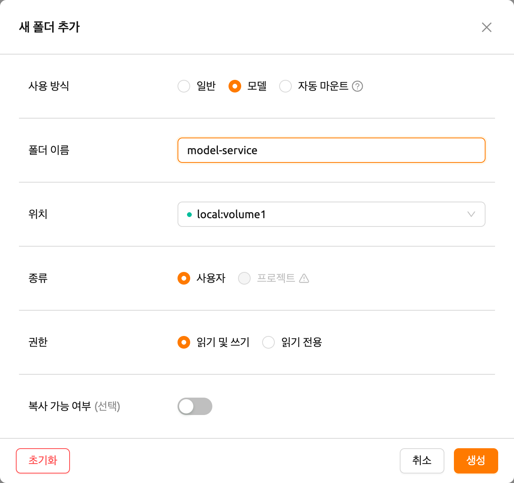

폴더를 생성한 후, 데이터 페이지에서 'MODELS' 탭을 선택하고
최근에 생성한 모델 타입 폴더 아이콘을 클릭하여 폴더 탐색기를 열고
모델 정의 파일을 업로드합니다.
폴더 탐색기 사용 방법에 대한 자세한 내용은
[폴더 탐색](#explore-folder) 섹션을 참조하세요.

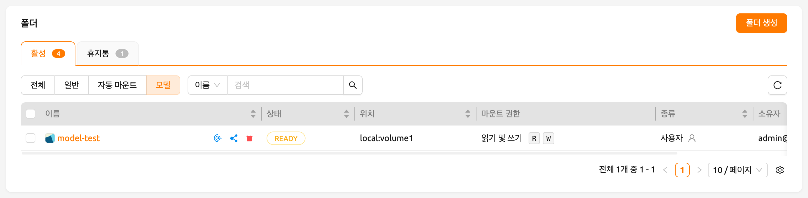

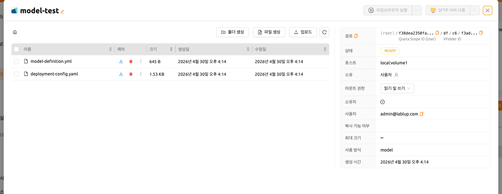

<a id="service-definition-file"></a>

### 서비스 정의 파일 생성

서비스 정의 파일(`service-definition.toml`)을 사용하면 관리자가 모델 서비스에 필요한 리소스, 환경 및 런타임 설정을 미리 구성할 수 있습니다. 이 파일이 모델 폴더에 있으면, 시스템은 서비스를 생성할 때 이러한 설정을 기본값으로 사용합니다.

`model-definition.yaml`과 `service-definition.toml` 모두 모델 폴더에 있어야
모델 스토어 페이지에서 `배포(Deploy)` 버튼이 활성화됩니다. 이 두 파일은 함께
작동합니다: 모델 정의는 모델과 추론 서버 구성을 지정하고, 서비스 정의는 런타임
환경, 리소스 할당 및 환경 변수를 지정합니다.

서비스 정의 파일은 런타임 변형별로 섹션이 구성된 TOML 형식을 따릅니다. 각 섹션은 서비스의 특정 측면을 구성합니다.

```toml
[vllm.environment]
image        = "example.com/model-server:latest"
architecture = "x86_64"

[vllm.resource_slots]
cpu = 1
mem = "8gb"
"cuda.shares" = "0.5"

[vllm.environ]
MODEL_NAME = "example-model-name"
```


**서비스 정의 파일의 키-값 설명**

- `[{runtime}.environment]`: 모델 서비스의 컨테이너 이미지와 아키텍처를 지정합니다.

   - `image` (필수): 추론 서비스에 사용할 컨테이너 이미지의 전체 경로 (예: `example.com/model-server:latest`).
   - `architecture` (필수): 컨테이너 이미지의 CPU 아키텍처 (예: `x86_64`, `aarch64`).

- `[{runtime}.resource_slots]`: 모델 서비스에 할당할 컴퓨트 리소스를 정의합니다.

   - `cpu`: 할당할 CPU 코어 수 (예: `1`, `2`, `4`).
   - `mem`: 할당할 메모리 양. 단위 접미사 지원 (예: `"8gb"`, `"16gb"`).
   - `"cuda.shares"`: 할당할 분할 GPU(fGPU) 공유 (예: `"0.5"`, `"1.0"`). 키에 점이 포함되어 있으므로 이 값은 따옴표로 묶습니다.

- `[{runtime}.environ]`: 추론 서비스 컨테이너에 전달되는 환경 변수를 설정합니다.

   - 런타임에서 필요한 모든 환경 변수를 정의할 수 있습니다. 예를 들어, `MODEL_NAME`은 일반적으로 로드할 모델을 지정하는 데 사용됩니다.


:::note
각 섹션 헤더의 `{runtime}` 접두사는 런타임 변형 이름
(예: `vllm`, `nim`, `custom`)에 해당합니다. 시스템은 서비스를 생성할 때
선택한 런타임 변형과 이 접두사를 매칭합니다.
:::

:::note
`배포(Deploy)` 버튼을 사용하여 모델 스토어에서 서비스를 생성하면
`service-definition.toml`의 설정이 자동으로 적용됩니다. 나중에 리소스 할당을
조정해야 하는 경우, 배포 페이지를 통해 서비스를 수정할 수 있습니다.
:::

</details>

## 배포 페이지 개요

배포 페이지는 현재 프로젝트의 모든 배포 목록을 표시합니다. 사이드바 메뉴에서 **배포**를 클릭하여 접근할 수 있습니다.

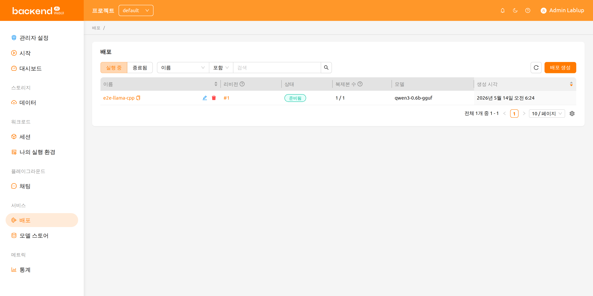

페이지 상단에서 라이프사이클 단계별로 배포를 필터링할 수 있습니다:

- **실행 중**: 현재 실행 중이거나 생성 중인 배포를 표시합니다. 기본 보기입니다.
- **종료됨**: 종료된 배포를 표시합니다.

또한 속성 필터 바를 사용하여 **배포 이름**, **서비스 엔드포인트 URL**, 또는 **소유자**(관리자 및 슈퍼관리자에게 제공)별로 배포를 검색할 수 있습니다.

`배포 생성` 버튼을 클릭하여 **배포 생성** 모달을 엽니다.

## 배포 생성

배포를 생성하는 흐름은 두 단계로 나뉩니다.

1. **배포 생성** — 배포의 식별 정보(이름, 공개 범위, 배포 메타데이터, 자원 그룹)만 정의하는 가벼운 컨테이너를 생성합니다.
2. **리비전 추가** — 실제로 실행되는 구성(시작 명령, 환경 변수, 런타임 변형, 이미지, 자원, 모델 스토리지)을 담은 스냅샷을 추가합니다.

하나의 배포는 여러 개의 리비전을 보관할 수 있습니다. 어느 시점이든 *현재* 리비전(트래픽을 처리하는 리비전)은 하나뿐이며, 배포 상세 페이지의 리비전 탭에서 다른 리비전으로 전환할 수 있습니다.

### 배포 생성 모달

배포 페이지에서 `배포 생성` 버튼을 클릭하여 **배포 생성** 모달을 엽니다. 이 모달에서는 배포 단위의 메타데이터만 입력하며, 이 단계에서 리비전이 함께 생성되지는 않습니다.

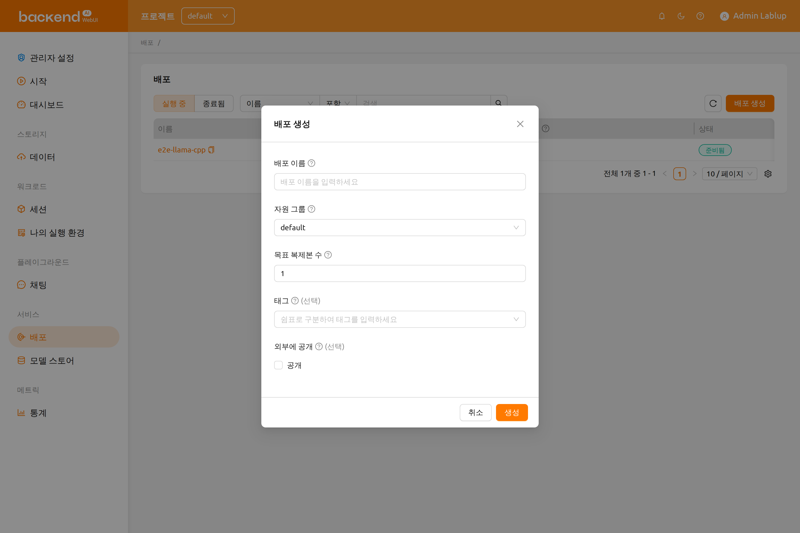

모달에는 다음과 같은 필드가 있습니다.

- **배포 이름**: 대시보드, API, 엔드포인트 URL에서 배포를 식별하는 데 사용되는 고유 이름입니다.
- **자원 그룹**: 배포가 실행될 자원 그룹입니다. 프로젝트에서 사용 가능한 자원 그룹이 하나뿐이면 자동으로 선택되며, 별도로 선택하지 않고도 진행할 수 있습니다.
- **목표 레플리카 수**: 이 배포에서 유지할 레플리카 수입니다. 시스템은 활성 풀을 이 목표값에 맞춰 조정합니다.
- **태그**: 배포를 정리하고 필터링하기 위한 선택적 라벨입니다. Enter 또는 쉼표로 추가합니다.
- **외부에 공개**: 활성화하면 액세스 토큰 없이 엔드포인트에 접근할 수 있습니다. 비활성화하면 모든 요청에 토큰이 필요합니다. 자세한 내용은 [토큰 생성](#generating-tokens) 섹션을 참고하세요.

`배포 생성`을 클릭하면 배포가 생성되며, 배포 상세 페이지로 이동합니다. 첫 번째 리비전을 추가하기 전까지는 **배포된 리비전이 없습니다** 경고가 표시됩니다. 생성 후 배포 수준 설정(이름, 공개 여부, 목표 레플리카 수, 태그)을 변경하려면 서비스 정보 카드의 **수정** 버튼을 클릭합니다.

### 리비전 추가

리비전에는 추론 서버를 실행하는 데 필요한 모든 설정(이미지, 시작 명령, 자원, 모델 마운트, 환경 변수)이 포함됩니다. 배포 상세 페이지에서 `리비전 추가` 버튼을 클릭하여 모달을 엽니다.

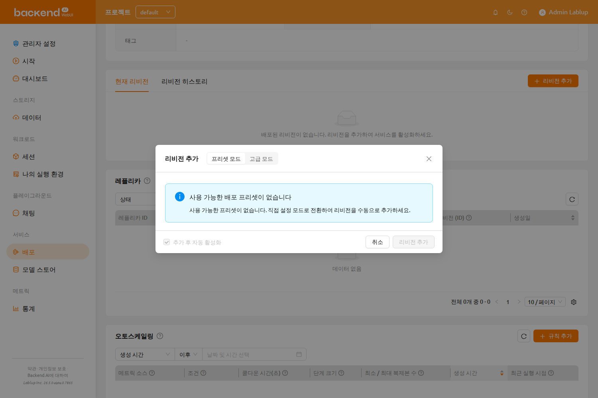

리비전 추가 모달 제목 영역의 **프리셋 모드** / **고급 모드** 전환기로 리비전 구성 방식을 선택합니다.

#### 프리셋 모드

미리 정의된 배포 프리셋으로 리비전을 빠르게 추가합니다.

- **프리셋**: 배포의 자원 그룹과 호환되는 배포 프리셋입니다. 옆의 ⓘ 버튼을 클릭하면 프리셋의 전체 구성을 확인할 수 있습니다.
- **모델 폴더**: 각 레플리카에 마운트될 스토리지 폴더입니다.

자원 그룹에 호환되는 프리셋이 없으면 안내 메시지가 표시됩니다. 이 경우 고급 모드로 전환하여 직접 구성하세요.

#### 고급 모드

모든 설정을 직접 구성합니다. **현재 리비전 불러오기** 버튼으로 현재 적용 중인 리비전의 설정을 폼에 미리 채울 수 있습니다.

폼은 다음 섹션으로 구성됩니다.

- **모델 및 런타임**: 모델 폴더와 런타임 변형을 선택합니다. `vLLM` / `SGLang` 변형에서는 런타임 파라미터 패널이, `Custom` 변형에서는 모델 정의 모드 컨트롤이 나타납니다. 런타임별 상세 필드는 아래 섹션을 참고하세요.
- **실행 환경**: 컨테이너 이미지(실행 환경 / 버전)와 환경 변수를 설정합니다.
- **클러스터 및 리소스**: CPU, 메모리, 가속기 자원을 할당합니다.
- **고급 설정** *(접을 수 있음)*: 모델 폴더 외에 추가로 마운트할 스토리지 폴더를 설정합니다.

모달 하단의 **추가 후 바로 적용** 체크박스를 선택하면 리비전이 생성된 직후 바로 활성화됩니다. 선택하지 않으면 비활성 상태로 저장되며, 이후 리비전 탭에서 직접 적용할 수 있습니다.

### 리비전 구성: Custom 모드 필드

리비전 추가 모달에서 **Custom** 런타임 변형을 선택하면, 폼 상단에 **모델 정의 모드** 세그먼트 컨트롤이 나타납니다. 추론 서버 시작 방식을 두 가지 중에서 선택할 수 있습니다.

#### 명령어 입력 모드

**명령어 입력**을 선택하면 CLI 명령어로 추론 서버 시작을 직접 정의할 수 있습니다. 다음 필드를 사용할 수 있습니다.

- **시작 명령어**: 추론 서버를 실행하는 셸 명령어 또는 인자 목록입니다. 예를 들어 `python -m http.server 8000`.
- **모델 마운트 대상**: 컨테이너 내부에 모델 스토리지 폴더가 마운트되는 경로입니다 (기본값: `/models`).
- **포트(Port)**: 추론 서버가 수신하는 컨테이너 포트입니다 (기본값: `8000`).
- **헬스 체크 URL**: 서비스 헬스 체크 시 호출되는 HTTP 엔드포인트 경로입니다 (기본값: `/health`).
- **초기 지연 시간**: 컨테이너 시작 후 첫 번째 헬스 체크 전까지 대기하는 시간(초)입니다 (기본값: `60.0`). 로딩 시간이 긴 대형 모델의 경우 이 값을 높게 설정합니다.
- **최대 재시도 횟수**: 레플리카가 `UNHEALTHY`로 표시되기 전까지 허용되는 연속 헬스 체크 실패 횟수입니다 (기본값: `10`).
- **간격**: 연속 헬스 체크 사이의 시간(초)입니다 (기본값: `10.0`).
- **최대 대기 시간**: 각 헬스 체크 HTTP 요청의 타임아웃 시간(초)입니다 (기본값: `15.0`).

#### 설정 파일 사용 모드

**설정 파일 사용**을 선택하면 모델 스토리지 폴더에 저장된 `model-definition.yaml` 파일에서 추론 서버 설정을 로드합니다. 다음 필드를 사용할 수 있습니다.

- **마운트 대상**: 컨테이너 내부에 모델 스토리지 폴더가 마운트되는 경로입니다 (기본값: `/models`).
- **모델 정의 파일 경로**: 모델 스토리지 폴더 내 모델 정의 파일의 경로입니다 (기본값: `model-definition.yaml`).

모델 정의 파일 작성 방법은 [모델 정의 파일 생성](#model-definition-guide) 섹션을 참고하세요.

#### 런타임 파라미터 (vLLM / SGLang)

`vLLM` 또는 `SGLang` 런타임 변형을 선택하면, 모델 정의 모드 선택기 대신 **런타임 파라미터** 섹션이 나타납니다. 이 섹션에서는 구성 파일을 수동으로 편집하지 않고도 서빙 프레임워크를 구성할 수 있습니다.

파라미터는 탭으로 구분된 카테고리별로 구성됩니다. 사용 가능한 탭 목록은 런타임 변형에 따라 다릅니다.

:::note
변경하지 않은 파라미터는 런타임의 기본값이 사용됩니다.
:::

**vLLM 런타임 파라미터**

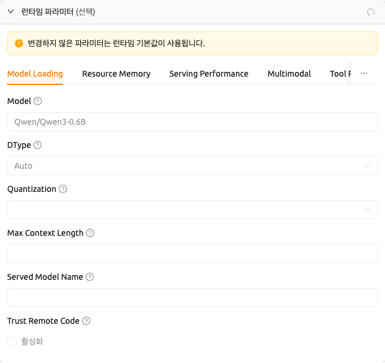

vLLM은 다음 파라미터 탭을 제공합니다: **Model Loading**, **Resource Memory**, **Serving Performance**, **Multimodal**, **Tool Reasoning** 등.

**Model Loading** 탭의 주요 필드:

- **Model**: 사용할 모델의 이름 또는 경로입니다.
- **DType**: 모델 가중치 및 연산의 데이터 타입입니다 (예: `Auto`, `float16`, `bfloat16`).
- **Quantization**: 모델 양자화 방식입니다 (예: `awq`, `gptq`, `fp8`).
- **Max Model Length**: 모델이 처리할 수 있는 최대 컨텍스트 길이(토큰 수)입니다.
- **Served Model Name**: API 엔드포인트에서 노출할 모델 이름입니다.
- **Trust Remote Code**: 모델 저장소의 커스텀 모델 코드 실행을 허용합니다.

**SGLang 런타임 파라미터**

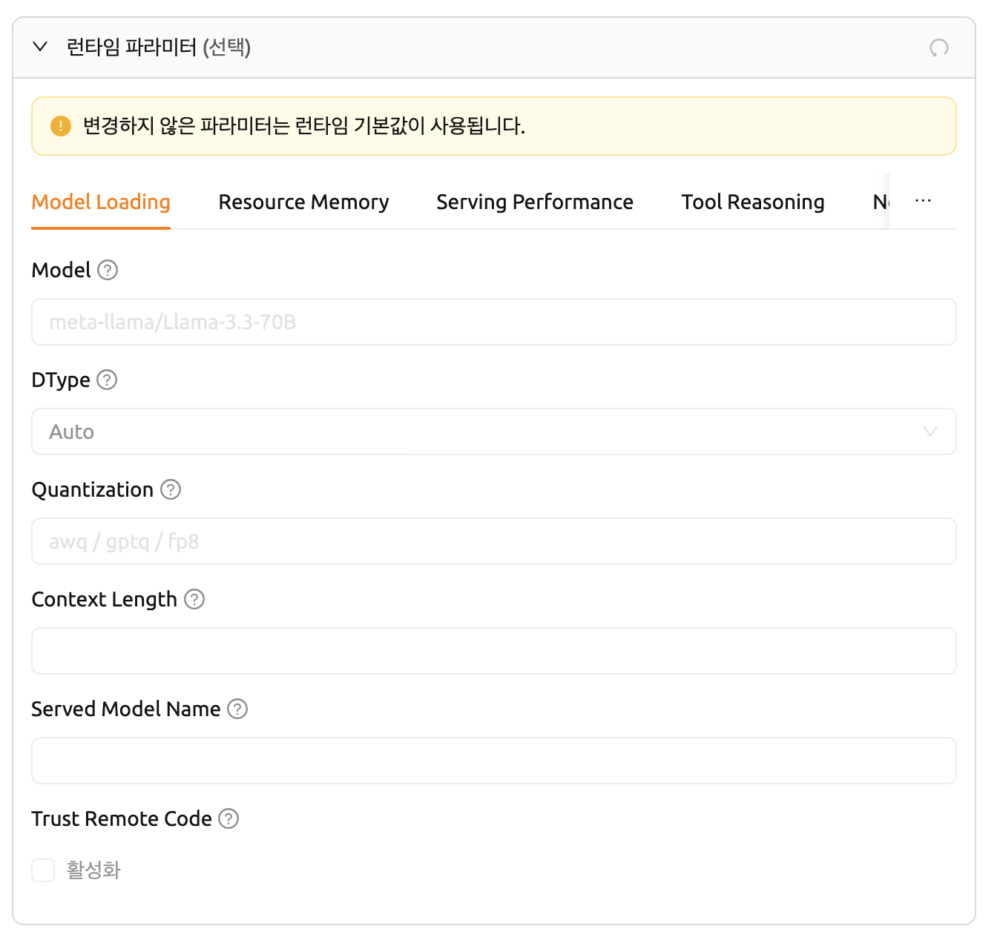

SGLang은 다음 파라미터 탭을 제공합니다: **Model Loading**, **Resource Memory**, **Serving Performance**, **Tool Reasoning** 등.

**Model Loading** 탭의 주요 필드:

- **Model**: 사용할 모델의 이름 또는 경로입니다.
- **DType**: 모델 가중치 및 연산의 데이터 타입입니다 (예: `Auto`, `float16`, `bfloat16`).
- **Quantization**: 모델 양자화 방식입니다 (예: `awq`, `gptq`, `fp8`).
- **Context Length**: 모델이 처리할 수 있는 최대 컨텍스트 길이입니다.
- **Served Model Name**: API 엔드포인트에서 노출할 모델 이름입니다.
- **Trust Remote Code**: 모델 저장소의 커스텀 모델 코드 실행을 허용합니다.

`vLLM` 및 `SGLang` 런타임 변형은 **환경** 섹션에 다음과 같은 환경 변수를 미리 채워 줍니다.

- **vLLM**: `BACKEND_MODEL_NAME`, `VLLM_QUANTIZATION`, `VLLM_TP_SIZE` (텐서 병렬화), `VLLM_PP_SIZE` (파이프라인 병렬화), `VLLM_EXTRA_ARGS` (추가 CLI 인자)
- **SGLang**: `BACKEND_MODEL_NAME`, `SGLANG_QUANTIZATION`, `SGLANG_TP_SIZE` (텐서 병렬화), `SGLANG_PP_SIZE` (파이프라인 병렬화), `SGLANG_EXTRA_ARGS` (추가 CLI 인자)

#### 환경

**환경** 섹션은 모든 런타임 변형에서 사용할 수 있습니다.

- **실행 환경 / 버전**: 추론 서버에 사용할 컨테이너 이미지입니다. 런타임 변형을 선택하면 해당 런타임과 호환되는 이미지로 목록이 필터링됩니다.
- **환경 변수**: 추론 서버 컨테이너에 전달되는 키/값 쌍입니다. `vLLM` 및 `SGLang`의 경우 위에 나열된 런타임 전용 변수가 미리 채워집니다. 항목을 자유롭게 추가, 편집, 삭제할 수 있습니다.

#### 클러스터 및 리소스

**클러스터 및 리소스** 섹션에서 각 레플리카에 할당할 컴퓨팅 리소스를 지정합니다.

- **리소스 프리셋**: CPU, 메모리, 가속기 할당이 미리 구성된 프리셋입니다. 사용 가능한 프리셋은 배포의 자원 그룹에 따라 필터링됩니다. 프리셋을 선택하지 않고 수동으로 리소스(CPU, 메모리, GPU)를 구성할 수도 있습니다.

#### 고급 설정

**고급 설정** 펼침 패널을 열면 모델 스토리지 폴더 외에 추가 스토리지 폴더를 마운트할 수 있습니다.

- **추가 마운트**: 추론 서버 컨테이너에 마운트할 스토리지 폴더 목록입니다. 준비 상태(`ready`)의 일반 목적(비모델) 폴더만 선택할 수 있습니다. 이름이 `.`으로 시작하는 숨김 폴더와 모델 스토리지 폴더 자체는 제외됩니다.

<a id="deployment-detail-page"></a>

## 배포 상세 페이지

배포 목록에서 배포 이름을 클릭하면 배포에 대한 상세 정보를 볼 수 있습니다.

### 배포 알림

배포 상세 페이지는 배포의 현재 상태에 따라 페이지 상단에 상황별 알림 배너를 표시합니다.

- **배포가 준비되었습니다**: 배포 상태가 `HEALTHY`일 때 표시됩니다. 페이지를 떠나지 않고 모델을 테스트할 수 있도록 LLM 채팅 테스트 인터페이스로 이동하는 **채팅으로 테스트하기** 버튼이 포함됩니다.


- **비공개 배포입니다. 엔드포인트를 사용하려면 액세스 토큰을 사용해야 합니다.**: **앱을 외부에 공개** 옵션이 비활성화된 경우 표시됩니다. 토큰을 발급하거나 복사할 수 있도록 **액세스 토큰 관리**로 이동하는 바로가기가 포함됩니다. 자세한 내용은 [토큰 생성](#generating-tokens)을 참고하세요.

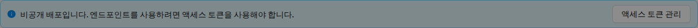

- **배포된 리비전이 없습니다. 리비전을 추가하여 서비스를 활성화하세요.**: 배포에 현재 리비전이 없을 때 표시됩니다. `리비전 추가`를 클릭하여 첫 번째 리비전을 만들고 서비스를 활성화합니다.

- **서비스를 준비하고 있습니다**: 배포가 생성 중이거나 상태가 전환 중일 때 표시됩니다. 서비스가 아직 요청을 처리할 준비가 되지 않았음을 나타냅니다.

- **이 모델 서비스는 다른 프로젝트에 속해 있습니다**: 배포가 현재 선택된 프로젝트와 다른 프로젝트에 속할 때 표시됩니다. 이 알림이 표시되는 동안 `수정` 버튼은 비활성화됩니다. 알림의 **프로젝트 전환** 버튼을 클릭하여 올바른 프로젝트로 전환하고 배포를 관리할 수 있습니다.

### 서비스 정보

서비스 정보 카드에는 다음 세부 사항이 표시됩니다:

- **배포 이름** 및 **상태**
- **배포 ID** 및 **세션 소유자**
- **공개 범위**: **공개** / **비공개** 태그로 표시됩니다. **공개**는 액세스 토큰 없이 엔드포인트에 접근할 수 있음을 의미하며, **비공개**는 호출자가 유효한 액세스 토큰을 함께 보내야 함을 의미합니다.
- **레플리카 수**
- **서비스 엔드포인트**: 배포에 액세스하기 위한 URL입니다. LLM 배포의 경우 `채팅으로 테스트하기` 버튼이 제공됩니다.
- **자원 그룹**: 배포가 실행되는 자원 그룹입니다. 자원 그룹은 이제 리비전 단위가 아니라 배포 메타데이터의 일부로(배포 생성 시 한 번 설정) 관리됩니다.
- **리소스**: 할당된 CPU, 메모리, 가속기 및 **공유 메모리 (SHM)**. 공유 메모리 값은 현재 리비전을 기준으로 표시되며, 추론 서버가 사용할 수 있는 `/dev/shm`의 크기를 의미합니다. 멀티 GPU 및 멀티 프로세스 추론 워크로드에서 중요한 값입니다.
- **모델 스토리지**: 마운트된 모델 스토리지 폴더와 마운트 대상입니다.
- **추가 마운트**: 마운트된 추가 스토리지 폴더입니다.
- **환경 변수**: 코드 블록으로 표시됩니다.
- **이미지**: 서비스에 사용되는 컨테이너 이미지입니다.

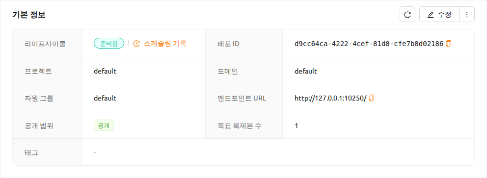

#### 더보기 메뉴 (수정 및 삭제)

서비스 정보 카드의 헤더에는 **수정** 버튼과 함께 **더보기** 메뉴가 제공됩니다. 더보기 메뉴에는 현재 **배포 삭제** 동작이 포함됩니다.

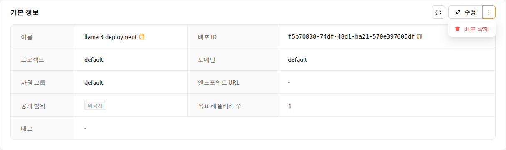


### 레플리카

레플리카 탭은 배포를 구성하는 라우팅 노드를 보여줍니다. 탭 상단의 **실행 중 / 종료됨** 라디오 컨트롤로 항목을 필터링하며, 이는 기존의 열거형 상태 필터를 대체합니다.

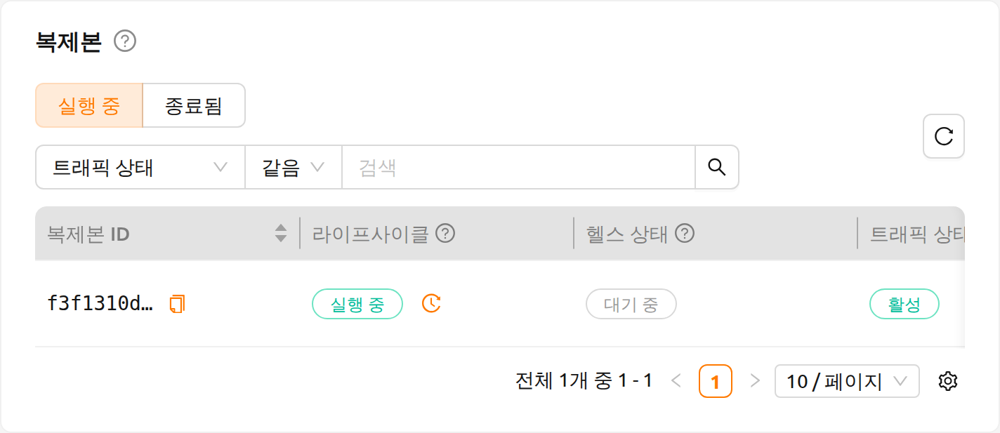

- **실행 중**: 현재 프로비저닝 중이거나 실행 중인, 또는 활성 상태의 레플리카를 표시합니다.
- **종료됨**: 라이프사이클이 종료된 레플리카를 표시합니다.

각 레플리카 행에는 세 가지 독립적인 상태 필드가 표시됩니다.

- **라이프사이클 상태**: 레플리카가 라이프사이클의 어느 단계에 있는지를 나타냅니다(예: *프로비저닝 중*, *실행 중*, *종료 중*).
- **헬스 상태**: 레플리카 프로세스의 현재 헬스 상태입니다(예: *정상*, *비정상*).
- **트래픽 상태**: 레플리카가 현재 요청을 처리 중인지 여부입니다.

레플리카 노드를 클릭하면 세션 상세 드로어가 열리며, 개별 세션의 상세 정보를 확인할 수 있습니다.

레플리카에서 오류가 발생한 경우 행의 오류 표시를 클릭하면 JSON 뷰어 모달이 열리며, 원시 오류 데이터를 표시합니다. 개별 레플리카의 문제를 진단할 때 유용합니다.


<a id="revisions-tab"></a>

### 리비전 탭

배포 상세 페이지의 **리비전** 카드에는 **현재 리비전**과 **리비전 히스토리** 두 개의 탭이 있습니다. 카드 상단의 `리비전 추가` 버튼은 두 탭 모두에서 사용할 수 있으며, 리비전 추가 모달을 엽니다([리비전 추가](#리비전-추가) 참고).

#### 현재 리비전 탭

**현재 리비전** 탭은 현재 활성 상태로 트래픽을 처리 중인 리비전의 전체 설정을 표시합니다.

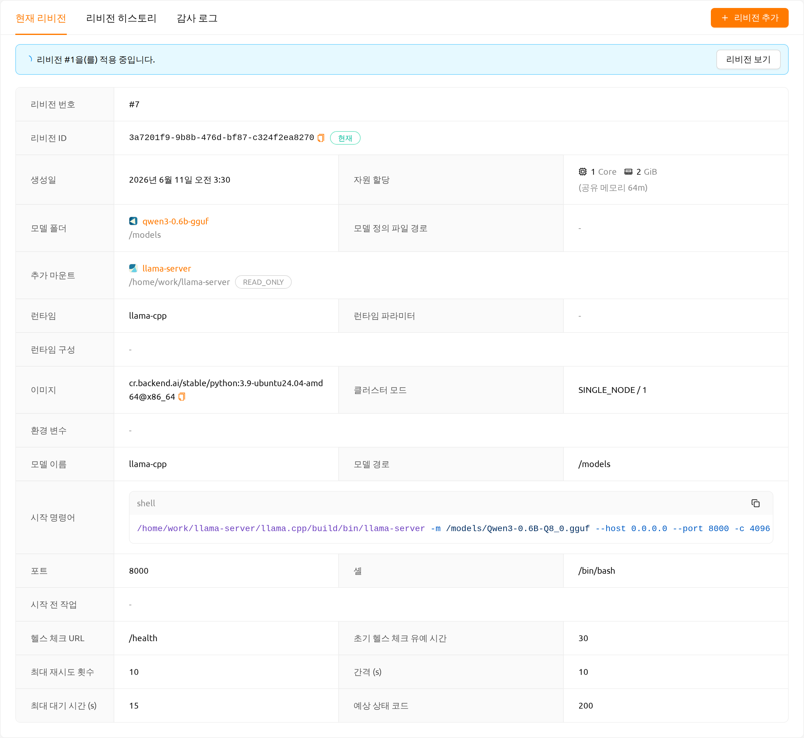

다음 필드가 표시됩니다:

- **리비전 번호**: 자동 할당된 순서 번호입니다(예: *#3*).
- **리비전 ID**: 이 리비전의 UUID입니다.
- **생성일**
- **리소스**: 각 레플리카의 자원 할당(CPU, 메모리, 가속기)입니다.
- **모델 폴더**: 각 레플리카에 마운트된 모델 폴더로, 링크와 함께 **모델 폴더 마운트 대상**이 표시됩니다.
- **모델 정의 파일 경로**: 모델 폴더 내 모델 정의 파일 경로입니다.
- **추가 마운트**: 각 레플리카에 마운트된 추가 스토리지 폴더입니다.
- **런타임**: 서빙 런타임입니다(예: `vLLM`, `SGLang`, `Custom`).
- **이미지**: 레플리카 실행에 사용되는 컨테이너 이미지입니다.
- **클러스터 모드**: 각 레플리카 컴퓨트 세션의 클러스터링 구성입니다(모드 / 크기).
- **환경 변수**: 컨테이너에 주입되는 키-값 쌍으로, 셸 스크립트 블록으로 표시됩니다.

모델 정의 파일에 모델이 정의된 경우 다음 필드도 표시됩니다:

- **모델 이름**, **모델 경로**, **시작 명령어**, **포트**, **상태 확인 URL**, **초기 지연 시간**, **최대 재시도 횟수**, **간격 (s)**, **최대 대기 시간 (s)**

**적용 진행 중 상태**

다른 리비전이 적용 중인 동안 **현재 리비전** 탭에는 *"N 리비전을 적용 중입니다."* 알림이 표시됩니다. 알림의 **리비전 보기** 버튼을 클릭하면 현재 적용 중인 리비전의 상세 드로어가 열립니다. 탭은 적용이 완료될 때까지 5초마다 자동으로 새로 고침됩니다.

**빈 상태**

아직 배포된 리비전이 없는 경우 탭에는 *"배포된 리비전이 없습니다. 리비전을 추가하여 서비스를 활성화하세요."* 가 표시됩니다.

#### 리비전 히스토리 탭

**리비전 히스토리** 탭은 배포에 추가된 모든 리비전을 최신순으로 표시합니다.

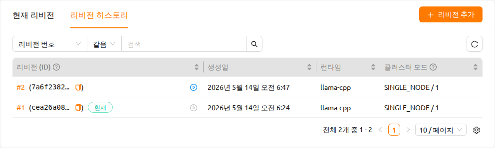

테이블에는 다음 컬럼이 포함됩니다:

- **리비전 (ID)**: 리비전 번호와 UUID입니다. 리비전 번호는 증가하는 정수이며, 숫자가 낮을수록 이전 리비전입니다. 리비전 번호를 클릭하면 리비전 상세 드로어가 열립니다.
- **생성일**
- **클러스터 모드**: "모드 / 크기" 형식의 클러스터링 구성입니다. 컬럼 헤더에 마우스를 올리면 설명을 확인할 수 있습니다.

기본적으로 숨겨져 있지만 컬럼 설정에서 활성화할 수 있는 컬럼:

- **모델 이름**, **런타임**, **이미지**, **모델 폴더**

**필터**

테이블 위의 필터 바를 사용하여 리비전 번호, 생성일 범위, 클러스터 모드, 이미지, 모델 폴더로 목록을 좁힐 수 있습니다.

**리비전 적용**

각 행에는 **적용** 버튼이 있습니다. 클릭하면 확인 대화상자가 열립니다. 확인하면 선택한 리비전이 현재 리비전이 되고, 배포는 새 설정으로 트래픽을 처리하기 시작합니다. 이전 리비전은 히스토리에 보존됩니다.

- 초록색 **현재** 태그는 현재 활성 리비전을 표시합니다.
- 노란색 **적용 중** 태그(로딩 스피너 포함)는 적용 중인 리비전을 표시합니다.
- **적용** 버튼은 현재 활성 리비전과 적용 중인 리비전에 대해 비활성화됩니다.

행의 리비전 번호를 클릭하면 해당 리비전의 전체 설정을 보여주는 리비전 상세 드로어가 열립니다. 드로어에도 **적용** 버튼이 있으며, 현재 활성 리비전과 적용 중인 리비전에서는 비활성화됩니다.

### 자동 스케일링 규칙

자동 스케일링 규칙(Auto Scaling Rules)은 실시간 메트릭을 기반으로 모델 서비스의 레플리카 수를 자동으로 증감시킵니다. 이를 통해 낮은 사용량일 때는 리소스를 절약하고, 높은 사용량일 때는 요청 지연이나 실패를 방지할 수 있습니다.

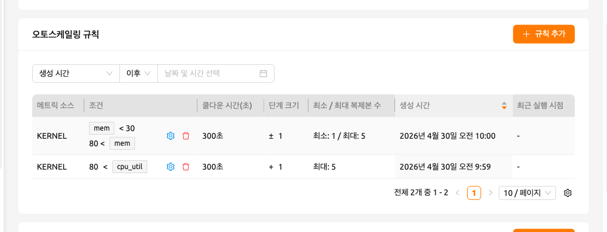

규칙 목록에서는 다음을 제공합니다:

- 생성 시간(Created At)과 최근 실행 시점(Last Triggered) 날짜-시간 범위로 규칙을 필터링할 수 있는 속성 필터 바.
- 서버 측 페이지네이션.
- 메트릭 소스(Metric Source), 조건(Condition), 쿨다운 초(Cooldown Sec.), 단계 크기(Step Size), 최소 / 최대 복제본 수(Min / Max Replicas), 생성 시간(Created At), 최근 실행 시점(Last Triggered) 컬럼. **단계 크기** 컬럼은 설정한 조건에 따라 `+`, `−`, `±` 부호가 자동으로 표시되므로, **스케일 아웃** 또는 **스케일 인**을 명시적으로 선택할 필요가 없습니다.
- 각 행의 조건 요약 옆에 표시되는 행별 편집 및 삭제 아이콘.

`규칙 추가` 버튼을 클릭하면 **오토스케일링 규칙 추가** 편집기가 열립니다. 기존 규칙을 수정하려면 해당 행의 편집 아이콘을 클릭하세요. 규칙 값이 미리 채워진 상태로 **오토스케일링 규칙 수정** 편집기가 열립니다. 편집기에는 다음 필드가 순서대로 포함됩니다:

- **메트릭 소스(Metric Source)**: `Kernel`, `Inference Framework`, `Prometheus` 중 하나를 선택합니다.
- **메트릭 이름(Metric Name)**: `Kernel`과 `Inference Framework`의 경우 메트릭 이름을 입력합니다. `Kernel`에서는 `cpu_util`, `mem`, `net_rx`, `net_tx`와 같은 일반적인 메트릭이 자동 완성 제안으로 제공되며, 사용자 정의 이름을 자유롭게 입력할 수도 있습니다.
- **메트릭 이름 프리셋(Metric Name (Prometheus Preset))**: 메트릭 소스가 `Prometheus`일 때만 표시됩니다. 드롭다운에서 프리셋을 선택하면 프리셋의 메트릭 이름, 쿼리 템플릿, 그리고 (정의된 경우) 쿨다운 초(Cooldown Sec.)가 자동으로 채워집니다. 선택기 아래의 현재 값(Current value) 미리보기는 프리셋이 반환하는 최신 값을 새로 고침 버튼과 함께 표시합니다. 여러 시리즈가 반환되는 경우 미리보기에는 시리즈 수와 가장 최근 값이 표시되며, 사용 가능한 데이터가 없으면 사용 가능한 데이터가 없습니다(No data available)라고 표시됩니다.
- **조건(Condition)**: 스케일링 방향을 선택하는 세그먼트 컨트롤입니다. 세 가지 옵션이 있습니다.

   * **스케일 인**: 메트릭이 임계값 아래로 떨어지면 복제본을 줄입니다. `Metric < [임계값]` 조건을 설정합니다.
   * **스케일 아웃**: 메트릭이 임계값 위로 올라가면 복제본을 늘립니다. `Metric > [임계값]` 조건을 설정합니다.
   * **스케일 인 & 아웃**: 메트릭이 설정한 범위를 벗어나는 방향에 따라 자동으로 축소 또는 확장합니다. `Metric < Min Threshold` 또는 `Metric > Max Threshold` 조건을 설정합니다.

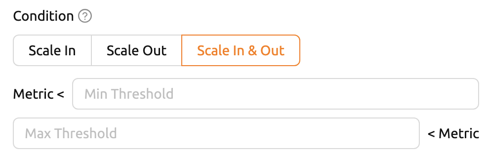

- **단계 크기(Step Size)**: 스케일링 이벤트마다 추가하거나 제거할 복제본 수를 지정하는 양의 정수입니다. 선택한 조건(스케일 인 / 스케일 아웃 / 스케일 인 & 아웃)에 따라 `-`, `+`, `±` 부호가 자동으로 표시됩니다.

   * 최솟값 임계값만 설정: `[metric] < [minThreshold]` 조건이 되면 스케일 **인**(Scale In)됩니다.
   * 최댓값 임계값만 설정: `[metric] > [maxThreshold]` 조건이 되면 스케일 **아웃**(Scale Out)됩니다.
   * 둘 다 설정: `[minThreshold] < [metric] < [maxThreshold]` 범위를 벗어나는 방향에 따라 스케일 인 또는 스케일 아웃됩니다.

- **쿨다운 초(Cooldown Sec.)**: 스케일링 이벤트 이후 다음 평가까지 대기하는 시간(초 단위)입니다.
- **최소 복제본 수(Min Replicas) 및 최대 복제본 수(Max Replicas)**: 자동 스케일링이 복제본 수에 대해 강제하는 하한과 상한입니다. 자동 스케일링은 복제본 수를 최소 복제본 수 아래로 줄이거나 최대 복제본 수 위로 늘리지 않습니다.

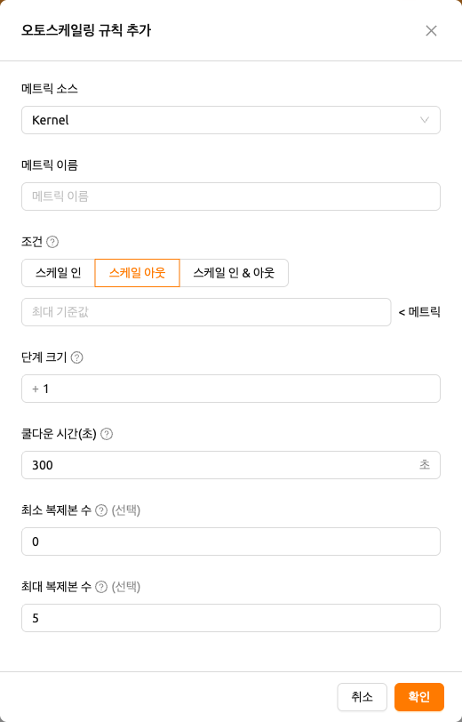

메트릭 소스(Metric Source)가 `Prometheus`로 설정되면 편집기에 프리셋 선택기와 실시간 현재 값(Current value) 미리보기가 표시됩니다.

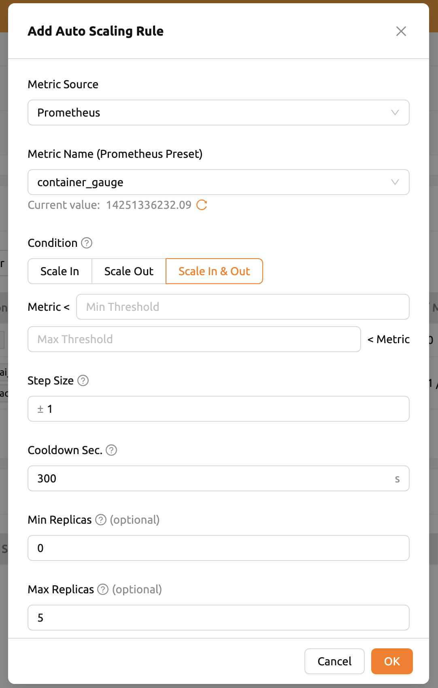

<a id="generating-tokens"></a>

### 토큰 생성

배포 상태가 `HEALTHY`가 되면 배포 목록에서 해당 배포 이름을 클릭하여 배포 상세 페이지를 엽니다. 서비스 정보 카드에서 **서비스 엔드포인트** URL을 확인할 수 있습니다. **Open To Public**이 활성화된 경우 최종 사용자는 토큰 없이 배포에 접근할 수 있습니다. 비활성화된 경우 아래 설명에 따라 토큰을 발급하세요.


생성된 토큰 목록 오른쪽에 있는 `Generate Token` 버튼을
클릭합니다. 나타나는 모달에서
만료 날짜를 입력합니다.


발급된 토큰은 생성된 토큰 목록에 추가됩니다. 각 토큰에는 **상태**(유효 또는 만료됨), **만료 날짜** 및 **생성 날짜**가 표시됩니다. 토큰
항목에서 `copy` 버튼을 클릭하여 토큰을 복사하고, 다음 키의 값으로 추가합니다.

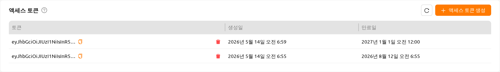

| Key           | Value            |
|---------------|------------------|
| Content-Type  | application/json |
| Authorization | BackendAI        |

### 배포 종료

배포가 더 이상 필요하지 않으면 종료하는 것이 좋습니다. 배포를 종료하려면 서비스 정보 카드의 **더보기** 메뉴를 열고 **배포 삭제**를 선택합니다. 유형 확인 모달이 나타나면 배포 이름을 입력하여 **영구 삭제** 버튼을 활성화합니다. 종료된 배포는 **삭제됨** 필터 뷰에 표시됩니다.

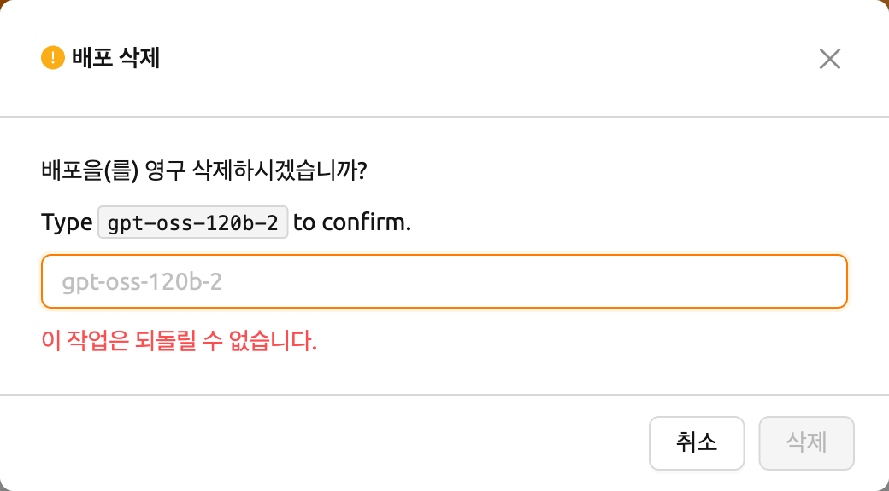

## 배포에 접근하기

배포에 접근할 수 있도록 배포 URL을 최종 사용자와 공유합니다. **Open To Public**이 활성화된 경우 배포 상세 페이지의 **서비스 엔드포인트** URL을 그대로 공유할 수 있습니다. 비공개 배포의 경우 URL과 액세스 토큰을 함께 공유합니다.

### API 요청 보내기

다음은 `curl` 명령을 사용하여 배포가 정상 응답하는지 확인하는 간단한 예시입니다:

```bash
export API_TOKEN="<token>"
export MODEL_SERVICE_ENDPOINT="<model-service-endpoint>"
curl -H "Content-Type: application/json" -X GET \
  -H "Authorization: BackendAI $API_TOKEN" \
  "$MODEL_SERVICE_ENDPOINT"
```

:::warning
기본적으로, 엔드 유저는 엔드포인트에 액세스할 수 있는
네트워크에 있어야 합니다. 서비스가 폐쇄된 네트워크에서 생성된 경우,
해당 폐쇄된 네트워크 내에서 액세스할 수 있는 엔드
유저만 서비스에 액세스할 수 있습니다.
:::

### LLM 채팅 테스트

대형 언어 모델(LLM) 서비스를 생성한 경우, 실시간으로 LLM을 테스트할 수 있습니다.
배포가 준비되면 배포 상세 페이지 상단의 **배포가 준비되었습니다** 배너에 `채팅으로 테스트하기` 버튼이 나타납니다. 이 버튼을 클릭하여 테스트를 시작합니다.

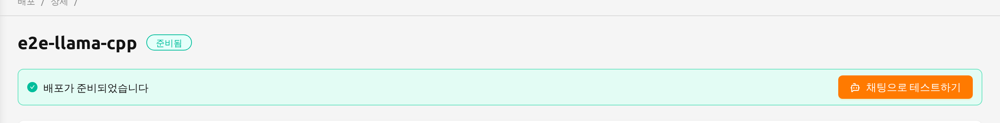

생성한 모델이 자동으로 선택된 Chat 페이지로 리디렉션됩니다.
Chat 페이지에서 제공되는 채팅 인터페이스를 사용하여 LLM 모델을 테스트할 수 있습니다.
채팅 기능에 대한 자세한 내용은 [Chat 페이지](#chat-page)를 참조하세요.

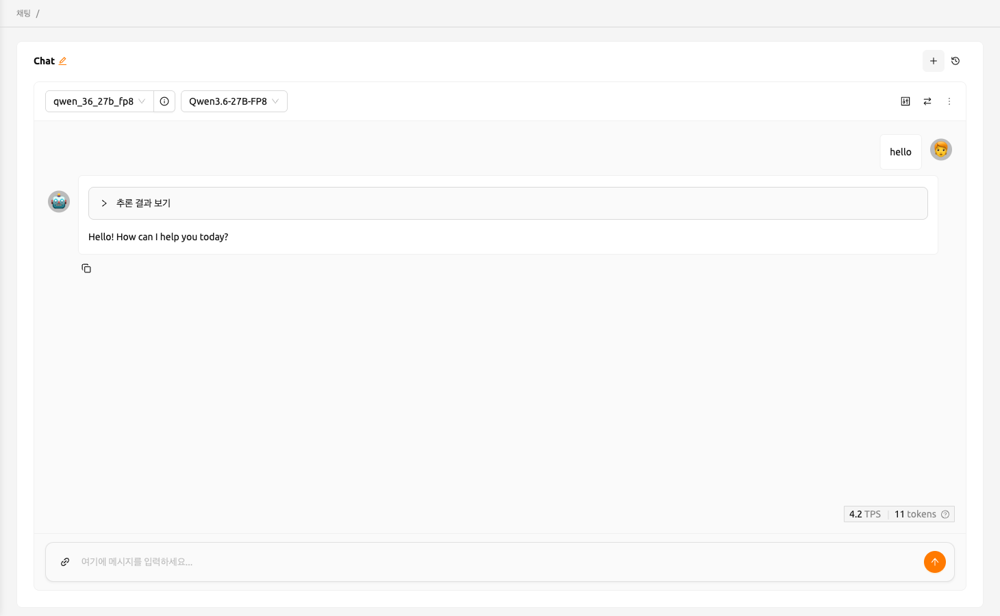

API 연결에 문제가 발생하면, Chat 페이지에 모델 설정을 수동으로 구성할 수 있는 옵션이 표시됩니다.
모델을 사용하려면 다음 정보가 필요합니다:

- **기본 경로** (선택사항): 모델이 위치한 서버의 기본 URL입니다.
  버전 정보를 포함해야 합니다.
  예를 들어, OpenAI API를 사용할 때는 https://api.openai.com/v1을 입력해야 합니다.
- **토큰** (선택사항): 모델 서비스에 액세스하기 위한 인증 키입니다. 토큰은
  Backend.AI뿐만 아니라 다양한 서비스에서 생성할 수 있습니다. 형식과 생성 프로세스는
  서비스에 따라 다를 수 있습니다. 자세한 내용은 항상 특정 서비스의 가이드를 참조하세요.
  예를 들어, Backend.AI에서 생성된 서비스를 사용할 때는
  토큰 생성 방법에 대한 지침은 [토큰 생성](#generating-tokens) 섹션을 참조하세요.

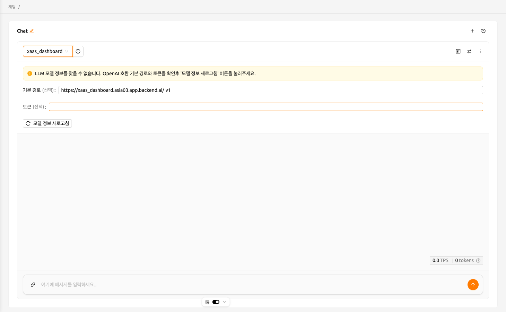

<a id="model-store"></a>

## 모델 스토어

모델 스토어(Model Store)는 사전 구성된 모델을 탐색, 검색 및 배포할 수 있는 카드 기반 갤러리를 제공합니다. 사이드바 메뉴에서 모델 스토어에 접근할 수 있습니다.

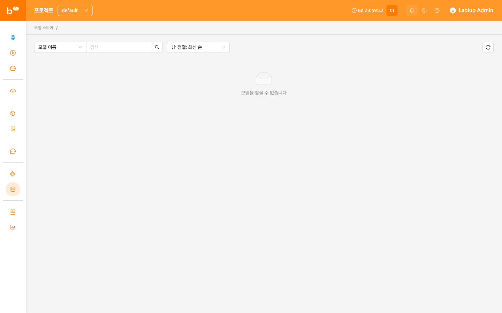

### 모델 탐색 및 검색

페이지 상단은 검색 및 정렬 레이아웃을 사용합니다:

- **모델 검색(Search Models)**: 이름으로 필터링(Filter By Name) 속성 필터를 사용하여 이름으로 모델 카드를 검색합니다.
- **정렬(Sort)**: 결과 정렬 방식을 선택합니다. 사용 가능한 옵션은 `이름 (A→Z)`, `이름 (Z→A)`, `오래된 순`, `최신 순`입니다.
- **새로 고침(Refresh)**: 새로 고침 버튼을 클릭하여 카드 목록을 다시 로드합니다.

각 카드에는 모델 브랜드 아이콘, 제목(제목이 설정되지 않은 경우 이름), 태스크(Task) 태그, 상대 생성 시간, 그리고 아이콘과 함께 작가(Author)가 표시됩니다. 현재 프로젝트에 **호환 가능한 프리셋이 없는** 카드는 50% 투명도로 표시됩니다. 이러한 카드를 열어 상세 정보를 볼 수는 있지만, `배포(Deploy)` 버튼은 비활성화되고 Drawer에 **호환 가능한 프리셋이 없습니다. 이 모델은 배포할 수 없습니다.** 라는 오류 알림이 표시됩니다.

서버에 `MODEL_STORE` 프로젝트가 설정되어 있지 않으면, 페이지에는 관리자에게 문의하라는 안내와 함께 *모델 스토어 프로젝트를 찾을 수 없습니다* 메시지가 표시됩니다. 필터와 일치하는 모델 카드가 없으면 *모델을 찾을 수 없습니다*라고 표시됩니다.

목록은 하단에서 페이지네이션됩니다. 페이지 크기는 `10`, `20`, `50`개 항목 중에서 변경할 수 있습니다.

### 모델 카드 상세 정보

카드를 클릭하면 페이지 오른쪽에 모델 카드 Drawer가 열립니다. Drawer 상단에는 모델 제목과 설명이 표시되고, 그 다음 태스크, 카테고리, 라벨, 라이선스 태그가 이어지며, 다음 항목을 포함한 상세 목록이 표시됩니다:

- **작가(Author)**
- **아키텍처(Architecture)**
- **프레임워크(Framework)** (각 프레임워크는 아이콘과 함께 표시)
- **버전(Version)**
- **생성 시간(Created)** 및 **마지막 수정(Last Modified)** 타임스탬프
- **모델 폴더(Model Folder)**: 모델 스토리지 폴더의 폴더 탐색기를 여는 클릭 가능한 링크
- **최소 리소스(Min Resource)**: 최소 리소스 요구 사항(CPU, 메모리, GPU)

모델 카드에 README가 포함된 경우, Drawer 하단에 `README.md` 카드로 렌더링됩니다.

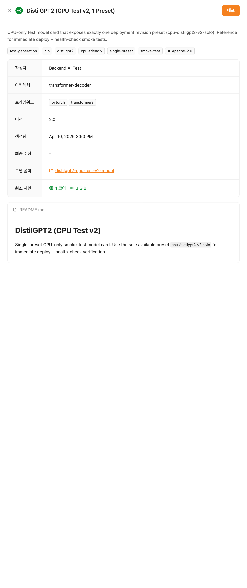

### 모델 배포

Drawer 헤더의 `배포(Deploy)` 버튼을 클릭하여 모델을 서비스로 배포합니다. 배포 흐름은 다음 두 가지 방식 중 하나로 동작합니다:

- **자동 배포**: 모델에 사용 가능한 프리셋이 정확히 하나 있고 현재 프로젝트에 접근 가능한 자원 그룹이 정확히 하나 있으면, 모달을 표시하지 않고 배포가 조용히 생성됩니다. 엔드포인트가 쿼리 가능해진 후 해당 배포 상세 페이지로 이동합니다.
- **모델 배포 모달(Deploy Model)**: 그렇지 않은 경우, 모델 배포 모달이 다음 필수 필드와 함께 열립니다.

   * **프리셋(Preset)**: 사용 가능한 자원 프리셋의 그룹화된 드롭다운입니다. 프리셋이 여러 런타임 변형에 걸쳐 있는 경우 옵션은 런타임 변형 이름별로 그룹화되고, 그렇지 않은 경우 평면 목록으로 표시됩니다.
   * **자원 그룹(Resource Group)**: 서비스가 실행될 자원 그룹입니다.

   모달의 `배포(Deploy)` 버튼을 클릭하여 배포를 시작합니다. 모델이 배포되었음을 확인하는 성공 토스트가 표시되고, 배포 상세 페이지로 이동합니다.

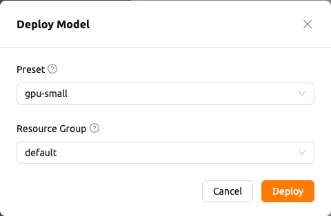

:::note
선택한 모델에 현재 프로젝트와 호환되는 프리셋이 없으면 Drawer의 `배포(Deploy)` 버튼이
비활성화되며, 호환되는 프리셋이 제공될 때까지 배포가 차단됩니다.
:::


