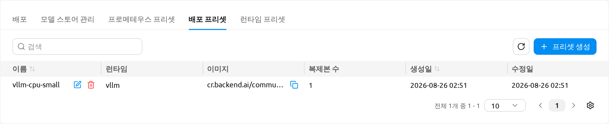
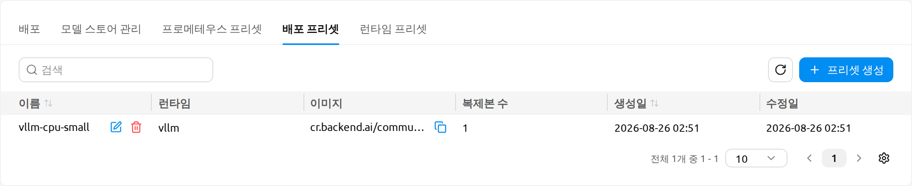
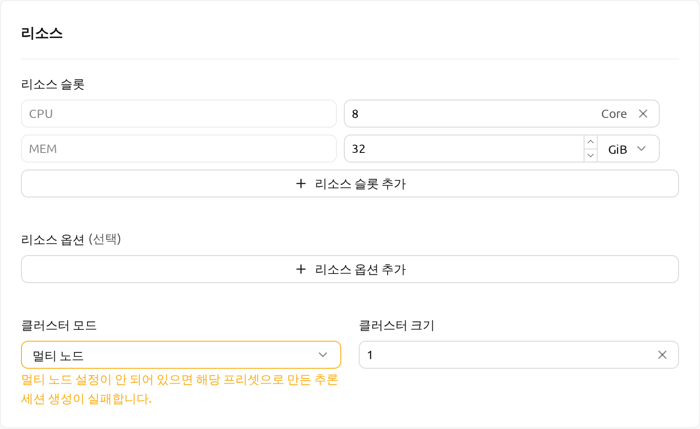
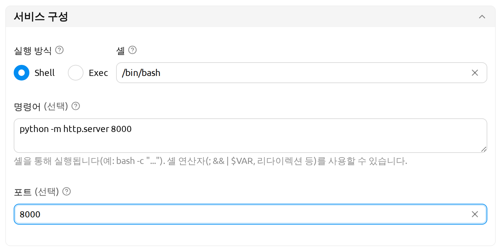
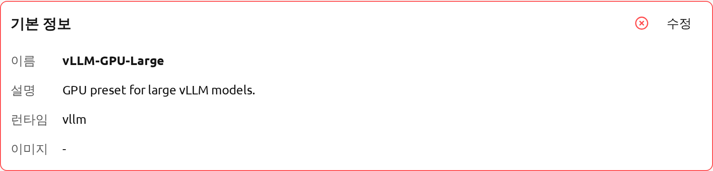
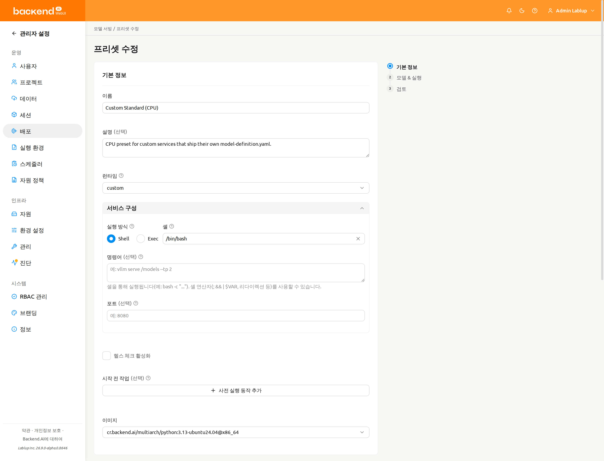
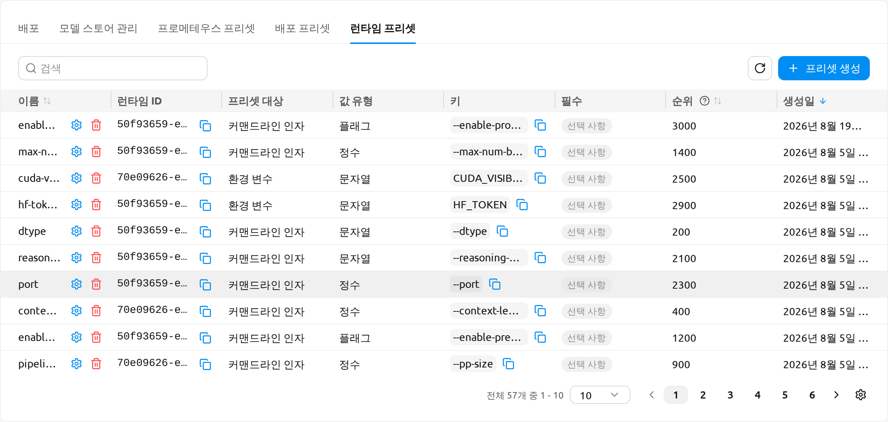
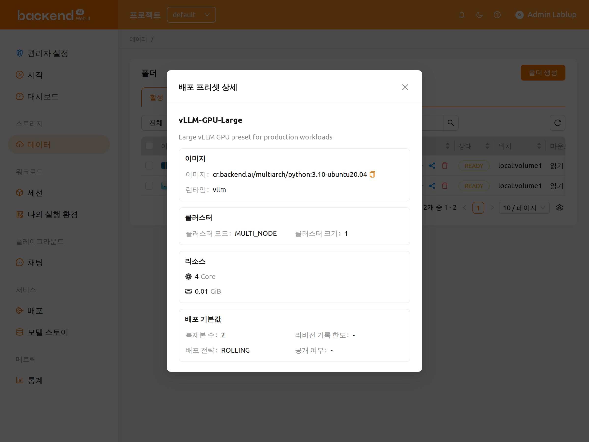
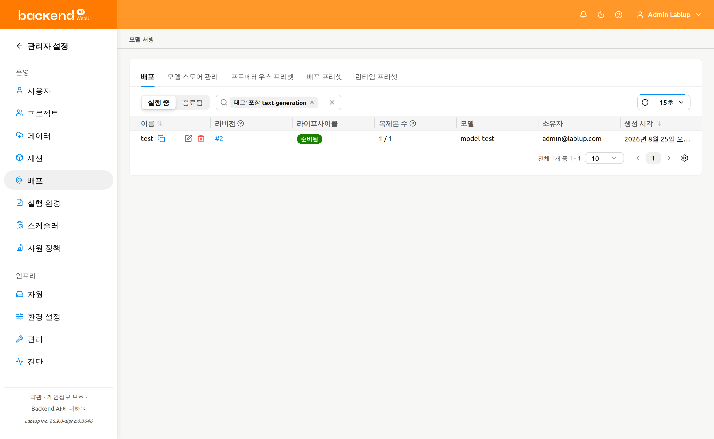

# 배포 프리셋

**배포 프리셋(Deployment Preset)** 은 이미지, 런타임, 자원 슬롯, 클러스터 모드, 환경 변수, 시작 명령, 복제본 수, 공개 여부 등 모델 배포에 필요한 기본 설정을 하나의 묶음으로 관리하는 관리자 정의 템플릿입니다. 최종 사용자가 스토리지 폴더에서 모델을 배포할 때 이 프리셋을 적용할 수 있으며, 관리자는 *vLLM-GPU-Large*, *SGLang-CPU-Small* 과 같이 조직이 검증한 배포 구성을 제공할 수 있습니다. 사용자는 모든 고급 옵션을 직접 입력하지 않고도 모델을 빠르게 배포할 수 있습니다.

:::info
이 페이지는 배포 프리셋의 생성, 수정, 삭제 권한이 관리자에게만 있기 때문에 **관리** 섹션에 위치합니다. 최종 사용자는 프리셋을 직접 관리할 수는 없지만, 프로젝트에 게시된 프리셋을 모델 배포 시 **적용**할 수 있습니다. 이 페이지는 두 부분으로 구성되어 있으며, [배포 프리셋 관리](#managing-deployment-presets)는 관리자 워크플로우를, [모델을 배포할 때 프리셋 사용하기](#using-a-preset-when-deploying-a-model)는 최종 사용자 워크플로우를 설명합니다. 프리셋을 활용한 리비전 생성에 대한 자세한 내용은 [배포](#model-serving) 페이지도 함께 참고하세요.
:::

## 배포 프리셋이란?

배포 프리셋은 모델 배포의 기본값을 저장하여 다음과 같은 이점을 제공합니다.

- **관리자**: 조직의 하드웨어 및 정책에 맞는 검증된 배포 구성 카탈로그를 사용자에게 제공할 수 있습니다.
- **최종 사용자**: 데이터 페이지의 *프리셋으로 새 배포 생성* 흐름을 통해 프리셋을 선택하면 고급 필드를 수동으로 채우지 않아도 됩니다.
- **운영자**: 조직 전반에 걸쳐 자원 할당, 런타임, 공개 여부 기본값이 일관되게 적용되도록 보장할 수 있습니다.

프리셋으로 배포를 생성하면 프리셋의 값이 배포 런처에 자동으로 채워집니다. 사용자는 배포를 확정하기 전에 해당 값을 자유롭게 검토하고 수정할 수 있습니다.

각 프리셋은 다음 항목을 저장합니다.

- **기본 정보**: 이름, 설명, 런타임, 정렬 순위.
- **런타임 파라미터**: 선택한 런타임 변형(vLLM, SGLang)의 파라미터 값.
- **이미지**: 배포에 사용할 컨테이너 이미지.
- **자원**: 자원 슬롯(CPU, 메모리, GPU), 공유 메모리(SHM), 자원 옵션.
- **클러스터**: 클러스터 모드(Single Node 또는 Multi Node)와 클러스터 크기.
- **실행**: 실행 준비 명령어, 환경 변수, 부트스트랩 스크립트.
- **서비스 구성**: 실행 방식(Shell 또는 Exec), 셸, 명령어, 포트. Custom처럼 모델 폴더에서 설정을 읽는 런타임에 대해 저장됩니다.
- **배포 기본값**: 복제본 수, 리비전 기록 보관 수, *Open to Public*(공개 여부) 기본값.
- **헬스 체크**: **헬스 체크 활성화** 토글로 제어되는 주기적 헬스 체크(선택 사항).
- **시작 전 작업**: 모델 서비스가 시작되기 전에 실행할 작업.
- **모델 정의**(선택 사항): 서빙할 모델의 이름과 경로, 그리고 선택적인 메타데이터.

## 배포 프리셋 관리

배포 프리셋을 생성, 수정, 삭제할 수 있는 사용자는 관리자뿐입니다. 관리자는 `/admin/deployments` 주소의 관리자 배포 페이지에서 **배포 프리셋** 탭을 열어 프리셋을 관리합니다.

목록 화면에는 각 프리셋의 이름, 런타임, 이미지, 정렬 순위, 주요 자원 필드와 함께 **수정일(Modified)** 열이 기본적으로 표시됩니다. 관리자는 이 화면에서 다음을 수행할 수 있습니다.

- 이름, 런타임, 태그로 프리셋을 필터링합니다.
- 임의의 행에 있는 태그 칩을 클릭하여 동일한 태그를 가진 프리셋만 표시되도록 필터링합니다.
- 프리셋 상세 화면을 열어 전체 구성을 확인합니다.
- 프리셋을 생성, 수정, 삭제합니다.

테이블의 톱니바퀴(설정) 아이콘을 클릭하면 표시할 열을 관리할 수 있습니다. 기본적으로 숨겨져 있는 **설명(Description)**, **실행 준비 명령어(Startup Command)**, **공개 여부(Open to Public)**, **정렬 순위(Rank)** 열도 여기서 표시하도록 선택할 수 있습니다.

:::note[프리셋 페이지 주소]
배포 프리셋 페이지는 관리자 범위에 속하므로 주소가 모두 `/admin`으로 시작합니다.

| 페이지 | 주소 |
|---|---|
| 프리셋 목록 | `/admin/deployments` (**배포 프리셋** 탭) |
| 프리셋 생성 | `/admin/deployments/deployment-presets/new` |
| 프리셋 수정 | `/admin/deployments/deployment-presets/{presetId}/edit` |

[모델을 배포할 때 프리셋 사용하기](#using-a-preset-when-deploying-a-model)에서 설명하는 최종 사용자 흐름은 프로젝트 범위에서 동작하므로, 모델을 배포하는 데이터 페이지의 주소는 `/project/{프로젝트 이름}/data`입니다. `/project/` 뒤에 오는 값은 프로젝트의 ID가 아니라 **이름**입니다.

`/admin-deployments/deployment-presets/new`처럼 예전 형태의 주소도 계속 동작하며, 위의 범위가 포함된 주소로 자동 전환되므로 기존 북마크가 깨지지 않습니다.
:::

프리셋의 상세 화면을 열면 프리셋에 구성된 모든 설정을 카드 형태로 확인할 수 있으며, 여기에는 프리셋의 헬스 체크 설정을 요약해 보여주는 **헬스 체크(Health Check)** 카드가 포함됩니다.

### 배포 프리셋 생성

1. 프리셋 목록 우측 상단의 **프리셋 생성** 버튼을 클릭합니다. `/admin/deployments/deployment-presets/new` 주소의 프리셋 작성 화면이 열립니다.
2. 각 필드를 입력합니다. 이 화면은 **기본 정보**, **모델 & 실행**, **검토** 세 단계로 구성된 마법사이며, 오른쪽에 단계 목록이, 아래쪽에 `이전` / `다음` 버튼이 표시됩니다. `검토로 건너뛰기`를 클릭하면 마지막 단계로 바로 이동합니다. 필드는 다음 섹션으로 구성됩니다.

   - **기본 정보**:
      * **이름**: 고유한 프리셋 이름(예: `vLLM-GPU-Large`).
      * **설명**: 프리셋의 용도를 간략히 설명합니다.
      * **런타임**: 런타임 변형(예: vLLM, SGLang, Custom).
      * **정렬 순위**: 동일한 런타임의 프리셋 사이에서의 표시 순서입니다. 값이 작을수록 먼저 표시됩니다.
   - **런타임 파라미터(Runtime Parameters)** (조건부): **vLLM** 또는 **SGLang** 런타임 변형을 선택한 경우에만 표시됩니다. 이 섹션은 파라미터를 용도별로 묶은 여러 탭(**모델 로딩(Model Loading)**, **자원 메모리(Resource Memory)**, **서빙 성능(Serving Performance)**)으로 구성됩니다. 필수 파라미터는 빨간색 별표(\*)로 표시되며, 필수 파라미터가 비어 있으면 폼 제출이 차단됩니다.

   - **서비스 구성** (선택한 런타임이 Custom처럼 모델 폴더에서 설정을 읽는 경우에만 표시): **실행 방식**(**Shell** 또는 **Exec**), **셸**, **명령어** / **명령어 (argv)**, **포트** — 리비전 추가 모달과 동일한 필드이며, 배포 페이지의 [서비스 구성](#service-configuration) 에서 설명합니다. **포트** 를 비워 두면 이 프리셋으로 생성되는 배포가 런타임 변형의 기본 포트를 상속합니다.

      :::note[섹션이 표시되는 위치]
      **서비스 구성**, **헬스 체크**, **시작 전 작업** 은 모두 **기본 정보** 단계의 런타임 필드 아래에 표시되며, 모델 정의와 별개로 저장됩니다.
      :::
   - **이미지**: 배포에 사용할 컨테이너 이미지를 선택합니다.
   - **자원**: 자원 슬롯(CPU, 메모리, GPU), 공유 메모리, 자원 옵션(키/값 쌍).
   - **클러스터**: 클러스터 모드(Single Node 또는 Multi Node)와 클러스터 크기. 새로 만드는 프리셋은 **Single Node** 가 기본값입니다. **Multi Node** 를 선택하면 *"멀티 노드 설정이 안 되어 있으면 해당 프리셋으로 만든 추론 세션 생성이 실패합니다."* 경고가 표시됩니다. 이 경고는 저장을 막지는 않으므로, 클러스터가 멀티 노드로 구성된 경우에만 선택하세요.
   - **실행**: **실행 준비 명령어**, 환경 변수, 부트스트랩 스크립트. **실행 준비 명령어** 필드에는 셸 문법 안내(`쉘 문법: /bin/bash -c "cmd1; cmd2"`)가 함께 표시됩니다. 입력한 명령은 `/bin/bash -c <명령>` 형태로 실행되므로, 여러 명령을 세미콜론(`;`)으로 연결하는 등 셸 문법을 사용할 수 있습니다.

      :::note[실행 준비 명령어와 명령어는 다릅니다]
      두 명령어는 서로 다른 값이며, 각 필드마다 별도의 설명이 표시되어 구분하기 쉽습니다.

      | 필드 | 위치 | 역할 | 예시 |
      |---|---|---|---|
      | **실행 준비 명령어** | 프리셋의 실행 섹션 | *"모델 프레임워크를 시작하기 전에 환경을 준비하는 명령어입니다 (예: vllm 설치)."* | `pip install vllm` |
      | **명령어** (Exec 방식에서는 **명령어 (argv)**) | 프리셋의 서비스 구성 섹션 | 모델 서빙 프로세스를 시작하는 명령어입니다. | `vllm serve /models --tp 2` |

      패키지 설치, 자산 내려받기, 설정 파일 생성처럼 준비 작업에는 **실행 준비 명령어**를, 서빙 프레임워크를 실제로 구동하는 명령에는 **명령어**를 사용하세요. 각 필드의 플레이스홀더에도 해당 유형에 맞는 예시가 표시됩니다.
      :::
   - **배포 기본값**:
      * **복제본 수**: 이 프리셋으로 생성되는 배포의 기본 복제본 수.
      * **리비전 기록 보관 수**: 이 프리셋으로 생성된 배포에서 보관되는 과거 리비전의 수.
      * **Open to Public**: 이 프리셋으로 생성된 배포의 엔드포인트를 액세스 토큰 없이 접근할 수 있게 할지 여부의 기본값.
   - **헬스 체크**: 이 섹션에는 **헬스 체크 활성화** 토글이 있으며 기본값은 **끔** 입니다. 토글이 꺼져 있으면 헬스 체크 필드가 숨겨지고, 켜면 경로, 간격, 최대 재시도 횟수, 최대 대기 시간, 상태 코드, 초기 헬스 체크 유예 시간 필드가 나타나 설정할 수 있습니다.
   - **시작 전 작업**: 모델 서비스가 시작되기 전에 실행할 작업입니다. **사전 실행 동작 추가** 를 클릭해 행을 추가한 뒤 **동작** 과 **인수 (JSON)** 을 입력합니다.
   - **모델 정의**(선택 사항): 카드 헤더의 스위치를 켜면 모델 정의를 사용합니다. 스위치를 켠 상태에서 **모델 이름** 과 **모델 경로** 를 입력해야 하며(둘 다 필수), 필요하면 **메타데이터** 섹션을 펼쳐 서빙할 모델의 제목, 작성자, 버전, 라이선스, 설명, 작업, 카테고리, 아키텍처, 프레임워크, 라벨을 입력할 수 있습니다.

      :::note
      **헬스 체크 활성화** 토글은 vLLM 및 SGLang의 고급 모드(Advanced Mode)에도 동일하게 적용됩니다.
      :::

   

   

3. **검토** 단계에서 요약 내용을 확인한 뒤 `생성`을 클릭하여 저장합니다. 성공 알림이 표시됩니다.

:::tip
필수 필드가 누락되었거나 값이 유효하지 않으면 검토 단계의 저장 버튼이 비활성화 상태로 유지됩니다. 해당 필드가 포함된 검토 카드는 테두리가 빨간색으로 표시되고 **수정** 링크 옆에 오류 아이콘이 나타나며, 그 필드가 속한 단계가 오른쪽 단계 목록에서도 오류로 표시됩니다. 따라서 아직 방문하지 않은 단계의 필드라도 어느 단계로 돌아가야 하는지 알 수 있습니다. 필수 필드에는 입력 즉시 인라인 검증 메시지가 표시됩니다.
:::

#### 검토 단계

마법사의 마지막 단계는 앞선 모든 단계를 그대로 옮겨 놓은 읽기 전용 요약이며, 입력할 때와 동일한 카드 단위로 묶여 표시됩니다. 각 카드에는 해당 단계로 돌아가 그 카드 위치까지 스크롤해 주는 **수정** 링크가 있습니다.

**기본 정보** 카드에는 1단계의 필드 순서대로 다음 항목이 요약됩니다.

- **이름**
- **설명** (설명이 있는 프리셋만)
- **런타임**: 프리셋이 사용하는 런타임 변형의 표시 이름입니다.
- **이미지**: `<canonicalName>@<architecture>` 형식으로 표시됩니다.
- **런타임 파라미터** (Custom이 아닌 런타임에서 값이 설정된 경우만)
- **셸**, **명령어**, **포트**: 서비스 구성 값이며, 모델 폴더에서 설정을 읽는 런타임에서만 표시됩니다. Exec 방식에서는 셸을 사용하지 않으므로 **셸** 항목은 표시되지 않습니다.
- **헬스 체크 활성화** 와, 활성화한 경우 설정된 헬스 체크 값.

나머지 카드에는 **리소스**(자원 슬롯, 자원 옵션, 클러스터 모드, 클러스터 크기), **배포**(복제본 수, 리비전 기록 보관 수, Open to Public), **모델 & 실행**(실행 준비 명령어, 부트스트랩 스크립트, 환경 변수, 활성화한 경우 모델 정의)이 요약됩니다.

   **런타임** 항목은 프리셋을 생성할 때뿐 아니라 **수정할 때도** 표시됩니다. 두 경우 모두 1단계에서 런타임을 변경할 수 있으므로, 저장하기 전에 이 항목에서 프리셋이 사용할 런타임을 확인하세요.

### 배포 프리셋 수정

1. 프리셋 목록의 행 작업 메뉴(또는 프리셋 상세 화면)에서 **프리셋 수정**을 선택합니다.
2. `/admin/deployments/deployment-presets/{presetId}/edit` 주소의 프리셋 작성 화면이 현재 값으로 채워진 상태로 열립니다. 단계와 섹션 구성은 생성 흐름과 동일하며, vLLM 및 SGLang 런타임의 **런타임 파라미터** 섹션도 포함됩니다.
3. 필요한 값을 수정한 뒤 **검토** 단계에서 요약 내용(**런타임** 항목 포함)을 확인하고 `저장`을 클릭하여 변경 사항을 반영합니다.

프리셋을 수정하면 **이후** 생성되는 배포의 기본값만 변경됩니다. 이미 해당 프리셋으로 생성된 기존 배포에는 영향을 주지 않습니다.

### 배포 프리셋 삭제

1. 프리셋 목록(또는 프리셋 상세 화면)의 작업 메뉴에서 **프리셋 삭제**를 선택합니다.
2. 프리셋 이름을 직접 입력하여 확인하는 대화 상자가 표시됩니다. 입력한 값이 프리셋 이름과 정확히 일치할 때까지 **확인** 버튼이 비활성화 상태로 유지됩니다.
3. 프리셋 이름을 입력한 뒤 **확인**을 클릭합니다.

:::danger
배포 프리셋 삭제는 **되돌릴 수 없습니다**. 프리셋 자체는 제거되지만, 해당 프리셋으로 이미 생성된 배포는 영향을 받지 않고 그대로 실행됩니다. 이후에는 더 이상 이 프리셋을 참조할 수 없습니다.
:::

## 런타임 프리셋

**관리자 배포** 페이지(`/admin/deployments`)의 **런타임 프리셋** 탭에서는 런타임이 제공하는 개별 파라미터를 정의합니다. 각 항목은 파라미터 하나를 설명하며, 컨테이너에 전달될 키, 값 유형, 기본값, 그리고 화면에 표시되는 방식을 담습니다. 이렇게 정의한 항목들이 모여, 사용자가 배포 리비전을 추가할 때 입력하는 **런타임 파라미터** 탭을 구성합니다(배포 페이지의 [런타임 파라미터](#runtime-parameters) 참고).

표 위에는 속성 필터(**이름**, **런타임 ID**)와 새로 고침 버튼, **프리셋 생성** 버튼이 있습니다. 기본으로 표시되는 컬럼은 다음과 같습니다.

- **이름**: 파라미터 프리셋의 이름입니다. 이 컬럼에는 행별 편집/삭제 버튼도 함께 표시됩니다.
- **런타임** 및 **런타임 ID**: 파라미터가 속한 런타임입니다.
- **프리셋 대상**: 값이 컨테이너에 전달되는 방식으로, **환경 변수** 또는 **커맨드라인 인자** 입니다.
- **값 유형**: **문자열**, **정수**, **실수**, **bool 자료형(Boolean)**, **플래그** 중 하나입니다.
- **키**: 값이 전달되는 환경 변수 이름 또는 커맨드라인 인자입니다.
- **필수**: 해당 런타임으로 리비전을 만들 때 이 파라미터를 반드시 입력해야 하는지 여부입니다.
- **순위**: 같은 런타임의 프리셋 간 표시 순서입니다. 값이 낮을수록 먼저 표시됩니다.
- **생성일**: 프리셋이 생성된 시각입니다.

**설명**, **카테고리**, **표시 이름**, **기본값**, **수정일** 컬럼은 기본적으로 숨겨져 있으며, 표 헤더 오른쪽의 컬럼 표시 설정 버튼(⚙)으로 표시할 수 있습니다.

:::note
**런타임**, **표시 이름**, **카테고리** 컬럼과 아래에서 설명하는 UI 메타데이터 필드는 런타임 프리셋 UI 메타데이터를 지원하는 서버에서만 사용할 수 있습니다. 이전 버전의 서버에서는 아예 표시되지 않습니다.
:::

### 런타임 프리셋 생성 및 편집

표 위의 **프리셋 생성** 버튼을 클릭하면 **프리셋 생성** 모달이 열리고, 행의 편집 버튼을 클릭하면 현재 값이 채워진 **프리셋 편집** 모달이 열립니다. 이미 생성된 프리셋의 런타임은 변경할 수 없습니다.

<!-- TODO(screenshot): /admin/deployments -> Runtime Variant Presets tab -> Create Preset modal, showing the UI Type selector and its Choices rows. The capture environment ran manager 26.8.0rc1, which does not serve the runtime-variant-preset UI metadata fields. -->

모달에는 다음 필드가 나타나는 순서대로 표시됩니다.

- **런타임**: 이 파라미터가 속한 런타임입니다. 필수 항목입니다.
- **이름**: 파라미터의 읽기 쉬운 이름입니다(예: `Tensor Parallel Size`). 필수 항목입니다.
- **설명**: 이 파라미터가 제어하는 항목과 추론 동작에 미치는 영향입니다. 배포 폼에서 해당 필드의 툴팁으로 표시됩니다.
- **카테고리**: 관련 파라미터를 함께 묶는 데 사용되는 UI 카테고리입니다. 카테고리는 **런타임 파라미터** 섹션의 탭이 되므로, 같은 카테고리를 지정한 파라미터는 같은 탭에 표시됩니다. 이 필드는 자유 입력이며, 이미 사용 중인 카테고리는 플레이스홀더에 안내로 표시됩니다.
- **표시 이름**: 배포 폼에서 파라미터 이름 대신 표시되는 읽기 쉬운 라벨입니다.
- **프리셋 대상**: **환경 변수** 또는 **커맨드라인 인자** 입니다. 필수 항목입니다.
- **값 유형**: **문자열**, **정수**, **실수**, **bool 자료형(Boolean)**, **플래그** 중 하나입니다. 필수 항목입니다.
- **키**: 값이 전달되는 환경 변수 이름 또는 커맨드라인 인자입니다(예: `TENSOR_PARALLEL_SIZE`). 필수 항목입니다.
- **기본값**: 사용자가 파라미터를 변경하지 않았을 때 런타임이 사용하는 값입니다. 배포 폼에서는 미리 채워지지 않고 플레이스홀더로 표시되므로, 필수 파라미터는 여전히 명시적인 입력을 요구합니다.
- **UI 유형**: 배포 폼에서 이 파라미터를 표시할 때 사용할 컨트롤입니다. 비워 두면 일반 텍스트 입력으로 표시됩니다. 유형을 선택하면 해당 유형의 설정이 함께 나타납니다.
   * **텍스트 입력**: **입력 플레이스홀더** — 필드가 비어 있을 때 표시되는 안내 문구입니다.
   * **숫자 입력**: **최솟값** 과 **최댓값**. 범위를 벗어난 값은 배포 폼에서 검증 오류로 표시됩니다.
   * **체크박스**: 추가 설정이 없습니다.
   * **셀렉트**: **선택지** — 옵션마다 **값** / **라벨** 한 행씩 입력합니다. **선택지 추가** 버튼으로 행을 추가하고 휴지통 버튼으로 삭제하며, 최소 하나 이상의 선택지가 필요합니다.
   * **슬라이더**: **최솟값** 과 **최댓값**(둘 다 필수이며 최댓값이 최솟값보다 커야 합니다), 그리고 슬라이더가 움직이는 증가 단위인 **단위(Step)** 입니다(기본값 `1`).
- **필수**: 사용자가 리비전을 만들 때 이 파라미터를 반드시 입력해야 하는지 여부입니다. 필수 파라미터는 배포 폼에서 빨간색 별표(★)로 표시됩니다.
- **순위** *(편집 시에만 표시)*: 같은 런타임의 프리셋 간 표시 순서입니다. 값이 낮을수록 먼저 표시됩니다.

`생성`(편집 시에는 `저장`) 버튼을 클릭하면 저장됩니다. 런타임 프리셋이 생성 또는 업데이트되었다는 알림이 표시되고 목록이 새로 고쳐집니다.

### 런타임 프리셋 삭제

프리셋 행의 삭제 버튼을 클릭합니다. 프리셋 이름을 직접 입력해 확인하는 다이얼로그가 열리며, 입력한 값이 정확히 일치할 때까지 **삭제** 버튼은 비활성화 상태로 유지됩니다.

:::danger
런타임 프리셋 삭제는 **되돌릴 수 없습니다**. 해당 런타임을 사용하는 모든 배포 폼의 **런타임 파라미터** 섹션에서 이 파라미터가 사라집니다.
:::

## 모델을 배포할 때 프리셋 사용하기

최종 사용자는 데이터 페이지에서 스토리지 폴더로부터 모델을 배포할 때 열리는 **VFolder Deploy** 모달을 통해 배포 프리셋을 적용합니다.

1. 데이터 페이지에서 배포하려는 모델 폴더를 찾아 **Deploy as Service** 버튼을 클릭합니다.
2. VFolder Deploy 모달이 열리고 현재 프로젝트에서 사용 가능한 배포 프리셋이 나열됩니다.
3. 프리셋 행을 클릭하면 **배포 프리셋 상세** 화면이 열립니다. 이 화면에는 프리셋이 적용될 모든 필드(이미지, 런타임, 자원, 클러스터 모드, 복제본 수, 공개 여부 등)가 표시됩니다.

   

4. 상세 화면에서 다음 두 가지 방법 중 하나를 선택합니다.

   - **Auto-deploy(자동 배포)**: 프리셋의 값을 그대로 사용하여 즉시 배포를 생성합니다. 추가 입력 없이 한 번의 클릭으로 배포가 시작되는 가장 빠른 경로입니다.
   - **Manual deploy(수동 배포)** (*프리셋으로 새 배포 생성*): 모든 필드가 프리셋의 값으로 미리 채워진 배포 런처를 열어, 확정 전에 검토 및 조정할 수 있습니다.

## 자동 채워지는 런처 필드

수동 배포 경로를 선택하면 다음과 같은 모든 필드가 선택한 프리셋의 값으로 자동으로 채워진 상태로 배포 런처가 열립니다.

- 이미지, 런타임 변형, 자원 그룹.
- 자원 슬롯, 공유 메모리, 자원 옵션.
- 클러스터 모드와 클러스터 크기.
- 시작 명령과 환경 변수.
- 복제본 수, 리비전 기록 보관 수, **Open to Public** 공개 여부.
- 자동으로 선택된 자원 프리셋. 런처의 초기값 해석 과정에서도 그대로 유지됩니다.

자동으로 채워진 값은 배포 전에 자유롭게 수정할 수 있습니다. 필드를 수정해도 원본 프리셋은 변경되지 **않으며**, 이번 배포에만 적용됩니다. 이후 배포의 기본값은 그대로 유지됩니다.

:::tip
자동으로 선택된 자원 프리셋이 워크로드에 적합하다면 그대로 둬도 됩니다. 프리셋을 전환한 뒤에도 자동 선택 결과가 유지되므로 다시 선택할 필요가 없습니다.
:::

## 태그로 필터링하기

사용자용 프리셋 목록과 관리자용 프리셋 목록 모두 **클릭 가능한 태그 칩**을 지원합니다. 클릭한 태그를 공유하는 프리셋만 표시되도록 목록이 필터링됩니다.

1. 필터링하려는 태그가 표시된 프리셋 행을 찾습니다.
2. 해당 행의 태그 칩을 클릭합니다.
3. 선택한 태그가 포함된 프리셋만 표시되도록 목록이 갱신됩니다. 활성화된 필터는 필터 바에 표시되며, 필터를 해제하면 전체 목록으로 돌아갑니다.

프리셋이 많을 때 특정 GPU 기반 프리셋 또는 특정 런타임 계열의 프리셋만 빠르게 확인하려는 경우에 유용합니다.
