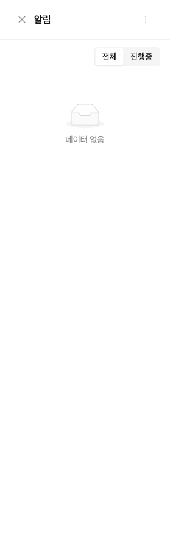
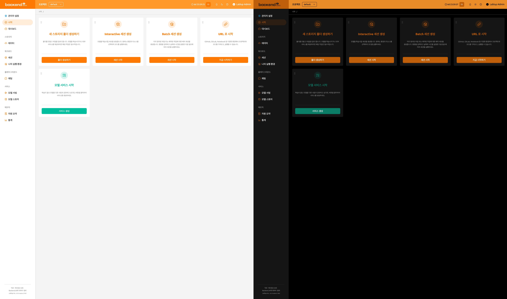
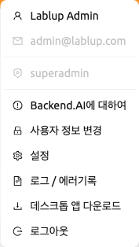
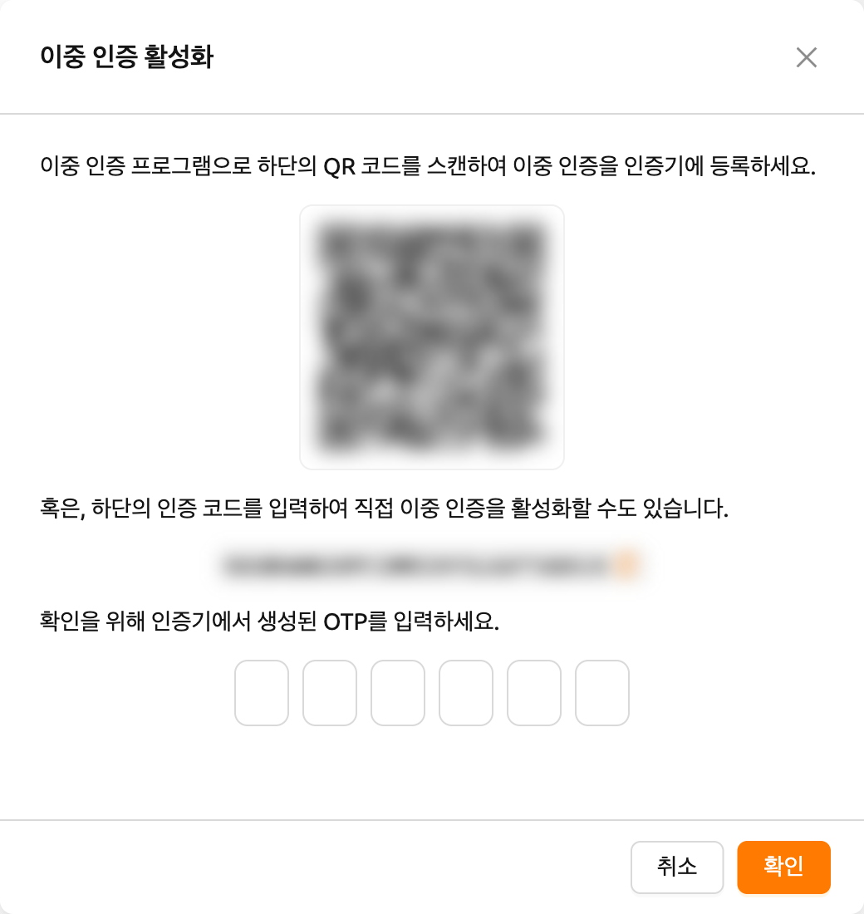
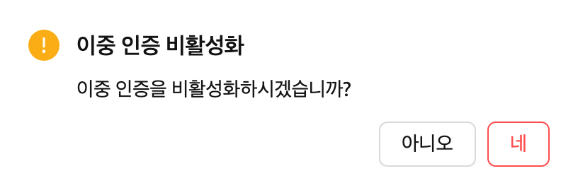

# 상단 바 기능

상단 바에는 WebUI 사용을 지원하는 다양한 기능이 포함되어 있습니다.

## 프로젝트 선택기

사용자는 상단 바의 프로젝트 선택기를 통하여 현재 프로젝트를 선택할 수 있습니다. 각 프로젝트 별로 다른 자원 정책을 가질 수 있으므로, 프로젝트를 변경할 경우 가용 가능한 자원 정책이 변경될 수 있습니다.

## 로그인 세션 타이머

로그인 세션 관리가 활성화된 경우, 상단 바에 자동 로그아웃까지 남은 시간과 연장 버튼이 표시됩니다. 타이머는 `HH:mm:ss` 형식으로 표시되며, 24시간 이상인 경우 일수도 함께 표시됩니다.

타이머 옆의 연장 버튼(반복 아이콘)을 클릭하면 세션 만료 시간이 초기화되어 로그인 세션이 연장됩니다.

:::note
로그인 세션 타이머는 서버가 로그인 세션 연장을 지원하고 시스템 설정에서 활성화된 경우에만 표시됩니다.
:::

## 이벤트 알림

종 모양 버튼은 이벤트 알림 버튼입니다. WebUI 사용 중 기록이 필요한 이벤트가 이곳에 표시됩니다. 연산 세션 생성과 같은 백그라운드 작업이 진행 중일 때, 여기에서 작업 상태를 확인할 수 있습니다. 단축키(`]`)를 눌러 알림 영역을 열거나 닫을 수 있습니다.

## 테마 모드

상단 바 우측에 있는 다크모드 버튼을 통하여 WebUI의 테마를 변경할 수 있습니다.

## 도움말

상단 바 우측의 물음표 버튼을 클릭하면 본 가이드 문서의 웹 버전에 접속할 수 있습니다. 현재 사용자가 접근해 있는 페이지에 따라, 관련된 문서로 자동 연결됩니다.

## 반응형 레이아웃

화면이 좁은 경우, 상단 바는 사용성을 높이기 위해 레이아웃을 조정합니다. 화면 너비가 좁으면 사이드바 토글 대신 메뉴 아이콘 버튼이 상단 바에 나타납니다. 사용자의 표시 이름이 숨겨지고 사용자 메뉴에는 아바타 아이콘만 표시될 수 있습니다. 매우 작은 화면에서는 프로젝트 레이블 텍스트도 숨겨집니다.

## 사용자 메뉴

상단 바 우측의 사용자 아이콘 버튼을 클릭하여 사용자 메뉴를 확인할 수 있습니다. 각 항목은 다음과 같은 기능을 가집니다.

- **Backend.AI에 대하여**: Backend.AI WebUI의 버전, 라이선스 종류 등과 같은 정보를 표시합니다.
- **사용자 정보 변경**: 현재 로그인된 사용자 정보를 확인하거나 변경합니다.
- **설정**: 사용자 설정 페이지로 이동합니다.
- **로그 / 에러기록**: 사용자 설정 페이지의 로그 탭으로 이동합니다. 클라이언트 측에 기록된 로그 및 오류 내역을 확인할 수 있습니다.
- **데스크톱 앱 다운로드**: 사용자의 플랫폼에 맞는 독립형 WebUI 앱을 다운로드합니다. 이 옵션은 관리자가 활성화한 경우에만 표시됩니다.
- **로그아웃**: WebUI에서 로그아웃합니다.

### 사용자 정보 변경

사용자 정보 변경을 클릭하면, 다음과 같은 다이얼로그가 나타납니다.

각 항목은 다음과 같은 의미를 가집니다. 원하는 값을 입력하고 업데이트 버튼을 클릭하면 사용자 정보가 변경됩니다.

- **사용자 이름**: 사용자의 이름 (최대 64자).
- **기존 비밀번호**: 원래 비밀번호. 우측 보기 버튼을 클릭하면 입력 내용을 볼 수 있습니다.
- **새 비밀번호**: 새로운 비밀번호 (영문자, 숫자, 기호가 1개 이상 포함된 8글자 이상).
- **이중 인증 사용**: 이중 인증(2FA) 사용 여부. 이중 인증이 활성화되어 있으면 로그인 시 OTP 코드를 반드시 입력해야 합니다.

:::note
플러그인 설정에 따라 `2FA Enabled` 항목이 표시되지 않을 수 있습니다.
이 경우 시스템 관리자에게 문의하시기 바랍니다.
:::

### 이중 인증 설정

`2FA Enabled` 스위치를 활성화하면, 다음과 같은 다이얼로그가 나타납니다.

사용자가 사용하는 이중 인증 애플리케이션을 켜고 QR 코드를 스캔하거나 인증 코드를 직접 입력합니다. 이중 인증 지원 애플리케이션은 Google Authenticator, 2STP, 1Password, Bitwarden 등이 있습니다.

이중 인증 애플리케이션에 추가된 항목의 6자리 코드를 위 다이얼로그에 입력합니다. 확인 버튼을 누르면 이중 인증 활성화가 완료됩니다.

이후 해당 사용자의 로그인 과정에서 OTP 코드를 묻는 추가 필드가 나타납니다.

이중 인증 애플리케이션을 열고 One-time password 필드에 6자리 코드를 입력해야 로그인이 가능합니다.

이중 인증을 비활성화하려면, `2FA Enabled` 스위치를 끄고 다음 다이얼로그에서 확인 버튼을 클릭합니다.
