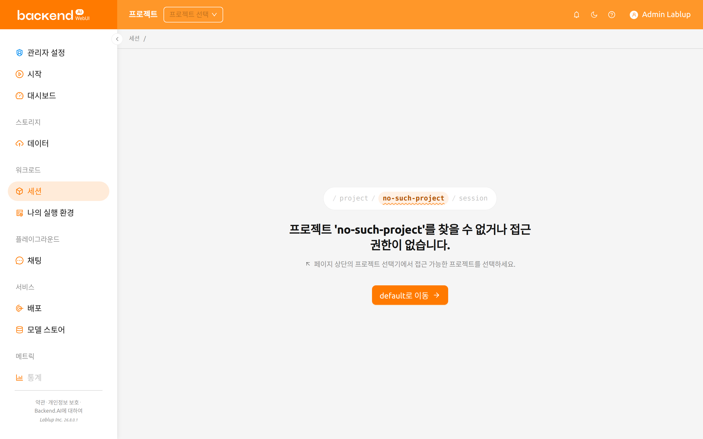
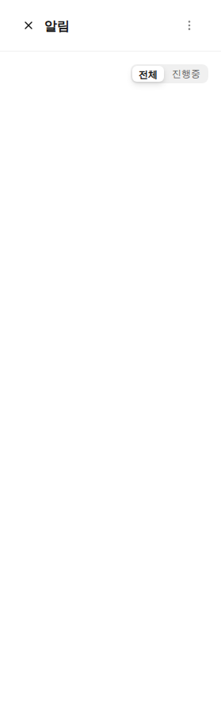
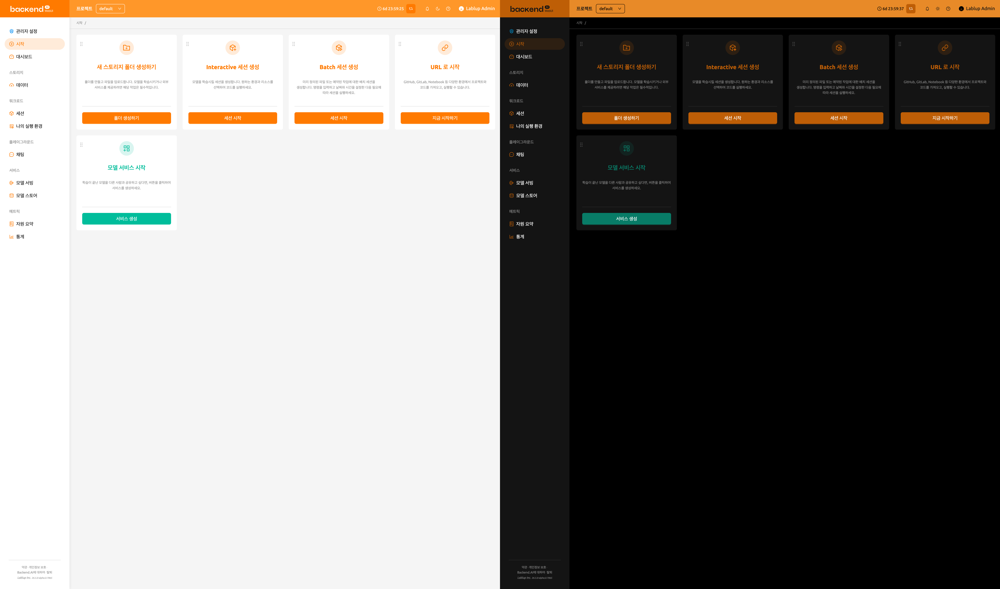
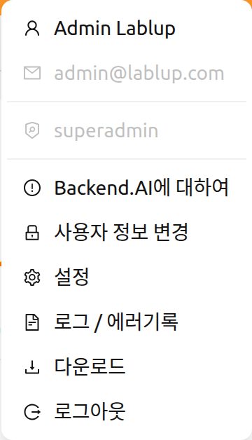
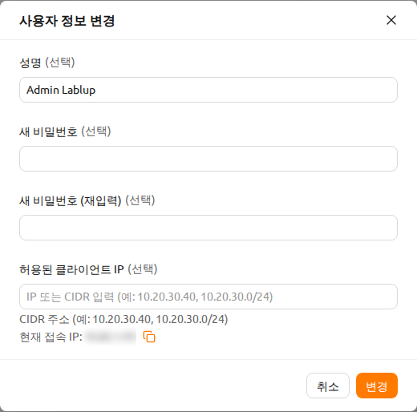
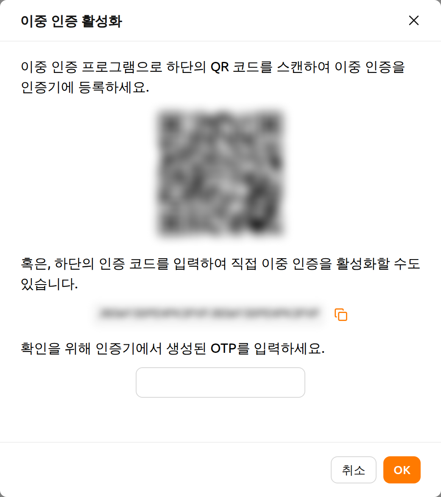
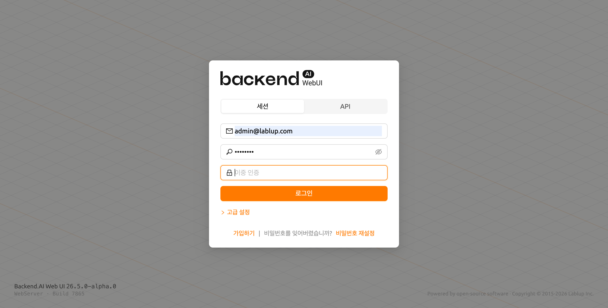
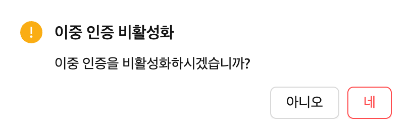
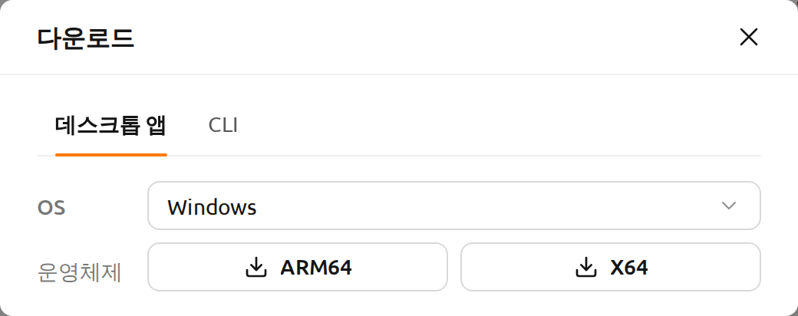
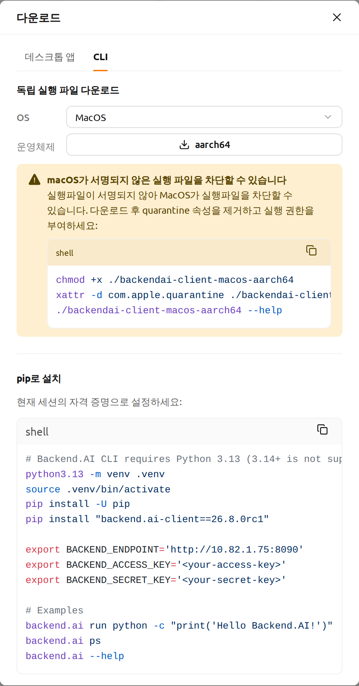

# 상단 바 기능

상단 바에는 WebUI 사용을 지원하는 다양한 기능이 포함되어 있습니다.

## 프로젝트 선택기

사용자는 상단 바의 프로젝트 선택기를 통하여 현재 프로젝트를 선택할 수 있습니다. 각 프로젝트 별로 다른 자원 정책을 가질 수 있으므로, 프로젝트를 변경할 경우 가용 가능한 자원 정책이 변경될 수 있습니다.

프로젝트 페이지의 주소에는 현재 작업 중인 프로젝트의 이름이 포함됩니다. 예를 들어
`http://<host>/project/<project-name>/start`과 같은 형태입니다. 다른 프로젝트를
선택하면 현재 주소에서 프로젝트 이름 부분만 바뀌므로 같은 페이지에 그대로 머무릅니다.
경로의 나머지 부분과 쿼리 문자열이 유지되어, 작성 중인 세션 생성 폼처럼 진행 중이던
작업이 사라지지 않습니다. 이전 버전의 WebUI에서 북마크한 주소도 계속 사용할 수 있으며,
같은 페이지의 현재 주소로 자동 연결됩니다.

프로젝트 선택기에는 사용자가 접근할 수 있는 프로젝트가 표시되며, 주소에 포함된 프로젝트
이름이 유효한지도 동일한 목록을 기준으로 판단합니다. 존재하지 않거나 접근 권한이 없는
프로젝트 이름이 포함된 주소로 접속하면, 다른 프로젝트로 임의로 전환되지 않고 프로젝트
선택기가 선택되지 않은 상태로 표시되며 페이지에 상황이 안내됩니다.

- `프로젝트 '<name>'를 찾을 수 없거나 접근 권한이 없습니다.`라는 메시지가 표시됩니다.
- 그 아래에는 페이지 상단의 프로젝트 선택기에서 접근 가능한 프로젝트를 선택하라는 안내가
  표시됩니다.
- `<project>로 이동` 버튼을 클릭하면 접근 가능한 프로젝트로 이동합니다.

소속된 프로젝트가 하나도 없는 경우에는 `선택 가능한 프로젝트가 없습니다.`와
`관리자에게 프로젝트 접근 권한을 요청하세요.`가 표시됩니다.

:::note
관리자 페이지는 특정 프로젝트에 종속되지 않으므로 주소에 프로젝트 이름이 포함되지 않습니다.
이러한 페이지에서 프로젝트를 선택하면 다른 주소로 이동하지 않고 작업 대상 프로젝트만
변경됩니다.
:::

## 로그인 세션 타이머

로그인 세션 관리가 활성화된 경우, 상단 바에 자동 로그아웃까지 남은 시간과 연장 버튼이 표시됩니다. 타이머는 `HH:mm:ss` 형식으로 표시되며, 24시간 이상인 경우 일수도 함께 표시됩니다.

타이머 옆의 연장 버튼(반복 아이콘)을 클릭하면 세션 만료 시간이 초기화되어 로그인 세션이 연장됩니다.

:::note
로그인 세션 타이머는 서버가 로그인 세션 연장을 지원하고 시스템 설정에서 활성화된 경우에만 표시됩니다.
:::

## 이벤트 알림

종 모양 버튼은 이벤트 알림 버튼입니다. WebUI 사용 중 기록이 필요한 이벤트가 이곳에 표시됩니다. 연산 세션 생성과 같은 백그라운드 작업이 진행 중일 때, 여기에서 작업 상태를 확인할 수 있습니다. 단축키(`]`)를 눌러 알림 영역을 열거나 닫을 수 있습니다.

## 테마 모드

상단 바 우측에 있는 다크모드 버튼을 통하여 WebUI의 테마를 변경할 수 있습니다.

테마와 주요 색상 등 추가적인 외형 설정은 사용자 설정 페이지에 있습니다. 사용자 메뉴를 열고
`설정`을 선택하면 이동할 수 있습니다. 이 항목들은 관리자가 활성화한 경우에만 제공됩니다.
각 항목에 대한 설명은 [사용자 설정](#user-settings) 챕터를 참고하시기 바랍니다.

## 도움말

상단 바 우측의 물음표 버튼을 클릭하면 본 가이드 문서의 웹 버전에 접속할 수 있습니다. 연결되는
주소는 현재 사용 중인 WebUI에 맞추어 구성됩니다.

- **버전**: 현재 실행 중인 WebUI 버전에 맞추어 발행된 문서가 열립니다. 사전 릴리스나 개발
  빌드에서는 최신 변경 사항을 반영하는 `next` 채널이 열립니다.
- **언어**: 사용 중인 표시 언어로 문서가 발행되어 있는 경우(영어, 한국어, 일본어, 태국어)
  해당 언어의 문서가 열리며, 그 외의 언어에서는 영어 문서가 열립니다.
- **페이지**: 현재 사용자가 접근해 있는 페이지를 설명하는 섹션으로 연결됩니다. 탭별로 별도의
  섹션이 있는 경우에는 현재 선택된 탭에 해당하는 섹션으로 연결됩니다. 이는 모든 범위에서
  동작하여, 사용자 페이지는 사용자 섹션으로, 프로젝트 관리자 및 관리자 페이지는 각각의
  관리자 섹션으로 연결됩니다.

일부 페이지는 본 문서에 별도의 섹션이 없습니다. 이러한 페이지에서는 해당 언어 문서의 첫
페이지가 열립니다.

## 반응형 레이아웃

화면이 좁은 경우, 상단 바는 사용성을 높이기 위해 레이아웃을 조정합니다. 화면 너비가 좁으면 사이드바 토글 대신 메뉴 아이콘 버튼이 상단 바에 나타납니다. 사용자의 표시 이름이 숨겨지고 사용자 메뉴에는 아바타 아이콘만 표시될 수 있습니다. 매우 작은 화면에서는 프로젝트 레이블 텍스트도 숨겨집니다.

## 사용자 메뉴

상단 바 우측의 사용자 아이콘 버튼을 클릭하여 사용자 메뉴를 확인할 수 있습니다.

드롭다운 상단에는 다음과 같은 사용자 정보가 표시됩니다. 이 항목들은 클릭할 수 없는 참고 정보입니다.

- **이름**: 현재 사용자의 전체 이름.
- **이메일**: 현재 사용자의 이메일 주소.
- **역할**: 현재 사용자의 역할 (예: 사용자, 슈퍼 관리자).

사용자 정보 아래에는 다음과 같은 실행 항목이 있습니다.

- `Backend.AI에 대하여`: Backend.AI WebUI의 버전, 라이선스 종류 등과 같은 정보를 표시합니다.
- `사용자 정보 변경`: 현재 로그인된 사용자 정보를 확인하거나 변경합니다.
- `설정`: 사용자 설정 페이지로 이동합니다.
- `로그 / 에러기록`: 사용자 설정 페이지의 로그 탭으로 이동합니다. 클라이언트 측에 기록된 로그 및 오류 내역을 확인할 수 있습니다.
- `다운로드`: 다운로드 다이얼로그를 엽니다. 독립형 WebUI 데스크톱 앱과 Backend.AI 명령줄 인터페이스(CLI)를 받을 수 있습니다. 이 항목은 관리자가 둘 중 하나 이상을 활성화한 경우에만 표시됩니다.
- `로그아웃`: WebUI에서 로그아웃합니다.

### 사용자 정보 변경

`사용자 정보 변경`을 클릭하면, 사용자 정보 변경 다이얼로그가 나타납니다.

각 항목은 다음과 같은 의미를 가집니다. 원하는 값을 입력하고 업데이트 버튼을 클릭하면
사용자 정보가 변경됩니다.

- **사용자 이름**: 사용자의 이름 (최대 64자).
- **새 비밀번호**: 새로운 비밀번호 (영문자, 숫자, 기호가 1개 이상 포함된 8글자 이상).
  눈 아이콘을 클릭하면 입력 내용을 확인할 수 있습니다.
- **새 비밀번호 (재입력)**: 확인을 위해 새 비밀번호를 다시 입력합니다.
- **허용된 클라이언트 IP**: 특정 IP 주소 또는 CIDR 범위로 로그인 접근을 제한합니다.
  하나 이상의 IP 주소 또는 CIDR 표기법(예: `10.20.30.40`, `10.20.30.0/24`)을
  입력할 수 있습니다. 필드 아래에는 현재 접속 IP 주소가 복사 버튼과 함께
  표시됩니다. 설정된 목록에 현재 IP가 포함되어 있지 않으면 경고가 표시됩니다.
- **이중 인증 사용**: 이중 인증(2FA)을 활성화하거나 비활성화합니다. 활성화된 경우
  로그인 시 OTP 코드를 입력해야 합니다.

:::note
플러그인 설정에 따라 `이중 인증 사용` 항목이 표시되지 않을 수 있습니다.
이 경우 시스템 관리자에게 문의하시기 바랍니다.
:::

### 이중 인증 설정

`2FA Enabled` 스위치를 활성화하면, 다음과 같은 다이얼로그가 나타납니다.

사용자가 사용하는 이중 인증 애플리케이션을 켜고 QR 코드를 스캔하거나 인증 코드를 직접 입력합니다. 이중 인증 지원 애플리케이션은 Google Authenticator, 2STP, 1Password, Bitwarden 등이 있습니다.

이중 인증 애플리케이션에 추가된 항목의 6자리 코드를 위 다이얼로그에 입력합니다. `확인` 버튼을 누르면 이중 인증 활성화가 완료됩니다.

이후 해당 사용자의 로그인 과정에서 OTP 코드를 묻는 추가 필드가 나타납니다.

이중 인증 애플리케이션을 열고 One-time password 필드에 6자리 코드를 입력해야 로그인이 가능합니다.

이중 인증을 비활성화하려면, `2FA Enabled` 스위치를 끄고 다음 다이얼로그에서 확인 버튼을 클릭합니다.

### 다운로드

`다운로드`를 선택하면 관리자가 활성화한 항목별로 탭이 구성된 다이얼로그가 나타납니다.
탭은 `데스크톱 앱`과 `CLI`입니다.

`데스크톱 앱` 탭에서는 **OS** 항목에서 사용 중인 운영체제를 선택한 뒤, 사용 중인 CPU
아키텍처에 해당하는 버튼을 클릭하면 다운로드가 시작됩니다. 독립형 앱을 사용하면 브라우저
없이도 동일한 WebUI를 사용할 수 있습니다.

`CLI` 탭에서는 명령줄 클라이언트를 사용하는 두 가지 방법을 제공합니다.

- **독립 실행 파일 다운로드**: 사용 중인 운영체제를 선택한 뒤, 사용 중인 CPU 아키텍처에
  해당하는 버튼을 클릭합니다. Linux와 macOS 빌드를 제공합니다. 다운로드한 뒤에는 버튼
  아래에 표시된 명령을 실행하여 실행 권한을 부여하고, 필요하면 `PATH`에 `backend.ai`로
  설치할 수 있습니다. macOS의 경우 빌드가 아직 서명되지 않았기 때문에, 대신 quarantine
  속성을 먼저 제거하는 방법이 안내됩니다.
- **pip로 설치**: 파이썬 가상 환경을 만들고, 접속 중인 서버와 버전이 일치하는 클라이언트를
  설치하며, 클라이언트에 필요한 환경 변수를 설정하는 스니펫이 제공됩니다. 스니펫 우측 상단의
  복사 버튼을 클릭하면 전체 내용을 복사할 수 있습니다.

:::note
스니펫에는 현재 세션의 엔드포인트가 자동으로 채워지지만, 자격 증명은 표시되지 않습니다.
실행하기 전에 `<your-access-key>`와 `<your-secret-key>`를 본인의 키페어로 바꾸시기
바랍니다. 또한 스니펫은 클라이언트가 요구하는 Python 3.13을 사용하도록 고정합니다.
:::
