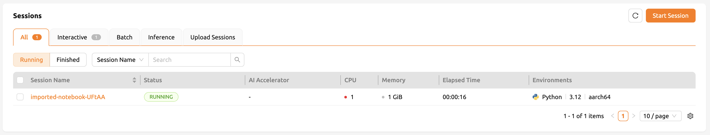
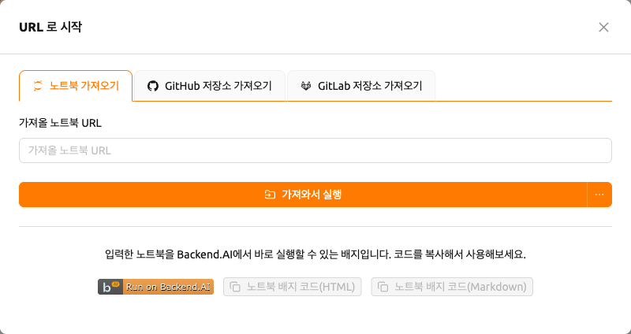
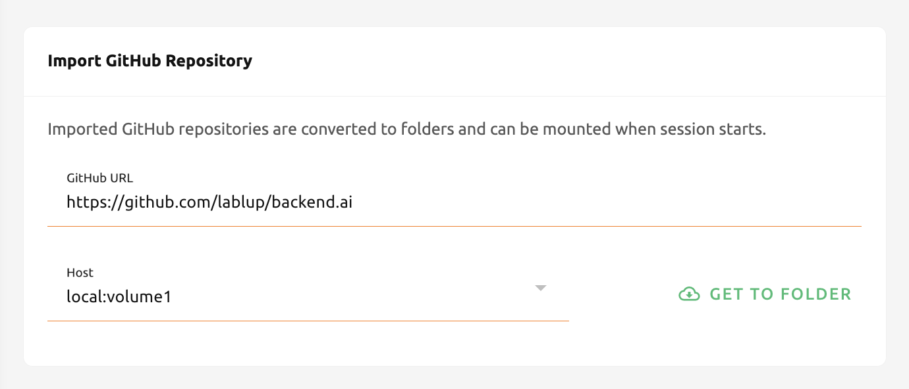

# Jupyter notebook과 웹 기반 Git 저장소 불러오기 및 실행

'가져오기 & 실행' 페이지에서, 즉석으로 Jupyter notebook 파일을 실행하거나 GitHub, GitLab과 같은 웹 기반 Git 저장소를 가져올 수 있습니다. 파일을 받거나 실행하기 위해 로컬 저장소에서 직접 생성하거나 다운로드 받고 다시 업로드하지 않아도 됩니다. 유효한 URL을 입력하고 각 기능에 해당하는 패널의 우측에 있는 버튼을 클릭하기만 하면 됩니다.

## Jupyter notebook 파일 가져오기 및 실행

Jupyter notebook 파일을 가져와서 실행하기 위해서는 notebook 파일에 대한 유효한 URL이 필요합니다. GitHub에 있는 Jupyter notebook을 실행하고자 한다면, 입력 필드에 해당 파일의 URL을 복사해서 붙여넣은 뒤, '가져와서 실행' 버튼을 클릭하면 됩니다.

   로컬 주소의 Jupyter notebook 파일을 불러와서 실행할 경우 유효하지 않은 것으로 간주됩니다. localhost로 시작되지 않는 URL을 입력해 주십시오.

버튼을 클릭하면 대화상자가 나타납니다. 이 대화상자는 세션 페이지나 요약 페이지에서 세션을 시작할 때와 동일한 세션 런처입니다. notebook 가져오기와 새 세션 시작의 차이점은, notebook 가져오기 시 URL에 있는 Jupyter notebook이 자동으로 가져와진다는 것입니다. 나머지는 동일합니다. 필요에 따라 환경과 자원 할당을 설정한 뒤, '시작' 버튼을 클릭합니다.

   '시작' 버튼을 클릭하기 전에 팝업 차단기를 해제해야 실행 중인 notebook 창을 바로 확인할 수 있습니다. 또한, 세션을 실행할 자원이 충분하지 않은 경우 가져온 Jupyter notebook이 실행되지 않습니다.

세션 페이지에서 가져오기 작업이 성공적으로 완료된 것을 확인할 수 있습니다.

## 실행 가능한 Jupyter notebook 버튼 생성

Jupyter notebook URL에 대한 HTML 또는 Markdown 버튼을 생성할 수도 있습니다. 유효한 Jupyter notebook URL을 입력하고 'Create' 버튼을 클릭합니다. notebook으로 세션을 생성하는 링크가 포함된 코드 블록이 표시됩니다. 이 배지 코드를 GitHub 저장소나 HTML 또는 Markdown을 지원하는 곳에 삽입하여 사용할 수 있습니다.

   버튼을 클릭하기 전에 계정에 로그인되어 있어야 합니다. 그렇지 않으면 먼저 로그인해야 합니다.

## GitHub 저장소 가져오기

GitHub 저장소 가져오기는 Jupyter notebook 가져오기 및 실행과 유사합니다. GitHub 저장소 URL을 입력하고 '가져오기' 버튼을 클릭하기만 하면 됩니다. 두 개 이상의 스토리지 호스트에 접근할 수 있는 경우, 목록에서 하나를 선택할 수 있습니다.

   세션을 시작할 자원이 충분하지 않거나 폴더 수가 한도에 도달한 경우, 저장소 가져오기가 실패합니다. 저장소를 가져오기 전에 자원 통계 패널과 데이터 & 스토리지 페이지를 확인해 주십시오.

저장소가 해당 이름의 데이터 폴더로 성공적으로 가져와진 것을 확인할 수 있습니다.

## GitLab 저장소 가져오기

22.03 버전부터 Backend.AI는 GitLab에서의 가져오기를 지원합니다. [GitHub 저장소 가져오기](#importing-github-repositories)와 거의 동일하지만, 가져올 브랜치 이름을 명시적으로 설정해야 합니다.

   동일한 이름의 데이터 폴더가 이미 존재하는 경우, 시스템은 가져온 저장소 폴더 이름에 `_`(밑줄)와 숫자를 추가합니다.
