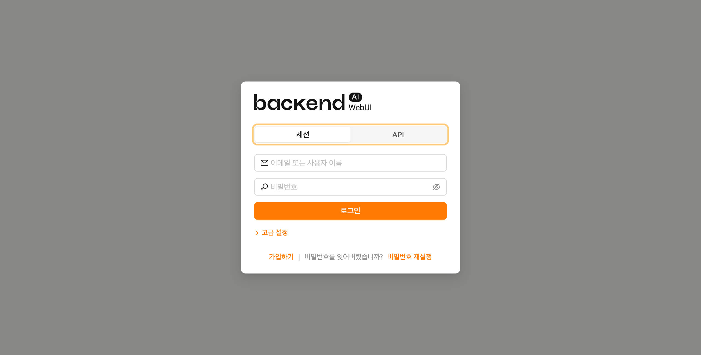
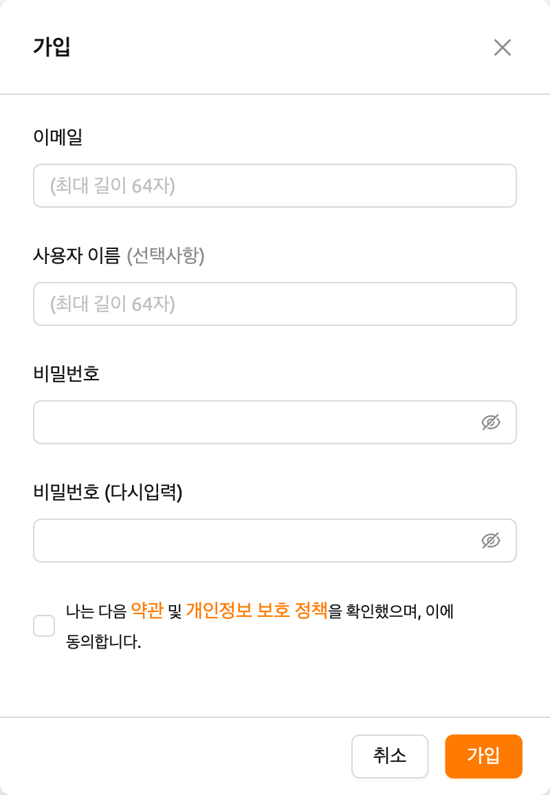
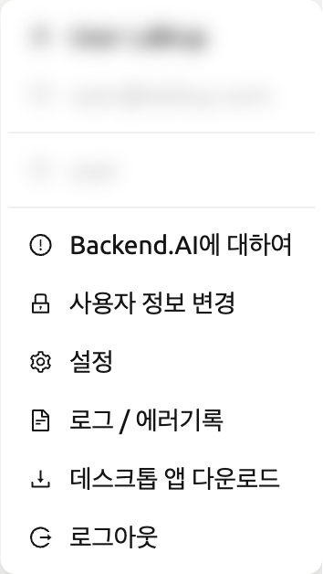
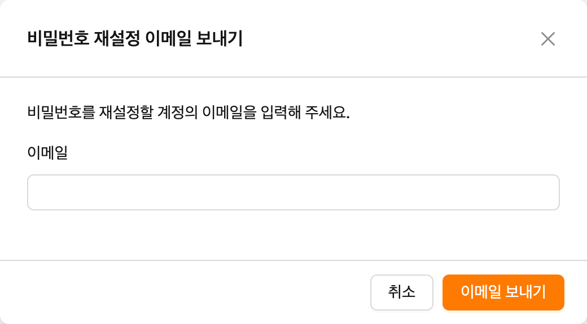
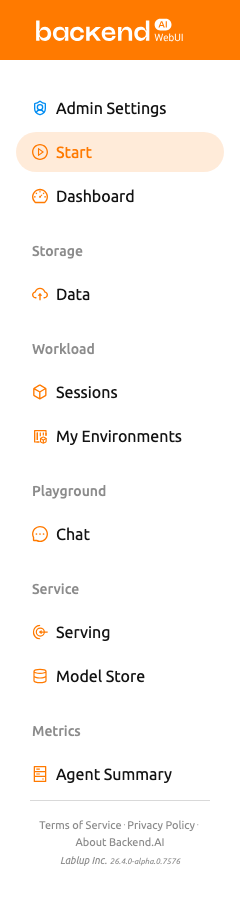

# 가입 및 로그인

## 가입

WebUI를 실행하면 다음과 같은 로그인 대화창이 뜹니다. 아직 가입을 하지 않은 경우에는 가입하기 버튼을 눌러주세요.

이메일과 사용자 이름, 비밀번호 등의 정보를 입력하고 약관과 개인정보보호정책을 읽고 동의한 뒤 가입하기 버튼을 클릭합니다. 시스템 설정에 따라 가입하기 위해 별도의 초대 토큰을 입력해야 할 수도 있습니다. 또한, 이메일이 본인의 것이 맞는지 검증하는 이메일이 전송될 수도 있습니다. 검증 이메일이 전송되는 경우, 이메일을 읽고 확인 링크를 클릭해서 검증을 통과해야만 가입한 계정으로 로그인 할 수 있습니다.

:::info
서버 설정이나 플러그인 설정에 따라 사용자에 의한 가입이 막혀있을 수 있습니다. 이 경우에는 시스템 관리자에게 문의 하십시오.
:::

:::info
악성 사용자가 다른 사용자의 비밀번호를 추측하기 어렵게 만들기 위해, 비밀번호는 8 자 이상, 알파벳/특수문자/숫자를 1 개 이상 포함해야 합니다.
:::

## 로그인

ID와 암호를 입력하고 로그인 버튼을 눌러주세요. 엔드포인트에는 Manager로의 연결을 중계하는 Backend.AI Webserver가 작동하고 있는 URL을 넣어주시면 됩니다.

:::info
Webserver의 설치 및 설정 환경에 따라, 엔드포인트가 고정되어 있을 수 있습니다.
:::

:::info
Backend.AI 는 사용자의 비밀번호를 단방향 해시를 통해 안전하게 보관하고 있습니다. BSD 의 기본 암호 해시인 BCrypt 를 사용하고 있어, 서버 관리자도 사용자의 비밀번호를 알 수 없습니다.
:::

로그인이 완료되면 요약 탭에서 현재 사용하고 있는 자원량 등의 정보를 확인할 수 있습니다.

우측 상단의 아이콘을 클릭하면 하위 메뉴가 나옵니다. 로그아웃 버튼을 클릭해서 로그아웃 할 수 있습니다.

## 비밀번호를 잊어버렸을 경우

비밀번호를 잊어버렸을 경우, 로그인 패널의 비밀번호 재설정 버튼을 클릭하여 비밀번호 변경 링크를 이메일로 전송할 수 있습니다. 이메일을 읽고 지시대로 따라하면 비밀번호를 변경할 수 있습니다. 서버 설정에 따라 비밀번호 변경 기능이 비활성화 되어 있을 수 있습니다. 이 경우에는 관리자에게 문의 하십시오.

:::info
이 기능도 모듈화되어 있어 어떤 환경에서는 지원되지 않을 수 있습니다.
:::

:::warning
로그인 실패가 10 회 이상 발생하면 보안상의 이유로 로그인 시도가 20 분 간 제한됩니다. 만약 20 분 후에도 로그인 제한이 계속 유지되는 경우에는 시스템 관리자에게 문의 하십시오.
:::

## 사이드바의 메뉴

사이드바 오른쪽에 있는 버튼을 통해 사이드바의 크기를 변경할 수 있습니다.
버튼을 클릭하면 사이드바의 너비가 크게 줄어들어 콘텐츠를 더 넓게 볼 수 있습니다.
다시 클릭하면 사이드바가 원래 너비로 돌아갑니다.
단축키 ( `[` ) 를 사용하여 좁은 사이드바와 원래 너비 사이를 전환할 수도 있습니다.

