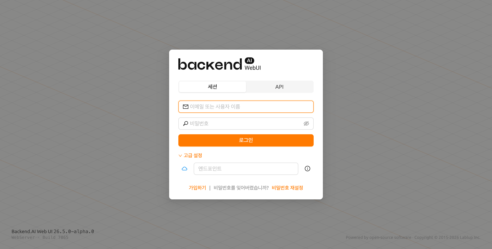
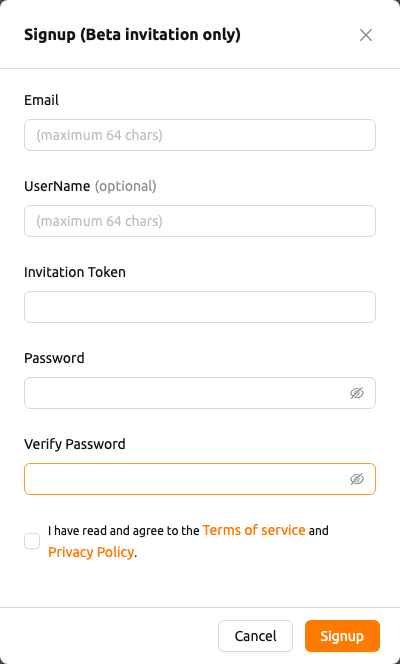
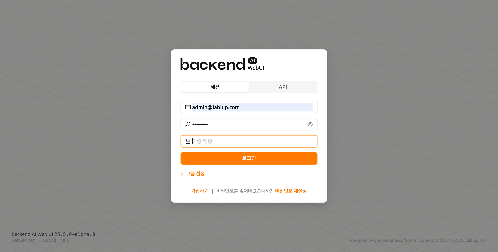
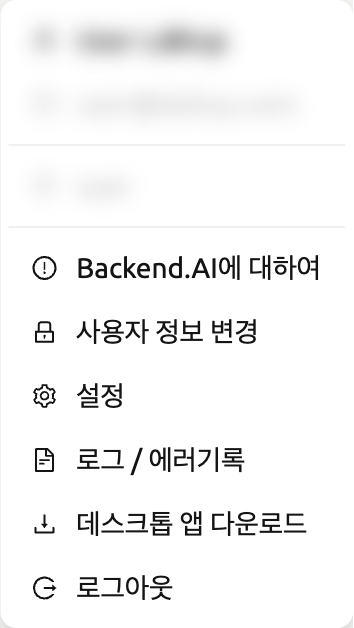
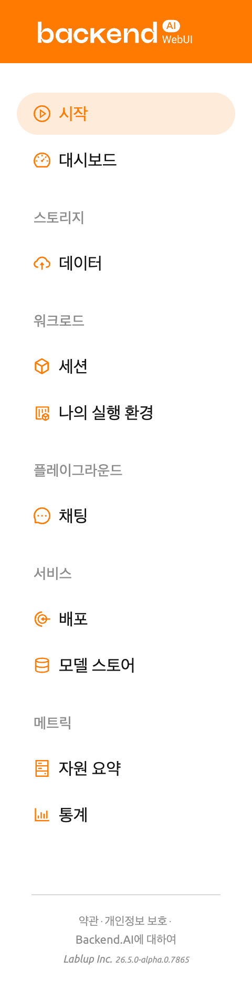

# 가입 및 로그인

## 가입

WebUI를 실행하면 로그인 대화창이 나타납니다. 아직 가입을 하지 않은 경우에는 대화창 하단의 `가입하기` 링크를 클릭하세요.

이메일과 사용자 이름, 비밀번호 등의 정보를 입력하고 약관과 개인정보보호정책을 읽고 동의한 뒤 가입하기 버튼을 클릭합니다. 시스템 설정에 따라 가입하기 위해 별도의 초대 토큰을 입력해야 할 수도 있습니다. 또한, 이메일이 본인의 것이 맞는지 검증하는 이메일이 전송될 수도 있습니다. 검증 이메일이 전송되는 경우, 이메일을 읽고 확인 링크를 클릭해서 검증을 통과해야만 가입한 계정으로 로그인할 수 있습니다.

:::note
서버 설정이나 플러그인 설정에 따라 사용자에 의한 가입이 막혀있을 수 있습니다. 이 경우에는 시스템 관리자에게 문의하십시오.
:::

:::note
악성 사용자가 다른 사용자의 비밀번호를 추측하기 어렵게 만들기 위해, 비밀번호는 8자 이상, 알파벳/특수문자/숫자를 1개 이상 포함해야 합니다.
:::

## 로그인

이메일(또는 사용자 이름)과 비밀번호를 입력하고 `로그인` 버튼을 클릭합니다.

### 연결 모드

관리자가 활성화한 경우, 로그인 대화창 상단에 `세션` 모드와 `API` 모드를 선택할 수 있는 모드 선택기가 나타납니다.

- **세션**: 표준 로그인 모드입니다. 이메일/사용자 이름과 비밀번호를 입력하여 인증합니다. 대부분의 사용자에게 기본 모드입니다.
- **API**: API 키페어를 사용하여 로그인합니다. 이메일과 비밀번호 대신 **API Key**와 **Secret Key**를 입력합니다. 프로그래밍 방식의 접근에 유용합니다.

### API 엔드포인트

`고급 설정` 링크를 클릭하면 엔드포인트 설정 섹션이 펼쳐집니다. API 엔드포인트 필드에 Manager로의 연결을 중계하는 Backend.AI Webserver의 URL을 입력합니다.

:::note
Webserver의 설치 및 설정 환경에 따라, 엔드포인트가 고정되어 있을 수 있습니다.
:::

:::note
Backend.AI는 사용자의 비밀번호를 단방향 해시를 통해 안전하게 보관하고 있습니다. BSD의 기본 암호 해시인 BCrypt를 사용하고 있어, 서버 관리자도 사용자의 비밀번호를 알 수 없습니다.
:::

### SSO 로그인 (SAML / OpenID)

관리자가 SSO(Single Sign-On)를 설정한 경우, 표준 `로그인` 버튼 아래에 추가 로그인 버튼이 나타날 수 있습니다.

- **SAML 로그인**: 조직의 SAML ID 제공자를 사용하여 인증합니다.
- **[Realm 이름] 로그인**: OpenID Connect 제공자를 사용하여 인증합니다. 버튼 레이블에는 관리자가 설정한 realm 이름이 표시됩니다.

해당 SSO 버튼을 클릭하면 조직의 ID 제공자로 리디렉션되어 인증이 진행됩니다.

:::note
SSO 로그인 옵션은 시스템 관리자가 활성화한 경우에만 표시됩니다.
:::

### OTP 로그인 (이중 인증)

계정에 이중 인증(2FA)이 활성화된 경우, 이메일과 비밀번호를 입력한 후 OTP(일회용 비밀번호) 필드가 추가로 나타납니다.

인증 애플리케이션(Google Authenticator, 1Password, Bitwarden 등)을 열고 OTP 필드에 6자리 코드를 입력하면 로그인이 완료됩니다.

### 최초 로그인 시 TOTP 설정

관리자가 이중 인증을 필수로 설정하였고 아직 TOTP를 설정하지 않은 경우, 첫 로그인 성공 후 자동으로 설정 대화창이 나타납니다. 인증 애플리케이션으로 QR 코드를 스캔하거나 제공된 키를 직접 입력한 뒤, 6자리 인증 코드를 입력하면 설정이 완료됩니다.

TOTP 설정 이후에는 매 로그인 시 OTP 코드를 입력해야 합니다.

:::note
계정 설정에서 2FA를 활성화하거나 비활성화하는 방법에 대한 자세한 내용은 상단 바 기능의 [이중 인증 설정](#2fa-setup) 섹션을 참고하세요.
:::

### 동시 세션 감지

다른 브라우저나 기기에서 이미 로그인된 상태에서 로그인을 시도하면, 기존 세션이 활성 상태임을 알리는 확인 대화창이 나타납니다. 기존 세션을 종료하고 새로 로그인하거나, 취소하여 기존 세션을 유지할 수 있습니다.

:::note
이 기능은 계정에 대한 의도치 않은 동시 접근을 방지합니다. 예상치 못하게 이 대화창이 나타나는 경우, 다른 사람이 사용자의 자격 증명을 사용하고 있을 수 있습니다. 이 경우 로그인을 진행하여 다른 세션을 종료하고 비밀번호를 변경하는 것을 권장합니다.
:::

로그인이 완료되면 시작 페이지에서 현재 사용하고 있는 자원량 등의 정보를 확인할 수 있습니다.

우측 상단의 사용자 아이콘을 클릭하면 사용자 메뉴가 나타납니다. `로그아웃` 메뉴를 선택하여 로그아웃할 수 있습니다.

:::note
시스템에 로그인 세션 타이머가 활성화되어 있는 경우, 타이머가 만료되면 자동으로 로그아웃됩니다. 자세한 내용은 상단 바 기능의 [로그인 세션 타이머](#login-session-timer) 섹션을 참고하세요.
:::

## 비밀번호를 잊어버렸을 경우

비밀번호를 잊어버렸을 경우, 로그인 패널의 `비밀번호를 잊어버렸습니까?` 텍스트 옆의 `비밀번호 재설정` 링크를 클릭합니다. 이메일 주소를 입력할 수 있는 대화창이 나타나며, 비밀번호 변경 링크가 포함된 이메일을 받을 수 있습니다. 이메일의 안내에 따라 비밀번호를 재설정합니다.

:::note
서버 설정에 따라 비밀번호 변경 기능이 제공되지 않을 수 있습니다. 이 경우에는 관리자에게 문의하십시오.
:::

:::warning
로그인 실패가 10회 이상 발생하면 보안상의 이유로 로그인 시도가 20분간 제한됩니다. 만약 20분 후에도 로그인 제한이 계속 유지되는 경우에는 시스템 관리자에게 문의하십시오.
:::

## 사이드바의 메뉴

사이드바 오른쪽에 있는 버튼을 통해 사이드바의 크기를 변경할 수 있습니다.
버튼을 클릭하면 사이드바의 너비가 크게 줄어들어 콘텐츠를 더 넓게 볼 수 있습니다.
다시 클릭하면 사이드바가 원래 너비로 돌아갑니다.
단축키 ( `[` ) 를 사용하여 좁은 사이드바와 원래 너비 사이를 전환할 수도 있습니다.

