# 모델 서빙

## 모델 서비스


:::note
이 기능은 엔터프라이즈 전용 기능입니다.
:::

Backend.AI는 모델 학습 단계에서 개발 환경 구축과 리소스 관리를 지원할 뿐만 아니라,
23.09 버전부터 모델 서비스 기능도 지원합니다. 이 기능을 통해
엔드 유저(AI 기반 모바일 앱 및 웹 서비스 백엔드 등)는 완성된 모델을
추론 서비스로 배포하고자 할 때 추론 API 호출을 수행할 수 있습니다.


모델 서비스는 기존의 학습용 연산 세션 기능을 확장하여, 자동화된 유지·보수 및 스케일링을 가능하게 하고 프로덕션 서비스를 위한 영구적인 포트 및 엔드포인트 주소 매핑을 제공합니다. 개발자나 관리자가 연산 세션을 수동으로 생성·삭제할 필요 없이 모델 서비스에 필요한 스케일링 파라미터를 지정해 주기만 하면 됩니다.

## 23.03 이전 버전에서의 모델 서비스 구성 및 제한 사항

모델 서빙 전용 기능은 23.09 버전부터 공식적으로 지원되지만,
이전 버전에서도 모델 서비스를 사용할 수는 있습니다.

예를 들어, 23.03 버전에서는 학습용 연산 세션을 다음과 같이
수정하여 모델 서비스를 구성할 수 있습니다.

1. 모델 서빙을 위해 세션 내부의 실행 중인 서버 포트를 매핑하기 위해
   세션 생성 시 사전 개방 포트를 추가합니다.
   (사전 개방 포트 사용 방법은 [사전 개방 포트 설정](#set-preopen-ports)을 참조하세요.)

2. 사전 개방 포트에 매핑된 서비스를 공개적으로 접근 가능하게 하려면
   '앱 공개'를 체크합니다.
   ("앱 공개"에 대한 자세한 정보는 [앱 공개](#open-app-to-public)를 참조하세요.)

하지만 23.03 버전에는 다음과 같은 제한 사항이 있습니다:

-  세션이 외부 요인(유휴 시간 만료, 시스템 오류 등)으로 종료될 경우 자동으로 복구되지 않습니다.
-  세션을 새로 실행할 때마다 앱 포트가 변경됩니다.
-  세션을 반복적으로 재실행할 경우, 유휴 포트가 고갈될 수 있습니다.

23.09 버전의 공식 모델 서비스 기능은 이러한 제한 사항을 해결합니다.
따라서 23.09 버전부터는 가능한 한 모델 서빙 메뉴를 통해
모델 서비스를 생성/관리하는 것을 권장합니다. 사전 개방 포트의 사용은
개발 및 테스트 목적으로만 권장됩니다.

## 모델 서비스를 사용하기 위한 단계 안내

모델 서비스를 사용하기 위해서는 크게 아래와 같은 단계를 따라야 합니다.

1. 모델 정의 파일을 생성합니다.
2. 서비스 정의 파일을 생성합니다.
3. 정의 파일들을 모델 타입 폴더에 업로드합니다.
4. 모델 서비스를 생성/유효성 검사합니다.
5. (모델 서비스가 공개되지 않은 경우) 토큰을 발급합니다.
6. (엔드 유저용) 모델 서비스에 대응하는 엔드포인트에 접속하여 서비스를 확인합니다.
7. (필요한 경우) 모델 서비스를 수정합니다.
8. (필요한 경우) 모델 서비스를 종료합니다.

<a id="model-definition-guide"></a>

#### 모델 정의 파일 생성하기

:::note
24.03 버전부터 모델 정의 파일 이름을 구성할 수 있습니다. 모델 정의 파일 경로에
다른 입력 필드를 입력하지 않으면 시스템은 `model-definition.yml` 또는
`model-definition.yaml`로 간주합니다.
:::

모델 정의 파일은 Backend.AI 시스템이 추론용 세션을 자동으로 시작, 초기화하고 필요에 따라 스케일링할 때 필요한 설정 정보를 담고 있는 파일입니다. 이 파일을 추론 서비스 엔진을 담고 있는 컨테이너 이미지와는 독립적으로 모델 타입 폴더에 저장합니다. 이를 통해 모델을 실행하는 엔진이 다양한 모델을 필요에 따라 바꿔가며 서비스할 수 있도록 하며, 모델이 변경될 때마다 컨테이너 이미지를 새로 빌드 및 배포하지 않아도 되도록 해줍니다. 네트워크 스토리지에서 직접 모델 정의와 모델 데이터를 불러오므로, 자동 스케일링 시 배포 과정을 더 단순화 및 효율화할 수 있습니다.

모델 정의 파일은 다음과 같은 형식을 따릅니다.

```yaml
models:
  - name: "simple-http-server"
    model_path: "/models"
    service:
      start_command:
        - python
        - -m
        - http.server
        - --directory
        - /home/work
        - "8000"
      port: 8000
      health_check:
        path: /
        interval: 10.0
        max_retries: 10
        max_wait_time: 15.0
        expected_status_code: 200
        initial_delay: 60.0
```

**모델 정의 파일에 대한 키-값 설명**

:::note
"(필수)" 표시가 없는 필드는 선택사항입니다.
:::

- `name` (필수): 모델의 이름을 정의합니다.
- `model_path` (필수): 모델이 정의된 경로를 지정합니다.
- `service`: 서비스될 파일들에 대한 정보를 구성하는 항목입니다
  (명령 스크립트 및 코드 포함).

   - `pre_start_actions`: `start_command` 이전에 실행되는 작업입니다. 이러한 작업들은
     구성 파일 생성, 디렉토리 설정, 초기화 스크립트 실행 등을 통해 환경을 준비합니다.
     작업은 정의된 순서대로 순차적으로 실행됩니다.

      - `action`: 수행할 작업 유형입니다. 사용 가능한 작업 유형과 해당 매개변수는
        [사전 시작 작업](#prestart-actions)을 참조하세요.
      - `args`: 작업별 매개변수입니다. 각 작업 유형마다 다른 필수 인수가 있습니다.

   - `start_command` (필수): 모델 서빙에서 실행될 명령을 지정합니다.
     문자열 또는 문자열 목록으로 지정할 수 있습니다.
   - `port` (필수): 모델 서비스를 위한 컨테이너 포트입니다 (예: `8000`, `8080`).
   - `health_check`: 모델 서비스의 주기적인 상태 모니터링을 위한 구성입니다.
     이 설정이 구성되면, 시스템은 자동으로 서비스가 올바르게 응답하는지 확인하고
     비정상 인스턴스를 트래픽 라우팅에서 제거합니다.

      - `path` (필수): 상태 확인 요청을 위한 HTTP 엔드포인트 경로입니다 (예: `/health`, `/v1/health`).
      - `interval` (기본값: `10.0`): 연속적인 상태 확인 간의 시간(초 단위)입니다.
      - `max_retries` (기본값: `10`): 서비스를 `UNHEALTHY`로 표시하기 전에
        허용되는 연속 실패 횟수입니다. 이 임계값을 초과하기 전까지 서비스는 계속 트래픽을 받습니다.
      - `max_wait_time` (기본값: `15.0`): 각 상태 확인 HTTP 요청의 타임아웃 시간(초 단위)입니다.
        이 시간 내에 응답이 없으면 확인은 실패로 간주됩니다.
      - `expected_status_code` (기본값: `200`): 정상 응답을 나타내는 HTTP 상태 코드입니다.
        일반적인 값: `200` (OK), `204` (No Content).
      - `initial_delay` (기본값: `60.0`): 컨테이너 생성 후 상태 확인을 시작하기 전에
        대기하는 시간(초 단위)입니다. 이는 모델 로딩, GPU 초기화 및 서비스 워밍업에 시간을 제공합니다.
        대형 모델의 경우 더 높은 값을 설정하세요 (예: 70B+ LLM의 경우 `300.0`).


**상태 확인 동작 이해하기**

상태 확인 시스템은 개별 모델 서비스 컨테이너를 모니터링하고, 상태에 따라 트래픽 라우팅을 자동으로 관리합니다.

```
Container Created
│
▼
┌─────────────────────────────────┐
│  Wait for initial_delay (60s)   │  ← Model loading, GPU init, warmup
│  Status: DEGRADED               │
│  No health checks during this   │
└─────────────────────────────────┘
│
▼
Start Health Check Cycle
│
▼
┌─────────────────────────────────┐
│  Every interval (10s):          │
│  HTTP GET → path ("/health")    │
└─────────────────────────────────┘
│
▼
Wait up to max_wait_time (15s)
│
┌──────────┴──────────┐
▼                     ▼
Response              Timeout/Error
│                     │
▼                     │
Status ==             │
expected?             │
│                     │
┌──┴──┐               │
▼     ▼               │
Y     N               │
│     │               │
│     └───────┬───────┘
│             ▼
│        Consecutive
│        failures +1
│             │
▼             ▼
HEALTHY       Failures > max_retries?
(reset                │
failures)       ┌─────┴─────┐
                ▼           ▼
               Yes          No
                │           │
                ▼           ▼
            UNHEALTHY    Keep current
            (removed     status
            from traffic
            internally)
```

:::note
내부 상태 정보(트래픽 라우팅에 사용됨)는 사용자 인터페이스에 표시되는
상태와 즉시 동기화되지 않을 수 있습니다.
:::

**UNHEALTHY가 되기까지의 시간**:

- 초기 시작 시: `initial_delay + interval × (max_retries + 1)`

  기본값 예시: 60 + 10 × 11 = **170초** (약 3분)

- 운영 중(정상 상태 이후): `interval × (max_retries + 1)`

  기본값 예시: 10 × 11 = **110초** (약 2분)


<a id="prestart-actions"></a>

**Backend.AI 모델 서빙에서 지원되는 서비스 작업 설명**


- `write_file`: 지정된 파일 이름으로 파일을 생성하고 내용을 추가하는 작업입니다.
  기본 액세스 권한은 `644`입니다.

   - `arg/filename`: 파일 이름 지정
   - `body`: 파일에 추가할 내용 지정
   - `mode`: 파일의 액세스 권한 지정
   - `append`: 파일 내용의 덮어쓰기 또는 추가를 `True` 또는 `False`로 설정

- `write_tempfile`: 임시 파일 이름(`.py`)으로 파일을 생성하고 내용을 추가하는 작업입니다.
  모드 값이 지정되지 않은 경우 기본 액세스 권한은 `644`입니다.

   - `body`: 파일에 추가할 내용 지정
   - `mode`: 파일의 액세스 권한 지정

- `run_command`: 명령을 실행한 결과가 오류를 포함하여 다음 형식으로 반환됩니다
  (`out`: 명령 실행 출력, `err`: 명령 실행 중 오류 발생 시 오류 메시지)

   - `args/command`: 실행할 명령을 배열로 지정 (예: `python3 -m http.server 8080` 명령은 ["python3", "-m", "http.server", "8080"]이 됩니다)

- `mkdir`: 입력 경로로 디렉토리를 생성하는 작업입니다

   - `args/path`: 디렉토리를 생성할 경로 지정

- `log`: 입력 메시지로 로그를 출력하는 작업입니다

   - `args/message`: 로그에 표시할 메시지 지정
   - `debug`: 디버그 모드인 경우 `True`, 그렇지 않으면 `False`로 설정

#### 모델 정의 파일을 모델 타입 폴더에 업로드

모델 정의 파일(`model-definition.yml`)을 모델 타입 폴더에 업로드하려면
가상 폴더를 생성해야 합니다. 가상 폴더를 생성할 때 기본 `general` 타입 대신
`model` 타입을 선택하세요. 폴더 생성 방법에 대한 지침은 데이터 페이지의
[스토리지 폴더 생성](#create-storage-folder) 섹션을 참조하세요.

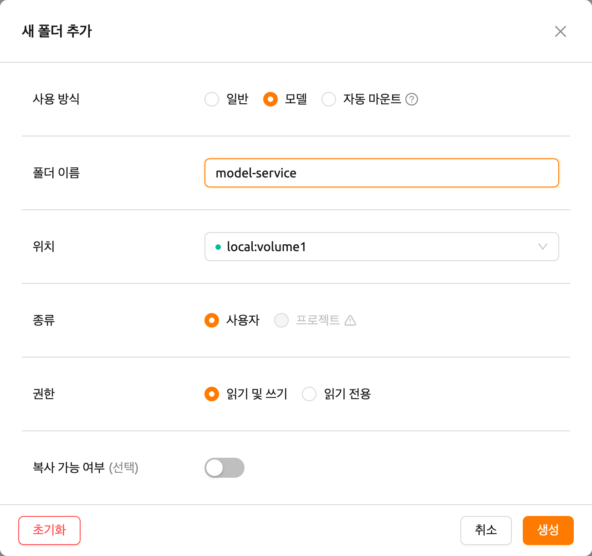

폴더를 생성한 후, 데이터 페이지에서 'MODELS' 탭을 선택하고
최근에 생성한 모델 타입 폴더 아이콘을 클릭하여 폴더 탐색기를 열고
모델 정의 파일을 업로드합니다.
폴더 탐색기 사용 방법에 대한 자세한 내용은
[폴더 탐색](#explore-folder) 섹션을 참조하세요.

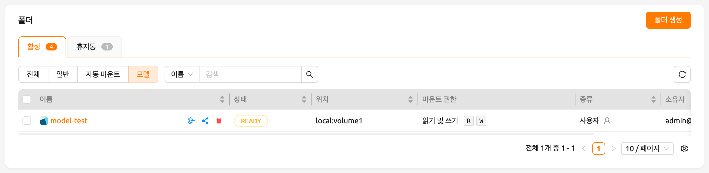

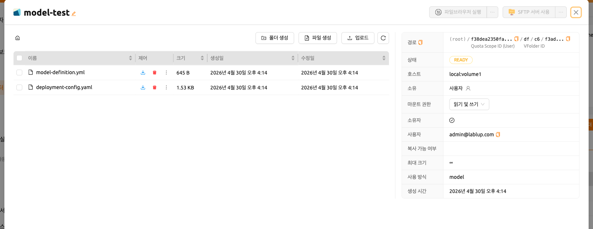

#### 서비스 정의 파일 생성

서비스 정의 파일(`service-definition.toml`)을 사용하면 관리자가 모델 서비스에 필요한 리소스, 환경 및 런타임 설정을 미리 구성할 수 있습니다. 이 파일이 모델 폴더에 있으면, 시스템은 서비스를 생성할 때 이러한 설정을 기본값으로 사용합니다.

`model-definition.yaml`과 `service-definition.toml` 모두 모델 폴더에 있어야
모델 스토어 페이지에서 "이 모델 실행" 버튼이 활성화됩니다. 이 두 파일은
함께 작동합니다: 모델 정의는 모델과 추론 서버 구성을 지정하고, 서비스 정의는
런타임 환경, 리소스 할당 및 환경 변수를 지정합니다.

서비스 정의 파일은 런타임 변형별로 섹션이 구성된 TOML 형식을 따릅니다. 각 섹션은 서비스의 특정 측면을 구성합니다.

```toml
[vllm.environment]
image        = "example.com/model-server:latest"
architecture = "x86_64"

[vllm.resource_slots]
cpu = 1
mem = "8gb"
"cuda.shares" = "0.5"

[vllm.environ]
MODEL_NAME = "example-model-name"
```


**서비스 정의 파일의 키-값 설명**

- `[{runtime}.environment]`: 모델 서비스의 컨테이너 이미지와 아키텍처를 지정합니다.

   - `image` (필수): 추론 서비스에 사용할 컨테이너 이미지의 전체 경로 (예: `example.com/model-server:latest`).
   - `architecture` (필수): 컨테이너 이미지의 CPU 아키텍처 (예: `x86_64`, `aarch64`).

- `[{runtime}.resource_slots]`: 모델 서비스에 할당할 컴퓨트 리소스를 정의합니다.

   - `cpu`: 할당할 CPU 코어 수 (예: `1`, `2`, `4`).
   - `mem`: 할당할 메모리 양. 단위 접미사 지원 (예: `"8gb"`, `"16gb"`).
   - `"cuda.shares"`: 할당할 분할 GPU(fGPU) 공유 (예: `"0.5"`, `"1.0"`). 키에 점이 포함되어 있으므로 이 값은 따옴표로 묶습니다.

- `[{runtime}.environ]`: 추론 서비스 컨테이너에 전달되는 환경 변수를 설정합니다.

   - 런타임에서 필요한 모든 환경 변수를 정의할 수 있습니다. 예를 들어, `MODEL_NAME`은 일반적으로 로드할 모델을 지정하는 데 사용됩니다.


:::note
각 섹션 헤더의 `{runtime}` 접두사는 런타임 변형 이름
(예: `vllm`, `nim`, `custom`)에 해당합니다. 시스템은 서비스를 생성할 때
선택한 런타임 변형과 이 접두사를 매칭합니다.
:::

:::note
"이 모델 실행" 버튼을 사용하여 모델 스토어에서 서비스를 생성하면
`service-definition.toml`의 설정이 자동으로 적용됩니다. 나중에 리소스
할당을 조정해야 하는 경우, 모델 서빙 페이지를 통해 서비스를 수정할 수 있습니다.
:::

#### 모델 서비스 생성/유효성 검사

모델 정의 파일이 모델 타입의 가상 폴더에 업로드되면,
모델 서비스를 생성할 준비가 됩니다.

모델 서빙 페이지에서 '서비스 시작' 버튼을 클릭합니다. 이렇게 하면
서비스를 생성하는 데 필요한 설정을 입력할 수 있는 페이지가 표시됩니다.

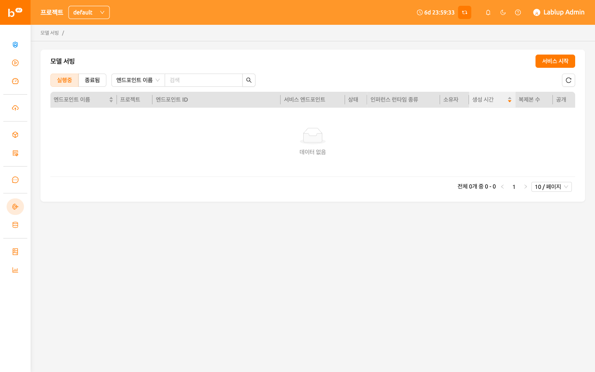

먼저 서비스 이름을 제공합니다. 각 항목에 대한 자세한 설명은 다음을 참조하세요:

-  공개 설정: 이 옵션을 사용하면 서비스가 호스팅되는 서버에서
   별도의 토큰 없이 모델 서비스에 액세스할 수 있습니다.
   기본적으로 비활성화되어 있습니다.
-  마운트할 모델 스토리지: 디렉토리 내부에 모델 정의 파일이 포함된
   마운트할 모델 폴더입니다.
-  추론 런타임 변형: 모델 유형을 네 가지로 분류합니다: `vLLM`, `NVIDIA NIM`, `Predefined Image Command`, `Custom`.

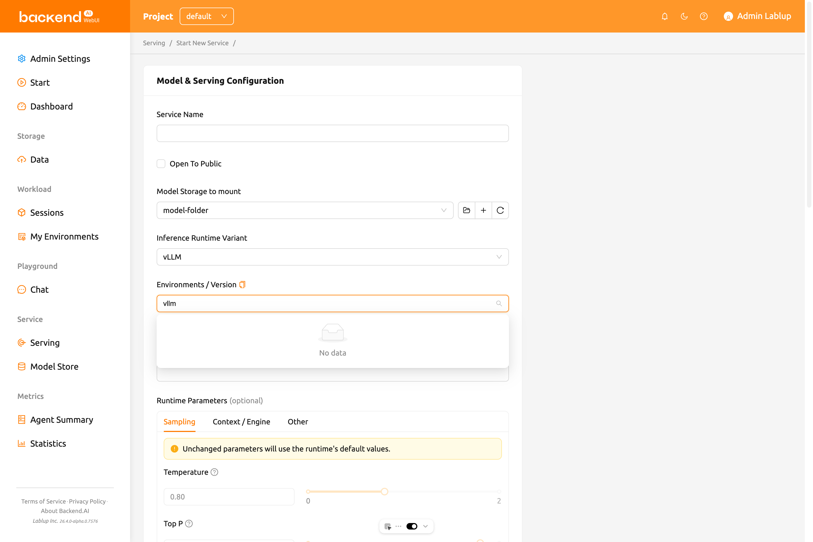

예를 들어, 모델 서비스의 런타임 변형으로 `vLLM` 또는 `NVIDIA NIM` 또는 `Predefined Image Command`를 선택하면,
마운트할 모델 폴더에 `model-definition` 파일을 구성할 필요가 없습니다. 대신 추가 환경 변수를 설정해야 할 수도 있습니다.
자세한 내용은
[Model Variant: Easily Serving Various Model Services](https://www.backend.ai/blog/2024-07-10-various-ways-of-model-serving)를 참조하세요.

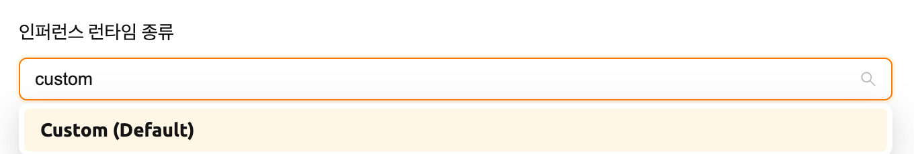

-  모델 폴더의 모델 대상: 이 옵션을 사용하면 서비스를 나타내는 라우팅에
   해당하는 세션으로 모델 스토리지 경로의 별칭 경로를 설정할 수 있습니다.
   기본값은 `/models`입니다.
-  모델 정의 파일 경로: 모델 스토리지 경로에 업로드한 모델 정의 파일을
   설정할 수도 있습니다. 기본값은 `model-definition.yaml`입니다.
-  추가 마운트: 세션과 마찬가지로, 서비스도 추가 마운트를 제공합니다.
   추가 모델 폴더가 아닌 일반/데이터 사용 모드 폴더만 마운트할 수 있다는 점에
   유의하세요.

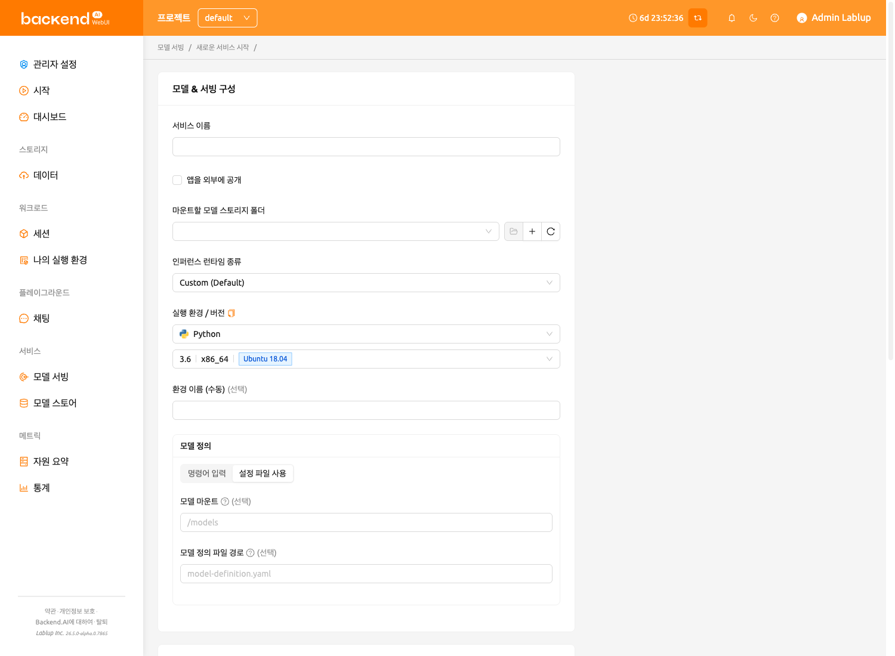

그런 다음 레플리카 수를 설정하고 환경 및 자원 그룹을 선택합니다. 자원 그룹은
모델 서비스에 할당할 수 있는 리소스의 모음입니다.

-  레플리카 수: 이 설정은 현재 서비스에 대해 유지할 라우팅 세션 수를
   결정하는 기준이 됩니다. 이 설정 값을 변경하면, 관리자는 기존 레플리카
   세션 수를 참조하여 새 레플리카 세션을 생성하거나 실행 중인 세션을
   종료할 수 있습니다.
-  환경 / 버전: 모델 서비스의 전용 서버에 대한 실행 환경을 구성할 수 있습니다.
   현재는 서비스에 여러 라우팅이 있더라도 단일 환경에서만 실행됩니다.
   (다중 실행 환경 지원은 향후 업데이트에서 추가될 예정입니다)


-  리소스 프리셋: 모델 서비스에 할당할 리소스 양을 선택할 수 있습니다.
   리소스에는 CPU, RAM 및 GPU로 알려진 AI 가속기가 포함됩니다.

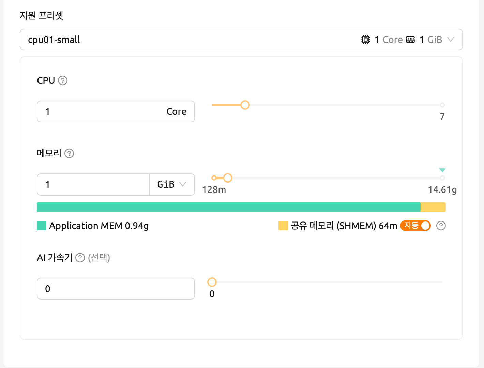

-  Single Node: 세션 실행 시, 관리 노드와 워커 노드가
   단일 물리 노드 또는 가상 머신에 배치됩니다.
-  Multi Node: 세션 실행 시, 하나의 관리 노드와 하나 이상의 워커
   노드가 여러 물리 노드 또는 가상 머신에 분산됩니다.
-  Variable: 이 섹션에서는 모델 서비스를 시작할 때 환경 변수를 설정할 수 있습니다.
   이는 런타임 변형을 사용하여 모델 서비스를 생성할 때 유용합니다. 일부 런타임 변형은
   실행 전에 특정 환경 변수 설정이 필요합니다.

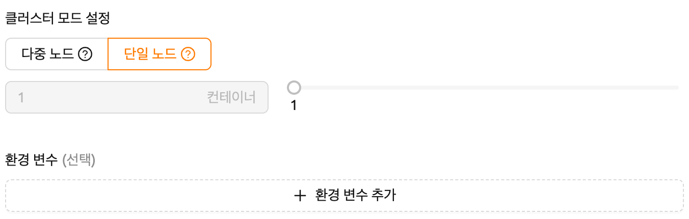

모델 서비스를 생성하기 전에, Backend.AI는 유효성 검사 기능을 지원하여
실행 가능 여부를 확인합니다(실행 중 오류로 인한).
서비스 런처의 왼쪽 하단에 있는 '유효성 검사' 버튼을 클릭하면,
유효성 검사 이벤트를 확인하는 새 팝업이 나타납니다. 팝업 모달에서
컨테이너 로그를 통해 상태를 확인할 수 있습니다. 결과가
`Finished`로 설정되면 유효성 검사가 완료된 것입니다.


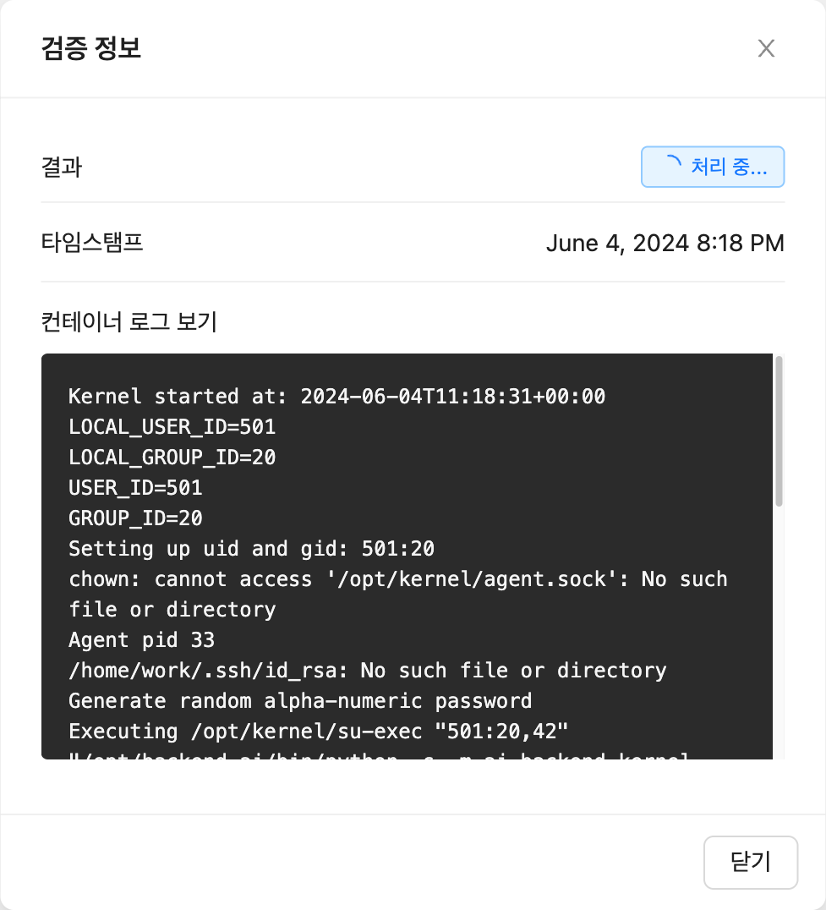


:::note
결과가 `Finished`라고 해서 실행이 성공적으로 완료되었다는 것을 보장하지는 않습니다.
대신 컨테이너 로그를 확인하세요.
:::


**실패한 모델 서비스 생성 처리**

모델 서비스의 상태가 `UNHEALTHY`로 유지되면,
모델 서비스가 제대로 실행될 수 없음을 나타냅니다.

생성 실패의 일반적인 원인과 해결 방법은 다음과
같습니다:

-  모델 서비스를 생성할 때 라우팅에 할당된 리소스가 부족함

   -  해결 방법: 문제가 있는 서비스를 종료하고 이전
      설정보다 더 충분한 리소스를 할당하여 다시 생성합니다.

-  모델 정의 파일(`model-definition.yml`)의 형식이 잘못됨

   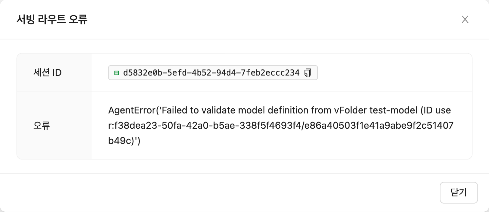

   -  해결 방법: [모델 정의 파일의 형식](#model-definition-guide)을 확인하고
      키-값 쌍이 잘못된 경우 수정한 다음 저장된 위치에 파일을 덮어씁니다.
      그런 다음 'Clear error and Retry' 버튼을 클릭하여 라우트 정보
      테이블에 쌓인 모든 오류를 제거하고 모델 서비스의 라우팅이 올바르게 설정되었는지 확인합니다.

   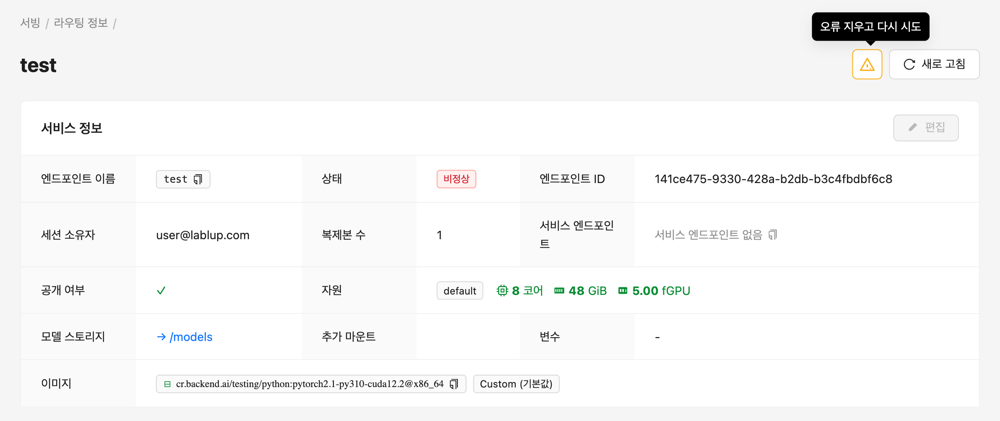


#### 자동 스케일링 규칙
모델 서비스에 대한 자동 스케일링 규칙을 구성할 수 있습니다.
정의된 규칙에 따라, 리소스를 절약하기 위해 낮은 사용량일 때 레플리카 수가 자동으로 줄어들고,
요청 지연이나 실패를 방지하기 위해 높은 사용량일 때 증가합니다.

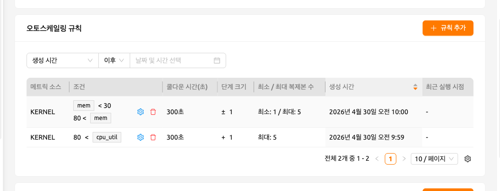

새 규칙을 추가하려면 'Add Rules' 버튼을 클릭합니다. 버튼을 클릭하면 모달이 나타나며
규칙을 추가할 수 있습니다. 모달의 각 필드는 다음과 같이 설명됩니다:

- Type: 규칙을 정의합니다. 규칙의 범위에 따라 'Scale Up' 또는 'Scale Down'을 선택합니다.

- Metric Source: 추론 프레임워크 또는 커널입니다.

   - Inference Framework: 모든 레플리카에서 가져온 평균 값입니다. AppProxy가 추론 메트릭을 보고하는 경우에만 지원됩니다.
   - Kernel: 엔드포인트를 지원하는 모든 커널에서 가져온 평균 값입니다.

- Condition: 자동 스케일링 규칙이 적용될 조건을 설정합니다.

   - Metric Name: 비교할 메트릭의 이름입니다. 런타임 환경에서 지원하는 모든 메트릭을 자유롭게 입력할 수 있습니다.
   - Comparator: 실시간 메트릭을 임계값과 비교하는 방법입니다.

      - LESS_THAN: 현재 메트릭 값이 정의된 임계값 아래로 떨어질 때 규칙이 트리거됩니다
      - LESS_THAN_OR_EQUAL: 현재 메트릭 값이 정의된 임계값 아래이거나 같을 때 규칙이 트리거됩니다
      - GREATER_THAN: 현재 메트릭 값이 정의된 임계값 위로 올라갈 때 규칙이 트리거됩니다
      - GREATER_THAN_OR_EQUAL: 현재 메트릭 값이 정의된 임계값 위이거나 같을 때 규칙이 트리거됩니다

   - Threshold: 스케일링 조건이 충족되는지 판단하기 위한 기준 값입니다.

- Step Size: 규칙이 트리거될 때 변경될 레플리카 수의 단계 크기입니다.
  양수와 음수 값으로 모두 표현할 수 있습니다.
  음수로 정의되면 규칙은 레플리카 수를 감소시킵니다.

- Max/Min Replicas: 엔드포인트의 레플리카 수에 대한 최대/최소 값을 설정합니다.
  잠재적 레플리카 수가 이 값을 초과하거나 미만이 되면 규칙이 트리거되지 않습니다.

- CoolDown Seconds: 규칙이 처음 트리거된 직후 규칙을 다시 적용하지 않을 시간(초 단위)입니다.


<a id="generating-tokens"></a>

#### 토큰 생성

모델 서비스가 성공적으로 실행되면 상태가
`HEALTHY`로 설정됩니다. 이 경우, Model Service 탭에서 해당 엔드포인트
이름을 클릭하여 모델 서비스에 대한 자세한 정보를 볼 수 있습니다.
거기서 모델 서비스의 라우팅 정보에서 서비스 엔드포인트를 확인할 수 있습니다.
서비스가 생성될 때 'Open to Public' 옵션이
활성화되면, 엔드포인트는 별도의 토큰 없이 공개적으로
액세스할 수 있으며, 엔드 유저가 액세스할 수 있습니다.
그러나 비활성화된 경우, 아래 설명된 대로 토큰을 발급하여
서비스가 제대로 실행되고 있는지 확인할 수 있습니다.

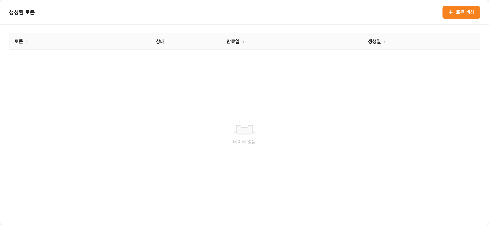

라우팅 정보의 생성된 토큰 목록 오른쪽에 있는 'Generate Token' 버튼을
클릭합니다. 토큰 생성을 위해 나타나는 모달에서
만료 날짜를 입력합니다.

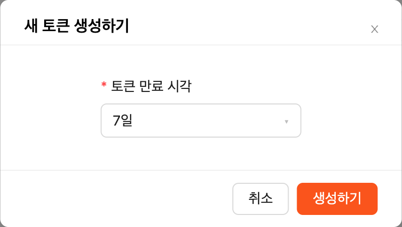

발급된 토큰은 생성된 토큰 목록에 추가됩니다. 토큰
항목에서 'copy' 버튼을 클릭하여 토큰을 복사하고, 다음 키의 값으로 추가합니다.


| Key           | Value            |
|---------------|------------------|
| Content-Type  | application/json |
| Authorization | BackendAI        |

#### 엔드 유저를 위한 모델 서비스 엔드포인트 접속

모델 서빙을 완료하려면, 실제 엔드 유저와 정보를 공유하여
모델 서비스가 실행 중인 서버에 액세스할 수 있도록 해야 합니다.
서비스가 생성될 때 Open to Public 옵션이 활성화되면,
라우팅 정보 페이지에서 서비스 엔드포인트 값을 공유할 수 있습니다.
옵션이 비활성화된 상태로 서비스가 생성된 경우,
이전에 생성된 토큰과 함께 서비스 엔드포인트 값을 공유할 수 있습니다.

다음은 모델 서빙 엔드포인트로 요청을 보내는 것이 제대로 작동하는지 확인하는
`curl` 명령을 사용한 간단한 명령입니다.


```bash
$ export API_TOKEN="<token>"
$ curl -H "Content-Type: application/json" -X GET \
  -H "Authorization: BackendAI $API_TOKEN" \
  <model-service-endpoint>
```


:::warning
기본적으로, 엔드 유저는 엔드포인트에 액세스할 수 있는
네트워크에 있어야 합니다. 서비스가 폐쇄된 네트워크에서 생성된 경우,
해당 폐쇄된 네트워크 내에서 액세스할 수 있는 엔드
유저만 서비스에 액세스할 수 있습니다.
:::

#### 대형 언어 모델 사용

대형 언어 모델(LLM) 서비스를 생성한 경우, 실시간으로 LLM을 테스트할 수 있습니다.
Service Endpoint 열에 있는 'LLM Chat Test' 버튼을 클릭하기만 하면 됩니다.


그러면, 생성한 모델이 자동으로 선택된 Chat 페이지로 리디렉션됩니다.
Chat 페이지에서 제공되는 채팅 인터페이스를 사용하여 LLM 모델을 테스트할 수 있습니다.
채팅 기능에 대한 자세한 내용은 [Chat 페이지](#chat-page)를 참조하세요.

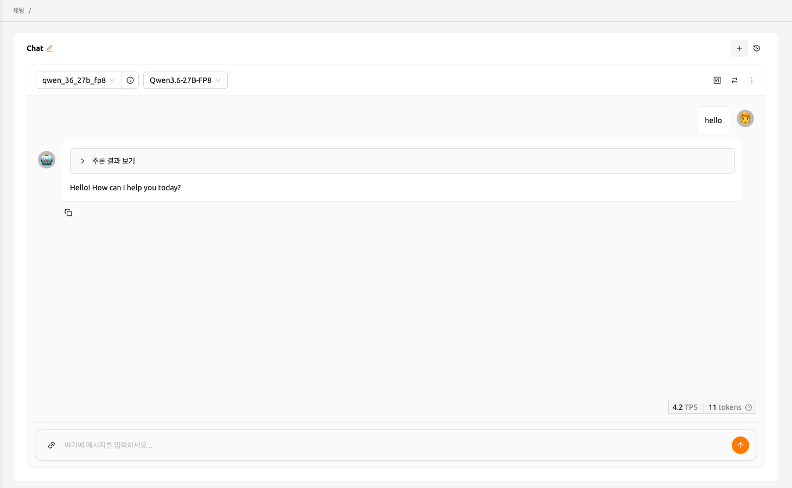

API 연결에 문제가 발생하면, Chat 페이지에 모델 설정을 수동으로 구성할 수 있는 옵션이 표시됩니다.
모델을 사용하려면 다음 정보가 필요합니다:

- baseURL (선택사항): 모델이 위치한 서버의 기본 URL입니다.
  버전 정보를 포함해야 합니다.
  예를 들어, OpenAI API를 사용할 때는 https://api.openai.com/v1을 입력해야 합니다.
- Token (선택사항): 모델 서비스에 액세스하기 위한 인증 키입니다. 토큰은
  Backend.AI뿐만 아니라 다양한 서비스에서 생성할 수 있습니다. 형식과 생성 프로세스는
  서비스에 따라 다를 수 있습니다. 자세한 내용은 항상 특정 서비스의 가이드를 참조하세요.
  예를 들어, Backend.AI에서 생성된 서비스를 사용할 때는
  토큰 생성 방법에 대한 지침은 [토큰 생성](#generating-tokens) 섹션을 참조하세요.

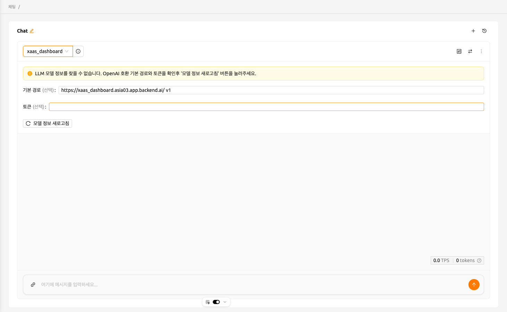

#### 모델 서비스 수정

업데이트하려는 모델 서비스를 수정하려면 Control 탭에서 렌치 아이콘을 클릭합니다.
형식은 모델 서비스 시작 모달과 동일하며,
이전에 입력한 필드가 이미 채워져 있습니다. 변경하려는
필드만 선택적으로 수정할 수 있습니다. 필드를 수정한 후 'confirm' 버튼을 클릭합니다.
변경 사항이 그에 따라 조정됩니다.

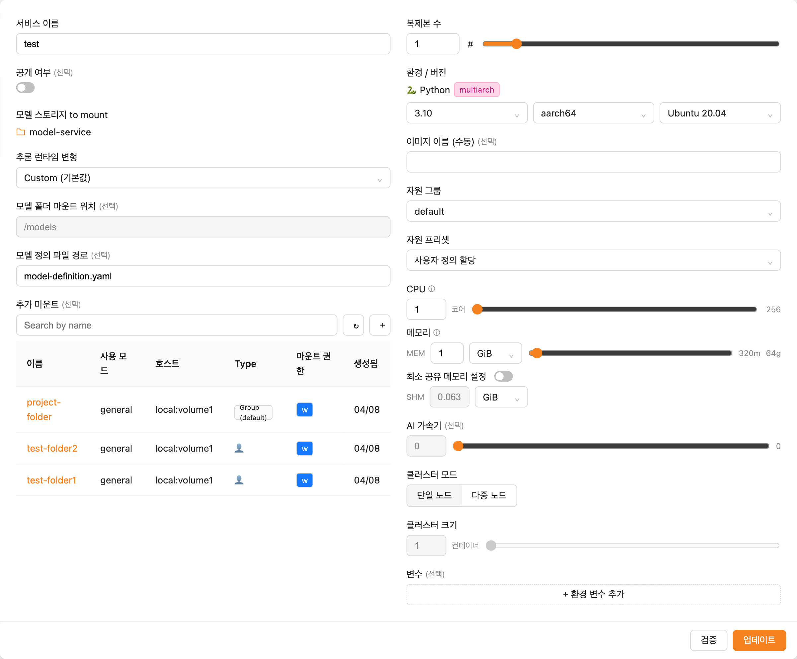

#### 모델 서비스 종료

모델 서비스는 원하는 세션 수와 일치하도록 라우팅
수를 조정하기 위해 주기적으로 스케줄러를 실행합니다. 그러나 이것은
Backend.AI 스케줄러에 부담을 줍니다. 따라서 더 이상 필요하지 않은 경우
모델 서비스를 종료하는 것이 좋습니다. 모델 서비스를 종료하려면,
Control 열에서 'trash' 버튼을 클릭합니다. 모델 서비스를 종료할지
확인하는 모달이 나타납니다. `Delete`를
클릭하면 모델 서비스가 종료됩니다. 종료된 모델 서비스는
모델 서비스 목록에서 제거됩니다.

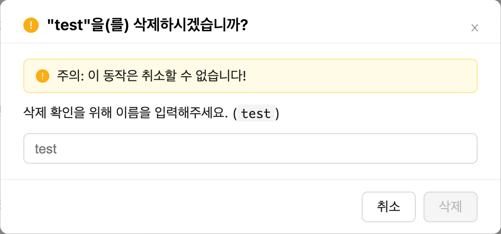