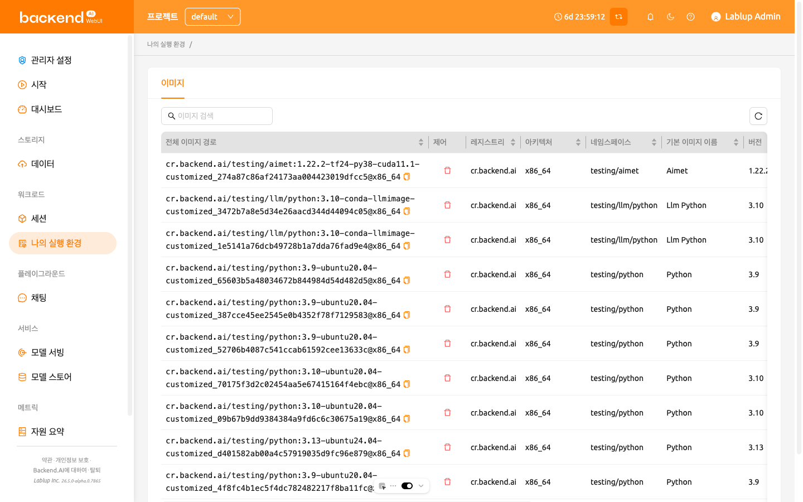
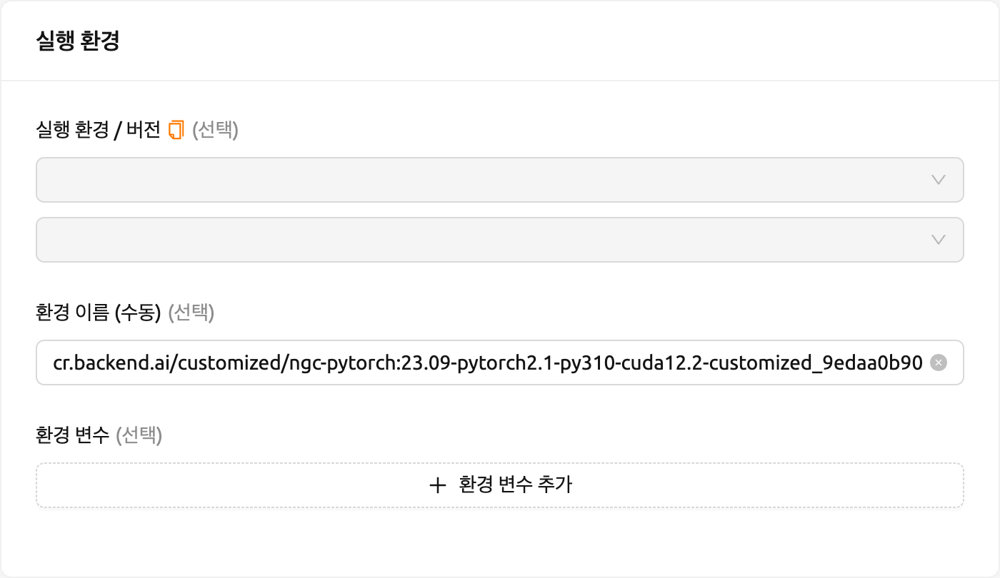
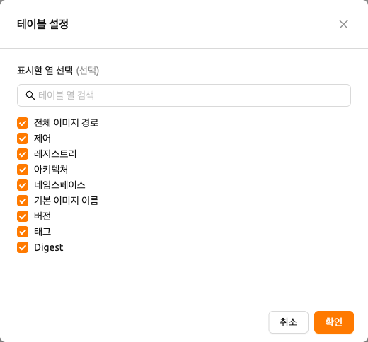

# 나의 실행 환경

24.03 버전부터 나의 실행 환경 페이지에서
[세션 커밋](#save-session-commit)을 통해 생성된
사용자 정의 이미지를 관리할 수 있습니다.

이미지 탭에서는 연산 세션으로부터 변환된 이미지를 조회하고 관리할 수 있습니다.
테이블에는 각 이미지에 대한 다음과 같은 메타데이터가 표시됩니다:

- **전체 이미지 경로**: 이미지의 전체 경로이며, 복사 아이콘을 클릭하여 클립보드에
  빠르게 복사할 수 있습니다.
- **레지스트리**: 이미지가 저장된 컨테이너 레지스트리.
- **아키텍처**: 이미지의 CPU 아키텍처.
- **네임스페이스**: 이미지가 속한 네임스페이스.
- **기본 이미지 이름**: 기본 이미지의 이름.
- **버전**: 이미지의 버전 식별자.
- **태그**: 이미지에 연결된 레이블.
- **Digest**: 이미지의 고유 콘텐츠 해시.
- **제어**: 이미지를 삭제할 수 있는 삭제 버튼이 포함되어 있습니다.

## 이미지 목록 검색 및 새로고침

테이블 상단의 검색 바에 키워드를 입력하여 이미지 목록을 필터링할 수 있습니다.
입력하는 즉시 검색어와 일치하는 이미지만 표시됩니다.

이미지 목록을 새로고침하려면 검색 바 옆의 새로고침 버튼을 클릭합니다.

## 이미지 경로 복사

전체 이미지 경로를 복사하여 수동 이미지 이름으로 세션을 생성할 수 있습니다.

1. **전체 이미지 경로** 열의 이미지 이름 옆에 있는 복사 아이콘을 클릭하여
   클립보드에 복사합니다.
2. 세션 페이지로 이동하여 새 세션 생성을 시작합니다.
3. 복사한 이미지 경로를 수동 이미지 입력 필드에 붙여넣습니다.

## 사용자 정의 이미지 삭제

이미지를 삭제하려면 **제어** 열의 빨간색 휴지통 아이콘을 클릭합니다.

:::warning
이미지 삭제는 되돌릴 수 없습니다. 삭제 후에는 해당 이미지로 새로운 세션을
생성할 수 없습니다.
:::

## 테이블 열 사용자 정의

특정 열을 숨기거나 보이게 하려면, 테이블 우측 하단의 기어 아이콘을 클릭합니다.
표시할 열을 선택할 수 있는 다이얼로그가 나타납니다.

