

# 프로젝트 관리자 기능

**프로젝트 관리자**는 특정 프로젝트에 대해 관리 권한을 부여받은 사용자입니다. 프로젝트 관리자는 시스템 전체의 슈퍼관리자 권한 없이도 자신이 관리하는 프로젝트에 속한 사용자를 확인하고, 연산 세션과 모델 배포를 관리하며, 스토리지 폴더를 운영할 수 있습니다.

## 프로젝트 관리자 권한 프로젝트 식별

헤더의 프로젝트 드롭다운을 열면 프로젝트 관리자 권한을 가진 프로젝트에는 이름 옆에 방패 모양의 배지가 표시됩니다. 배지 위에 마우스를 올리면 **프로젝트 관리자** 툴팁이 나타나며, 해당 프로젝트를 선택하면 아래에 설명된 프로젝트 관리자용 사이드바 항목들이 표시됩니다.

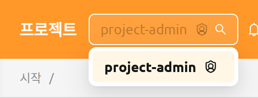

헤더의 프로젝트 선택기에서 다른 프로젝트로 전환하면 사용자의 역할이 다시 평가됩니다. 동일한 사용자가 한 로그인 세션 내에서 어떤 프로젝트에서는 프로젝트 관리자로, 다른 프로젝트에서는 일반 사용자로 동작할 수 있습니다. 프로젝트 관리자 역할을 부여하고 회수하는 방법은 RBAC 관리 장의 [프로젝트 관리자 권한 부여](#grant-project-admin) 섹션을 참고하세요.

## 프로젝트 관리자 사이드바

프로젝트 관리자 권한을 가진 프로젝트를 선택하면 사이드바의 **운영** 섹션에 해당 프로젝트를 관리하기 위한 네 개의 항목이 표시됩니다:

- **사용자** — 현재 프로젝트의 구성원
- **데이터** — 현재 프로젝트가 소유한 스토리지 폴더
- **세션** — 현재 프로젝트의 사용자들이 소유한 연산 세션
- **배포** — 현재 프로젝트가 소유한 모델 배포

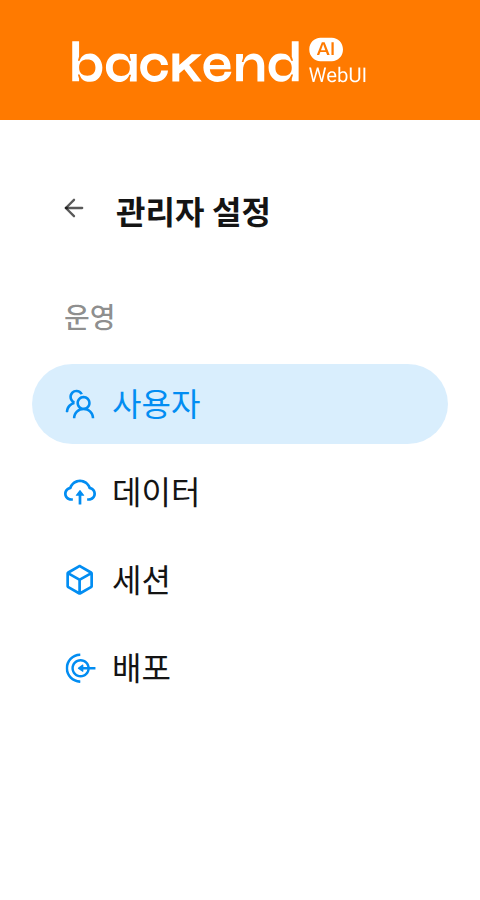

프로젝트 관리자 페이지에서는 상단의 프로젝트 선택기로 선택한 프로젝트 하위의 항목들만 표기됩니다. 이 내용은 페이지 상단의 배너를 통해 확인할 수 있습니다.

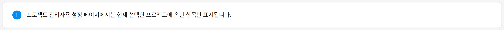

## 사용자

**사용자** 페이지에는 현재 선택된 프로젝트에 속한 모든 사용자가 표시됩니다. 이 페이지를 사용하면 프로젝트의 멤버를 한눈에 검토할 수 있습니다. 예를 들어 프로젝트 리소스에 접근 가능한 사용자를 확인하거나 비활성 계정을 식별할 수 있습니다.

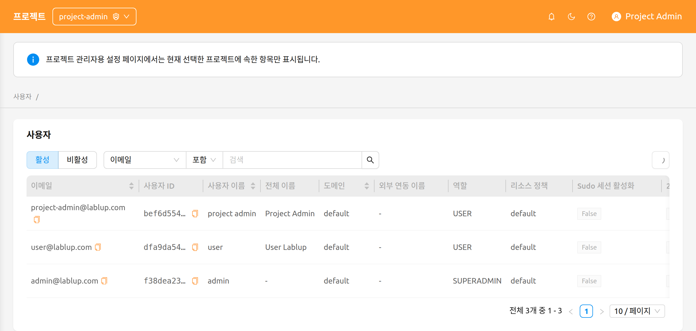

페이지는 다음 컨트롤을 제공합니다:

- **활성 / 비활성** 세그먼트 컨트롤: 활성 사용자와 비활성 사용자를 전환합니다. 기본적으로 활성이 선택되어 있습니다.
- **속성 필터**: E-Mail, ID, 사용자 이름, 역할 또는 생성일로 목록을 필터링합니다.

프로젝트 관리자에게 사용자 페이지는 **읽기 전용**입니다. 이 페이지에는 사용자 생성, 편집, 비활성화 작업이 제공되지 않으며, 해당 작업은 슈퍼관리자만 [관리자 기능](#admin-menus) 장에 설명된 시스템 전체 사용자 페이지에서 수행할 수 있습니다.

## 데이터

**데이터** 페이지에는 현재 선택된 프로젝트가 소유한 스토리지 폴더(vfolder)가 표시됩니다. 이 페이지에서 프로젝트 공유 폴더를 생성하거나, 실수로 삭제된 폴더를 복원하거나, 더 이상 보관할 필요가 없는 폴더를 영구 삭제할 수 있습니다.

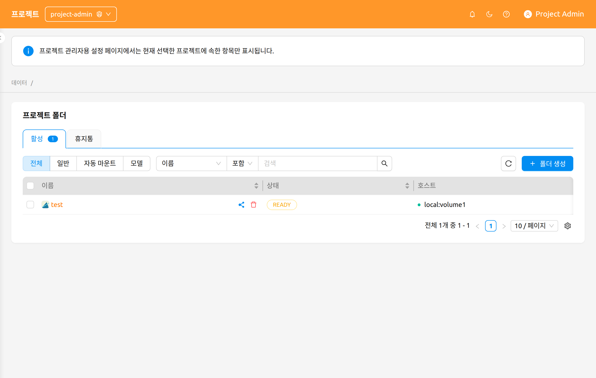

페이지는 다음 컨트롤을 제공합니다:

- **활성 / 휴지통** 탭: 현재 활성 폴더와 소프트 삭제된 폴더 사이를 전환합니다. 각 탭에는 포함된 폴더 수를 나타내는 개수 배지가 표시됩니다.
- **모드 필터**: 폴더 사용 모드별로 필터링합니다 — **전체**, **일반**, **파이프라인**, **자동 마운트**, **모델**.

   **파이프라인**과 **모델** 옵션은 배포에서 해당 기능이 활성화된 경우에만 표시됩니다 — **파이프라인**은 FastTrack 파이프라인 엔드포인트, **모델**은 모델 폴더가 활성화되어 있어야 합니다.

- **속성 필터**: 표준 스토리지 폴더 속성 필터를 사용하여 목록을 필터링합니다.

### 폴더 생성

이 페이지에서 새 폴더를 생성하려면:

1. 페이지 오른쪽 상단의 **폴더 생성** 버튼을 클릭합니다.
2. 생성 모달에서 폴더 정보를 입력합니다.
3. **확인**을 클릭하여 폴더를 생성합니다.

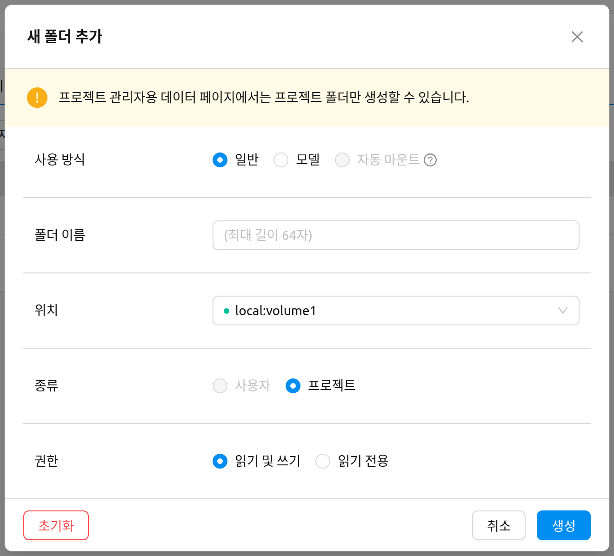

:::info
프로젝트 관리자용 데이터 페이지에서는 **프로젝트 소유** 폴더만 생성할 수 있습니다. 생성 모달에는 이를 명확히 알리는 다음 메시지가 표시됩니다:

> 프로젝트 관리자용 데이터 페이지에서는 프로젝트 폴더만 생성할 수 있습니다.
:::

폴더 사용 모드, 권한, 할당량에 대한 자세한 내용은 [스토리지 폴더](#vfolders) 장을 참고하세요.

### 폴더 복원 또는 영구 삭제

**휴지통** 탭으로 전환하면 소프트 삭제된 폴더를 확인할 수 있습니다. 행 체크박스로 하나 이상의 폴더를 선택한 다음, 선택 개수 옆에 나타나는 헤더 작업 버튼을 사용합니다:

- **복구**: 선택한 폴더를 활성 탭으로 되돌립니다.
- **영구 삭제**: 선택한 폴더를 완전히 제거합니다. 이 작업은 되돌릴 수 없으며, 확인을 위해 폴더 이름을 직접 입력해야 합니다.

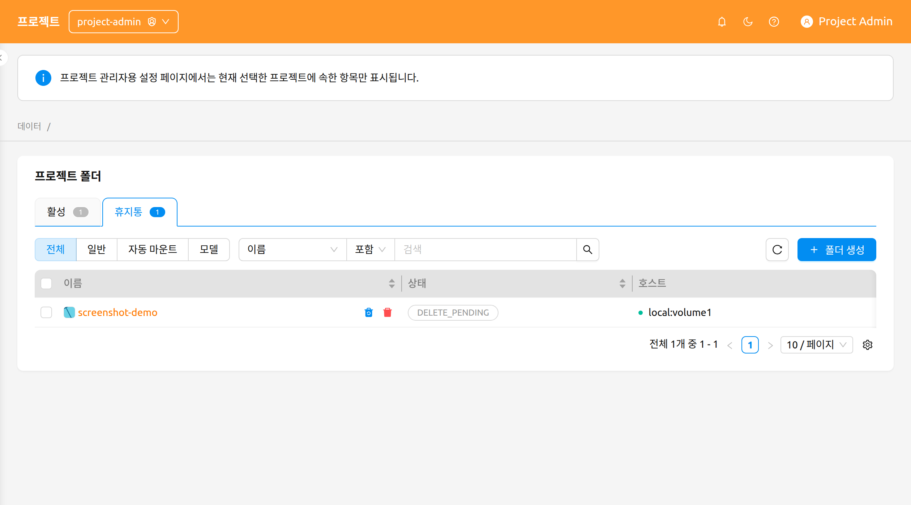

:::danger
스토리지 폴더를 영구 삭제하면 모든 콘텐츠가 제거되며 되돌릴 수 없습니다. 확인 모달에서는 삭제 버튼이 활성화되기 전에 폴더 이름을 정확히 입력해야 합니다.
:::

## 세션

**세션** 페이지에는 현재 선택된 프로젝트의 사용자들이 소유한 연산 세션이 표시됩니다. 이 페이지에서 활성 워크로드를 모니터링하거나, 장시간 실행 중인 세션을 식별하거나, 더 이상 필요하지 않은 세션을 종료할 수 있습니다.

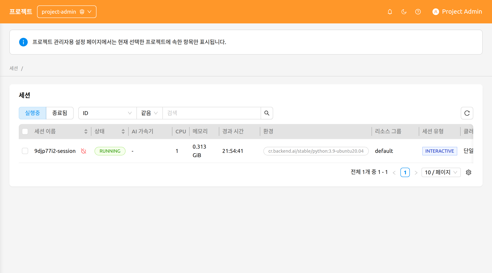

페이지는 다음 컨트롤을 제공합니다:

- **실행 중 / 종료됨** 세그먼트 컨트롤: 현재 실행 중인 세션과 이미 종료된 세션을 전환합니다.
- **속성 필터 및 정렬**: ID, 세션 이름 또는 소유자 UUID로 목록을 필터링할 수 있으며, 정렬 가능한 열 헤더를 클릭하여 테이블을 정렬할 수 있습니다.

### 세션 종료

하나 이상의 세션을 종료하려면:

1. 가장 왼쪽 열의 체크박스를 사용하여 종료할 세션을 선택합니다. 단일 세션을 종료하는 경우 세션 이름 옆의 **종료** 버튼을 활용할 수 있습니다.
2. 테이블 헤더의 전원 끄기 아이콘을 클릭하여 확인 모달을 엽니다.
3. 모달에 표시된 대상 세션 목록을 확인합니다.
4. 필요한 경우 **강제 종료** 체크박스를 선택하여 현재 상태와 상관없이 세션을 종료하거나 취소합니다. 이 옵션을 활성화하면 경고가 표시되고 확인 버튼 레이블이 **종료**에서 **강제 종료**로 변경됩니다.
5. 확인 버튼을 클릭하여 세션을 종료합니다.

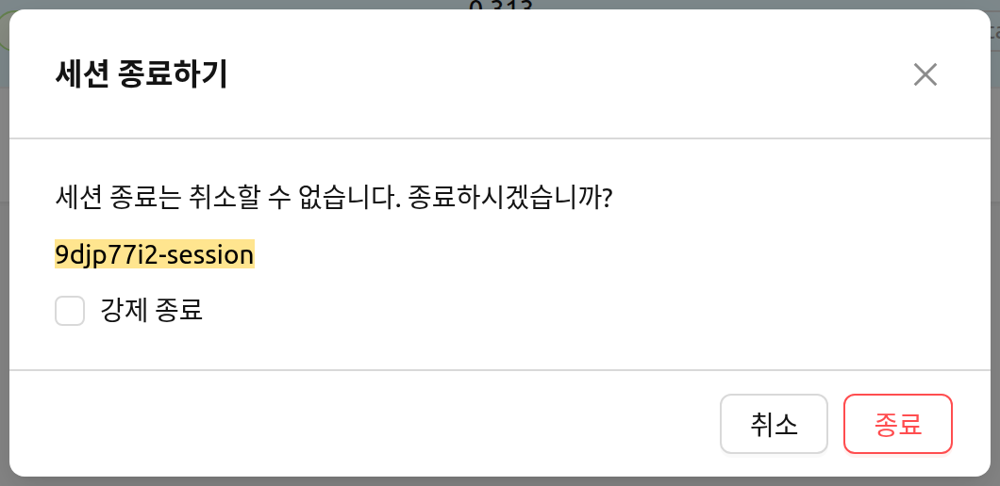

:::warning
**강제 종료**는 세션이 멈춰 있고 비정상적으로 오랫동안 상태가 변하지 않을 때만 사용하세요. 강제 종료는 연산 노드에 있는 실제 컨테이너를 삭제하지 않으므로, 이후 수동으로 컨테이너를 정리해야 할 수 있습니다.
:::

:::note
프로젝트 관리자용 세션 페이지에서는 현재 세션 이름을 클릭해도 세션 상세 패널이 열리지 않습니다. 연산 세션과 상세 보기에 대한 배경 지식은 [세션 페이지](#session-page) 장을 참고하세요.
:::

## 배포

**배포** 페이지에는 현재 선택된 프로젝트가 소유한 모델 배포가 표시됩니다. 이 페이지에서 추론 엔드포인트를 관리하거나, 배포 설정을 편집하거나, 더 이상 사용하지 않는 배포를 제거할 수 있습니다.

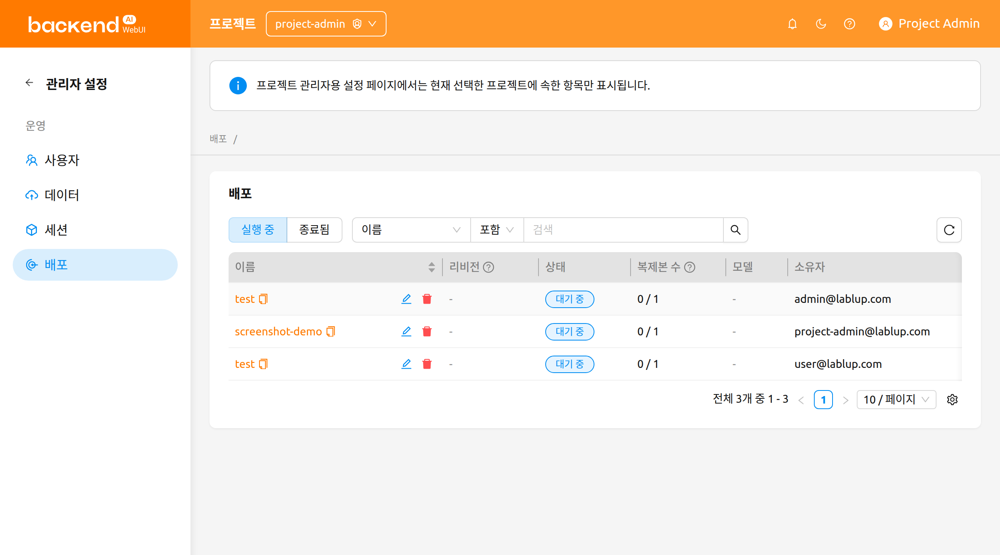

페이지는 다음 컨트롤을 제공합니다:

- **실행 중 / 종료됨** 세그먼트 컨트롤: 현재 실행 중인 배포와 종료된 배포를 전환합니다.
- **속성 필터**: 이름, 태그, 엔드포인트 URL 또는 공개 여부로 목록을 필터링합니다.

테이블에는 배포의 이름, 리비전, 상태, 복제본, 모델, 생성일, 소유자 열이 표시되며, 필요한 경우 도메인, 프로젝트, 자원 그룹 정보도 함께 표시됩니다.

**리비전** 열에는 배포의 현재 리비전이 클릭 가능한 `#N` 링크로 표시됩니다. 이 링크를 클릭하면 현재 리비전의 상세 정보를 보여 주는 패널이 열립니다.

### 배포 작업

각 배포 행에서는 다음 작업을 사용할 수 있습니다:

- **배포 이름**을 클릭하면 프로젝트 관리자 범위 내의 배포 상세 페이지로 이동합니다.
- **리비전 번호**(`#N`)를 클릭하면 현재 리비전의 상세 정보 패널이 열립니다.
- **연필 아이콘**을 클릭하면 설정 모달에서 배포 구성을 편집할 수 있습니다.
- **휴지통 아이콘**을 클릭하면 배포를 삭제할 수 있습니다. 삭제를 수행하려면 확인 모달에서 배포 이름을 직접 입력해야 합니다.

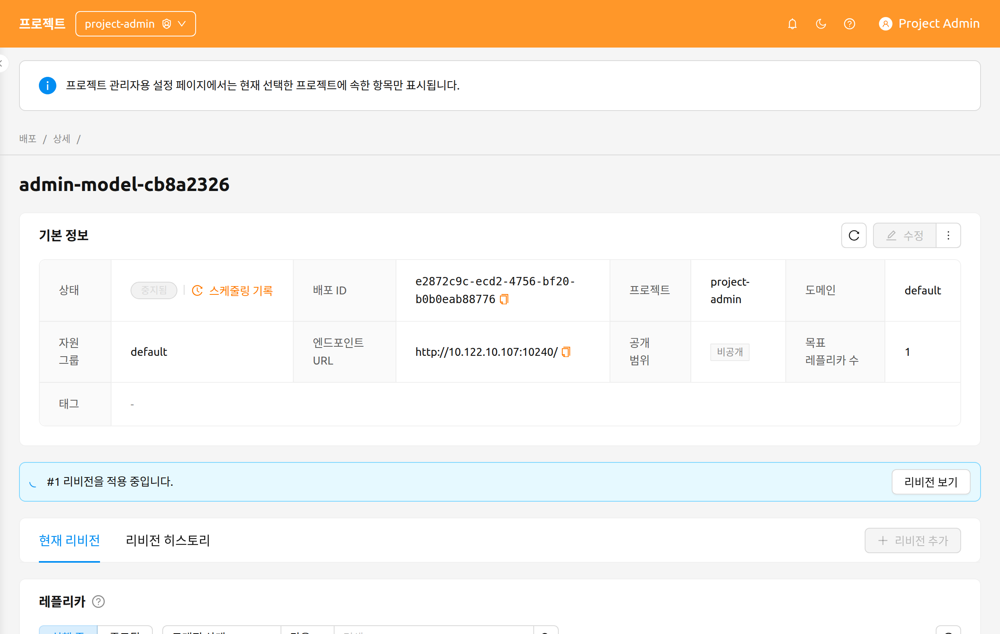

배포 리비전, 복제본, 트래픽 라우팅에 대한 자세한 내용은 [배포](#model-serving) 장을 참고하세요.
