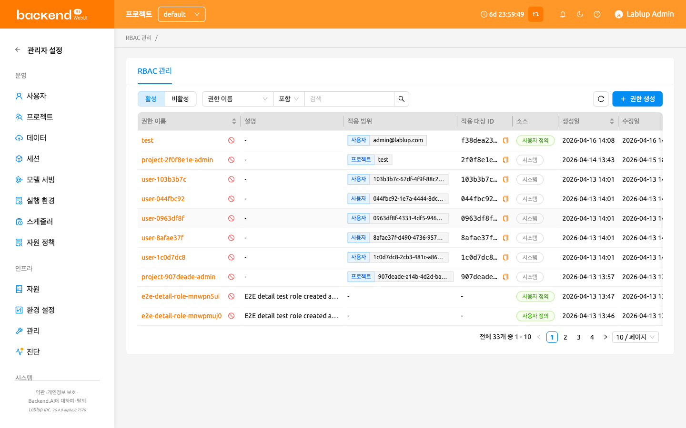
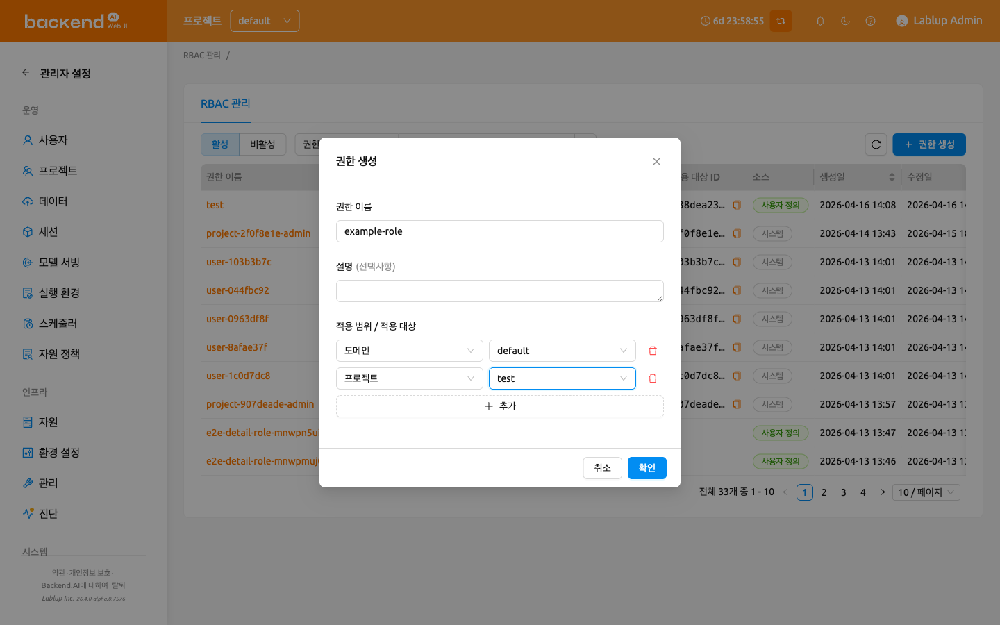
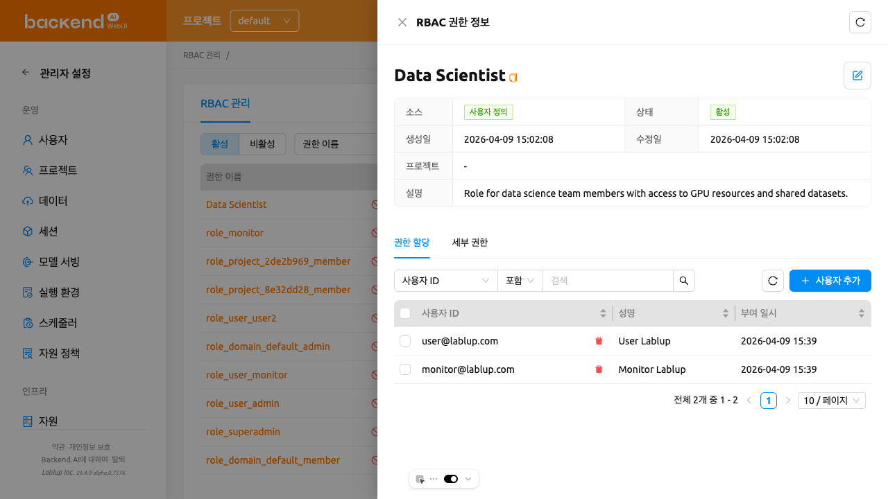
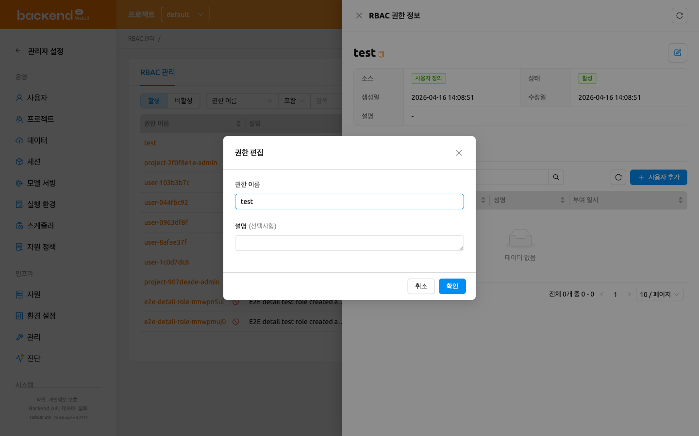
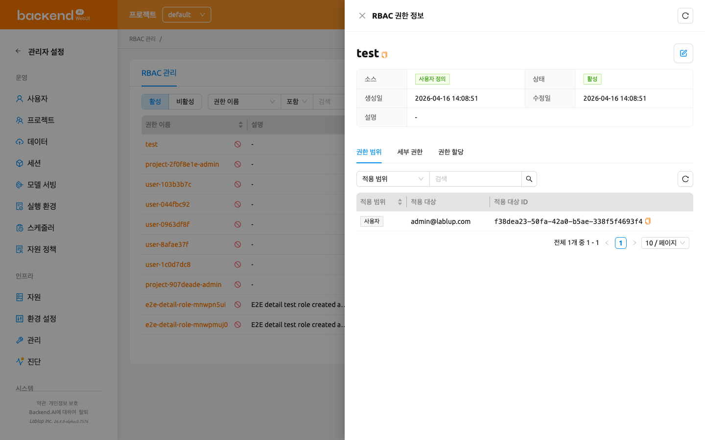
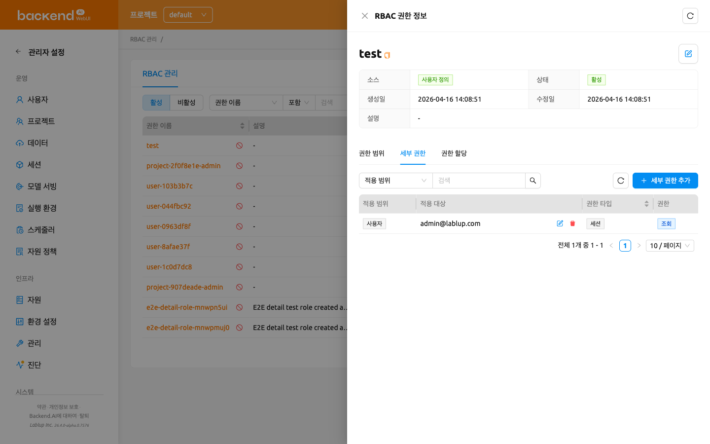
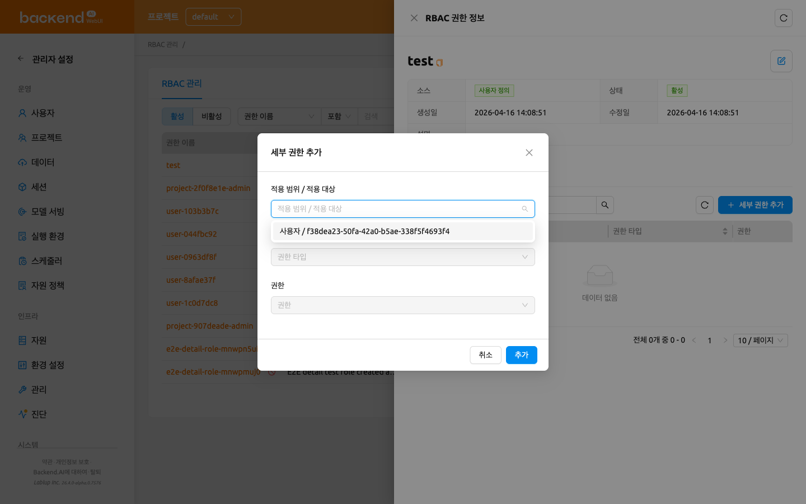
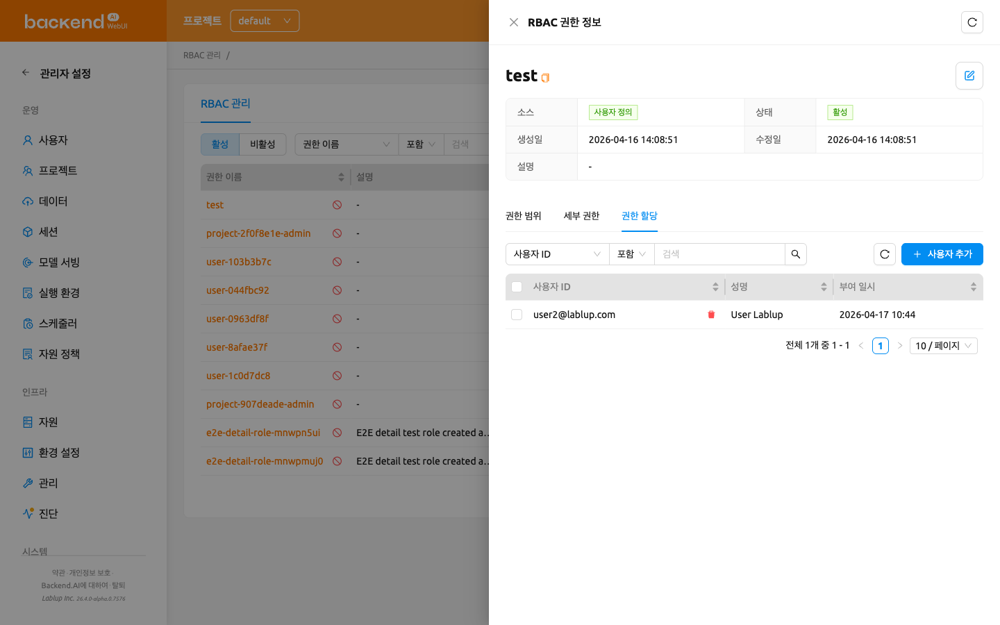
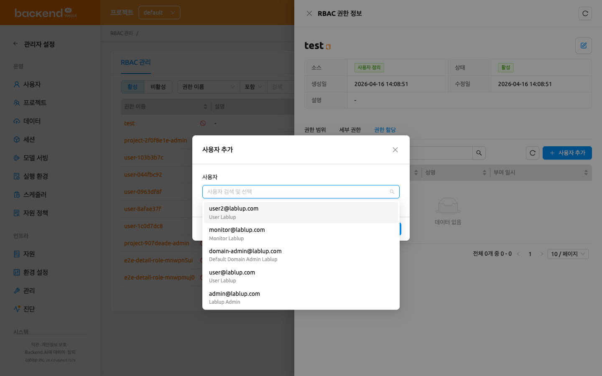
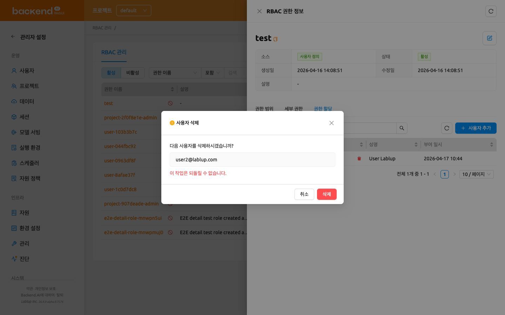

# RBAC 관리

RBAC(역할 기반 접근 제어) 관리를 통해 슈퍼관리자는 여러 세부 권한을 묶은 권한을 정의하고 사용자에게 할당할 수 있습니다. RBAC를 사용하면 Backend.AI 시스템 전반에서 특정 사용자가 다양한 리소스에 대해 수행할 수 있는 작업을 제어할 수 있습니다.

:::note
RBAC 관리는 슈퍼관리자만 사용할 수 있으며, Backend.AI Manager 25.4.0 이상 버전이 필요합니다.
:::

RBAC 관리 페이지에 접근하려면 사이드바 메뉴의 **관리자 설정** 섹션에서 **RBAC 관리**를 클릭합니다.

## 권한 목록

권한 목록 페이지는 모든 권한을 테이블 형태로 표시합니다. 페이지 상단의 컨트롤을 사용하여 권한을 필터링, 검색 및 정렬할 수 있습니다.

- **상태 필터**: **활성** 및 **비활성** 권한을 전환하는 세그먼트 컨트롤입니다. 기본적으로 활성이 선택되어 있습니다.
- **이름 검색**: 이름으로 권한을 검색하거나 소스(시스템 또는 사용자 정의)로 필터링할 수 있는 속성 필터입니다.
- **권한 생성**: 새로운 사용자 정의 권한을 생성하는 버튼입니다.

테이블에는 다음 열이 표시됩니다:

- **권한 이름**: 권한의 이름입니다. 이름을 클릭하면 권한 상세 패널이 열립니다.
- **설명**: 권한의 목적에 대한 간략한 설명입니다.
- **적용 범위**: 권한에 처음 할당된 적용 범위의 타입입니다. 권한에 여러 적용 범위가 할당된 경우 `+N` 표시가 함께 표시됩니다.
- **적용 대상 ID**: 권한에 처음 할당된 적용 범위의 원시 ID입니다. 여러 적용 범위가 할당된 경우 `+N` 표시가 함께 표시됩니다.
- **소스**: 권한이 **시스템**(사전 정의) 또는 **사용자 정의**(사용자 생성)인지 나타냅니다.
- **생성일**: 권한이 생성된 날짜와 시간입니다.
- **수정일**: 권한이 마지막으로 수정된 날짜와 시간입니다.

**권한 이름**, **생성일**, **수정일** 열 헤더를 클릭하여 테이블을 정렬할 수 있습니다.

### 시스템 권한과 사용자 정의 권한

권한은 두 가지 소스 유형으로 분류됩니다:

- **시스템**: 자동 생성되는 권한입니다. 이름이나 설명을 편집할 수 없지만, 사용자 할당 및 세부 권한을 관리할 수 있습니다.
- **사용자 정의**: 슈퍼관리자가 생성한 권한입니다. 이름, 설명, 할당, 적용 범위, 세부 권한 등 모든 항목을 편집할 수 있습니다.

## 권한 생성

권한을 생성할 때는 **적용 범위**를 먼저 정의합니다. 적용 범위는 권한을 특정 리소스 엔티티(도메인, 프로젝트, 사용자 등)에 바인딩하여, 이후 추가되는 모든 세부 권한이 여기에서 정의한 적용 범위 내에서만 작동하도록 제한합니다.

새로운 사용자 정의 권한을 생성하려면:

1. 권한 목록 페이지 오른쪽 상단의 **권한 생성** 버튼을 클릭합니다
2. 생성 모달에서 다음 필드를 입력합니다:
   - **권한 이름** (필수): 고유한 권한 이름을 입력합니다
   - **설명** (선택): 권한의 목적에 대한 설명을 입력합니다
   - **적용 범위 / 적용 대상** (필수, 최소 1개): 각 적용 범위 행에서 **적용 범위**를 선택한 후 해당 범위 내의 특정 **적용 대상**을 선택합니다. **추가** 버튼으로 적용 범위 행을 더 추가하거나 삭제 아이콘으로 행을 제거할 수 있습니다. 최소 하나의 적용 범위를 추가해야 합니다.
3. **확인**을 클릭하여 권한을 생성합니다

:::info
적용 범위는 권한 생성 시점에 정의되며, 이후 권한 상세 패널에서 수정할 수 없습니다. 권한을 생성하기 전에 적용 범위를 신중하게 계획하세요.
:::

### 적용 범위

권한 생성 시 사용할 수 있는 적용 범위는 다음과 같습니다:

- **도메인**: 활성 도메인 목록에서 선택
- **프로젝트**: 프로젝트 선택(도메인 필터링 가능)
- **사용자**: 이메일이나 이름으로 사용자 검색

## 권한 상세 보기

권한에 대한 상세 정보를 확인하려면 테이블에서 권한 이름을 클릭합니다. 페이지 오른쪽에 상세 패널이 열립니다.

패널 헤더에는 권한 이름이 표시되며, 사용자 정의 권한의 경우 **편집** 버튼이 제공됩니다. 상세 섹션에는 다음 메타데이터가 표시됩니다:

- **소스**: 시스템 또는 사용자 정의
- **상태**: 활성 또는 비활성
- **생성일**: 생성 시간
- **수정일**: 마지막 수정 시간
- **설명**: 권한의 설명

메타데이터 아래에는 **권한 범위**, **세부 권한**, **권한 할당** 세 개의 탭이 있습니다.

### 권한 편집

사용자 정의 권한의 이름이나 설명을 편집하려면:

1. 테이블에서 권한 이름을 클릭하여 상세 패널을 엽니다
2. 패널 헤더의 **편집** 버튼(연필 아이콘)을 클릭합니다
3. 편집 모달에서 **권한 이름** 및/또는 **설명**을 수정합니다
4. **확인**을 클릭하여 변경 사항을 저장합니다

:::note
편집 버튼은 사용자 정의 권한에서만 사용할 수 있습니다. 시스템 권한의 이름이나 설명은 수정할 수 없습니다. 또한 권한 생성 후에는 어느 경우에도 적용 범위를 수정할 수 없습니다.
:::

### 권한 상태 관리

권한 목록에서 관리할 수 있는 두 가지 상태가 있습니다:

- **활성**: 권한이 현재 적용 중입니다. 활성 권한을 **비활성화**하여 일시적으로 중단할 수 있습니다.
- **비활성**: 권한이 중단된 상태입니다. 비활성 권한을 **활성화**하여 복원하거나, **영구 삭제**하여 완전히 제거할 수 있습니다.

권한 목록의 각 행에는 **활성** 권한을 볼 때 **비활성화** 버튼이, **비활성** 권한을 볼 때 **활성화** 및 **영구 삭제** 버튼이 표시됩니다.

:::danger
권한 영구 삭제는 되돌릴 수 없습니다. 권한과 모든 관련 데이터가 영구적으로 제거됩니다. 영구 삭제하기 전에 권한의 모든 사용자 할당과 세부 권한을 먼저 제거해야 합니다.
:::

## 권한 범위 보기

상세 패널의 **권한 범위** 탭은 권한 생성 시에 할당된 적용 범위 항목을 나열합니다. 각 항목은 이 권한의 세부 권한이 참조할 수 있는 적용 대상 집합을 제한합니다.

테이블에는 다음 열이 표시됩니다:

- **적용 범위**: 적용 범위 항목의 타입입니다(예: 도메인, 프로젝트, 사용자).
- **적용 대상**: 적용 대상의 표시 이름입니다(예: 도메인 이름, 프로젝트 이름, 사용자 이메일).
- **적용 대상 ID**: 적용 대상의 UUID입니다.

상단의 필터 컨트롤을 사용하여 **적용 범위** 타입으로 항목을 필터링할 수 있습니다.

:::note
이 탭에서 적용 범위는 읽기 전용입니다. 권한의 적용 범위를 변경하려면 원하는 적용 범위를 가진 새 권한을 생성해야 합니다.
:::

## 세부 권한 관리

상세 패널의 **세부 권한** 탭에서 권한에 구성된 세분화된 세부 권한을 확인할 수 있습니다.

### 세부 권한 이해하기

각 세부 권한은 네 가지 구성 요소로 이루어져 있습니다:

- **적용 범위**: 세부 권한이 대상으로 하는 리소스 유형(예: 도메인, 프로젝트, 사용자)
- **적용 대상**: 적용 범위 내의 특정 엔티티(예: 특정 도메인 이름, 특정 프로젝트)
- **권한 타입**: 세부 권한이 제어하는 리소스 카테고리로, 선택한 적용 범위에 따라 필터링됩니다
- **권한**: 리소스에 허용되는 작업입니다. 선택한 권한 타입에 따라 허용되는 작업만 필터링되어 표시됩니다. 작업은 두 가지 카테고리로 그룹화됩니다:
   * **직접 수행**: 생성, 조회, 수정, 삭제, 영구 삭제
   * **타인에게 위임**: 모든 권한 위임, 조회 권한 위임, 수정 권한 위임, 삭제 권한 위임, 영구 삭제 권한 위임

:::info
각 세부 권한의 **적용 범위 / 적용 대상** 조합은 권한의 적용 범위 항목에서 상속됩니다. 세부 권한을 추가할 때는 권한 생성 시에 정의된 적용 범위 중에서만 선택할 수 있습니다. 권한의 범위를 넓히려면 적용 범위가 추가된 새 권한을 생성해야 합니다.
:::

### 세부 권한 설정 예시

다음은 네 가지 구성 요소가 어떻게 함께 작동하는지 이해하는 데 도움이 되는 일반적인 세부 권한 설정 예시입니다. **적용 범위 / 적용 대상** 열은 세부 권한이 재사용하는 권한 수준의 적용 범위를 나타냅니다.

| 시나리오                                  | 적용 범위 / 적용 대상 | 권한 타입 | 권한             |
| ----------------------------------------- | --------------------- | --------- | ---------------- |
| 특정 프로젝트에서 스토리지 폴더 생성 허용 | 프로젝트 / my-project | VFolder   | 생성             |
| 도메인 내 모든 세션 조회 허용             | 도메인 / default      | Session   | 조회             |
| 모델 서빙 엔드포인트 관리 허용            | 도메인 / default      | Endpoint  | 생성, 조회, 수정 |
| 컨테이너 이미지 삭제 허용                 | 도메인 / default      | Image     | 삭제             |

### 세부 권한 추가

1. 상세 패널을 열고 **세부 권한** 탭을 선택합니다
2. **세부 권한 추가** 버튼을 클릭합니다
3. 모달에서 다음 필드를 입력합니다:
   - **적용 범위 / 적용 대상**: 권한에 할당된 적용 범위 항목 중 하나를 선택합니다. 드롭다운에는 실제 작업을 수행할 수 있는 엔티티가 하나 이상 존재하는 적용 범위만 나열됩니다.
   - **권한 타입**: 엔티티 유형을 선택합니다. 선택한 적용 범위에 유효한 유형만 표시됩니다.
   - **권한**: 작업을 선택합니다(예: 생성, 조회, 수정, 삭제, 영구 삭제 또는 위임 작업)
4. **추가**를 클릭하여 세부 권한을 생성합니다

:::note
적용 범위 없이 생성된 권한(예: 이전 버전에서 가져온 레거시 권한)의 경우, **세부 권한 추가** 모달에는 **적용 범위**와 **적용 대상** 필드가 각각 표시되어 관리자가 세부 권한의 적용 대상을 직접 구성할 수 있습니다.
:::

### 세부 권한 삭제

1. **세부 권한** 탭에서 제거할 세부 권한 옆의 **삭제** 버튼을 클릭합니다
2. 확인 대화상자에서 삭제를 확인합니다

## 사용자 할당 관리

상세 패널의 **권한 할당** 탭에서 해당 권한에 할당된 사용자를 확인할 수 있습니다.

### 권한에 사용자 추가

1. 상세 패널을 열고 **권한 할당** 탭을 선택합니다
2. **사용자 추가** 버튼을 클릭합니다
3. 모달에서 이메일이나 이름으로 사용자를 검색합니다
4. 체크박스를 사용하여 한 명 이상의 사용자를 선택합니다
5. **추가**를 클릭하여 선택한 사용자를 권한에 할당합니다

### 권한에서 사용자 제거

1. **권한 할당** 탭에서 제거할 사용자 옆의 **삭제** 버튼을 클릭합니다
2. 확인 대화상자에서 제거를 확인합니다

