

# RBAC 관리

RBAC(역할 기반 접근 제어) 관리를 통해 슈퍼 관리자는 세분화된 세부 권한을 묶은 역할을 정의하고 사용자에게 할당할 수 있습니다. RBAC를 사용하면 Backend.AI 시스템 전반에서 특정 사용자가 다양한 리소스에 대해 수행할 수 있는 동작을 제어할 수 있습니다.

RBAC 관리 페이지에 접근하려면 사이드바 메뉴의 **관리자 설정** 섹션에서 **RBAC 관리**를 클릭합니다.

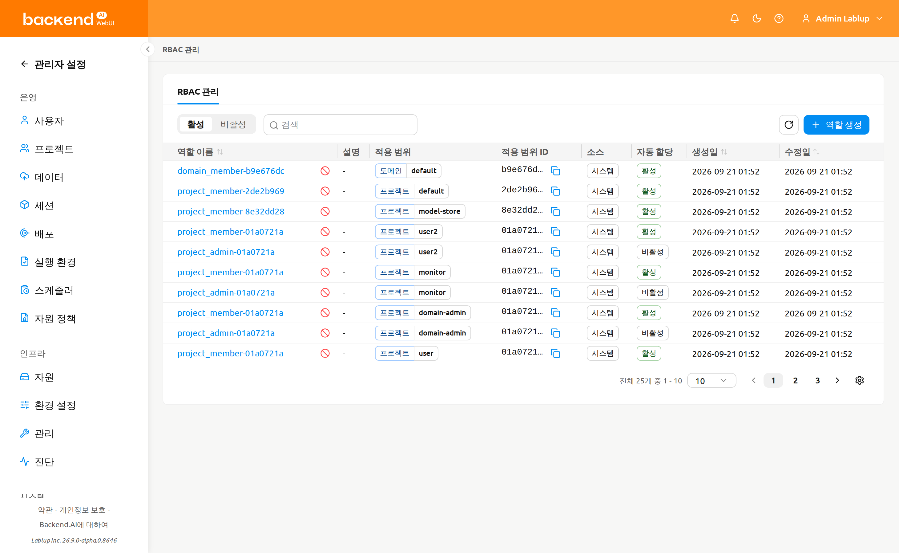

## 역할 목록

역할 목록 페이지는 모든 역할을 테이블 형태로 표시합니다. 페이지 상단의 컨트롤을 사용하여 역할을 필터링, 검색 및 정렬할 수 있습니다.

- **상태 필터**: **활성** 및 **비활성** 역할을 전환하는 세그먼트 컨트롤입니다. 기본적으로 활성이 선택되어 있습니다.
- **속성 필터**: 목록을 좁히는 속성 필터입니다. 필터 입력은 선택한 속성에 따라 달라집니다. 다음 속성을 사용할 수 있습니다:
   * **이름**: 역할 이름으로 검색하는 자유 형식 텍스트입니다.
   * **소스**: 사용 가능한 값(**시스템** / **사용자 정의**)을 자유 형식 텍스트 대신 선택형 입력으로 노출합니다.
   * **할당된 사용자**: 사용자 선택기로, 선택한 사용자에게 할당된 역할만 표시하도록 목록을 필터링합니다. 생성된 조건 태그에는 사용자의 이메일이 표시됩니다.
   * **적용 범위**: RBAC 적용 범위 타입(예: 도메인, 프로젝트, 사용자)을 나열하는 선택형 입력입니다.
   * **적용 범위 ID**: 원시 적용 범위 UUID로 검색하는 자유 형식 텍스트입니다.
- **역할 생성**: 새로운 사용자 정의 역할을 생성하는 버튼입니다.

테이블에는 다음 열이 표시됩니다:

- **역할 이름**: 역할의 이름입니다. 이름을 클릭하면 역할 상세 패널이 열립니다.
- **설명**: 역할의 목적에 대한 간략한 설명입니다.
- **적용 범위**: 역할에 처음 할당된 적용 범위의 타입입니다. 역할에 여러 적용 범위가 할당된 경우 `+N` 표시가 함께 표시됩니다.
- **적용 대상 ID**: 역할에 처음 할당된 적용 범위의 원시 ID입니다. 여러 적용 범위가 할당된 경우 `+N` 표시가 함께 표시됩니다.
- **소스**: 역할이 **시스템**(사전 정의) 또는 **사용자 정의**(사용자 생성)인지 나타냅니다.
- **자동 할당**: 역할이 등록된 적용 범위에 사용자가 추가될 때 자동으로 역할이 할당되는지 여부를 나타냅니다. 자동 할당이 활성화된 경우 **활성**, 비활성화된 경우 **비활성**으로 표시됩니다.
- **생성일**: 역할이 생성된 날짜와 시간입니다.
- **수정일**: 역할이 마지막으로 수정된 날짜와 시간입니다.

### 시스템 역할과 사용자 정의 역할

역할은 두 가지 소스 유형으로 분류됩니다:

- **시스템**: 자동 생성되는 역할입니다. 이름이나 설명을 편집할 수 없지만, 사용자 할당 및 세부 권한을 관리할 수 있습니다.
- **사용자 정의**: 슈퍼 관리자가 생성한 역할입니다. 이름, 설명, 할당, 적용 범위, 세부 권한 등 모든 항목을 편집할 수 있습니다.

## 역할 생성

역할을 생성할 때는 **적용 범위**를 먼저 정의합니다. 적용 범위는 역할을 특정 리소스 엔티티(도메인, 프로젝트, 사용자 등)에 바인딩하여, 이후 추가되는 모든 세부 권한이 여기에서 정의한 적용 범위 내에서만 작동하도록 제한합니다.

새로운 사용자 정의 역할을 생성하려면:

1. 역할 목록 페이지 오른쪽 상단의 **역할 생성** 버튼을 클릭합니다
2. 생성 모달에서 다음 필드를 입력합니다:
   - **역할 이름** (필수): 고유한 역할 이름을 입력합니다
   - **설명** (선택): 역할의 목적에 대한 설명을 입력합니다
   - **자동 할당** (선택): 활성화하면 역할이 등록된 적용 범위에 사용자가 추가될 때 자동으로 역할이 부여됩니다. 기본적으로 비활성화되어 있습니다.
   - **적용 범위 / 적용 대상** (필수, 최소 1개): 각 적용 범위 행에서 **적용 범위**를 선택한 후 해당 범위 내의 특정 **적용 대상**을 선택합니다. **추가** 버튼으로 적용 범위 행을 더 추가하거나 삭제 아이콘으로 행을 제거할 수 있습니다. 최소 하나의 적용 범위를 추가해야 합니다.
3. **확인**을 클릭하여 역할을 생성합니다

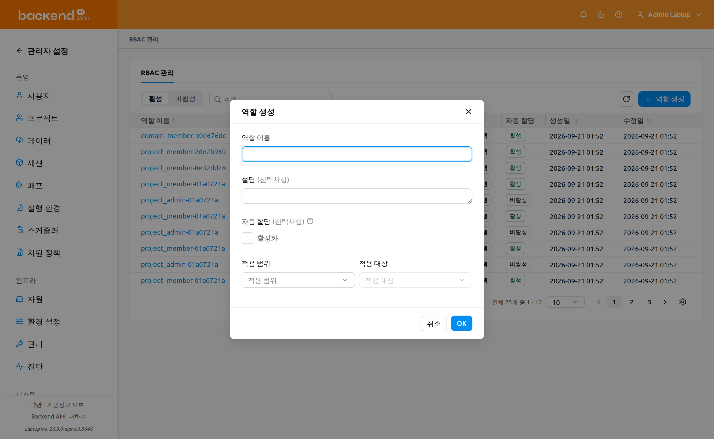

:::info
역할 생성 시점에 설정하는 **적용 범위**와 **적용 대상**은 그 자체로 어떤 권한을 부여하지 않습니다. 대신 이후 이 역할에 [세부 권한](#manage-permissions)을 추가할 때 선택할 수 있는 **적용 범위 / 적용 대상**의 후보를 미리 정의하는 역할을 합니다. 즉, 역할 생성 단계에서는 이 역할의 세부 권한이 가질 수 있는 적용 범위와 적용 대상의 범주를 미리 한정하는 것이며, 세부 권한은 여기에서 정의한 적용 범위와 적용 대상 안에서만 설정할 수 있습니다.
:::

:::warning
적용 범위는 역할 생성 시점에 정의되며 이후 역할 상세 패널에서 수정할 수 없습니다. 역할을 생성하기 전에 적용 범위를 신중하게 계획하세요.
:::

## 역할 상세 보기

역할에 대한 상세 정보를 확인하려면 테이블에서 역할 이름을 클릭합니다. 페이지 오른쪽에 상세 패널이 열립니다.

패널 헤더에는 역할 이름이 표시되며 사용자 정의 역할의 경우 **편집** 버튼이 제공됩니다. 상세 섹션에는 다음 메타데이터가 표시됩니다:

- **소스**: 시스템 또는 사용자 정의
- **상태**: 활성 또는 비활성
- **자동 할당**: 자동 할당이 활성 또는 비활성 여부를 나타냅니다. 활성 상태이면 역할이 등록된 적용 범위 중 하나에 사용자가 추가될 때 자동으로 역할이 부여됩니다.
- **생성일**: 생성 시간
- **수정일**: 마지막 수정 시간
- **설명**: 역할의 설명

메타데이터 아래에는 **권한**과 **역할 할당** 두 개의 탭이 있습니다. 기본적으로 **권한** 탭이 선택되어 있습니다.

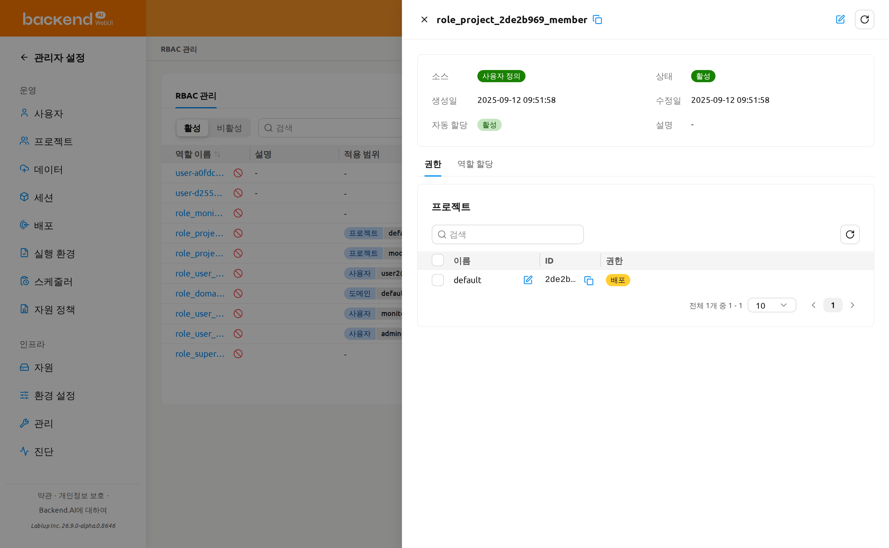

### 역할 편집

사용자 정의 역할의 이름, 설명 또는 자동 할당 설정을 편집하려면:

1. 테이블에서 역할 이름을 클릭하여 상세 패널을 엽니다
2. 패널 헤더의 **편집** 버튼(연필 아이콘)을 클릭합니다
3. 편집 모달에서 다음 필드를 수정합니다:
   - **역할 이름**: 역할의 이름
   - **설명**: 역할의 목적에 대한 설명
   - **자동 할당**: 활성화하면 역할이 등록된 적용 범위에 사용자가 추가될 때 자동으로 역할이 부여됩니다.
4. **확인**을 클릭하여 변경 사항을 저장합니다

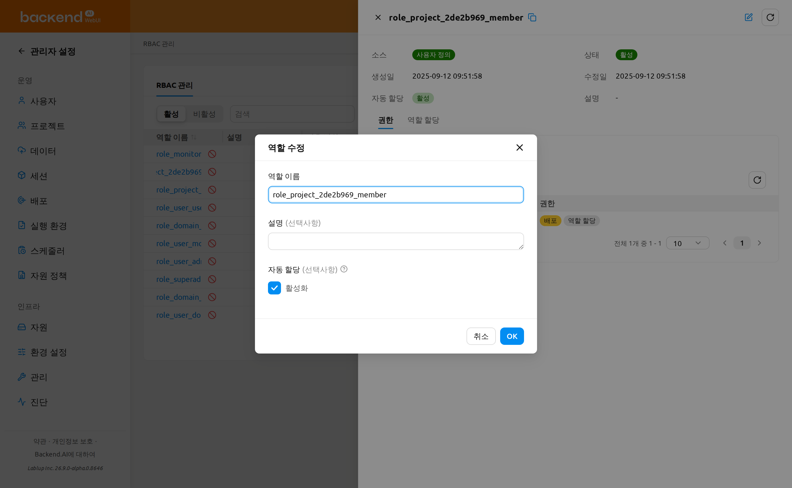

:::note
편집 버튼은 사용자 정의 역할에서만 사용할 수 있습니다. 시스템 역할의 이름이나 설명은 수정할 수 없습니다. 또한 역할 생성 후에는 어느 경우에도 적용 범위를 수정할 수 없습니다.
:::

## 세부 권한 관리

역할 상세 패널의 **권한** 탭은 역할의 적용 범위와 세분화된 세부 권한을 결합한 통합 상세 보기입니다. 역할이 사용하는 **적용 범위 타입마다 하나의 카드**를 렌더링하며 각 카드는 해당 적용 범위 타입의 적용 범위와 그 위에 부여된 권한을 함께 표시합니다.

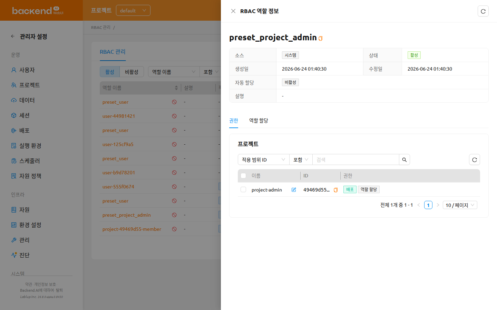

:::info
역할이 참조할 수 있는 적용 범위는 역할 생성 시에 정의되며 이후에는 **읽기 전용**입니다. 역할 상세 패널에서 변경할 수 없습니다. 권한 탭에서는 적용 범위가 각 적용 범위 타입 카드 내부의 행으로 나타납니다. 역할의 적용 범위를 변경하려면 원하는 적용 범위를 가진 새 역할을 생성해야 합니다.
:::

### 적용 범위 타입 카드

권한 탭에는 역할이 사용하는 적용 범위 타입(예: 도메인, 프로젝트, 사용자)마다 하나의 카드가 표시됩니다. 역할이 사용하지 않는 적용 범위 타입은 숨겨지며 카드 제목은 현지화된 적용 범위 타입 이름입니다. 각 카드는 다음을 포함합니다:

- **적용 범위 ID 필터**: 원시 적용 범위 UUID로 카드의 행을 좁히는 속성 필터입니다. 현지화된 적용 범위 이름으로는 검색할 수 없습니다.
- **새로 고침** 버튼: 카드의 행을 다시 불러오고 권한 태그를 다시 계산합니다.
- **적용 범위 테이블**: 이 타입에 속하는 역할의 적용 범위를 다음 열과 함께 나열합니다:
   * **이름**: 현지화된 적용 범위 이름(예: 도메인, 프로젝트 또는 사용자의 표시 이름)이며, 해당 적용 범위에 대한 권한 편집 모달을 여는 인라인 **편집** 동작이 함께 표시됩니다.
   * **ID**: 적용 범위 UUID입니다.
   * **권한**: 권한 타입마다 하나의 태그가 부여 상태에 따라 색상으로 표시됩니다(아래 참조). 적용 범위 타입에 설정 가능한 엔티티가 없으면 이 열은 `-`로 표시됩니다.
- **페이지네이션**: 적용 범위가 많을 때 카드의 적용 범위를 페이지로 나눕니다.

역할에 적용 범위가 전혀 없으면 탭에는 카드 대신 **역할이 적용될 범위가 설정되지 않았습니다** 메시지가 표시됩니다.

### 부여 상태 태그

**권한** 열에서 각 권한 타입 태그는 해당 적용 범위에 대해 그 타입의 동작이 얼마나 부여되었는지에 따라 색상으로 표시됩니다:

- **모두 허용됨**(초록색): 해당 권한 타입의 모든 동작이 부여되었습니다.
- **일부 허용됨**(노란색): 일부 동작만 부여되었고 전부는 아닙니다.
- **허용되지 않음**(색상 없음): 어떤 동작도 부여되지 않았습니다.

태그 위에 마우스를 올리면 상태 라벨을 확인할 수 있습니다.

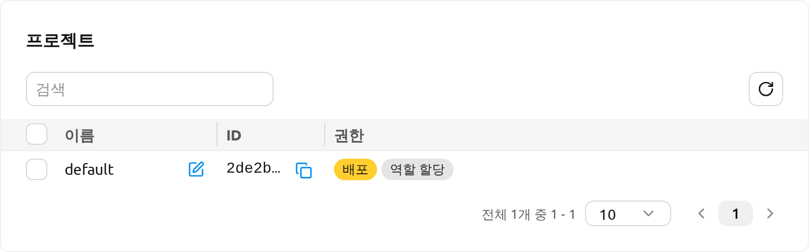

### 세부 권한 이해하기

각 세부 권한은 네 가지 구성 요소로 이루어져 있습니다:

- **적용 범위**: 세부 권한이 적용될 유효 범위(예: 도메인, 프로젝트, 사용자)
- **적용 대상**: 유효 범위 내의 특정 엔티티(예: 특정 도메인 이름, 특정 프로젝트)
- **권한 타입**: 권한의 적용 유효 범위 안에서 동작이 수행되는 대상입니다.
- **동작**: 권한 타입에 허용되는 동작입니다. 선택한 권한 타입에 따라 허용되는 동작만 필터링되어 표시됩니다. 동작은 두 가지 카테고리로 그룹화됩니다:
   * **직접 수행**: 생성, 조회, 수정, 삭제, 영구 삭제
   * **타인에게 위임**: 모든 권한 위임, 조회 권한 위임, 수정 권한 위임, 삭제 권한 위임, 영구 삭제 권한 위임

:::info
각 세부 권한의 **적용 범위 / 적용 대상** 조합은 역할의 적용 범위 항목에서 상속됩니다. 역할 생성 시에 정의된 적용 범위에 대해서만 세부 권한을 부여할 수 있습니다. 역할의 범위를 넓히려면 적용 범위가 추가된 새 역할을 생성해야 합니다.
:::

### 세부 권한 설정 예시

다음은 네 가지 구성 요소가 어떻게 함께 작동하는지 이해하는 데 도움이 되는 일반적인 세부 권한 설정 예시입니다. **적용 범위 / 적용 대상** 열은 세부 권한이 재사용하는 역할 수준의 적용 범위를 나타냅니다.

| 시나리오 | 적용 범위 / 적용 대상 | 권한 타입 | 동작 |
|----------|---------------------|----------|------|
| 특정 프로젝트에서 스토리지 폴더 생성 허용 | 프로젝트 / my-project | 폴더 | 생성 |
| 특정 도메인 내 모든 세션 조회 허용 | 도메인 / default | 세션 | 조회 |
| 특정 도메인 내 모델 서비스 관리 허용 | 도메인 / default | 모델 서비스 | 생성, 조회, 수정 |
| 특정 도메인 내 컨테이너 이미지 삭제 허용 | 도메인 / default | 이미지 | 삭제 |

### 적용 범위 권한 수정(단일 적용 범위)

세부 권한은 각 행이 권한 타입이고 각 셀이 동작 체크박스인 그리드 기반 모달을 통해 적용 범위별로 수정합니다.

1. **권한** 탭에서 적용 범위 타입 카드를 열고 변경할 적용 범위 행의 **편집** 동작을 클릭합니다.
2. **{적용 범위 타입} 권한 수정** 모달이 열리며, 적용 범위 이름이 부제로 표시됩니다. 다음과 같은 그리드가 표시됩니다:
   - 행은 적용 범위 타입에 유효한 **권한 타입**입니다.
   - 열은 **직접 수행**(생성, 조회, 수정, 삭제, 영구 삭제)과 **타인에게 위임**(모두, 조회, 수정, 삭제, 영구 삭제) 그룹으로 나뉩니다.
   - 권한 매트릭스가 지원하지 않는 셀은 `-`로 표시되며 **해당 권한은 할당이 불가능합니다.** 툴팁이 나타납니다.
3. 각 체크박스는 적용 범위에 현재 부여된 동작에 맞춰 **미리 선택**되어 있습니다. 셀을 선택하거나 해제하여 허용 항목을 변경합니다.
4. **저장**을 클릭합니다. 변경 사항은 적용 범위의 현재 부여 상태와 대조되어 새로 선택한 셀은 부여되고 해제한 셀은 제거됩니다.

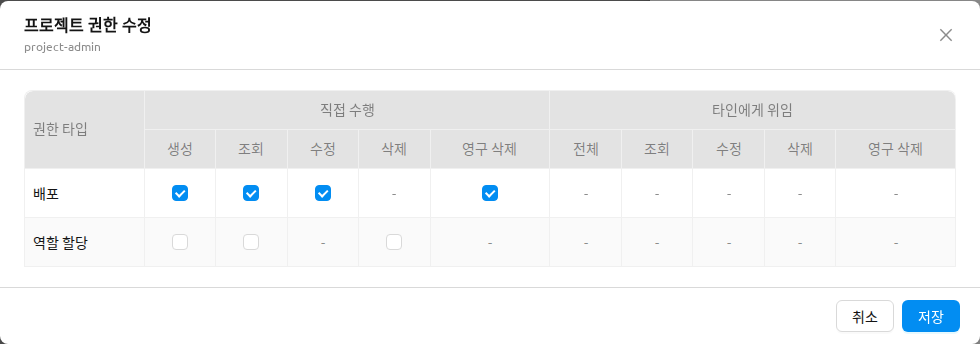

:::note
세부 권한 수정은 **되돌릴 수 있는** 작업입니다. 언제든지 모달을 다시 열어 그리드를 변경할 수 있으므로, 저장 시 이름을 입력해 확인하는 대신 일반 **저장** 버튼을 사용합니다.
:::

### 여러 적용 범위 권한 수정(일괄)

같은 타입의 여러 적용 범위에 동일한 권한 변경을 한 번에 적용할 수 있습니다.

1. 적용 범위 타입 카드에서 행 체크박스를 사용하여 **두 개 이상**의 적용 범위를 선택합니다. 선택 개수 라벨이 나타나면 그 옆의 연필(**권한 수정**) 컨트롤을 사용하여 일괄 모달을 엽니다.
2. **{적용 범위 타입} 권한 일괄 수정** 모달이 열립니다. 모든 셀은 **유지** 상태로 시작합니다. 건드리지 않은 셀은 선택한 각 적용 범위의 기존 값을 그대로 유지하며, 편집 모드로 전환한 셀만 선택한 **모든** 적용 범위에 적용됩니다.
3. 셀을 클릭하여 편집 모드로 전환합니다(선택된 상태로 시작). 선택하거나 해제하여 모든 선택된 적용 범위에 적용할 값을 설정합니다.
4. **저장**을 클릭하여 선택한 모든 적용 범위에 변경 사항을 적용합니다.

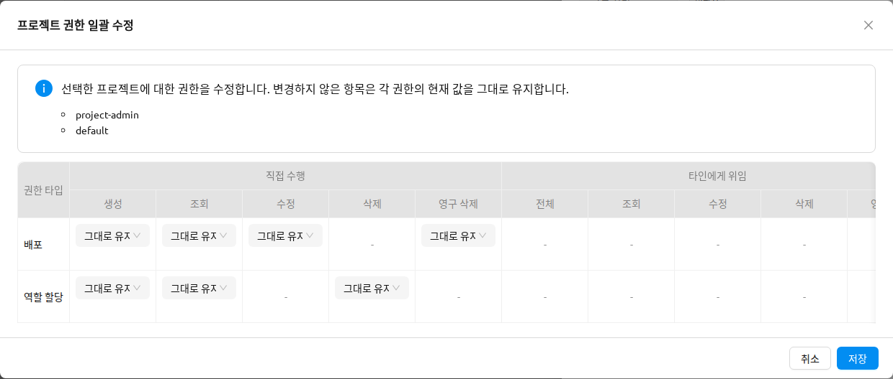

### 변경 없음 및 부분 실패 동작

권한 변경을 저장할 때:

- 변경 사항이 없으면 모달은 요청을 보내지 않고 닫히며 **변경사항이 없습니다.** 메시지가 표시됩니다.
- 성공하면 **세부 권한이 저장되었습니다.** 메시지가 표시되고 카드의 태그가 다시 계산됩니다.
- **부분 실패** 시에는 모달이 열린 상태로 유지되고 실패한 셀이 표시됩니다. 일괄 오류 모달에 실패한 각 요청(대상 적용 범위, 권한, 오류 메시지)과 성공 및 실패 개수가 나열됩니다. 그리드를 조정한 후 다시 저장하면 실패한 셀만 재시도할 수 있습니다.

<!--  -->
<!-- TODO: Capture the bulk-error modal shown after a partial-failure permission save -->

## 사용자 할당 관리

상세 패널의 **역할 할당** 탭에서 해당 역할에 할당된 사용자를 확인할 수 있습니다.

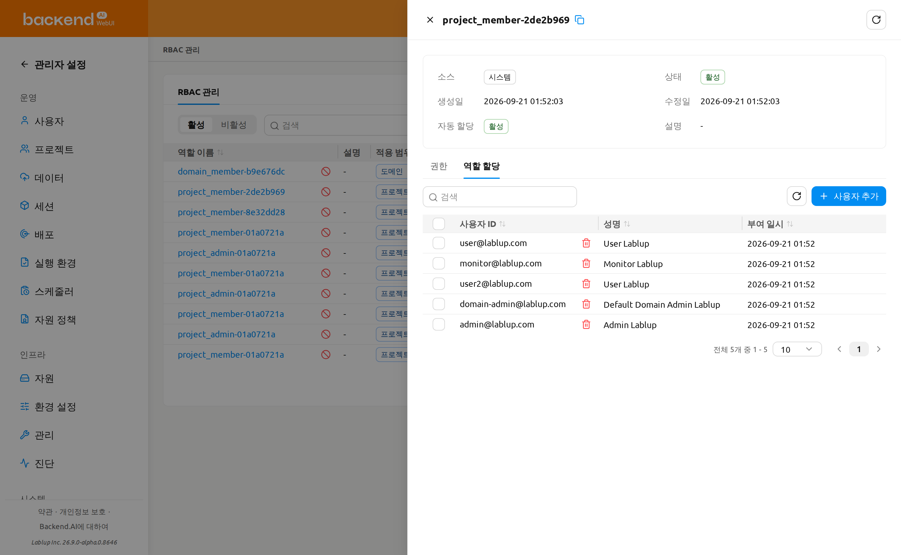

### 역할에 사용자 추가

1. 상세 패널을 열고 **역할 할당** 탭을 선택합니다
2. **사용자 추가** 버튼을 클릭합니다
3. 모달에서 이메일이나 이름으로 사용자를 검색합니다
4. 체크박스를 사용하여 한 명 이상의 사용자를 선택합니다
5. **추가**를 클릭하여 선택한 사용자를 역할에 할당합니다

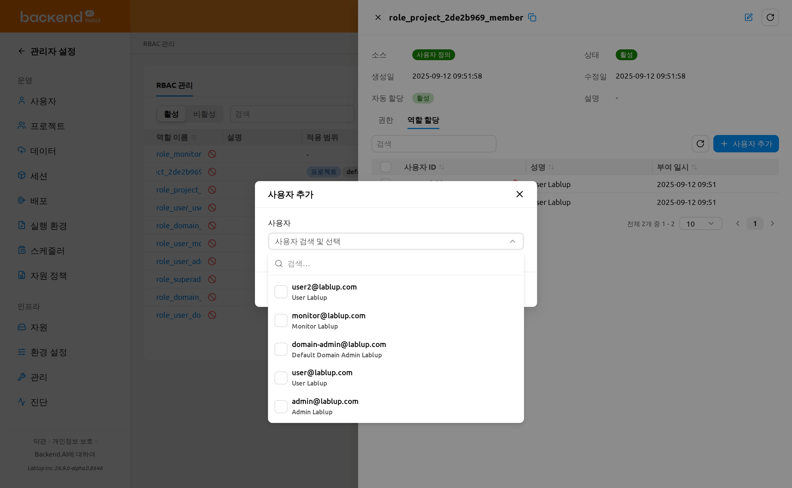

사용자 추가는 일괄 작업입니다. 한 번에 여러 사용자를 선택하여 모두 한꺼번에 할당할 수 있습니다. 일부 할당이 실패하면 모달이 열린 상태로 유지되며 일괄 오류 모달에 실패한 각 사용자와 오류 메시지, 성공 및 실패 개수가 나열됩니다. 성공적으로 할당된 사용자는 선택에서 지워지므로 실패한 사용자만 선택된 상태로 남아 **추가**를 다시 클릭하여 해당 사용자만 재시도할 수 있습니다.

<!--  -->
<!-- TODO: Capture the Add User modal with the bulk-error modal listing failed assignments -->

### 시스템 역할과 할당 제한

시스템이 생성한 프로젝트 관리자 역할(**소스**가 **시스템**인 `role_project_<project_id>_admin` 역할)에는 역할 할당 탭에서 사용자를 직접 할당하거나 해제할 수 없습니다. 이 탭에는 **시스템에 의해 자동으로 생성된 역할은 사용자를 직접 할당하거나 할당 해제할 수 없습니다.** 경고 알림이 표시되며 할당 테이블은 읽기 전용입니다(**사용자 추가** 및 해제 컨트롤이 숨겨집니다).

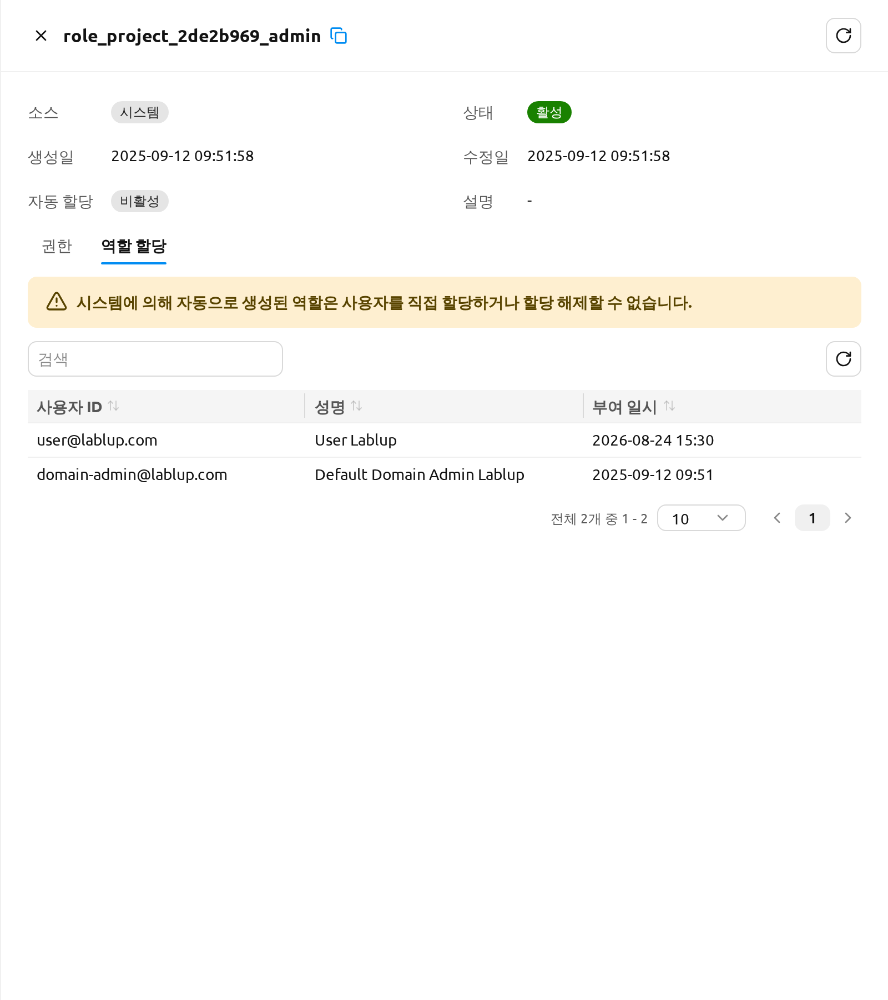

프로젝트를 관리할 사용자를 지정하려면 대신 프로젝트 페이지의 **프로젝트 관리자 권한 설정**을 사용하세요. 프로젝트 관리자 기능 챕터의 [프로젝트 관리자 권한 설정](#set-project-admin)과 아래의 [프로젝트 관리자 권한 부여](#grant-project-admin)를 참고하세요.

### 역할에서 사용자 해제

한 명의 사용자를 해제하거나 여러 명의 사용자를 한 번에 해제할 수 있습니다.

한 명의 사용자를 해제하려면:

1. **역할 할당** 탭에서 사용자 행 위에 마우스를 올린 후 사용자 옆의 해제(휴지통) 아이콘을 클릭합니다.
2. **사용자 해제** 확인 모달이 열립니다. 목록에 표시된 사용자를 확인한 후 **사용자 해제**를 클릭하여 확정하거나 **취소**를 눌러 닫습니다.

여러 명의 사용자를 한 번에 해제하려면:

1. **역할 할당** 탭에서 체크박스를 사용하여 제거할 사용자를 선택합니다. 해제 컨트롤 옆에 선택된 행 수를 나타내는 선택 개수 라벨이 표시되며, 해당 라벨의 선택 해제 컨트롤을 사용하여 모든 행의 선택을 해제할 수 있습니다.
2. 하나 이상의 행이 선택되면 나타나는 일괄 **사용자 해제** 버튼(휴지통 아이콘)을 클릭합니다.
3. **사용자 해제** 확인 모달에서 목록에 표시된 사용자를 확인한 후 **사용자 해제**를 클릭하여 확정하거나 **취소**를 눌러 닫습니다.

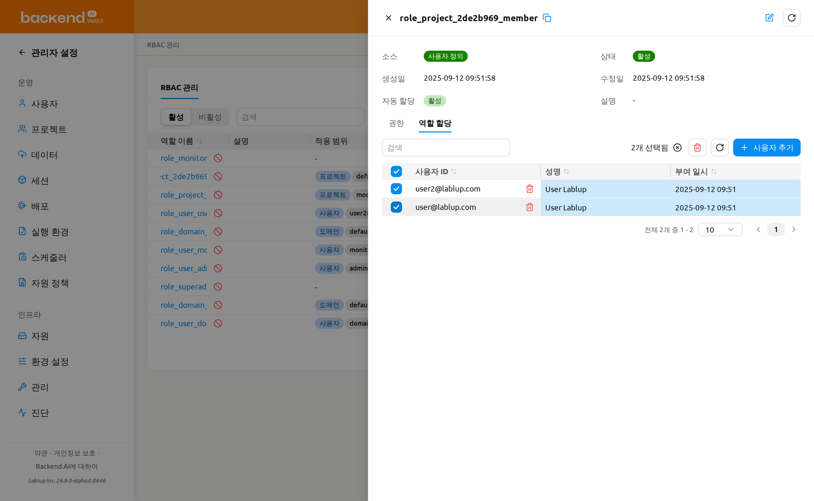

사용자를 해제하면 해당 사용자의 역할 할당만 제거되며 역할 자체와 다른 할당은 그대로 유지됩니다.

:::note
역할 할당 해제는 **역할 할당** 탭에서 사용자를 다시 추가하면 복구할 수 있습니다.
:::

## 프로젝트 관리자 권한 부여

프로젝트를 생성하면 `role_project_<project_id>_admin`이라는 전용 역할이 함께 생성되며 여기서 `<project_id>`는 해당 프로젝트 UUID의 앞 8자리입니다. 이 역할에 할당된 사용자는 그 프로젝트에 대한 [프로젝트 관리자](#project-admin-features) 권한을 얻습니다. 즉, 시스템 전반의 슈퍼 관리자 권한을 갖지 않고도 해당 프로젝트의 사용자, 세션, 배포, 스토리지 폴더를 관리할 수 있습니다.

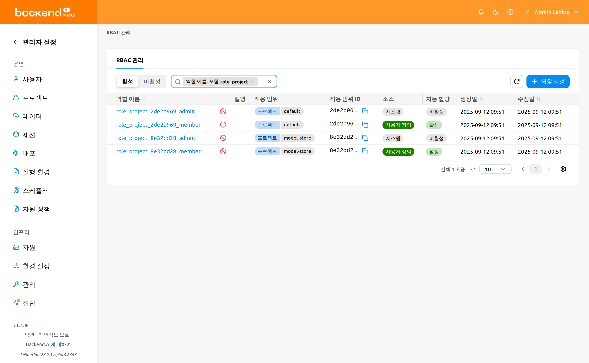

프로젝트 관리자 권한은 프로젝트 관리자 기능 챕터의 [프로젝트 관리자 권한 설정](#set-project-admin)에서 설명하는 **프로젝트** 관리자 페이지의 **프로젝트 관리자 권한 설정** 원클릭 흐름을 통해 부여하고 회수합니다. `role_project_<project_id>_admin` 역할은 시스템 역할이므로, 여기의 역할 할당 탭은 **읽기 전용**이며 확인용으로 제공됩니다. 역할을 열어 현재 프로젝트 관리자 권한을 가진 사용자를 검토할 수 있습니다. **프로젝트 관리자 권한 설정** 모달은 RBAC 바로 가기를 통해 이 역할의 상세 패널로 다시 연결됩니다.

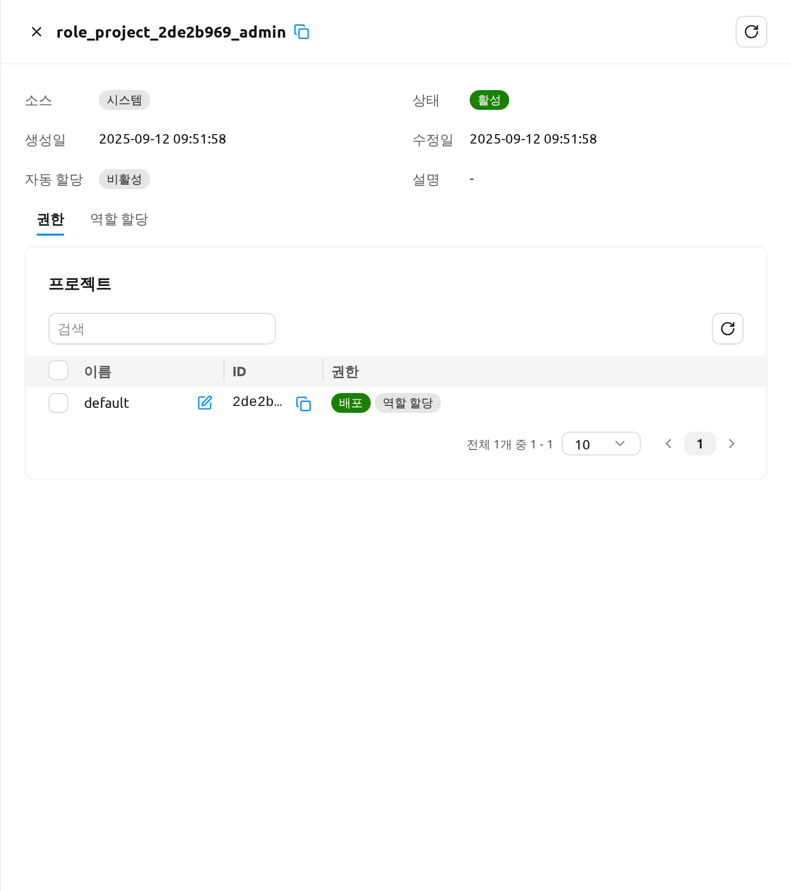

권한이 부여되면 사용자에게는 즉시 프로젝트 관리자 권한이 적용됩니다. 다음에 헤더의 프로젝트 드롭다운을 열면 해당 프로젝트 옆에 프로젝트 관리자 배지가 표시되며 [프로젝트 관리자 기능](#project-admin-features) 챕터에서 설명한 프로젝트 관리자 전용 사이드바 항목도 함께 나타납니다.
